# 2024B站最值得看的黑客教程 ｜ 网络安全／渗透测试／内网渗透／漏洞挖掘／web安全／kali linux／红队靶场／CTF／信息安全 - P160：真题练习—非洲之旅 - 网络安全免费学 - BV1uBsTetEow

下面呢我们就通过具体的题目。来看一下我们键运用一下我们刚才学到的知识。

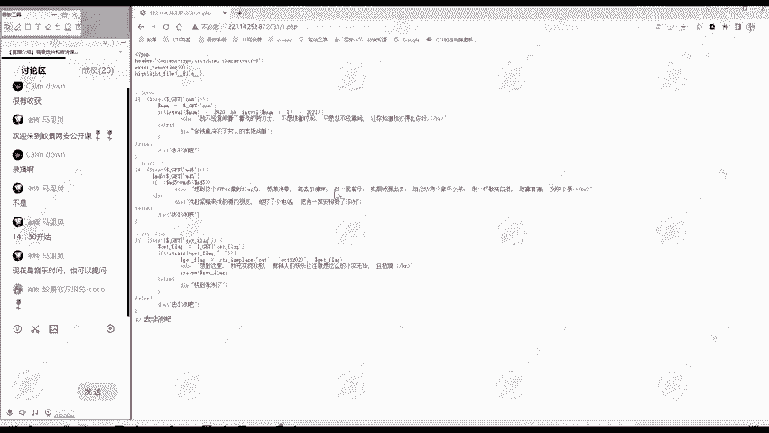

那么这里呢打靶赏是布署在我们一警四野靶抢当中的这个题目，这里呢已经给大家讲打开了。😊。

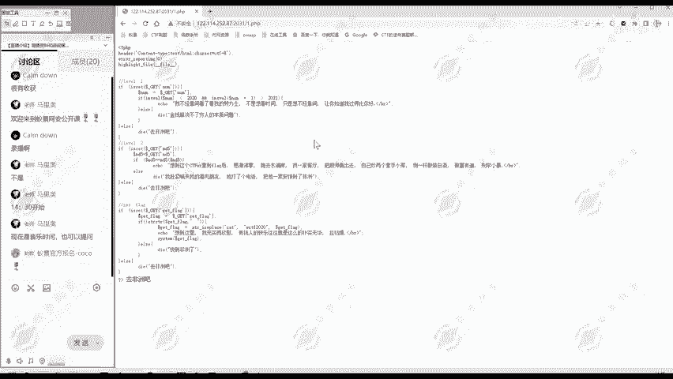

顺便给大家讲一下我们做外部题目的一个思路。大家打开这道题怎么做呢？😊，那么我们做一般的web题目啊都要进行。第一步呢就是进行一个信息收集。就关于这个题目的信息有哪些？

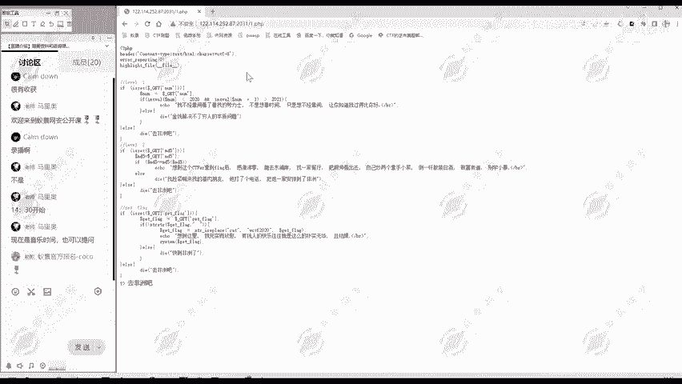

那么这个题呢怎么进息收集信息收集？我看URL看标题啊，这都没什么。然后看网页啊就明显的代码。

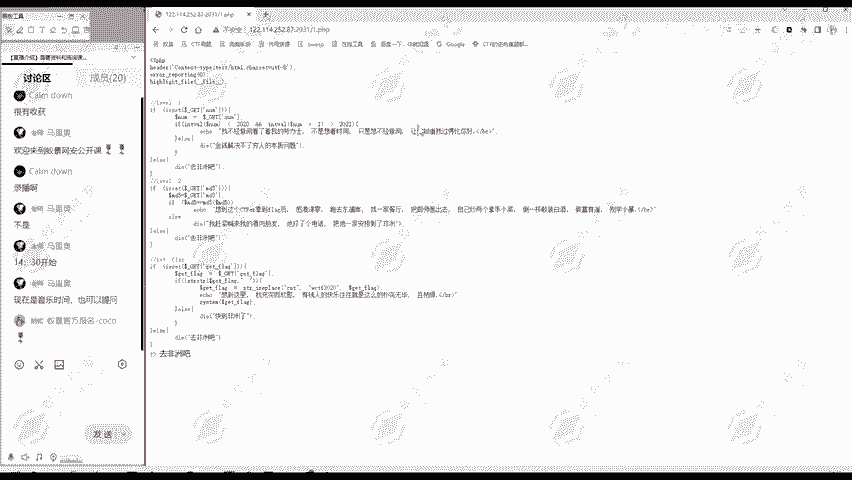

那有这么多代码肯定是要分析我代码，分析，让我分析这样的代码嘛，就是一种代码审计的题目。

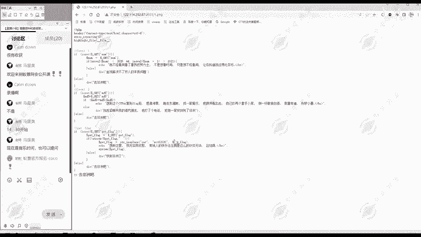

所以说这个题目的思路。还是挺明确的，就是要分期这段代码。

当然我们也可以看看源代码当中有没有什么额外的信息。源代码当中呢也没有什么注释，或者说额外的代码。

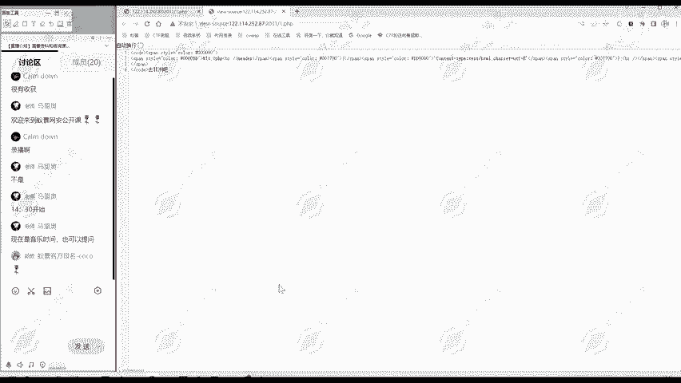

那现在我们的任务呢就是要分析这段代码。

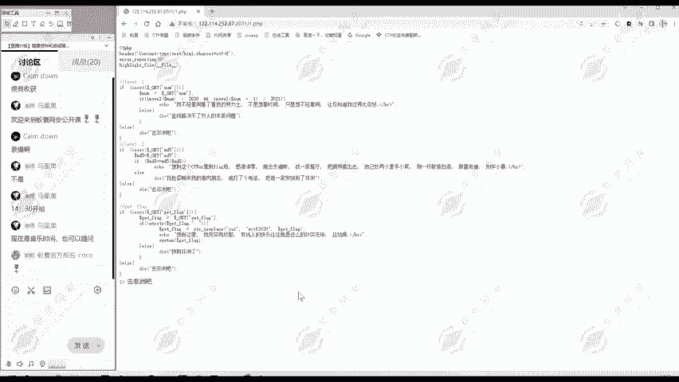

但这里呢明显是1个PHP代码。然后分析P去P的代码有个什么要做的呢？我们要点击右键啊，进入个检查。检查当中呢有一个网络，大家实际上就是进入开发者模式啊，大家浏览些开发者模式里面有个网络。😊。

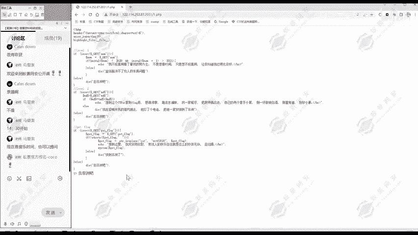

然后我们刷新一下。查看一下网络访问的请求。当然你用bp抓包啊，这些都是可以的。这个请求里面呢有一项X泡着 by。有这一项。这项是呢是说明我们这个题目这个靶场它部署环境是什么？这里是告诉我们呢？

我们服务器的PCV版本是5。6。40。因为有些题目它是跟PCP版本相关的，所以在这里呢我们就可以看到PCP的版本。这对我们后面的。做题啊可能会有帮助，但是也可能用不着。因为有的题目它跟PPP版本无关。

这里是查看我们服系语言的版本，在这里。那么知道完本呢，我们开始做题。那么像这种代码量不多不少的，我们可以先不用进入到细节当中，可以逐渐整体上分析一下。那么呢整体我们这个代码可以分为四部分。

那么第一部分呢就是啊设置响应头啊，不报错啊，然后显示原文件。😊。

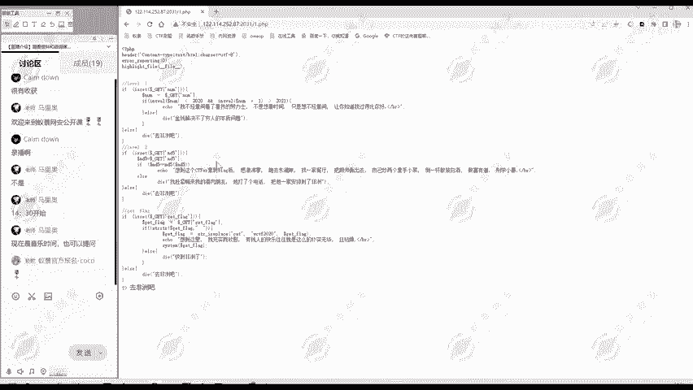

这都没啥，跟题跟我们解题不是很相关。然后下面这部分if else一个判断，而且有个注释nvel一。第一关嘛。

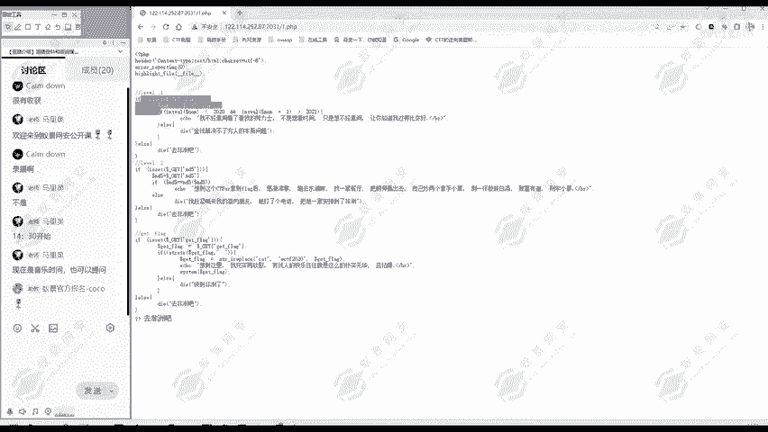

然后下面呢level2也是个if else判断。在下面第四部分get flag。也是if else判断。那么这个程序的执行呢是从上往下的。所以说通过这样的分析呢。

这个题的思路我们差不多就明确了是些什么思路啊。就是从上往下，我先通过第一关，再通过第二关，再通过第三关。那么CTF比赛呢就是要拿flag。那第三关呢就是也给我们提示get flagag。

就是要获取flag。所以呢我们现在可以把注意力集中的第一关，也就是逐步逐行的分析第一关代码。这时候呢就就不能跳着看了，叫逐行的分析。

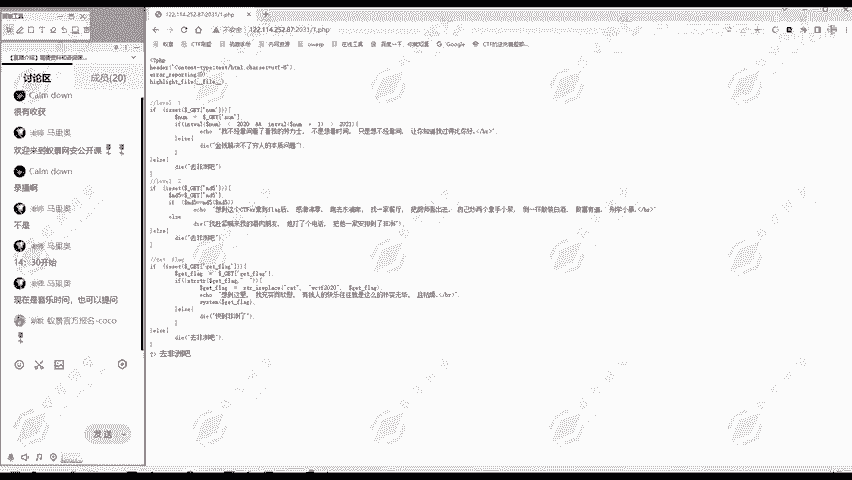

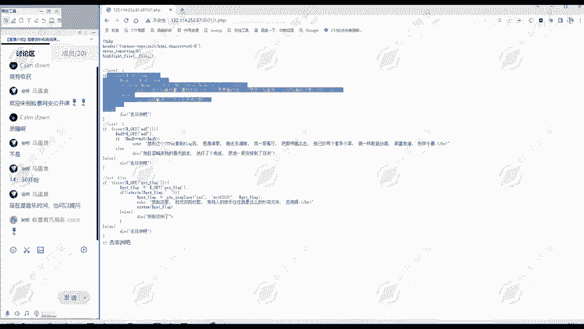

其他代码呢我们可以先不用看。那我们看第一关代码是干什么？首先呢是一个if判断，判断什么是否传递的，用get方法传递到NUM这个参数。😊。

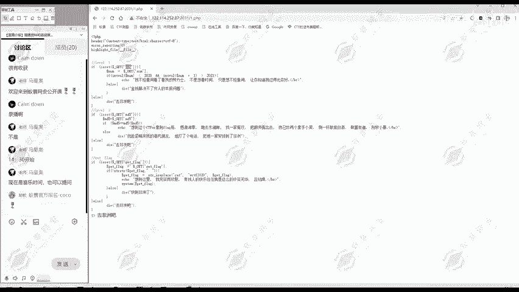

传递呢就执行这里面操到没有传递呢就。

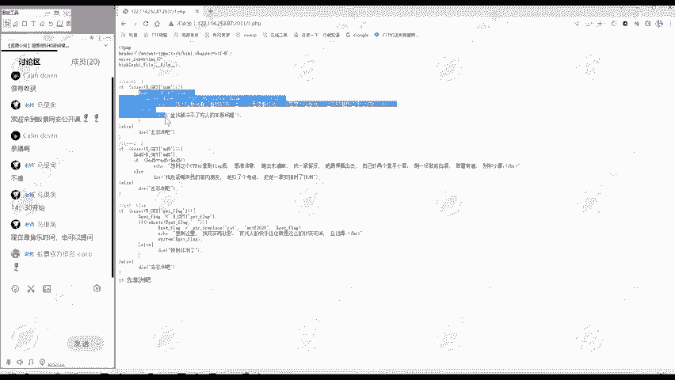

执行退出程序，然后显示了去非洲吧。那么最后有个去非洲吧。这就是程序执行的结果。因为我们现在并没有传递NUM。

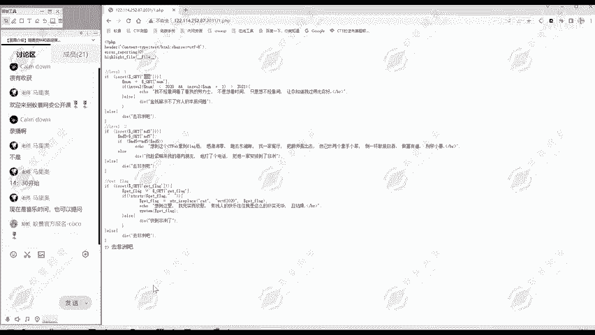

那它既然要要我们传递这个NMM都有参数，那我们就传递试一下。看一下什么效果，怎么传递呢？这里可以使用黑霸这个工具。然后呢，我们n把这个URL加载起来。然后get传参怎么传参啊。

就在我们路径后面加一个问号，问号后面是什么呢？注意这里啊输入英文符号，问号是参数名，参数名是NUM，然后参数值值就随便输1个123。测试一下。那么大家看到最下面的这个文字呢就变了。他不是啊去非洲吧。

他是呢金钱解决不了穷人的本质问题。在这里说明程序走到了这里，那么看程序是怎么走的。首先呢查看我们是否传递到AM参数，现在传递了，然后就到里面。把这个参数值123付给NUM这个变量。然后呢。

对这个变要进行一个int操作。int操作呢就把它转成为整数。要求呢把这个变量转换成整数之后，小于2020。如果小于2020，并且呢这个变量加一转换成整数之后大于2021。如果说满足这个条件呢，就输出啊。

不经意间看到劳力士。不满足呢就退出程序，然后输出金钱解决不了出问的本质问题。从最后的响音来看。我们是不是？这个衣这你的衣服判断没有满足啊。那现在呢为呢通过第一关，显然不能让程序带，不能让程序退出。

就满足这个条件，怎么满足呢？那我现在输入的是123，它转换成整数呢就是123，它确实是满足小于2020的它加一之后呢，那肯定是不大于2021嘛。怎样找到这样一个数，它转化成指数本身呢是小于2020。

加一就会又要大于2021。有存在这样的书吗？大家想一想。是否存在这样的数？小于2020加一之后呢，大于2021。建议给大家思考一分钟，大家看存不存在这样的数。存不存在？肯定是不存在的。

没有任何一个数满足这个条件。那这个判断能否成立呢？现在它又必须成立我们这个题目才能解决。所以说这个时候就不能想我要找到一个数符合这样的条件，而想这个判断是不是有什么问题呢？

那这里面用到了什么函数interval这个函数有没有什么安全问题呢？他是有的。在P7P5当中啊，当然在P7P7已经修复了，不存在这个问题。但在P7P5当中呢，interver这个函数。

它处理科学技术法的时候有问题。比如说我出出入一个。科学技术法。比如说214就2乘以10的4次方嘛。就是2万。这个这里呢是科学技术法，它的数字就2万inter处理这个214的时候啊。

它不会把它当成科学技术法。所以说interver这个214呢就得2。但是呢后面这里呢先把这个 number板加一。先加一的时候，那他要当成科学技术吧，加一就是多少？2001。就变成普通的数字2001了。

然后你再进行一个取它整数，那就是2001，就能满足这样的条件。我们执行一下看看。那现在呢输出结果又变了，不经意间看了看我的劳力士。是吧输出这里说柄呢下面的这个if判断我们。通过我们的构造。

通过interver这个。函数它的漏洞的利用。满足了这个判定条件。那么第一关呢可以说就通过了。所以说第一关利用的关键呢就是要。首先要看懂这个代码，它是要你判断什么干什么。

其次呢要知道interver这个取整这个函数它存在的问题。它在PHP5的版本中呢。处理科学技术法会出错。啊，对第一关相信大家应该理解了。不理解的同学可以随时发问。那我们现在第一关既然通过了。

我们就继续往下面走。看第二关。第二关是干什么呢？首先是一个判断有没有传入MD5这个参数，那没有传入来，直接退出去非洲吧。这就是这里的去非洲吧。那同样的，我们也做一个测试，那现在就是传入一下嘛。

怎么样传入两个参数呢？注意到第一个参数不能删除，删除你第一关都通过表，不存在进入第二关了。第一个参数保留传递多个参数呢，就用and符号做分割。你加一个and for，然后第二个参数的名称MD5。

然后它的值比如说也是拿123做个测试。然后执行一下。那么现在呢啊不是说去非洲吧，是喊南九肉朋友把他安排到非洲，我们看一下。这里是到这里，那就直行到这里了。我们看一下怎么执行的第一关，通过之后进入第二关。

是否传接MD5制这个MD5这个参数呢传递了。建之后呢，把它的值付给MD5这个变量，然后做一个判断。这MD5这个变量，它自己的值和经过MD5计算后的值如果是相等的。就输出啊想要拿到flag。

否则呢就是安排到非洲。那根据我们现在显示。是不是MD5值MD5这个变量的值123和经过123计算后的MD5，它们不相等啊。这你我们本地可以测试一下。那么123提供MD5运算之后是啊这一串。

它和它本身呢肯定不相等。那现在呢。你看如果不相等，就但就退出了，不存在第三关了。所以说我们一定要使他们要相等，怎么样使它们相等呢？啊，这里给大家留两分钟时间思考一下，结合我们。

今天第一部分讲的知识若相等的知识，思考一下这里呢是怎么做到相等。老师先喝口水。这里呢？大家可以回顾一下我们讲的。M第5绕过问题。是不。注意到这里，它所谓的相等呢是两个等号，是不是一个弱相等问题啊？

那么若相本问题。叫构造它的MD5值呢是0E多少的形式。我们。核星GB0亿多少行驶。大一下，如果说。我这里的MD5本身呢是等于。0E多少，然后它经过MD5运算之后呢。也是等于01多少。

他们俩是不是就弱项等呢？那这样的MD5存不存在呢？存在有非常多。这里呢也是给大家收集好了。比如说。这就是一个符合条件的MD5，我们进行一个测试。大家看。这样一个字符串0亿多少？

0亿0000027经过MD5直计算后呢还是0亿。这样就满足条件。所以说我们这里呢令MD5等于。像这种特殊的MD5。大家想这样他会不会满足条件呢？这样进入MD5，它本身呢是0E00。然后MD5运算之后呢。

我们这里进行了测试是0E55，那么都是科学技术法。它的值呢都是0乘以10的多少次方，那0乘以10的多少次方呢，当然是等于零的。所以说这里呢就满足一个弱相等了，我们可以执行一下看看。那么现在就得到了哎。

想到这个CTF拿到flag后怎么怎么样？是不是就这里输出了，证明我们前面的这个判定是满足要求的。那么现在呢就进入到第三关了。对于啊第一关第二关我们是怎么突过的？大家理解了吗？有不理解的同学欢迎提问。

大家大胆的提问，没关系，有任何不理解，都请提出来。我看我们听课同学挺多。都理解了吗？那么继续往后面看。第三个呢，这里有个提示，get flag，那说明很接近我们的目标了。那我们C打CTF比赛呢。

就是为了获取flag。那么看第三块是一个怎么样的？条件看代码第一行了，就是进行判断哎是否传架get flag这个参数。😊，如果没传递呢，就是带去非洲吧。那么现在还没传递。用同样的方法。

我们传递第三个参数，首先加这个and符号，然后呢是参数名get flag。等于呢参数值。三的值呢同样用123做一个测试。那么输出的是什么？想到这里，前面两行是我们一二关进行输出啊。

最后一行是第三关的输出啊，充实而兴味，有钱人的快乐就是这么朴实无华，是不是输出在这里啊？😊，那我们看它是怎么执行的。前面两个通过之后，哎，是第三关是否传输get了 flag，那我么们传输了。然后呢。

把这个变量的值呢负给给它flag。这个变量就12geflag现在等于123。然后看这里是进行一个什么。Sray， straight。就是。寻找字符串的位置。是什么呢？就是你后面是空。

空格就get flag这个变量的值是否还有空格呢？如果有就是。返回它的位置没有就返回forse。啊，前面有个感叹号，就是否定。比如说这个if服沉列条件呢，get flag它的值里面不含空格。

如果说不含空格的话，就到这里输出。那我们现在呢是没有含有空格的。所以说这里呢是满足，如果含有空格呢就带这你就告诉我们啊，我们传递的get flag，它的参数值不能带有空格。😊，如果说没有空格的话。

就走到这，这里是这什么strI replace，这也是一个函，这函数作用是什么？大家说replace就替换这个I呢就是不区分大小写。😊，它里面有三个参数。开。

这个WCTF以及g flagag它有什么意思呢？😊，就是在get flag当中找有没有ca这个字符串，如果找到了，就替换成WCTF。当然它是不区分大小写，就是说大写的K的也行。

只要找到CAT这个字符就替换成大们的CTF。这实际上呢是对字符串的一个过滤。大家后面做CTF的题目的时候啊也经常会看到。就是有很多这种对他觉得危险的字符的一个过滤，他把它替换成空啊，或替换成别的字符。

所以说我们get flag当中呢不能使用cat，因为你使用cat就被替换掉。然后呢，就输出想到这里啊，充12星位。那么这个我们的输出是一样的，就走到这里。最后呢哎有个system，ge flag。

system嘛我们知道就执行系统命令，别的 flagag呢是我们传递的值。😊，如果说这里我们传递的是系统命令，是不是得到执行了？那么目前看来是这样的，通过这里分析呢，我们第三关可以执行系统命令。

但是呢要注意两点，第一点呢是不能带有空格。第二点呢是不能有cat，不能有CAT。那么就不带空格试试。比如说执行个LS。看一下。哎，发现它确实得到执行给我们输出了。

那么当前目录下LS就是查看当前目录下有哪些文件嘛，给我们输出了有1点PHP2点PHPflag点PHP以及index点PHP。那我们要想要获取的就是flag。现在呢就想我要查看flag点PHP的。

文件内容是不是？怎样查看文件内容呢？我们一般的方法就是cat flag点PHP。但是这种方法有两个问题。第一个你使用了空格。我们可以执行一下。就直接输出快到非洲了，这个判定条件就不通过。他就不会。

给你执行系统命令，所以说我们不能使用空格，那么要执行命令，又不能使用空格怎么办呢？我们就要。使用一些替代的方法，就是有些字符啊。它不是空格，但是能起到空格的作用。这种哪些单因有很多，比如说。

我们有多呢包括IFS。这就可以它起到空格的作用。但是呢它不是空格，这种是专门用于绕过对空格过滤的。大家为了在比赛中取得好成绩呢，也要收集这种。就是过于到空格怎么办呢？过于到引号啊。

过滤到某些特定的字符啊，都有对应的解决办法。我们再执行一下，这时候呢注意到就没有空格。他不会快到非洲了。但是呢他也没有执行文件的内，给我们显示文件内容。为什么？因为cat被过滤了。他被替换掉了。

那cat被替换掉了有哪些方法呢？那么最简单的就TAC把它反过来，cat呢是查看文件内容，是从第一行到最后一行。那么这个TAC呢是相反，从最后一行到第一行显示文件内容。😊，我们可以查看一下哎。

这样我们就查看到flag点P区别的内容了。那么我们就看到了flag。那么这道题的三关呢，我们就一关一关的通过了。这个过程中呢，我们也是熟悉了代码，通过练习。因为有的同学可能不太熟悉P区B代码。

一看到有这么多代码。🎼啊，就不想做了，其实没有必要，我们把它分拆成。这个开始的一部分，以及剩下三关，总共四部分，然后每部分分别的在看。那就不复杂了。然后每部分呢每一行逐渐的看逐行的看。把每一行都看懂。

那么这道题呢我们就做出来。大家对我们这道题有什么疑问吗？有疑问的同学发欢迎提问。老师先喝口水，给大家两分钟的思考时间。啊，那我们徐荣同学很好提问。MD5括号MD5等于MD5，这个是怎么解的？

那么这个提问提的非常好。啊，首先我们。我们注意啊，这里它是怎么样。我们把这个命令可以复制出来。比如说复制到我们的笔记当中。大家注意到这里呢是放大点，这里呢是两个等号。两个等号我们这节课取会的是弱类型。

它是一个弱相等。那么。首先这样他们俩是不可能完全相等的，这种是不存在的。只能说通过弱相等的这样一个问题，使他们俩哎差不多一样。什么叫差不多呢？就是要使第1个MD5，它等于1个0E。后面叉叉叉叉的形式。

然后呢，并且他经过MD5计算。之后呢还是等于1个0E咔叉咔咔叉这样的形式。那它们俩进行若相等，是不是要转换成整数啊？那么转换成整数呢，这个亿。我们课间讲了是不是科学计术法。

科学技术法就0乘以10的多少次方。零乘时的任何次方，零乘任何数它都得0。所以这两者转换成数字之后，事实上呢都是等于零了。所以说他们俩是弱相等的。那么像这样的MD5是否存在呢？是存在的有。有很多，这里呢？

也是给大家总结了。比如说我贴在我们的。这个课堂笔记当中，像这些都是我们随便选一个都是满足条件的。比如说我们就选最后一个。我们现场计算一下这样一个值，它的MD5值是等于多少？

那么这里看到了它经过MT5值计算运算之后呢，还是0亿多少，是不是？所以说他们俩是一个弱相等的。我们可以在本地这里测试一下。比如说我们定义多了A等于。我们刚才这个变量。那么现在我们要判断的是什么？

我们用Yd输出结果。哆啦A。以及呢MD5。哆啦A。他们两的值是不是相等？大家看看啊两个相等的时候，两个等号若比较结果是吧？处是相等的。但是你如果使用三个等号，严格比较了。那么当然是不相等的。严格比较。

它不会进行内心转化。那么就是0E033，你计计算结果0E077，它当然是不相等的。这里啊徐荣同学听明白了吗？有不懂的啊，随时可以提问。我们其他同学呢也是一样。这是我们第二关主要考察的内容。

所以说这些MD5值这种哈希哲比较看似。很难绕过。实际上呢。啊，每道题都有它的一个诀窍在里面，都有它的方法。肯定是不是直接找到一个一个数，它M经过MD5值运算不变。这样的数肯定是不存在的。

等于说找他在比较方面存在的一个问题。像这些。特殊的变量或特殊的MD5值，大家可以保存一下作为自己的一个笔记。当然我这里也做也是记下了作为课程笔记啊，想要这个课程笔记的同学呢，可以添加我们班主任。

这谢大家都。😊，记好作为自己的学课程，一个学习笔记。这样后面你打比赛的时候，或者说你自己平常练习的时候，遇到题目，遇到这种类型的比较，你直接从这里面随便复制一个就可以了。😊，其他同学还有疑问吗？有疑问。

欢迎提出来。对第一关呢第二关以及我们第三关。有任何疑问的都可以提出来。其实这道题的目呢是一个为什么我们已经把它部署在自己网上上，就是因为它是个很好的练习题目。😊，他分为三观，逻辑很清楚。

那我们这个解题的payload其实也是分三部分嘛，用and for做分割。传递三个参数。那每一关是考察什么，然后怎么样通过。相当于在这里面啊，这一个题目呢可以学到四五个知识点。

