# 2024B站最值得看的黑客教程 ｜ 网络安全／渗透测试／内网渗透／漏洞挖掘／web安全／kali linux／红队靶场／CTF／信息安全 - P162：为什么要学习反序列化 - 网络安全免费学 - BV1uBsTetEow

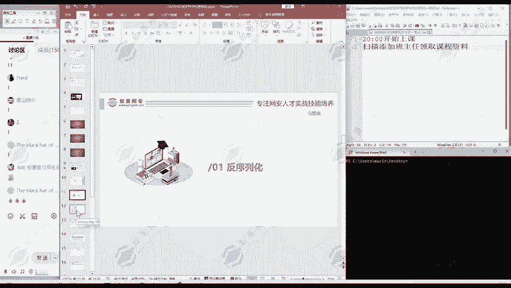

首先我们来看一下为什么要学习反学液化。

大家啊听说过这个over ten top ten这个漏洞吗？😊。

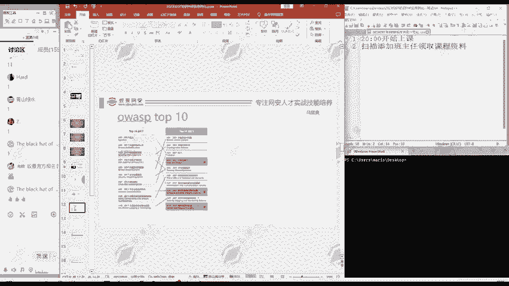

这个听说过没有？啊，听说过的同学请扣个一，没有听说过的同学听扣个2。

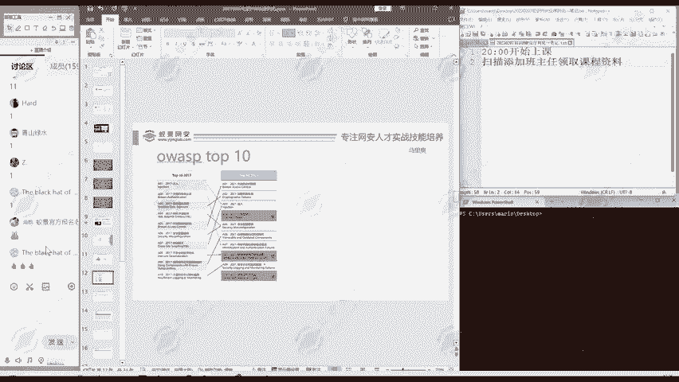

啊，那我们大家来听课都是对网络安全感兴趣的，应该都听说过这个。😊。

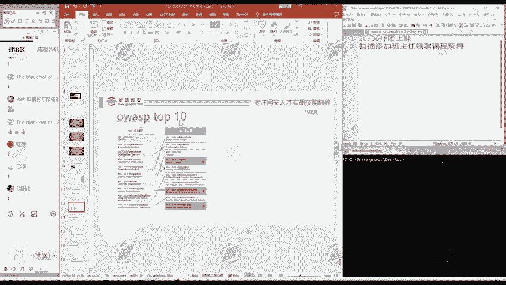

有很多同学听说过，但有的同学没听说我再介绍一下。😊。

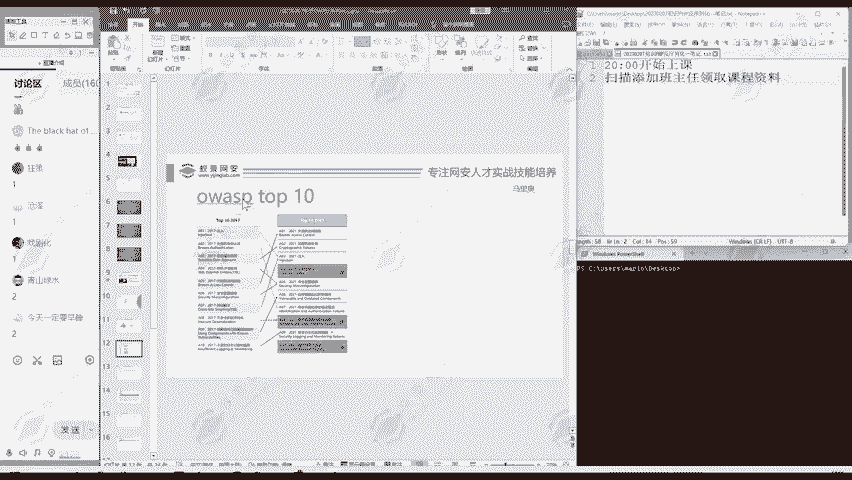

这个O top ten呢就是一个非常权威的组织，它评选的。

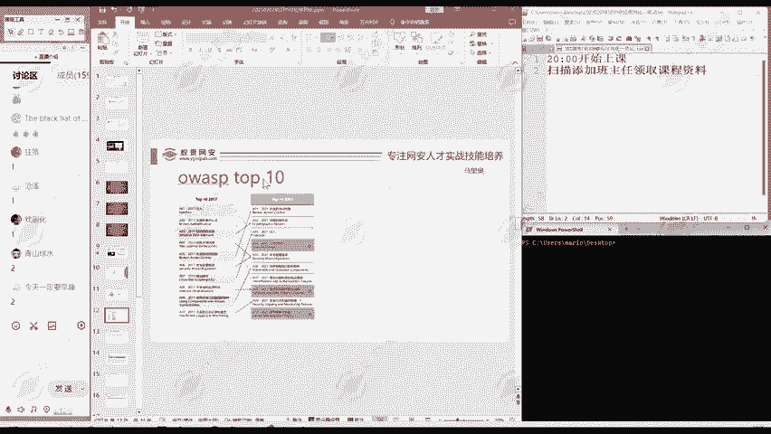

啊，10个最常出现的网络安全方面的漏洞。他是呢每四年评选一次。那么最近的呢就是2021年，是不是？那么再上一次呢，就2017年。还是每四年评选一次。他统计的呢就是网络安全方面的漏洞。

哪10个是出现的频均是最多的？

那么我们看2017年的是不是这里的08就是什么不安全的反序列化，是不是？

那么在2021年呢，它还归入到这里软件和数据完整性。这里其实也是反序拟化的问题。所以说这个反序拟化方面的漏洞，这个安全问题在我们网络安全中，在我们互联网当中出现的频率是非常高的。

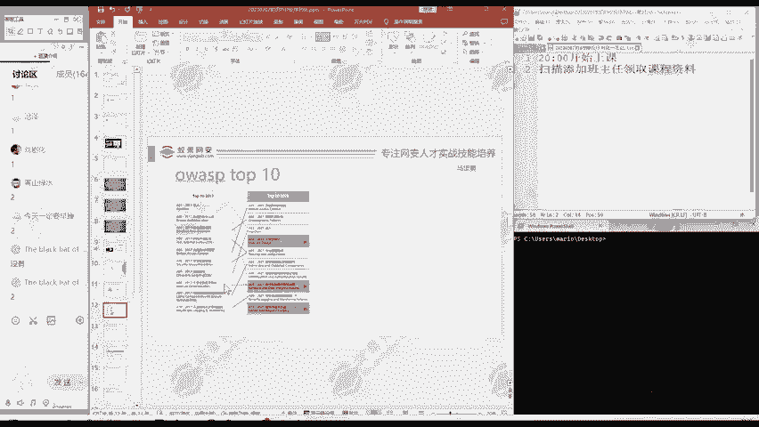

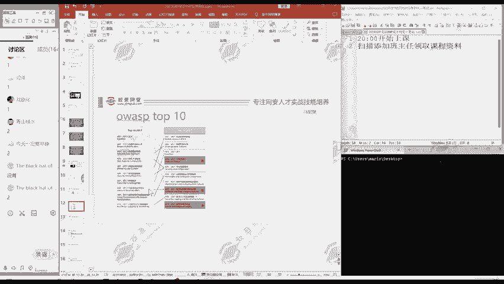

所以每次进行统计的时候都有它。

那么大家。

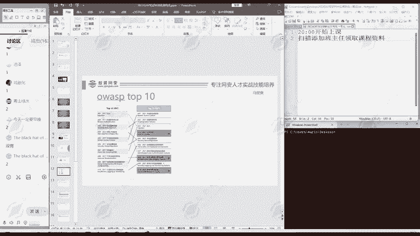

在求职在面试的时候，就或者打开boss直聘，看，是不是很多时候都要求你掌握over top ten的漏洞。那么呢我们就反序话，就是这里面有了一个重要漏洞。所以说我们必须要把它学好掌握好。😊。

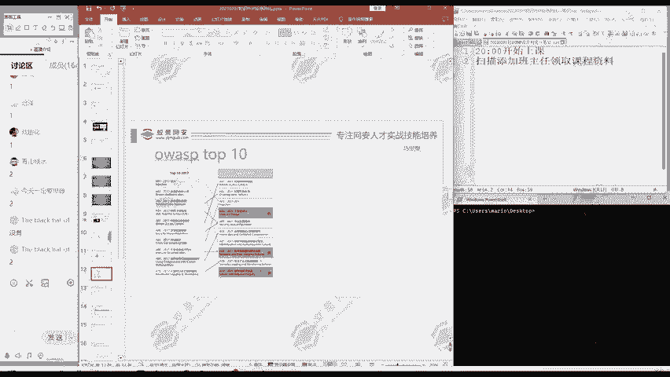

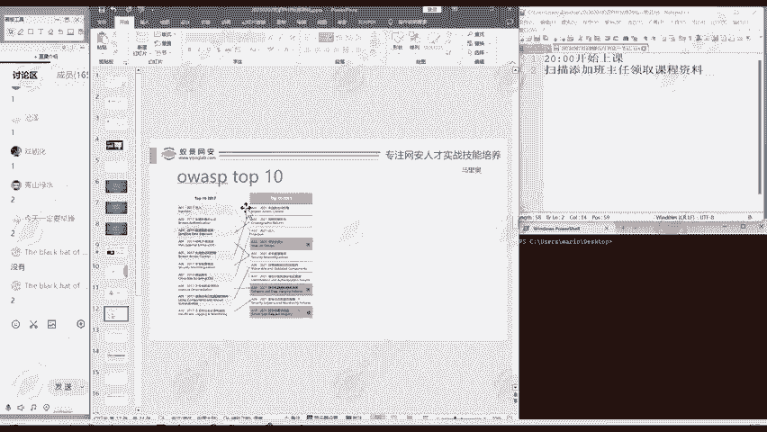

那么首先我们看一下。

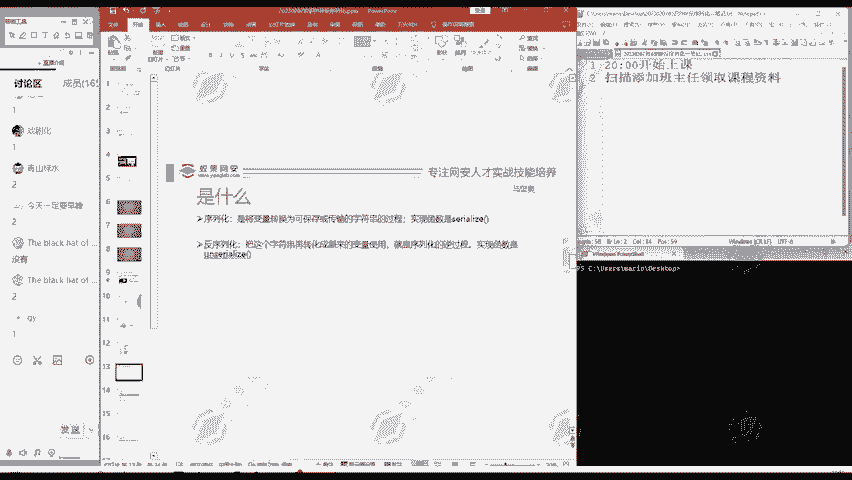