# 2024B站最值得看的黑客教程 ｜ 网络安全／渗透测试／内网渗透／漏洞挖掘／web安全／kali linux／红队靶场／CTF／信息安全 - P164：怎么进行序列化和反序列化 - 网络安全免费学 - BV1uBsTetEow

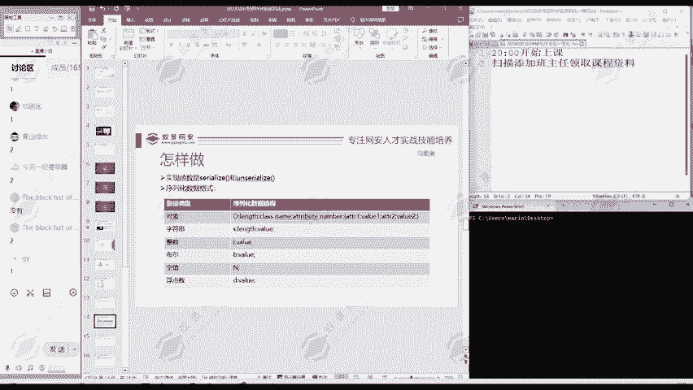

那么实现的函数是size和uncierize on就是否定嘛。size呢就有序列化。

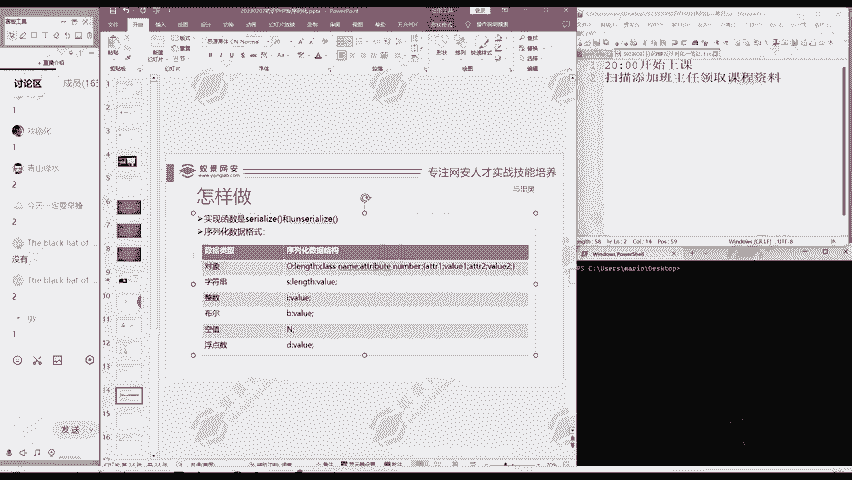

UN加上UN呢就否定就是反序列化。

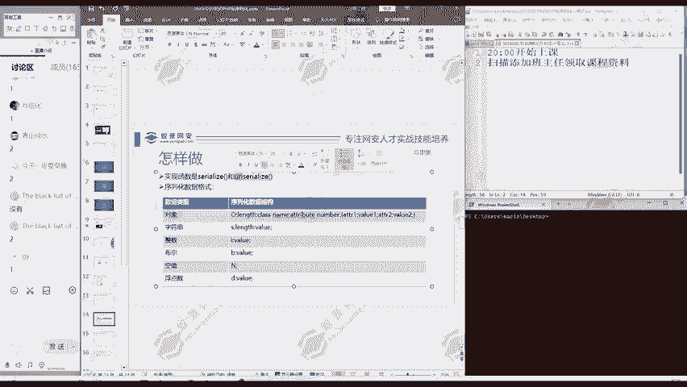

我们可以啊写一段代码来看一下。

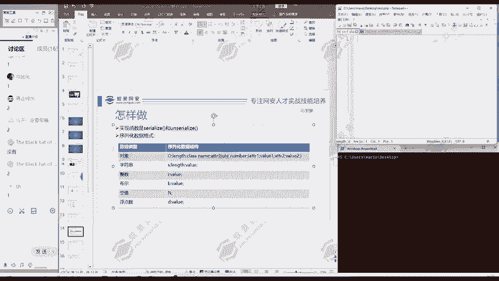

我们写的PPHP的代码。

先写1个PHP的标签。

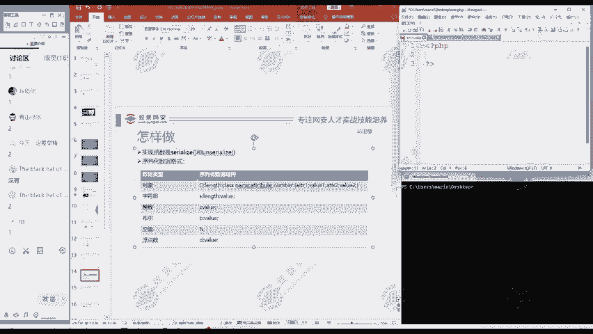

中间呢我们自己定一个类，比如说啊就定义student定一个学生类，是不是？

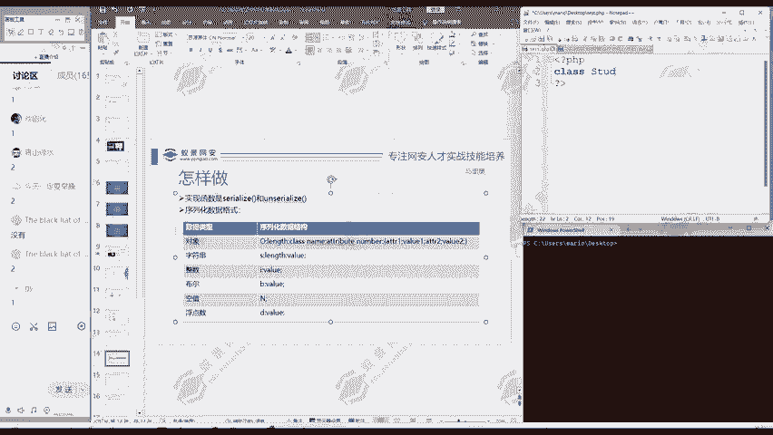

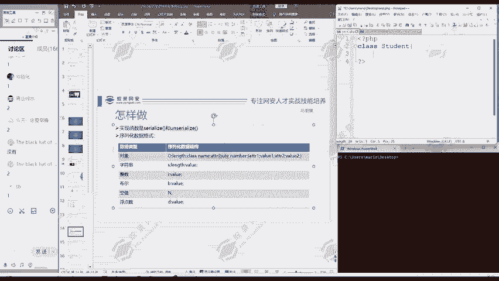

然后学生内里面呢有它的属性。有学生的。

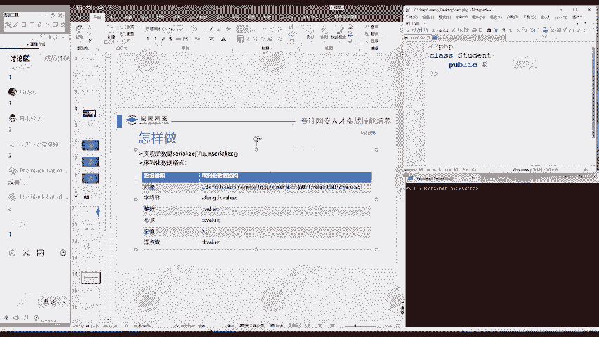

内蒙。

还有。再定义第二个属性，比如说gradeade啊，学生的得分是什么？他的成绩。

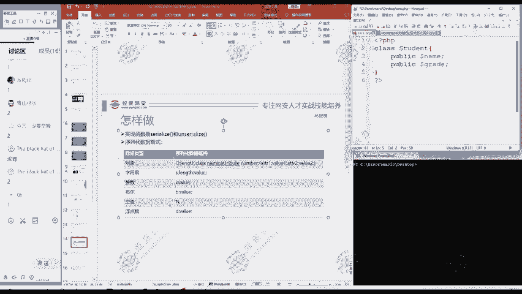

那么我们这里呢是定义了一个类。我们可以对这个属性进行一个赋值。

比如说啊学生名字就叫马里奥，然后成绩呢？

比如说90分，这随便举个例子。

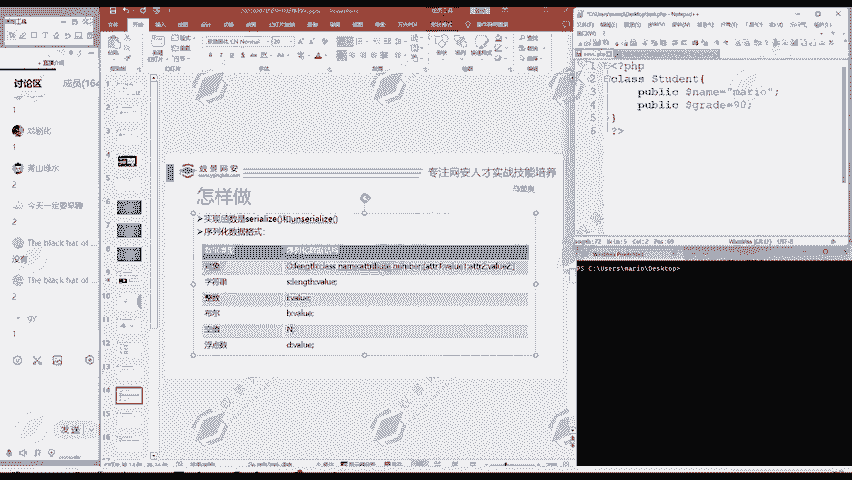

然后我们。生成一个。对象。

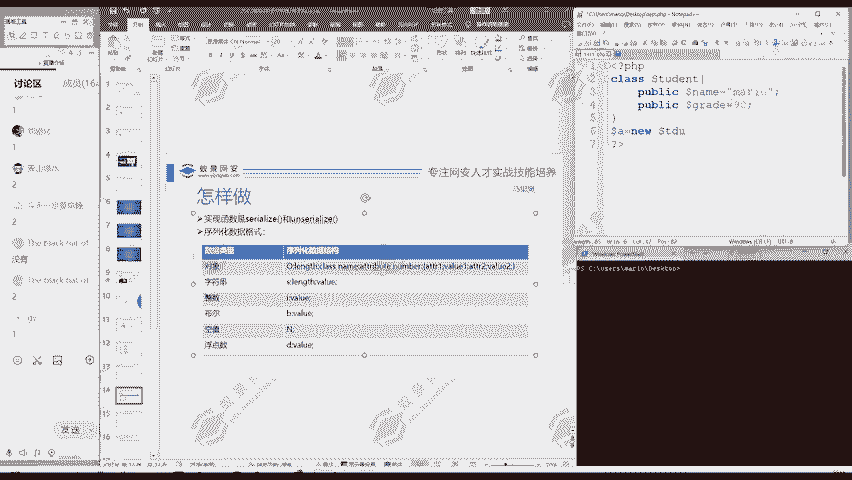

S。

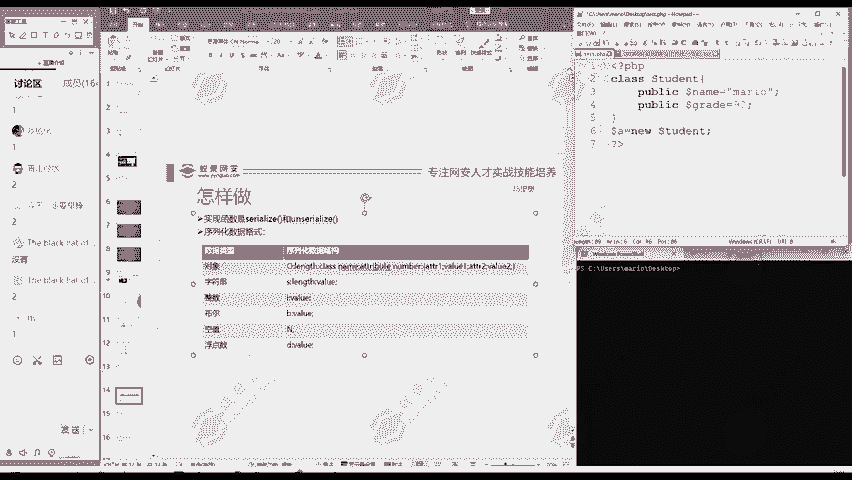

首先呢我们输出一下这个对象玩 dump。玩 dump呢就是输出。我们这个变量的内型和它的值。我们保存下，然后在下面这个终端里面呢，我们执行一下。这个PHP文件。test点P区啊，就是我们上面这个文件。

大家注意到啊，这里我是生成的哎，这个变量哎，这个变量呢它是一个对象，它有两个属性，是不是？第一个属性是name，属性名是name，然后值呢是马里奥。然后第二个属性呢，属性名是graded，值呢是90。

😊，这是变量。那我们序列化呢就是把变量转换成字符串，是不是如何转换成字符串？就像我们这里提到的seize。😊，这个函数，然后呢。括号里面是输入它要转化的这个对象，这个变量多来A。同样的我们进行一个输出。

那我们再次执行。哎，大家注意到。是不是现在就把我们唉这个变量。给拿平了，拿起一个字符串了。那这个字付账怎么理解呢？这里就要用到我们这个表，也就是虚拟化的数据格式。那么我们比如说我们这个对象。

它的格式是什么呢？首先是O表示一个对象object。然后呢是冒号，然后它的名称的长度，我们对照理解一下是不是。这是个对象，sdent。是几个字节啊，注意到7个字节是不是？所以说n呢这积就是7哦冒号7。

😊，然后呢，是student。然后后面是什么？在冒号后面是它属性的个数，这里呢就是2，然后再冒号，然后大括号括起来就是它属性的情况。😊，它属性是什么呢？首性第一个属性名是name。

这个属性名本身是一个字符串，字符串的格式是什么？就是我们这个表的第三行这里。😊，是不是？Sn value。S表示它的字符串。ns是几啊内蒙四字节，所以说是四，然后值呢是内蒙。

后面S5马里奥是不是再后面呢S5grade，最后呢哎grade值呢是90，它不是一个字符串，它是一个整数，是不是整数它转化成序拟化数据的规则是什么呢？就是I value。哎，加它值。I表示是整数。

然后这里的值呢是90。那么这就是一个完整的一个序拟化数据。它原来的变量是这样。这个对象现在拉平之后，成字符串是这样。要就是进行了一个序列化。那大家想主要进行虚拟化，那我能不能再把它恢复过来呢？😊。

恢复过来就是反序列化，这也是可以的。比如说我们定一个动段B就等于什么un serverer。ナイズ。这样呢就把我们的B给把这个变量A给恢复过来，复制给变量B。然后呢，我们把。变量B进行一个输出。

保存一下这个文件，然后在下面呢再执行一下。大家可以看到啊变量B，我们在中间先输出一个换行。是不是大家看变量B跟变量A是不是输出是一样的？这就是一个把变量转换成字符串序列化，哎。

又把序列化字符串进行反序化，恢复成原来的变量的一个过程。那么之前如果说对序列化啊有过一定了解的同学，那么可能看到这个字符串，这一串不知道是什么意思。现在理解了没有？对照我们的这个格式。

每一个都可以对应过来。这里进行一个序拟化和反序化的过程。大家有没有理解，有不理解的同学呢啊请在讨论区把你的问题提出来。

