# 2024B站最值得看的黑客教程 ｜ 网络安全／渗透测试／内网渗透／漏洞挖掘／web安全／kali linux／红队靶场／CTF／信息安全 - P166：序列化反序列化真题讲解 - 网络安全免费学 - BV1uBsTetEow

那么前面呢是我们讲的一些。跟序拟化反系化相关的一些概念。主要是照顾我们零基础的同学，没有之前没有听说过的。那么现在呢就算听说了序列化反序列化入了门。😊，那么光听还不行，必须还要来实战一下，练一下。

这里呢我们看一个啊演示的例子。😊。

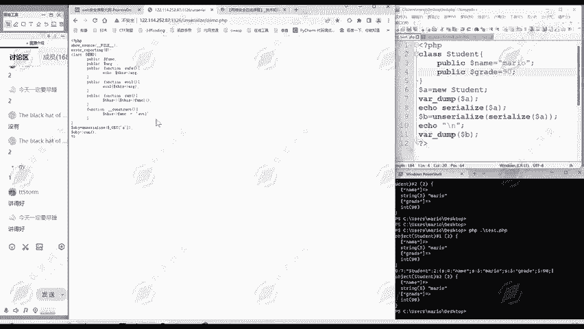

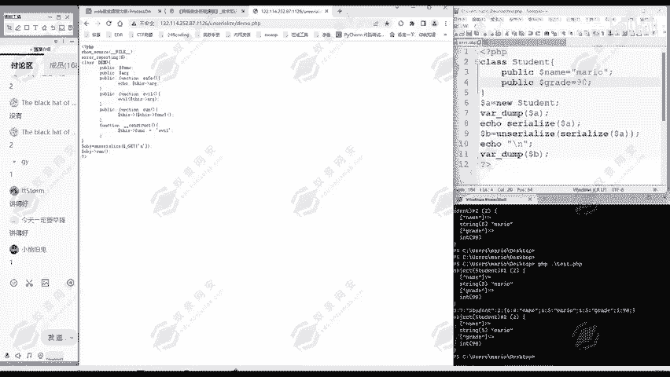

这是一个演示程序demo点PHP。大家看啊这个代码服这是服系养源代码。😊，那么他会不会造成一些危害呢？大家可以思考一下。那我们可以首先看一下源代码的一个逻辑啊，前面的是啊显示文件内容，这里是不报错。

这个跟我们关系不大。那么中间这部分呢大家注意到哎是一个定义的一个类，叫demo，是不是？😊，那我们先不进入这个内的细节，进入下面下面是什么？😊，哎，用get方式传递一个A参数，是不是？

然后呢进行一个反序列化，把反序列化的结果呢付给OBJ这个变量。然后执行OBGrun。

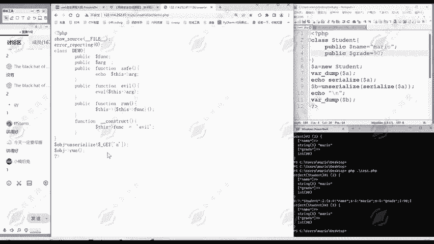

那我这里是不是就可以传输像这样的一个字符串了？那虚拟化进行反序拟化之后呢，就得了一个对象，这样的对象或者是这样的对象。😊。

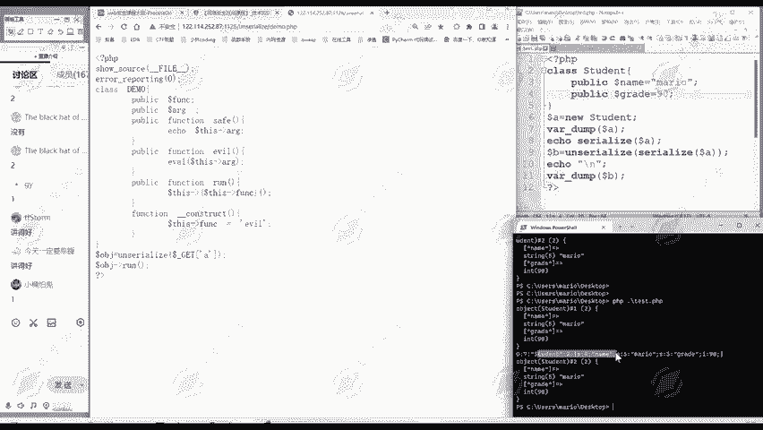

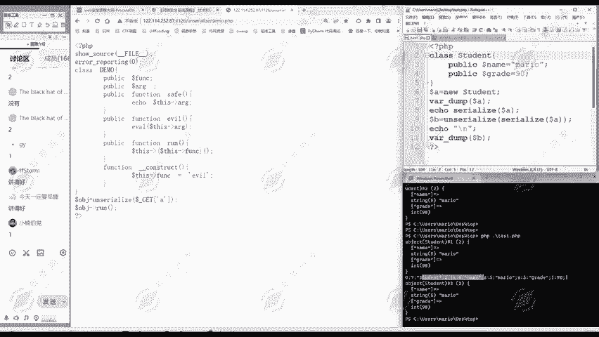

具体的什么对象，由你这个传递A的值来定义。然后就可以执行run。那我们看一下这个对象里面有什么呢？它有两个属性，FUNC和ARG这两个属性是不是？😊，它里面呢还定义了多种方法。

比如s方法就是输出ARG这个属性。那么e我方法呢，哎就是。这个EVL。ARG的值。那我们知道在P区当中的EVL，它会把它这里面的。代码当成PPP的代码来执行。如果说我们能够控制ARG的值。

大家想是不是就会让服器执行我们想要执行代码？那么这是一个风险。那么我们怎么触发这个风险呢？我们继续往后面看，还有个run这个方法。哎，它这里是中间是一个大括号。这里看起来比较复杂。

但是我们理解起来也不难，这其实就跟我们学习那个初中的时候学习那数学公式一样的。那么有括号的部分呢，我们先看括号。没有括号的部分，就是从左往右看就行了。那这你怎么理解呢？中间这个大括它是一个整体。😊。

this呢就表示这个对象自己。😊，它的FUNC属性的值放在这儿。然后呢，再这次。指下这个值。然后这个括号呢是作为函数调用的意思。这个小括号。那么这里还有construct函数，就是把FU值复。

值等于这个evvo。

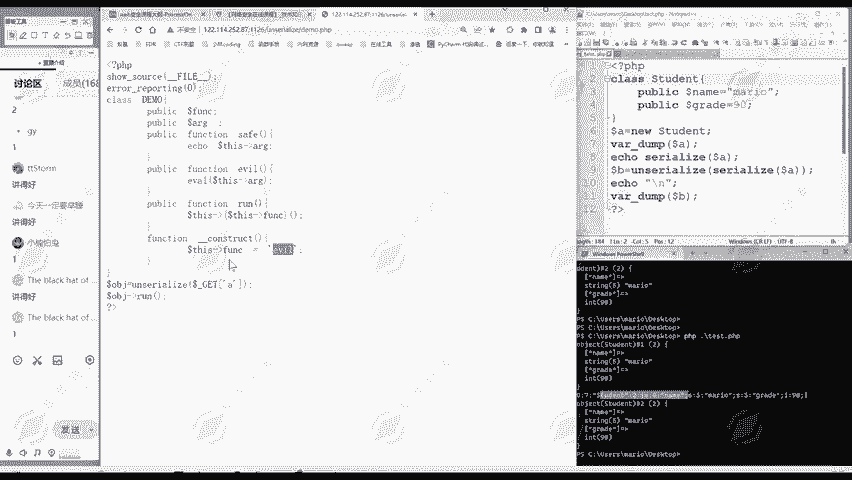

那么这是我们做的第一道反修要话题啊。

这里给大家我们一起总结一下如何做反序列化的题目。我们总结一下做题步骤。第一步就是。复制。源代码。到。本地。

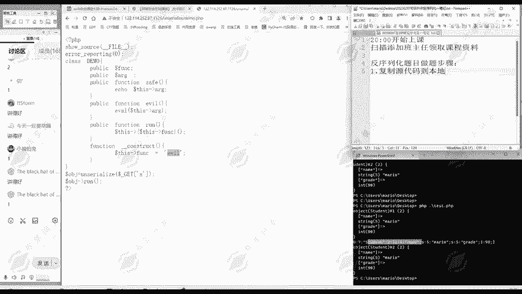

那么这个代码呢是服务器上的代码。那我们首先呢把它全部复制过来，到我们的本地，比如说到我们test点PP当中。😊。

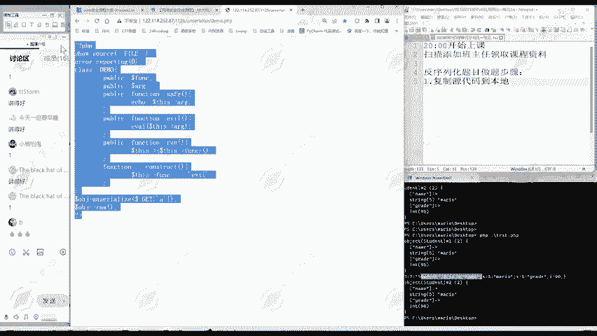

我把它贴过来。这第二第一步。那么第二步是什么呢？注释调。和属性。无关。的内容。

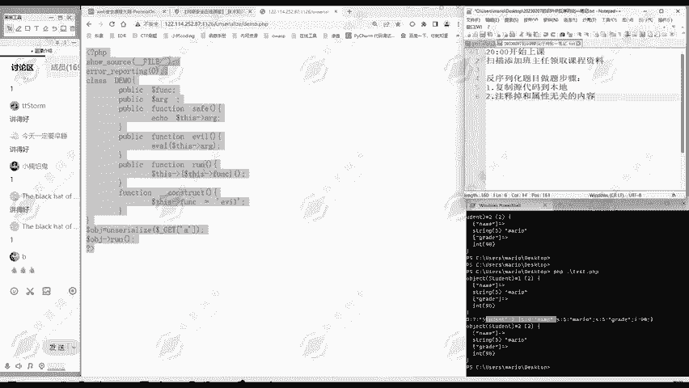

这里啊大家可以回过头来看一下我们。

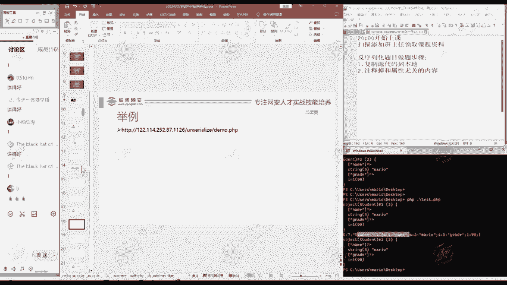

对于反序化漏洞的一个定义。我们控制的是什么？传入函数的参数，这个参数呢就是对象的属性。

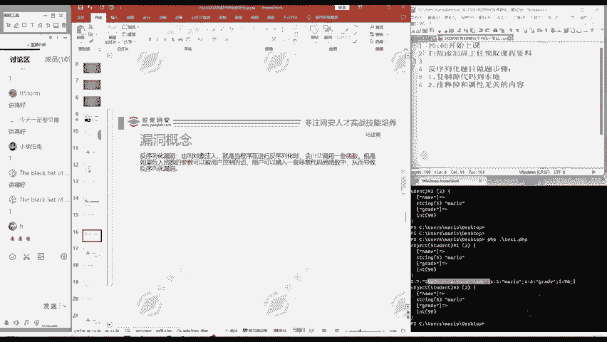

所以说跟属性无关的内容是不需要我们做修改的。

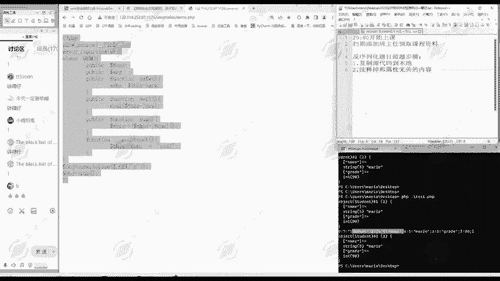

是不受我们控制的。比如说这里啊这就是跟属性无关内容，我们就注释掉。像这些函数，这都是跟属性无关的内容，我们都注释掉。下面呢这里啊，这也是跟属性无关的内容注释掉。那么只剩下这里跟属性相关的，是不是？

这是第二步啊，注释掉跟属性无关内容。第三步。根据。题目需要。给属性复制。这一步呢是最关键的。就是现在我属性是。啊，留下来了，我可以给它复值。我可以让它等于啊什么ABC啊都可以。😊。

但是我现在要它等于多少才能够实现我执行任意代码的一个目的呢？

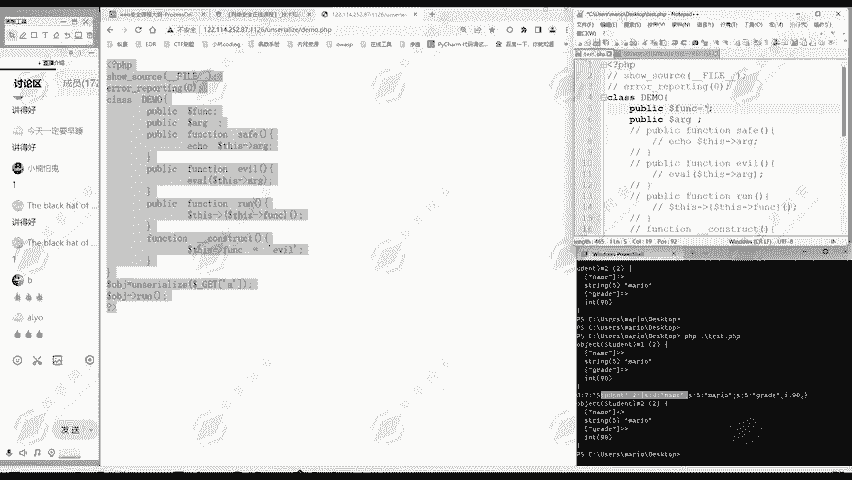

这就是要分析的这是最关键的部分。怎么实现？那么我们注意到这个evvo AR机，这里可以执行任意的代码，是不是任意的PP代码？那么我就首先就希望这个ARG等于多少？比如说我做一个测试啊，等于PHP in。

😊，那么由于这里是一木呢，所以我们最后要加上这个分号。那么ARG呢就等于PHP inPHP info，然后分号。那么怎么样才能到这里呢？我们进行反序列化之后啊，怎么到这里？

大家注意到它这里执行的是什么run，是不是？run他做什么操作，它就是会执行this FUNC。

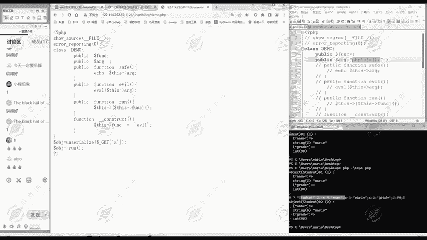

所以说我这里FUNC给它复制成多少，是不是给它复制成evl。比较合适啊。那么现在第二第三步呢，我们属性赋值就做好了。这是最关键的。那么第四步呢就是生成。是。序列化数据。通常。や。유아요。in扣。

通常要进行URL编码。我们生成序列化数据啊，首先我们生成序列化数据。😊。

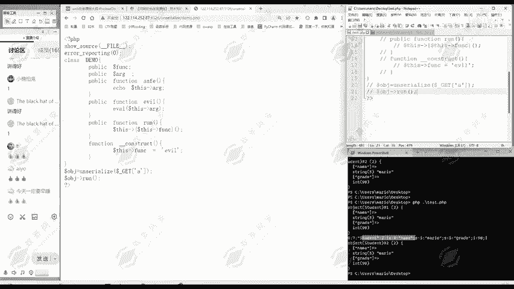

这很简单。比如说我们定义多了D等于6。

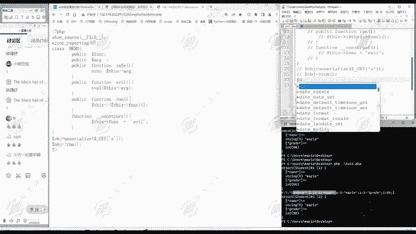

de吗。是吧这个内的名称叫demo。然后呢。我们可以。Civilize。然后这个多了D这就啊生成了。虚拟化的数据。但是大家注意到虚拟化数据呢，它这里面可能还有特殊的字符。那么在传输的时候。

可能会出现问题。所以说大家在初学者呢初学的时候就要养成好习惯。我们一般都是进行1个URL编码。

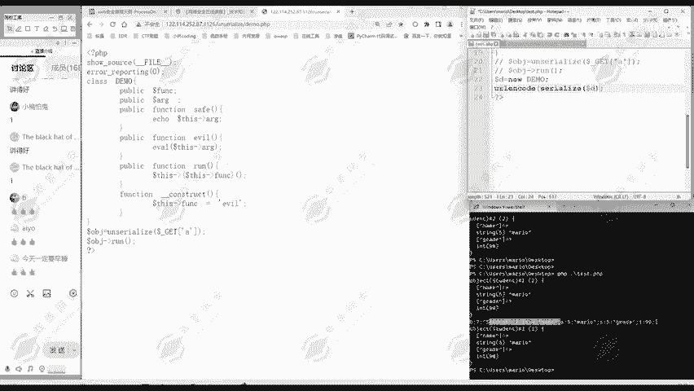

避免这里面有一些我们不可见的字符啊。

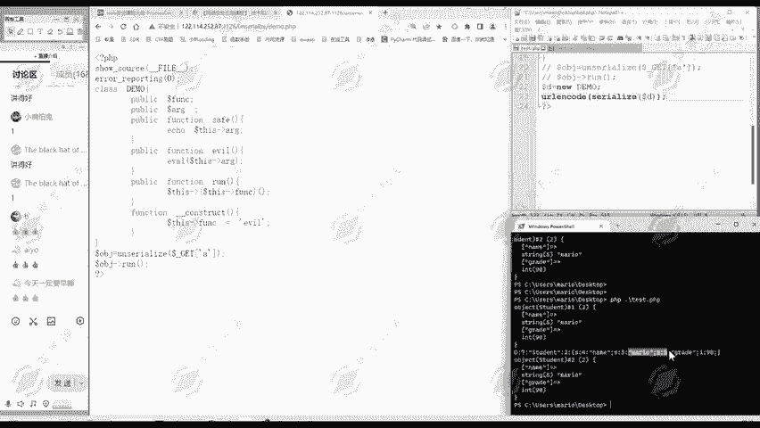

导致我们传输的时候出错。然后我们把这个编码后的结果呢进行一个输出。

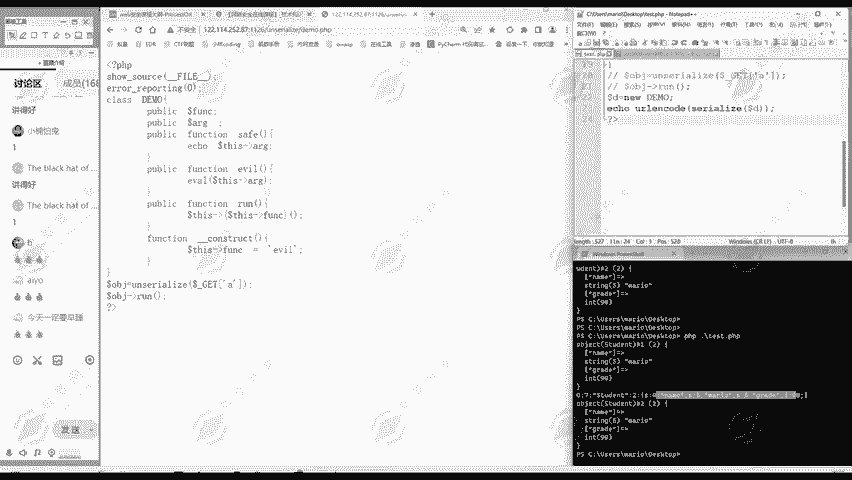

我们现在啊写好了之后保存保存了之后执行一下这个PTP文件。

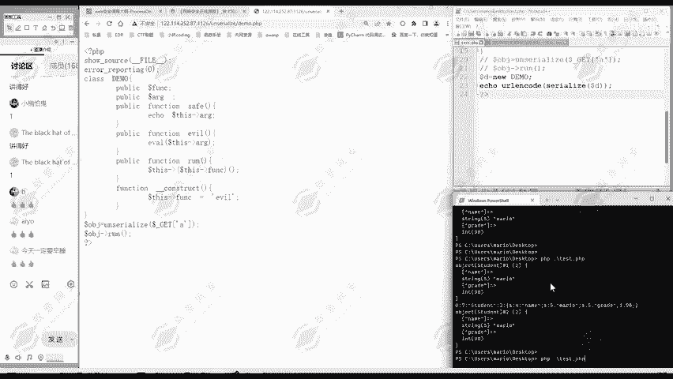

那么执行之后呢，得到一段URL编码。是不是我们把这个编码复制过来。

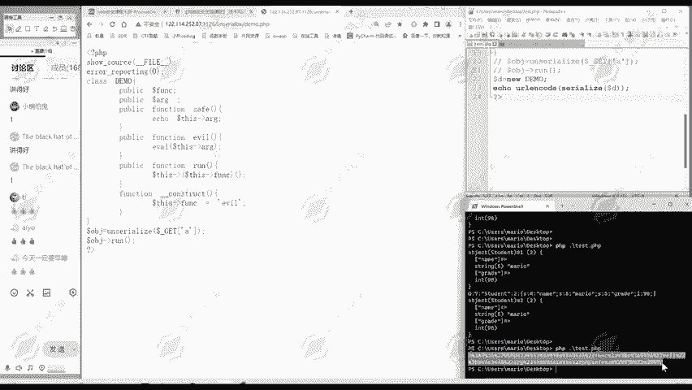

第四步已经做好了，生请序化数据。第五步呢。就是传递。数据。到。服务器。这个服务器呢就是。攻击目标。

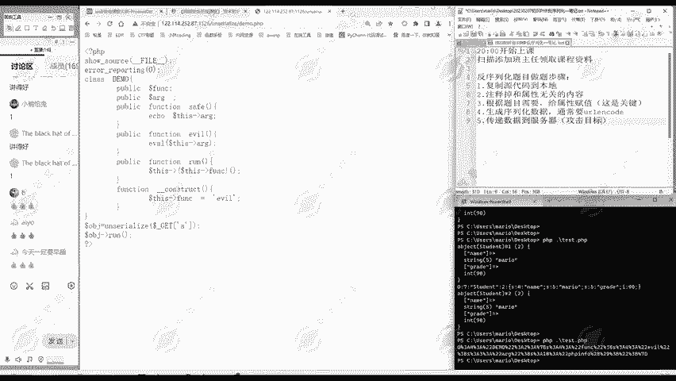

那么怎么传递，这里是不是有个get方法？😊，那么使用。黑客 up。问号。这get方法。所以说我们在URL后面用问号来传递参数名呢是A。A等于等于多少？就是我们刚才生成的虚拟化数据，我们把它粘贴过来。

然后呢，我们点击一下执行，就把这个数据发送过去。那么大家注意到是不是PHP info是不是得到执行了？那么我们的PHP in呢只是一个测试，那它既然可以执行PHP in，那它就应该能够执行别的命令。

是不是？那我们这里。比如说把PPin改成一个系统命令。Sysタ。这里大家要注意啊，我们所有代码都是英文输入法，不要使用中文输入法。那么由于外面使用的双引哈，所以里面就用单引哈。我们点击一下保存。然后呢。

刚才的步骤生成。信息化数据。然后呢，把它替换过来。然后再执行。大家注意到下面是不是就是执行了我stemL啊，显示一下我服务器当前目录上有哪些文件。😊，是不是？我们通过控制这个虚拟化数据。

就可以让服务器执行我们所想要执行的任何代码。就你。😡，那么刚才呢，我们是。由题目来分析啊这个属性是怎么赋值的。现在我们从真相的来看一下。那么我们的数据发过去之后，那服务器是拿这个数据做了什么呢？

它为什么会执行命令呢？我们看一下这个过程，那么发送的数据是不是这个啊？那么get a呢就等于这么多这个URL编码后的虚拟化数据。那再行行反序列化，大家注意到。注意啊，这个服务器会自动进行URL解码。

所以说这里URL自动进行解码，然后再进行反序化，就相当于得到了doarD，是不是？也就相当于这多OBG呢就等于我们的这里的多D。😊，那么下面执行多少OPT的run就都走到这里，是不是？那么都在OBC的。

这个FUNC呢FUNC是等于多少？我们这里定义的EVL是吧？那它就执行this EVL evil。😊，这次evo就走到这里，是不是他。😊。

再看它这里面的参数是什么ARG是不是ARG是等于多少system L分号，是不是？那就相当于执行evo systemsem l分号，那就是执行的系统命令。所以说就显示了当前目录下的文件。

包括我们刚才的PHP info也是一样的。😊，那么欢迎同学提问啊，那么。阿文同学啊说左边的两个窗口是什么环境？左边呀你说。这两个窗口这里呢啊就是一个note pad，就是文本编辑器。

你用TXC啊什么都行，sub name test啊这些都行。😊，那么这里呢是power系啊，就是我们windows的终端嘛。这是拍像。

这就是用PPP解释器来执行我们的test点PPP这个文件呢文件的内容啊就是这么多。那我叫你啊放在。旁边这两个窗口呢就是为了让大家看得更清楚。那么对这个题的利用过程，大家明白了吗？我们的五步是哪五步？

先复制代码到本地，然后呢注释着无关和属性无关内容，然后呢给属性复值。给属性赋值啊，怎么赋值呢？就要分析我们这个题目了。那给属性复制好之后呢。那就生成虚拟化数据。通常呢要进行URLincode。

这是个好习惯。申请好之后，就把数据传到服务器。那么服务器呢就根据我们预先设想的执行到我们希望的代码。这就是整个过程。虚拟化和反修化作用。作用就是刚才我们举的例子嘛，就是你在淘宝上买桌子这样一个例子。

因为我们要传输数据，比如说我想给它传输我们的door D这个对象。那么对象呢它是有结构的，它是不方便在网络上传输的。所以说我把door D变成了什么，变成了一个字符串。是不是这里就是一个字符串。

变成了字符串。😊，那么就很好在网络上传输了，这是它的作用。那么如果说这个服务器对传输字符串啊没有做过滤，或者说它的这个服务器它的代码本身有一定的问题，有安全风险。

那么攻击着呢就可以传入一些恶意的字符串训列，是不是？那传递过去，就像我们这样就可以执行攻击者希望执行的命令。那么我们啊这是我们讲的第一道题。用到了我们之前学的概念。是不是这些概念都是用到了。

那么对于第一题。怎么样给属性赋值？那么我们数据哎生成之后发送过去服务器是怎么处理我们的数据，它为什么能够执行我们的命令？大家都理解了没有？那么理解同学请扣个一啊，没理解同学请扣个2。😊。

看一下大家的一个学习情况。好的，大家理解了就好。没理解的同学一定要啊及时提出来，不要有什么害羞。😊，那学到就赚到嘛。那么有任何的同疑问就提出来。那么学习就要稳扎稳打。

那么把现在的知识就要掌握好才好学习后面的。run咋处罚的？那么啊。这位同学问的很好，这个run是咋触发的呢？😊，是是不是在这里出发的？这是服线代码。我们传输的只是这个虚拟化的数据。

服务相应代码我们是不能改变的。啊，那么魔术方法也是我们的一个重要知识点，我们明天会。深入的学习啊。为何要因ORL in cold？啊，就是因为因为我们现在呢学习的这个是比较简单的。

因为我们刚开始学习反序列化嘛，那么后面我们学习遇到一些复杂的题目，或者说一些复杂的环境的时候，我们经常生成的序拟化数据啊。😊，像我们这里是条炫或水，它有很多不可见字符。那么不可见似否。

你在复制过来再发送的时候就会出错出错。因此呢我们会进行一个URL编码。保证不出错。所以说URLincode这是一个好的习惯。对于这个题啊，大家还有什么疑问吗？有疑问的啊，欢迎提出来。😊。

那么这是我们啊今天讲的第一道题。我们继续往后面学习啊。