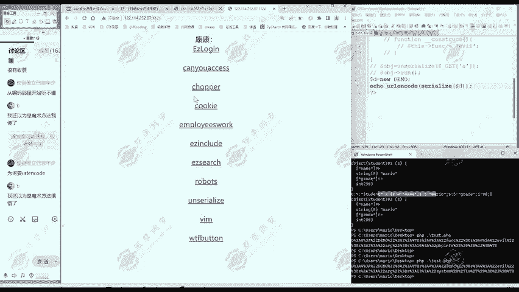
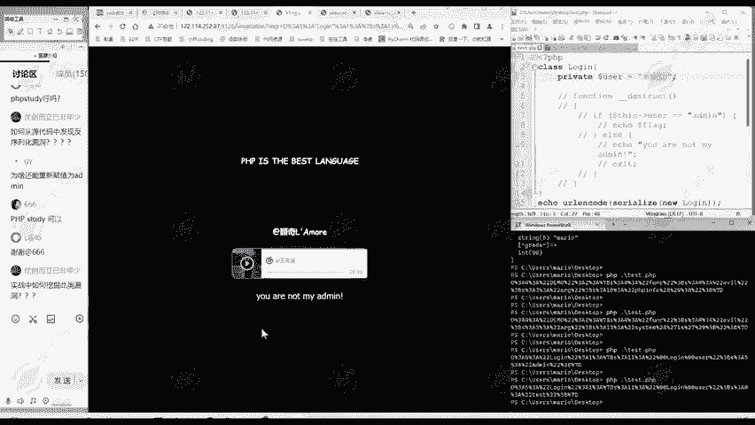

# 2024B站最值得看的黑客教程 ｜ 网络安全／渗透测试／内网渗透／漏洞挖掘／web安全／kali linux／红队靶场／CTF／信息安全 - P167：真题讲解—unserialize - 网络安全免费学 - BV1uBsTetEow

我们看一下后面题目。那么顺便提一下这其他这里面题目啊都是一些啊，比如说大学社团的一些CTF社团的一些啊招生的招新生的一些题目入门题。这里面其他题目呢，我都是之前的公开课啊，训练营讲过的。

今天讲的呢是这个unserize这个题。😊。

那我们看这个题啊，首先做我们大家不管是玩SIRCno啊，还是是做CTF webb方面题，反正我们外b方面的题嘛。😊，大家注意啊，要看我们的UIL当中有没有。什么信息？那么这里是anserize。

这是一个反序列化的提示。提示我们这个题呢很可能是跟反序列化相关的。同时呢看一下页面有没有什么信息啊，没发现什么。😊，再就是呢我们要看一下网页源代码，网页源代码当中有没有什么信息呢？😊。

那么大家注意到哎这一部分。是不是很像PP代码呀？那我们按照刚才做题的步骤，第一步是不是把它复制过来？😊，我们把它贴过来。就你的。andLT呢是HTML实体，哎，也就是监括号的意思。这里我们给它补充完整。

那么这是不是又是一道反序化的题目啊？那么就进入到我们的第二步，是不是注释掉跟属性？无关的内容。这是跟属性无关的内容，是不是？都注释了，那么只剩了这一行啊跟属性相关的。那么这是一道啊CTF的招生题啊。

CTF呢就是要获得flag。那我们怎么样才能获得flag呢？我们看一下，这里虽然注视着了，但是。😊，这只是在我们本地注释，是不是在服务器上在题目当中，那是不能注释的，我们是不能修改题目的。😊。

这段是干什么呢？大家看是不是我们直接在这啊题目里面看是不是要判断这个this这个user属性啊，它是不是等于al me，是不是如果是等于的话，就输出flag。😊，如果说不等于就输出啊，你不是我的命。

所以说我们现在目的呢就是要使这个user属性。等于。ad me是不是？那我们点击啊，现在把这个user属性复制成核的命码，这是我们的第三步啊。第三步，给属性赋值。这一步变化是最大的，每个题目不一样。

那后面第四步第五步就是程序化的了，是不是？那我可以直接写eal。UR l。in扣。seize啊生成一个对象log in，就是log in这个类。然我们点击保存。然后呢。执行一下这个文件。

那么这里呢就生成了。新华数据。然后呢，第五步呢传递过去，是不是我们同样使用hiickb。传递它这里传递是什么be态方法，参数名呢是E叉P，那么就是问号。EXP等于我们生成的虚拟化数据。那么点击执行。

是不是flle克就出来了。这道题啊是不是？也是比较简单。大家如果说懂得这个反序列化的话，就是比较简单。那么对这个题大家有什么疑问吗？有疑问欢迎提出来啊。😊，这种啊其实是个典型的外部方面的题。

我们来看URL，看这个界面啊，看那个源代码当中有没有我们需要的信息。那么我们这个题呢是从源代码当中啊找到了需要的信息。然后呢，发现这是一个反虚化的题目。然后构造合适的。虚化数据如何得到合适虚化数据呢？

我们在虚化数据里面真正能控制的就是。属性的值。所以说我们要把属性改成我们所希望的值。那这里呢就改成我的命。改成我的命，那我们把数据传递过去，它现在一判断this user是不是就等于我的面。

那么就输出了flag。😊，如果说对这有疑问的同学，可以把这里再改成别的嘛。😊，哎，改成ts了。那么你传递过去，是不是它就会输出you are not my。那么这里呢啊先做一个演示。再回答同学们的提问。

这里啊把这个数据换一下。换成这个test，是不是？那么就输出哎，you are not my me。那么这就这个题是不是要经过验证，跟我们的想法是一样的。那么啊有同学提问。为啥可以按变成我的幂？

这里呢不是负值，这是两个等号，这是判断。我们复制过来两个等号是判断它相不相等。😊，use this userer这个user属性的值和themin这个字符串是否相等，这不是负值，这是判断是否相等。

传递数据的是黑ick bar，它是怎么安装的呢？那么hi客 bar呢是我们学习网络安全。可以说很常用也必不可少的一个工具，用起来很方便。那么对于这第二个题，大家。还有什么疑问吗？属性的复值是在这里啊。

你如果复制成test，就不会输出flag。如果说复值称al me。就可以输出flag。对，第二题呃，大家还有什么疑问吗？😊，欢迎同学们提问。😊，我们把每道题都要彻底弄懂。再学习后面题目。

再学习后面啊更难度大一点点的知识。在终端你执行PHP是需要配置环境的。对，是需要，就是把P你的PHP的解释器添加到环境变量里面。😊，那么我们啊移进网安是专注于网网络安全人才实战技能培养的。

像这个L同学提的问题，如何配置环境？在我们之前的训练营当中也是有讲过的，欢迎。😊，那同学联系我们班主任，领取之前的课程资料。如何从源代码中发现反循环漏洞呢？这里啊刚才是不是给大家讲做我们外部题目。

可以说刚开始的三板斧。😊，就要看URL。看这个界面。看源代码。这基本上就是程序化的。行不行？你三板斧都试一下。不确定哪一个地方能找到这个题目的线索。但是这三班斧都先试一下。😊。

那么我们这个题是从源代码当中发现的。那么有的题呢是我们UIL中有提示啊，或者说在这个页面中有哪个地方有提示啊，都有可能。😊，那么这是我们的。啊，第二个题。那么对同学们提问，实战中如何挖掘此类漏洞？

我们反消化的漏洞是出现的频率呢是非常高的。它是个很重要的漏洞。那么在实战中如何挖掘词己漏洞？首先呢。很多啊实验中的很多漏洞呢，它不是单一的，它是综合性的。他是有多个漏洞。可能要综合运用。

你才能找到这个网站的一个no洞，是不是你可能通过前面的一些no洞。😊，发现了他的源代码。那么就可以进行代码审计，是不是？代码选题就像这样，你把代码提拿出来，你看一下它的问题。😊。

或者说实战网站你发现它使用的是一个开源框架。那你可以看一下这个开源框架的代码。从这源代码当中呢，可以发现它可能存在反需压漏洞。或者说有的时候呢网站它的代码会被泄露出来。等等这个情况呢是很多的。

如果用到了类，它都会进行虚息化吗？这个不一定啊。他要看你看服务器这里有没有使用反序列化。un nice嘛，它要使用反序话函数才才行。对，第二题呢。整个利用过程。就是啊同第一题一样，还是我们这五步。

1245基本上就是固定的一个步骤。那么第三步呢是要给大家结合自己的知识，结合我们每一个场景。每个题目或者说你挖SIRCno每一个服务器，它的情况来决定怎样给属性复制。那么这是啊最考验大家能力的地方。

那么我们看一下啊第。