# 2024B站最值得看的黑客教程 ｜ 网络安全／渗透测试／内网渗透／漏洞挖掘／web安全／kali linux／红队靶场／CTF／信息安全 - P169：数组特性 - 网络安全免费学 - BV1uBsTetEow

就给大家讲到这里，我们继续学习后面内容。啊，关于我们刚才讲题过程中的所有的工具啊，包括靶场的地址，这些靶场都是我们自己搭建的。这靶场地址啊都是啊找我们班主任领取，没有添加班主任的，现在添加一班主任。

找我们班主任领取资料。包括我们刚开始讲课的时候就给大家讲了。我们的课程呢三天打卡可以获得我们的和天玩神使的会员。😊，那么现在大家听课肯定超过30分钟了。那么现在呢可以在我们班主任这里进行打卡。

发送我们直播间的截图到班主任这里进行打卡。那我们再看一下啊，第三部分就是数组特性。那么数组特性是什么呢？就是当。一个数组被当做函数调用，就它不是函数，它是个数组，但是它被物当做函数来调用了。

如果说数组的第一个元素是对象，第二个元素呢是对象下面一个方法的名字，就会直接调用该对象下的该方法。那么这么听起来呢啊有点拗口。那我们这里啊进行一个演示。大家就懂了。把这个上个题的这个代码删除。

我们呢首先定一个类。比如说啊决定一个内就叫A，是不是？然后那里面呢。可以有属性，不过有没有属性都没关系。我们这里呢是演示数组特性跟属性没关系。我们。可以放一个属性在这儿。然后呢，我们定义方法。

方法呢其实就是函数。只不过它只能在A这个内里面使用的函数，就是function。然后这个函数名称，比如说就叫啊test。这个函数内容呢，我们就输出一下，输出。数组特性。再输出一个换行符。

那么这个函数呢很简单，是不是？我们首先看一下怎么直接调用这个函数。我们比如说定义一个。A变量它就是。一个A的对象。然后呢。Test。我们啊保存一下，然后呢在下面这里。执行下。它是不是就输出了数组特性啊？

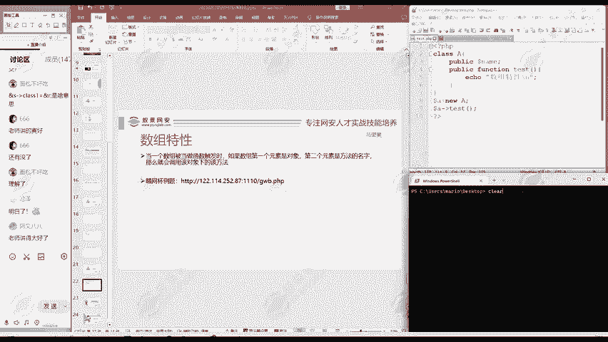

输出了啊数组特性。

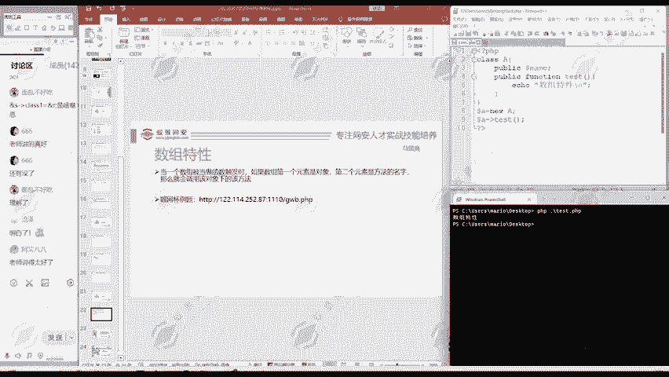

这是一种啊调用t的方法。

第二种方法呢就是运用到我们刚才讲的数组特性怎么用呢？大家啊对照这段话，我们逐字的操作。😊。

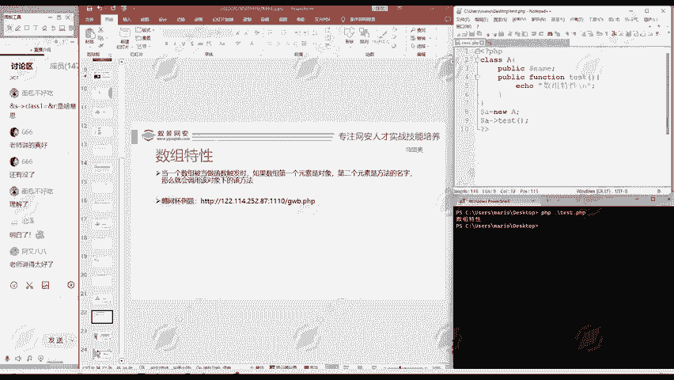

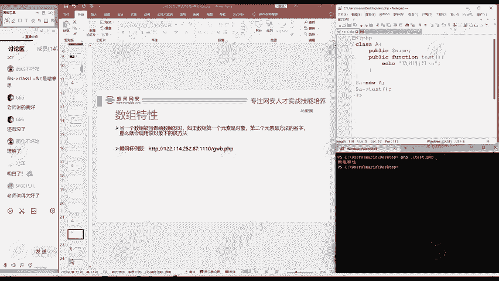

首先是要一个数组。被当做函数触发，是不是？所以说我们需要一个数组。

定义一个数组ARR等于这是一个数组，是不是？

这数组有什么条件啊？第一个元素是对象。

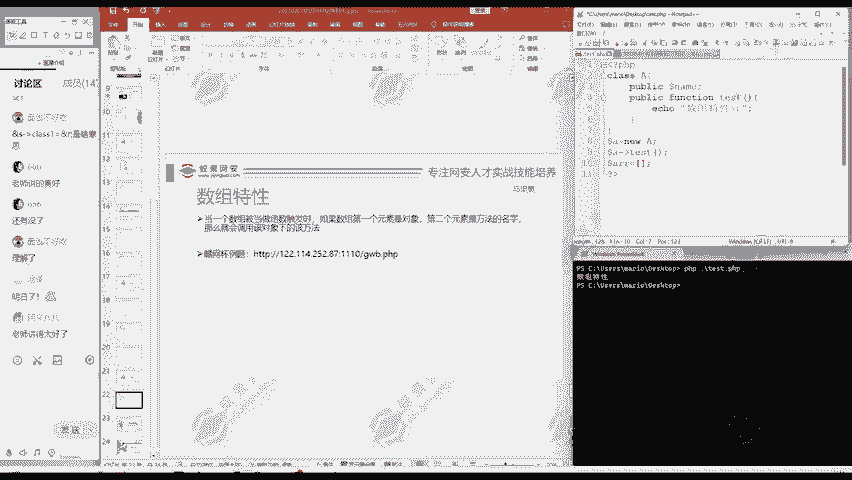

所以说第一个元素是什么？多来A多纳A是不是对象，就数作第一个元素，第二个元素是方法的名字，它A方法的名字是什么？test。😊。

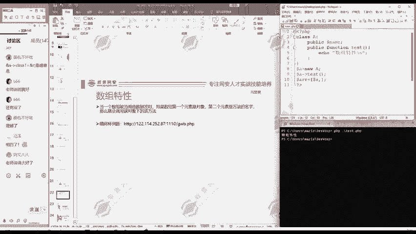

test这里是个字符串，所以要打上引号。

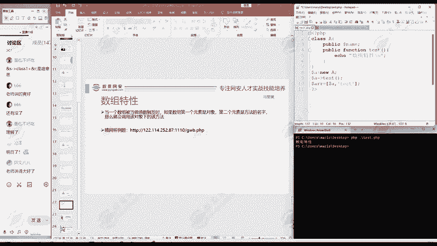

是不是跟着你一样的第一个元素对象，第二个元素呢是方法的名字。😊。

那么现在把这个数组当做函数触发。

ARR括号，这就作为一个函数来调用，跟上面这里是不是一样的？作为函数调用，那我们看一下会出现什么结果，这是一个数组，我们把它当成函数调用。

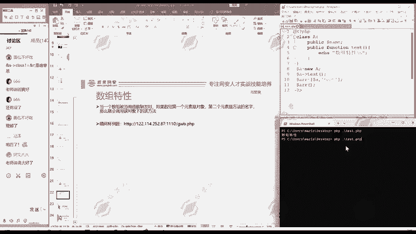

大家注意到哎，这里是不是输出了两次数组特性啊？

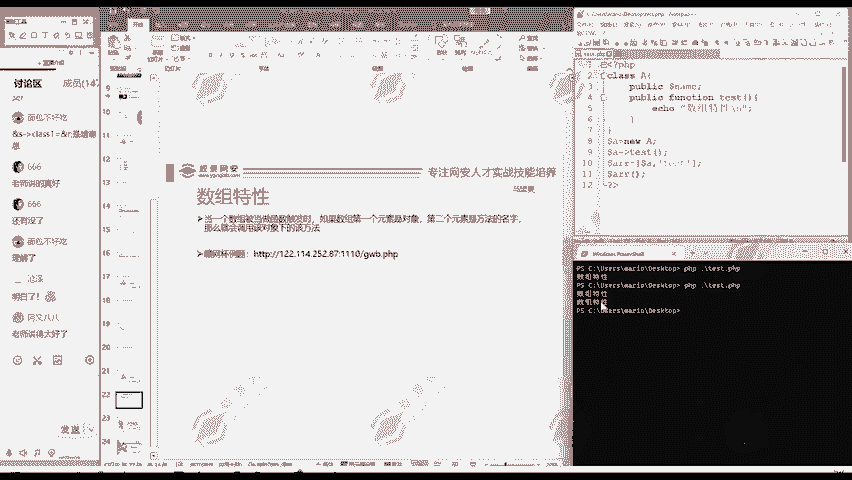

也就是说你把它这个数组当成含义调用的时候，和你直接调用A下面的test方法，结果是一样的。

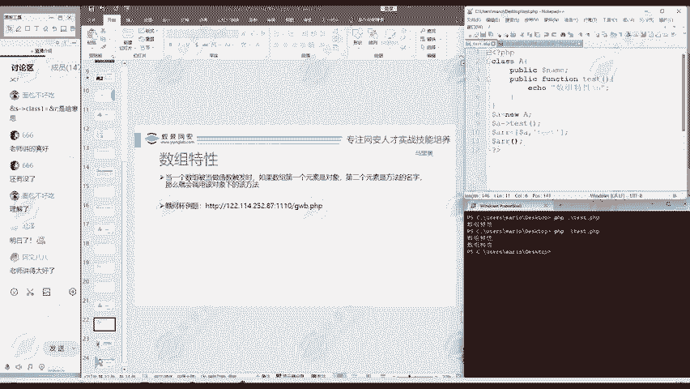

是不是？这就是啊P区的数组特性。

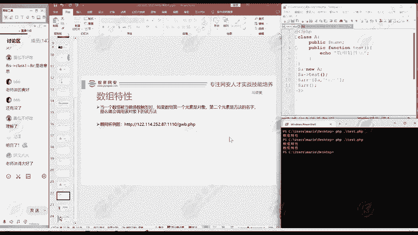

那么这里呢。由于啊。

这个问题有点小，就是开发的时候有可能被忽视掉。那么被开发人员忽视的这个问题呢，就可能成为一些黑客他攻击的点。

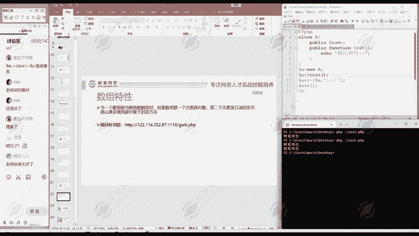

这就是一个利用的方法。如果说啊写代码人，他把AR定义成一个数组，他后面呢把它当成函数使用，他忘记了前面定义是个数组。😊。

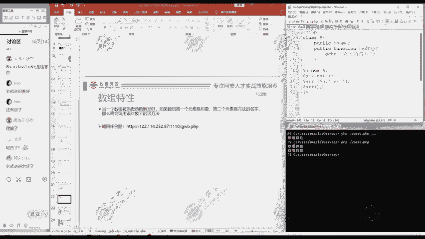

或者说你可以构造这样的数组，那么你就可以执行相应的方法。

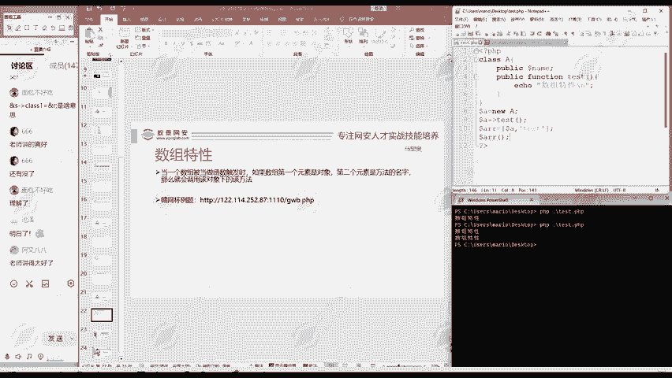

这就是我们PHP的数组特性。

这个大家理解了吗？通过刚才的演示。😊。

啊，不理解同学随时提出来。

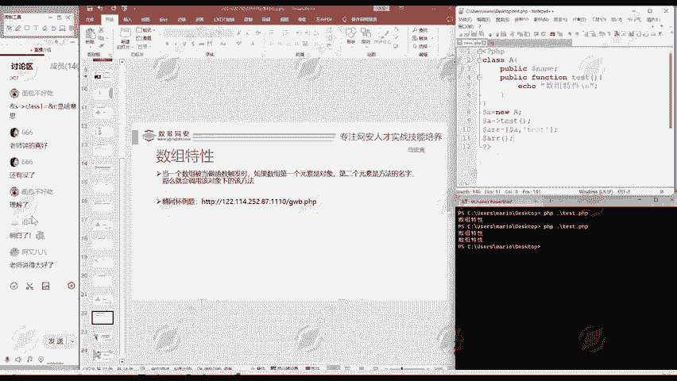

我们讲课就是保证您基础的学员都能听懂。

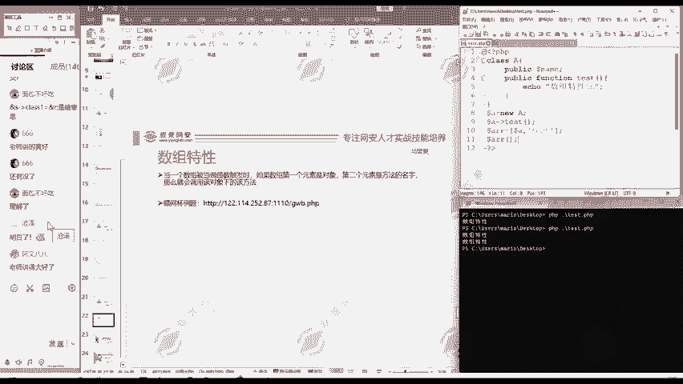

这就是目的。包括你对前面讲的这几个题目有任何的疑问。😊。

都可以提出来。

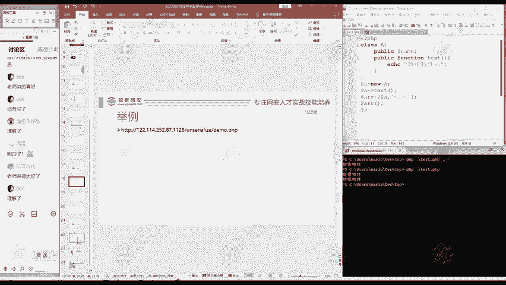