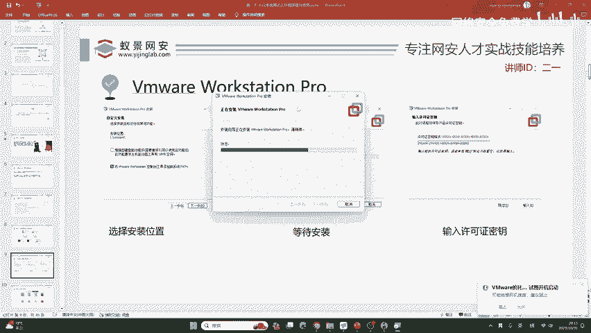
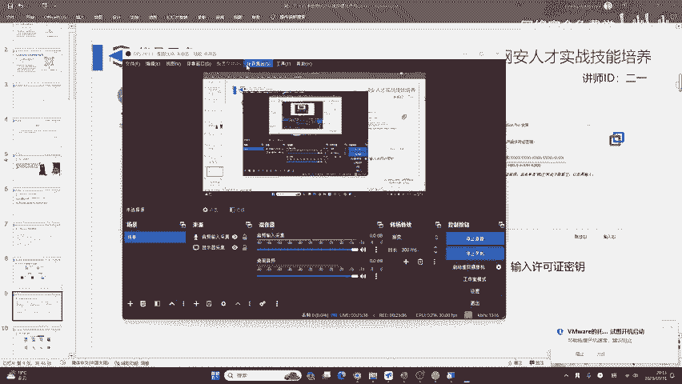
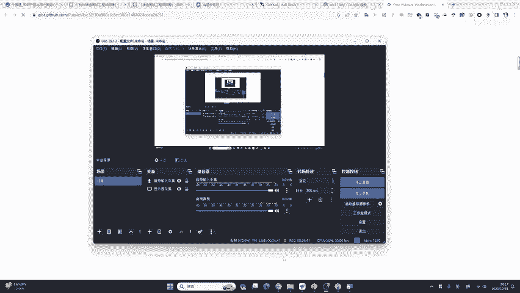
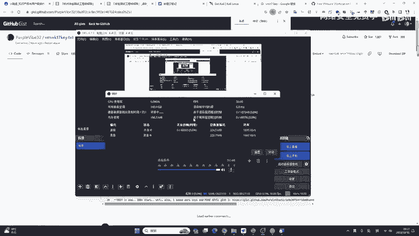
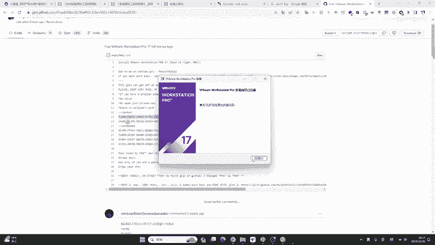
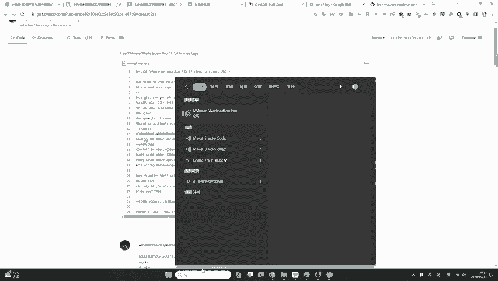
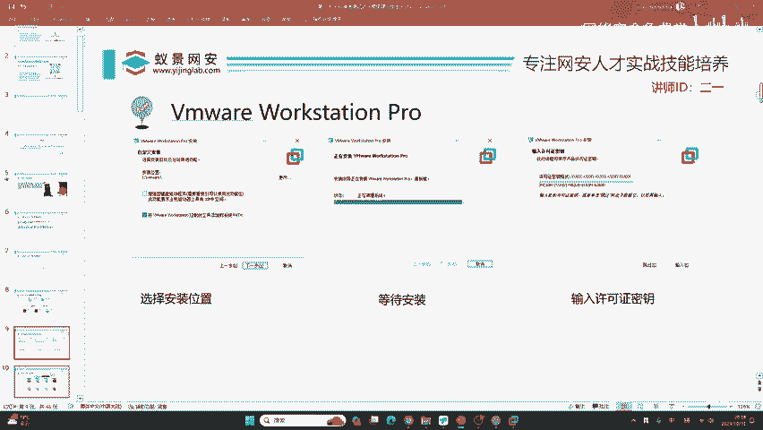

# 2024B站最值得看的黑客教程 ｜ 网络安全／渗透测试／内网渗透／漏洞挖掘／web安全／kali linux／红队靶场／CTF／信息安全 - P16：安装虚拟机 - 网络安全免费学 - BV1uBsTetEow

那我们这里啊就是给大家安装虚拟机的版本，这个镜像你就不需要考虑了，咱们用不到这个镜像。安装虚拟机的话，首先我们需要这样一款工具，叫做VMO work session pro。为了方便给各位，有的同学。

你的基础几乎为0。为了方便你去听课，我在上课之前特意把我的虚拟机去卸载掉了。我来给大家完整演示一下它的安装。首先你可以打开我在工具库里面下载的VMworktation这个安装包。

一共600度MB打开它之后啊，你稍等片刻，它就可以加载出这个安装页面，只需要三步骤就行了。首先呢是选择安装位置，等待安装和输入许可证密钥这三个步骤。大家来看我快速操作一遍，点击下一步，点击接受许可。

下一步。在下一步之后呢，我们这里要更改一下咱们安装的位置。因为你默认的话，它是在C盘。由于这个VM它占的存储空间很大啊，所以说你安装到C盘的话，它可能会造成一些影响。啊，比如说我这里给它换个位置。

我就安装到D盘。D盘中，我安装到这个I盘的VM这个文件夹中，还要把它。😊，进行选择安装位置，然后这里就不用勾选了哈，这里就不需要勾选这个键盘驱动程序，它没有用。然后点击下一步就行了。点击下一步。

这里随便点，你想点取消就取消，没有关系，再下一步。好，再下一步。点击安装之后呢，它这个步骤按照正常的操作系统，大概就一两分钟的时间。我们足够有时间在上课的时候去给大家演示安装。😊。

没有卡吧。我这个地方呃在安装安装这个软件，所以说卡可能会卡一些啊。因为我这个地方呃安装VM的时候，它需要去更新呃这样一个网卡的驱动。所以说它可能会卡到一秒钟，然后快速的重连回来，大家是不用担心的啊。

啊，我这里大家看它会有个安装虚拟网络程序的过程，那它会重启我的网卡啊，但是这个过程非常快啊。在安装完成之后呢，我们点击许可证。因为啊这一款软件它是收费的。啊，那个K的话就像windows破解一样。

你从网上可以找到啊。当然我在预习内容中也给大家讲了，如果你不想用老师提供的，你可以自己搜，比如说演示一下啊，我在这里搜AVM17K啊，我在这里简单搜一下。😊，啊，可能我这个网速还是比较慢啊。

因为我这个在安装的时候，他需要去重启一下这个网卡，就安装VM的时候，它可能会有几分钟的卡顿啊，现在应该完全正常了吧，同学们。

我这里可以点开一下统计，好的，一帧都没有掉啊。没有卡吧，大家可以。刷新一下自己的页面卡的同学，你可以看到我的屏幕，我的屏幕啊，咱们这个在直播过程中是一帧都没有掉哈，在高马率的一帧都没有掉。

所以说大家只需要刷新一下自己的小程序或者是网站就可以解决了啊，可以人试一下，刷新一下。😊。

好的，这里我从网上可以找到这个激活密钥。当然我在呃运行的内容中给大家写好了呀，然后去把这个东西粘贴到我们的许可证密钥中，点击输入，我们就把VMO安装好了。安装好之后啊，你可以直接打开VMO。😊。

好，打开之后我们来看一下。那映入眼帘的就是这样1个VM world workstation pro17啊，当然呢我这个左边有非常多的这个虚拟机是老师之前装的啊，但是呃说实话大家没有的话，没关系。

我们今天先从卡里学起。很卡吗？同学们应该不卡呀。我这里看到是不卡的呀，你可以看到我的这个推流啊，大家可以了解一下这些计算机的呃知识也比较好啊。我这个地方呢就是一个上传，知道吗？上传的时候。

它是根据你这个帧数还有码率来去上传的。你这个地方如果丢帧，我这个地方会有提醒啊。我现在没有收到这个丢帧的警告。那所以说呢应该是不会卡。如果卡的话。

请大家刷新一下自己的小额通或者是刷新一下自己的网站即可解决。好，下面我们继续来看我的VM已经安装好了，就三个步骤，非常简单啊。😊。

