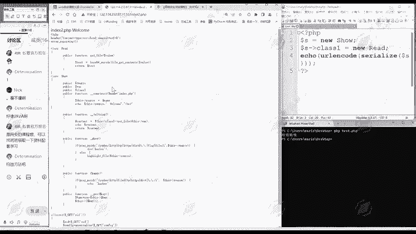
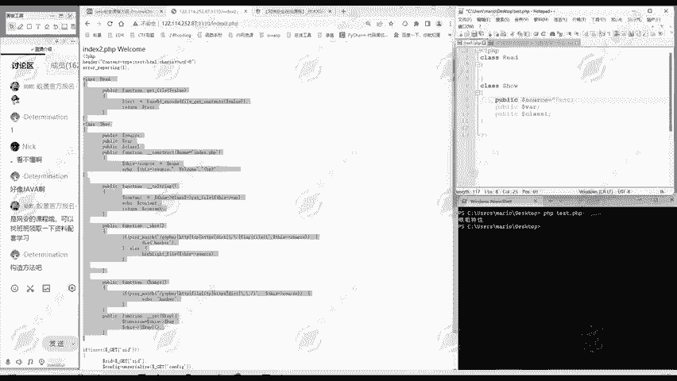
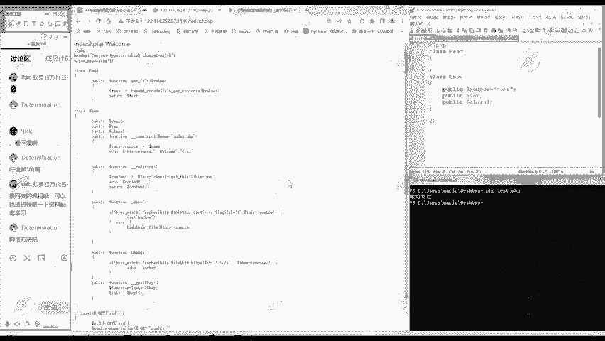
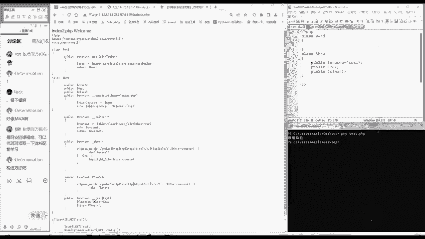

# 2024B站最值得看的黑客教程 ｜ 网络安全／渗透测试／内网渗透／漏洞挖掘／web安全／kali linux／红队靶场／CTF／信息安全 - P171：属性赋值 - 网络安全免费学 - BV1uBsTetEow

那么第二点给大家讲的是什么呢？就是属性赋值。其实我们昨天在做题的时候。啊，就多次用到了属性复制，是不是？我们做昨天这道题。怎么做的？是不是？okK吧啊我们昨天做这个题。他的一个。关键的代码。

给大家再贴过来看一下。是不是我们。哎，对这个fk这个对象F对它的K元素。啊，等一下，不是这个题。嗯。我们找一下啊，昨天这个题的。所先这个题更简单一些。对秀这个对象的class这个属性是不是对它赋值啊。

赋值呢是一个锐的对象。😊。

那么有的时候呢，我们是在这个。来，属性定义后面直接等于多少，是不是有不同的属赋值方法？今天这里呢我们就系统的总结一下。那么赋值方法呢总共有3种。😊。

第一种就是啊直接复制。我们啊就以昨天这个题为例，我们把这两个对象。给贴过来。然后呢，我们把这些函数为了大家能够看的更清楚呢，我们把这些函数。😊，给删除掉。昨天我们说的是啊，把属性无关内容注释掉。

是不是你删除和注释都是一样的效果。😊，那么现在呢。这里啊把这个函数也删除掉。那么现在是不是只有。两个类的对它进行赋值。比如说对这个source进行赋值，我可以source等于。啊，太死了。随便一个字符。

是不是？

这是在里面复制这种直接复制法呢，好处是非常方便，它的缺点呢就只能复制字符串。😊。

那像我们昨天的。

我们昨天使这个S class一的属性，是不是do于 new read，它就不能在里面进行赋值了。这种呢就要用我们第二种复制方法。也就是我们外部复制法。外于复制法怎么做？就像我们昨天做题一样。我先。😊。

生成一个秀这个内的一个对象，然后呢对象。这个箭头，然后它的属性名等于多少？这是在外部进行复制。外部进行复制呢，它就突破了直接复制，只能复制字符串这个缺陷。😊，你任意类学者，你不管是classy。

等于一个字符串，等于另一个对象。😊，等一个数组都可以。那外部复值的缺点是什么呢？它只能操作pubonic属性。😊，大家知道我们定义的时候，属性前面是不是一个public。那除了ponic克，还有什么？

这里啊可以简单的给大家提一下，但是我们这节课呢是不涉及的，还protect。How private？有这些啊类型的变量。这些类型的变量呢就不能够用外部复制方法来复值了。

那基本上我们绝大多数题目结合直接复制和外部复制两种方法呢就能够。解决我们的问题。由为我们做反圈化题目，主要就是对属性进行复制，编辑属性嘛。通过直接复制外部复制。就能够解决所有的问题。

那么还有第三种方法呢，丁妮给大家介绍一下，虽然用的不多啊，第三种方法就叫万能方法。万能方法怎么样的呢？我们这里啊定义一个函数functionction。😊，定义一个构造函数。かすか。这构造行州呢。

就是我们刚才介绍的。😊，魔术方法是不是？那这个魔术方法做什么呢？是由我们自己定义的。😊，然后我们在这个魔术方法里面，哎，可以想付什么值就付什么值。我这时候呢我们指定这个内呢就用这来表示。

然后箭头以定它的什么属性，Y属性。😊，可以复制为嗯。吧，这就随电复制。对，别的也可以进行复制。啊，也可以在这里面。让它等于一个类也是可以的。这是构造方法。那么这里给大家总结的它的优点呢就是能力很强。

很全能。那么缺点呢也很显而易见，就是麻烦点，你得自己写一个构造函数。😊，在我们实际经验中呢，第一种直接复制和外部复制，这样种方法结合起来。😊，基本上就够了。实在不行，你再用构造方法，麻烦就麻烦点。😊。

这是我们属性复值的三种方法。通过这三种方法呢，你想对属性负什么责任都可以。不管他有多少类。你想对他复值不值都可以做到。😊。

