# 2024B站最值得看的黑客教程 ｜ 网络安全／渗透测试／内网渗透／漏洞挖掘／web安全／kali linux／红队靶场／CTF／信息安全 - P173：赣网杯CTF真题讲解 - 网络安全免费学 - BV1uBsTetEow

哎，这是一道干网杯的CTF比赛的一个真题。那么我们把这个环境啊部署在我们自己的VPS上了。我们可以看一下这道题目。😊。

哎，我们看一下这个题目。那么这个题目呢？我们看一下这个代码。基本上也是三部分。第一个类是不是第二个类，然后呢一个反削化。因为它有反序化操作呢，所以说我们可以从反序化的角度来思考如何解这个题。

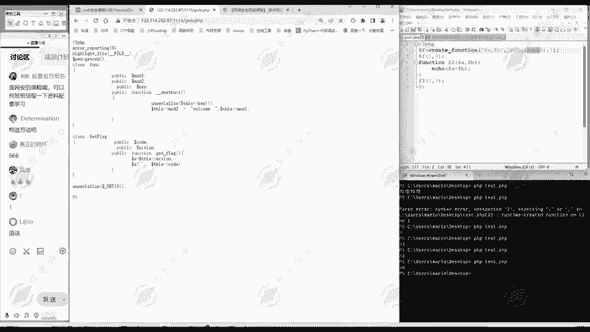

然后反修话怎么做呢？啊，这是我们昨天的笔记也给大家贴过来了，是不是这五步啊？😊。

那么第一步呢，我们做一下啊，第一步啊复制源代码。

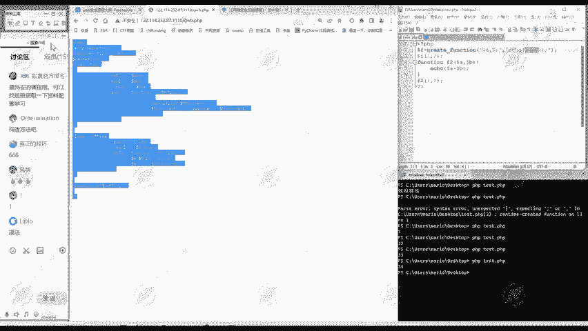

到我们本地。testPP是我们的本地，我们复制一下。都复制过来了。😊，那我们这第二步是什么注释调和属性无关的内容。那有的同学啊昨天听课了，向我们班主任询问，或者说昨天做作业的时候发邮件。

也有同学问这个注释属性是怎么注释掉跟属性无关的代码是什么意思？😊。

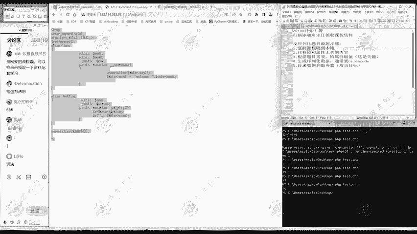

我们一行一行看我们这个反序列化呀，就是操作属性。就是改变属性。通过改变属性呢呢就达到我们执行命令，或者说查看文件的这样一个目的。有哪些跟属性无关？大家看第一行跟属性有没有关系。是不是啊，没关系。

这一题这一看就是ever reporting报错的，它设置不报错，那跟属性没关系，我们把它注释掉。😊，那么这个两个双斜两个斜线呢就是PTP的注释。那么第二行呢，还呢是 fire。

它是啊显示这个文件内容的。它的执行结果呢就显示我们这个文件是不是？😊，这个也跟属性没关系。那么第三个呢，就获取这个路径啊也跟属性没关系，这都是跟属性没关系的。那么这第四行啊，第五行跟属性没关系。

我们能不能注视着？大家思考一下。第五行我们能不能注视掉？啊，觉得能注射掉的同学请扣个一。觉得不能注射掉的同学扣个2。😊，大家觉得我们第五行能够注释掉吗？我们的要求是注释掉和属性无关的内容。

那么第五行要不要注释掉？

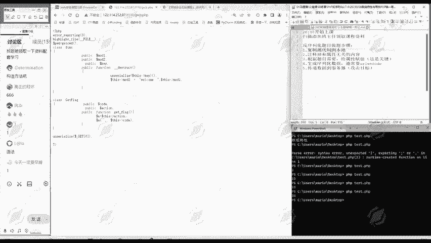

那么扣一的同学呢觉得要注视掉啊。那么啊。像这个啊面包同学啊一看。昨天就听过课的，还记得是不是？😊，苍泽啊叫L还青山于水啊，这些啊都是对的。😊，这里呢是不能注释掉，为什么？因为我们的属性是在什么？

是在这个内里面，你把这个内注释掉了。😊，它后面它就不是一个类了，它也不成为属性了，是不是？所以说你这里声明这个类，就声明类叫什么名字叫FUNC它是跟属性相关的，它就不能注释。😊，那么啊第六行这个这都是。

这个内的大括号是不是也是跟属性相关的。那么第C行呢，哎是属一个属性MODE那当然不能注释。😊，第八行、第九行都不能注视。是不是？啊，那也感谢我们早睡同学的呃勇敢发言。😊，那么第十行呢。

大家想这是定义函数，是不是要把它注释掉？十一行一直到啊。15号这里。这都是定义函数的内容，是不是？那跟属性有没有关系啊，没有关系。所以这里都要注视掉。那我们就对它整体添加注释。

这句叫啊注释掉跟属性无关的内容。那么对于第二个类，get flag这个类。

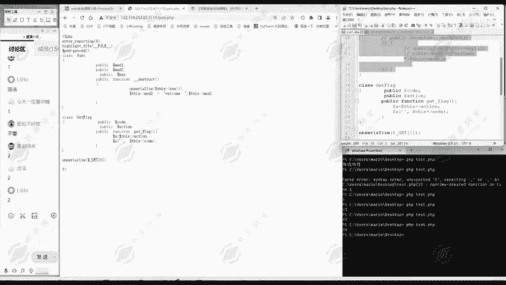

他现在是不是就知道？那get flag是不能注释的，这里呢code属性action属性也是不能注释。这后面呢定义了一个方法，就是内的函数，get flag。😊。

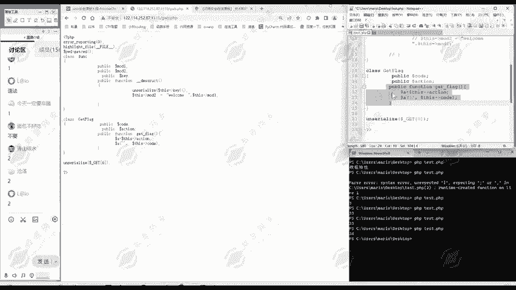

这是不是定义跟flag方法的这都是跟属性无关的内容。

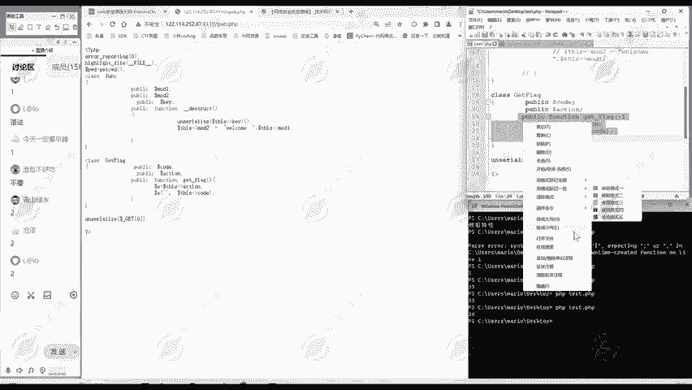

那我们呢都注释掉。这第二个内看了，那再看27行，这跟属性有没有关系啊？😊。

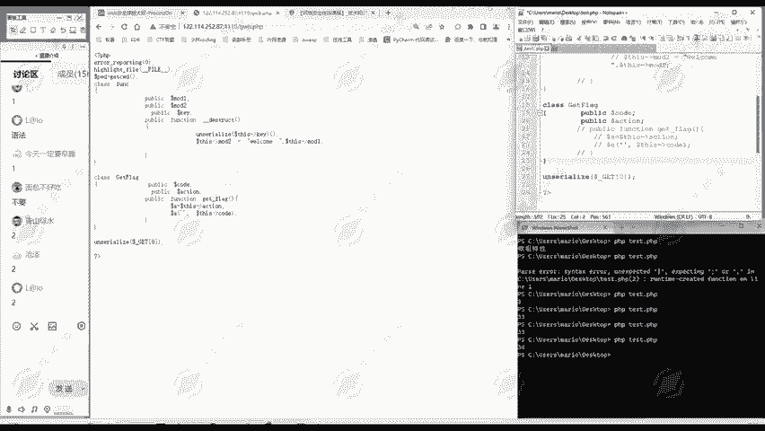

这也没关系，这也不是操作属性的，同样添加注释。

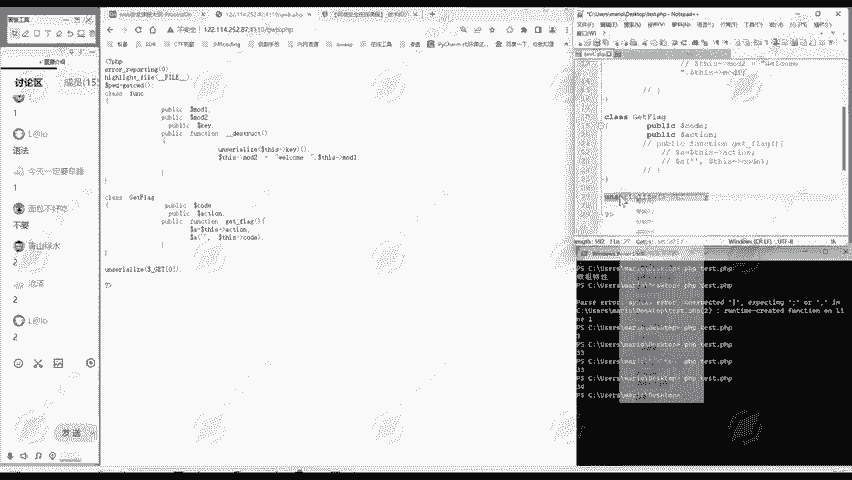

那么现在呢我们就完成了第二步注释加和属性无关的内容。

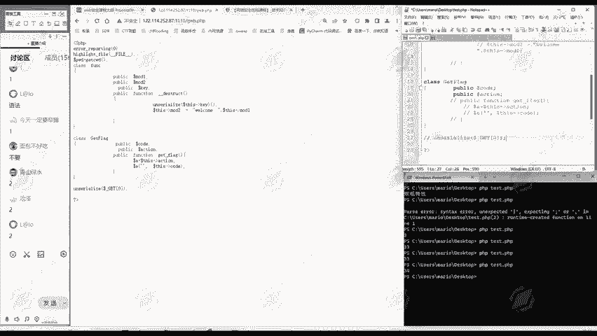

啊，现在大家对于第二步注视价和属性无关的内容。还有疑问吗？还觉得哪里搞不清楚要不要注释的。或注释和删除是同样的效果。或者哪里需不需要删除不清楚的。请提出来。老师先喝口水。

大家这里啊想一想有没有哪里还不理解的。😊，好，我们第二步就搞清楚了，注释掉和属性无关的内容。那么现在是不是进入第三步，根据题目的需要给属性赋值，那么这是最关键的。

最核心也最难的一部分。那么给属性怎样赋哪些值呢？复制方法我们今天是不是给大家总结了属性赋值就这三种方法。用这三针模式管了，给属性想怎么复制就怎么复制。😊，所以说实现对于属性的负值啊，不是难点。

难点是给它复什么值。😊，那这个时候呢，我们就要分析一下这个代码了。我们看一下服器的代码。😊，第一个类。第二个类，然后这第三呢是一段代码，这段代码呢就是进行一个反序列化操作。

所以说我要通过零这个参数传递序列化数据，然后呢它会进行一个反序列化。😊，那现在传递什么数据呢？我们来看一下第一个类。😊，它有啊一个属性，两个属性，三个属性。然后它有一个方法，方法叫什么？

两个下划间destruct。😊，哎，大家看到这种两个下划线开始的。😊，就要有一个习惯，大家做题目做多了就有个习惯，这是什么魔术方法？他可以自动调用。就这个方法是会得到执行的，只要满足条件就会得到执行。

😊。

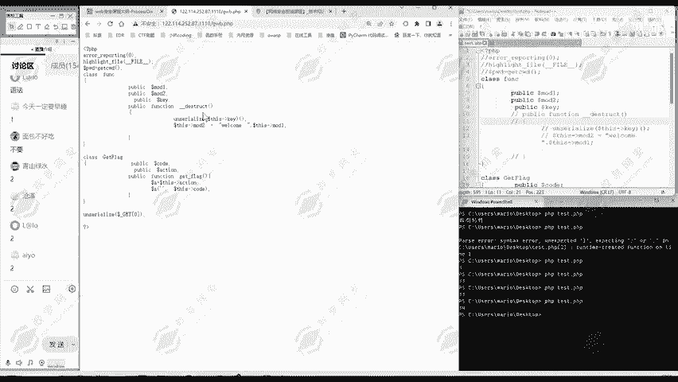

那么destruct是满足什么条件得执行呢？destruct就是毁灭笑破坏，是不是？所以说它是在对象被销毁的时候触发。这个单词的意思就是破坏嘛。所以说disstruct是肯定可以触发的。

因为在程序退出之前，他要先销毁对象。那么触发这个提次给他要做什么呢？它是on three night啊，这里这一段怎么理解呢？😊，啊，这个顺执行顺序告诉大家，首先它要执行括号里面的部分。

有括号先执行括号吗。这括号里面呢就是。这个FUNC这个内的K这个属性的值。这个值呢，然后oner nice是吗？作为on nice函数的参数是不是执行？😊，执行呢得到一个结果。

这个结果后面再加个括号是什么？也就是说前面的结果呢是一个函数，或者说被当成的一个函数。😊，在执行这个函数。其实这种执行顺序啊，昨天给大家讲了，就像我们学啊初中数学一样，从左到右，然后有括号的地方呢。

要先算括号里面的。是就这么理解。那么这里。我们可以利用吗？大家想一想我们这一步能不能够利用。😊，有没有同学知道？他这个代码能不能被我们所利用？大一想他这个。onseize this k它的结果。

那么the K呢这个属性是我们所控制的，是不是我们可以对K进行赋值。然后呢，甚至序拟化数据，再传递给服务器。那服务器反序拟化之后呢，那么这个K的值是不是我们所控制的？😊，那控制了K的值。

那可以再进行反削换。也就是说我现在。这个这一整块。on之后的结果是不是也是我所控制的？😊，所以说我可以令它对于等于某个函数，是不是可以？那么结合我们今天所讲的内容。我是不是可以拧拧这一整一块等于。

有个数组可不可以？如果我这只一整块等于一个数组。那么他是不是就会调用？是是触发这个数字特性，调用某一个对象下的某一个方法。这就是啊我们的数组特性。那么下面呢是一个welcom。

这是第一个类我们就分析清楚了。那我们现在啊分析第二个类。😊，第二个类是什么啊？get flag还有第一个参数，第二个参数，然后它有一个函数get flag。那么我们由于这是干往杯的一道题目啊。

做CTU比赛嘛，就是拿flag，所以它这个内就叫get flag，它这个方法get flag下划线。😊，那么肯定是要走到这里的，是不是？那么该 flagag是。干啥呢？哎，A是action的值。

就把action这个属性的值付给变量A，然后变量A哎，这是个什么操作？这个小括号啊再次听大家就是调用函数。这是不是一个调用函数啊，哆了A。调用函数它的参数有两个。第一个参数呢？是空。

第二个参数呢就是coded的值，是不是？那么结合我们今天所讲的内容，它对应到我们今天所讲哪一部分，有没有同学知道？😊，看到这里就知道它对应到我们今天所讲的哪一部分内容。这个A是不是能够等于。

Create function。你话了。是不是？啊，大家啊第一次学。😊，还没有理解这么深。就可以离。啊，是很正常的。那我们现在就一起做做这道题。😊，第二些思路。

那我们现在是不是大概就有了我通过这里哎可以触发它的数组特性。😊，可以调用指定的方法，指定的内下面的指定方法。那会去调用get flag这个内里面的get flag方法，是不是？就走到这里。然后这个。

给它 flag这个内里面的code和action。😊，那我在本地都可以控制。那是不是就能够create一个function啊，创造我们一个自己的函数，然后执行我们的目的啊。😊。

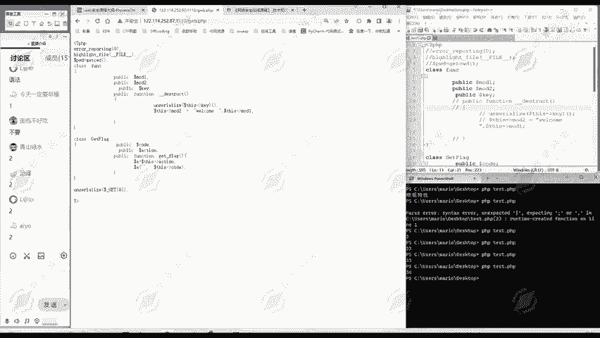

啊，这里我们先带家走一遍。那么啊为了让大家看得更清楚呢，我就把这些啊注释掉的内容删了。

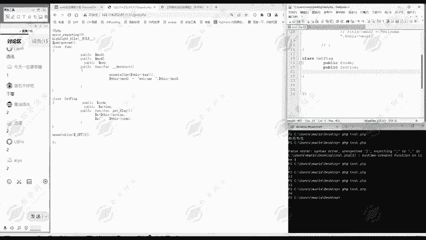

因为我们这个代码是在这个小窗口显示的。所以说把无关的内容删了，大家看得更清楚。我们首先解决一个问题啊，就是answer lies。

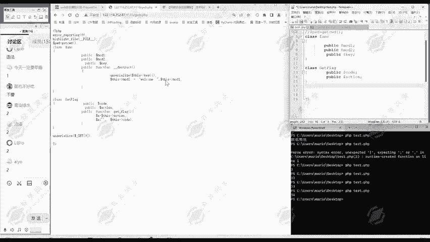

thisK它的整体结果怎样等于一个数组？

然把这一部哎复制出来。

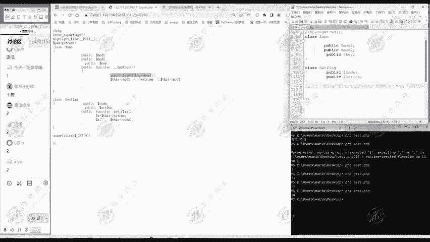

这你呢？那我最终设指了get flag的啊，我先定义一个。一样。

get flag的一个对象。

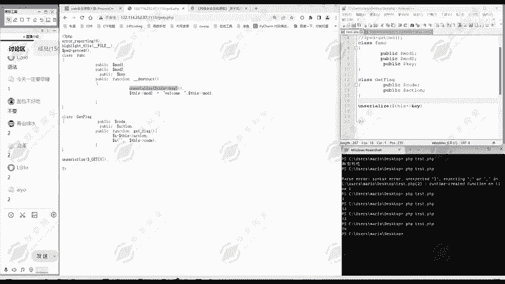

多了，G就等于了6。get flag是不是？那么我现在所希望的。这一波啊是我们所吸用的，它等于什么呢？他就等于一个数组，是不是？这个数组的啊第一个元素是对象。这里呢是多来近。那第二个元素呢？

是方法的名字，方法名字是什么？这个啊小写的get flag。

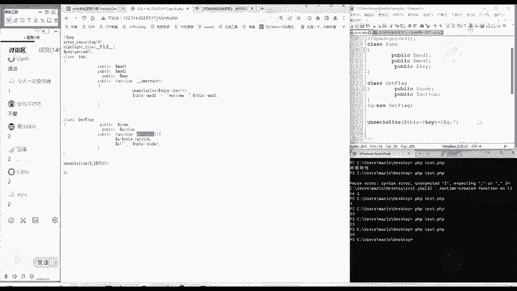

现在是不是希望达到这样一个效果啊？😊。

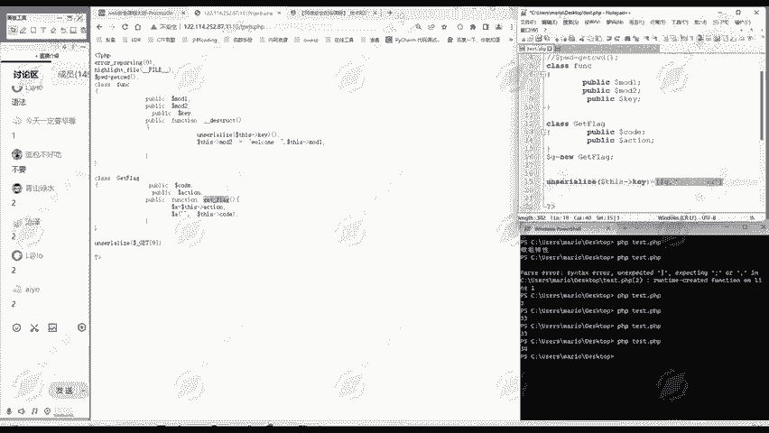

这你理解吧。那如果说answer nice之后，等于这个它在后面加上括号进行调用，是不是触发了G的get flag方法就走到这里了。

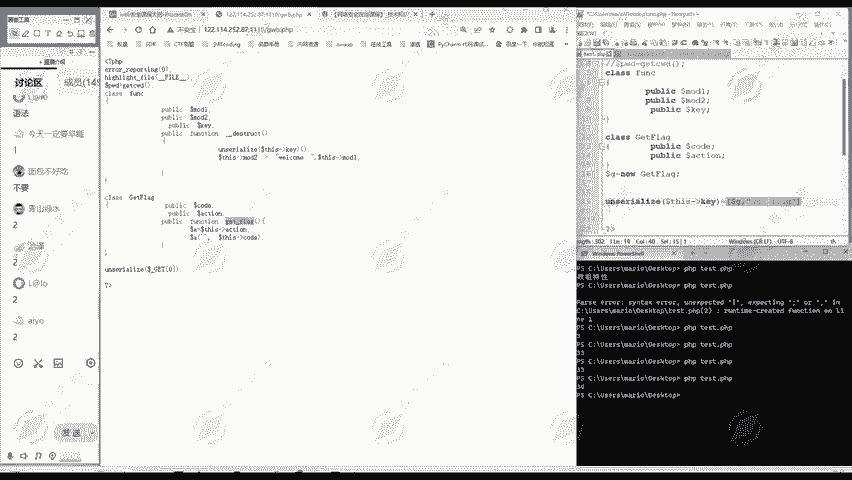

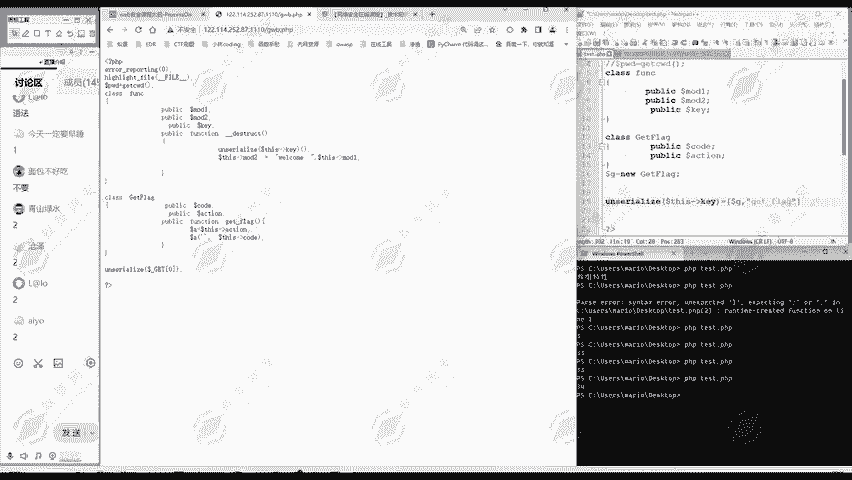

那么怎样达到这个效果呢？这里啊教大家一个方法，也是我们初中运算的一个数学运算的一个方法。

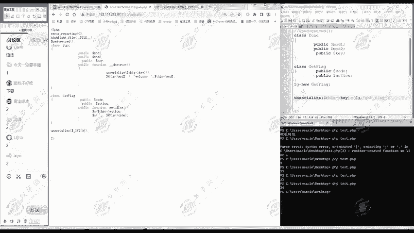

怎么做呢？我只能对K赋值，是不是怎么达到这个效果呢？你想这两个式子是一个等式是吧，我可以两边同时进行一个什么操作？😊。

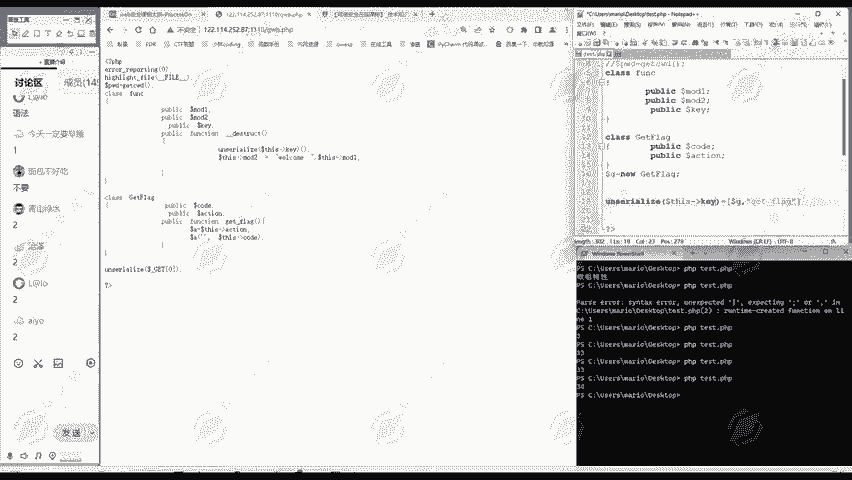

一个虚拟化操作是不是？😊，那我左边进行一个序拟化操作和unerize是不是就抵消掉了，相当于。😊，那左边呢就得到了Z4K。那右边是得到什么？Serize。这一个数组。是不是？

所以我对这个K负值负值成多少，复值成这个。这是不是一个字符串呢啊？这也是一个字符串。信化之后呢，就是一个字符串了。😊，但是这里呢我们还是在外部复制更加方便。

我们可以啊这个Z4K大家注意这个this是什么？是FUNC这个内。所以说我们先。

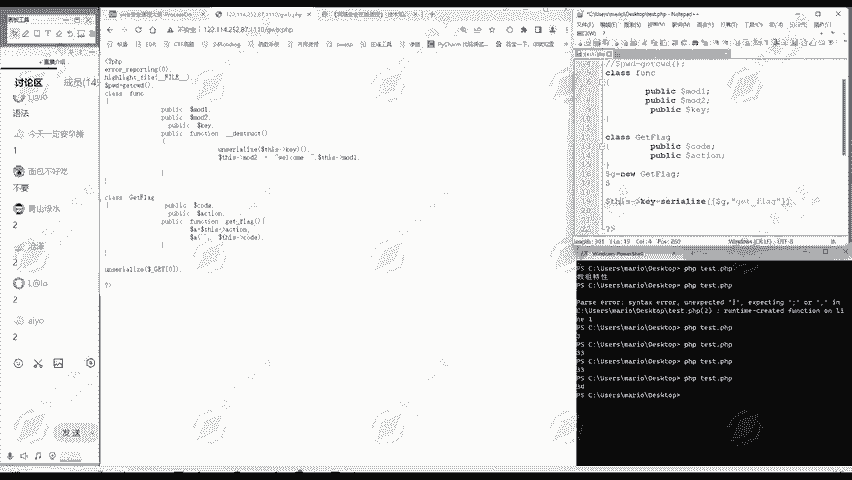

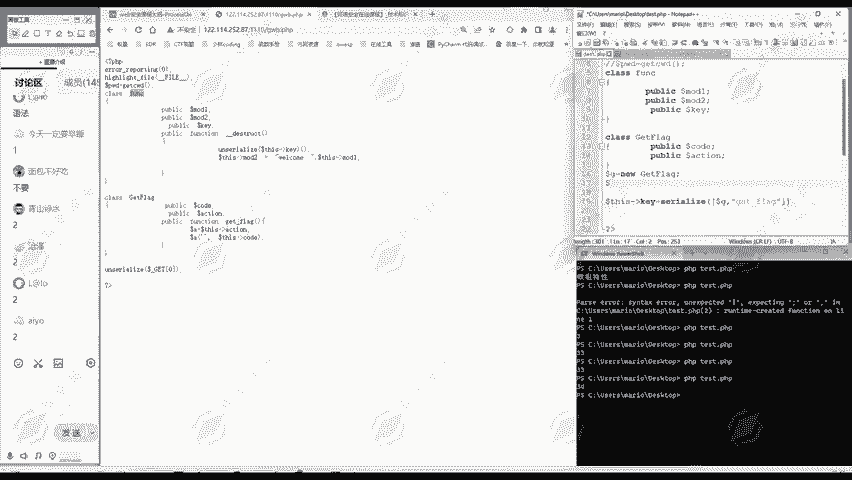

申请一个。FUNC的一个对象。然后呢对这个don了F。进行它的K属性进行复制。它的K属性就要等于多少？就要等于seize。只一部分。这你是怎么得到的？啊，实际上就列个数学等式。通过这种方法呢。

大家就更好理解。当你做熟了之后啊，你就一眼看出来了。😊，你不熟的时候，你可以自己念个等式，然后两边同新进行一个虚拟化运算，就同时进行sererize。

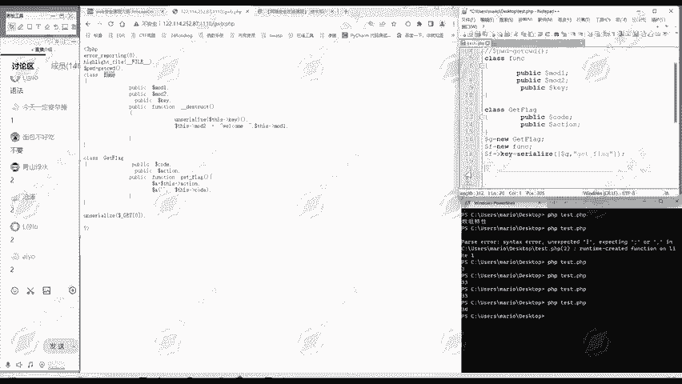

那这个就抵消掉。

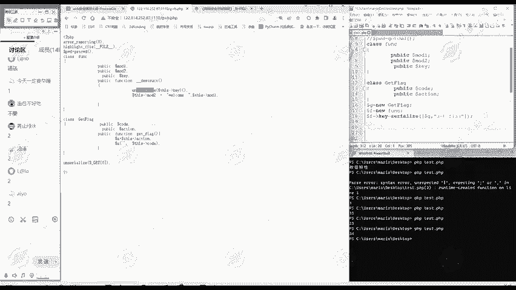

那么目前呢我们是能够走到这个get flag了，这是没有问题的。

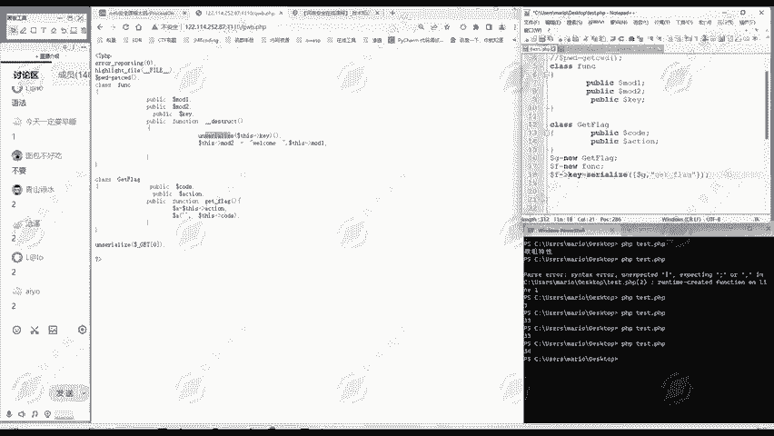

那则到ge flag怎么样实现我们的攻击的目的呢？我们要执行命令，或者我们要查看文件。😊，这时候啊就要编辑一下这个get flag类的一属性呢。

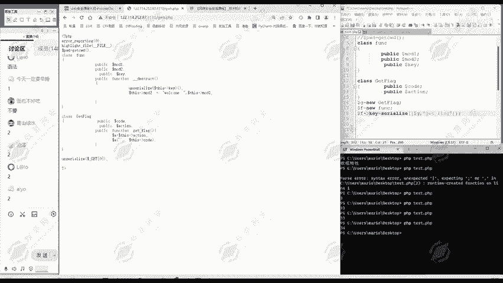

那么A是怎么什么X。X是等于什么？是不是等于create。Function。Greatre function。就能够我们自定义函数了，是不是？

那么code呢就是我们刚才给大家演示create function的用法里面。这是函数题，是不是？那么这个函数题哎是一个。什么内容？那么现在输入什么呢？它就可以规定函数题是什么，是不是？啊。

如果说我这里直接输入一些啊。弹射代码。他是嗯不会起作用的。大家想。为什么？因为这里多呢哎大家可以理解为就是create function。😊。

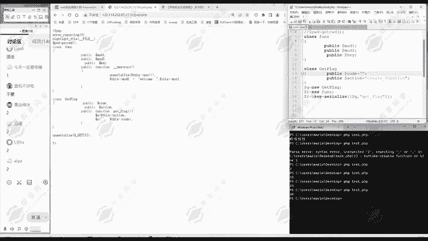

然后创建了一个函数。但创建好函数之后呢，没有调用，就这函数它只定义好了，它没有使用。那么怎样使用呢？这就是。new娜create function它的一个漏洞。

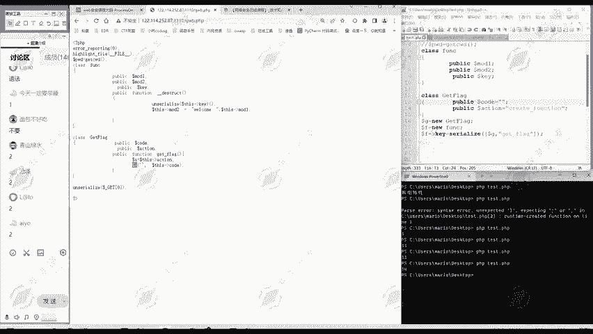

对呀。所以说这一节课呢我们也学到一个知识，就是create function漏洞的利用。怎么利用？他不是创建一个函数吗？那么之前。给他创建函数举个例子。我写在这下面是不是相当于这样？哆啦A哆啦B。

那么现在的哆拉A哆拉B都没有，都是空的。这里的函数题我可以写什么？大家想，如果说函数起部分呢？我不是写啊正常的什么多乐A加多乐B啊这些。😊，函数体部分是一个大括号，大家看发生什么，是B合掉前面的部分了。

😊，那后面的部分是不是逃逸出来了？这就是一个函数，这函数是空的。也是可以的。这就是啊create function的利用。这个利用大家要掌握在。代码执行呢很多方面都会用到。😊。

所以说我们这里的code可以等于什么呢？是不是我扣的这里也可以给它添加一个大括号啊。那么。它在create function，这个code就会闭合掉。像这样哎闭合掉，然我后面再输入我的自己的命令。

就可以逃逸出来。我想执行什么命就执行什么命，那后面再执行命令，我可以执行一个系统命令sister。比如说啊执行一个system L。有外面用的双引号，所以里面就用单引号ssemL，然后呢又有个分号。

就你还需要注意的一点呢。就是要加一个。这样一个注释符号。为什么？因为我们这里啊输入了system就是。我们可以把这一段贴过来。是实现了闭合，我们的命令也逃逸出来了，但是它最后呢还多了一个。😊。

这个打括号。所以说我们再补充一个注释符号，把最后的这个大括号哎给它注释掉。这样相对于create function就定义了一个空函数。这空函数我们不关心，关心的是后面。是我们注入的命令。哎。

这时候我们就可以执行命令了。那么到现在呢。我们的第三步就是完成了，给属性赋值啊，这一步是。整个的核心。反喧化的核心。所以说比较难。

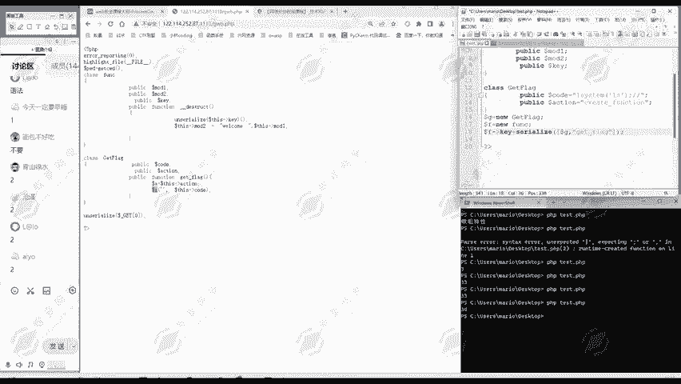

那么第四步呢就比较简单了，就是。输出序拟化数据嘛，size这个时候size是什么？是F，大家要注意。因为我们的这个G啊也是在F里面的，我们传过去的。只是F虚化之后的数据。那么之前给大家介绍过了。

由于有一可能有一些特殊字符，所以说我们一般要进行一个URL编码，URLincode。然后呢，把这个结果进行一个输出eal。保存一下。然后呢，我们执行一下。得到了这样的UIL编码后的虚拟化数据。

把这个数据复制一下，然后就第五步。啊，第四步生成数据，第五步传输到服务器，是不是？这个攻击目标，我们可以使用hiickb这个工具。这个工具如果说没有的，也可以找我们班主任进行一个领取。

那么这里呢是unserize get0，是不是get方法，参数名呢是0。😊，您呢就等于我们这里生成的序化数据。然后我们发送过去。大家注意到这里是不是显示了。这些文件。这些文件是怎么显示的？

就是我们LS的结果system L就是执行系统命令。😊，执行LS这个系统令查看当前路径下的当前目录下的文件，有这些文件。白那我能执行LS命令，我执行别的命令是不是都可以啊，在这里替换掉就可以了。😊。

那么这个题呢是比较难的啊。😊，啊，为了大家更好理解，我们再从正向来理解一遍。😊，就我们这些数据发过去之后是做了什么？😊，王我。那么服务器接收到啊这堆数据之后呢，会首先进行一个。URL解码解码之后呢。

我们可以把解码的数据。看一下解码之后就得到这样。得到这样的数据啊，这是个对象四字节的F0C它有三个属性，三个属性是什么？😊，得到这样的数据，这就是啊don not get零。

就是我们这里啊形成的这一段字符串。😊，那进行一个unswer nice之后呢，就得到F，就是我们这里的多南F，是不是？😊，那在执行程序退出的时候，哎，退出之前要执行destruct方法。

这是魔术方法是自动触发的。那这个魔方法去做什么呢？anserless this KF的KF的K是什么？就是这么多，是不是？😊，然后这一段呢进行uner yourizeonize之后。

是不是就是里面的这一部分啊？然snet和这个snet相当于抵消掉了嘛，就里面这个数组，然后在外面这个小括号，那就是把这个数组当成函数使用了，就触发数组特性，就会执行G的get flag方法。G是什么？

就是get flag这个内。😊，缺乏他给他付了个方法。然后A就等于action ，action等于多少呢？create function，那么A就等于create function。

那么现在决create function。然后呢，第一个参数是空。第一个参数是它创建的函数的参数是空。第二个参数呢是创建函数的代码。创建函数代码是什么？是我们这里的这一部分是不是？😊，首先就一个大括号。

就把它闭合了。那么后面的命令呢就逃一出来了，就得到执行。然后最后呢是两个下划线注释掉。😊，create function原本的那个大括号。这样呢就执行了stem L这个命令，我们就看到了有这些文件。😊。

那我们做CTF题目。是不是？它居然有我们看到有flag点PHP那自然要看一下这个flag点PHP文件内容是什么，是不是？我们再吧啊。URL盈扣的。再把这个编码一下进行一个输出。复制过来。然后呢。

把这里替换掉。发过去。我们k一下flag，它没有任何的显示，是不是？啊，这个时候我们注意要看一下这个网源代码。那么很多时候呢，这flag都在源代码当中。😊，是吧这样我们就得到了这个题的flag。

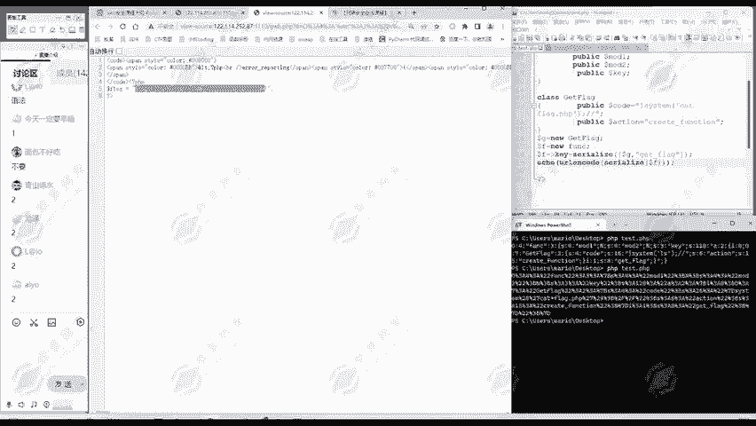

啊，对于我们今天讲的啊这个干碗杯的这个例题。😊，我知道难度是比较大的。大家理解了吗？有疑问欢迎提出来。有没有没听懂的同学？肯定是有的，欢迎骑出，没关系。😊，大家可以思考一下，我先喝口水。😊。

数组特性是啥？那么数组特性呢？嗯。来晚了可以讲一下吗？可以讲一下数组特性就是当一个数组，比如说我们这里的我们把这个专门拎出来。😊，我们放在下面看一下。这是一个数组。那现在呢加上括号。

它就被当成函数来调用了。但它不是函数，你把当成函数调用了，就会发生一些奇怪的事情。奇怪的事情是什么？😊，就是如果说他还满足第一个元素是对象，这个多了基是一个对象。第二个元素呢是对象下的一个方法。😊。

方法get flag是一个方法。它就会调用这个方法。那我们这个企就会调用get for flag里面的。下面get flag方法。那么接着啊那么L艾LO同学问get flag内的分析还能再讲一遍吗？

那么接着讲，那么刚才讲这个数组特性，是不是就能够调用get flag方法了？😊，那gt flag方法，这里面呢这就是一个create function问题。因为A的值是就是action的值嘛。

是我们能够控制的那就是create function。我们可以令它等于cre function。😊，那code的值呢我们也能控制。那么create function呢有一个问题就是。

你如果说在前面输入的大括号。会把它原来大块闭合掉，那后面的命令会逃逸出来。后面你想执行什么命令啊，就执行什么命令。那么刚才演示直线LS明年啊。😊，或者说发现有这个flag点P区。

然后我们就cat一下flag点PP就看到了flag。当flag是在源码当中。😊，还要点击右键查看源的码才能看到。😊，啊，这是我们杠杯的这个题。😊。

