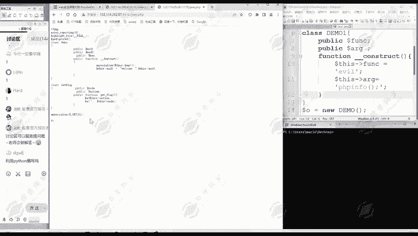
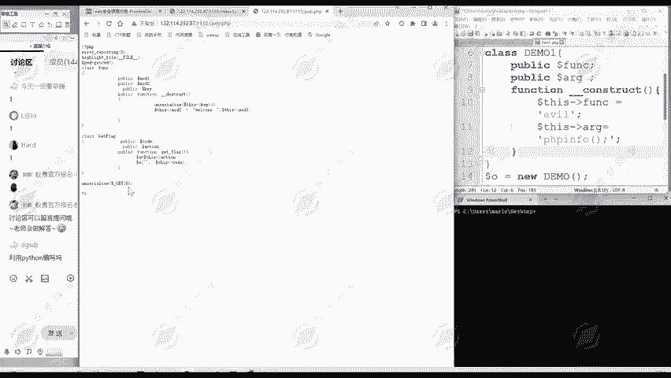
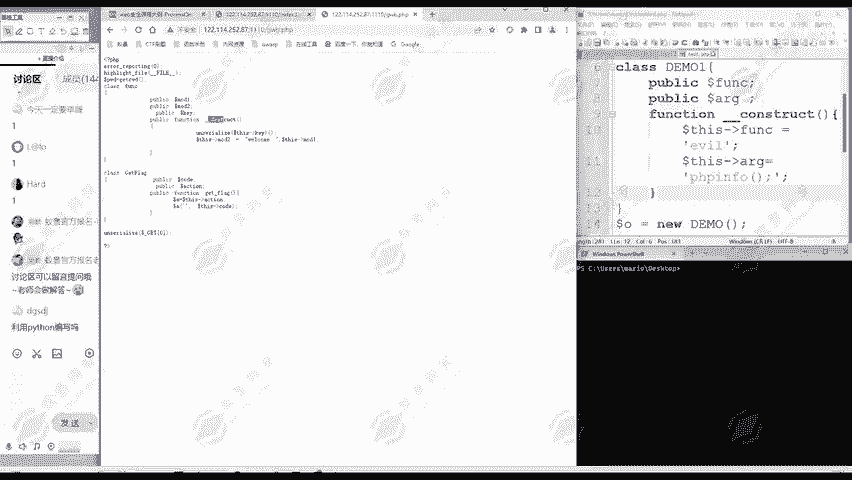
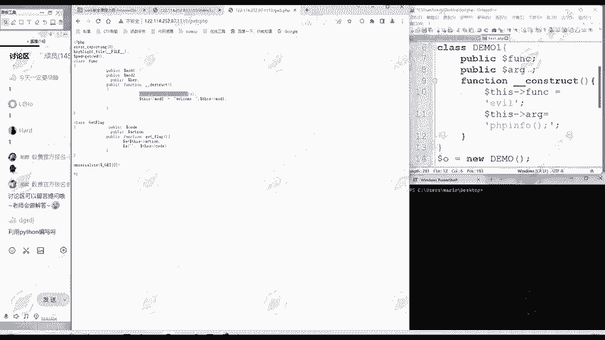
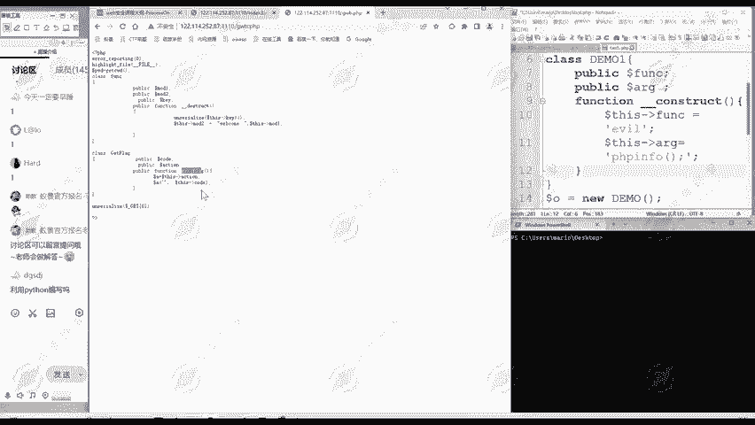
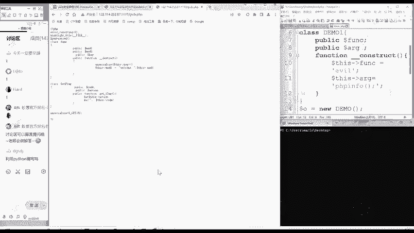

# 2024B站最值得看的黑客教程 ｜ 网络安全／渗透测试／内网渗透／漏洞挖掘／web安全／kali linux／红队靶场／CTF／信息安全 - P175：POP链（2） - 网络安全免费学 - BV1uBsTetEow

这个破布链是什么意思啊？POP它的含义呢就是面向属性编程，它是面向属性编程的英文缩写。😊，它pop链呢就是指从现有的运行环境中寻找一系列的代码，或者指能调用，然后根据需求构造出足连续的调用链。

那么我们说的反序化利用其实就是要找到合适的poop name。大家可以回顾一下我们昨天这个题是不是一个反循环链条啊。😊。

那我通过在这里啊用get方法传递虚拟化数据，然后进行反序列化。反序化之后呢，它会自动调印destruct的方法，是不是找到了？😊。

一系列代码或者指定调用啊，那就调用到啊就你destruct了。然后又通过这里的数字特性，又再调用到下面的get flag方法。😊。

这就是通过一系列代码或指能调用来实现一个攻击的目的，实现反虚化漏洞利用的目的。

只不过啊昨天我们没有系统的总结这个理论。那么反序列化利用呢其实就是要找这个破布链。