# 2024B站最值得看的黑客教程 ｜ 网络安全／渗透测试／内网渗透／漏洞挖掘／web安全／kali linux／红队靶场／CTF／信息安全 - P176：POP链真题讲解 - 网络安全免费学 - BV1uBsTetEow

那么如何啊寻找破布链呢？这里给大家总结一下我们的做题方法。那么寻找pop链它的实质，pop就面向属性编程嘛，就是改变属性。就是寻找可以控制的属性或者方法达到攻击的目的。

那么我们之前是不是给大家列出给大家总结的反序列化题的做题步骤是这五步，是不是？那么最关键的呢就是第三步。第三步呢可以说就是。寻找pop列。那么如何寻找呢？我们。这里啊告诉大家方法。

比如说这里用A表示第一步，第一步是干什么？既然是这个链条，它就有起点和终点，是不是？因为pop列就是一系列代码或指能调用嘛，来达到一些目的。所以说我们要找起点。那p列执行的起点是什么呢？😊。

起点就是啊反序列化的。地方。比如说我们。

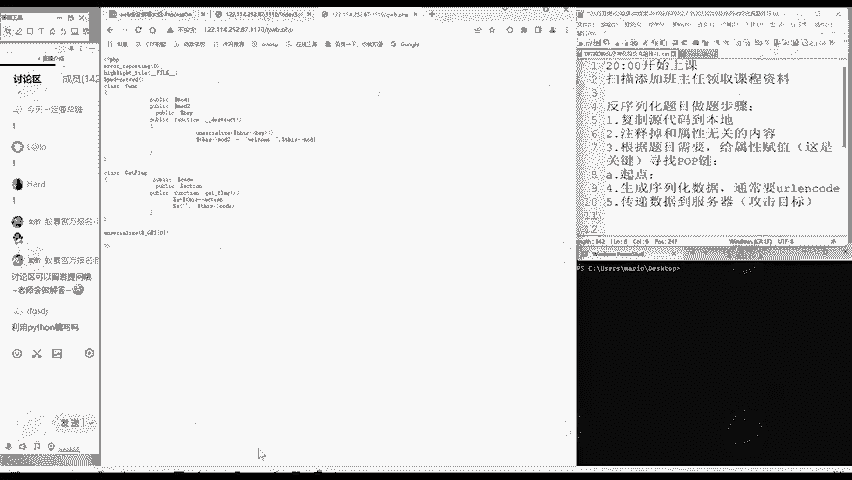

这里的这个函数，也就是这里这是我们能控制的起点。Uner your life。的。参数。可控。

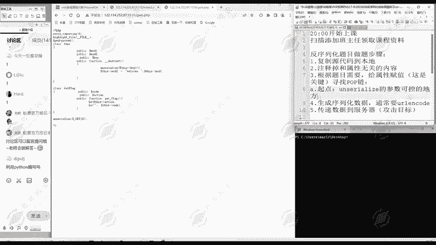

就是我们unerize这个函数，它的参数可控的地方就是我们利用的起点。因为我们就要把数据发送过去。

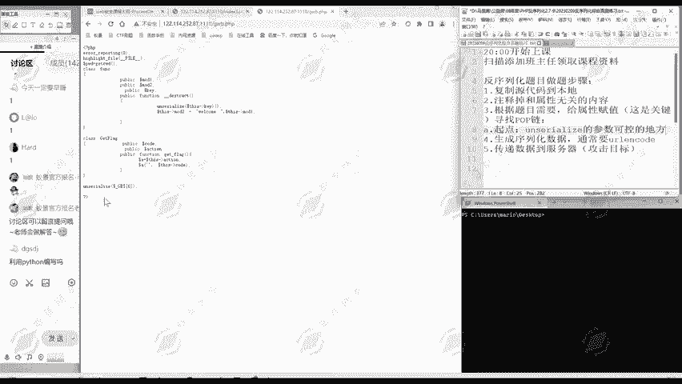

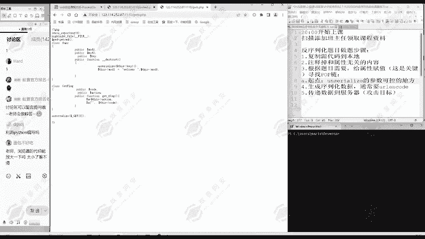

啊，现在把代码。放大一点，大家看的更清楚。这就是我们的起点。

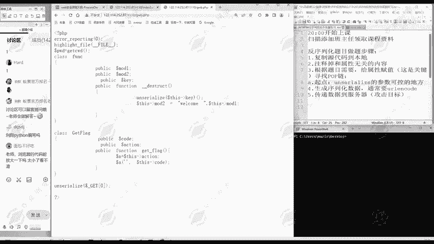

所以我们首先要明确起点，找到起点在哪里。那除了起点之外呢。还有就是终点。那么反序化的终点是什么？就是啊。执行代码。或者。可以。任意读取文件。

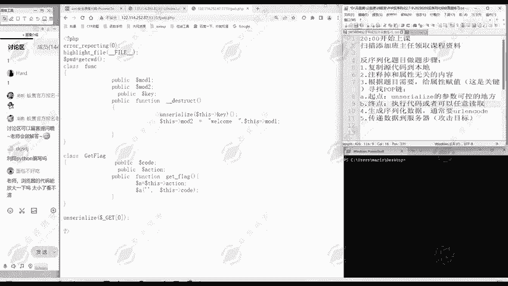

的地方。这就是我们反序列化的目的嘛。那以昨天的题目为例，那么们反序要的目的是什么？终点是不是在这里啊？😊，而在code这里我就注入了我自己想要执行的代码。

啊，这就是终点。所以说第一步找到起点，第二步呢找到终点。

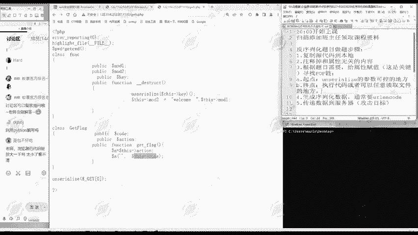

那找到起点，找到终点之后呢。我们第三步是什么？那就是吧连接。起点。和终点。那我把它连接上了，这就整个就构成了一个链条，是不是？😊，那么怎么连接呢？这叫研究。属性和方法。特别是。魔术方法。

因为魔术方法是可以自动调用的。特别是要研究这个魔术方法。然后我们找到连接起点和终点的方式。那么昨天的题目就是起点哎。是这里返修啊，然后呢它有一个魔术方法可以自动触发，那就走到这里了，走destruct。

😊，diisttract呢它里面又有一个数组特性。通过数组特性呢，我们又走到get flag这个方法这里了。就通过这样的方式就连接到起点和终点。那么它的整个执行链条就完整了。那么我们的利用呢也就实现了。

啊，当然这里呢？啊，主要是一个理论。那么有的同学可能还。不觉得理解的不是很彻底，是不是？😊，那没关系，我们呢现在呢就一起看一道题目。啊，昨天的题目关了啊，我们先看到啊新的题目。😊，这个题目呢啊大家一看。

😊，就比较复杂，是不是？😊，啊，但是复杂不要怕，这个呢是我们一个。中高难度的一个题目。那么大家把这个题目掌握了之后呢，我们的反系话就达到一个还比较不错的水平。那么现在一起看一下这个题。

按照我们之前讲的方法啊，我们一看啊这个题这么多代码。😊，你不要一行一行的看，那你就陷入到细节当中了。我们先要把握整体。😊，这一部分就不是PHP的代码，这是PHP标签，它里面的才是代码。

所以上上面这部分呢我们不用管。😊，那里面第一行呢是不报错，这个我们也不用管，那后面是什么啊，这一段是第一个类叫works这个类，是不是？然后后面呢这啊这一大段都是第二个类做这个类。😊。

然后呢就是peal第三个类。那么呢它有三个类，那每个类是干什么？我们先不用管。继续往下看，哎，后面是一段代码，这段代码呢是一个if语句，是不是？那判断判定这个条件条件是什么啊？

就是我们是否用get方法传递OZ这个参数。😊，如果传递了那就是unererize我们传递的数据，是不是？如果没传递啊，就执行下面代码。😊，所以说那么我们现在就做这个题啊。啊。寻寻找。破破捏。

那么以这个题为例，具体怎么找破布店。那么啊这个做题步骤第一步、第二步啊，第四步、第五步这都是程序化的，我们就不再重复演示了。我们重点演示了寻找p链的这一部分。怎么寻找的？第一步是不是明确起点啊？

那么起点就是呢。

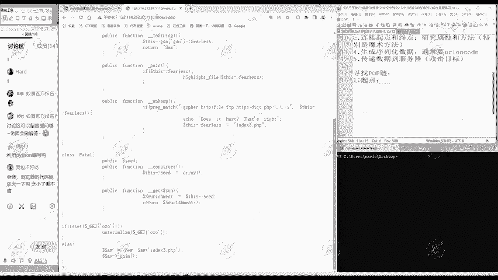

是不是这个do了ge。OZ我们可以通过它来传递。我们的虚拟化数据，这就起点。第二步呢，终点。找终点终点是什么？可以执行我们的代码，哎，或者可以让我们任意读取文件的地方。😊，这是我们的终点。

它终点是在哪儿呢？终点呢是一下看不出来的，这时候呢我们就。必须要进入到代码里面来看一下。它有三个类，我们分别来看一下。比如说第一个类，我们看一下boxs这个类。😊，它有属性，哎。

这里的属性是protective，是不是它不是pubonic了。😊，啊，这有点小小的不同。😊，然后呢，它有第二个属性，它有这个方法，放方法，放方法是干什么？include。一个参数。就是inclo。

大家知道什么？是不是文件包含了inclo。那么后面是一个文件名，或者说一个文件路径，它就会包含这个文件。这样是不是能够让我们知道文件的内容啊，这是一个可以读取文件的地方。我们只要在这里。啊。

输入我们想要读取的文件的路径就可以了。所以说include可能是我们的终点，但是也不一定。那么下面呢这里invoke注意到有两个下划线，是不是？😊，这是一种魔术方法，这个魔术方法是干什么的？

大家还记得不？😊，啊，这invoke就是调用嘛，它就是把对象当成函数调用的时候就出发。这你可以再给大家看一下我们的。这潜在课件。Invo可呢。就在这儿，当脚本呢尝试把对象当做函数调用的时候就会触发。

所以说这些魔术方法大家可以从另个角度来想，为什么会存在它就是应对各种出发场景的。你本来一个对象不能被当做函数调用，但是呢编写者忘记了，或者说他非要把它当成函数调用。😊，那你非要调用，这里呢就会触发一个。

方法就以说出现这种场景的一个应急处理办法。就这么理解，这个方法是干什么？是调用它的一个放方法。那么我们看第二个呢，还有第一个属性，第二个属性，然后第一个方法下划线construct，这也是一个魔术方法。

是不是？那这个方法里面干了什么？一个负值，然后一个输出，那这是不是我们的重点？😊，这就不是我们的终点，是不是？😊，他只能输出一个内容，一个这个字符串，是不是？那么第二个方法t string。

这也是个模式方法。那么他做了什么呢？啊，一系列这个操作。这里呢啊现在看不明白，没关系，我们等会儿会仔细再分析，这也不能够执行我们的代码，或者说实现任意读取文件的目的。所以说它也不是我们的终点。第三个呢。

碰这是不是一个魔术方法呢？我们看一下这个方法有没有呢？大家注意到有没有。😊，是不是没有这是不是有魔术方法？我们来判。大家觉得它是不是魔术方法？😊，觉得是魔术方法的啊，同学请扣个一，觉得不是同学扣个2。

😊，来大家思考一下我们这个 pen是不是魔术方法。😊，啊，是魔术方法就扣个一，不是魔术方法，扣个2。😊，啊，那像我们面包同学回答是正确，它不是磨冲网，还有我们的L。😊，艾特LO同学。回答的很好。

要艾特LO同学。😊，回答的很好，我们讨论圈它就一个下划线，大家注意到没有？下面出四转，这是两个下划线。😊，它就只有一个下划线，所以它不是魔术方法。所以说大家还是要多练习。

像我们L@LO同学每次作业都做了，所以说他知识就掌握的啊比较准，掌握的很理解的比较深，是不是？😊，和大家给大家布置的作业啊。还是希望大家都能够去做。😊，所以它不是一个模式方法。那这个。😊。

他就是一个普通的方法，他这普通方法是干什么呢？就判断这个属性啊是为真还是假。如果是为真的话呢。就会。海ight也是输出文件的内容，输出this fairness。它的一个文件内容。

那这有没有可能是我们的终点？这也有可能是我们的终点。它可以任意读取文件嘛，我只要控制了fairness这个属性的值。属性的值我们是可以控制的。大家要有这个意思，意识其实我们反序化就是控制属性。

属性你想怎么复值都可以。😊，那么就能读取这个指定的路径，是不是？但是这里呢啊是可能是我们的终点。大家可以告诉大家，它不是我们本题的重点，为什么？它不是魔术方法，它也没有方法可以触发。

就这个喷是没法触发的，我没法执行这个方法。那有的同学说上面的include。是读取文件放这个方法，它也不是魔术方法，它能触发吗？它能触发。😊，下面它可以通过invoke这个魔术方法来触发。

而invo这个魔术方法呢，只要满足条件就会自动触发。所以说最终这个放呢也是可以触发的。😊，那我们继续往后面看啊，这个wake up，那么这里又是啊魔术方法了，还有两个下划线。😊。

wake up这个魔术方法呢。他是干什么的？它就是啊进行一个反序反序化的时候。就会触发，进行uner your life的时候就会出发。然后触发之后干什么？它是this fairness这个字符串。

它来判断一下，匹配一下这个字符串里是否含有gopher啊、HTP啊、file啊、FTP啊这些词。😊，如果有这一次，他就会啊输出。这个不对，是不是？也就是说。

它不允许你给fendness属性赋值gopher啊，H或者HP啊或者fire这些词只是它过滤的词。那么这跟我们的终点啊，跟我们执行代码或读取任意的文件呢没有关系。那么第二个类呢就分析清楚了。😊。

那么继续分析最后一个类，peal这个类，还有属性。construct模术方法。某除方法呢是把C的设置成一个数组是吧？😊，那这显然不是我们要找的终点。那么下面呢get这也是一个魔术方法。

这个魔术方法是干什么？😡，他的首先看它触发条件。就是访问不可访问的属性就会触发。那么larrament。等于this say啊，它就是一个负值嘛，然后调用这个nurishment这个函数。😊。

所以说它也不是一个代码，或者说一个任意文件读取的地方。那么我们整个代码分析过来，是不是现在就已经。啊，可以明确了我们的终点呢就是。

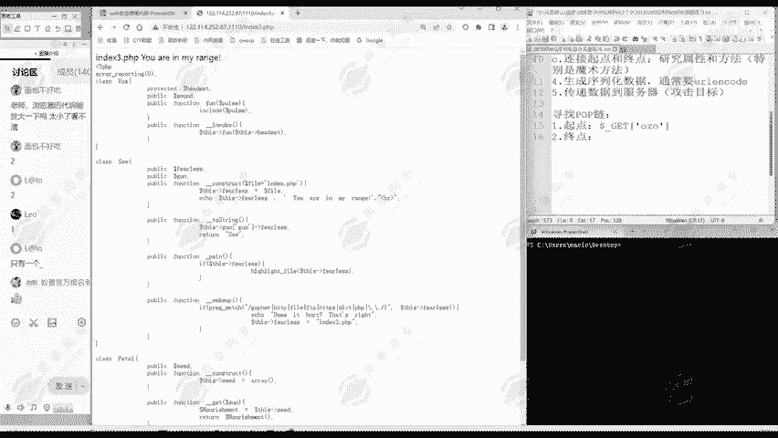

放这个函数。是什么呢？是works这个对象的。Vvo X这里啊我用两个冒号。来表示是works对象的放方法。因为后面我们在使用pop键的时候，为了给大家更好的展示呢，我们会用箭头来表示这个链条。所以说。

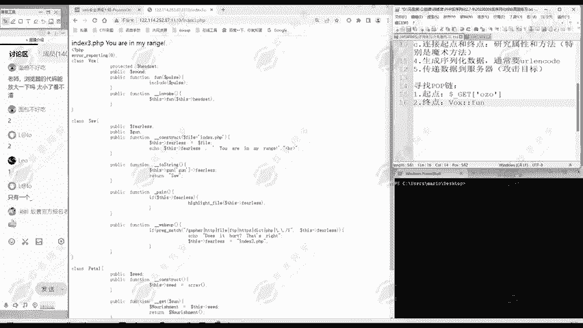

啊，这个内下面的某一个方法就用两个冒号来表示。

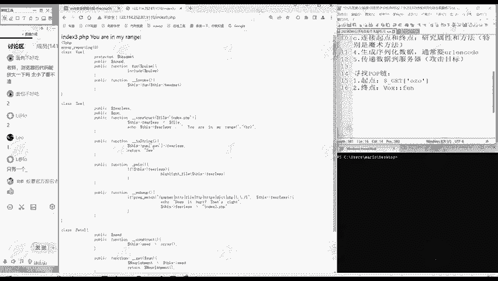

也是为了让大家看得更清楚。那么这就是我们的起点，这是我们终点。我们只要能给到放这，哎，我们这个。属性pos这个参数呢，我们可以自己复制。那么就可以实现任意读取文件的目的。那么现在就要进入到第三步。

是不是？连接。我们连接起点和终点，怎么连接呢？大家注意到我们连我们连接的时候呢。

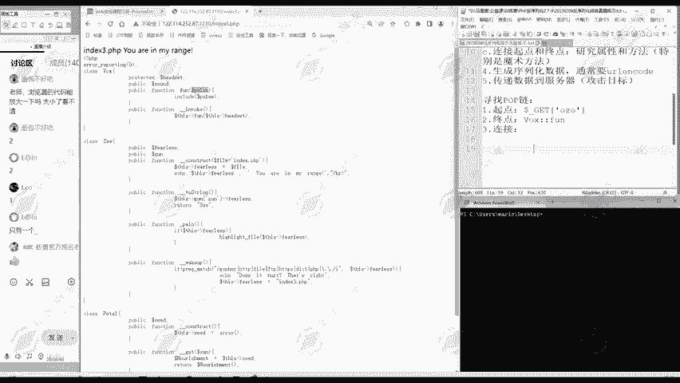

是从起点出发还是从终点出发，大家可以思考一下。一般呢我们找连接方式呢是从终点出发。

往回推推到起点。因为从起点出发呢，你不知道程序下一步往怎么走，才能达到你的目的。😊，我们就要从终点出发，然后一点点往前推，直到推到我们能够控制的起点。

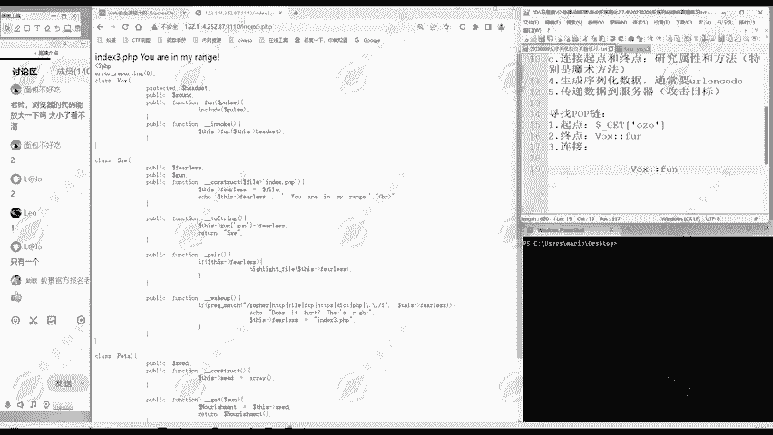

起点是我们可控的，终点是我们希望到达的地方。好，那么怎么样到达works的放方法呢？是不是通过这个invoke方法就可以到达works的放方法。

因为invoke它就执行this放就this呢这里就works，是不是执行works的放方法。😊。

所以呢我们通过works的。这里啊都用英文输入法。通过works的invo方法呢，就能到works的放方法。

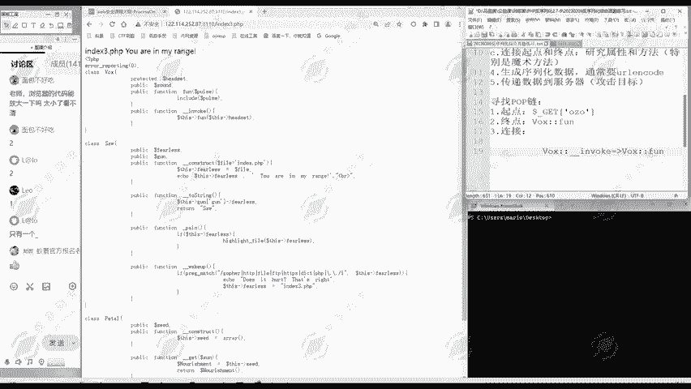

那如何到这个vos invo方法呢？我们再查一下这个表invo方法。啊，大家多看几遍就会了，是什么呢？把对象当成函数调用的时候就会触发。所以说我们现在就要找把works这个对象当成函数调用的地方。

那么哪个地方是当前函数调用呢？啊，当家这时候呢自己做题的时候就要找一下，看一下各个方法。你们哪个哎有把对象当成函数调用的地方。😊，最后找的找到哎是这里。peal的这个get方法。啊，这里我就把它分行。

大家看得更清楚。为什么是这个get方法呢？我们注意到这get方法是不是首先是把sed复制个nrment，然后再进行调用。如果说哎。😊，我这里面的。是的。是等于一个works对象呢。

是不是那我ment来调用现在ner arrangementment它是不是一个对象啊，然后你后面一对小括，就是把它当成函数来调用。😊，是不是就会触发我们works in work方法就走到这儿了。

那么他们俩之间就联通成功了。只要你对属性。😊，进行啊这样的复值，复制给box就可以了。😊，那么我们继续往上面找，哎，如何到这个peal这个对象的get方法呢？get这也是个魔术方法。😊，听好了。

我们再记一下get呢就是访问不可以访问的属性。😊，访问不可以访问的属性。就处罚。那哪里有访问属性的地方呢？大家想想什么是访问不可以访问的属性？😊，我哪peal它哪个属性它不可以访问C的属性，它能访问吗？

它能，因为这就是它这个内里面的属性，它不能访问什么属性。😊，别人的属性他不能访问。比如说这个GUA属性，这是所有对象的属性，跟你peal这个内没有关系。😊，fendness啊跟你拍照没有关系。

你就不能访问。包括上面的还在set，s的跟你peal都没有关系，这些是不能访问的。😊，所以说我们要使这个paon对象访问一个它不能访问的属性，就要访问这些啊GUN啊，这个fnness啊、桑德啊这些。😊。

那什么地方访问了这些属性呢？我们注意到哎，这里进行了一个访问。这里是不是访问的fendless出现？如果说哎。我宁。上面如果说我念这个。SAW。そ好的。哎，这前面一段就你怎么运算，我等会再教给大家。

这一段呢，如果说整体上是等于。我的拍套。那现在是不是又访问peal的fless出现？那pe特没有f斯出现。就触发peal的。get魔术方法是不是？那么后面的链条就走通了。😊，啊，这里。让大家理解就好。

但然如果不理解的同学大胆提问没关系的。😊，所以呢我们就需要走到哪儿啊。需要走到我们所。的这个下划线。出。除始str我们需要走到这里做的除始str这是不是？那么现在到了初次这还是没到我们的起点啊。

我们还要继续。😊，往前推推到我们的起点。那么t string这里哎又是怎么到达t出 string呢？这两个下划线，它也是一个魔术方法。它跟invo类似。

我们刚才有个invo invo就是你把对象当行数调用，它就触发invo模式方法。那出str呢str就字符串的意思啊，就把对象当成字符串使用，它就触发出 string这个方法。😊，那么这代码里面哪里有把。

对象当权。字符串使呢？现在我要把做这个对象当成一个字符串使。😊，当然哪里有当庭自付串使用。😊，是不是这里啊？这里我们刚才讲这里是是干什么，是不是做一个匹配。

看这个fairness的值里面哎包不包含gopher啊，HTP这些字符。就说你后面的字符串是否含有前面的这些字符。😊，人人说这里是一个字符串。那我现在就要使。是吗？这本身啊这也是个数。这个做的呢。

Friends。它也等于一个做对象，是不是等于我们下面这个做对象。那我们这里呢上面做个区分，我们一个内呢是可以生成多个对象的，他们不矛盾。哎，错第二个内呢。😊。

他要它的fness属性要等于我们 saw这一个对象。那么就把下面这个做就当成了一个字符串使用，是不是后面呢就继续串通了。那么现在呢这也就是说我们走到了哪。W2的。wake up，我们走到这里。

这个维up也是一个魔术方法。是不是它是什么时候调用，我们再来查表。当你插表插多了，你就不用每次来翻过来查表了，你就熟悉了，是不是这点大家再熟悉一下，wake up呢就使用unthize的时候去触发。😊。

使用uner night哎，哪里使un your night？😊，是不是我们的起点这里使用了onerize？是不是？啊，我们把这个整体作为起点是可以的。这个旗舰这里呢就使用的unserize。😊。

所以为了是我从起点站能够走到索2这里。所以说我这个OZO。是不是要等于。我们的这个做这个对象。当然是虚拟化的数据啊。那么整个链条是不是就连接起来了？起点是我们可控的终点呢。是我们希望到达的地方。

整个链条呢就走通了。走通了，那我们现在开始具体啊做题，我们现在分析清楚啊。😊，分析清楚之后呢，我们具体的做题。做题到五步，第一步复制源代码到本地。counttrl复制一下。然后还是复制到本地。

第二步呢注释掉跟属性无关的内容。那么为了让大家把代码看的更清楚，更简洁一些，我就把跟属性无关的内容。都删了。都删掉。空行也删掉。那么这里呢有很多跟属性无关的内容。都删掉。第三个类paal这个内。

然后下面的这部分呢也是跟属性无关的，也是。统通的删掉。

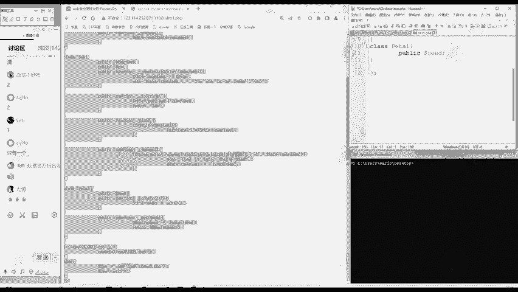

那么现在留下的啊跟属性相关的就是这么多。第一步第二步完成了，那么是吧？第二步注释掉，然后属性无关内容，我们这里就删掉，我了大家看的更清楚。那么现在就进入了第三步。第三步呢，根据题目需要给属性赋值。

那么也就是寻找破布链。寻找破布链。刚才我们的分析呢已经把这个起点呢终点呢如何从起点走到终点给分析清楚了。😊，那么如果说啊之前没有一个做题经验的同学，那可能现在还不知道，那我到底要怎么复值呢？

这里就给大家演示一下怎么赋值。😊，赋值呢还是从我们的终点开始。我们这里的终点是不是放？他是从哪到来的？是从invo这里到来的，是不是？😊。

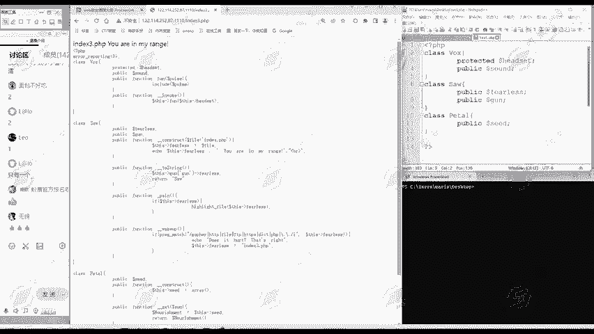

所以说我们首先呢要建立一个对象，比如说叫donorV，就是new。Works。是不是？嗯，叫你不讲太快。免得啊有些同学之前没接触过的，跟不上。因为我要用到。

放是不是昨对我肯定要生成vos这个类的一个对象嘛。然后对属性赋值。这个work属性我要付哪个值呢？😊，这个pos是不是我读的文件路径，这poss是什么？是从invo这里过来的，是不是？😊。

所以这pass就是啊this hadet。所以说headtet呢就是我们要读的文件路径。😊，那么我们这里呢是一道CTF的题目，我们就要读flag。文件路径呢就是啊flag点PHP。啊，这你读什么文件。

大家不用管，掌握这个读文件的方法就行了。你读别的文件也是可以的。😊，是吧这是不是对属性赋值啊，采用的是直接赋值法。直接就在这里面就对属性复制了。😊，那么这个引幕的方法呢？是按魔术方法自动触发的。

那么这个works这个内的操作。

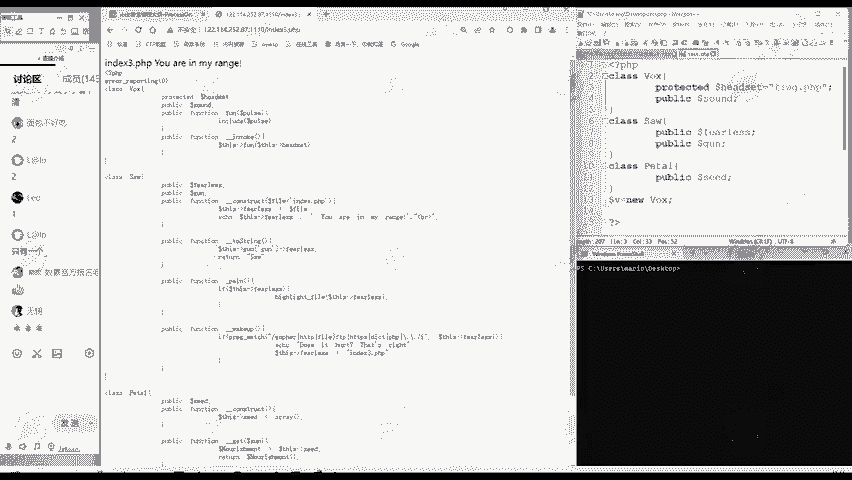

就完成了。那下面呢。works是由谁出发的？需要peal，那我们要生成一个peal类的一个对象。比如说多nerP就等于6。Pal。然后多纳P要进行哎，这个peer对要进行什么赋值呢？😊。

我们为了让nriment的。能够调用，是不是我们刚才这里的分析回到这里的分析是不是要C的。😊，要等于我们的works这个对象。也就是说，doner批的。C的属性。等于呢多ner位。

得用我们box这个对象就把它俩连接起来了。这里是采用外部复制法，为什么要采外部复制啊？因为这个C的这个属性的值，它是一个对象，它不是一个字符串。😊，那么peal复制完之后呢，我们是不是就进入了s里面了？

因此呢我们生成一个多南S6。做这个对象的做这个类的一个对象。那么刚才。在做这个类里面是要什么？哎，这个对象的这个GUN这个属性属性呢是。哎，后面这一块要等于peal，这你怎么理解呢？😊，啊，就是这。

就是这一部分。他的烦呢是。这一段啊怎么理解？其就像我们昨天讲的一样，就像初中数学一样，从左到右运算。它首先运算这次基为属性。然后对属性结果呢，后面的啊中括号呢就是取数组的值。

数组的键键是GUN所对应的值。然后呢，前面的整体的结果呢再访问fendness属性。所以说我们现在呢就要逆。到了S。它的GUN属性，它必须等于一个数组。ARAY呢耳瑞就定义数组的。

数组呢。他访问的键是GN，所以说我们这里输入。

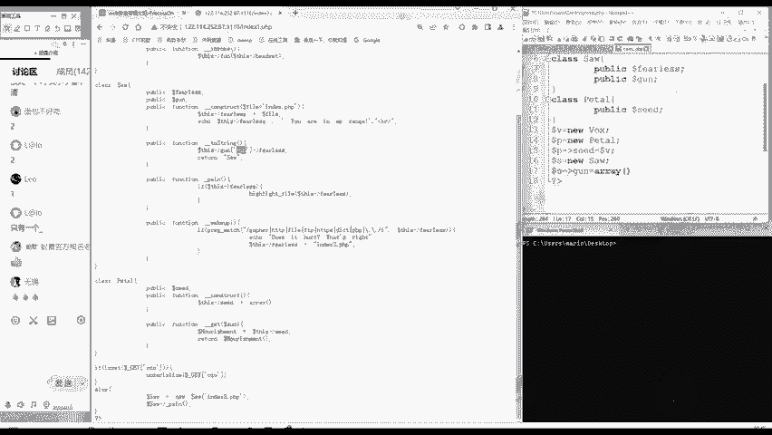

GUN左键，然后用等号在这个间括号。啊，作为连线，后面输入的呢是这个键对应的值。它这个值应该等于多少？我们刚才分析是不是等于多那P啊，就连接到P这里了。😊，pe头这个对象了。那这一步啊就复制好了。

那么继续按照我们刚才总结的。

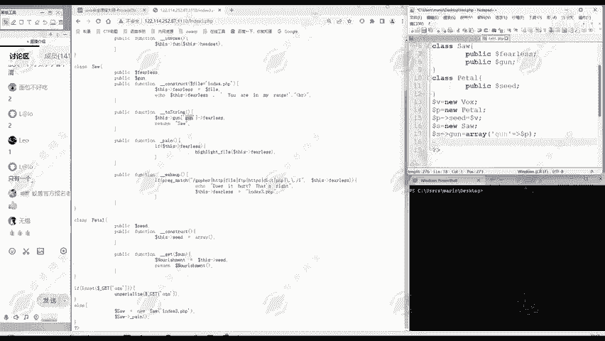

找到剖布链，继续往。后面走。那到这个出 string，这里是怎么触发的呢？问他走到这里，怎样才能走到这里呢？是不是要到这里啊？😊，要把this fairness。要等于我们这个多纳S。这你怎么办呢？

我们刚才给大家总结的，是不是我们一个内做这个内可以生成多个对象，我再生成一个对象就可以了。😊，因此呢我们可以定一个donnerS2等于6。4。然后呢，多纳S2它的。Fairness。

属性呢是等于什么donnerS是不是？那你现在访问多了S2的fS属性。就到这里是不是？😊，那就把S当成一个字符串使用了，就会触发S的出磁砖方法。那后面啊就继续走通了。那么怎么走到S2这里呢？

是S2这一段啊，我们看到直行面是在weakeup里面，是不是wake up触发方法就会进行unseerize。😊，因此呢连通我们起点就行了。我们只需要啊生成信拟化数据。Size。多了S2。

因为这个虚拟化数据呢是要传递给这个OZ的，所以说我们进行一个URLin code。然后呢，把这个结果哎给输出出来。嗯。那么这就得到了我们申请的虚拟化数据的URL编码。然后呢把它传递过去。大家。

大家可以预测一下，我们能不能读到我们flag点PHP的内容呢？传递的方法就问号用get的方法嘛，问号后面是参数，参数名字是OZO。😊，大家想想我们。把这代码申成的数据贴过来。

能不能看到flag点PPP的内容呢？😊，啊，我们执行一下。哎，现在页面没有任何显示，没有任何显示的时候不一定是没有内容。我们查看一下文源代码。😊，那么网页源代码啊也没有内容，是不是？

那就是啊真的没有任何内容。

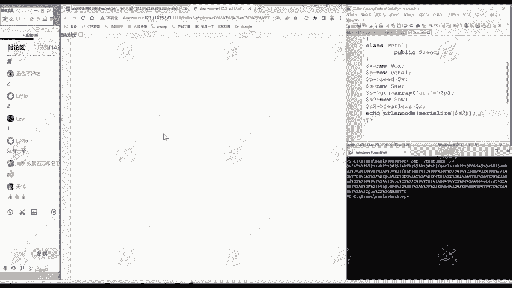

是一个空的文件。为什么会这样呢？大家注意啊，这里是使用的inclo，是不是？😊，我们给它传递的值是什么？flag点PHP。😊，它现在呢相对于最终执行的include flag点PHP。

它会显示flag点PP内容吗？他不会我改成这样，你再硬经扣着的话。include它就会显示flag点PHP内容的base缪斯编码形式。那么把这个修改好了之后呢，保存一下，然后呢重新执行。

然后获得这个反序列化数据，获得序拟化数据的baase。这个URL编码，然后把这里贴过来。😊，接下来我们再次执行。大家注意到这里显示了一串啊，看起来像奈马那玛的东西。😊，那么呢最后有个等号。

大家注要最后一个或两个等号的那大概率啊就是。贝斯64编码遇到这种乱码，不要慌。我们把它解码一下，把它贴过来。这样黑ick bar呢，这工具呢就有解码的这个功能。

你code里面呢有一个base newsdecode还进行解码，解码就看到flag点PHP的文件内容了。😊，就获得flag。你读别的文件也都是可以读到的。同样的，为了让大家理解更清楚了。

我们刚才是从反向是从终点往起点推的。现在呢我们从起点往终点走一遍，看它数据怎么执行的。😊，那我们发送过去的是不是编码后的序拟化数据啊？那么啊这个服务器呢会自动进行解码。

所以说URLin code就自动解码掉了。那么我们发过去的就相当于是这个size。😊，啊，我们发发过去相当于这个，也就是相当于是。OZO等于这么多。get多了get of等于这么多。😊。

那再进行answer nice，是不是就把S2给恢复出来了？那么我们说onster nice。一旦使用ser net就会触发魔术方法，触发S2的wake up方法，是不是？

维克方法就判断它的fness属性里面是否有这些字符。是不是S2的finness是什么？是S。哎，那你现在把S是一个对象，你现在把S当成了字符串来比较，来，看看有没有这些字符。😊。

那S它的模式方法就要生效了，它不是啊字符串，你非要把它当字符串使用。😊，是吧他的魔术嘛也就要生效了。那么多了S的魔术方法。😊，生效的是什么？是初丝缀这个魔术方法。😊，形象的那它的GON属性是什么？

是一个数组。😊，这个数组里面的GUN这个键，它的值呢就是多纳P。那么这一步呢就是相当于访问多纳P的fairness属性。😊，dotaP呢是一个peal对象，它的fows属性，哎。

它不能访问fredows属性，它没有这个属性。😊，所以说那你现在他没有这个属，你非要他访问，那也就要触发peto的魔术方法了。😊，访问不可访问的属性呢是触发下划线get魔式方法，那就走到这里了。😊。

get模式方法，那nurishment就等于door p c c是等于多少，等于donor v。那nurishment就等于这个donor v v这个边量这个对象那nurishment加个括号去调用这个函数。

那door v作为一个函数调用。😊，多A它是对象，它不是函数。是吧你又使用错了，哎，又把它当成函数来使用了。😊，那就要触发这个多nerV的。invoke魔术方法，这个invo魔术方法是干什么呢？

调用它自己的放方法，然后参数呢是heads set，headset是等于什么？哎，是等于我们这么多，就是文件的路径。😊，大家可以这么理解。然后放红码就include这个文件。

当然这里我们为了能看到文件的内容，所以说进行了一个base news编码，获取结果之后再进行解码，这样就看到文件内容了。😊，啊，这就是从起点到终点的一个执行流程。

