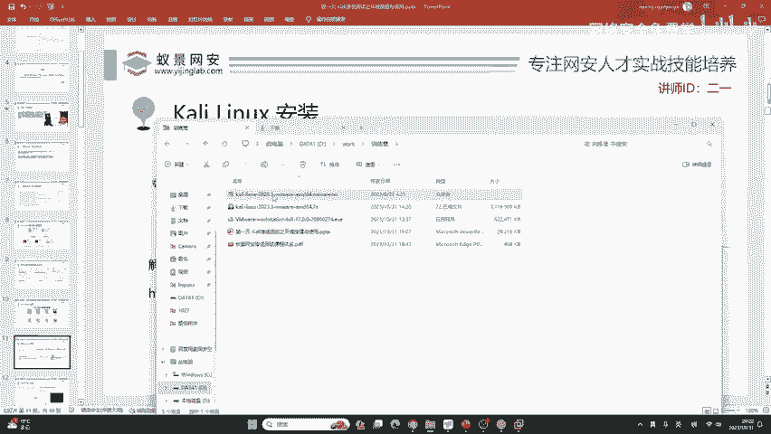
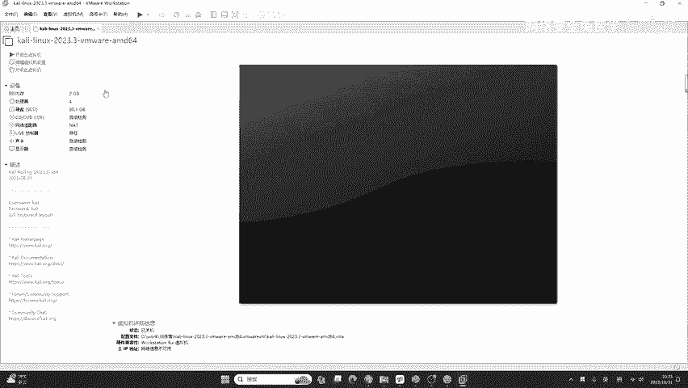
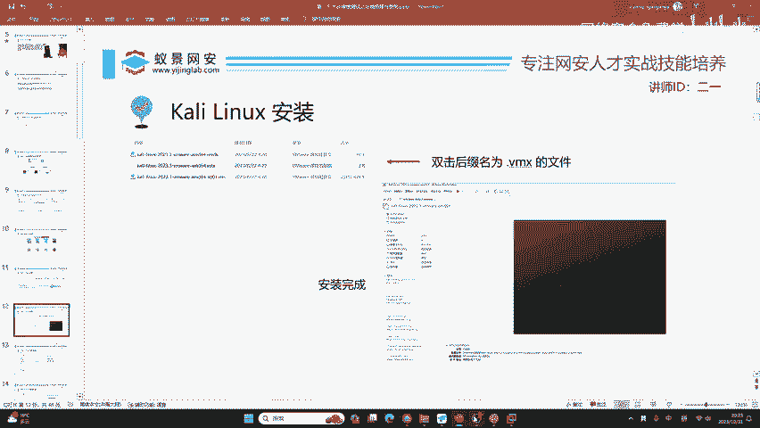
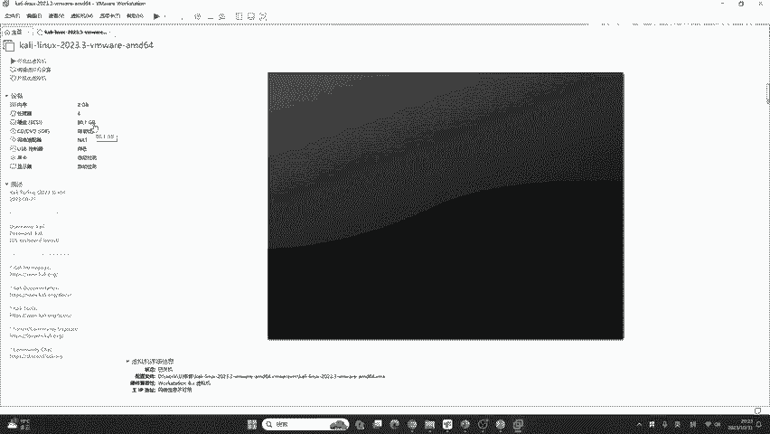
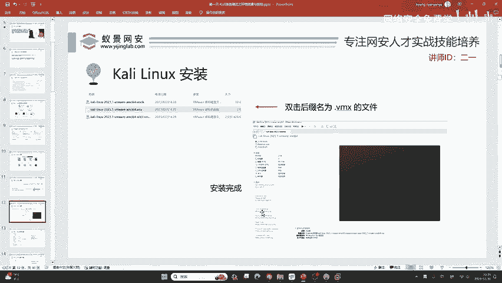

# 2024B站最值得看的黑客教程 ｜ 网络安全／渗透测试／内网渗透／漏洞挖掘／web安全／kali linux／红队靶场／CTF／信息安全 - P17：kali linux安装 - 网络安全免费学 - BV1uBsTetEow

那现在呢我们就需要把它呃这个卡里去安装好。那在卡利的虚拟机下载页面呢啊它会分为如下的几个版本。大家可以去看一下啊，这几个版本分别代表什么呢？我大致介绍一下，我们现在去学网络安全有必要了解这些东西。

在卡利的官网中每一种虚拟机啊，它一共提供了4个版本分别是vM就是今天我们所用的，它是对于小白最友好的。另外一个叫做vibox virtual box啊，它是免费开源的这个VM它不免费啊。

只是我给大家的激活码，你可以用它本身是不免费的。而这个vi box它是免费的虚拟机。然后第三个呢是这个 hyperperper呢是我们windows操作系统的CPU虚拟化。

就比如说我们在微软的商店里面下载的卡利或者是安装的卡里。😊，windows操作系统子系统都是基于hyperV的这里啊是QEMUQEMU呢也是一个虚拟机的模拟程序啊，被广泛的应用在各种的虚拟化设备上面。

这四种类型呢都可以支持我们的卡里对的 hyperperV就是WSL啊。这个同学啊徐同学你讲的非常正确啊。它就是WSL啊， hyperperV。好的，那我们今天呢为了照顾咱们的小白同学啊。

咱们就以VMO来就讲解。激活码在哪？激活码在咱们预习内容中啊，这个百度云资料，你可以看到VMor1期激活密钥啊，在这个写道，大家有问题啊都可以提。我看到之后都会给大家做解答。好的。

我们下面来看如何去把快速的把这个咖利去安装好。那首先呢如果你下载了老式百度云盘里面的卡利，它是一个点7Z的压缩包。这个压缩包呢，我们需要把它解压出来之后才能运行。有的同学说话非常简单。

但是有的同学啊你不清楚解压为什么，就是因为你过度于依赖windows操作系统自带的解压软件，而windows自带的解压软件是几乎不可用的。就说它太垃圾了，几乎没法用。

那所以说呢这里推荐大家安装一个第三方的解压软件。我推荐的呢，比如说像免费的班yof。出现的这个出出品的这个班DCIP啊，它是一个免费的呃压缩软件，解压软件都是一样的那下面呢我们可以做一个简单的演示啊。

把它解压到当前目录就行了。我们解压到当前文件夹。啊，这个同学推荐呢也是正确的啊，就是比如说像7zVZIPRIR都是非常好用的呃解压软件。当然也有一些国内的啊，比如说像360压缩2345压缩等等。

不过国内的这些软件呢可能广告比较多，并且呢捆绑比较严重啊，大家懂得都懂，我就不多说了。😊，好，在这个地方呢，我们去打开解压之后的文件。这个文件里面呢第二个是一个点VMX结尾的这样一个虚拟机配置文件。

我们在进行完上一步安装好VMwork session之后，你只需要双击它。

稍等片刻。好，卡里就安装好了，你不需要对卡里做任何的这样一个安装过程。就是说你不需要等待它的安装，不需要做过多的配置，就可以把安这个卡利啊去导入到咱们的VM more workst中。

那导入卡利呢仅仅是我们入门卡利的第一步。那现在我们要讲如何采用高效的配置，把这个卡利啊变成咱们一台非常好用的linux服务器。首先我们这个目目标啊就要转到这个右边这个左侧啊这左侧。

这个左侧没看清是吧？没看清的话，在课件上给你看啊，咱们只需要去双击这个点VMX的文件就行了。这个压缩软件叫做班迪ZIP啊，班迪ZIP。双击它之后就可以安装完成了。咱们的卡利就这么简单。

但是安装完成之后啊，大家总是在纠结，哎，老师卡利的密码是多少，包括这个卡利，我要设置多大的内存啊，这个处理器要设置成几何呀，这些是困惑很多小白的这些问题啊，因为你没有经验。

你并不清楚卡利到底他需要多大的内存。那我在这里完全有实力来告诉你最终的结果。😊。

