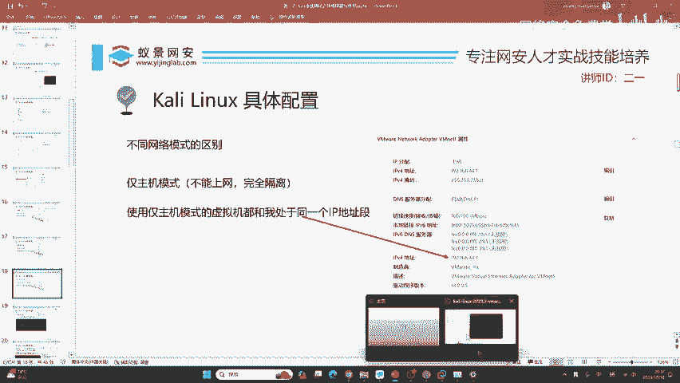
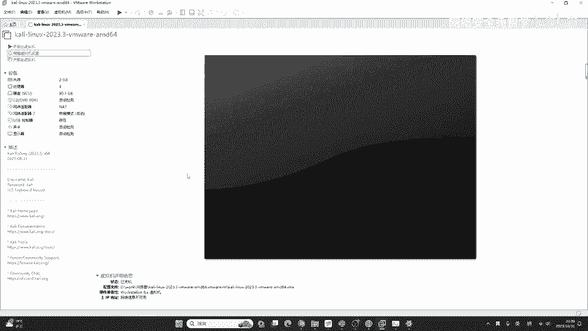
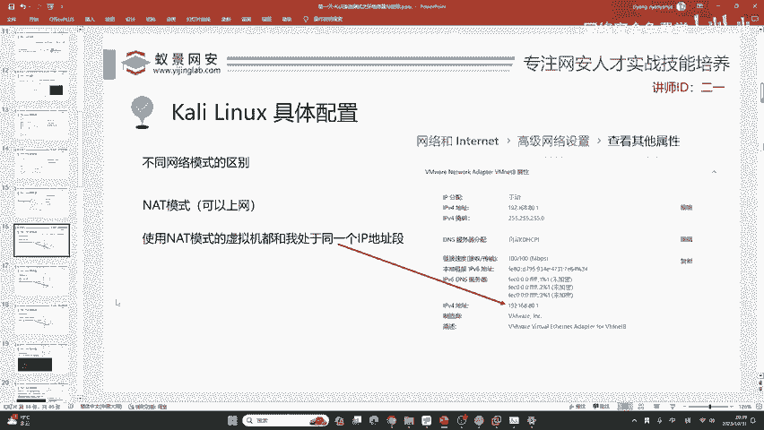
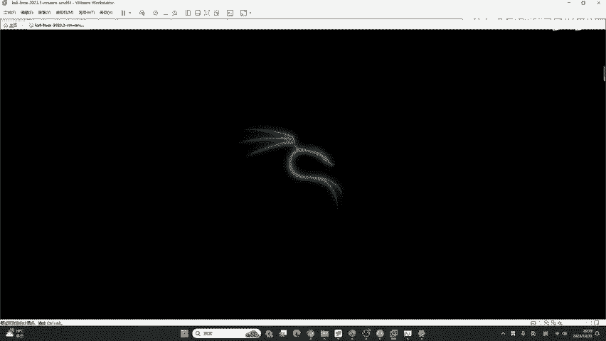
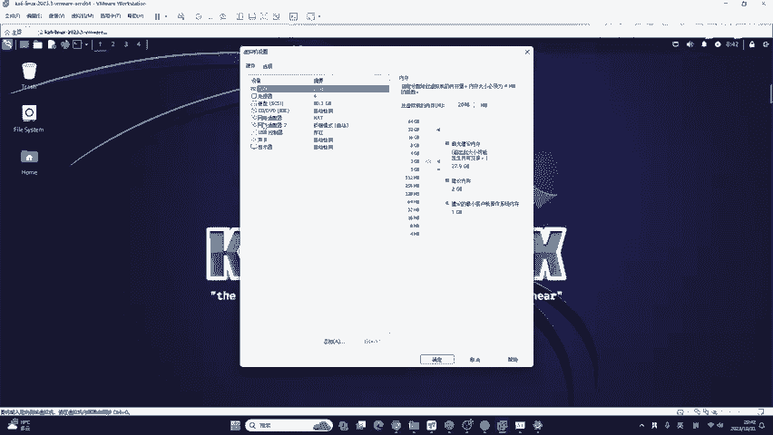
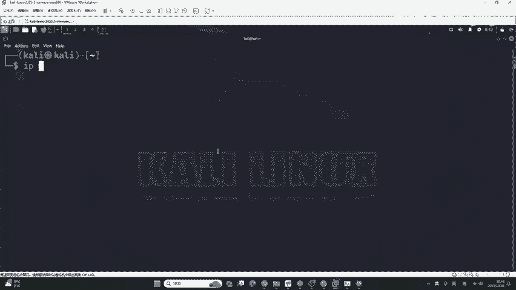
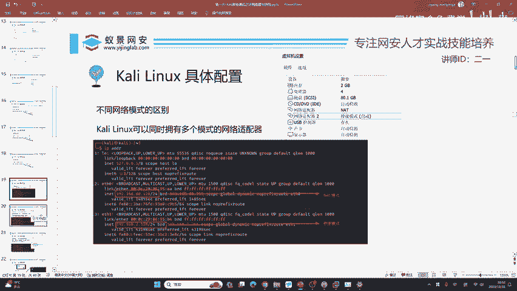

# 2024B站最值得看的黑客教程 ｜ 网络安全／渗透测试／内网渗透／漏洞挖掘／web安全／kali linux／红队靶场／CTF／信息安全 - P18：kali linux具体配置 - 网络安全免费学 - BV1uBsTetEow

首先，用户名和密码在这个左侧啊给你写的非常清楚。比如说这里啊他给你写了us name是卡利password也是卡利。😊，这个网络及硬件配置是我们必须要学习的。你从卡里的虚拟机。

你可以引入到举一反三到所有的虚拟机。不仅仅是虚拟机啊，包括你以后接触到的，例如说像open stack，例如说像PVE，例如说像一些更高级的一些虚拟化平台，它其实都是差不多的啊，都是大同小异的。

我们这里啊给大家一个解决方案，首先就是内存，它内存是默认2GB。如果你确定啊我的咖利里面以后我不会再安装其他的软件，那2个GB足够使用。如果你觉得这个咖利啊里面的工具太老了，不太适用于现在的渗透测试。

我还想做一些内网渗透，还想做一些预渗透，还想做一些免杀，那你啊就设置成4个GB足够使用了，用不了4个GB的。处理器默认4就足够使用。那有同学啊他不太清楚自己的处理器到底是几个核心，自己的内存到底是多大。

那非常简单啊，你只需要打开你自己电脑的任务管理器。在任务管理器中啊，有一个性能，你可以清楚的看到。比如说在这里我点击CPU它出现了16个这个波波线图就代表我这个CPU啊是16个逻辑处理器的。

就是16核8核16线程的。😊，内存呢就是32个GB。所以说我如果我想调大的话，我可以把这个卡里调到8G16G都是可以的。但是如果你没有特别大的需求，4个GB能够满足你整个的网络安全学习。网络适配器。

它默认是nottnot有什么区别？有同学讲啊，我现在想连卡利去打我的室友去打我的同学，或者是我在这个咖利上面搭建的一个钓鱼网站，我想让我的同学帮我测试一下，那这个默认的nott，它可行吗？

很显然是不行的那如果我们想掌握各种各样的状态下，我们应该使用哪种模式的网络适配器，这就要用到咱们最重要的啊，但是很多人都讲不好的这样一个网络配置。我们下面一起来看一下。在VM2中啊，它给到了网络适配器。

一共有三种模式。那分别啊是nt模式、桥接模式以及紧主机模式。我认啊通过这一节课，能够让大家从根本上了解它三种的区别。首先我们先来看默认的模式。这默认的模式啊叫做NIT有同学经常会说法。

2姨老师net模式是什么？你要记住，NIT跟NE体完全是两个概念。一个呢叫做网络地址转换，一个呢就是internet互联网，他完全是两回事，你千万不要记差了，更不要把错误的写到了你的简历中。

不然面试官看了会笑你。😊，好的，我们先来了解nett模式。在我们安装好虚拟机之后，你的物理机就是你真实的电脑上面都会被虚拟出一个网卡。这个网卡在哪里看呢？比如说二迪老师现在连接的是无线网络。

那我可以点击网络和internet设置。在网络和internet的设置这里啊，我可以看到我当前电脑连接的无线网名字叫做PDCN下划线5G。但是这个东西啊对于我们来讲没什么用处。我们把这个鼠标往下滑动。

滑动之后呢，哎这个地方呢稍微有点问题啊，稍微有点卡bug了。那我重新打开一下，这win11的bug还是比较多的。好，在这个最下面。😊，对你解压错了，就看不到这个VMX。还有给大家讲一下啊。

这个同学提提到了一个问题，大家可以看到这个长乐未央同学提到了一个问题。如果同学们你看不到点VMX的话，你要在这里啊点击查看，然后这里有个显示，这里的文件拓展名，你看好啊。

如果我不勾选文件拓展名是不是就看不到了，长阅未央同学是不是就没了啊？如果我在这里的查看显示在这个位置勾选上文件拓展名是不是就出来了呀？就是你把这个文件的后缀名显示打开就可以了。非常简单，这非常要处理。

😊，好的，我们这个现在的课程再次回到咱们的呃课程路线图中，就是继续来讲这个nott模式。我们的。点开这个网络和internet的设置，在最下面一个选项叫做高级网络设置。我们现在点开它啊，点开它之后。

你可以看到非常多的网络适配器。如果你安装了VM work session pro这个软件之后，你的电脑上就会出现两个新的适配器。一个叫做VMnet1，一个叫做VMnet8。咱们啊就是和它两个进行打交道。

我们下面一起来看一下，首先先来看这个VMnet8啊，先来看这个VMnet8。😊，这VMnet把我们点开之后啊，要点击查看其他属性。其他属性中我们只需要关注一点就行了。

这个IPV4地址每一个同学呢都是不一样的哈都是不一样的。这个IY同学讲的是正确的啊，这个端口转发之后，可以让其他的呃这个机器访问到。你你的描述是正确的。好，这个VMnet8中，我们可以看到IPV4地址。

192。168。80。1，这个地址每一个同学都是不一样的哈，就是你第三个数字是不一样的，它是多少都无所谓。你只需要记住，这叫VMnet8。现在只要你的网络适配器使用了nott模式。😊。

你的虚拟机都会和你物理机器的VMnet8，它处于同1个IEP地址段。比如说这里啊192。168。80。1，也就是说我的卡里它IP地址的前三个数字一定是192。168。80，它是多少都无所谓。啊。

它是多少都无无所谓啊，我这里目前没有win7系统啊，你可以到百度上去搜一下。因win7的话，它可能安装VM workstation pro17是装不上去的哈，它是装不上VM这块软件的。

因为现在已经到17版了，我这里的操作系统是windows11啊，不一比较贴合于现在用户所呃拿到的这个操作系统。😊，对的，win7是装不了这个VM17的，它的一个加密算法不一样。那我们下面来看一下啊。

这个是nt模式，很简单吧，就是讲你的这个虚拟机，它一定和VMnet8处于同一个网段。not个模式是可以上网的。当然前提是你要能上网，知道吧？就是你要有网线或者是连无线网，这个很简单。

下面我们再来看第二种模式叫做桥接模式。对同一个网段就是指同一个局域网。你的理解非常正确。桥接模式它也是可以上网的那这个桥接模式是怎么一回事呢？给大家看好吧，现在我们退回来，在高级网络设置中。

除了VMnet8之外，是不是还有很多其他的这一个很多其他的这样一个网络适配器啊，比如说二一老师这里连接的是无线网无线网，它的网卡名称叫做Wline，就是无线局域网的英语简写。

在这个地方我可以看到我连接的是一个啊wifi6的网卡，我们点开它。😊，点开无线网络之后，继续查看其他属性。在这个位置可以看到我当前的IPV4地址是192。168。2。187。好。

我的IEP地址是这个地址，就是如果你的虚拟机使用了桥接模式的网络适配器。你使用桥接模式的虚拟机都会和你的无线网，或者是你插网线，或者是你的网卡的地址。在同一个网段，同1个IP地址段。比如说我这里无线网。

我的IEP地址是192。168。2。187。那如果我的卡里使用了桥间模式，那它的IEP地址就一定是192。168。2开头。调节模式是可以上网的。同学有问到一个问题啊，就是说你用的是16要不要改成17。

我的建议是推荐你升级。因为十6版本啊它会出现一些漏洞，有的同学就非常担心我使用虚拟机会不会没有一个安全隔离的环境。你只需要把它升级到最新版就行了。最新版是没有漏洞的，是非常安全的，是完全隔离的。

从内核级别硬件级别的隔离，就把这个虚拟机跟你的物理机去隔开的。好，这个桥接模式现在我们学会了两个，这个同学讲的很对啊，桥接就是搭一个桥，把你的虚拟机的网络接到你的家庭里的路由器。

或者是你宿舍里的路由器上面。下面继续来看仅主机模式。紧主机模式啊，刚刚我们在网络适配器中也学会了两个，一个是无线网，一个是VMnet8，还剩一个啊就VMnet1。

那这个网卡就是咱们的紧主机模式来排上用场了。这个紧主机模式呢，首先我们要看自己物理机器VMnet一它的一个其他属性。在其他属性中啊，我们可以看到VMnet1的IP地址是192。168。44。1。

那也就是说，如果我的虚拟机使用了仅主机模式。那它的IEP地址一定和VMnet一网卡在同1个IP地址段。也就是说，如果我的卡里使用了仅主机模式，那我的卡里的IP地址就一定是192。168。44开头的IP。

这个同学说到自己使用了PDPD呢是m克S的虚拟机，它其实使用的原理和网络的配置与VMO是几乎一样的。我之前给大家讲过，为什么要给大家讲nott。乔接和金主机，因为不论是你用卡利还是用VMO。

还是用vi box，还是用opent，它其实啊都是大致相似的，能够达到一个举一反三的效果。WIN7是不支持VM217的，知道吧？因为winIN7已经被淘汰了。winN7是不支持这些新的软件的。

我不推荐大家用windows7，包括你去装虚拟机，我也不推荐你现在在用Wwin7了，已经2023年了，你可以把Wwin7放一放了，网吧里面都不用winI7了，你为什么还要用呢，是吧？你可以把它放弃了。

你渗透测试也见不到了，你都要去打win10，你说你现在在搞一个十几年前的漏洞，就是我讲二一老师去讲，我都不会再给你讲win7的漏洞了，知道了吧？好的，这是三种模式。

它所涉及的首先第一个nott模式就是VMnet8的网卡对应同1个IP地址段。下面呢是调接模式，它对应着就是你的路由器，你的有线网，你的无线网。还有一个仅主机模式，它对应着是VMnet一的网卡。

你只需要把它记住之后就OK了，就完全掌握了。在任何情况下，这三种模式都需要遵循我说的这三个对应，具体它是哪1个IP地址你就不要问了，就它最后一位是什么？你不要问了，为啥呢？因为它这里有一个叫自动分配啊。

DHCP自动分配IP地址，它分配多少就是多少，没有任何影响。那在我们的这样一个卡里中啊，你是可以添加两个网卡的。现在我来给大家演示啊。

正常情况下，我肯定是想这个卡里既能够使用nott，又能够使用桥接。所以说呢我可以给它添加两个网卡，但是添加两个网卡的时候，出现的问题迷惑了很多的同学，我们今天就来把它完全的击破。首先你要懂它的原理。

现在如何添加另外一张网卡呢？我们点击编辑虚拟机设置。点击虚拟级设置之后啊。在这个位置，我们添加一个网络适配器。点击添加。然后在这里选择网络适配器，点击完成。你可以看到啊，这时候出现了两个网络适配器。

一个是默认的nott，一个是网络适配器。2，它默认也是nott。我们不可能给卡里设置两个nott吧，这样的话没有任何意义。所以说我们可以把刚刚添加的网络适配器2改成条件模式，直接连接物理网络。

这里啊还有一个选项叫做复制物理网络连接状态，不推荐大家勾选。因为它可能会导致你无法上网。卡里无法上网，真的是大家遇到最多的问题了。今天我们也会给大家解决，没有办法上网，你应该如何调试如何修改。好。

现在加好两个网络适配器之后，我们。只需要确定就可以了。你可以看到这里的网络适配器是nott网络适配器2是桥接。我们下面把卡里开机来看一下这个网络适配器是否如二迪老师所描述的一样，它会有特定的规律。

现在我们把它开机。点击开启此虚拟机，大概只需要30秒钟的时间，这卡利啊就会开启就会开自动开启啊，非常简单。看一下大家的问题啊。软件更新嗯不推荐啊，软件更新的话，直接在这样一个嗯VM word里面更新。

因为它的下载地址是美国，所以说非常非常慢。😊。

VMt要装吗？这个地方它是已经装好的，就是说你双击VMX运行起来之后，它是默认装好的，不需要再次安装虚拟机可以用网卡吗？当然可以用用什么网卡都行。你那什么绿联的什么东西啊，都可以。

这个徐同学问怎么改成中文版的。嗯，这个不推荐啊，第一个中文版有很多的bug。第二个就是说你既然都接触IT了，你就接触英文，它的英文很简单，你不用担心。那第二点呢就是就像别人写代码。

你见过有人用中文写代码吗？之前是有，比如说国产的E语言，不过E语言已经被淘汰了。因为中文编程是不可能顺应技术的潮流的。所以说你需要把它去学会把这些英语单词。然后我再看一下同学们的问题啊。

这个卡里的R姆和叉86，我们的系统就正常的系统都是叉86的架构，除非你是M系列芯片的macbook。就比如说你是M1M2，还有昨天就今天早晨推出的M3的苹果电脑是R姆架构的话。

其他的卡里其他的CPU都是叉86架构的，你不要装错了，装错了，它是不兼容的，就是R姆架构跟叉86架构，它是互相不兼容的，就如同你的安卓手机跟电脑一样。你的电脑就是叉86，安卓手机就是ar姆。

所以说它是不兼容的。下面我们再来看。打开卡里之后，这里很简单，你的是M1是吧？我我的麦克也是M1，所以说你直接按这一个装这个ar架构的就行了。😊，下面我们来登录到卡里系统，输入用户名，输入密码。哎。

大家有问题都可以提啊。你可以看到你问我会给你解决啊，当然大家还是要注意一下，我可能解决的不是这么。😊，迅速，因为我不想打断咱们上课的正常流程是吧？呃，这个有钱当然推荐你买了麦克的话它其实还是非常好用的。

这个同学说你插上网卡之后，它不显示REP等下给你讲，我就是为了解决这个问题，解决你的问题来讲的。你看好了。😊，好在现在我们这个卡里是不是有两种模式了，一个叫做nott模式，一个叫做桥接模式。按理来讲。

我们应该有两个RP地址，这是按例来讲啊。但是大家实际看一下啊，这个卡里怎么去看RP地址怎么运行命令，我现在来给大家讲，首先这个左上角啊，它的第六个按钮，就是这个命令行。就是命令行比较小是吧？

咱们可以按住键盘上面的三个按键，咱们的contrl shift和加号去把它放大一些，ctrl shift和加号把它放大一些。😊。

放大一些之后，我们输入IPIDDR你可以看到这个IEP地址啊。首先它有2个IP一个是192。168。80。128，它叫ETH0。它符不符合nott模式的规范啊。我们来看一下nott模式。

我的VMnet8这个地址。

点开。我的VM net8呢是192。168。80。1。那这里的IP呢是192。168。80。128，很明显是符合的。这个128为什么会是128，我不知道这是自动分配分配来的，它想是多少就是多少。

下面再来看第二个IP地址。这个192。168。2。128，它符不符合桥接模式的方式呢？好的，我们在这里打开我的无线网在无线网中点击查看其他属性。你可以发现我的无线网是192。168。2。187。

很明显也符合老师所讲的规范。你安装起来也是如此的。😊，有同学在讨论区提到虚拟机可以装U盘吗？可以，但是不推荐为什么，因为U盘的读写速度非常非常的慢。知道吧？非常非常的慢，你的不一样，它出现的原因就是。

上不了网。上不了网为什么会这样呢？一般情况下，上不了网的原因都是由于大家使用了桥接模式，导致自己没有获取到IP地址。啊，IP地址就就是前面的一样啊，就是前面的一样，后面的不一样啊。

后面的这最后一位不一样。😊，首先给大家讲啊，为什么不能够获取IP地址？我在课件上啊截了一张图，大家来看一下。😊，你看这张图啊，这张图中ETH1就是没有IEP地址的，而ETH0它有IEP地址。

这应该如何去解决呢？就是桥接模式没有IP上不了网，我们就要检查桥接的网卡是否会错误。因为啊有的同学他是使用无线网络，比如说二姨老师，我现在连接的就是家里的无线网，而有的同学呢他电脑是插着网线。

又有的同学啊他的电脑使用的是一些外接的网卡，比如说一些绿联的网卡等等。装在移动硬盘的话，你要看你移动硬盘的读写速度，好吧，你的读写速度必须是固态的速度才行。如果是那种机械的那些移动硬盘不推荐装。

它会让你卡到怀疑人生，你装着你就你就难受啊，卡的很。就是说因为大家使用的设备是不一样的，有的人用外置网卡，有的人插网线，有的人连无线网。而VM它默认情况下的调接，它是自动选择的。

它自动选择就是随机给你选一个，那就很有可能选错，比如说你连接了无线网，但是VM却调接到了有线网，你压根就没有插网线。那你说你还能上网吗？是吧？你就会导致无法上网就会导致没有IP这时候应该如何解决呢？

首先这个解决方法几乎能解决90%同学的问题，我们要点击VM word的这里的编辑啊，就是左上角的编辑。然后点击虚拟网络编辑器。打开之后呢，我们要点击右下角的更改设置，它这里有一个提示啊。

告诉我需要具备管理员特权才能修改网络配置。我们点击更改设置啊。点击更改设置之后，稍等片刻，你就能够打开这样一个新的窗口，就是虚拟网络编辑器。在这个位置，我们找到类型为桥接模式的这一个网卡。

它被称为VMnet0。我们找到它之后啊，它这个地方会写以桥接制。下面就是你的设备。比如说二姨老师现在连接的无线网，你就要选择有无线局域网标识的网卡，比如说wifi就是无线局域网，我需要去选择它。

如果我选择自动，那我的桥接就没有网了，就没有IP了。因为它自动的话，它会自动到第一个网卡，这个网卡是一个虚拟网卡，它根本就没有能力上网。那如果你是。连接的有线网卡的话。比如说有同学你的电脑是拯救者。

是联想或者是华硕。这些电脑的话，你连接的有线网络，你要选择这一个叫做real take，这是锐丽网卡。一般情况下，我们买的笔记本电脑，你所使用的有线网卡都是来自。宝岛的瑞丽公司所生产的网卡。

所以说你就选择它就正确了。如果你连接有线网的话，如果你连接的是无线网，就选择有wifi标识的网卡。这里你不能相信VM word，你要去相信我们的手动选择。那有的同学呢它是安装的这个外置的网卡。

比如说你使用的绿联的外置网卡。那你这里啊就能够看到绿联的这个logo或者是绿联的这个英语这个牌牌子啊，就它的一个品牌的名称，你选择你的外置网卡就行了。那因为我这里是直接连接无线网，我就选择它。

然后点击确定。点击确定之后，我们再去等待一分钟，或者是你直接关机重启你的卡里，你的桥接就有新的IP地址了，就可以上网了。这是一个解决方法，在网上很少有人提及啊。

但是这个东西是困惑很多网络安全入门者的一个问题。你要记住，不只是VM word这样其他的虚拟机软件，包括网卡的配置，有桥接这二字的都会有相应的配置选项。下面我们继续来讲。那有同学也讲啊。

我这个地方选什么东西都不行，选哪一个都不行，或者是啊我这个连接的这个外置网卡，它压根就没有显示出来。如果你连接的外置网卡它没有显示到这里的话，很简单，就是你的外置网卡，它需要驱动。这个驱动啊怎么来？

你需要问你购买网卡的客服，而现在绝大部分啊这个无线网卡或者是有线网卡对于操作系统来讲都是免驱的，不需要驱动。那如果呢你在这个地方。你在这个地方去进行一个。好，这个等一下给你讲啊。

你这个地方如果哈就是讲你这个地方选了之后，它依然没有获取到IP这是为啥呢？就是因为大家使用了需要验证的网络，就比如说校园网。😊，那以前几年前啊，二一老师在上大学的时候。

我们学校的网站啊就是学校的无线网有线网都是必须要登录自己的校园网账号和密码才能够上网，那这种需要登录的网络。比如说你在这个火车站或者是在飞机场去连接的这些网络啊，都需要要求你先验证一下。

要求你去获取一下手机验证码，这些需要登录需要验证的网络均无法使用桥接模式，它是绝对不支持的。大家不要再想了，你只能够使用nott，这个没有办法啊，不是说不给大家用，而是大家的校园网限制了啊。

校校园网限制了你使用桥接模式，我不允许你乔接啊，怎么地是吧？那咱也没办法是吧毕竟是校园网。那没有关系，你就是把桥接去掉，使用nott就行了。如果你是在自己家里的话，这个桥接是肯定可以用的。除非你使。😊。

的路由器非常的特殊。特殊到什么东西呢？比如说有同学他家里的路由器呢是那种支持加速的啊，比如说有的路由器，它支持网易的UU加速器，例如说像华硕的，包括一些小米的游戏路由。

又或者是啊自己去安装的一些路由器过固件。比如说像高格固件呀，像open WRT，那这些路由器啊，由于它太过高级，可能调接的时候会出现问题。就是正常情况下，咱们用的像普联啊，像水星啊，像华为小米啊。

这些路由器桥接都是没问题的，都是自然可以调接上去，只要你选对了网卡就OK了。刚选了之后，你要点确定啊，你不点确定的话，它肯定会跳成自动啊。你要去点确定啊是吧？点了确定它肯定跳不回来。😊，好的。

这就是咱们的。😊，这个巧接我讲的应该非常的详细了，手机热点不行啊，手机热点肯定巧接不了啊，手机热点也是需要验证的呀，是不是你这个运营商的这个手机的运营商哎sM卡的这个编号跟基站的验证。

它也是需要验证的网络呀。就像有的sim卡，它是没有办法去开这样一个嗯热点共享的同一个道理啊，就是这个热点，它也是需要验证的，它是不支持巧接的。😊。

你在学校里的话几乎无解啊，基本上没有解。就是说这个调节模式。就给大家讲清楚吗？就。😊。