# 2024B站最值得看的黑客教程 ｜ 网络安全／渗透测试／内网渗透／漏洞挖掘／web安全／kali linux／红队靶场／CTF／信息安全 - P19：kali linux基础使用 - 网络安全免费学 - BV1uBsTetEow

防止你说不能用，但是你知道原理了是吧？你知道原理了，然后你也很清楚为什么不能用。这就足够了啊，不是说咱们一定能够限制的，或者是说一一定能够绕过的。就比如说谷歌浏览不了，那咱们可以用避应。

可以用百度做替换。这有的时候啊不是说可以解决的。😊，好，下面我们来看这个卡利的基础使用啊，这卡利的基础使用。我在预习内容中就讲了。你不要去。学太多的lininux，你不是去做运维，懂吧？

你要是学linux学的非常溜，你去做运维了几千块钱的工资，那不如好好的学渗透测试是吧？热点不能热点不行啊，热点。热点是不支持调接的啊，你的那个无线热点。这个从左到右啊，首先登录我们知道了。

就输入用户名和密码就OK了。然后我们这个卡利从左到右，这上面一排，基本上就是卡利的用法。首先第一个是菜单。这个菜单啊联发科的好像都不太行是吧？这个菜单的话，它就是卡里中所有的工具都在这儿。你看不懂的话。

直接翻译。比如说信息收集呃，漏洞分析外部漏洞分析、数据库攻击密码攻击、无线攻击逆向工程啊，攻击工具嗅探啊有这个后渗透取证啊，这些报告报告工具啊，社会工程学你看非常多这个东西你如果看不懂的话。

直接用翻译软件翻译就行了。里面的工具有同学讲，哎，太好了。这还有秀探还有社会工程学那这这一下不学会了，我告诉你这些东西基本上都没有用，要是有用的话，你看我第一页PPT。😊，别人招聘怎么不要呀？

这个启明秀生招聘的时候怎么不要，就是因为他没有用啊，你不要去多学，多学了，你耗费自己的精力啊你要知道学什么能够快速的去找到这个工作，能够快速的找到这个工作。😊，下面我们继续来看。Hao。第一个是菜单。

第二个是返回桌面，啥用都没有。第三个是文件啊资源管理器啊，文件资源管理器为什么要设置两个网卡是吧？这里就是要告诉大家，你一个虚拟机，你设置多个网卡是没有问题的。在课前的时候。

有一个同学在咱们的交流群中提到一个问题啊。就是说为什么自己的虚拟机中有两个IP你有几个都行，没有人规定说一个操作系统只能同时连一个网卡吧，只能同时连一个网线，我插两个这个外置网卡不行吗？肯定可以吧。

或者是我接一个交换机都可以，它可以有多个IP可以有多种模式共同存在。那在内网渗透中啊，它是可以进行一个综合使用的。很多的内网环境需要有多个网卡。

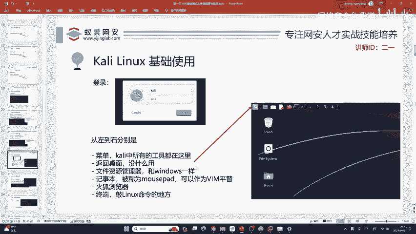

打CTF需不需要学，当然需要学了，你不学打CTF的人都会卡里，好吧。嗯，CTF可能卡里对现在的CTF没有帮助，但是你你去问啊，你去看你的学长或者是你认识的人，打CTF的，他全部都会卡里。

那你说要不要学呢？我觉得是要的。😊。

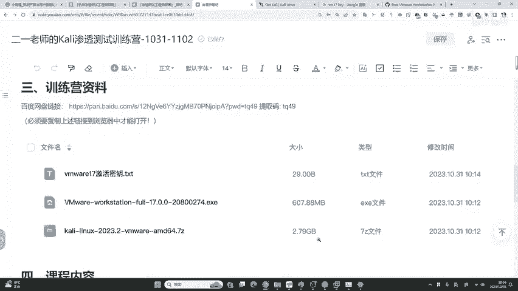

那不然为什么别人会呢？是吗？这里呢是这个文件资源管理器。😊，文件资源管理器就跟你的windows一样，我可以打开给大家看一下。😊，嗯，在这个地方随便打开一个呃，这里就是英语的嘛。

就英语的这个windows的资源管理器什么？😊，几乎是一样的。等下给你介绍，好吧，关于CTF的，等一下给你介绍，咱们先啊继续上课。好吧，因为我不太想太长时间打断这个授课的进程。后续我在讲完之后。

你有什么问题都可以问，没有关系的。好，这里第三个叫记事本啊，记事本啊叫muse pad它可以当做VIM的屏替VIM大家应该知道是啥吧。有同学特别是你的初学者，经常被VIM所恶心。

就是因为啊你可能用不惯它。如果你用不惯VIM在卡里中直接用这个东西叫记事本啊，mouse pad代替就行了。😊，第四个火狐浏览器，直接用它就OK浏览网站渗透网站都可以。最后一个终端刚刚给大家演示过了。

就是敲命令行的地方，敲linux指定的地方。好，这是卡里的几个小菜单，大家需要知道。那下面呢我们来讲终端终端有哪些命令，我们需要掌握以及这些命令应该如何的去学。你不是做运维，你是做网络安全。

你要时刻记住。如果我把linux100%掌握就做运维去了。首先终端中你打开之后，按住这三个键，ctrl shift加加号，可以放大终端字符。这很多人不知道啊，结果你用卡里，我看有的人都工作了。

你那个卡里的终端小小的，你都把自己搞近视眼的是吧？你为啥不放大一些呢？是吧？想放多大就放多大。😊，放大之后呢，由于啊我们现在的卡利他是不能够登录到root用户的。你有同学问，为啥不能登录到root呀？

root是管理员用户。你要记住，不只是卡利这个样子，所有的系统乌班图第半同姓OS麒麟OS，包括啊各种各样的发行版，它都是默认没有办法登陆到root的那你就不要问了，大家都这样。

卡利只是保持大家的共有习惯而已。那我们如何切换到root用户呢？因为如果你不去切到root，你后续操作就可能会出现一大堆报错。这个报错第一头疼。第二没啥意思，咱们不如避免这些报错，你输入这条命令就行了。

就速度。SU然后在这里呢，它会让你输入卡里的密码有KILI。啊，回车一下，你可以看到这里会变有一个颜色的变化啊，我们就来到了这个超级管理员用户。这时候大家要有一个知识点啊，我以前觉得很多同学知道。

但是我又发现啊呃在这个比赛，因为我之前去做过这个线下赛的裁判，在比赛的时候，我就发现啊很多人。😊，都去参加比赛了，有的都不知道。就是说在linux操作系统中，任何输入密码的地方，它都不会有显示。

就是说你输了没有反应，但是你是输进去了，你只需要保持保证你输对了，然后按回车就行了。你不要问它他为啥没有显示啊，它想就是这样设计的，它就是不给你显示，这一点呢你需要知道啊，这个很简单，就是这样规定的啊。

就是这样规定的。下面我们再来看，还有就是看REP地址，刚刚给大家演示过了啊，比如说像这个REPIDDR。还有这个IFconfi都是看IEP地址的这些命令啊，比如说我们这里都能看到啊。

像ETH0ETH1的IEP地址，就I net就IEPV4的地址。😊，这些命令非常简单，说实话，他对网络安全来讲。没有什么用。所以说网络安全对于lininux来讲就主打四个字，熟能生巧，不用死记硬背。

这里啊我给大家提供了一个linux crew网站，这个网站啊它是linux的命令大全。你就是不会哪里就搜哪里就完事了。

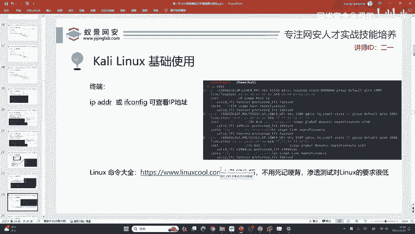

就像我们给大家去学，以前啊大家去学汉字的时候，去学汉字的时候，你是拿着新华字典从头背到尾吗？我没有见过一个人这样去学。我们遇到不会的汉字怎么办？去查新华字典，遇到不会的英语单词怎么办？

去查牛津字典去用这一个一些呃在线的翻译软件去翻译啊，包括linux也是。在这个网站中，他给到的是几乎所有的这些命令，而且这些命令80%，你在渗透测试你都见不到。举个例子啊，比如说这个东西Fdi呃。

LOSBLK。HDp这些东西，你这个。你一辈子做渗透，就你一辈子做渗透，你都遇不遇到不了啊，你都看不到。就是说这个命令跟你无关。所以说啊就一些基础的命令。

你掌握或者是你用到的去搜现学现卖也能够完全满足高阶的渗透测试，这里真的是这样啊，你不可能掌握lin掌握太多的那有同学讲我会VIM我都会啊。

各种命令什么CD什么I什么木CP我都会你会的这些其实只是lin的冰山一角你跟那些十年运维经验的人比起来，就是一个天上一个地下，所以说你没有必要啊，你只需要掌握一些基础的就行了。

这时候有同学讲这个IPDR跟IFfi不是一个命令，这是完全正确的啊，这个IDDR它是linux自带的命令而RF configurefi啊linux是不自带它的它。😊，是一个第三方的工具叫做net to。

但是我们的卡利为什么会有IF卡菲克这个命令呢？就给大家讲过啊，这卡利是一个极大成者，里面的编程语言，里面的这些。软件都给你安装好了，你就是即开即用啊，就像那些什么有的拎包入住一样，你直接用就行了。

他都给你装好了啊都给你装好了。😊，啊，是吧咱们非常方便，这个网站叫linux cool啊，linux库的这个网站。😊，好的，那你可以去看，那我们会讲一些哈，咱们这三天的课程会接触到linin。

这些所有的命令我都会做解释，而且给你解释它有什么用法，你不可能说我全部背会吧，全部背会，就如同你现在有有了一个国家的武器库。但是你现在连一个手枪的开枪，连一个手枪的手枪的换弹侠，你都不会。

那给你一个再庞大的武器库，其实也没有用是吧，也没有用，你不会用啊，你不知道在什么时候用这些命令，那就啥啥用都没有啊，所以说我的作用啊，就是带领大家你要知道现在你想去就业，你到底要学什么。

你到底要怎样学会卡lin。首先第一个就是软件管理IT。😊，IPT软件管理啊，还有一个同类型的叫做ym。ym呢是stoS操作系统。由于啊3to S现在已经停止维护了。

我们以后啊接触到的都是IPT什么叫做软件管理呢？它就类似于大家苹果手机里面的IP store。IPstore上面，我们是不是可以下载我们所需要的软件？那卡里中自带的软件和开发工具呢。

它并不能满足所有的渗透测试需求。所以说我们就需要安装其他的软件。那首先我们要做的第一个步骤就是IPT换原。用过苹果手机的同学应该都非常清楚。APP store它是有不同的区的。

比如说国区的苹果应用商店与美区的应用商店差距甚远。能理解吗？美居的苹果商店会有很多很多我们国区商店下不到的应用。比如说一些科学上网软件，或者是一些例如说像nettflex，像嗯这些耐飞啊。

包括一些听歌的看视频的一些软件啊，在国区都是下不到的。这个IPT呢，它也遵循了这个原理，就是IPT它默认情况下，它是使用的卡里的官方源这官方源啊它是在境外。那我们正常情况下你是连接不到的。

所以说我们要把这个IT的区从每区切换到国区，就如同换元这个官方名字叫做换元啊，那我们现在就来换一下。换元的时候，有同学经常会从网上去搜。比如说咖利换员，然后他就会被坑到啊。

因为卡利换原网上的这个教程真的是太离谱了哈。但比如说有的人他是给你非常多的源，那你就会呃去把它全部复制过来，我随便点开一个，好吧，比如说像CSTN的，像这一种。😊，他就会全部给掉给到你。

然后你就会全部复制过来。那有的帖子啊，他会给你中科大的元。如果有经验的同学或者是被坑到的同学，你应该知道这中科大的园。他已经没法用了。所以说我们这里统一用阿里云。

那用阿里云的时候，问题又来了。就是说哎咱们这个怎么去换呢？有同学他不太熟悉这个VIM呢。所以说我们这里有一个屏替啊，之前给大家讲过就是muse pad。

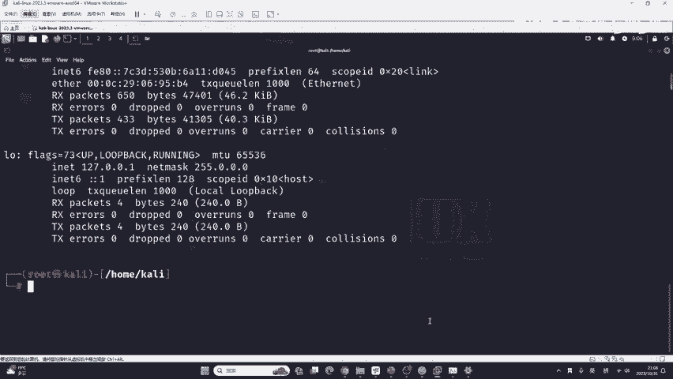

我们输入mles pad这个命令，跟上这样一个文件目录，它叫做ATCIPT source list。回车你可以看到就打开了，我们可以把它放大一些，放大这个记事本的功能，按键跟放大终端是一模一样的。

你可以看到它默认情况下有4个圆，其实只有一个啊。你首先要把它全部删掉。然后把把刚刚我们从CSDN复制过来的这两个阿里云给它粘贴到这里，你可以把这些空空行啊全部删掉，然后点一下保存就行了，点一下sve。

你可以看到非常方便啊，是不是比VIM要好用上百倍。这里就是告诉大家啊，你不要走弯路，不是说VIM你不需要掌握，而是说你一开始就是死磕VIM很有可能打小你的积极性。😊，很有可能你会觉得这啥玩意儿啊。

不想学了，哎，什么都不会是吧？咱们就拿简单的平替就可以满足相关的学习需求。😊，好，现在我们可以把它叉掉。叉掉之后呢，比如说我们把苹果商店从国区切换到美区之后，你要重新打开。重新打开后啊，重新打开之后。

咱们。需要执行这个命令叫做IT update。这个源是这个源，你上网一搜就搜到了。我不跟你讲了吗？卡里APT源随便点一个，就是你看到没？咱们用这个阿里云就行了，这是个阿里云的源这两个。😊。

到时候我发到咱们的我添加到咱们的预习内容中，好不好？我添加到咱们的预习内容中。😊，好吧，现在就这。那么现在就加啊，直接给你加上去，以防忘了。好的，同学们已经加到这个预习内容中了。

如果你现在还没有拿到这个预习内容的话，你可以找到咱们的班主任，但班主任会把这些预习内预习内容啊免费的去提供给大家啊。不过这个东西好像不太好复制啊，到时候我在课后的时候去调节一下吧。😊，啊，没关系啊。

到时候如果这个格式不对的话，我在课后的时候，我提时调整一下。因为我这个电脑没有这个有道云笔记的客户端啊，我在另外一台电脑上面，到时候我会调节一下。😊，OK在安装好之后呢，我们下面要进行应用列表的更新。

叫做APTupate。这里呢如果你上网搜又会被坑到。因为网上呢它会告诉你一个这个命令啊，叫做APT upgradegrade，你可以去搜一下，尤其是CSDN它都会让你执行这个命令，这个命令是什么意思。

upgrade叫做升级，它叫做升级linux所有的软件。好，你这一升级就坏了。那有同学说没关系，我可以等你等不是说你等的事情啊，它是在升级的时候，一些系统的内核依赖环境就会被打乱。

你的卡里啊就会出现各种各样的报错。以后你在用工具的时候就非常非常的费劲。所以说你千万不要执行这条命令，我们要执行的是upd dateate不是别人给你讲的upgrade。😊。

我们只需要执行up date之后，按下回车，你稍等大概一分钟就可以把这个软件的列表去更新过来。我们稍等一下。现在已经更新完成了。更新完成之后，那你IPT就可以正常使用了。它的使用方式非常简单。

就是IPTinstore加上软件的名字就可以了。举个例子啊，比如说我这个car里上面没有python2的开发工具集。那我应该如何在这个地方使用IPT去安装呢？叫ITinstore。

python2杠D1V。有的同学他会说哈，老师你怎么知道他叫pyython2杠DV的呢？首先第一个就是我非常的熟悉。😊，python如果你不熟悉的话，你没有必要装它，我只是提供一个演示，能理解吧。

就是说你在你的咖上面安装了pyython2杠DEV，其实没有任何的用处。对于你后续的学习也没有任何帮助。😊，我只是举个例子啊，看我回车一下，回车一下之后啊，它会弹出一个提示。

do you want to continue？你按下回车就行了，它就会自动的下载，自动的安装，自动的配置环境变量就是开箱即用。好的，一分钟都不要就安装好了。可以看到非常的简单啊，这就是IT。😊。

这个姜同学问到啊，这个打开文本文件的报错是什么意思？啊？在这个地方，这些报错啊，首先要告诉你它不是报错，它是warning叫警告信息，这是muse pad啊啊，这个本身的警告信息是没有没有办法关闭的。

我们也不要在意它，即使windows你在运行记事本的时候也会有报错，只是它没有显示而已，它会留下日志，你是不需要关注它的，它叫warning啊，警告信息。江同学，你非常注意细节啊，对你提出表扬。

咱们对于网络安全就是要注重细节。这些细节可能关乎到你的面试，可能关乎到你对于一个技术掌握的深度。好，下面我们再来看。这个东西你安装什么都行啊。举个例子，比如说我安装加va就可以在这里写open JDK。

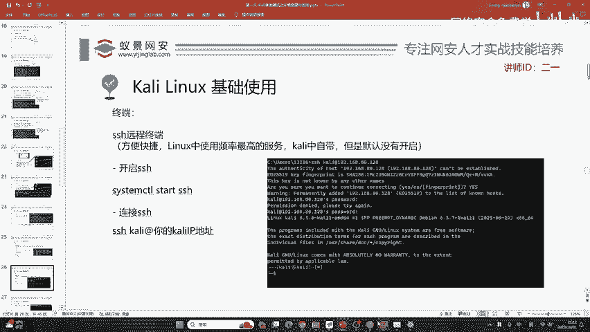

杠17。这时候他会说没有是吧？没有的话，我们怎么办？来教大家一招哈，有个叫IPT search。😊，search等一下给你讲啊IPT searchIPT search叫做搜索。

比如说我们搜索open JTK。😊，就open JDK啊是个java的包，你看这一大堆是吧，你想装哪一个都装哪一个就行。比如说我想装22版本的open JDK，那你就直接IPTinstore。😊，啊。

回收一下，安装一下就行了。😊，你可以看到好，在安装open JDK的时候，我来为这个up同学解决一下他的问题。就是圆的安装的时候可以重新讲一下吗？当然是可以的，我可以为你浪费，不是说浪费一些时间啊。

我想到你提出了这些问题，说明肯定有其他同学跟你有一样的这一个问题，大家也不用急啊，因为文道有先后。😊，你会了，不代表别人会别人会的东西，也有可能有你不知道的。好，在这个地方呢，我们要去修改这个源。

就如同是给它换区一样。因为它默认情况下，它的这个下载链接都是美国的。我们在呃这个境内是连接不到它的那你下载软件就下载不到。那所以说呢我们就需要去编辑这个文件，把咱们的阿里云是放到这里。

如果你不能理解阿里云是什么意思的话，你可以把它理解为就是阿里巴巴为了方便国内的linux使用者，它做了一个加速器，知道吧？它做了一个加速器。好，做了一个加速器，呃，这就是阿里云。我们在编辑完文件之后呢。

呃需要输入这条命令IPT update去更新一下就行了。😊，可以看到，一位同学在讨论区又提出了新的问题。这个问题呢它是找不到pyython2杠DEV。你找不到的话，就是由于你没有做这一件事情。

就是说你跳过了IPT update，你跳过了它，你只需要更新语言之后输入IPT update，你再去安装就会有能理解吧？up同学理解了吧？这个换原哪里不理解，你可以提出更具体的这个问题我可以给你解答。

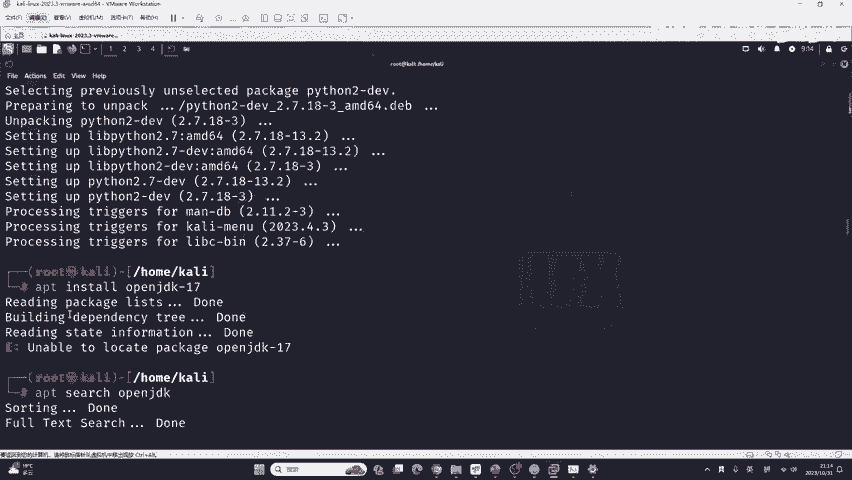

呃，这个s ever同学给出了新的链接，大家可以点进去看一下，做一下拓展也是非常不错的。包括自己能够折腾。其实对于网络安全的帮助非常大。下面我们继续来看SSH远程终端这个SSH服务啊，它首先是方便快捷。

以及它是linux中使用频率最高的服务，因为现在是云的时代，很多的东西都上云的。比如说金融云教育云政务云，而这些云它是需要进行一个SSH远程连接的。卡里中自带这个服务，但是卡里中没有默认开启。

那这时候怎么办呢？哎，我们就需要自己去开。这里我们从开启。😊。

SSH来学会这个服务的管理。在卡利中服务管理的命令啊是这样一条命令，就是sstem CTL。start加上服务的名称SSH。system cTL呢，它就是卡里的控制台系统控制。

就是system controllert是吧？系统控制star就是开启SSH就是我们要开启的远程终端服务。因为你的卡里肯定需要远程连接，包括你的云服务器，肯定需要远程连接。

就像windows的远程桌面连接一样。不过这是命令行的远程连接。我们运行之后，它不会有任何的结果，但是这个SSH你却开起来了，开起来之后怎么连接它呢？这里要告诉大家一个命令啊。

这个命令在win10以上的操作系统都可以执行起来。就是首先我们要打开自己电脑的命令提示符，也就是CMD。😊，比如说这里是我windows11的CMD输入这条命令SSH，然后加上用户名卡里，加上艾特服务。

再加上呢你卡里的IP地址，每一个人的卡里IP地址都是不相同的那有同学会讲啊，那咱们有一个nott模式，有一个巧间模式，那你输入哪一个呢？都可以。随便输入哪一个都行。比如说我输入nott模式的。

把它直接粘贴到这里按下回车。

如果出现这个报错，就说明啊现在在这个情况下，你是没有办法去连接它的这是一个指纹的错误。如果出现这个报错，首先要告诉大家，你们的电脑是不会出现的。我的电脑为啥会出现呢？

就是因为我这个计算机上面有很多个卡里，它造成了地址的冲突，所以说就出现了这个报错，那我现在就是解决它，如何去解决呢？只需要打开文件夹，哎，把这个玩意儿给它删掉就行了。

把这个呃一个叫做know host的文件。我们给它删掉。写一下这个目录。好，这个know host我给它删除掉。删除掉之后呢，我们重新执行一下这个指令啊，大家是不会出现刚刚那个操作的啊，按按一下回车。

虽然首次连接的时候，它会让我们选择你想去continue connecting吗？你想继续连接吗？我们要输入yes，你要手动输入。😊。

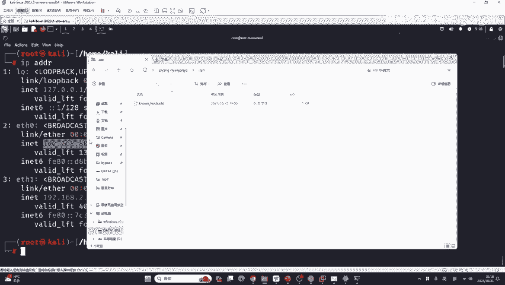

啊，这里他让我们输入卡利的密码，我们输入KILI同样不会显示按下回车，就登录到了卡利这台系统。这是远程连接。那由于呢我这里是本地，就是我是自己的windows11去连接卡里虚拟机。

所以说呢这里的SSH并没有起到相对应的作用。我们只是作为一个演示来给大家介绍这一个服务。那在实际情况下呢，我们在公司里面使用一些堡垒机去控制一些开发服务器测试服务器的时候。

SSH服务将会被经常的派上用场。根据每天的工作去打交道，知道吧？这是远程连接，它非常重要，是使用频率最高的服务之一。好的，下面我们继续来看。除了终端之外，这个终端呢咱们命令我不推荐大家记哈。

第一死记硬背之后啊，他什么用都没有，continue之后干啥？continue之后，你输入密码呀，控制别人电脑是可以的，就是你要知道别人的密码才能控制。你在这个地方continuey之后。

在这个地方输密码呀，要输入你KILI的密码是吧？要输入康的密码，按下回车就登录进来了。你后续你可以自己去试啊，你可以自己去尝试。😊，那除了这些命令之外，我们最重要的呃，是不是同一个局域网都无所谓。好吧。

只要你能够连接到别人云服务器的是公网堡垒机是啥？百度搜一下就知道了哈。它一般就是边界网络类似于这个统一管理系统啊，这个权限验证系统，它的功能非常多，是一个设备啊，是一个设备，公司里都会有。

就说明这个同学呃，你可能就是还没有呃从事过这个IT行业的这个这个工作哈。如果你有过IT行业的相关从业经验，你应该非常清楚堡垒机。😊，好的。

那我们现在你关键的对卡利使用不是说只掌握linux meaning，因为我们不是叫lininux，那你关键的还是要掌握它怎么去用。比如说一个最简单的软件就是火狐浏览器。这个浏览器呢我就不多讲了？

有同学我在群里咱们的交流群体，我发现，有个同学问到，为什么我的谷歌浏览器跟火狐浏览器打开之后没有任何网站啊。首先你有这种问题，你就是被国内的这些像360像2345像什么搜狗浏览器。😊。

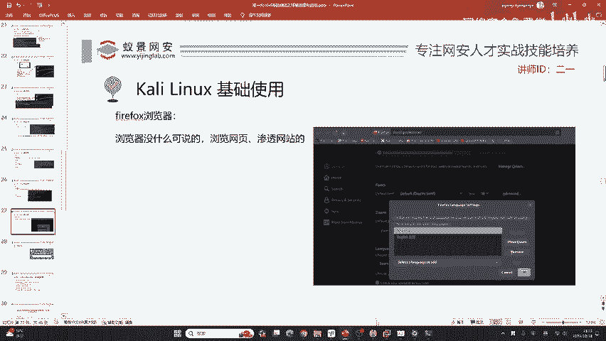

所毒害了，就是他们这些国内的浏览器，你再打开之后都会有一些啊就是会有一些这种啊，比如讲广告呀，或者是一些呃首页呀这些网站啊，但是国外的浏览器，比如说像火狐，像谷歌都是没有的。你想访问什么网站。

你就直接去访问就行了。比如说访问这个百度，就直接访问就行了。访问谷歌就直接访问就行了。😊，好的，那现在问题来了，这个同学讲火狐的英文是firefox，为什么预装是不是chrome？

因为 chromromemo这个内存比较大啊，内存比较大，所以说嗯firefox比较轻巧。那这时候有同学讲啊这个火狐都是呃这个。英语我看不懂，我想整一个跟国内差不多的那这时候咋办呢？你看好啊，怎么配置。

我来演示一遍。首先点击菜单，点击设置ss。😊。

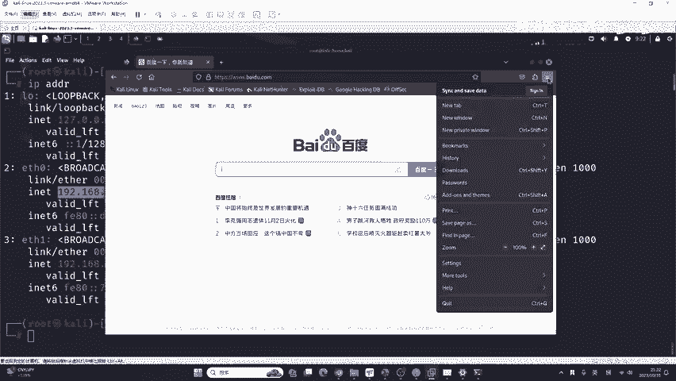

在这个地方啊，我们把鼠标往下滑动一些，呃，在这个地方你可以看到一个language，就是语言的选项。是不能使用谷歌，但是能使用谷歌浏览器呀。谷歌跟谷歌的浏览器是不一样的呀，一个是搜索引擎，一个是浏览器。

在这个地方我们来选择，它默认只有一个就是美国英语，美式英语啊，我们要点击这里啊，选择其他选项。😊。

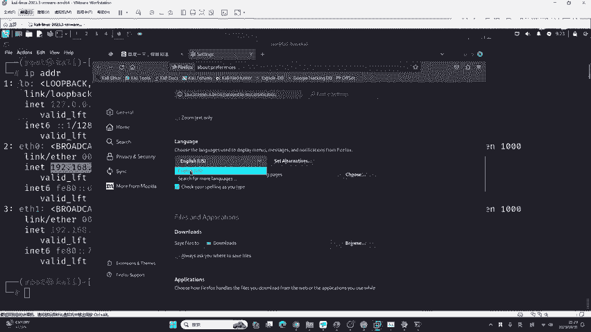

在这里我们选择一个新的语言。点击点击啊search for more language，就是找到一个新的语言，我们稍等片刻。他这个寻找呢是需要联网的，所以说我们要等待他一下，他会去找到一个新的语言。

我们可以等待他一下，谷歌浏览器是肯定可以用的。这浏览器它不会限制，你的问题肯定还是跟群里的这个同学一样，就为什么我打开之后，他什么都没有，因为咱们国内的浏览器都会有首页，知道吧？为了推销自己的产品。

为了让你去打他那些垃圾的页游，它会有首页，但是国外的没有，你想访问什么网站，你就在这输入就行了。比如说我想访问国内的那些网站，比如说3W好123点com，你看一下。😊。

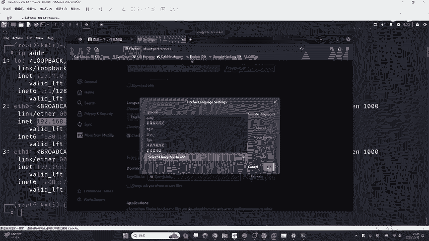

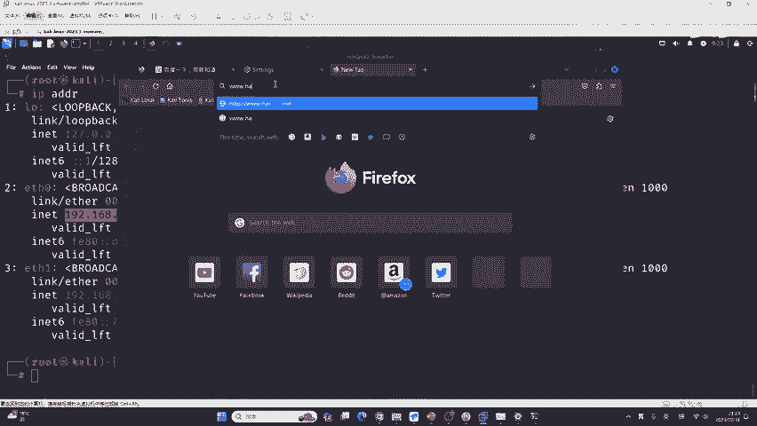

这些都是啥？这些东西是不是就比较贴合咱们国内的一些浏这些浏览器了，是吧？你比如说这些东西。这有的还好啊，不过这个好123还挺好的，有的就是非常非常毒瘤，各种页游，各种呃毒瘤软件非常多。

充斥着这个网站而国国外是没有的，而国外不喜欢打广告，知道吧？你访问什么就在这里写就完事了。😊，好，我们再回到这个地方。再回到这个地方。你的理解很对呀，s for ever你的理解很对。

我们选择最后的这个简体中文啊，这正体中文是反繁体字啊，选择简体中文，然后点击艾添加。😊，我们稍等一下，它会有一个下载的过程，就是说它会把这个中文的语言包，或者是你理解为汉化包都可以，它会下载过来。

然后去。放到这个地方，我们要等待它的下载。我来看一下大家的这个问题。呃，有同学说你是套壳的，其实国内的浏览器3602345火狐啊，不是火狐啊，这个搜狗，还有这个腾讯浏览器，它都是谷歌能理解吗？

都是谷歌换的。那有同学讲你这个讲白话，那我给你看一下吧，比如说他下载中文语言包是需要时时间的那我们可以给你看一下，比如说你不是喜欢用搜狗浏览器吗？我建很多同学用啊，这个搜狗浏览器。

比如说我这里给你看一下搜狗浏览器。😊。

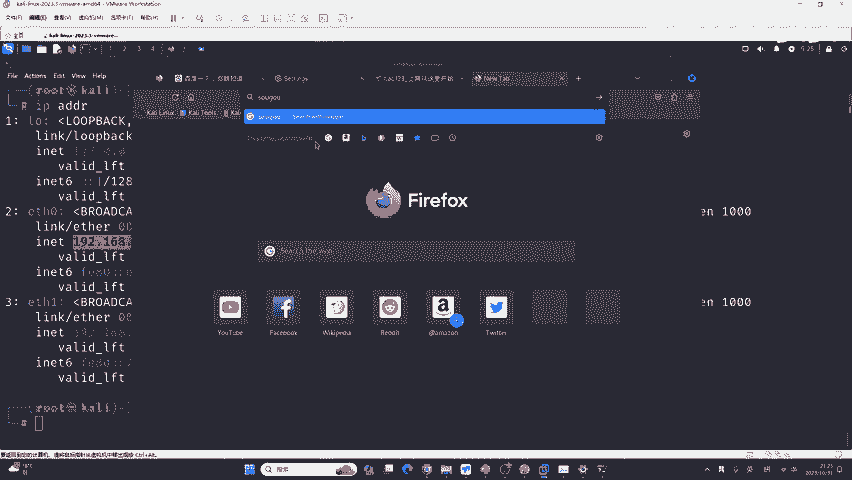

点开它的首页啊，它是不会隐藏的。他会告诉你他用的这一个谷歌内核。来，咱们往下划一划，首先是它的广告啊。首先是他的广告。还是他的广告，就是告诉你他有多智能，多多多智能是吧？啊，这个广告实在是太多了。😊。

嗯，他没有写啊，这个还是比较那个的。他没有标识出来。这个还是比较不太好的哈，他没有标识出来，它是基于这个谷歌的。不太好，我们来看一下360360，我觉得它作为一个安全企业，它应该标识出它是基于谷歌的。

我们可以看一下。看它标示出来了，它是基于谷歌浏览器114内核的。现在的谷歌浏览器内核是118，也就是说它是找四个版本的谷歌浏览器去换的。给你加了一些插件，给你加了一些360的东西啊。

给你加了一些360的东西。你看他讲的很。就是这种浏览器，我们要给他提出表扬，就是因为他换它会换一些基于本土化的功能，它会进行一些本土化的优化。就比如说小米手机去改谷歌，它改的非常好，而你不应该改了。

不说是吧？你改了，你要说出来，这是没有问题的。毕竟谷歌浏览器本身就是开源的，它的内核V8就是开源的，知道吧？它是免费给用的，谷歌浏览器是不收费的。

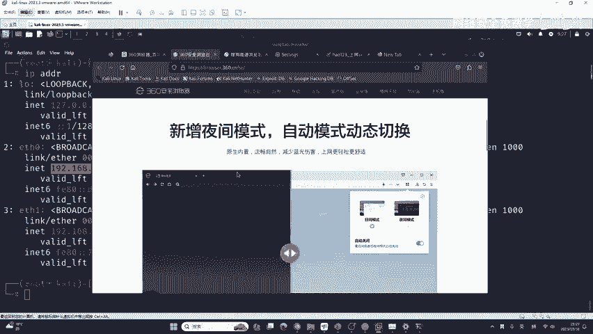

这个同学讲的非常对啊，你的生成的木马圆控电脑，你是没有办法进公网的，知道吧？你的家庭网络是没有公网的，所以说别人肯定连不到你啊。你公网嗯这个咱们第三天会讲啊，咱们第三天会讲。好，我们来回到这个设置里面。

你这时候可以看到简体中文已经下载好，我们点击简体中文，点击OK好，我们的浏览器就变成中文了。😊。

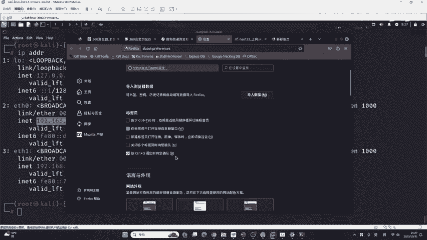

就这么简单。下面我来给大家一个页面，这个页面呢是康利的官方。这官方呢它是一个outtos，就是所有的所有的工具都在这里面。那这时候有同学说啊，忽米有没有中文版？还是告诉大家哈，中文版是有的。

但是他那个版本真的是太老了，你都2023年了，你还用个2020年版本的卡里，那不是给自己找麻烦吗？它很多的特性，很多的工具它都没有，你不如用新的。

就是说在卡里中所有的工具在这个网站中它全部列出了详细的使用方法，这时候怎么办呢？有同学讲我从头看到尾，你别想了，绝大部分的工具都没有用。😊，只有一些，你比如讲按照刚刚老师给大家截取的图。

这样1个20K的工作启明星辰的。你看他要求你有什么工具，比如N map，咱们能不能在这里搜到N map呀，你可以试一下，比后搜一下N map。

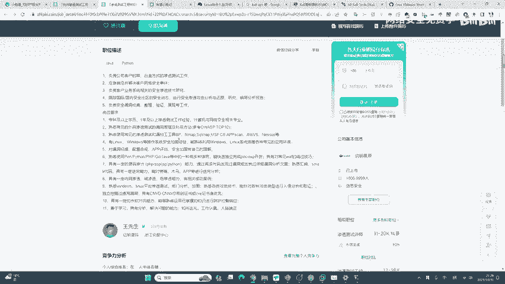

有没有有吧，是不是在这儿？按m怎么使用，写的是不是非常的清晰？是不是怎么用？就是扫这个IP地址。有同学讲，我看不懂，我不知道这里user example是什么意思。你浏览器没有翻译吗？

你翻译过来不就O了，是吧？你翻译一下就行了啊，就像你这个以前这个学英语不懂，你又查字典不懂就翻译，而且现在翻译这么厉害，还是ARE大爆发的年代，各种ARE翻译插件是吧？你都可以去用。

你没有必要说你非得死磕这个英语啊，没有啥特别大的必要啊。你如果英语不好的话，你不可能说哎，我现在英语不好，我不学网安了，我先花两年时间先把英语学一学你这不是浪费时间吗，是吧？😊。

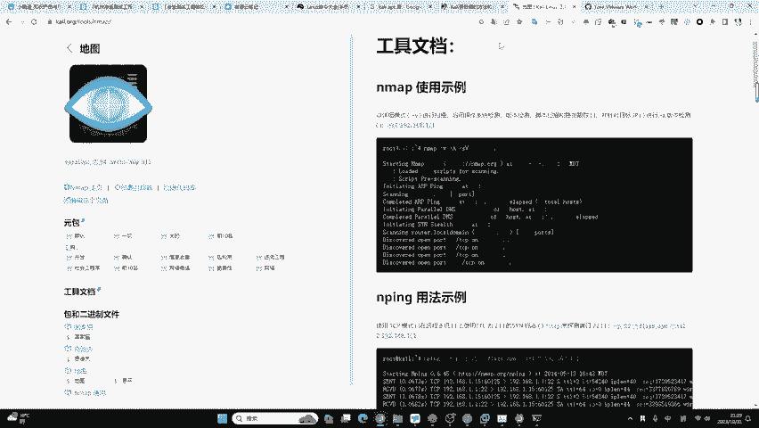

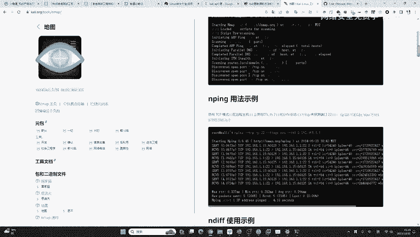

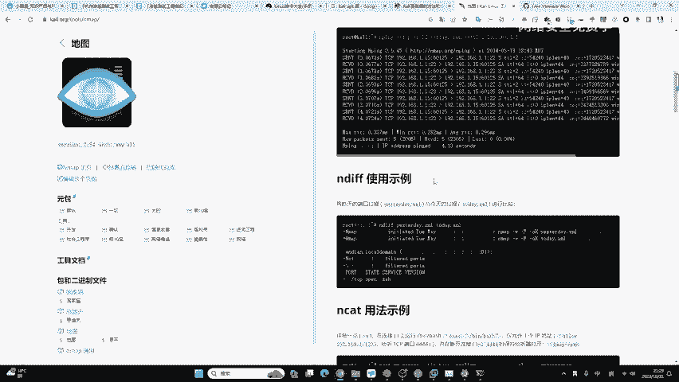

那肯定不行。

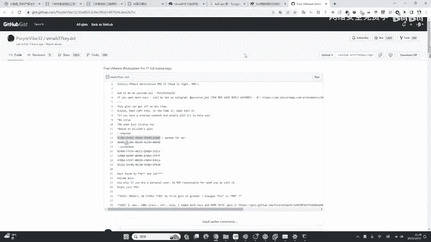

也就是说这个网站啊，只要是卡里中自带的工具，它全部都会有全部都会有。这时候我们就需要掌握。那这些工具中哪些是对我们有帮助的，以及哪些是没有用的，我们不需要掌握的。还有就是哪些是需要着重掌握。

加上举一反三的工具。那这些呢就需要咱们这个放在明天还有后天的课程中来给大家做讲解的。

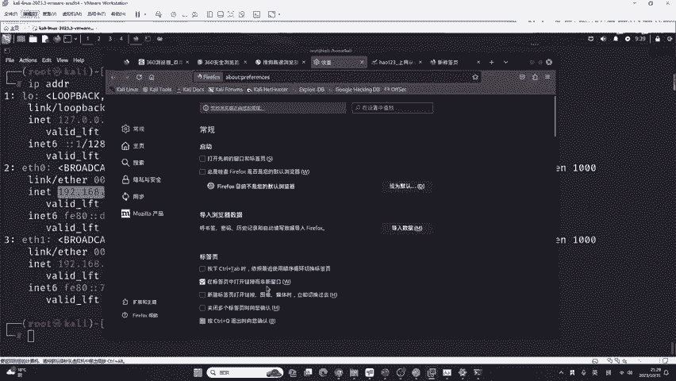

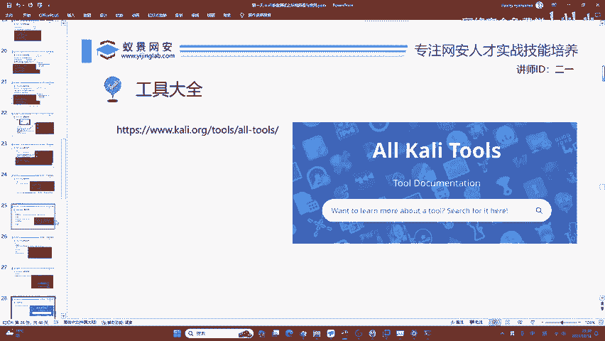