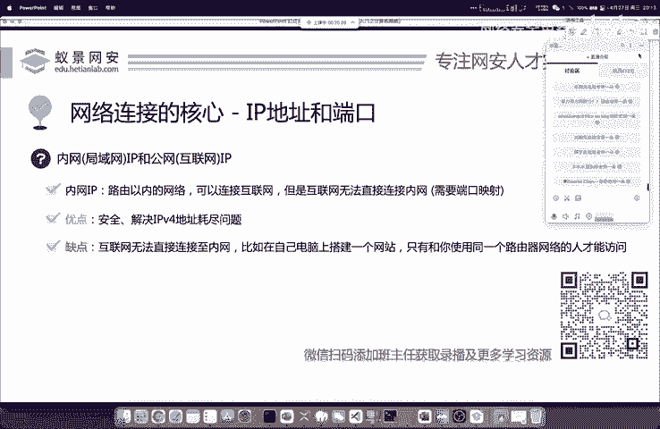
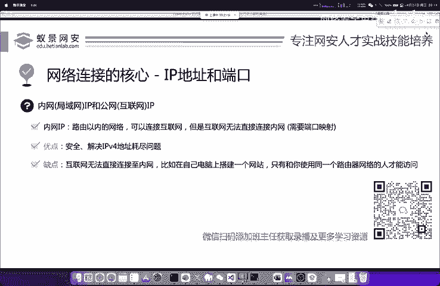
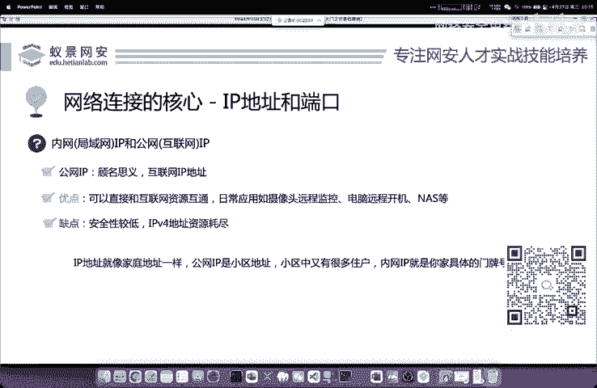
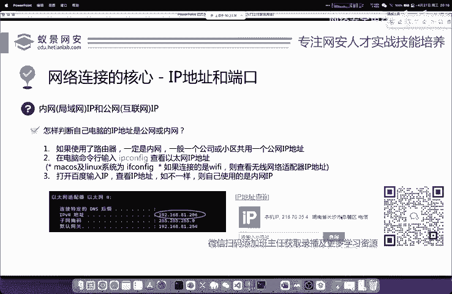

# 2024B站最值得看的黑客教程 ｜ 网络安全／渗透测试／内网渗透／漏洞挖掘／web安全／kali linux／红队靶场／CTF／信息安全 - P1：什么是IP地址 - 网络安全免费学 - BV1uBsTetEow

TCP和IP它分别是处在我们OSI网络层和传输层的两大核心协议。那这两个核心协议呢是我们网络通信的基础。也就是大家经常提到的，像IP地址，以及我们的端口。那IP地址是什么呢？这里给大家简单介绍一下。

首先呢IP地址就是我们在互联网上所有网络设备的唯一标识。比如说这个你想去访问百度，那你首先呢就是要知道百度的服务器IP地址，你想去攻击你室友的设备。

你首先呢就要知道你室友所连接的路由器所处的内网IP是多少，才能进行相应的连接和攻击。那这个呢就是其实就是IP的一个简单介绍。它的功能呢就是在互联网中寻找电脑是非常简单的一个概念啊，我们举一个形象的例子。

比如说呢这个张三。他是一个人啊，他想去访问我们的核田晚安实验室。首先呢就是张三，他就要知道核田晚安实验室的1个IP地址。那核田晚安实验室在返回我们相关的网络安全学习资源的时候。

他也必须要知道张三的IP地址。那这个时候大家会想啊，我平常访问网站，我并不是要他的IP地址啊。其实这就涉及到了网络中的另外一个协议，叫做DNS在这里呢我们不会做太多的特拓展。

其实DNS呢就像它的字面意思一样，叫做域名解析协议。它主要呢就是把我们通常访问的网址域名，也就是你访问百度的3W点百度点com，把它呢转变成百度服务器的IP来方便我们记忆和访问。

因为如果让你每次打开网站，都让你输入IP地址的话，你无非呢就是造成了很多的不。电性以及呢难以记忆和难以访问。所以说呢我们一般是对这个网址呢做1个IP的地址转换啊。

这但是它的前提条件呢还是属于啊我们的这个TCPIPT结构。那我们下面呢再来简单了解一下这个内网IP和公网IP啊，这是一个非常重要的概念。

也是非常贴近我们渗透测试的那可能呢在IP地址中还会牵涉到很多的知识。比如说IP地址的分类啊，I类B类C类D类啊，或者是我们的IP地址的一个地址类编码这个计算方法。那其实这些啊和网络工程它相似度比较大。

对于我们渗透测试，搞网络安全的人人来说呢，呃你如果不了解它，也不会有特别大的影响。那我们首先要知道的就是啊内网IP和公网IIP到底有什么区别。首先内网IP呢就顾名思义。就是我们在。

小区里面或者是自己家里搭建路由器，这个路由器以内的网络呢都称为内部网络。那内部网络呢，你可以通过这些运营商的一些路由器交换机来进行网络地址转换，然后去访问互联网。但是呢呃内网机器就像它的字面意思一样。

互联网是没有办法直接连接至我们内网IP的，大家应该有一个非常呃一个非常好的例子啊，就是很多同学可能会自己搭建网站。比如说在自己的电脑上搭建的网站呢，在别人是访问不到的，为什么访问不到呢？

就是因为我们搭建的网站，它是处于内网中，或者是我们把它叫做区域网中。那现在呢因为IPV字地址，已经完全耗尽了。一般的像电信移动和联通的这些常用的家用互联网运营商，它是不会给你分配IP地址的。

这就导致了可能我们整个的社区或者是一个小区都在用同1个IP，这也就是大家经常在网络上调侃的这个中国移动的大内网啊，就是说我们整个的社区一个小区，一个公司的园区都在用同1个IP去访问互联网啊。

这就是我们经常去说的一件事情啊。那公网IP呢就顾名思义，它跟内网是完全相对的，它就是指在互联网中的IP我们一般情况下去租赁的云服务器啊，包括呢一些企业所架设的这个网络环境。

还有部分呢比如说电信的千兆宽带等等。它都是具有独立的公网IP的那公网IP它的好处是显而易见的，就是直接能够和互联网的资源相通啊，比如说我们日常的摄像头远程监控啊，电脑远程开机，还有很多同学啊在。

去玩一些，比如说像群辉的一些nas，那这些东西都是非常依赖于公网IP的。如果我们没有一个公网IP，可能你就需要做很多的额外操作啊。比如说大家可能听说过的端口映射呀。

内网穿透啊等等啊你你就像你在家里去搭建一个啊游戏服务器，想让你的小伙伴连接到你的游戏服务器的话，那就需要去做一个内网穿透啊。如果你家里直接有公网IP的话，那就可以直接去玩了，直接去用就行。那IP地址呢。

其实就像你的家庭地址一样。这外卖员要想找到你给你送外卖，就是必须要知道你的啊小区住址，以及你具体的门牌门牌号。那在现在呢小区地址就相当于是公网IP而一个小区中呢又有很多的业主。

所以说内网IP就是大家家里具体的门牌号啊，这个地。方大家应该能够理解了，是非常形象化的一个例子了，这是IP地址的区别。那IP地址呢其实是非常简单容易去判断的。我们只需要在打开自己电脑的命令提示符。

那如果你是linux的话，也是打开你linux的终端啊，我们只需要输入一个简单的命令就是IP configurefiIP configurefi呢中英文意思就是IP的地址配置啊，就是IP的地址配置。

那这个地址配置呢我们来看一下，你会看到呢以太网。首先给大家解释一下啥是以太网啊。以太网就是大家现在家里用的这个光纤网啊，这个光纤网在经过这个modern，就是光猫转变之后啊，我们使用的就是这个以太网。

就是宽带啊，宽带以太网。这个以太网的IP呢，我们看到比如说老师的电脑在这个PPT上面截图是192。168。81。206啊，大家如果看不清的话，我会给你念出来啊。然后这时候其实有个非常简单的方法。

就是你到百度上面呢，你去搜一下IP这个百度呢它会给你个IP地址。百度给你的叫做公网IP你自己输入IPfi看到的是内网IP如果他们两个不相等的话，就证明你现在用的是内网。一般情况下啊大家都是内网哈。

包括我自己也是啊在家里谁还没有路由器呢，是吧？包括你自己家里的光猫啊，它都有相关的一个地址转换。那这个同学呢他在讨论区去问啊，这个line和微line有什么区别哈。

line是局域网微line呢是V two line啊就是虚拟局域网。那虚拟局域网呢一般是在这个交换机上面经过一些接口实现的一个类似于局域网的一个虚拟化的它进行了相互的隔离。

这个在一些网络书籍中是有的网络书籍中是有的那微烂的配置呢是涉及到我们的交换机。那渗透测试的工程中啊，你是不会去配置交换机的这一点你可以放心。那这是内网和公网的一个情况。😊。

