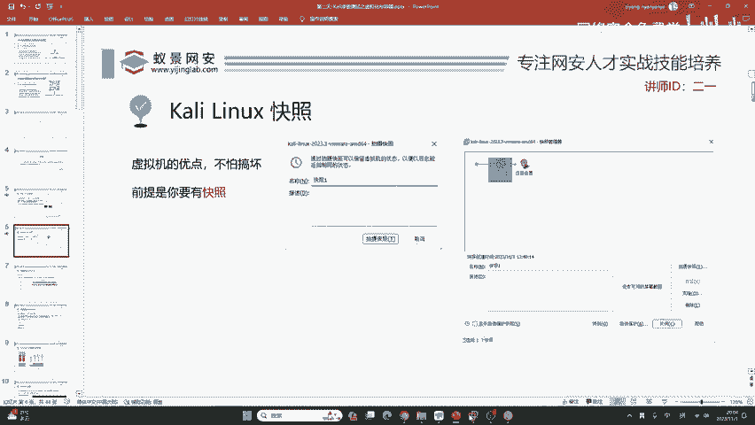
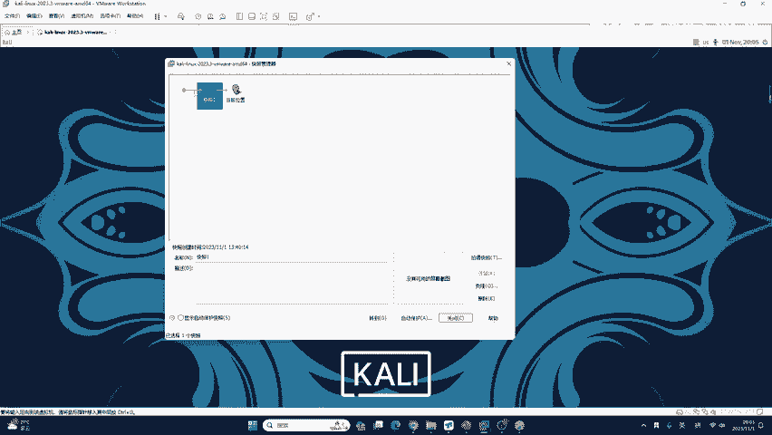
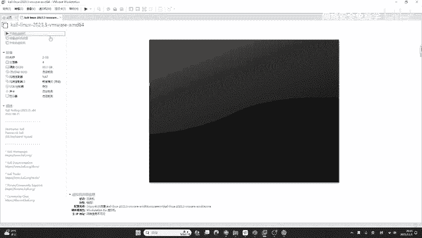
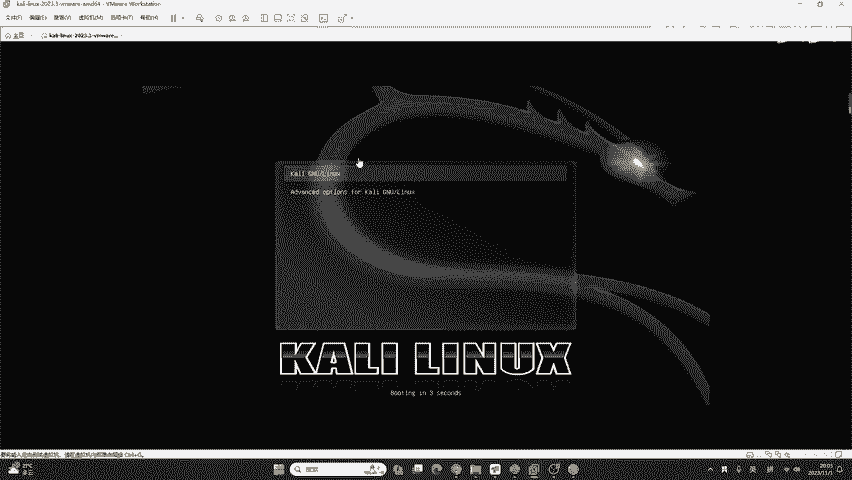
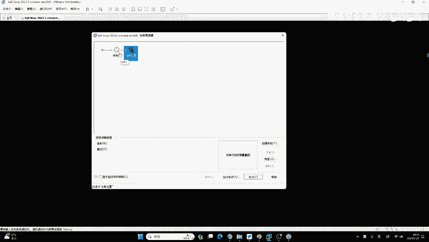
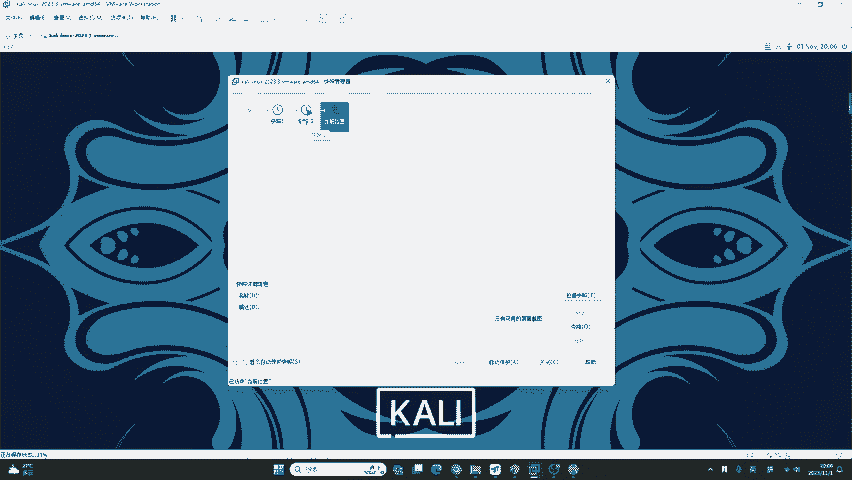

# 2024B站最值得看的黑客教程 ｜ 网络安全／渗透测试／内网渗透／漏洞挖掘／web安全／kali linux／红队靶场／CTF／信息安全 - P20：kali linux快照 - 网络安全免费学 - BV1uBsTetEow

容器学施之前，我们必须要了解一下VM word快照功能。快照它其实非常简单，就是一个系统的还原点，通俗来说就是做还原用的。我们可以把虚拟机恢复到快照创建时的状态。不仅VMR应用快照。

我们用的其他的所有的讯集平台，以及接接下来哈就之后大家在工作中接触到一些商用的虚拟化平台，也都会有这样一个呃快照的功能，也都会有这样一个快照的功能。那我们现在呢比如说看这边的截图，这是VMO。

这是m克的PD虚拟机，它都是可以拍摄快照的。那下面呢我们一起来看一下这个导入卡利的镜像文件啊，是咱们昨天的课程。呃，今天呢是已经把卡利安装好，并且配置好了它相关的这个服务啊。咱们开始讲卡利的进阶了。

就是来讲他如何去和容器和云容器啊进行搭配使用。咱们已经开始第二天的课程了。😊，那我们下面呢来看一下快照如何拍摄。那虚拟机的优点呢就是你不要害怕搞坏。因为啊你只需要拍摄快照之后。

如果你不小心哪里配置了错误或者是搞坏了哪个地方，只需要恢复快照就行了。那前提呢是你要有快照，它默认是不会创建快照的。

我们下面可以去看一下哈，比如说在这个卡lylinlinux2023。😊，这个地方我们点击这个按钮啊，就管理此虚拟机的快照，我们去点开它。点开它之后啊。

大家可以看到我在今天下午拍摄了一个叫做快照一的这个快照模板。我们点击它之后啊，我是可以进行恢复的。比如说我现在想把这台虚拟机恢复到我今天下午的状态，直接自己点击快照一，然后点击转到就可以恢复它了。😊。

我们可以稍等片刻，现在虚拟机就已经恢复到我今天下午拍摄快照的状态了。那我这演示的是一个恢复的过程。那大家会发现呢。

你的虚拟机中默认是没有快照一这个东西的这就证明啊我们必须要预先拍摄快照才会有恢复快照的功能？那如何为VM word卡里拍摄快快照呢？我们这里可以举个例子。😊。

点击快照编辑器，然后点击拍摄快照。我们可以把它的名称任意修改，或者是给他添加备注，防止自己忘记。比如说这里我们的名称设置为快照2，点击拍摄快照。点击拍摄快照之后啊。

这个快照的拍摄的速度啊是显示在了咱们VM2的左下方。那根据你自己硬盘的读写速度，它基本上拍摄一个虚拟机的快照，大概需要三四分钟的时间。那如果我们之后或者是在今天的课程，你不小心把卡里搞坏了。

那你即可恢复到你在上课之前拍摄的快照就可以了。不需要重新安装卡里，也不需要重复咱们第一节课，例如说像IT换原。例如说像启动SSH服务这些比较麻烦的操作了。不需要做这些重复的一些命令重复的操作。

它是非常方便的。😊。

那我们在拍摄快一张完成之后。