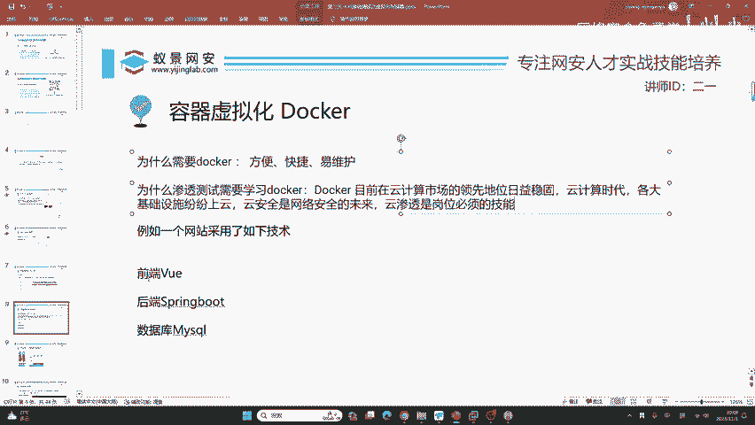
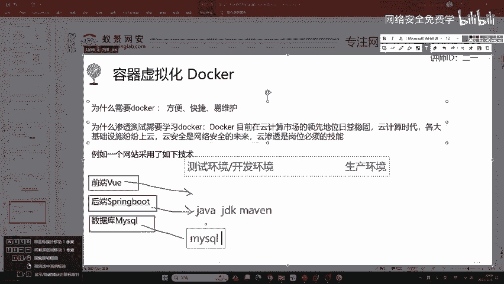
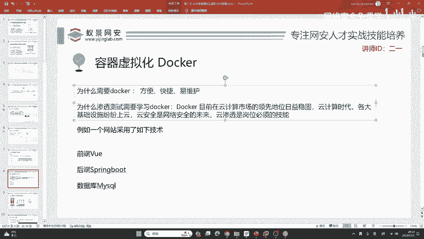

# 2024B站最值得看的黑客教程 ｜ 网络安全／渗透测试／内网渗透／漏洞挖掘／web安全／kali linux／红队靶场／CTF／信息安全 - P21：容器虚拟化docker - 网络安全免费学 - BV1uBsTetEow

我们开始进入到今天的课程讲解，就是来讲容容器虚拟化docker。首先我们在为卡里安装docker之前呢，我们必须要清楚docker是什么。docker呢是一个开源的应用容器引擎。

是一个用于构建传送运行应用程序的平台。这个语句啊，我是直接翻译至。刀cker的官方网站，大家可以去看一下。比如说在这个地方，我们可以看到。docker的官网，我们可以看到他对于docker的解释啊。

就三个英语，一个叫做build，就是构建，一个叫做shall，也就是传送分享，一个是run，也就是运行。它构建传送运行什么呢？就是运行应用程序，各种各样的应用，各种各样的开发程序。

各种各样的环境都可以使用docker轻松的搭建。那首先我们作为一个。IT工作者为什么要学习刀客？三个特性，方便、快捷而且易维护。那为什么我们今天是渗透测试的公开课，你为什么要学习docker呢？

这里来给大家讲一句话，你需要做到你知道学习这个东西有什么用，你才能提高兴趣，你才能够坚持下去去学习。首先呢这个docker目前在云计算的市场领先地位是日益稳固的。也就是说，现在已经进入了云计算的时代。

你可以看到，阿里云、腾讯云、华为云，国外的谷歌云、亚马逊云都在蓬勃发展。那各大基础设施呢也都纷纷上云。比如说各个银行，它会上金融云。各个党政事业机关、国企，它会上政务云。

包括咱们的大学网站也会登上教育云。云安全呢是网络安全的未来，云渗透是现在岗位必须要掌握的技能。如果你想成为一个高级的渗透测试工程师，那云渗透的要求呢是非常重要的。

所以说docker是你迈不过去的一道门槛，我们必须要掌握它，精通它。那现在我们来看这个docker啊，为什么会说它方便快捷呢？我们来想象一个网站，很多同学啊都是计算机相关专业的。如果你没有听过这些名词。

我现在来做解释。

比如说。正常的开发网站，他可能会使用如下三种技术。这个技术呢分别是前端框架view。后端框架spring boot数据库mysqcle来共同形成一个高交互式的网站。那如果在正常的公司里面。

它需要有两套环境，一个啊叫做测试环境或开发环境。大家如果有上过班的同学都知道，如果你不知道的话，你现在就听我讲。因为这些啊你既然想要工作，你可定要知道进入到岗位之后，咱们IT行业都是做什么事情。

不然的话，别人也不会要你是吧？第一个呢叫测试环境或者是开发环境。这个环境呢是不会公开的那公开，比如说我们访问淘宝，访问知乎这些网站啊，你是可以访问到的。我们可以把它叫做公测的网站，它叫做生产环境。

我们真实访问的网站啊都是生产环境，而程序员去编写自己的代码的时候，使用的是测试环境和开发环境。现在如果一个公司想要用这三种技术形成一个网站，那是非常复杂的。比如说在测试环境中，首先它需要为测试环境搭建。

满足vi这个框架所需要的技术依赖。比如说像node像NPM以及去安装相应的依赖，去配置vi对应的版本。这个过程是非常繁琐的。不同的版本它的兼容性可能不佳，可能就会导致网站运行效率低，甚至出现bug。

这是第一件事情。第二件事情呢，它在配置完前端之后，还需要为测试环境以及开发环境配置后端开发环境。比如说像spring boot，它是java的一个非常火的组件。

它是基于java编程语言的那如果想去安装spring boot，需要给电脑以及环境安装适当的JDK，也就是java的版本，以及相对应的meeven。

还有就是选择对应的spring bootot相应的版本，这个过程啊也需要花费很多的时间，而且非常的麻烦，非常的繁琐。大家在学网络安全的第一天，配置卡里，你会发现就会出现很多的问题。有同学啊网络搞不好。

网络搞好了也会出现各种各样的bug。包括我们在讲APT更新的时候，有可能你所操作的就跟二一老师有所区别，或者是大相径庭。😊，那如果是让你配置这些测试环境和开发环境，他跟卡里比起来。卡里实在是太简单了。

那这里就非常麻烦了。其次呢它除了配置这些springboard之外，还要去配置数据库。那数据库的配置啊，它是难上加难，它几乎有专门的岗位，叫做数据库管理员数据库运维来维护着咱们的马丽思克数据库。

从它的安装，从它的配置到后续的安全性维护，都需要耗费大量的人力资源。😊，那这里只是测试环境和开发环境。如果来到真实需要提供给客户访问的具体页面，就是生产环境。在生产环境中。

他需要把测试环境的这些再次配置一遍，而且还要考虑到安全性的问题。这就会导致啊整个的配置步骤非常的繁琐，占用了大部分的时间，而且调试起来非常麻烦。那我们肯定不想这样。docker就应运而生了。

如果使用docker去搭建这样一个网站的话，前端的view它是一个应用程序。我们可以使用一个docker就把它搭建起来，几乎啊只需要一分钟左右的时间就可以完成。

后端springbo也可以使用docker去搭建数据库myscle也可以使用docker搭建。docker非常的安全，我们只需要搭建三三个docker，把它融合在一起，就可以形成咱们的测试和开发环境。

那在生产环境中怎么办呢？我们只需要把docker打包，复制一份，就可以实现生产环境的搭建，因为它非常的安全，它是隔离的，就如同虚拟机一样。😊，一个公司想搭建一个网站。

现在从之前的几天就缩缩减到几分钟就可以搭建好，而且非常的安全，不需要考虑安全性的问题。

