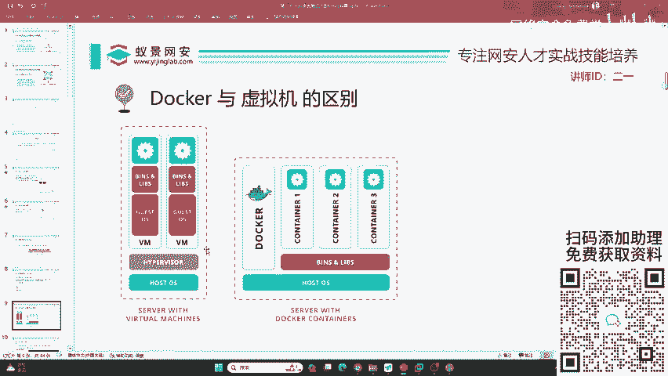
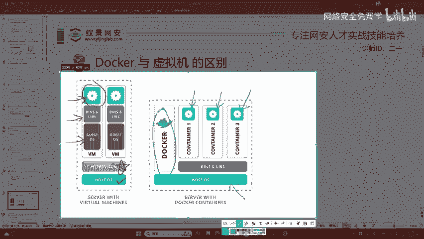

# 2024B站最值得看的黑客教程 ｜ 网络安全／渗透测试／内网渗透／漏洞挖掘／web安全／kali linux／红队靶场／CTF／信息安全 - P22：docker与虚拟机的区别 - 网络安全免费学 - BV1uBsTetEow

那下面呢我们就来想那docker既然这么方便，那它和我们的虚拟机有什么区别呢？我们为什么要把docker去安装到我的卡里上面，为什么不把docker去安装到windows或者是m S我们的真实机器上面。

首先我们先了解它两者的区别。docker和虚拟机是非常相似的，就是都是隔离化的那虚拟机呢是左边的这张图，而docker是右边的这张图哦，这里啊是从呃国外的网站上面截取下来的。我们先来看虚拟机。

虚拟机叫做VM就是vitro motion啊，虚拟机的简写。

hostOS就是咱们真实的电脑。我们真实的电脑上面要安装一个虚拟化的服务，叫做per hyper呢在现在大家购买的电脑CPU都是能够支持它的。

在以前啊大家买电脑可能你的CPU啊不支持这个东西就会导致你的这个VM word装不起来，就是很常见的。但是现在已经2023年了，这种问题已经得到了根本性的解决。那在 v上面，它有不同的虚拟机。

比如说我们安装的卡里或者是安装的乌班图3亦或者是windows操作系统，每一个虚拟机啊都会有单独的一个操作系统，比如说卡里它是单独的吧。😊，在操作系统之上，它又会安装这些操作系统所运行的环境。

比如说我们的windows，它就需要windows的运行库，linux就需要很多的动态连接文件。包括啊你如果想安装一个虚拟机去打游戏。你还要为这个虚拟机去安装显卡驱动。

不然的话你购买的那些什么40804070，你的虚拟机可是识别不到啊，你要给它安装驱动，这些驱动干什么呀？它很臃肿。在这些操作系统和驱动之上，才是咱们的应用程序，才是你打开的游戏，打开的软件。

你可以看到这跟套娃一样，就会导致实际我们用户所看到的应用程序啊，它被套了很多环，就会导致运行卡顿效率不高。其实啊你在正常使用起来是感觉不到区别的啊，但是我们讲究的就是要提高它的效率，这是虚拟机。

它是很安全的，这隔离的状态。下面我们再来看今天讲的docker。docker呢是右边这张图，那右边这张图它发生了什么区别呢？我们先来看，首先hoOS还是大家自己的电脑。

比如说我这里的电脑windows11。😊，windows实际上面我们直接去安装docker啊，不需要这样一个hyper支撑了啊。当然呢前提是你的计算机要支持就是我们直接在上面安装docker服务。

那docker服务呢又会开启不同的应用程序，比如说应用程序一应用程序2，应用程序。3，它分别对应，比如说我们之前开发用的view开发用的spring boot开发用的数据库my circlecle亦或者是你想用什么应用。

它上面就有什么，现在docker已经发展非常多年了，几乎涵盖了计算机中的所有应用。那这些应用它只需要干什么，只需要一些简单的labs就是库文件，一些依赖文件就可以运行起来。我们从这两张图的对比。

你可以发现我们的docker少了哪些东西啊？少了第一个就是没有hper v。第二个没有操作系统。这两个东西占用的空间很大，尤其是操作系统。

这些操作系统可能会导致一些不兼容或者是驱动或者是你的设备无法识别。就比如说有同学啊，它使用了一些比较奇怪的，或者是拼多多购买的无线网卡，就会导致自己的卡里虚拟机识别不当，但是docker会有这个问题吗？

不会，它是共用你的计算机资源，能理解吧？就是说比如说我的显卡，我在docker里面是不需要再次安装显卡驱动的，它可以识别和共享你的计算机硬件资源，它的运行速率非常高，不会有任何的性能折损。

这就是docker。

下面我。