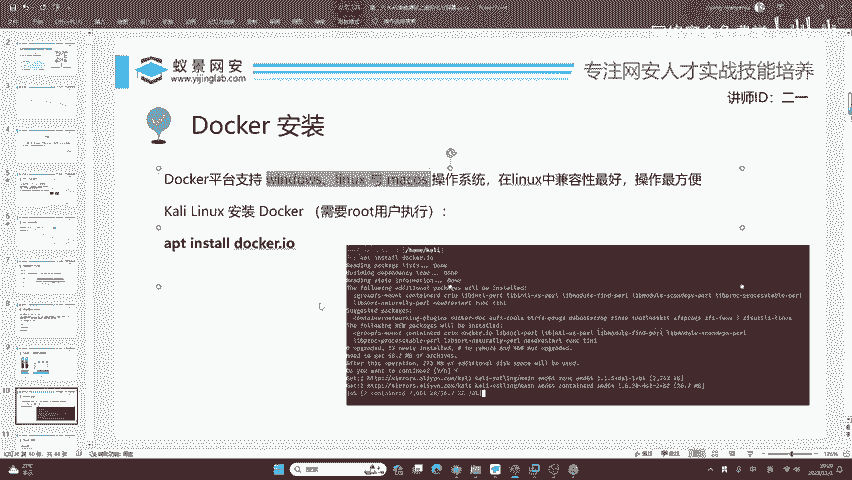
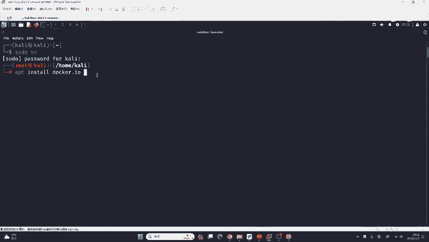
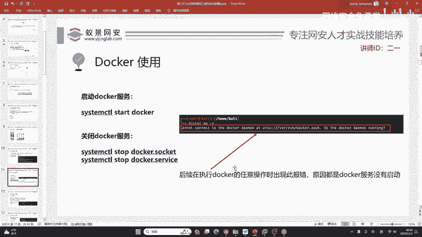

# 2024B站最值得看的黑客教程 ｜ 网络安全／渗透测试／内网渗透／漏洞挖掘／web安全／kali linux／红队靶场／CTF／信息安全 - P23：docker安装 - 网络安全免费学 - BV1uBsTetEow

我们就来看解决第二个问题，就是我们来想啊，我们为什么要把docker安装到卡里上面。😊，这个docker啊，它支持的平台是全平台的，支持windowslinux以及miccro OS苹果的操作系统。

但是啊在linux中，它的兼容性是最好，操作最方便。而大家呢在上一节课也已经学会了卡利的技术使用。所以说呢咱们就今天就当做一个进阶发展的课程，把docker去安装到我们的卡利上面。

把linux与docker容器双管齐下，共同学习，共同了解。这样的话能够帮助大家更好的掌握两者之间的共性以及两者之间的区别。下面我们来看卡里安装docker。

在我们上一节课为大家介绍了IPTIPT呢是卡里，也是咱们乌班图，也是de man的软件安装管理器，软件包管理器。就如同应用商店一样，我们使用IPT就能安装我们所需要的软件。

比如说我们现在需要docker，而卡里上面是不会自带docker的。所以说呢我们需要去安装它。首先先登录到我们的卡里。

那这时有同学可能会说哈，老师我昨天没来听课，那怎么办呢？没有关系啊，咱们今天你依然可以听下去，因为卡利的安装是非常简单的，你即使没有完成咱们昨天课程100%的操作。

你只需要加到咱们的班主任领取一下卡利只需要双击。😊，就可以把它打开，是不需要镜像导入操作的。就像同学们说的，我们的卡里啊是不推荐大家使用镜像安装的。因为镜像它所匹配的是你的物理机。

我们一般不会在物理机器上面安装卡里，因为它的驱动兼容性真的是太差了。你买的内存，你买的显卡可能因为卡里装到了物理机上面，而不能运行，这是非常麻烦的一件事情。😊，好的，我们打开卡里的终端之后。

首先你就是要把它呃把它这个放大一些。那关于昨天的问题啊，就有同学说我网卡没配好，你别急啊，咱们你先继续听，我后面会留时间给大家解决。因为如果我现在花时间给你解决的话，咱们课程就会往后拖很多时间。

那我不想这样，咱们先把课程往下去讲。😊，好的，我们先来看。首先呢我们安装软件是需要管理员权限的。就比如说你现在要到苹果的APPstore里面去安装。苹果的应用一样。

你需要验证你的apple IDD需要进行一下人脸识别或者是输入密码。我们这里也是啊，在这里输入卡里KILI就可以切换到root用户。在root用户下面，我们才能够进行软件的安装。

现在我们来安装IPT installstore docker点IO。😊，docker点IO呢是APT的软件包名称。这里啊大家不用在意它为什么叫docker点IO一样，就像微信。

它为什么叫做vchart以及twitter马斯克为什么会改成叉一样，这个我们不用在意啊，它就是叫这个名字，我们回撤一下，它会让我们选择，do you want to continue，你想继续吗？

我们按一下回车就行了。由于在上一节课呢，我已经把IT的语言更换成了阿里云。所以说我这里的下载速度非常快。如果你没有更新的话，你的下载不是说下载不下来啊，它可能会慢一些，但是说不是不能用。

我只是为了追求速度和追求好用而已。😊。

我们在执行这条命令之后，你看我刚讲一句话，他就安装好了。我这里的网速啊并不算快，因为阿里云它很快。😊，安装好之后呢，我们现在就可以使用docker了。你可以看到非常简单，比你去配什么环境要简单100倍。

甚至更多。😊，那如何去使用docker呢？首先呢我们一定要学会启动docker服务。当你安装完docker之后啊，它。

