# 2024B站最值得看的黑客教程 ｜ 网络安全／渗透测试／内网渗透／漏洞挖掘／web安全／kali linux／红队靶场／CTF／信息安全 - P24：docker使用 - 网络安全免费学 - BV1uBsTetEow

首先是会自动启动的，但是不妨有的同学啊他会对卡利做关机重启的操作。而这个docker啊，他是不会开机自启动的那这时候我们就需要进行一个。启动docker服务。好，来，大家看两个同学的问题啊。

为什么卡里无法定位docker点IO啊？如果你在安装docker点IO的时候告诉你无法定位，就是因为你的卡里啊没有更新源，你一定要输入IT update这个命令去更新一下你的软件商店。

就比如说你现在买了一个手机，结果你的应用商店啊，是一个10年前的，它里面啊还没有微信，还没有抖音，那你就没有办法下载它了。所以说呢我们要进行IT的up给大家解决一下问题啊，这是啊你运行一下ITup之后。

你再去运行ITinstore docker点IO就可以了。清华园是肯定不需要付款的，这些都是开源的，都是开源的，开元免费啊。当然呢你从淘宝和拼多多搜索，那肯定啊就是嗯这一个。啊。

肯定就是呃咱们一个收费的。因为很多的人他会用这种东西啊赚一些不道德的钱，是吧？😊，怎么下载下载是这个下载呀。😊，IPTint do点RO就是下载命令啊。instore是什么意思？安装能理解吧？

安装的意思。你看我这个地方写的很清楚啊。IPTinstore do点IO。为什么很慢？这个我就不知道了，那可能是网络不好吧。就是如果啊你是这个移动网络的话，呃，就是移动宽带或校园网的话，它会很慢啊。

这个没有办法没有办法。就是说如果你是校园网或者是移动宽带的话，它会很慢。😊，那我这里是联通，我下载起来是非常快的。好的，我们现在把啊卡利的呃这个docker安装好之后，我们现在来开始docker的使用。

首先启动docker呢，我们这条命令叫做啊sstem cTL start docker。手机版是没有办法使用它的，手机版会有很多的限制。你是不支持他的这个程序员啊，手机版的话。

因为卡里是一个非常大的阉割版，它绝大部分的功能都已经阉割了。你的源没有更新好，就是因为你的网络不行，你需要把这一个你的IPT切换成阿里云。因为我们在这个境内，你是访问不到美国的网站的。

或者是访问起来非常慢，咱们需要把它切换成阿里云的语源，如果没有听清楚的话，加咱们班主任啊，具体切换源的方法，我都已经写到了这个预习内容中，大家可以看一下啊，找咱班主任就行了。到时候那个文档中吧。

我写的很清楚，大家可以进行啊切换一下。更新之后肯定可以用啊。我这个地方我是全部卸载的。我在讲课之前都是把这些卸载掉。你我给你的东西跟我用的是完全一样的。我这里是中国联通的网络。只要我可以用。

它一定可以用。😊。

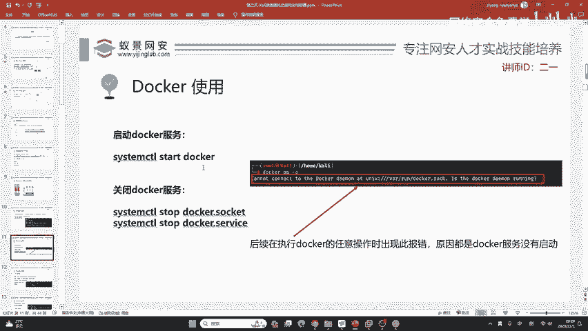

你要检查一下自己是不是哪里操作错了，或者是呃哪里有一些问题啊，尝试解决，或者是你可以问我，当然你要问具体的问题啊。如果说为什么连不上，这会有很多问题。比如说你自己的网络问题啊。

或者是嗯自己的调接模式和nott模式没有选好，都可能会导致网络无法连接的后果啊，当然这个网络是否可以连接非常简单，你可以打开昨天咱们讲的发fox，你输入百度不就可以了吗？就百度可以搜。

就证明咱们可以连接网络，如果百度都打不开，那咱们想下软件，那肯定是无稽之谈了，是吧？所以说咱们要先能联网。😊。

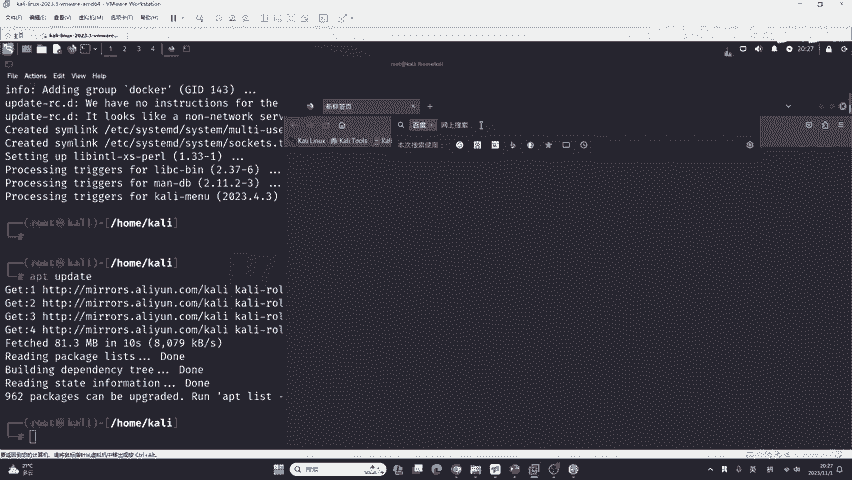

联网的东西啊呃就是大家如果没有听昨天的课，你的卡里双击运行起来就是默认联网的。你只要不乱搞，它就是默认可以联网。下面我们来看啊，如果大家在运行docker的时候出现了这个报错。

就是can connect to the do demo。这个报错啊就是因为大家的docker没有运行起来，你可以输入这条命令叫stem cTL start docker去把它进行一下。

更换过阿里云之后，肯定要upd一下upd的意意思是什么？叫更新啊，更新的意思肯定是要运行的。这些命令大家记不住怎么办？没关系，在课后我都会补充到咱们的文档中，你只需要加入到班主任的微信。

就可以免费看到这些命令，大家千万不要应记啊。包括我在讲课的时候，如果你跟不上，你是没有没有必要跟着我操作的。因为如果你现在。对于这个东西你掌握的不是特别好，或者是说你不是计算机专业的话，你可能跟不上。

没关系，我会把这些都添加到咱们的预习内容中，好吗？同学们，你课后的时候可以在复制粘贴或者是自己去操作复线都可以。😊，好的，我们现在如果你没有出现这个报错，就是你在后续运行docker的时候。

没有出现这个报错，你就别多此一举了。docker是会自动打开的，好吧，你就不要多此一举去运行这个命令了。那我们现在来进行docker的使用。那在docker中啊，我们要掌握两大概念，一个是镜像。

一个是容器。这两个概念非常重要。那有同学讲啊，我这个docker听不懂怎么办？听不懂，我把它保存到文档中。大家课后的时候好好看一看，或者是自己多搜一搜，多想一想。😊，所有的渗透测试工程师他都会。

即使是月薪五六千在四五线城市工作的初级安全服务工程师，他也会。如果你不会怎么办呢？所以说我们要把它讲清楚。镜像就是应用程序的静态文件。就比如说你的代码或者是类似于虚拟机的系统镜像，例如说像卡利的镜像。

win10的镜像，win7的镜像，这个镜像就是一个文件，它是没有办法啊，你说你怎么怎么地的。😊，第二个概念叫做容器。容器呢就是运行状态的应用程序，类似安装好的虚拟机。比如说我这里啊，我这里是卡里，卡里。

我现在已经安装好了，所以说我们可以类似的比较成咱们这个已经安装好的系统，就是容器。没有安装好的系统，这个镜像文件就叫镜像是没有发生变化的。我们只是这个从系统变成了容器而已。在默认情况下。

你安装的docker是没有任何镜像和容器的。我们如何查看镜像呢？使用docker images images啥意思？镜像的意思吧？好，查看容器dockerPS杠A，你可以运行一下哈，它都是空的。

比如说我来给大家敲一下，首先例如说像dockerims。空的吧，啥都没有啊，有同学说这出现的是啥玩意儿，就出现的是叫列明或表象啊，它啥用都没有。如果是刀个PS杠A呢，它也是空的。

这就如同大家刚安装了VMO，它自己会跳出一个虚拟机出来吗？不会吧，只有你把这个卡里安装好之后，它才会出现这个卡利呃，同样的道理，咱们的容器跟虚拟机是有一定的相似度的，默认啊都是空的。😊。

下面我们继续来看，那空的怎么办呢？我们就需要学会下载镜像安装镜像，你就可以掌握docker的技术使用。下面我们来看下载镜像呢，这用到的是咱们docker的三大概念，你要记住docker docker。

就这三种操作。不论是你现在刚入门，还是以后你专门做云安全，就这三种操作，一个叫做build，一个叫做shall，一个叫做run，这三个单词都能看懂吧？都是初中英语啊，或者是小学英语。

我们现在所使用的这个下载镜像，就是第二个叫做shall传送。我们要从云端把这个镜像给它下载下来。比如说我们下载一个镜像叫airpi，这个镜像呢是一个测试镜像，我们使用这个命令就可下载下来。

叫docker pro。😊，ILPINE加上镜像的名称，它只有5MB的大小非常的快。我们可以去复制一下。

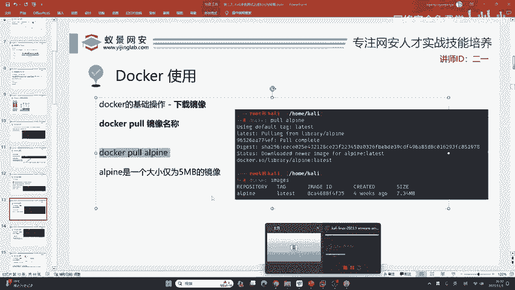

把它粘贴到这里，或者是自己敲，都不会花费太多的时间。我们运行一下啊。好，运行之后呢，你可以看到现在这个镜像已经下载了次下载完成了啊。你如果能够看懂英语的话，那就非常清晰。如果你看不懂的话。

可以借助翻译软件，或者是我这里会给大家讲。这里出现的就是告诉你，你下载了一个新的镜像，它叫做airine。😊，我们下载好之后，如果再一次输入docker images。你可以发现它就会多出来1个7。

34MB的镜像。叫做这个镜像的名称，以镜像的ID编号。

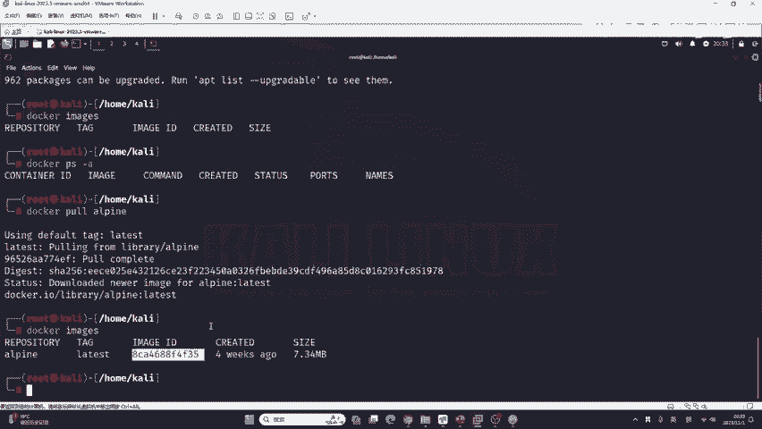

这个镜像呢大家在下载的时候可能会出现一些问题。这个问题啊就是非常非常的慢。那为啥镜像很慢呢？首先我们来解决两个问题。第一个问题就是说2一老师是怎么知道这个镜像名称叫这个东西的。

我应该选择什么样的镜像当成我的应用程序呢？这时候我们就首先要知道docker的镜像都在那儿。就比如说我们下载卡里的镜像，你可以从咖喱卡里的官网上面去下载。

那docker的镜像有一个官方网站叫做hab点docker点com。这个网站呢在境内，也就是中国大陆地区，你是没有办法访问的。我这里有一个截图啊，大家可以发现，在国内任何地方访问它都是超时的。

如果无法访问怎么办啊？我们等下会提供解决方案，你不用急，这也是咱们这节课的目的，就是因为你在网上是找不到这些东西的，网上找的话，它会坑死你。不信啊，你可以自己去看啊。

这个docker hub里面它就保存了所有的。😊，就是公开的docker的镜像。比如说我点击expler之后啊，第一个映入眼帘的就是刚刚老师下载的这个镜像叫做ILPINE这个镜像。我只是做一个测试哈。

现在大家的问题来了，就是hub docker我连不上去怎么办呢？有一种解决方法就是科学上网。你如果能够打开谷歌这个网站。那你的docker hubub也就能够打开，大家如果自己有科学上网能力的。

可以去尝试，那在上课的时候肯定不能讲这个玩意儿啊，大家懂的都懂。那怎么办呢？我们如果不会科学上网就没有解决办法了吗？这里我们还有一种解决方法叫做修改境内的景响源，我们把它称为docker加速器。

但是呢现在绝大部分的docker加速器啊，都已经关闭了，或者是仅供内部使用，这个原因啊也是未知的。就是大家都不提供给给这个公开去用了。😊，那这里呢只推荐大家使用阿里云的镜像加速器。

这个加速器的地址啊都是根据自己的阿里云账户去分配的。每一个人均不相同。阿里云大家应该知道吧，既然你都接触到计算机了，你应该非常熟悉阿里云这个公司。首先呢我们可以打开阿里云的官网，就是阿里云点com。

非常简单，你也可以到百度上面自行搜索阿里云，就可以找到啊它的一个页面。找到之后呢，我们点击控制台，然后登录自己的阿里云账号。阿里云账号每位同学都有，为什么呢？你没有支付宝和淘宝呢？

有吧啊你有支付宝和淘宝，那阿里云，它就是阿里的产品，你使用支付宝和淘宝都能够都都能够登录。那阿里云所提供的加速器呢是完全免费的，而且非常快，我们就使用它就行了。😊，好，在登录之后，我们点击控制台。

点击控制台啊，这个阿里的控制台它是非常反人类的，就是说啊它东西太多了，这时候怎么办呢？因为阿里云的产品超级多哈，咱们要去找咱们今天学习的是云计算啊，云计算。那我们要去找什么呢？要去找一个服务。

叫做容器服务。我们可以去搜索容器。😊，在容器服务中，你可以找到容器镜像服务IR这是阿里云免费提供的服务。我们点开点进去。点进去之后啊，你不需要不需要创建这个实力啊，因为创建实力是需要花钱的。

我们现在不需要创建实力，只需要点击镜像工具，在这里点击镜像加速器，就可以看到自己独一无二的加速器地址了。当然大家如果你想使用我的，也不是不行啊，但是我不会把它公开，因为阿里云是不让公开这个地址的。

每一个人都不一样。😊，好的，我们现在就得到了加速器的地址。得到加速器的地址之后啊，我们肯定要给给他啊给卡利配置一下。因为卡利也默认他又不可能使用加速器。那如何给咖利配置呢？

下面呢阿里云非常贴心的提供了操作文档里面有告诉你如何配置镜像加速器。不过他提供的文档呢可能不太利于咱们小白浏览。我这里啊给大家讲一个非常简单的方法。这些你在网上都是学不来的。

比如说你在自己百度搜索镜像加速器，他可能会推荐你用中科大的京华源的网易的刀客的，包括docker中国的这些加速器，很可惜啊，这些加速器都已经关闭了，都已经不开放使用了。

你必须要用我的教程才能够满足这个条件。

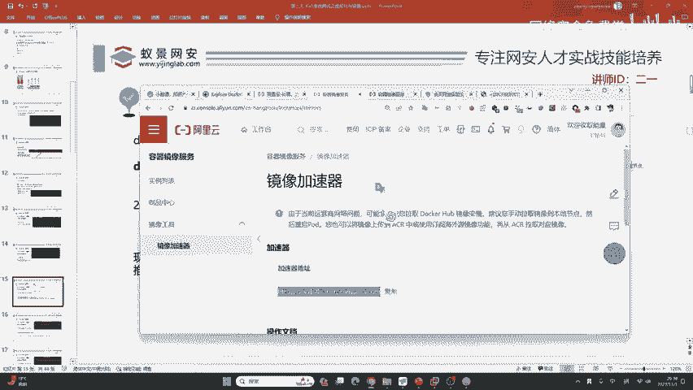

这也就是为什么我们要去做这个训练营，要做这个公开课。我们现在啊复制一下这一个部分，这个部分就是花括号啊，花括号大括号里面的这些东西，它分别是regstry啊，这个就是我们的啊仓库地址啊。

仓库镜像是阿里云的这个地址啊，你每个人这个地方都不一样啊，你是啥，我也不知道它是啥就是啥，你用支付宝号登登录一下就知道啊，它是免费的，我们去复制一下它啊，复制一下它之后。

现在我们回到卡利中去打开一下咱们的这个文件，在咖利中怎么打开文件，大家可能在网上看到的教程啊，都是使用VIM编辑器，但是VIM啊，对于新手来讲非常的不友好。我们就需要使用卡里的记事本在昨天给大家讲过。

它叫做mousepa图形化件。😊，Me。mo斯pa之后啊，跟上我们这样一个文件，叫做ETCdocker。DIEMON。点杰son，还是提醒大家，你可以不跟着我一起敲。

因为你如果没有经常敲这个linux命令的话，你可能速度跟不上来，就会导致咱们课程缺失，这用到的所有命令我都会在课后的时候写到咱们的文档中，你可以添加班主任免费领取，好吧，大家可以不用说哎，老师讲太快了。

我跟不上。哎，老师这是啥意思？我记不住怎么办？都不要记啊，都不要记，我也记不住，你看这个阿里给你写着呢？你为啥要记他呢，是吧？这不给你写着呢？ETCckerDIEMON点杰son，你照着敲就行。

只是我给你提供的方法更简单。😊，好我回车一下，这时候是不是打开了咱们的记事本。之前有同学问到问题啊，就是说怎么打开记事本这么多报错，我再次提醒，这不是毛错，这是warning叫警告。你是不需要问他的。

咱们打开记事本之后，把它粘贴一下。😊。

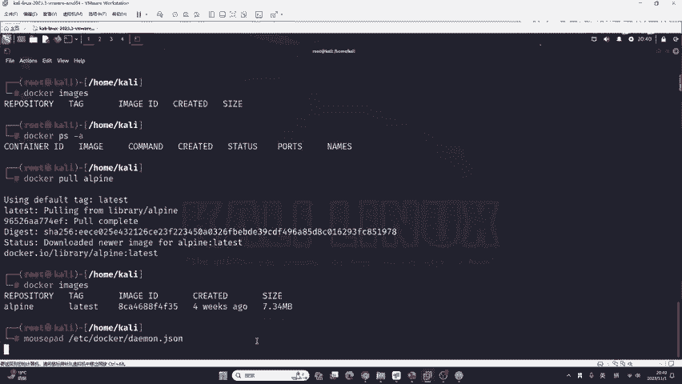

是不是就过来了，粘贴过来之后，咱们保存一下，点击这个叫做sve the print document。就是保存当前的文档，点一下保存。好，保存之后咱们叉掉就行了哈。叉掉之后啊。

现在我们的加速器就已经配置好了。但是如果想让doockcker去识别我们的加速器，就必须要重启docker服务。重启docker服务的命令呢，其实大家都可以自己领悟出来。

比如说我们刚刚讲了启动docker的命令，叫做system c tLstar docker。😊，那如果是重启呢，重启的英语是什么？大家应该知道吧？restar就是RE，前面加上R一的前缀。

这个同学写的非常正确，对你提出表扬啊，当然大家不会也没关系啊，你不会，现在不就会了吗？是吧？😊。

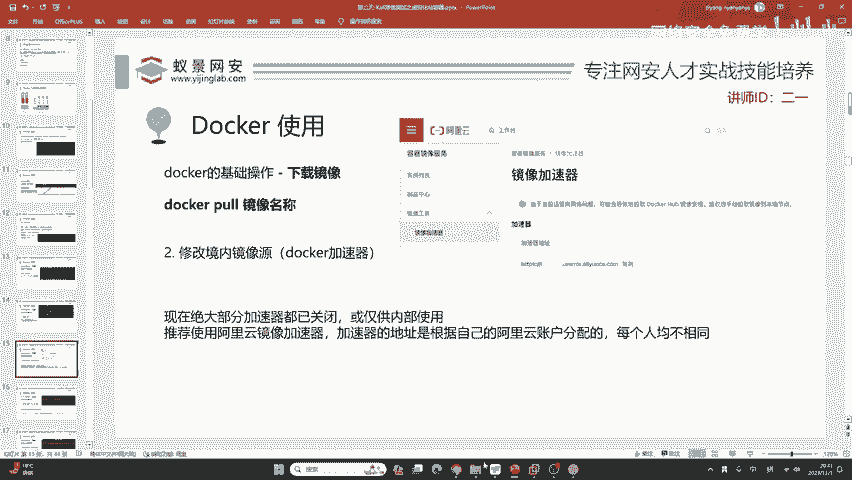

现在不就会了吗？咱们这个网络安全就是一个积累的过程，不是说你一天非要达成什么什么目标。😊，这个绝对不要有这种计划，而是我们日积月累。每天你只学会一个命令。就是说比如说咱们一天只学会一个命令。

一个星期只学会一个漏洞。如果你坚持就是你坚持一年，你一一个星期啊，一个星期只复现一个漏洞。记住了，你坚持一年。😊，360和起航信随便进，但是这个几乎没人能够做到。我说的是一个星期复线一个漏洞，坚持一年。

这很难我是做不到的。啊，这就是因为坚持的重要性，你不要害怕。现在我们重启了docker之后，docker已经使用了阿里云所提供的免费加速器。那我们如何去确定docker已经用了加速器呢？

我们可以使使用这样一条docker指令，叫做docker info info的意思就是信息啊，我们回撤一下。回车一下，这时候在他的倒数第三行会有一个叫做。仓库镜像地址、仓库源。

我们在这里啊可以明显的看到有阿里云字样，就代表你现在加速器已经完全设置好了。

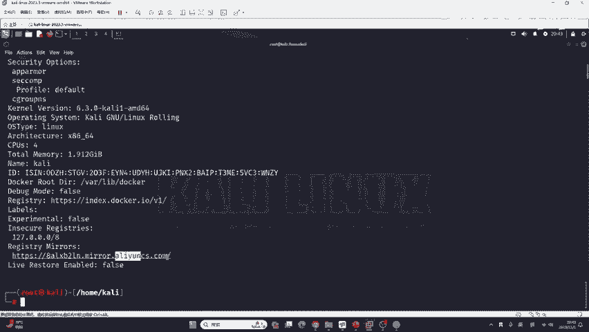

设置好加速器之后啊，我们之后再去下载镜像，就不要害怕说我境内我现在不会科学上网，我连接不到docker hub这种问题了，我就不需要再担心它了。😊，好的，这是加速器。这个教程啊值得大家去于试。

但是你要注意一下，就这个加速器每个人的这个地方，这个地址啊都不一样。这是由阿里啊自动给你分配的。你跟我的是肯定不一样的。大家是啥啊就是啥，直接复制就行。😊，好，下面我们来看修改完成之后啊。

记得重启docker。那我们使用docker info在这里看到阿里云CS点com就代表已经修已经这个修改好了。在修改好之后，我们就可以愉快的下载镜像了。下面我们来举一个例子啊。

比如说这个镜像是比较大的。它叫做DVWA。😊，DVWI呢如果有对网络安全感兴趣的同学，或者是有接触过一点网络安全的同学，应该都知道它是一个非常出名的靶场。如果你自己去下载DVWI，你需要做什么事情啊？

大家可以想象一下，首先我需要去下载1个PHP study。那现在呢PHP study已经变成小皮面板了，小皮面板很难用。我们还需要去下载DVW的源码，还需要去修改它的源码。然后呢还需要去创建这个数据库。

才能把它启动。那我们学习网络安全，真的有必要这样吗？肯定是不太行的，因为谷歌你是访问不到的是吧？谷歌你是访问不到的，所以说你谷歌DVW也进不去啊，除非你能够科学上网才能够打开谷歌。😊。

就是说我们学习渗透测试有必要学习PHP吗？大家觉得。啊，我就不让大家觉得了哈，我这里可以明确给你讲。😊，没有必要，现在已经2023年了，你去渗透测试。

你几乎啊是见不到PHP所便携的网站PHP加马搜q的组合，更是少少之又少了。咱们一般情况下最基础的网站，它都会使用java，如果是一些大型厂商，比如说你的淘宝啊，它以前是PHP是吧？

淘宝以前是PHP那现在呢它已经变成够语言了。因为它的这个性能更高更好写，更能够兼容现在的一些应用场景啊，所以说呢你这个PHP你还要学学着去改它还要学着去写它，这对于你来讲没有特别大的作用，不是说不行啊。

你学了更好，你如果都会那更好，但是人的精力有限，你要讲究效率。那现在如果你学会了docker咱们如何去搭建DVW呢？不论是搭建DVWI还是你之后遇到的。😊，所有的靶场。都可以用这种方式搭建。

我们来看一下讨论区。有同学说，CTF的基础语言是加PHP吗？不一定啊，是CTF的web方向的基础语言是PHP如果是其他方向就不一定了。比如说像逆向是C加加，如果像是胖的话，就是会变，它是不一样的。

CTF方向比较多。😊，好，下面我们来看一下，首先这个DVWI的这个镜像名字应该如何确定啊。大家呢如果你访问不了dogo hub的话，你可以用百度代替。我们这里我能够访问，我可以直接输入DVWI。

然后我可以把它放到咱们的预习内容中，在课后你可以直接复制过来用。😊，你看一下它的镜像名称。首先前面这一串英语字母啊，是这个作者的IDID。😊，你的air pine刚装好是吧？那已经非常优秀了啊。

如果你就是说。😊，你没有基础的话，你能现在把它装好，已经非常优秀了。但是你不用急，你不用跟着我做，你很有可能跟不上来。因为我这里啊我我很清楚这些命令，我可以给你讲的很清晰，你理解最重要。

现在他这个命令会给我们，我们可以直接复制过来，叫docker pull。我们来举个例子啊，比如说刚刚是不是p这个东西。😊，高端pro是下载的意思啊，下载这个非常小的镜像，只有5MB。

现在我们要下载这个大镜像，是不是只需要把这个镜像名字改一下就行了。哎，前面这个是作者的网名啊，这个网名你不要删掉了，删掉了就下载不到了。😊。

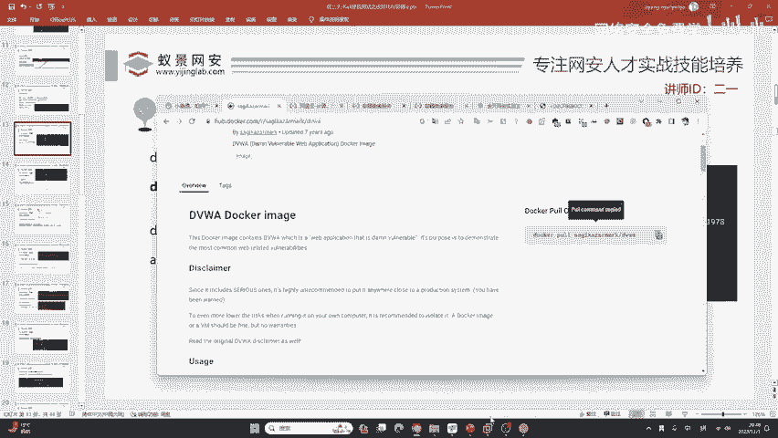

咱们来看一下这个阿里云的速度啊，其实还是非常快的。我这里是中国联通的网络来连接阿里云的加速器，我们可以稍等一下。因为DVW的镜像呢，它可能1个GB或者是1个GB左右。😊，什么丢脸啊，没有这个问题啊。

这文档有先后怎么。就不理解呢，不是说你这个东西，有的人他需进入到渗透测试岗位，他都不会倒ker。你就是尽力的去学，你不要去改。有的同学就非常急哈，就是说我今天必须要学会什么什么东西，急啥呢？

网络安全是学不完的，能理解吗？你永远学不完，活到老学到老，你学的东西越多，你就知道你不会的东西越多，那怎么办？就学呗，每天坚持，你可以看到几乎。😊，这个。一分钟的时间就下载下来了。

我们可以看一下它的大小，imagages。😊，呃，359MB还好是吧？不会占用太多东西。那我们现在来去想这个DVWA现在已经下载下来了，我们能打开它吗？很明显是不行的。因为我们的docker。

它是一个什么，它是一个应用程序平台，我们只是把这个应用程序下载下来了。又比如说以前我们安卓手机，如果想安装软件，是不是要先安装这个软件包，然后啊再去安装才能够打开。

不过现在啊由于手机的这个封闭环境越来越好，不不仅仅是苹果，包括安卓都是你一键哎下载加安装都给你做好了啊，但是啊咱们的docker为了帮助你理解，咱们还是分不来做。这一步啊只是下载。

我们现在还需要把它安装。啊有同学听到这里会说还不如我自己手动装呢？那你想象一下，你手动装DVWI，你会PHP。😊。

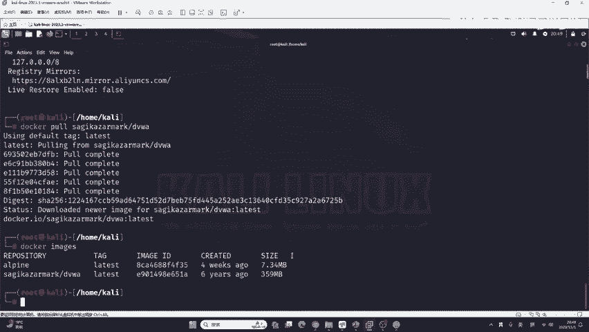

没关系，你会PHHP没关系。那现在让你装java呢，你会不会？😊，有同学说，java我也会专业课学过，让你装pyython呢，装你装勾呢，让你装ruby呢，你怎么办？你说你都会吗？那不可能。😊。

但是我们学会这个之后，你以后想去下载镜像，改什么，改后面这个镜像的名字就行了。它不论是DVW circlecle i levelss upload levelss等等等等，各种各样的。

你想下载就下就行了，不需要学会任何的语言。😊，没有必要，你学了也没用啊，你学不完是吧？你学了之后做开发去了。好，那现在我们就来讲以DVWA举例，现在DVWI已经下载下来了，那应该如何运行呢？

这需要用到咱们doockcker的另外一个呃方式叫做run。

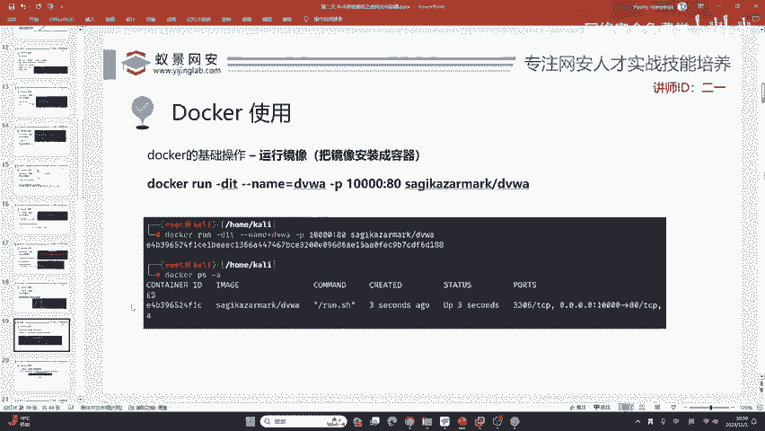

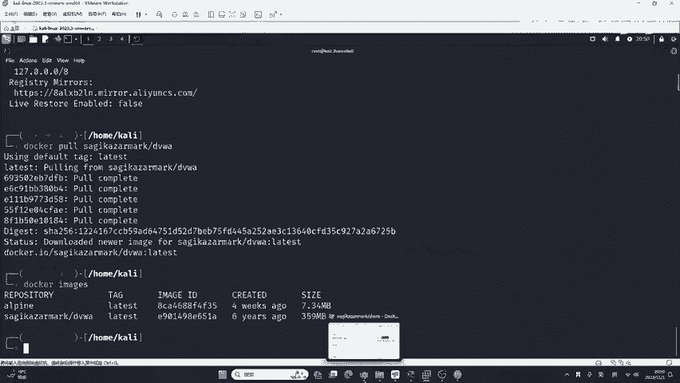

就是s咱们用的是吧，run是吧run啊，咱们怎么run呢？呃，来看一下。😊，首先呢ron就是docker run杠DITDIT的意思啊，就是横线DIT叫做放在后台运行。

然后杠杠name叫DVWI我们得给它起个名字吧。比如说你现在在安装卡里，你是不是要给他起个名字叫卡里，咱们安装windows10，你是不是得给他起个名字，叫windows10是吧？给他起个名字。

你想叫他啥就叫他啥。我这里啊为了方便大家理解，就把它叫做DVWI了。下面呢是这个杠P。😊，横线杠P呢，它是这个端口，因为啊DVWI它是一个网站，网站默认运行的端口是80。是80，如果你不知道的话。

现在就知道一下就行了。它就是80端口，就是网站端口。我们要把它映射到1万端口上面。这个端口啊是0到65535，你随便选。😊，但是啊他们尽量选1万以上的，这样的话不容易冲突。也是TCP建议我们这样做的。

好，这是80映射到1万端口。后面这个东西你知道就是刚刚我们的老朋友镜像的名称吗？

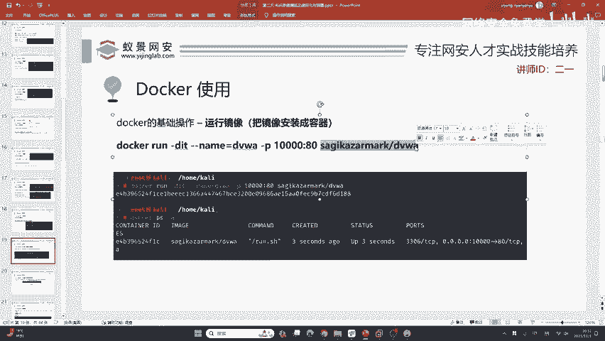

好的，我们来运行一下它这里啊我就不给你去啊复制了，咱们边运行边讲docker这个你知道run你也会啊，刚才DRT是放在后台运行，咱们后台运行啥呢？咱们给它起个名字嘛。比如说我现在安装一个容器。

它就叫DVWI就安装一下它们安装一下DVWI。然后呢咱们加上杠P杠P呢，我这里写1万，你写几都行。比如说我改成2万好吧，咱们跟课件不一样，帮助你理解后面这个你不能动80端口嘛，就比如说你启动一个游戏。

你就必须要双击这个EXE你双击其他的地方，它启动的就是其他的软件了，这个80端口就是DVWI默认的端口，你是不能改的。但是前面左边的这个端口，你是随便可以改啊，可以随便去改。😊。

IPT installstore do点IO，我给你解决一下问题，加一个点IO好吧，我给你敲一下，好吧。大家也可以看一下。好，我给你发过去了。现在呢我们继续。这里写好之后，我们只需要把这个东西啊。

就是刚刚你下载的这个镜像，你给它复制啊，复制怎么复制右键啊，右键点击copy就是复制。然后到这个位置，右键点击pas past是什么粘贴。好，咱们看好，我开启DVW要多长时间呢？按下回车一秒钟打开了。

😊，好的，DVWA就安装好了，什么配置都不用做，直接就是OK的那OK之后咱们要访问什么呢？我们肯定要访问卡里访问卡里的，你要记住了，80端口是别人DVWA的端口，这边左边的端口是我们自己的。

所以说我们要访问的是2万端口，你这里写啥都行啊，你写多少就是多少，现在给大家演示一下，为了方便，我就直接打开。😊。

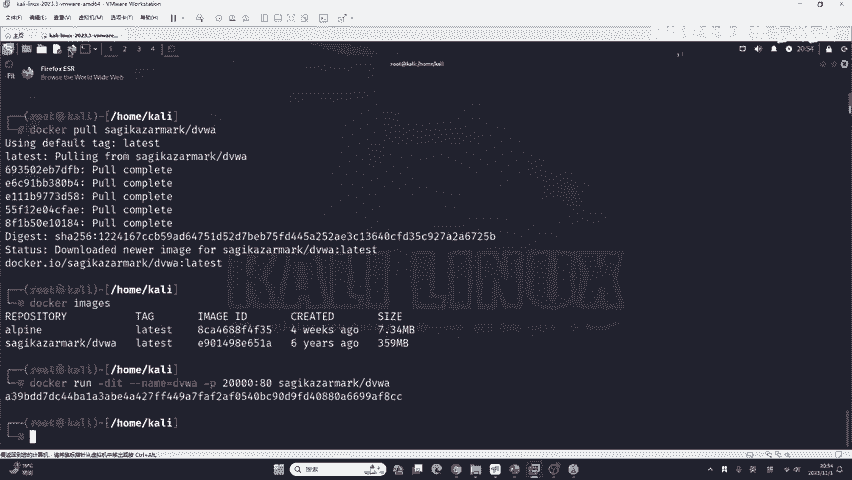

火狐浏览器访问127。0。0。1，也就是咱们卡里的地址。怎么访问2万端口呢？咱们加上英语的冒号，写2万。来看这个软件就安装好了。非常简单吧。现在有同学讲，我不想去使用DVWA。

我想去使用sclesscles呢也是一个非常出名的一个技术靶场。那这个靶场应该如何安装呢？我现在快速来给大家演示一下，就是我现在不会PHP补什么都不知道的前提条件下。

我已经学会了怎么安装DVWA虽然你觉得很繁琐，但是实际我们用到了几个命令。😊。

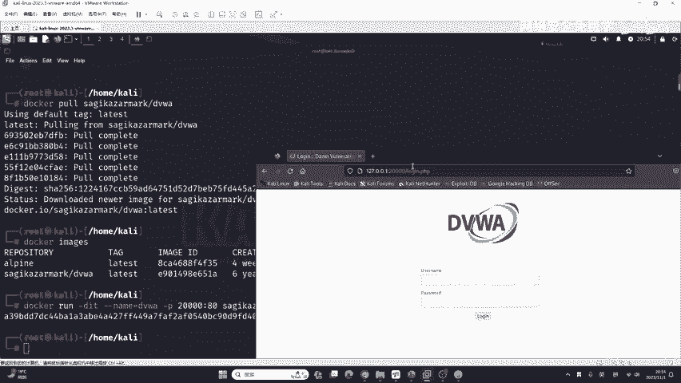

一个。两个就搭建起来了。现在我来给大家演示第二个靶场，java的也是一样。现在比如说首先我先搜索ss，如果你没有科学上网能力的话，你可以把。

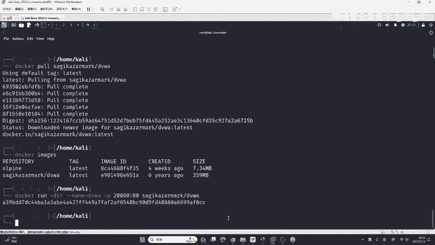

百度啊当成你的搜索镜像名字的这个中介啊，比如说我们得到了这1个C0NY1，这是作者的网名啊，这些镜像不是这个凭空生成的。哎，大家看一下讨论区互动区。

这个同学问到docker跟主机连接是用nt还是巧接网卡，这里是用的docker自己的虚拟网卡，它其实。是一个not特模式，类似于纳特模式。能理解吧？他其实是自己的一个网卡，就是docker的自己的网卡。

它不是用的虚拟机的网卡。好，下面我们继续来看。现在得到了这个地址，那有同学说我咋知道是他的？你看这个地方有下载数是不是有很多个呀，是哪一个你要选择哪一个其实都是可以的。为啥呢？这些镜像不是说凭空生成的。

它都是由这些无数的安全工作者去贡献的，你也可以做一个镜像去给到它。因为我们之前讲过docker就是build shell和run，你也可以sha，你也可以分享。

你把你自己做的镜像把自己做的靶场就上传到这个dog hub，别人也是可以下载的。现在举个例子啊，比如说我随便下载一个。😊，比如说就他。这个镜像。或者是我们换一个啊，你随便随便选一个都行啊。

你看两个我不选第一个也行，选第二个。好，他的这个下载命令直接给你了。

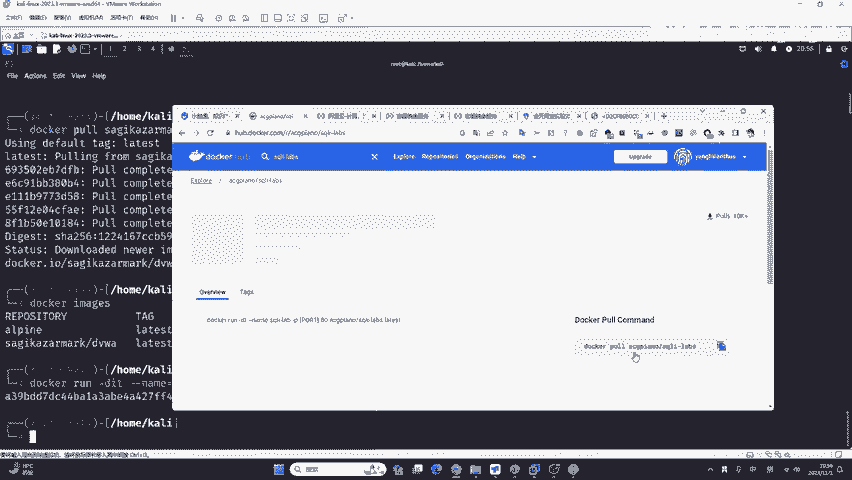

我们来对比一下啊，这个课件上没有你来看一下这个下载TVWA跟下载s levels有什么区别？😊，是不是就他的这个镜像名字不一样，按下回车。看一下阿里云得多长时间能把它下载下来，其实还是非常快的。

你要稍等一下，他现在他需要连接，就是他需要获取这个下载的连接。所以说一开始会有卡顿，你不要急啊，不要把它删掉了，开始下载。好，下载完成下载完成之后啊，你可以看一下它，看一下它多大是吧，多大呀。

这个434MB现在怎么开启？😊，怎么开启？我们来看刚刚开了这个命令，是不是开DVWA啊，我们现在给它换一下名，好吧，咱们换成4块 levels。😊，然后这个地方。咱2万端口被占用了，还能不能用啊？

2万端口开着咱们的DVWI还能不能用2万啊，不能，咱们就用2001吧。好吧，2001这样的话好识别。咱这个地方我们是不是得换成咱们刚刚下载下来的这个scle呀，得换一下是吧？换一下。好，咱们往这一粘。

看一下，按一下回车好，一秒钟搭建起来了。😊。

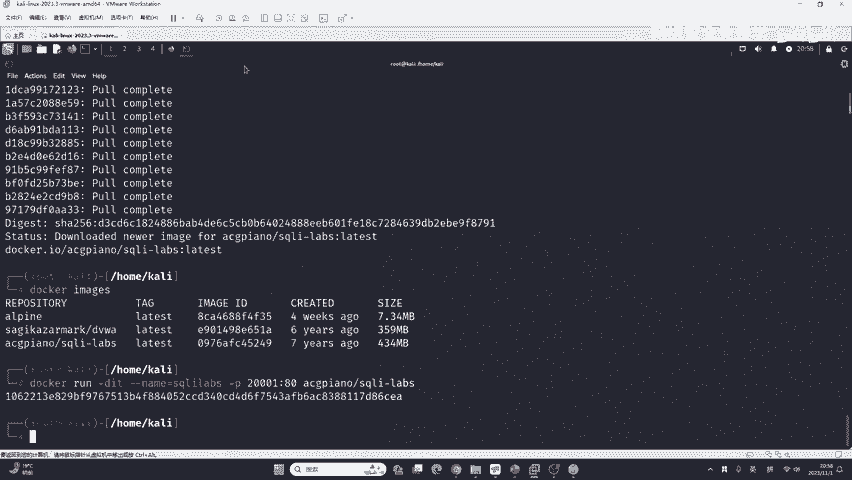

我们来看一下，访问一下哈，刚刚访问的是2万端口，咱访问一下2001。😊，大家好了。而且他跟两万端口是不冲突的。啊，那有同学会问我搭建这么多，会不会对我的内存造成影响啊？在昨天咱们讲卡里的时候。

其实就卡里的2个GB，你都可以同时搭建十几个靶场，不会有任何卡顿，因为docker就是快捷，而且非常的轻巧，几乎不占用内存很强啊。这个docker很快，你可以看到咱们搭建scle labels。

也是需要这两条命令。😊。

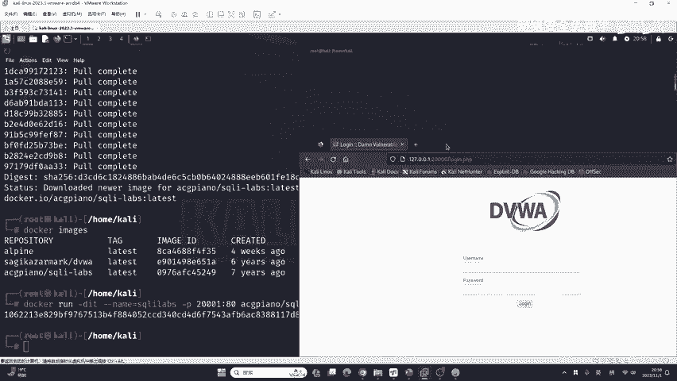

好，你现在就已经学会搭建所有的应用了，都是这样。

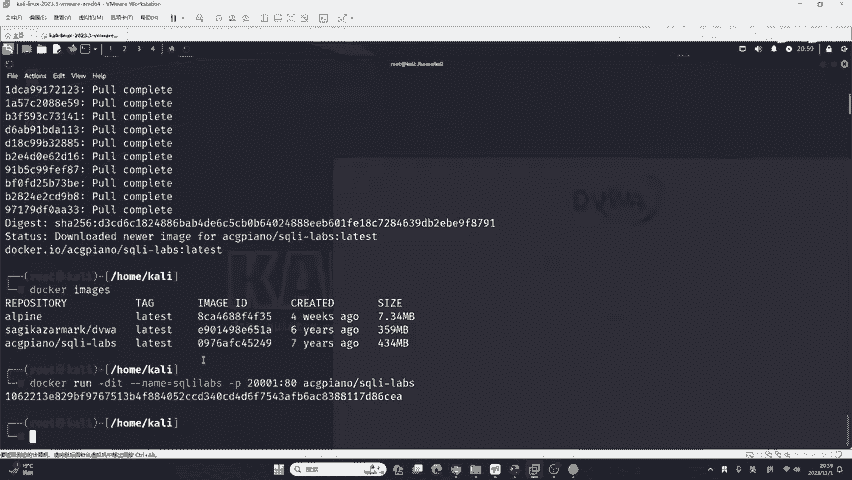

现在在dog hub上面有。无数个镜像。你比如说你想安装eng，有的同学知道吧？eng是啥？是一个中间键，是一个外b服务器。乌班图有python有reis数据库。

有postgQL也有 nodeode node就是GS的服务端，大家应该知道吧。啊，如果你不知道的话，现在科普一下，这些都是非常非常重要的呃IT一些框架或IT的编程语言。在无数的IT从业者。

不只是开发运维和安全工作者都在用。😊，这里是数据库，就HTTP就阿帕奇这mongodB还是数据库马蚁soco有你可以看其他数据库也有docker你docker它有自己的啊。

docker里面还有docker是吧？还有hello world，这就hello world这加vaopen jDK go语言go longwordpress这是世界上最大的博客网站你可以在docker里面再嵌入一个deto s。

你可以在docker里面嵌入一个to S。😊，PHP。等等等等，又是想下什么就下什么。那有同学讲啊，老师我这个PHP啊。😊，不同的版本怎么下呢？比如说我现在想用PHP5。2，我想用PHP8。0。

我想用PHP7。1怎么办？你点开大胆的点开啊，大胆的点开，你点开看一下。😊，来，我们点开之后啊，点这个tgs叫做标签。不可以啊不可以循环嵌套无限层。因为虚拟化是不支持嵌套的。好的，我们看一下哈。😊。

点击这个ts，你就可以看到几乎所有的版本。比如说我们画快一点，这是不是8。3。08。3。0。😊，你往后。有几十页的版本让你下载，比如说是8。28。28。2，你想下载哪个版本，它全部都有。也就是说。

我们现在如果想下载PHP7。1，你只需要找到7。1版本给它下载下来就行了。而且它的大小有多大？只有37MB。也就是说你几乎把你所需要的PHP比如说我需要10个PHP版本实际占用的空间也只有300MB。

而谁需要10个PHP的版本吗？这很现然是不现实的啊，它是非常轻巧的那同样的其他的应用也都是如此。我以PHP举例啊，就是很多同学可能在大学里面，或者是自己网络安全的途径中啊接触过PHP所以说我才来讲。😊。

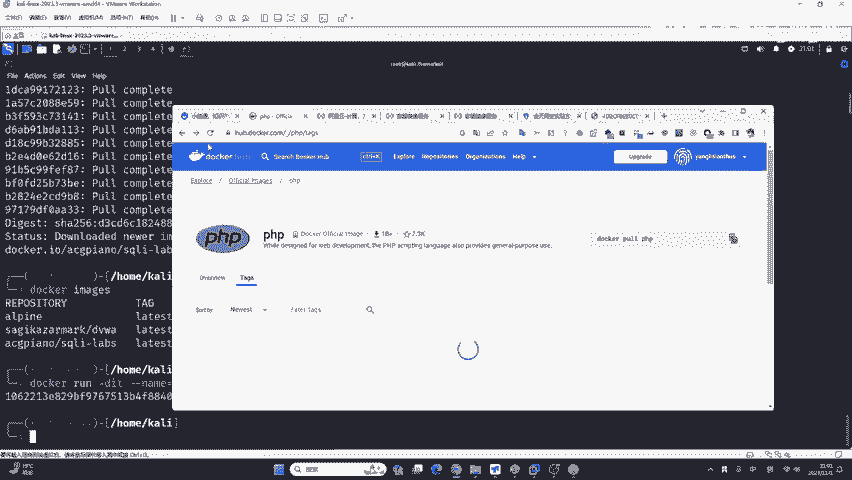

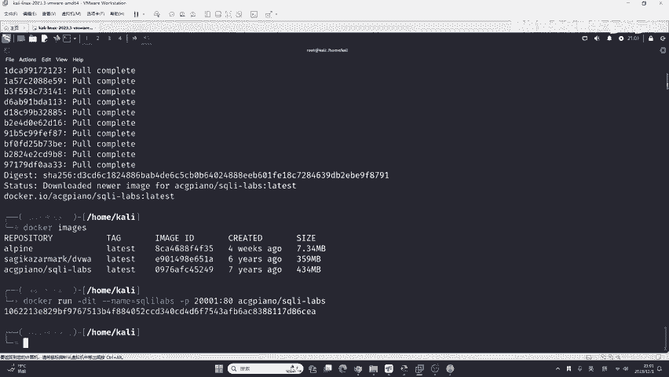

好，下面我们继续来看。既然有了这些运行镜像，我们现在就需要考虑我们这里。啊，这个同学说的是不行的是不行的。你的问题大家可以了解一下。这个同学的问题呢，就是说我在docker里面装一个乌班图。

然后再在docker的无班图里面再装一个docker，这是不允许的哈，这是无法实现的。因为在容器是不支持嵌套的，这是一个硬件的瓶颈啊，你不要说哎docker不给意思，它不给开放这个功能，不是这样的啊。

这是咱们硬件的问题啊，就CPU没有办法进行虚拟化的嵌套。😊，好在现在我们学会打靶场了，学会开放应用了，学会开放。专业的应用了，不能说应用啊应用那英雄联盟也是应用啊，那谁不会开双击就点开了。

咱们这是专业的IT应用程序。😊，容ong器i。他除了这些东西之之外，这个M同学，我跟你讲了，你可以用百度代替啊，百度你去搜索sosocle eye levels这个镜像就可以了。那这个地方啊。

如果你现在访问不了的话，那你可以是使用docker加速器，直接去下载老师的这个镜像就行了。这些镜像的名称，包括我们今天课程中设计的所有的命令。所有的命令我都会在课后的时候加到咱们的预习内容文档中啊。

到时候你可以找班主任免费领取。呃，以前有现在都关掉了哈，现在都关掉了呃，这不知道为啥啊，都关掉了。😊，呃，因为可能一些呃限制吧。这个容器呢它就如同一个虚拟机，之前给大家讲过镜像呢就是镜像的意思。

那镜像安装好之后的东西叫做容器。虚拟机是可以开机关机重启删除也能操控。那我们的容器同样也可以开机关机重启删除操控。它分分别对应star stop restart rM以EXEC下面我分别来进行演示。

大家看好我这个地方不是开了DVWM吗？你看。

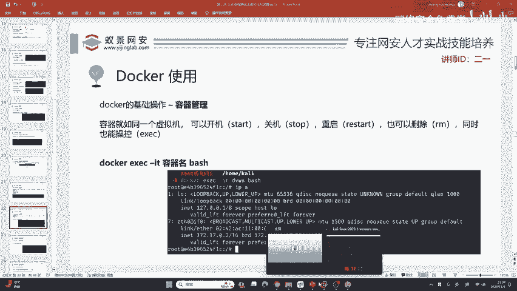

现在我想把DVW关闭怎么办？docker关闭是什么？stop。

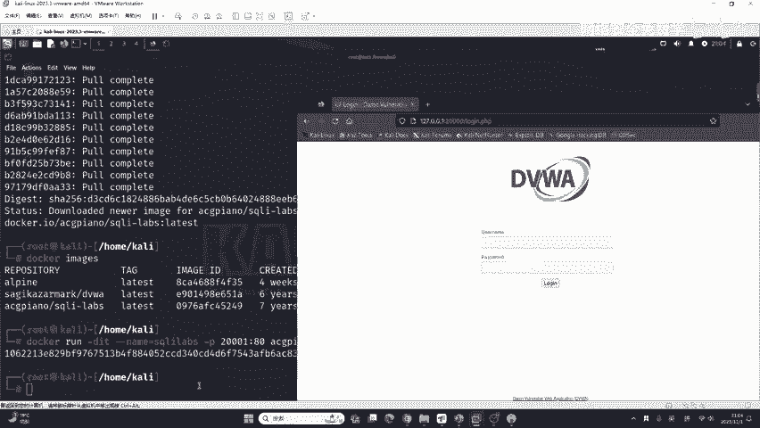

DVW。不要写错，回车一下，关闭DVW电是需要时间的。因为它你说你关机，你不得谁关机，一开始啪把电源按掉呀，是吧？它肯定需要关机时时间是吧？关机时间现在关掉了吧，关掉，我们刷新一下，是不是访问不到了。

那怎么开机看好docker开机是什么？start。😊。

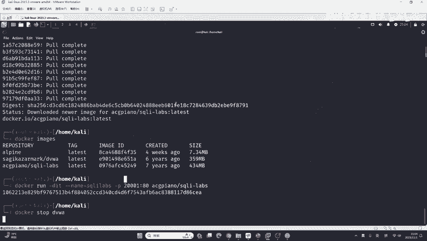

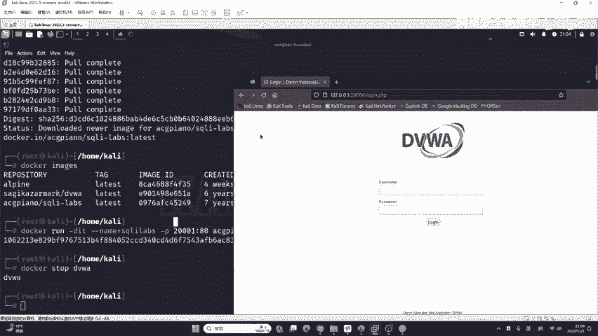

DVWA回车一下，开机好了，咱们刷新一下。

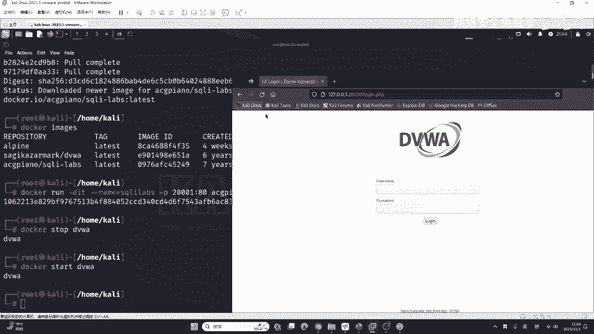

是不是恢复了？现在有同学讲啊，我想去操控它，我想进到它里面，进到它里面哈，你想一下DVWI它只有359MB，那它会有桌面吗？它没有啊，它没有桌面，一个桌面有一个桌面的操作系统，那至少10个GB以上。😊。

那它没有桌面的话，咱们就只能进入到它的命令行。我们现在来看怎样进入到它的命令行啊，linux的命令行叫做bsh，它是命令行其中之一。也就是说我们要操控它要执行它叫做EXEC就excuse前三个字母。

就执行的前四个字母啊，前四个字母。现在我们来演示进入它。😊。

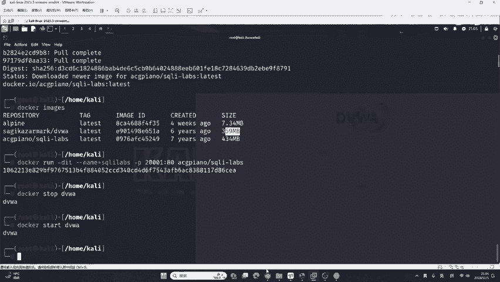

EXEC。这里啊要加上杠ITIT的意思啊，就是说我要进入到哪一个容器，你不是有两个容器呢？我这里有一个叫s levels，一个叫DVW，一共两个容器呢。我想进入一个，你得指定吧。

我比如说我想进入这个DVW。😊，进入他的啥进入到他的命令行呀，命令行叫什么？命令行，你给他说命令行吗？不是你是command吗？也不是command，是windows的是吧？咱们叫besh。

看好回撤一下就进来了。😊，这就是一个全新的系统。咱们进到里面哈，就是进入到了DVWA这个容器里面，你可以理解为它就像一个虚拟机一样，但是跟虚拟机看着一样，原理不同。😊，知道吧？就是用起来一样。

它比虚拟机好用，比虚拟机快啊，但是看着也差不多啊，但是呢原理又不一样啊，就实现方式是不一样的。啊，你看你在这里执行什么命令都是可以的，就是一个全新的系统。你想退回到咱们的卡里也很简单。

就是退出的英语eaEXIT。😊，就退回来了。咱们这就是操控它的一个方式。或者是我现在想进入scle levels怎么进。直接把这改掉，改成circle i levels回车。

是不是进来了是吧又进到 levels里面了。那咱们退出一下就行了。一般情况下啊，我们是不需要进入到容器里面的，你进入到容器里面干啥呢？我们使用docker就是为了避免麻烦，就是为了图个快。

你进入到它里面除非就是说里面出现了严重的bug，或者是你真的需要修改一些东西，那你再进入它里面去调试，一般情况下在正常的。😊，正常的网站还开发环境，测试环境都是不会进入到dooccker里面的啊。

都是不会进入到里面的。不会直接进入到他的白室，这是一个规范。但是它提供了这个功能，就是防止你真的要改什么东西。我们这里啥都不要改，它所有的东西都是配置好的。😊。

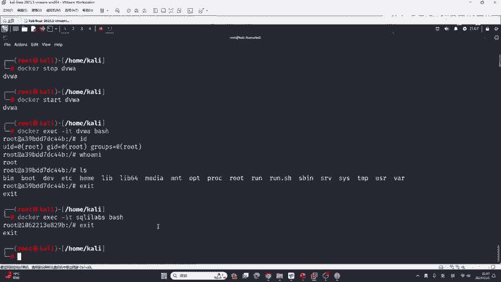

就是我们要感感谢这些啊开源的一些作者，感谢这些安全工作者就上传这些镜像。😊。

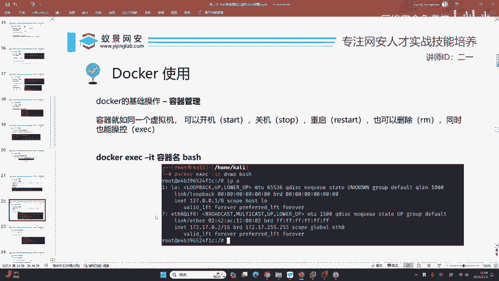

好的。