# 2024B站最值得看的黑客教程 ｜ 网络安全／渗透测试／内网渗透／漏洞挖掘／web安全／kali linux／红队靶场／CTF／信息安全 - P25：docker进阶使用 - 网络安全免费学 - BV1uBsTetEow

那下面我们来继续看docker的进阶使用。

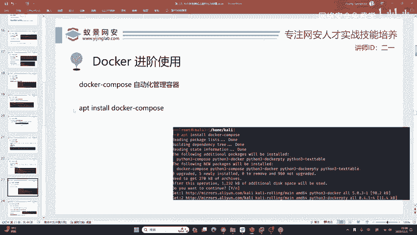

docker它有一个小小的问题，就是我们现在下载的东西啊都是单一的镜像。我们现在的开发，现在的计算机讲究什么？分布式听说过这个名词吧，就是说啊我每一个东西隔得很开，我数据库是单独一个操作系统。

我的网站是单独一个操作系统。😊，我是分开的那对于这种情况呢，我们单一的镜像就不满足分布式的这种条件。就是说啊咱们非得搞这个事情啊，非得给你分开。那这时候咋办呢？啊，就是说咱们分开的话就会有问题。

版本相不相符，不要我用一版本，你用二版本到时候不兼容就会出现网站崩溃。到时候甲方找到我一顿通骂，所以说咱们就要保证统一的协调和稳定。这时候我们光用docker本身就不够用了哈。

咱们就需要一个便捷的docker管理平台，这个平台我们把它叫做docker compose，它的使用频率非常的广泛，尤其是做网络安全的，他对网络安全的啊非常的方便。为什么呢？

就是网络安全的人他不想去学代码。😊。

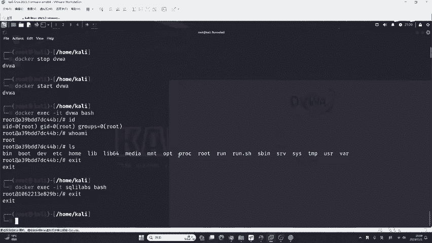

这就是一个问题，为啥不讲去学代码呢？因为学了没啥用，它提升不是特别大。你说你能学到什么程度呢？你C加加，你能学到什么程度呢？是吧？你不可能去开发大型应用吧。你自己你在学网络安全，学渗透测试的时候。

你不可能开发一些呃大型的web程序吧，这个很难有精力，也很难有时间的满足。😊，所以说咱们就是要图个方便。这时候我们就需要感谢一个安全大佬，他叫P牛。他整理出了一个常见的漏洞靶标，以及常见的开发框架。

开发组件，开发应用，开发SDK的一个合计，里面有几百个完全够我们用了。而且你可以跟着他的样子去改。那这时候呢，我们首先就是要把这些漏洞靶标的合集下载下来。这个漏洞靶标呢一共62MB。

你觉得哎几百个漏洞就62MB啊，太好了是吧？就是这样啊，doncomp很简单。那我们现在如果想使用它的话，第一件事情。😊。

我们只是安装了docker，但是你的电脑上没有安装docker compose，我们要把它安装一下。怎样去安装呢？我们这里啊还是使用咱们的IPT又是咱们的软件商店了是吧？

咱们之前安装的是docker点IO其实正常的情况下，它应该叫docker，它为什么叫docker点IO，你不要问我，如果我是IPT的包管理器，我就把它叫做docker，我不会加一个点IO感觉很奇怪是吧？

😊，这个doer compose它就没有改了，它就叫docker compose。😊，中间一个横横线按下回车还老样子啊。do you want to continue？当然是yes，再按下回车。好。

下次下载并安装好了，你可以看到非常简单，这些东西需要你会lininux吗？不需要。不需要的这些东西又不是linux指令。你在windows，你在mic克 S也是这个样子，你windows也是同。😊。

windows使用它是一模一样的指令，不不会有任何不会有任何变化。好，下面我们继续来看继续来看。在安装好dogcomp之后，我们现在要做的啊dog compose它就是一个软件。

那这个软件你得给他一点灵魂吧，你要给它就是说你到底想嗯安装什么漏洞靶标呀，你到底想安装什么应用啊，你得告诉他怎么告诉他呢？如果是我们自己告诉的话，不是说不行，而是说需要一些进阶的操作。

呃现在啊我们就把这些呃拿来用就行了啊，拿来用就行了。我们就用这个VOL hub。😊。

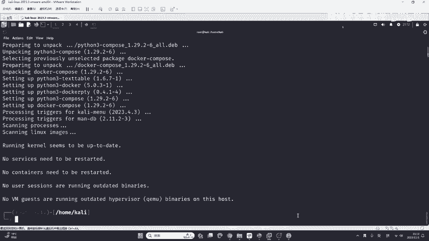

fe l hubub呢又出现一个问题，就是现在git upub这个网站应该听说过吧，大家只要是做IT的，应该都听说过git upub。而gi upub这个网站以前还能访问。现在啊你在境内正常的网络。

你是真的没有办法再打开。😊，giHub了，那现在怎么办呢？这里我又为大家提供一个方法，而这个方法呢是很多人都不知道的。gitthub加速器。😊，叫做get克隆点com这些链接有同学讲，哎。

老师你也不发出来，我在课后都会写到咱们的预习内容中，你找到咱们班主任，可以免费领取。😊，我们在这个什么网达即客社区，在这个地方呢输入想搜索的项目地址。我们想搜索的是什么？是VOL hubub。

你直接在这搜VOL hubub。😊，哎，搜索一下。搜索一下，你看第一个是不是就是咱们的VOL hub呀，这里它就会出现一个新的链接。这个链接啊就是在境内可以免科讯上网直接使用的，我们给它复制一下。😊。

但是啊由于这个加速器它是免费的，其实也不是特别快。咱们下载它依然需要一定的时间，咱们直接粘贴过来。😊。

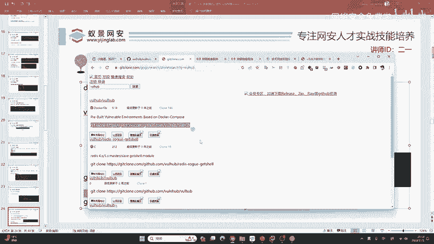

运行一下VOL hub就会被下载下来。还是老规矩啊，因为呃它是免费的加速器，说实话它不会特别快。因为它这是一个个人网站，又不是阿里云，阿里云财大气粗，它肯定可以下单很快啊。😊，如果你现在有科学上网环境。

比如说有同学讲哎，我有梯子，我可以访问谷歌，那你可以直接下载啊，你可以不用这个加速器，直接下载的话非常简单啊，就是在这个github这个地方，我们直接复制它的链接就行了。在这个地方。😊。

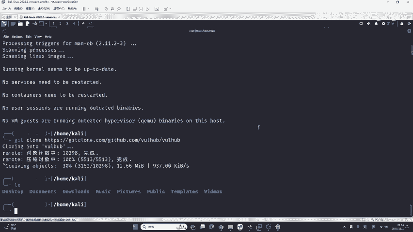

就是直接给他克隆下来，克隆就是下载。这个同学说为什么docker hub没有是吧？docker hub。

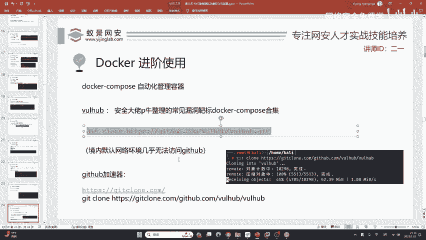

有啊，只是现在都关掉了，他现在都关掉了，知道吧？这个老师也没有办法。啊，这个不是我能决定的。好，咱们回车一下，如果你有科学上网能力的话，你就是裸联应该更快一些，它要比加速器快一些来试验一下啊。好。

感谢这个同学也发出来了。😊，等它下载一下，用get的话，其实下载速度不会特别快啊啊，这个东西因为它是单线程的，你不论是用加速器还是裸联的话，它其实都。😊，挺慢的。😔，啊，你可以照着我的直接答上去。

如果你不想照着打的话，说或者说你跟不上，我后续啊都会呃把这个。😊，把这样一个啊呃链链接发给大家啊，链接发给大家。就是在课后的时候，我会整理出来这个文档。😊，啊，大家可以去免费领取。对。

不用执执执着于这一个呃图形化界面哈，不用执着图形化界面。你这个学网络安全，其实你可以跟图形化说拜拜，你怎么滴，就是说你打别人的电脑，你还去给别人装个鼠标啊。

你还去给别人电脑上拖来拖去的那别人一看屏幕不把不把你逮住了，是吧？😊，那我们都是用命令啊，不只是咱们现在讲docker还是后续的内网渗透，还日渗透呃，全部啊全部都是咱们的命令啊。

你用图形化就计算机这个行业，不是说网络安全啊，就开发它有图形化吗？没有吧，开发网站，你在大学里面学的那什么dreamwe是吧？在那个什么那个APP上面拖来拖去就能生成个网站，你看一下，你如果会这个东西。

😊，你去找工作能找到找不到吗？别人都是干啥，都是拿着一个记事本，拿着一个idea就在那敲是吧，在那敲。😊，是的，后面才有的图形化。那现在呢咱们专业技术人员肯定要用啊这个ds命令啊，这个下载还是比较慢的。

即使你用加速器，你大概也需要。😊，这五六分钟。你也需要五六分钟。我们可以看到现在已经下载完了，下载完之后呢，我们。😊，在这个地方。就会出现一个新的文件夹啊，叫做VOL hub。那你可以去到里面去啊。

到里面去。就CD到里面CD啊啊就是change directory啊切换目录的意思嘛？其实你记英语还不如记CD呢是吧？CD更简单一些。我们进到这里面之后啊，你可以L一下L呢叫做list source。

就查看当前文件夹的资源，你可以不记英语，你就记L更简单。😊。

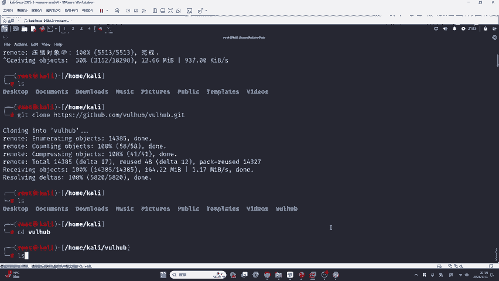

我们I看一下啊一大堆东西，这是啥玩意儿啊？如果你做过开发，或者是你对IET行业非常非常了解。😊，这里肯定有有你熟悉的老朋友。比如说我们随便举一个例子。比如说像flask。

这是pyython的一个外博框架，用法非常的多，就用的人非常非常的多。再比如说hud do，这是一个大数据专业必须要学的东西。😊，再来看jump save，这是一个开源的堡垒机。我们再来看。

java你知道吧？java你知道啊，有同学看到马蚁 circlecle了，再来看到一个再看蚂蚁cicle是吧，蚂蚁cicle还有什么？我们再来看PHP。😊，有吧，再来看spring是什么加va的框架。

对pyythonstr to加法的框架。😊，你有没有必要完全知道这是啥。说实话，2一老师也没有办法完全知道，有的东西确实是不知道，你就不需要关注他，你关注你知道的就行了。你不知道的说实话。

你也用不到是吧？你用不到，还有什么tom catt是吧？tca啊，还有wordpress等等。😊，那现在呢我们就是你想搭建什么，就用它去搭建就行了。那怎么搭建呢？大家看好，现在我们选一个东西来搭建吗？

😊，选什么呢？我这里选一个吧哈，选一个，我就按照课件上来哈，就这个叫SOLR。😊，SOLR呢在开发中用用途非常的广泛。就是说如果你是专门做开发的，你肯定知道它它是一个开源的搜索引擎。它是一个开源的搜索。

什么叫搜索，你自己开发，你要不要搜东西啊？你的网站要不要搜索呀，要吧，你自己做还是用这些组件肯定是用组件，咱们写代码就开发人员你想象中的开发，那就是从引导一去写是吧？

从第一个字母开始写实际的开发呢复制粘贴把这些融合，把这些去做修改是吧？这是真正的开发。所以说呢我们可以使用这些开源的组件，就比如说这一个开源的搜索引擎SOL2，那很可惜呢。

它是java的java最麻烦的东西，就是说我们要配置的东西太多了。借DK的版本是一。8还是1。7还是11还是现在的22选错一个版本就可能导致无法运行，第二个就是meeven的各种依赖。😊。

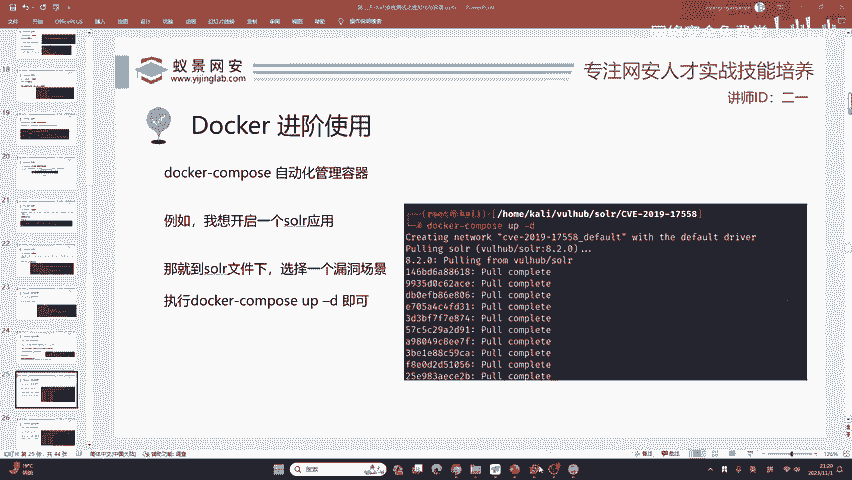

各种的版本我们都需要去考虑，都需要去进行下载，这非常的麻烦。但是现在我们有了docker，并且有了docker compose，也就VOL hub。那搭建它就非常非常简单了。我们来看好。

首先你要搭建哪一个程序，任何一个都行啊，任何一个东西，我只是用它举例，我们CE到这里面。CT到这里面之后，再去LS1下，你可以看到很多的CAE开头的这个东西。CVE是什么呢？它是一个漏洞库。

就是说在计算机中出现的各种漏洞，都会有CVE编号，那几乎是绝大部分都会有CVE编号啊，那这些CVE编号呢去代表了这样一个独特的漏洞，因为我们是做网络安全，你不是去做SOL2的开发，你是做你怎么打它。

知道吧？你要把它打掉，你要把它黑掉，不是说你怎么去呃用它，用它是开发的事，咱们我也不会用。因为我不是开发，知道吧？我只会打它。那现在我们刚学docker，你要搭建哪一个靶场呢？😊，随你选哈，咱们这么多。

你随便选一个。比如说我就选这个感觉比较新的是吧？20192019年的嘛，那我就CD到里面。😊，是吧第到这个17558。好，CD到这里面之后。我们现在只需要做一件事情就行了。它非常的简单，就docker。

😊，Compers。up降低。就这一条命令，你就可以搭建它。要记住搭建SOLR的CVE201917558是这个命令。搭建201712629是这个命令，搭建think是这个命令。

tomca是的rubyopen sSL以及其他所有的任何的开发框架也好，开发组件也好，SDK也好，数据库也好，全部都是这个命令，docker compose up杠D按下回车，它会自动的下载。

自动的搭建。我们来看它多长时间的搭建好。现在大概过了10秒钟。我们继续等待它，他的时间都浪费到了下载上面，这里是取决于大家的网速以及阿里的加速器是非常快的。好的，一分钟不要，我们就把它搭建好了。

如果你是手动搭建。呃，没有，如果你零基础的话，手动搭建它没有两个小时，你是做不下来的。而且啊这样一个东西嗯它是非常复杂的，你可能搭建不好。这时候在互动区有个同学问。

这compose的镜像源是用docker的对你的阿里云给docker配了这dockercomp啊，它会识别这个docker的加速器，它会去用它。

你可以理解为啊这dockercomp啊是一个第三方的客户端啊，能理解吧，就比如比如就比如讲啊嗯咱们这个。😊，呃，一些啊游戏平台，就比如说什么啊什么掌上英雄联盟啊，或者是一些小黑盒啊。

在上面我们可以看到自己的什么战绩啊，自己的历史记录啊，就很方便啊，但是啊它的账号还是咱们的docker，还是咱们的英雄联盟，还是咱们的游戏账号，就同样的道理啊，它只是一个第三方的客户端，你可以这样理解。

所以说呢你为docker配置了加速器，咱们的dockercomp啊，它是可以自动识别的。😊，好的，现在我们来看已经搭建好了呀，搭建好了。这时候就有同学问，哎，我要访问哪一个端口呢？

还记不记得咱们在以前安装的时候经常运行的dockerPS杠A。dockerPS杠A你就可以看得到了。比如说DVWI记得吧DVWI是什么端口是2万端口，se框 levelss是2001端口。

那这里的SOLR是多少端口？8983，有同学说为啥是8983，这是屁牛啊，帮你设置的。如果你想改可以。如果你觉得改了比较麻烦，就比如说我我觉得我就觉得这个呃多一事不如少一事，那我就不改。

我就用默认的就OK了。反8983也没有拿一个程序会占用这个端口，我就用8983，这个2万和2001是我们刚刚自己手动搭建的是么，首动搭建的DVWI以及s levels。那这里他默认是8983。

我就访问一下8983来看一看。😊，打开火狐浏浏览器，把这个2万改成8983。按下回车。你可以看到就可以正常访问和正常使用了。非常的简单啊非常的简单。😊，是不是就可以了？

现在你就已经掌握了docker compose了。掌握了docker compose之后，你应该如何去把它关闭呢？就有同学说哈，我现在不想用它了，我想把它关掉。😊。

我怕他占着我的内存啊呃导致我的这个内存啊跟金子一样，我不想让他站着，其实他占不了头上内存啊。😊，我这个2GB它占不满的，就是你这三个容器，你1个GB也都占不满。那这时候怎么办呢？我们可以把它关掉啊。

就是在这个地方，刚刚你不是dooc compose up杠D吗？我这里是docker compose。😊，downdown是什么意思？下降关闭的意思不是stop啊，他为啥不叫stop，你不要问我。

我如果是他的话，我就叫stop了。那他已经设计好了，那咱们就用就完事了。是吧荡一下啊，关闭了。关闭之后，哎，咱们再去访问一下。看一下就没了吧。OK这咱们。这一个docker compose你就学会了。

下面再举例哈。那有同学说。😊，不服气，我还想再搭建一个。那我们来看。还搭建啥玩意儿呢？我们再选一个东西搭建好不好？再选一个东西搭建。😊，就比如说像tom cat。他们看如果有学java开发的同学。

也很清楚啊。就是说有同学觉得哎老师讲的tom cat搭建非常费劲，他是双击就OK了。我为啥一双击就报错？😊，那有可能就是说你对tom cat的配置不了解。

而使用docker以及我们现在讲的docker compose，你就不需要了解它，直接搭建起来就行了。tomcat比如说随便选一个就8版本呗，tomcat8随便选一个。

然后在这里无脑的去用docker compose up杠D，不是无脑，是因为你已经学会了，我们等待看多长时间搭建好。我会把用到的所有命令都放到咱们的预习内容中啊，你是可以免费去看的。好。

一分钟不要搭建好了，搭建好之后，它是多少端口呢？刀ckerPS杠A看一下啊，8080端口，咱们到浏览器中在这个地方输入8080。好回去了。

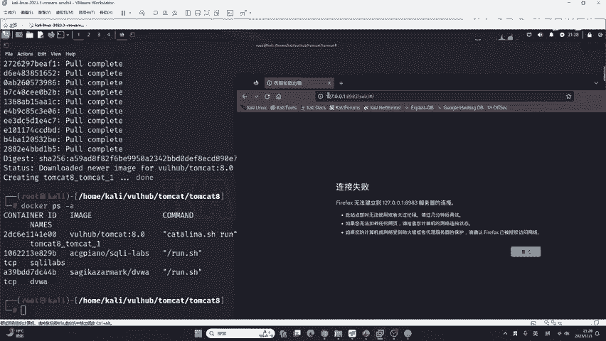

他们开始搭建完成。你要解释什么，哪里不懂，同学们哪里不懂。我解释的很清楚啊。😊，up杠D还要解释吗？就是开启D的话是放在后台。😊。

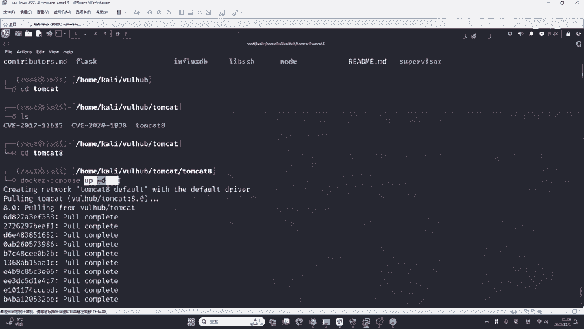

哪里需要解释，我都可以去讲。可以提出你的问题，就哪里原理不懂，或者是哪里需要更深入的解释。都可以给大家做详解。啊，哪里不懂啊，同学就阿福同学。啊，如果up嗯怎么了？啊，可以，每一个命令我都给你注释。

好吧，大家的需求你可以去提好吧，嗯，我所有的命令，每一条命令都给你写一个注释，就给你写个解释，好吧，up普同学。😊，可以直给你啊。有这样东西。up之后，如果dogtop一部分容器再荡可以正常吗？

这个down的话是down当前的容器啊，比如说我这里是doocktm cat8，如果你荡的话，你看看好啊。😊，我这不是开了三个容器吗？就是开了三个系统啊，DVWS跨 levelss跟tomca800。

现在如果我在这里直接荡啊，直接荡，你看它只会少掉一个啊，就少掉这个tomca8，来看一下。😊，是不是就少了一个，他们两个是没有掉的，他们两个如果掉怎么办？看好啊，dockerRM就是remove杠F。

就是强制删除。比如说我现在想把这个DVW删掉，怎么删，你应该已经猜到了。DVWN回撤一下，删掉了，你再来看。😊，没了吧，如果想把这个cicle r levels删掉怎么办？

cicle R杠Fcicle R levels回车。😊，好，啥都没了。啊，就全部删掉了。是吧可以看到还是比较方便的是吧？还是比较方便的那如果你自己手动搭建的话，你把这些服务终止不是说删除它了。

你就是终止它都花几分钟的时间吧。😊，是吧都需要花几分钟的时间啊，所以说docker非常非常的方便。而我们这里使用docker到底是要做什么呢？😊。

就是说我们的VOL hubub它的作用是提供了漏送的靶标，就漏洞的靶场。可以啊，不会，就是一次可以启用多个容器。啊，但是呢呃它就是说呃一般情况下只会有一个容器啊，它可以启动多个容器，它是有这个功能的。

但是咱们这里目前演示的都是只启动了一个容器啊，这个东西你就不用关心了啊，的屁牛都给你整理好了。这个屁牛它整理的啊叫做漏洞靶标。就是说我们在上战场之前啊，你需要在靶场里面反复的练习，你的枪械。

你反反复练习你的这个开枪的准确性，你在遇到真实的网站，包括真实的渗透测试，你才能够精准激发，去打烂别人的网站，打坏别人的系统，拿到相应的权限。😊。

那我们今天呢只是给大家介绍了docker compose应该如何去搭建漏洞靶镖。那像这些常见的漏洞，我们应该如何去渗透呢？就比如说我们这里讲到的tomcat里面有3个漏洞。

亦或者是我们刚刚演示的SOLR。

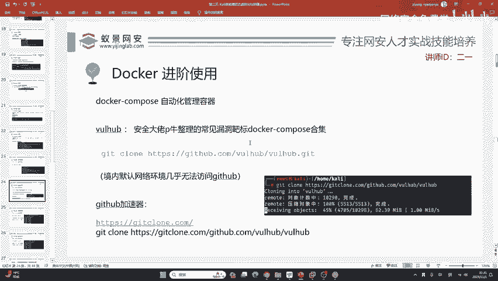

而SOLR呢，它里面有5个漏洞，那这些漏洞应该如何的去复现它的原理是什么？我们怎样采用最合适的方法去利用它去攻击它？

