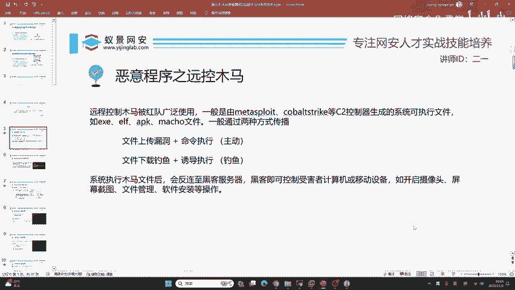
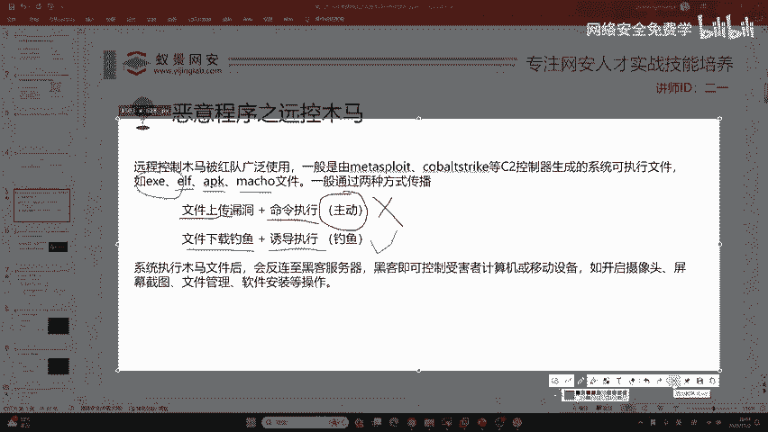
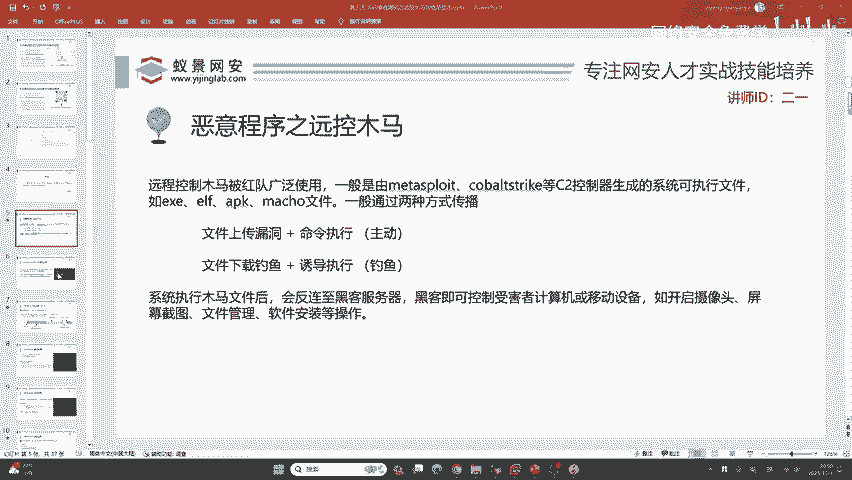

# 2024B站最值得看的黑客教程 ｜ 网络安全／渗透测试／内网渗透／漏洞挖掘／web安全／kali linux／红队靶场／CTF／信息安全 - P26：恶意程序之远控木马 - 网络安全免费学 - BV1uBsTetEow

那今天呢我们会讲解这样一个远控木马，这声音是很大的呀，大家可以看一下。如果你觉得声音小，我现在把麦克风调大了一些啊，大家最简单的方法就是你把你自己的设备声音调大，我觉得现在声音应该不小吧，大家。😊，好。

那首先呢我们在学习之前呢，首先要了解就是什么是远控木马。好，大家呢可能听说过一些勒索病毒或者是一些破坏性的病毒。那这些病毒程序呢在我们渗透测试、攻防演练的工作中都不会涉及，大家可以放心。

因为我们要做的是控制你，而不是破坏你。那就需要我们今天所讲的远程控制木马，它是被红队，也就是攻击方经常使用的这种木马病毒。就比如说哈一些政府支持的IPT组织。

比如说像漂亮国长期对我国西北工业大学来进行一个渗透。其实他使用的也是远程控制，加上数据窃取，它不可能去破坏你，因为破坏你，你就被发现了，你就可以轻松的发现，哎我自己的电脑被破坏了。

或者是我的计算机中毒了，就可以轻而易举的发现。那所以说呢我们必须要远程控制。那远程控制木马呢一般都是由像这类叫做C2控制器软件去生成的系统可执行文件。那关于系统可执行文件啊，这里要给大家一个小小的科普。

有同学啊他只知道EX1EX一很多同学都知道啊，它是windows的可执行程序。也就是说在windows操作系统上面，大家只需要双击就能运行起来。

那除了EXE之外，我们在实际渗透测试，包括去攻击网站也好，你见到的操作系统可不只有windows啊。比如说像linux，那linux的可执行文件啊，它叫做ELF文件，这些是属于计算机基础。

如果你不知道的话，那在后续去生成木马，它是非常麻烦的。包括大家就是说你必须要知道这些计算机的基础，这是linux的可执行程序。还有一类叫做APPKIPK啊大家接触的比较多，它是安卓操作系统的软件安装包。

要记住哈，它不是软件，而是软件的安装包。下面一个最后一个叫做macHO，它是macOS，也就是苹果电脑的这个执行文件。我们去生成系统后门木马，其实啊就是去生成EXE。ELFIPK以及macHO。好。

这里啊看一下大家的提问。首先啊有同学说到MSI也是windows可执行文件吧，是不对的啊。MSI呢它是windows的安装包，啊不是可执行文件，它叫做microsoft的inster微软安装包DMG。

它是micalS的安装包啊，它也不是正常的可执行文件。😊，不过，像MSI以及DMG这些安装包文件，也可以去构造成咱们的远控木马。今天的课程也会有设计，大家可以耐心等待，我们一步一步来讲。

那我们在学会了这四种木马的文件之后，我们要去想。在实际的工作中，我们的木马到底要怎样传输给受害者？现在有两种方式可以做到，一种就是目标的操作系统或者是目标的网站上面，存在漏洞。例如说像文件上传漏洞。

加上命令执行漏洞，去综合利用。我们去把这样一个木马病毒上传到别人的机械上面，然后我们去给它主动运行。但是这种场景在实际的工作中，就是现在已经2023年了，它的用处越来越少了，为什么呢？就是很多的网站。

它是非常非常安全的。亦或者是有的电脑压根就没有网站，就比如说老师现在在用的windows11，它一没有漏洞，2没有网站。那你又如何去从中找到文件上传漏洞呢。其次我还是在局域网中。

你是不可能通过这种方式去打到我的那下面这第二种方式就来派上用场了，就叫做钓鱼。我们去构造钓鱼文件、钓鱼邮件、钓鱼网站或者是钓鱼二维码、钓鱼应用程序，等等这种方式，诱导受害者被动下载我们的钓鱼文件。

然后我们通过一些花言巧语，或者是通过一些技术手段，例如说像社会工程学来去诱导受害者执行，这叫钓鱼。这种方式是可以绕过防火墙，也就是局域网的限制。同时呢也是非常。高效的一种利用手法。

我们现在如果你实际在一线去做这样一个红队，也就是做攻击方的话，那这一个这一种的比例是日益渐增的。就是说以后啊肯定都是钓鱼。那在系统执行我们的木马文件之后，这个木马文件就会返链至黑客服务器。

黑客即可控制受害者的计算机或者是移动设备。比如说开启摄像头、屏幕截图、文件管理、软件安装等等操作。只要你权限足够，几乎所有的功能都能够去在远控后门木马的层面去展开去控制。而且如果你隐藏的够好。

钓鱼成功的比例是会大大增加的。我们今天就来逐步的来看。

首先我们先不会接触到免杀或者是钓鱼。我们先来看就最基础的木马应该如何生。

