# 2024B站最值得看的黑客教程 ｜ 网络安全／渗透测试／内网渗透／漏洞挖掘／web安全／kali linux／红队靶场／CTF／信息安全 - P27：msfvenom生成后门木马 - 网络安全免费学 - BV1uBsTetEow

这时候就要用到我们卡利中自带的一款软件。很多同学应该听说过叫做meta sport。Mta是一款开源的漏洞利用和测试工具，集成了各种平台上常见的溢出漏洞以及流行的 code。

我们几乎所有的啊几乎所有的这样一个C2都是基于MSF去改的。比如说大家可能听说过的以及各种模改版的，其实都是基于MSF因为它开源免费。如果反连制黑客服务器就如同互动区同学讲的一样，会被溯源。

那你就需要掌握反溯源的技术啊，就需要通过一些流量隐藏流量的特征，多重代理前置CDN等方式去达到一个反溯源的效果。那这不是你一分钟或一个小时亦或者是一个星期就学会的啊，咱们需要有一个学习的步骤。

不能一步登天。一步登天的渗透测试方法啊啊，比如说有一些。渗透测试工具非常好看又非常好用。那这些工具都去哪儿了呢？都去了好莱坞的大片里面，在真实我们工作中，任何的东西都是非常困难的。脚本小子。

你是一定不行。😊，你小分小子的话，不论工作还是互网啊，都不太行。所以说我们第一你要不要会用脚本，肯定要会。第二，要不要懂原理，要不要会改脚本，要不要会写脚本，肯定要。

那你这不是说一开始就会你得慢慢来是吧？谁一开始不是先用脚本呢？你只要用好脚本，你就能够进上市企业了。但是进上市企业不是你的终点，咱们要活到老学到老。😊。

那现在我们首先就来看我们如何使用matetapoate去生成后门木马。那有同学说，我可以用永恒之战漏洞MS17010去达到目的。这是很多人在讲matetapoate包括2一老师在34年前也会去给大家讲。

😊，那永恒之蓝漏洞呢是2017年发生在windows7操作系统上面的漏洞。那现在你在工作中，你还会见到win7吗？不会捡到。所以说呢我们不会去讲永恒之南。首先我们先来看一下咱们的执行程序后门的方法。

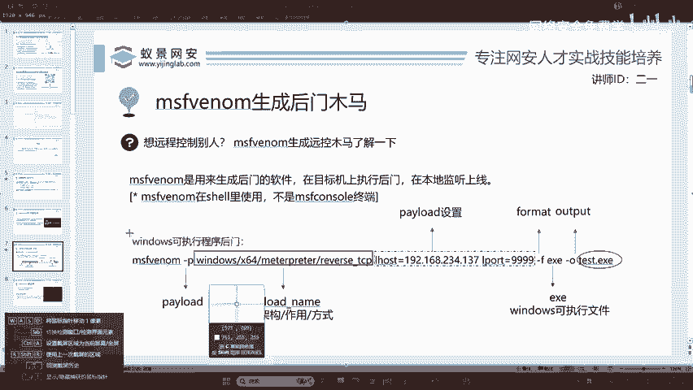

这个方法呢是可以进行举一反三的，你必须要会举一反三。为什么你不可能所有的操作系统都会吧？是吧。好的，我们来看这个地方。首先MSF venom它是这一个工具啊，它是这一款工具的名称。

这里面呢需要几个选项和参数，我们必须要了解清楚。第一个叫做piload译为攻击载盒。攻击载合就是指在木马程序中作为核心的部分。其中呢这个piload的写法是分为四个部分。

分别是操作系统版本windows位数叉64，作用获取medap方式返连TCP。这时候我们在学会这个之后啊，你就可以进行举一反三。比如说我们可以将windows换成linux。

换成android去生成针对于linux操作系统的ELF文件以及android操作系统的IPK安装包。下面再来看这里呢我们需要设置两个拍lo的必须需要的选项。那这里的选项呢。

首先第一个就是咱们的IP地址。这个IEP地址呢很多同学就不太清楚啊，他会搞混。你要记住这个IP地址，它是公网的地址。因为我们现在在演示，我在教你用卡里。

所以说呢卡里是不具备公网IP的那这里写的就是卡里的IP，也就是攻击者的IP。有同学可能会问啊，为什么这里会出现攻击者的IP呢？为什么不会出现？受害者的IP我们来想象一下，你现在去钓鱼。

我们站在一个电信诈骗的角度。你想一下，诈骗分子需要知道受害者的IP地址是多少吗？不需要知道吧啊，他是不需要知道别人的IP是多少，我管你受害者的IP是多少，反正你上钩了就OK。

所以说呢我们在这个攻击的全过程都不会接触到受害者的IP地址。我们所讲的全部是攻击者的IP好，大家一定要清楚。😊，下面一个叫做airport。airport呢是指监听端口。

监听端口呢就是从0到65535随便选一个就行了。好，咱们比如说我在我在课件上选了4个9。继续来看下面一个是这样一个formmar，就是格式。在格式这个地方啊。

我们要选择是EXE还是我们之前讲的ELF还是我们讲的IPK以及有同学提到的MSI和麦克的DMG安装包。不过很可惜啊，DMG在matta中是不支持的那我们就没有办法去生成它了。对，就像阿豹同学讲的一样。

瓜子广撒网，我们是不需要知道受害者的IP是多少的，是吧？他I是多少就是多少无所谓。😊，最后一个叫做杠O啊，它是output。呃，这个同学哪里听不懂呢？是这些英语单词看不懂吗？其实很简单啊。

我可以给你翻译。好的，这个output，然后test点EX1。呃，这个当然官网可以学习啊，matetath不仅有官网，而且它的官网呢它还配套了有youtube的视频。呃，但是就是前提条件啊。第一。

你要能够看懂英语，第二，你要能够科学上网，不然的话。你点不开，同时呢呃你也看不懂是吧？点开了也看不懂啊，所以说我就是提供一个更加贴切的教程帮助大家去学习。现在我们来执行一下在课件上面的命令。

现在登录到咖里打开终端，我们将终端放大。😊。

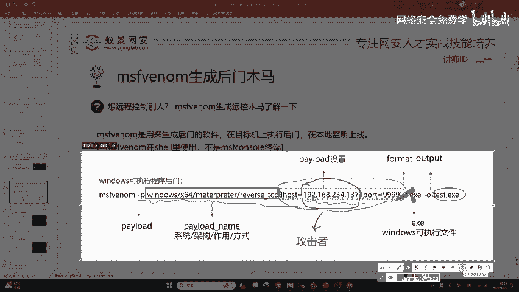

把它放大一些。放大一些之后呢。好，我们首先呢要切换到root用户。那有同学说啊，我不切换到root用户能不能运行啊？可以啊，但是呢他会呃造成一定的影响，我们尽量切换到root用户去运行。

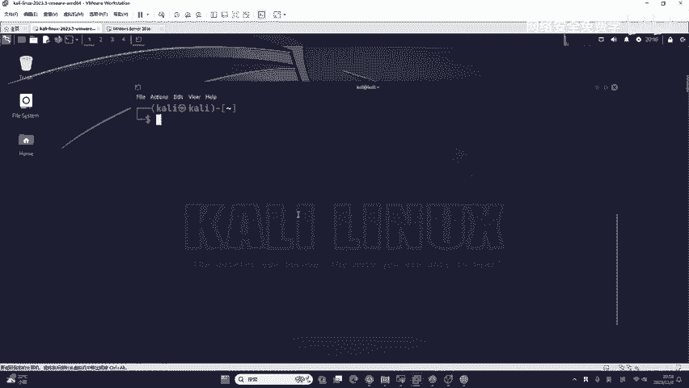

我们同学啊在这个互动区提出了一个问题啊，他告诉我啊，这个reverse tCP是木马的类型吗？不是啊木马的类型类型格式的英语叫做formmar是EXE代表windows的可执行文件。

reverse是指反向的意思。TCP是指一个数据链路层的协议啊，传输层的协议。所以说呢我们这里就是反连TCP就是反弹反向TCP的一种方式。它是网络连接的一种方式啊。你如果不理解的话。

你可以照着敲你敲多了，书读百遍，其一自线啊，没关系的。首先我们先切换到root用户。

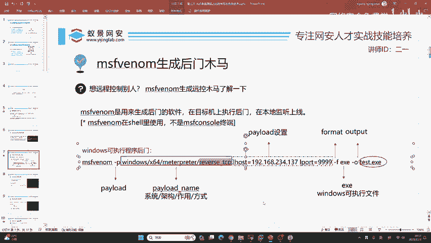

切换到root用户之后呢，我们来执行一下在课件上面的命令。同样这些命令我在下课之后都会去写到咱们的预习文档中。大家如果记不住的话，没有必要记它啊，你记它不是说给你掌薪，不是说哎二一老师。

我现在会背以后工资啊就给我涨2000块钱，绝对没有这回事啊。大家只需要复制粘贴，你能运行起来就OK了，会做就行。那在这里呢我们接触到了iho，首先你需要看一下卡里的IP地址。

因为我的卡里呢是使用了nott模式和桥接模式双模式。所以说在这里我需要选择任意1个IEP地址啊都是可以的。比如说我这里选择192。168。80。128，我们放在这里，然后airport是可以随便写的。

比如说我写1万端口0到65535啊，都可以。下面是格式formmar eX1输出，比如说我输出成test点EX1wind的可执行程序，大家呢是不需要记这条命令的。

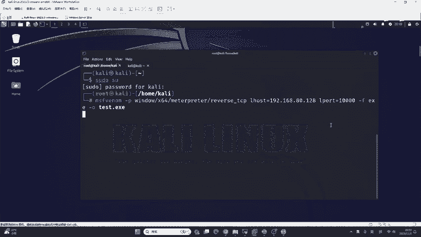

这里写错了一个就是windows啊，打错了。因为我边打边讲的话，容易这个就是这个话哈跟不上这个手，所以说就可能会出现打错。为什么我能记住呢？是因为二一老师天天都在讲课是吧？

如果你以后有机会成为一个网络安全的人才培养，去给一些客户，给公安，给党政机关，给985的大学授课的话，你也应该记住他。如果你现在说你不想当老师说实话，理解他就行。不需要记。好。

我们这里啊test点EX1就已经生成好了。生成好之后，我们现在就要想啊，我们要做几件事情。第一件事情就是这个EXE怎样传输到目标机器。这时候就需要用到钓鱼和免杀技术。但是呢我们在将钓鱼和面杀之前。

我们先来看一看啊，咱们应该如何去使用这样一个木马，我就先不钓啊，我先当一个姜太公愿者上钩。然后面啊我再将当一个专门的钓鱼高手啊，咱们一步一步来啊。首先呢我们来看应该如何去使用它但使用它之前。

咱们的卡里啊要做一件小小的动静。就比如说我们在钓鱼之前都会将鱼饵或者是类似蚯蚓一类一类的昆虫啊，去绑定在咱们的鱼钩上面来保证啊这个鱼饵。😊，能够上钩，能够咬钩。

那这里呢我们同样也要去做一个鱼饵的一个绑定。那应该怎样去做呢？这时候我们就需要用到matpir中的第二个命令叫做MSF console consolel的意思呢叫做命令行。

比如说大家接触到的linux操作系统以及交换机路由器等网络设备，它也都有命令行接口，我们只需要输入它就能打开了。大家来看好，我在卡ly里面输入MSF。

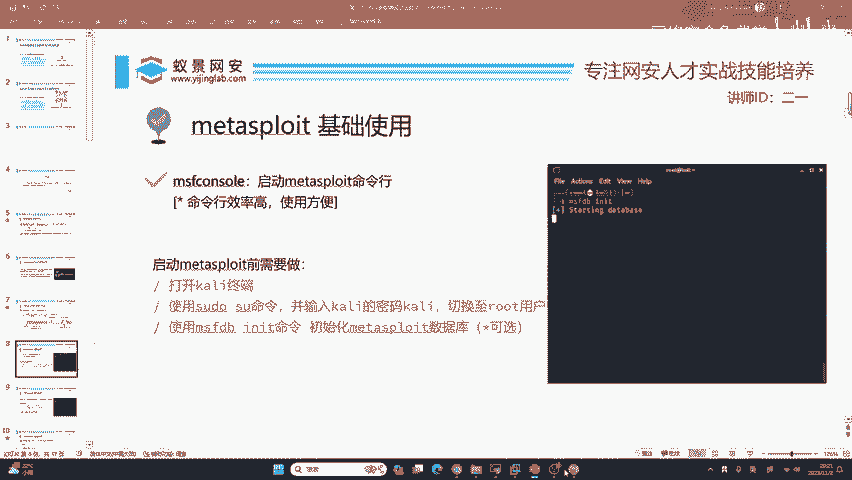

怎样看IEP地址是吧？你看REPIDDRIP的dress。😊，缩写是吧，就是英语就看到了，这不是IP地址吗？I net。😊，好，现在我输入MSF console之后啊。

稍等片刻就可以打开MSF可以看到它有一个呃小牛的标识，并且这边呢有MSF的版本，还是推荐大家使用最新版的卡里啊。因为MSF会多很多功能。如果你使用的是老版本的那可能就会缺失一些东西。

要造成一些使用的不便利。好的，我们在打开之后啊，你可以看到咱们的命令是来到了MSF6里面。现在咱们要做一个标准的操作。我之前讲过啊，在钓鱼之前，咱们一定要给鱼钩放上鱼饵。😊，好，怎么放呢？

我们要去使用一个固定的模块，这些模块我敲的所有命令啊，今天上课敲的所有命令，我在下课之后都会放到咱们的预习内容中，并且每一个命令我都会有一个注释，大家可以放心，你完全不用记哈，记它没有用啊，没有用。

你会用就行了。这个意思呢是1三个单词，分别代表攻击exloitmti多个的杂项的handle了处理程序，负载程序剧本剧本的意思。好的，我们回车一下回车一下之后呢。

我们就进入到了这样一个叫做mhandler的这样一个模块。这个池幕同学问到，手机可以运行卡里吗？如果你是一加手机，当然是老版本的一加啊，现在的一家已经使用oppo的卡lo s了。

它已经不支持运行卡里以及谷歌的pixo是可以运行卡里的，但是没有必要，因为卡里的手机版是严重的阉割，它基本上绝大部分功能啊都没有，就包括咱们今天讲课的，它都不能够使用啊，都不能用的。😊。

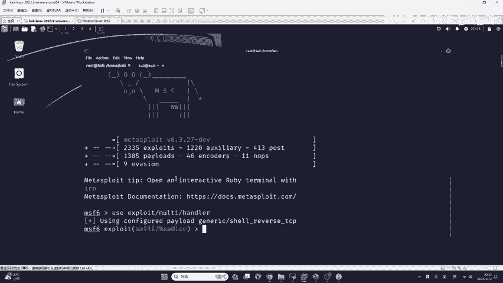

所以说没必要啊没必要，咱们用虚拟机就行了。😊，现在呢我们来进入到这样一个模块之后啊，咱们来回顾一下刚刚的知识。在刚刚我们生成后门木马的时候，我们指定了几个东西啊，一个叫做tilo这一长溜啊一长溜。

然后呢，一个是Lho，是咱们卡里的地址，一个是端口，咱们随便写的。好，我们现在对于鱼钩，你也要设置完全一样的。比如说第一个set拍load。我们需要跟刚刚生成后门的时候保持一模一一模一样。

我们可以把它右键copy。然后在这里点击pass的粘贴，把它粘贴过来，按一下回车。下面一步你应该猜到了，就是Iho也要和上面保持完全一致。咱们同样的可以把它复制过来。然后粘贴到这里。再继续。

你应该猜到了就是airport1万。你上面写多少，下面就写多少，不要你上面写1万，下面写2万，这样的话就是固头不固定啊，就不一样了。好，咱们现在把它运行起来，运行的命令就是run运行的英语。

这里大家应该都能看懂。好，我们运行之后啊，你会发现卡里卡在了这里，这是正常的。因为他现在啊开启了监听，开启了负载程序。也就如同啊咱们把蚯蚓放在了鱼钩上面之后，咱们将鱼钩丢到了水里，丢到水里之后。

你是不是要等它呀，是不是要等它呀？😊，好的，我们来看这位同学提的，首先就是咱们现在把鱼钩放到水里了，等着鱼儿上钩啊，等着鱼儿上钩。这个同学提到了MSF是可以check一下，有必要的时候。

它会提示是否是必选项，你想的非常对，说明你对MSF很有了解。但是现在的MSF版本是6，在6版本啊，它的公司官网已经提出了check命令已经过时不推荐大家使用有可能在下一个版本的mattapir就会完全移除check功能。

所以说呢大家就可以不用了啊，但是你用也没关系啊，咱们这个6版本还是有check的，没关系的。😊，好，现在我们来看我已经把鱼钩啊放进了水面，那鱼儿怎么上钩呢？哎，我现在啊就充当一个姜姜太公啊。

就是说啊这些我在下课之后都会保存下来，你跟不上的话，没关系，你没有必要跟着我瞧啊，你是跟不上的，就除非你之前用过，否则你是跟不上的。check就是检测的意思。😊。

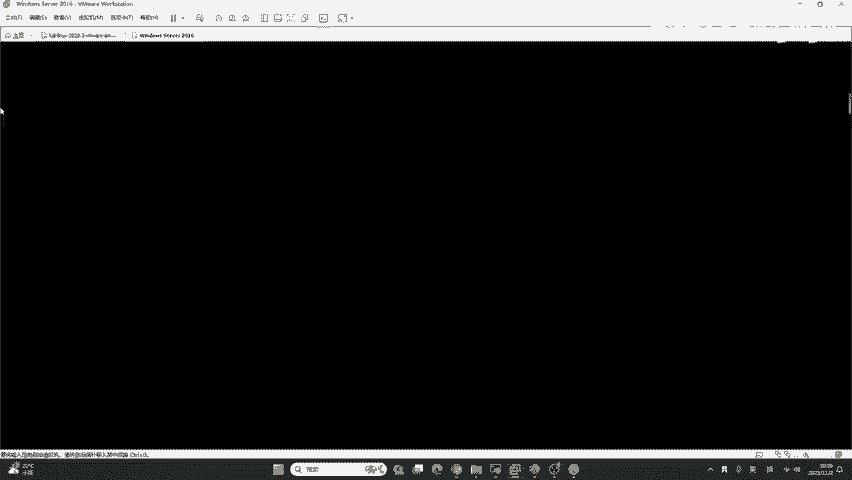

顾名思义啊，把它翻译过来就行了。好，我们现在呢如果我充当一个姜太公，那他会有什么样的影响呢？首先我们刚刚生成的叫做test点EX1。我们应该如何把它拉取下来。

我们就要用到在第一节课中所讲的文件资源管理器，点击这里点击open flo，打开咱们的文件夹，打开之后你就可以看到test点EX1了。那咱们怎样传输到目标的机器呢？这里有一个简单的方法。

就是给大家讲一下啊，就是说叫做开启监听右导下载。

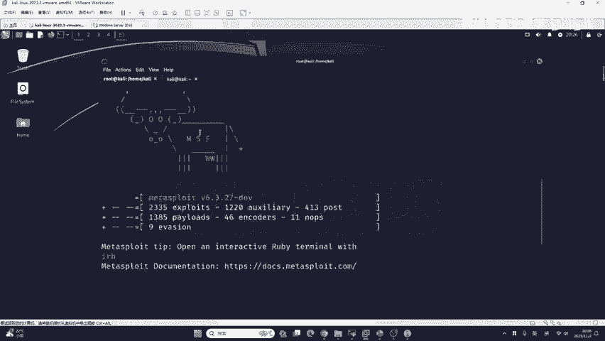

来看我操作。现在我们要重新打开一个终端，为什么要重新打开一个终端呢？因为我这里卡住了是吧？它卡在这儿了，你不要把它叉掉了呀。就比如说鱼儿还没上钩，你又把鱼钩呃滴溜起来了，那能行吗？肯定不行。😊，好。

咱们要先打开一个终端，先打开一个终端之后，同样的切换到root用户。然后我们切换到root用户之后，你会发现ts点EXE就在本地啊，就在本地就在当前的目录中，然后我们执行一下这条指令。

这条指令呢是以后大家工作中使用最为频繁。你几乎每天都会用你如果在起安现在暗恒的话，叫做python快速开启网站监听，它的命令是python3杠MHTTP点s加加上端口。比如说这里的端口呢。

我指定为8080回车我们就可以在当前的目录开启8080端口的网站监听。这时候请大家注意。这条命令我在课后也是会保存下来，你没有必要跟着我敲。在执行了这条命令之后。

那如果黑客想把这个文件传输到咱们的受害者机器上面，就非常简单了。来，大家看我操作，现在我们先记住卡利的IP地址是192。168。80。128。然后呢，我们回到这一台受害者机器。这一台受害者机器呢。

我使用的是windows seven2016，它是和win10一模一样的。大家如果和自己电脑是win10的话，可以用自己电脑尝试。我会告诉你他的弊端会给你演示它是如何被杀毒软件杀掉的。

这样的话我们好做棉杀，好做更进一步的钓鱼。比如说现在我去访问192。点168点80。128，这个地址呢是我卡里的地址。然后我就访问他的8080端口下面的test点EXE，大家看好。你只要去访问他。

按下回车。你可以看到我们的浏览器就会自动下载刚刚生成的homertest点EXE。那大家觉得。你的这个链接受害者会点击吗？很可能不会，为什么呢？因为你做的实在是太简陋了，别人不可能上钩，但是啊也不一定。

就比如说大家在新闻上看到的，我是秦始皇，给我打50万都有人上钩。😊，因为有的人真的是太容易上当了，但是咱们不能止步于此，这是的真的是太low了。好，我们现在下载下来之后啊，它是1个EX1。

你看一下它叫tt点EX1，没有图标，你在运行之后没有任何反应，你觉得会不会引起受害者的怀疑，或者是受害者压根就不会运行它，这是肯定的。因为我现在就是姜太公上鱼，呃，姜太公将姜太公钓鱼，愿者上钩。

那如果我现在就是一个非常笨的鱼饵，我去上钩一下给大家看一下，然后我们在进行包装和钓鱼？😊，好，运行一下。在运行之后，我们回到卡里，回到我们刚刚开启监听的地方，你可以看到它出现了新的提示信息。

告诉你mattterpre session一op，就告诉你啊，咱们有一个绘画被打开了。并且呢咱们的这个样式也变成了mattterpre，你不要急啊，咱们现在是姜太公状态，后面咱们课程肯定一步一步讲啊。

😊，你首先怎样学会免杀，你知道不怎样学免杀，就是你要先学会能够杀的这样一个文件。你要学会能够杀的这样一个文件。如果你就是说不会杀，直接去秒杀的话，这没法做是吧？

咱们根本就没有一个呃这样一个文件去帮助我们去做免杀，这肯定是一步一步来的。这个虚拟机里面是有防火墙的呀，有windows defender，不过它是2016的版本。现在我用的MSF是6。3。

27默认生成的，它是不会被杀掉的。也就是告诉你，有的同学还在用win7。如果你用win7或WwinN8的话，你的系统已经是千疮百孔了啊，懂吧？他们的杀毒软件，尤其是winIN7。

win7现在已经停止维护了。你如果就是win7再出现漏洞，对不起，微软也不会再给你修了啊，所以说就是讲尤其是企业啊，你在用win7，那真的是被打成筛子，活该只能说啊，没办法。😊。

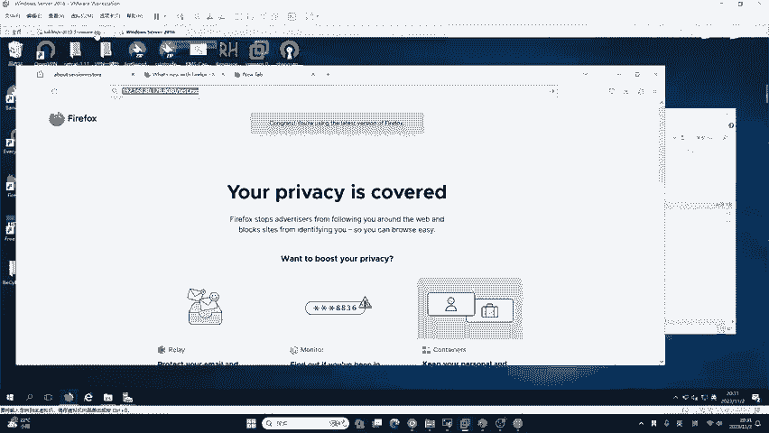

那我们在打开这个mat print之后，能够做什么事情呢？这里来给大家看一下。😊，首先我们mate，你就是控制了目标的机器。比如说我这里控制了一台windows72016。

我们可以在这里按问号就可以出现很多很多的控制指令。这些控制指令啊，它每一个在后面都有详细的description，都有description。啊，这个同学来大家看一下这样一个。在互动区同学提到的问题。

卡里生成的IPK木马版本太低了，手机运行不了怎么办？现在咱们手机都是安卓13，而且国内都是基于一些厂商自己做的一些操作系统。如果你单纯使用matta生成的IPK，首先它不支持安卓13。安卓十它都不支持。

这怎么办呢？你就要学习其他的C2软件，学习专门的安卓的这种呃后门的制作，也就是讲咱们这里只是一个前菜，知道吧？啊，咱们后面涉及的多着呢，就光EXE的木马，你一辈子都学不完，你每一年做的比一年高级。

安卓也是你一年做的比一年高级。😊，啊，这就需要你慢慢来。好，这个description呢是描述信息，它就是告诉你前面的命令是做什么事情的。比如说我们简单看一下web cap snap什么意思。😊。

获取一个快照，在目标的摄像头中就是拍照啊，中文意思就是拍照。还，可以给他拍照，可以给他录像。可以给他屏幕截图，比如说这里啊叫做screen shot。😊，是拦截一个截图，在目标的交互式桌面。

也就是屏幕截图的意思啊，换成中文。我们可以运行一下，看一下啊，比如说在这里我们运行screen shot。运行之后啊，它会截出1个JPEG的图像文件，它保存到了哪里啊？保存到了home卡里。

这个图像怎么去看，还是用到刚刚给大家讲的资源管理器。

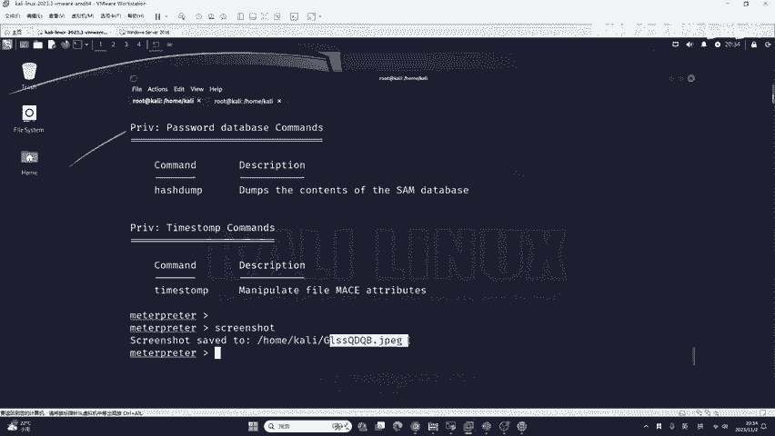

我们到这个地方。你可以看到这个接PPG就在这了。

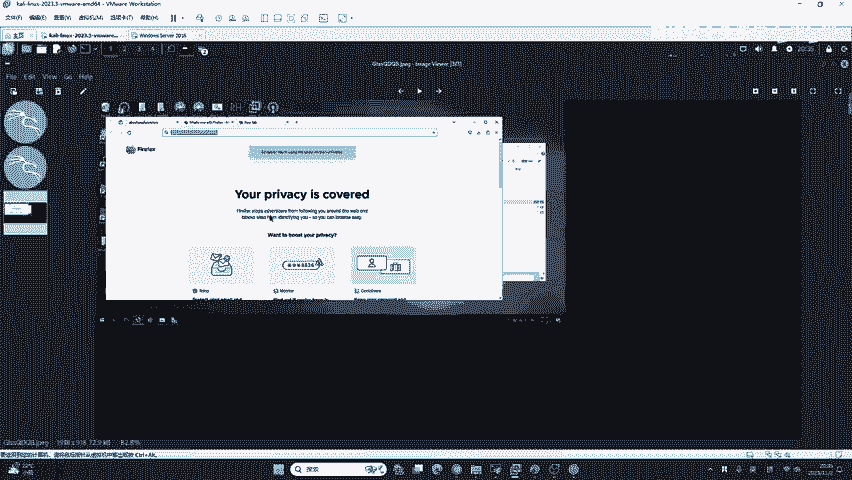

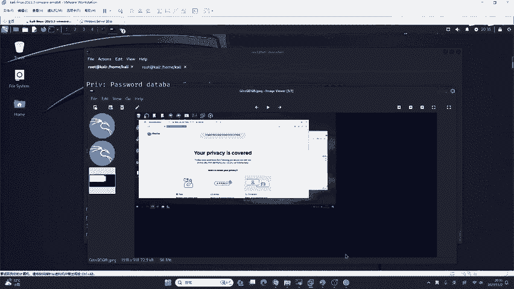

是的吧。😔，所有的命列啊都不用记，都是熟能生巧的啊，都熟能生巧的。你不要记记了没啥用。就比如说这个截图，这个截图这个功能在实际的渗透测试中能不能用。大家觉得有有没有什么用法。

我相信啊有部分同学看到了网上出现的一些小道消息，就是说啊公司可以监控我们的微信，他可以知道我们的微信跟谁聊天？那它是如何监控的呢？其实有一个最简单的监控微信的方法。

也是咱们红队去打受害者最经常用的一个方法，就是评估截图。那有同学讲老师我电脑没有微信。😊，你没有你想象一下你们公司的前台，你们公司的财务，你们公司的销售，他们的电脑桌面是不是一直在微信聊天呀？

我们通过屏幕截图。就可以获取到他的微信账号，就是最简单的方法。大家不要想的这么高端啊，有的东西就是综合利用交叉学科，这就是你的黑客思维。他每一个命令都会产生不同的效果。你可能就是讲。😊。

你可能就是讲啊交给咱们手里，你可能就是主一的运行，看他有什么结果。那你招交到一个高级的黑客手里，那他就是。😊，每一种命令都能玩出不一样的花样。好，那这些命令怎么办？大家可以自行尝试，我就不一一演示了。

因为我们今天是给你讲怎么个钓鱼，大家都等着免杀和钓鱼呢，你这个玩意儿都会是吧？比如说我现在给你一一运行运行一下，你该讲你二姨老师又浪费时间是吧？这谁不会运行呢，复制粘贴都行是吧？那我就不给你运行了哈。

我就不给你运行了，咱们来看现在我们的问题，第一，就是说你这弄的太假了，做的太假了，别人不上钩。第二个问题，你看我现在是在虚拟系中如果是在真实机器呢？我这里是windows11操作系统。

我安装了杀的软件叫火容。大家看好，现在火容是如何查杀它的。😊。

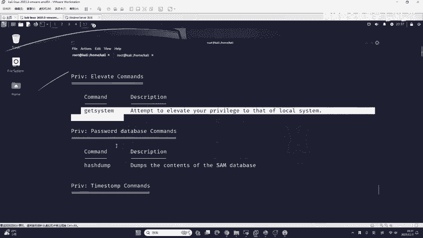

比如说我放到训练营这个目录。是被秒杀了。知道吧？被火龙秒杀了，那这肯定不是我们想看到的。第一个，谁的电脑没有杀毒软件呢？但是并不一定啊，有的同学他买的是联想电脑，自带的有联想电脑管家。

有的同学啊为了给自己的QQ账号加速，为了领取游戏礼包，他使用腾讯电脑管家。😊，这些啥的软件？都不太行。你如果使用它的话，其实使用率还是非常广泛的，是吧？很多同学用这两个他的软件吧，他其实啊不是特别专业。

你很有可能就查查不到它。😊，这没办法。

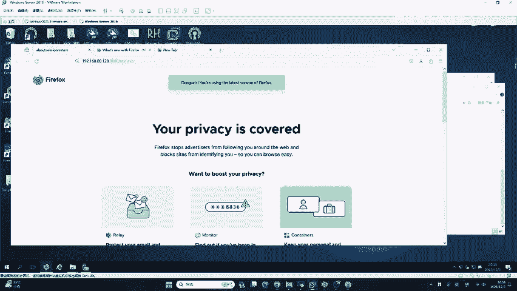

一会儿呢我们也会讲这杀毒软件有哪些。😊。

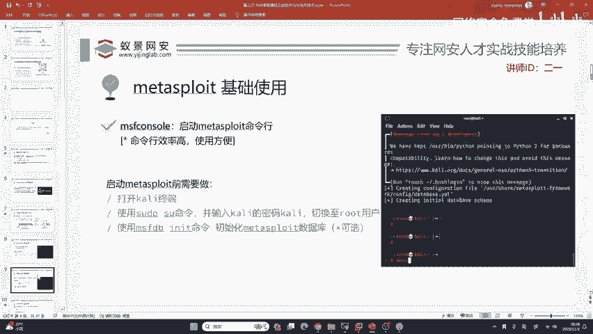

好的，我们先来看。