# 2024B站最值得看的黑客教程 ｜ 网络安全／渗透测试／内网渗透／漏洞挖掘／web安全／kali linux／红队靶场／CTF／信息安全 - P28：杀毒软件绕过 - 网络安全免费学 - BV1uBsTetEow

这是整个的步骤啊整个的步骤，这些所有的命令再次提醒大家，你不用急哈，咱们学习最怕急，就是你不要硬卷，卷啥呢？你慢慢来又咋的，你今天学会了，明天就找工作，还是说你晚学两天就找不到工作，没有这一回事啊。

你不要急。😊，那咱们下面就来看，首先你要想免杀，你要想钓鱼，你是不是要知道杀毒软件怎样杀的你啊？如果你这都不知道你免杀免个啥玩意儿呢，你怎样去下手，那时候无从下手，无从下手。俗话说，这个知己知彼。

百战百胜。你首先要做的就是要知道世界主流的杀毒软件。😊，不知道大家能不能一眼认出来他们，有同学可能非常清楚，360火容微软自带的杀特软件。😊，确实是这样，这三个大家都非常清楚。

那这个同学啊在这个咔咔咔咔问到啊，这个系统自带的杀毒检测好用吗？首先是好用的。前提呢你的系统必须是新的win11的，很好用。如果你是win10，特别是win10的早期版本。不是特别好用啊。

咱们是操作系统，它会自动更新的。好，下面分别来介绍一下，这里是以后大家在工作中。😊，你最烦的这几个软件。因为它会拦截你的行为。好，我们分别认识一下。首先国内的360和火容两大巨头，他们两个最好用。

360查杀能力最强，但是它的缺点我就不多说了，大家懂得都懂火容它的优点很好，大家都爱它，但是火容啊略逊于360。就是说它的查杀能力。跟360比其实差的很远啊，它远不如360。下面我们再来介绍一下国外的。

首先微软自带的这样一个啊，你们不要发出来，好吧，你知道就行，你不要发啊，咱们懂就行了。好，我们下面再来看介绍。首先有同学讲了卖咖啡。😊，小红伞。罗马尼亚的比特凡德。IVG世界上使用人数最多的杀毒软件。

俄罗斯的卡巴斯基，不过现在已经被漂亮过制裁了，外国已经不再用它了，只有我们还有俄罗斯在用。ESET。以及趋势杀毒。这是我们宝岛台湾的杀毒软件。这几个呢在以后你现在看起来他们好像还不错，但以后啊你工作了。

你就特别的厌恶他们。因为你好不容易做一个木马，哎，一下被他们杀了，好不容易研究的攻击方式，一看哎，被拦截了，你很烦。😊，所以说呢咱们就要学会绕过它。有任何一种通用的方式能够绕过这些杀毒软件吗？

很显然是没有的。如果你觉得有，你肯定是美国的电影看多了。你是小看了他们这些公司，这些公司可都是巨头啊，他们有无数的安全研究员，比我们这种做渗透测试的，要牛逼的多，都是世界的顶级大佬。

尤其是这种有政府背靠的卡巴斯基，以及像这种微软，好像趋势，所以说他们对于病毒的研究，那只能说是专精专业。😊，啊，但是也是存在绕过的方法。下面我们就来看这些杀毒软件，在不同的操作系统上面。

它是如何实现杀毒的。我们来看一下。那实现杀毒呢，它一共有三种方式，你不要想啊，它没有太高级的，都是这三种。第一种叫做静态查杀。什么叫做静态查杀呢？就是火容和腾讯管家联想杀毒软件使用的杀毒方式。

静态查杀就如同警方的通缉令。比如说漂亮国经常发生枪击案，那这些枪击案的嫌疑人啊并不会被立即逮捕。这时候漂亮国的警方就会发出通缉。就是说大家要注意，比如说在缅阴州发生的枪击案，警方就发出通缉。

现在这是嫌疑人的照片，大家要注意他有持枪，我们一定要远离他。这就是一个通缉文件，这个通缉文件呢在各个杀的软件，他是会共享的这叫共享威胁情报，大家都知道哦，你就是病毒，你就是犯罪嫌疑人。然后。

如果判断哎你的电脑突然出现了一个好像是犯罪嫌疑人的文件，直接查查，这就是静台查查这种效率最高，耗费的资源最小，也是杀的软件都具备的特征，除非是那些已经垃圾的不能再垃圾的杀软啊，否则这是首选的。

第二个叫做云查查。云查杀是最狠的。比如说360云大脑。它的作用就是说比如讲你下载了一个文件，首先呢它会对这个文件进行上传。你没有听错，360会将你电脑的文件上传到他们的服务器。上传到他们的服务器干什么？

做进一步的分析以及内容的行为检测，这叫云音查杀。云查杀是基于沙箱的。它的查杀更为深，查杀的精准范围啊更更准确。所以说。啊，咱们这样一个云查叉就是非常厉害，是非常难绕过的。我们可以看一下互动区。

有个同学说到，有没有过段时间就自动更新密码的应用。你的windows操作系统本身就有你windows操作系统本身就可以设置。过段时间更换密码。好，第三种叫做动态查查。

动态查查是类似于卡巴斯基360小红伞这些杀毒软件做的事情。比如说你的病毒，你很有可能绕过去，我们使用一些简单的方法，就能绕过静态查杀。云查杀，咱们也有反制的方法。那现在呢。如果是动态查查。

比如讲我们的这个EXE已经绕过了杀的软件。但是你这个EXE是做什么？是控制它是控制它控制它干什么？比如说我这里是不是截了一张图，你截图的这个操作。😊。

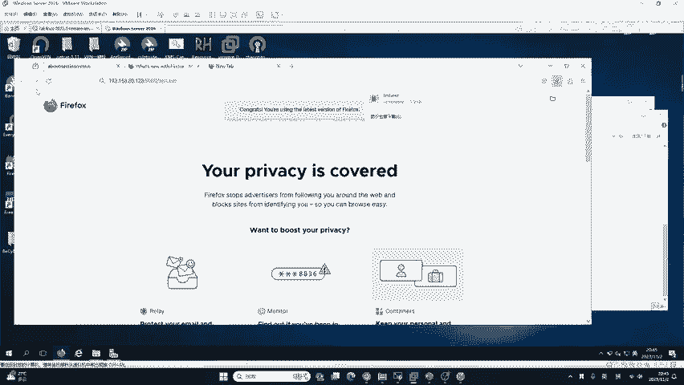

是谁做的，是不是系统做的？系统怎么做呢？它就要调用一些系统的驱动，或者是系统的动态链接库，以及系统的接口去做这样一件事情，就比如说打开摄像头录像这些都是有行为的。就是说啊这些高级的杀毒软件。

它会对你的内存以及对你的行为进行实时监控。如果发现哎你现在。

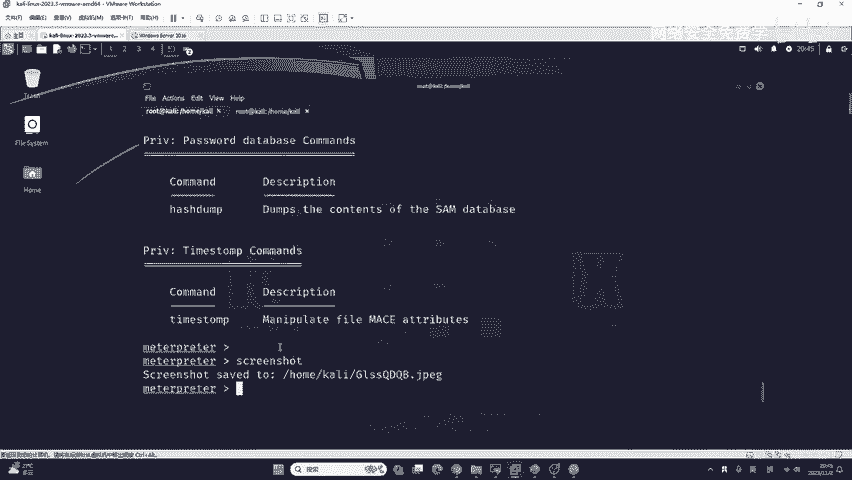

发生了一个屏幕截图的操作，它就会追溯到这个test点EX1，然后把它杀掉。所以说卡拉斯机啊大家是比较头疼的，因为哈它是对内存来产生监测的这种。😊，需要一个持久性的面杀，而且非常难做。但是它有没有缺点呢？

我们是否火容也具备动态叉杀的能力。很显然是不具备的。为啥是因为动态查查会耗费很大的计算机资源，会占用很大的计算机内存。就鱼和熊掌不可兼得。如果你真的要安全，就不要上网，那你就肯定安全，你不要用电脑。

石器时代肯定安全。如果你联网，那就是攻防对抗的过程。杀戮软件几乎每周都会更新，甚至是像火容每天甚至一天都更新两次它的病毒库。😊，因为他为了防止黑客攻击，那我们作为攻击者，你要想的就是啊在他更新之后。

我们要及时的更新我们自己的技术，就照顾他。所以说秒杀技术时效性很强，你必须要种原理。才能够把它变化，它更新了病毒库，把我们本身啊好不容易做的这个免杀的木马给它杀掉了。那我们就及时的调整。

及时的再做一个出来。😊，是么。就是什么意思啊？就东攻防对抗啊，攻防对抗，你是生存的地方。😊，就在你当前的文件啊。你在哪生成的就在哪？比如说我在这里。就在这个科me卡里生成的那我就在当前的目录啊。

泰斯的点1X1。就在这个地方。好，下面我们继续来看，那应该如何去杀软绕过呢？咱们有初级的，还有境界的，可以给大家看一下绕过初级杀毒软件的这些方法。首先第一个是佳科签名文件捆绑。以及我们的资源替换。

这是简单的杀毒软件绕过，我们不需要太多的知识，就能够很好的绕过常见的杀毒软件，也有进阶的，给大家看一下境界的吧。进阶的绕过沙的软件的方法呢，它是需要有代码能力的。不是一蹴而就的啊，大家不用急啊。

你这肯定是一步一步来。就比如说。

下面就是一个境界的杀毒软件，绕过杀软的方法，它需要使用go浪格作为编程语言去加载。这以基于汇编去编写的Cel code的来实现对内存的注入，绕过杀毒软件，这是两种完全不同的概念，大家是需要逐一学习的。

我们先来看基础的基础的第一个叫夹壳。这个东西大家都听说过，你如果没听说过，现在跟你讲。

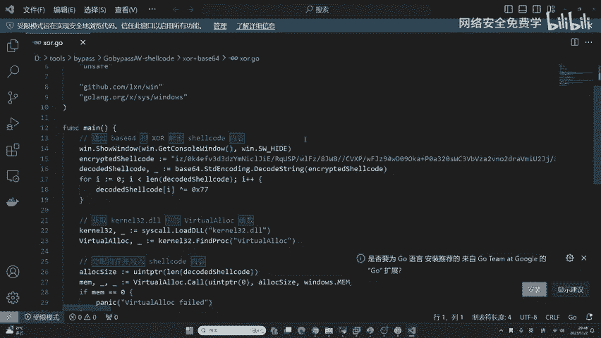

加壳它有明显的缺缺点，就是部分杀毒软件会将加壳后的程序视为恶意文件。比如说360这种方法，你对于绕过360是无稽之谈。你现在就算是用一个正常的软件，比如说小额通，你加密城啊，加壳之后，360也会杀它。

好，你是绕不过去的。但是咱们可以绕过火容。加可的意思就是利用特殊的算法对可执行文件。比如说EXE进行压缩。在压缩之后的文件它是可以独立运行的。而且解压解压的过程完全隐蔽，都在内存中完成。

哪一个涉及内存是不是第三个呀？也就是讲，如果你的杀毒软件没有内存查查，基本上。就能通过加可来去找过，就能通过加可来去找过。windows平台常见的壳有三类。第一种类似于UPX，我们把它称为压缩壳。

第二类叫做VMP我们把它称为虚拟机壳。第三类如同穿山甲，我们把它列为加密壳，这是windows平台常见的壳。那针对于linux和android都有不同不样不同的这个壳。特别是安卓啊，什么一代壳。

二代壳三代壳啊，非常非常多。那我们先以今天课程的EXE来给大家去讲解。那下面呢我来演示一下，比如说我们生成的这个test点EXE啊，它是会被杀毒软件杀掉的。那被杀的软件杀掉了怎么办呢？哎，大家来看好。

我来做一个操作啊。😊，比如说t点EX1。

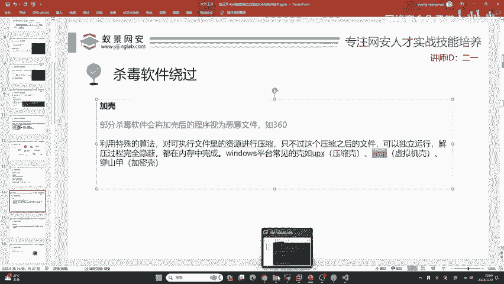

我现在把它给放下来。从虚拟机中啊给它粘贴过来。我们打开文件夹，导出testEXE。那给他放过来。好，翻过来之后啊，你会看到杀毒软件会直接查查它，查杀它之后怎么办？你要注意我现在做一个提取的操作。

这个提取的操作啊，它是。不会影响杀毒软件正常查杀它的，因为我不会添加到信任区，我只会把它提取出来。看好提取提取到哪里呢？就提取到D盘，我的tth啊这个地方。8一 pass就在这里吧，这个文件夹中。好。

进行替换一下这个。转不过来是吧？因为有一个同名文件，那我先把同名文件删掉，然后再重新的去提取吧，重新的提取一下。好，大家可以做耐心做，稍等。在资源管理器中跟windows是一样的，要不要我再来演示一遍。

好，咱们现在已经提取过来了，这个test点EX1。😊，要不要我再演示一遍，在这个地方，你看打开看好open flower，看到了吧？在这儿右键copy就行了。没找到的话，你是不是没有生成啊。

你不生成的话，它自己本身是不会出现的哦。你要生成生成的指令，我在课后的时候都会整理给大家你可以不用跟着我操作啊，你是跟不上的，没有必要跟着我，你跟着我之后，说实话，你不如好好的去听啊，不如好好的去听啊。

对你可能是没有生成。😊，现在哎我们做一个操作，我们使用一个正常的VMP壳。这些壳啊我在课后也会发给大家，大家不用急啊，比如说这个软件。😊，只要是VMP壳都是可以的啊。只要是VMP壳。

都是可以的都是可以的。🎼然后我打开这样一个非常老的这个壳是2010年的壳，叫za米达，是VMP壳的其中之一，它都可以去加密它。比如说我们把这个test里EXE去整过来。

点击试击试然点击protected的就保护。😊，这里你不要问他呃，是什么意思，你不需要知道他是意思，因为他非常老，你知道了他对。😊，嗯，渗度测试也没有任何帮助。好，现在呢他已经告诉你保护成功了。

这个软件我在课后会发给大家，大家可以找班主任领取。我们在预习内容中也会给到他的下载链接。现在你再来看。这一个生成的我们8点53生成的这个EXE。火容啊就杀不了他了。这就绕过去了，这就是火容的特点。

火容对于加可滞后的程序。基本上没有查查能力。

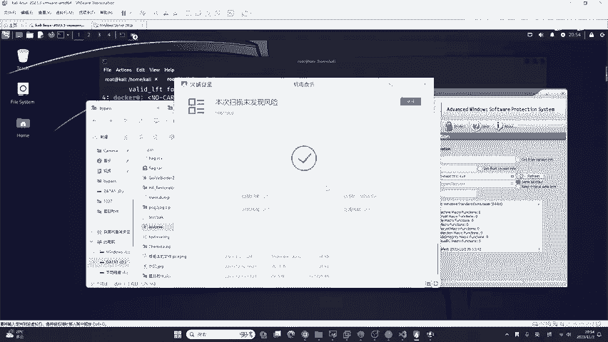

那我们这种方式能够绕过360和卡巴斯基吗？肯定是无稽之谈，因为3603种检查方式他都有。你的夹壳，你加的这个小小的壳，你看你就拖了一下，点了一下protect，就一个鼠标点击就像一键日卫星一样。

鼠标点一下就绕过360，你是把钟弘毅当成耳戏啊，这不可能啊。所以说呢咱们要有一个间阶的步骤夹壳你可能知道是吧？夹壳，你可能知道那其他的东西啊，大家来听我细极的来讲。😊，那如何去绕过360360呢？

比如说我们这种夹壳的文件。自带的也能杀掉。如果是win1一自带的可以杀掉啊。如果是你是这个win10，特别是win10早期版本呢，是杀不掉的。就windows11的是可以杀掉的，能理解吧？

自带的杀毒软件是非常强的。😊，你为什么我告诉你强和弱怎么区分？第一个就是360，它很强，第二个就是收费的。收费的杀毒软件都很强。比如说像卡巴斯机小风扇，包括我们系统自带的。那有同学讲系统自带的。

我也没花钱呀。😊，你们买电脑的时候，是不是自带的正版软件，正版的系统，其实钱啊你已经花过了，只是你算到了电脑的钱力而已，你已经花过了，懂吗？这种都很好。😊，一般哈就比如说免杀360的文件。

我们这个加壳了。加了壳之后，如果哎咱们天时地利人和，你绕过了360。但是360有一个方式叫什么云查叉，你这个文件会被上传到360的安全大脑进行动态分析与行为检测。😊，那在云大脑看来。

你这个文件夹壳就如同你现在你穿着吉利服一样，别人把吉利服给你扒掉，你不就露出原形了吗？所以说产生的效果就是在联网的情况下，一个文件过了三四分钟就会被360识别成病毒。

并且它的文件特征会被永久加入到360的病毒特征库，你再次上传将会被秒杀。这就是360。好，这就是360，他很厉害，你不要觉得哎360都是广告。😊，它广告是因为你不需要收费啊，他需要嗯维护他的病毒库。

维护他的杀毒引擎，它是需要维护成本的啊，所以说呢呃它依然很强。这是安全大脑。那有同学也讲哈，我的文件被上传了，我的文件被上传了，那确实是这样啊。如果你觉得哎我不想我的文件被上传，那你就别用360啊。

360是肯定会上传的。😊，现在我们来看如何绕过杀头软件呢？首先我们想绕过360，你要做的就是让这个文件看起来像正常的文件，你就能有可能绕过它。记住我说的是有可能没有一个标准或100%通用的方法。

能够绕过杀头软件。如果你有你厉害，那周弘毅明天退位，你来当你来当360的掌门人是吧？这不可能。那360深耕了20多年，专门研究这个东西，你能斗过别人，你可以啊，但是说别人肯定就是过几天给你杀掉了。

怎么办？你再再做啊，再做。😊，你不要去啊，我有一个东西说这个学了一个技术，我吃到老活到老就是直接吃老本，这不可能啊，没有一个铁饭碗在面杀这个地方。现在我们来看。😊。

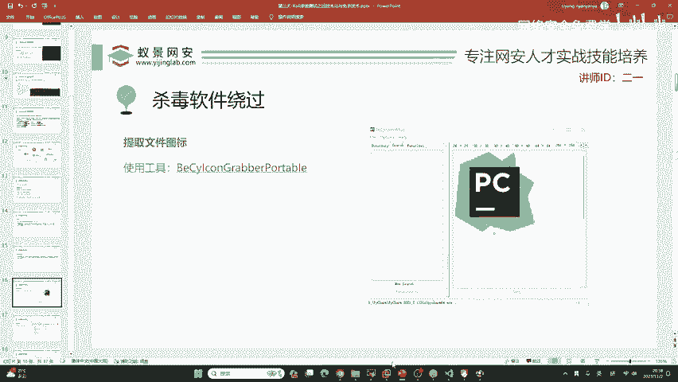

那怎样去让一个软件看起来正常呢？你要想的就是捆绑木马。捆绑木马就是把木马捆绑到一个正常的文件上面。比如说你现在能够掌握什么安卓13，别人捆绑的木马，能够捆绑到你的微信上面，你的微信是可以正常运行。

正常聊天的，而且你把微信从后台中删除了，它的木马也不会掉，这叫捆绑。那首先捆绑木马咱们要选对文件，我今天就来给大家选一个选一个啥玩意呢？选一个现在非常火的远程控制桌面文件，叫to desk。

它跟向日葵一样，很多的同学应该都在用。如果你没有用它的话，我这里也推荐一下，它很好用。

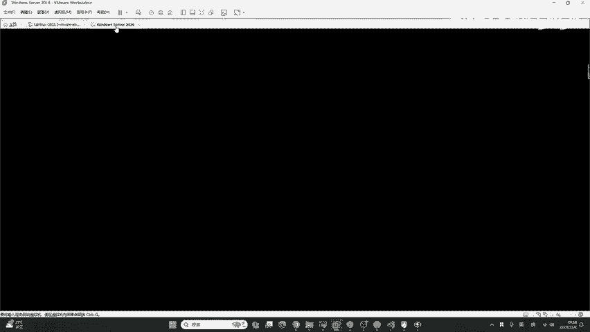

可以进行远程控制你的电脑，因为大型的电脑都在局域网里面是吧？你不可能有公网电脑啊，所以说咱们比如说在公司里面想划水连接一下家里电脑的这个游戏是吧？

连接一下家里的电脑去打游戏都可以去下载to desk to desk。😊，所以说呢我们今天就用它来做一个捆绑木马。其次，你要记住，你如果有公网的话，你千万不要用于违法行为。

这里我下载一个to desk的客户端吧，我们下载它的一个安装包，下载下来。下载安装包之后啊，我们现在把它拖到桌面上。来看一下。这是to desk正常的安装包，它的图标是这个样子。

它的名字叫做INST点EXE没有毛病吧，没毛病是吧？这是正常的文件。这个正常的文件呢，现在我们需要去把test点EX一给它整到这里。那比如说我随便找一个木马文件吧，这是我在课前生成的。我在课前生成的。

我名字我改掉了，就这个EXE啊，现在我我的作用就是要把它变成它。😊，要把这个testEXER变成它，那咱们怎么装的像一点呢？首先你要学会的就是图标的修改。图标的修改量在网上，你看到的教程非常复杂。

而且你修改起来很别扭啊，别人一看就看出来了。😊，你这个修改的很难受。这里我给大家两个非常好用的工具，你可以熟练掌握它在课后我都会发给大家，大家不用急哈不用急，你可以不用跟着我操作。😊，不用跟着我操作。

这些软件都是拖来拖去，没有任何的问题。那有同学讲我还学啥？如果没有我，你又不知道这些软件，你从网上很难搜到的。首先第一个软件叫做by icon，就是说我们从软件中提取图标。

我现在如果想让testEX一变成它。首先第一件事情做的就是图标来看好，打开这个EXE。打开之后，你看这都是英语是吧？看不懂吧，我也看不懂，没关系，你没有必要看懂它，看懂它对你你来讲没有任何帮助。😊。

咱们看好把这个东西往这一拖，这正常的文件啊，你别拖错了啊，正常的文件往这一拖，你看这个图标是不是出来了，而且它又提供了不同的分辨率，咱们点这个最高清的。因为你那个图标啊，如果太糊了，直接就穿帮了。

咱们点这个最清晰的，然后右键就256乘256，右键它点击sve就是保存。😊，保存之后啊，它默认情况下它会保存。比如说保存所有分辨率的，咱们只需要保存这1个256乘256的就行了。

咱们选一下它后缀名是RECCO，你不要改啊，RECCO就是icon图标的前三个字母，咱们选择它的保存位置就可以了。比如说我把它保存到桌面上面，点击下保存，你看现在图标过来了吧。哎，图标在这了，简单吧。

超级简单，这是一个通用的方法。比如说你的游戏，你的APP甚至是你的word文档，你的压缩包的图标，它都能够提取。包括VM。你看我在课前还提取了1个VM。咱们可以伪装成虚拟机的安装程序。😊。

那有同学会怀疑二一老师给大家的VM是不是已经被二姨老师植入了后门？大家不要想哈，这种行为是提供计算机入侵操作系统工具罪，它是网络安全法所定下的大罪行，我是不可能这样做的。😊，好的，我们现在图标有了。

文件有了，我们现在要把这个文件的图标换成它。怎么去换呢？咱们又要用到了第二款工具，叫做资源编辑器的2018版本。这类型的工具非常非常多，但是这一个是最好用的。大家可以看我操作。😊，现在我们打开。

打开这款工具。这工具我都会发给大家，你可以不用记。打开之后它是汉化的，那怎么去用它呢？你要记住，就是拖拖拽拽。😊，你即使你没有听课，其实你拿到这些工具，你也会用。就像你去玩游戏一样。你打游戏的第一天。

有人告诉你，WSWISD是控制它吗？没人告诉你吧，这是你育生俱来的本领，这是人类小脑的思考本领。😊，我们现在把它拖进来，把这个EXE。这个EXE它本身有图标吗？没有，它啥都没有，我们要为它创建一个图标。

我们要为它创建一个图标。这个怎么给他创建图标呢？大家看好。在这个地方，我们右键点击添加资源。在计算机中，比如说图标、音乐图片都叫做资源，我们点击添加资源。资源的类型，我们要选择图标，你可以选啊图标。

然后名称随便写。连滚键盘随便写一个点击确定，咱们现在就为这个test点1X一加了一个图标。加了一个图标之后啊，这个图标是没有像素的那我们怎么办呢？刚刚是不是提取出来了这个ICO文件。

咱们直接拖中拖动它啊，拖到这个图标文件夹中。哎，是不是过来了，这个图标就过来了，过来之后啊，咱们现在只需要把原本的这个图标删掉就可以了。如果你不想删也没有关系。这里我们右键它点击删除。😊，点辑室。

然点击第三个按钮保存。我们的图标就变回来了，大家看好了没？咱们的图标是不是已经变了呀？😊，是不是？你看咱们图标是不是跟这个正常的文件一样了？现在如果你把它的文件名也给它改成一样，你就可以钓到一部分人了。

但是这个钓鱼很标准吗？😊，不标准。为什么不瞄准呢？就是这个程序大家看好，我双击运行。他是不是会有这个to desk安装页面，会有吧？对这个同学讲的非常正确，大小不一样。那我这个文件运行呢？运营起来一看。

还啥也没有。😮，你这个啥也没有啊，就会被别人怀疑，知道吧？你这一运行啥都没有，别人一看就不太对劲啊，你这个地方可能就就被发现了啊，你这觉得就是你这闹着玩呢，我双击之后啥都没有啊，啥都没有。所以说现在。

😊，我们没没有没有区别，这个区别是我这个虚拟机的问题啊，虚拟机的问题，你放到win11里面就不会有了。可能我这个像素太高了，但是我这个因为我现在虚拟机的分辨率是这个1080P的啊。

所以说呢它显示不出来这种高像素。😊，你实际啊，我我我感觉我自己都要点错了，就如果我把它的文件名改一改，我自己都能点错。所以说为了区分，我现在把它拉远一点，好吧，别到时候我自己点错了，这边是正常的。

这边是假的哈，是后门，但这个假的，咱们现在也要让它运行起来，不能说一双击啥都没有是吧？啥都没有，那就太无聊了，那现在咋办呢？好，咱们就要进行一个。😊，绑定的操作绑定操作有非常多种啊，有基于C加加的。

有基入golog的。但是我估计啊咱们来听课的人，你可能不会写C加加，你更不会写go，那怎么办呢？好，咱们用工具用另外一种非常简单的方法，简单，它就有弊端，知道吧？但是复杂也不是说你一下就能掌握的。

咱们先把简单的掌握吧，就是下一款这个软件啊，要文RAAR。😊，把这个软件下好之后。咱们点击下载，看我直接下啊，我现场下。😊，这些软件都会给大家，不过他也是这个嗯这一个。免费的啊。

我们这里选择chese简体中文啊。😊，好，这里64位的，咱们下载一下，我现场下啊。😊，好，安装一下这个软件。好，安装好之后呢，咱们现在来做1个RAIR的绑定，就这个软件可以帮助我们实现类似的效果啊。

但实际上咱们肯定还是要用C加加。不过C加加的话，今天肯定不讲我讲C加加，到时候你们都跑了，都睡了，都直接跟听英语听力一样，直接睡着睡着了是吧？催眠呢。😊。

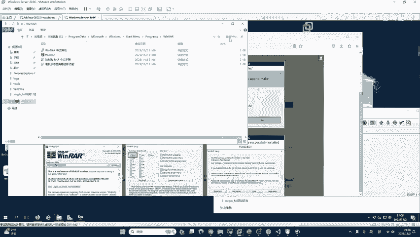

所以说咱们今天先用winRR来进行操作。好的，winRAR应该怎样做呢？咱们首先选择这两个文件。😊，那有同学讲哈，咱们这个图标怎么变回来了？变回来，这是由于啊咱们这样一个系统缓存的问题。

刚刚我点了两下刷新，所以说呢可以可以给你看，你别急，好吧，咱们分步来好不好？😊，我先把咱们绝大部分能听懂的同学听懂的我们先讲好。不行啊不行，必须winRIR360没有这个功功能，你还用360压缩啊。

广告不烦吗？还用360压缩。广告不烦吗？是吧？孙佳佳，你稍等啊，你会孙佳佳，我给你看，但是你别急。😊，现在咱们有两个文件啊，这上面这个是正常的，下面这个是后门，这是图标，我给它拖走。😊，现在右键啊。

咱们右键哎把它去啊，360压缩没有广告是吧？那太好了，老师没有用过，以前是有广告的，现在可能他。这个可能他清楚广告了哈，我们给这个360点赞，好吧。哎，希望他以后把这个杀毒软件的啊这些广告也都去掉。

好不好？那咱们今天呢就先按照老师的来讲。😊，咱们首先选择它之后啊，点击把它两个都选择，点击添加到压缩文件。点击添加到压缩文件之后啊，这里有点不清楚啊，我给大家调一下。😊。

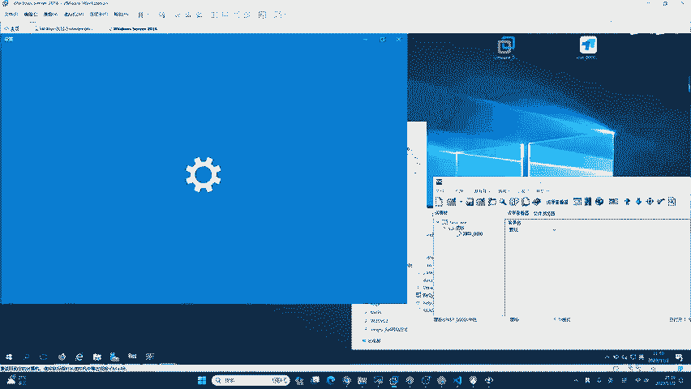

好，给大家调大一些。点击它之后啊，我们勾选这一个叫做创建自解压格式的压缩文件。你点啊，你会发现它的压缩文件名会自动的被替换成这个点EXE。😊，你不用问他，没关系的，你千万不要再改回来，改成RIRR。

改回来就错了，咱们不用改，不用改也行。你一会儿看好啊，一会儿就就出来了。😊，好，现在继续。我们点击它之后啊，点击在这里高级选项。😊，有一个叫做自解压选项，大家看我操作。第一个是解压路径。

作为一个合格的黑客，你的解压路径都是在这个地方叫。咱们的。嗯，缓存路径C盘的windows。t普这个目录。好，都是在这个目录哈。所以说这个目录是咱们排查的重点。但是你说你会排查，我懂啊。

因为咱们是安全工作者，那你公司的前台，你公司的财务，你公司的销售，他会排查吗？😊，我知道你不会中招，你要想钓鱼，你不可能达到100%都上钩吧。就像你去实际河里钓鱼，你能把整个河里的鱼都钓上来。

这怎么可能很有可能就空军了，是吧？那没关系，咱们就是尽量提高这个钓鱼的技术，你不要当空军啊，咱们尽量钓到一两个。😊，好，现在咱们点击这个。这个搞好了是吧，这个绝对路径。

然后继续啊一步一步的来常规写好了设置解压后运行的两个文件啊，咱们必须写好。第一个运行的是咱们的后门。😊，windows temp后门叫什么？后门叫test点EX1是的吧。这是后门。

第二个是他们正常的程序。正常的程序叫啥？我看他叫啥啊。😊，咱别搞错了，别搞穿帮了哈。正常的程序。看一下叫啥玩意儿，就这个INST点EXE呀。INST点EX1。好，这个写好写好再来就一步一步设置啊。

再来看模式，点击全部隐藏。你不能说你运行还弹个框弹一个框就被人别人发现了，你要尽量的隐藏。😊，然后下面再点击高级高级，这里啊不需要设置。不需要设置，让更新。点击这两个解压并更新文件，覆盖所有文件。

那有同学讲老师你操作太快了，我软件都没下好呢，你不要急，这些东西我都放到笔记里面，好吧，放到咱们预习内容中，到时候加班主任就可以获取链接。😊，好，我们再来看现在我们设置的常规设置模式，还有更新。

就这几个点一点，我大概就点快了就一分钟左右。好了，咱们OK点击。😊，确定。点击确定。好，确定到底之后啊，在当前的桌面上就会生成一个叫做desktop点EXE的程序。啊，他唱上哪去了，我找一找啊。

我在这儿呢看desktop点EX1。😊，这是咱们刚刚自解压的程序啊，你要记住上面的是正常文件，下面的是咱们的木马，这是刚刚生成的程序。😊，那这个程序有什么问题，大家看出来了没？有什么问题？😊，图标不对。

好，咱们现在改它。改图标重复刚刚的操作。打开这个软件。打开这个软件之后，咱们把刚刚生成的这个字解压，就是winRIR的。😊，给他拖过来。拖过来之后啊，因为它本身就有图标是吧？你不要再改它了。

咱们双击图标双击图标，你进来它本身是不是有一个叫做100的图标，那现在怎么办呢？咱们看把一开始生成的这个图标看好，我拽过来哈，来拽过来。😊，拽到这个图标文件夹里面，松手。然后把这个100给它删掉。

就是把原本的这个图标给它删掉，知道吧？删除。😊，然后保存一下。保存一下之后，咱们一定要刷新一下桌面啊。😊，刷新一下桌面。你会发现他现在有没有变回来啊，有没有变回来？😊，没有，这是为啥呢？好。

现在你要注意这一点你不用担心，因为它是windows的缓存。其实它的图标已经变回来了，只是啊windows它有缓存，它还保留着原有的图标，现在图标我们已经修改好了。

那如何让它的图标不被windows缓存所影响呢，大家来看好啊，我现在就经充当这个余儿。我把它放到我自己真实的电脑windows11上面。来看好。好，来看一下。这个图标。是不是正常的？同学们看好了吧。

这个图标是正常的吧。😊，是不是正常的？好，我们现在来看那如何让它能够让这个呃就是让受害者能够上钩呢？就是我们还要给他改一下后缀名是吧？后缀名就比如说它本身的文件名啊，不是后缀名，我讲错了啊，文件名。

它本身的文件名叫做INST我们这里也要给它改成INST看好。😊，好的。我们现在这两个文件生成了，记住。这个是正常的文件，这个是后门，这个是两者的融合体。我请问大家，如果你是一个。如果你是一个非技术人员。

技术人员，你就走开啊。你技术人员我知道你不会上钩，好吧，你是个非常聪明的鱼，你不咬钩。但是这些没有网络安全技术的人员，他能不能识别出这两个文件拿是真的拿是假的呀，那识别不出来。😊。

它是识别不出来的那现在我们运行一下，它看过自己的win11会不会上钩。首先我们先查杀一下它。用火容吧，因为我电脑没有360，我害怕广告。

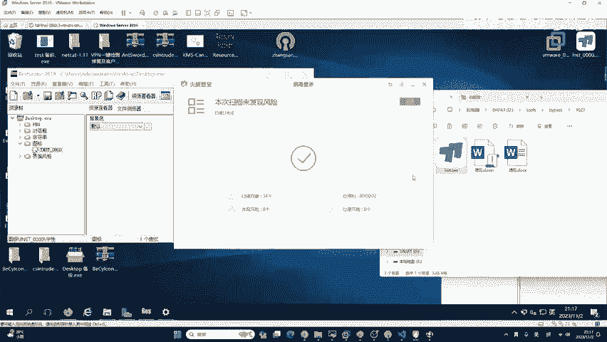

好。下面继续。来，我们到咖利中。360不知道。啊，火容是不会的。好，现在。😊，我们来做一件事情啊，就重新的开启监听，把这个之前的退掉。😊，重新的开启监听。

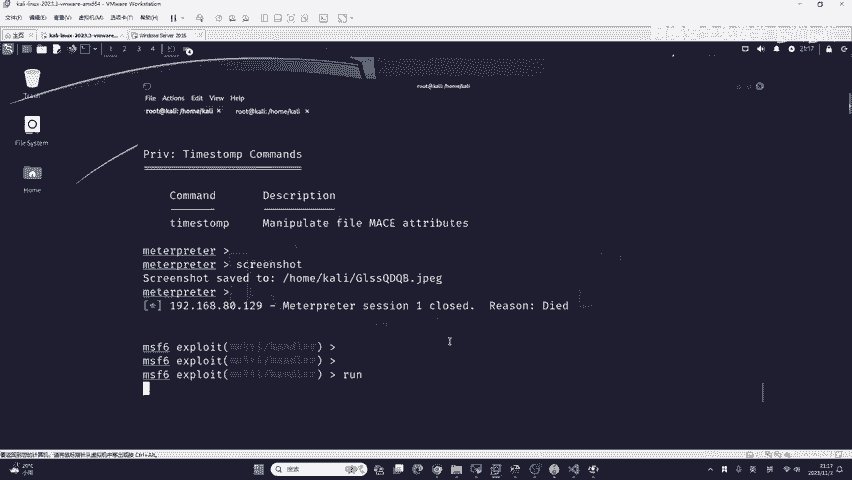

为什么我自带的杀毒软件没有杀掉？是因为我这里开启了火容啊，大家要注意，就如果你的电脑开启了另外一个杀毒软件，它本身呢就会被关闭，知道吧？比如说我这里用了火容本身的杀毒软件就会关闭。

那有同学讲微软自带的杀毒软件，就win11自带的能不能把它杀掉。😊，当然可以。好，你不要小瞧微软。那比尔盖茨可不是闹着玩的呀，别人很厉害，你不要小瞧别人。好，那国外的都能杀掉，卡巴斯机也能杀掉他。

那能杀掉他怎么办？咱们就要用更高级的绑定方法。因为我这个就用工具鼠标点点点操作快了，一分钟啊，一分钟都不要就OK了。那你这种你说你一分钟你又绕过卡巴斯基一分钟你就要绕过小龙仔，你说说给谁听谁信啊，是吧？

你在抖音上面你发视频，别别人都得骂你，你怎么那么可能呢，是吧？你一分钟就绕过卡巴斯基机，这肯定是假的。😊，这个世界顶级的黑客都没有这样是吧？都没有这个能力。你卡伐斯基的这个公司的员工都得给你鼓掌。

这不可能你现在看好，就用这种方法生成的后门。😊，咱们运行起来，我觉得运行起来之后，火容就会杀他。看好预想的跟我也不一样，我不知道啊。但是咱们看它运行之后的状态会不会有一个正常的文件产生。😊，首先。

我们这样一个to desk安装页面是不是正常打开了？同学们。咱们是不是正常打开了这个安装页面啊？😊，同时，我们的test点EX一有没有运行起来？很明显是有的，不过我这一个win11座的格力啊。

咱们MSF没有上线。😊，那我怎样判断他这个test点EXE运行起来了，咱们打开任务管理器看一下吧。😊，如果有的话，他肯定会显示出来。我们点击这个详细信息，看一下有没有testEXE。来看一下。还在下面。

这个地方好像是被杀掉了哈，好像是被杀掉了，他并没有泰斯EX一应该是被杀掉了哈，应该是被杀掉了。😊，因为这种捆马木马用工具它的特征非常明显。你用这个winRANR，你说你用winRANR这种东西呃。

它能杀不掉你吗？肯定能杀掉是吧？它运行起来就杀掉了。但是咱们这个木马首先它达到了一个目的，这个目的是什么？大家很清楚吧？就是。😊，这个文件运行起来是正常的，就它可以打开，打开一个正常的页面。

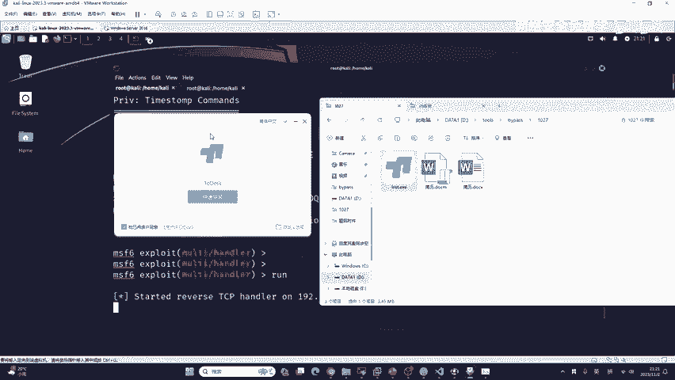

同时呢这个文件有没有被杀掉，我们去看一下，好吧，现在打开C盘windowst。大家看好这是啥玩意儿？这个东西是啥东西？泰的点EX看到没？台词代进EXE上面这个是正常的，下面这个是后门。

所以说咱们后门是得到正常的释放了那为啥它没有运行起来？这里啊是因为我win11做了隔离。其次呢就是它可能对系统不兼容，又或者是在内存中被杀掉了。😊，好吧，那有同学提到了一个问题。😊。

就是说运行的不应该是RENST吗？是这样的啊。IST是真正的页面，t连EXE是后续的操作，知道吧？它是紧跟着正常的文件运行之后释放出来，让你去上线。😊，那现在大家看好，我们可以达成这个目的。

去把正常的文件和病毒文件都释放到t目录。对这个testESE是喷跑陪跑的混子。你举的例子非常优秀，但是他有没有缺点啊，缺点明明明不明显。😊，很显然是非常非常明显的。😊，他的缺点就是。他的软件会杀他。

因为windows RLR虽然你这两个工具都免杀是吧？咱们t点EX一能不能过杀ter软件，可以吧？它能不能过杀ter软件，它正常的程序肯定能过啊，肯定能过是吧？但是你把他们两个融合起来，用的是啥玩意儿？

😊，用的是winRIR这一款软件。那winRNR它的融合过程已经被杀特软件心知肚明了。那这时候怎么办呢？这时候你就是要学习一些高级的手法。比如说有同学讲的，哎，二姨老师，你刚刚讲的C加加。

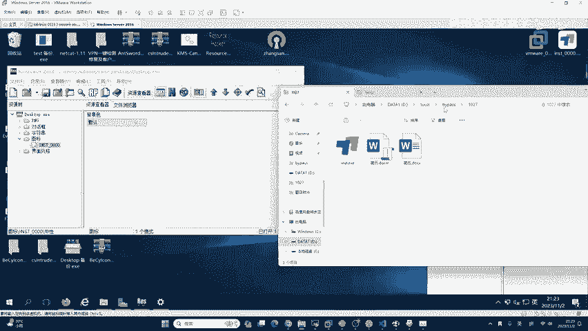

C佳佳能不能给大家演示一下？😊，来，我来给你看。t普目录不是防沙的作用，t普目录是正常的这个电脑，大家不知道这个目录，而且正常情况下你是打不开的。就是你你是知道的哈，你是知道的。😊，懂吧？你是知道的。

但是别人不知道。能理解吗？啊，临时目录缓存目录都对啊。好，再来看一下。好，这是一个C加加代码，当然它也比较简单啊，它的作用就是对两个资源做绑定。这种绑定是不会有这样一个winRR的特征的。

VRR它实现的是自解压，知道吧？你是用到了这个软件的技术，它特征很明显。而C加加呢，我可以自己写出来，如果被杀了怎么办？被杀了，我改一下代码不就行了吗？是吧？但是这时候就需要牵扯到很多的原理。😊。

即使有同学讲，哎，老师我大学里面学过C加加，那我咋看不懂呢？😊，你要知道你大学里面学的C加加都是站在学术的角度去做的课程讲解，而不是站在免纱和渗透测试的角度。去进行讲解，这就是两者的区别，能理解吧。

大家就是你这个C加加，你学术跟技术角度是完全两种。你即使你在大学里面，你学的C加加再好，现在让你去写一个免杀。如果我我用C加加去写一个免杀，那你会吗？那不一定会。😊，我的话，因为我是之前做这个软件安全。

所以说我是学C加加哈Java的话，你可以学。如果你是做渗透测试，还是推荐学Java，这要好一点，你不要再去学PHP了哈，PHP是世界上最好的语言，有个双引号打着呢？双引号是什么意思，你还能不清楚吗？

都学语文的是吧？你肯定清楚，所以说呢最基础的学python学pyon对，学pyon，学晚安。如果你想学编程语言，就学pyon，你不要整C加加，你不要整C加加哈。你说哎，老师我不是得学C加加吗？

不学怎么做面杀。😊，你学C加加，你怎么学，你是学应用，你还是学C加加，你学两年学两年，你一看哎别人都转成安全大佬了，你还在那C加加还在那handlo word呢，是吧？

信息安全就是网络网络安全呀一个概念。😊。

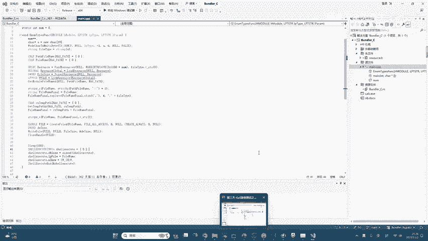

在咱们国内是一个概念啊。😊。