# 2024B站最值得看的黑客教程 ｜ 网络安全／渗透测试／内网渗透／漏洞挖掘／web安全／kali linux／红队靶场／CTF／信息安全 - P2：什么是端口 - 网络安全免费学 - BV1uBsTetEow

然后下面呢是我们的端口端口，很多同学可能没有了解过。我们先看一下啊屏幕上面的这个图片，可能大家在电视剧中或者是网络中啊见到过路由器和交换机。这些企业级的。您看到交换机上面那么多的网络接口。

其实它叫做端口。这个端口呢和我们今天讲的有一点不一样。哎，我们看到这个图片啊，实际去插这个网线，也就是双绞线的这个接口啊，我们把它叫做物理端口。那今天我们来讲的呢。

其实是大家使用的操作系统来去虚拟出来的一套逻辑端口叫做TCP的逻辑端口。那端口是干啥的呢？我这里直接给大家讲啊，因为PPT上面写的都是啊非常浮躁的啊非常无聊的概念，我直接用我的语言呢给大家表述出来。

那首先呢就是大家。

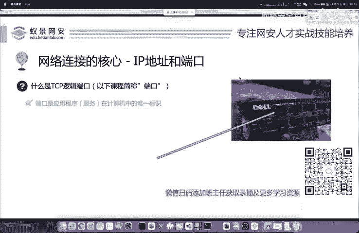

每一台的操作系统上面都安装了不同的网络应用，包括大家日常使用的应用APP也会进行相应的网络通信。比如说你的微信QQ，包括你正在使用的腾讯课堂，都会进行呢网络的通信。那这个时候我们比如说去发送微信消息。

这个消息如何精准的到达我们的目标电脑上面，在目标电脑上面找到微信这个程序，并且呢接收到这个一接收到我们发送的消息，而不会进行一个错乱，去发送到其他的APP上面。这里呢其实就是通过端口来区分的端口。

它就是应用程序，或者是叫服务在一个计算机上面的唯一标识。可以说呢，如果没有端口，那IP地址的存在，就是没有必要的我们在应用层中所有的协议和我们平常使用的网络应用网络通信进行的都。

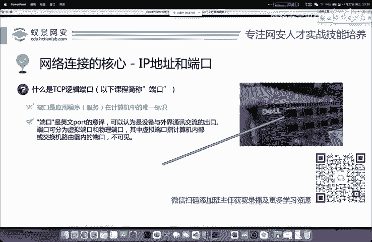

需要端口的存在好，这是端口啊，这是端口。那我们下面呢来了解一下这个端口到底是啥。我们再回到最初的简单模型。比如说张三去访问核天网安实验室，就是张三要知道核天实验室的一个IP地址。

那核田实验室呢会把相应的资源返回给张三，现在我们来复杂化一下这个简单的模型。那核天网安实验室上面，它是一个集成化的服务器，上面不可能只运行着一个应用程序，可能会有很多的应用以及服务。

进行一个网络的传输和通信。比如说他上面可能会访问网站，可能有邮箱，可能有聊天，可能有文件传输服务。那这些服务以及应用，他们都是分别开放在不同的端口上面的。我们把这些端口，就叫做逻辑端口。

现在张三他去访问我们网安实验室的不同功能，其实他就是访问不同的端口。

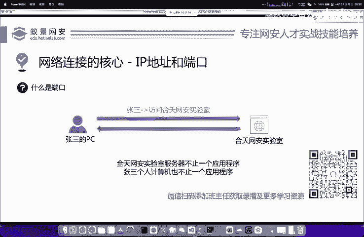

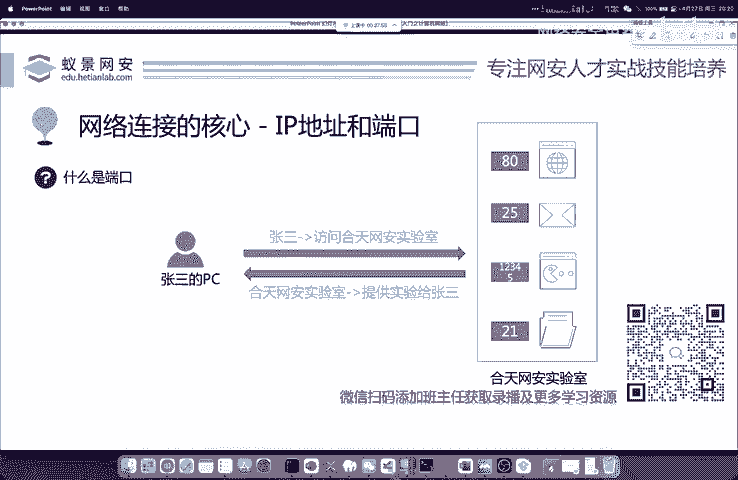

就是访问不同的应用，其实就是访问不同的端口啊，同1IP的不同端口进行一个访问。好，比如说他去浏览网站去发送邮件，去下载我们的核天丸实验室工具包等等，都是通过端口来进行区分的那张三自己的电脑上面呢。

它也不是只有一个应用程序。所以说张三在进行端口相应通信的时候，我们张三的个人电脑也会虚拟出大量的这个逻辑端口来进行一个端口对端口的端对端连接。这是TCPIP的一个核心啊一个核心。

也就是大家如果有学习过TCP啊，有学习过TCP协议，或者是其他协议的话，你应该知道在发送包的时候，经常会有两个东西，一个叫做sourceport源端口和destination port目的端口。

那源端口和目的端口呢分别是固定监听和随机生成的那他们的端口范围是多少呢？其实我们的操作系统根据聚集的网。

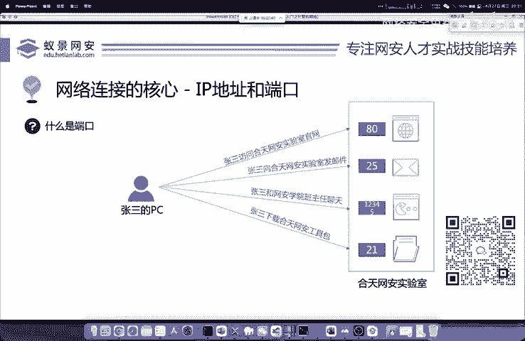

协议已经给出了相应的规划规划以及限制。那正常使用的TCP逻辑端口，它的范围是0至2的16次方减1，也就是0到65535。大家呢你是见不到比65535还大的端口了。因为这些端口呢是不存在的。

我们的网卡以及你的操作系统都会依据这个规范去产生这些硬件啊，硬件级的这个设备啊，这是我们。

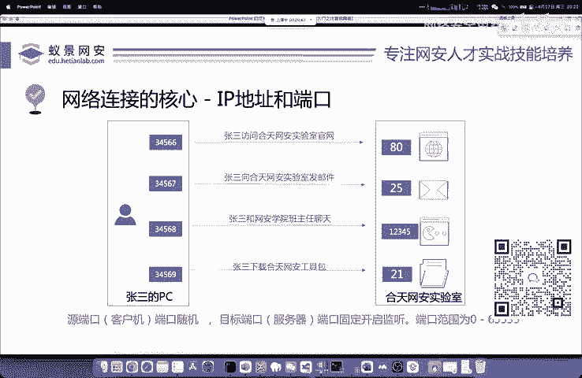

这是我们的1个IP地址和端口啊，太卡了吗？太卡了吗？应该不卡吧应该不卡吧，我这个网很好的呀，我这个网是千兆网呀。

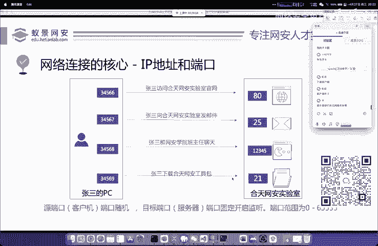

大家我这个网是千兆网呀，而且我这个是吧，我这个分辨率也是这个快4K的一个分辨率啊，应该不会卡的吧。

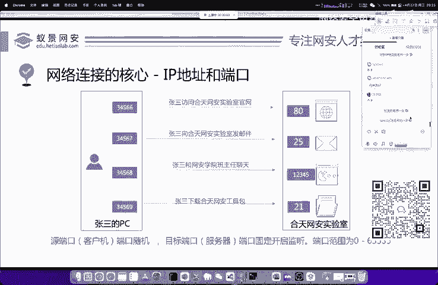

妈老师的这个网挺好的。这1000兆的这个网啊，我可以给你跑一下，这个画质是有问题啊。这个微信打开是的哈，大家可以去下载客户端。那个那个网站确实是大。这个我知道的这个同学，你用那个浏览器打开，确实卡呀。

我知道的，我经常用腾讯这个课堂，用网站去卡的话，就是经常这样啊。客户端也一样吗？这个应该应该不会吧，我这边。因为啊对上行的话，这个这个同学就开玩笑了，下行千兆这个电信的上行是30兆呀。

也没有你说的那么低嘛，是吧？30兆虽然也不高，但是是吧这个30兆也是有的。

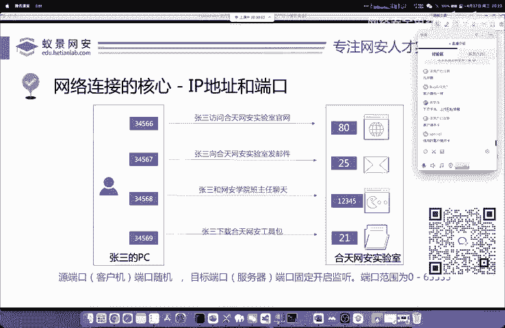

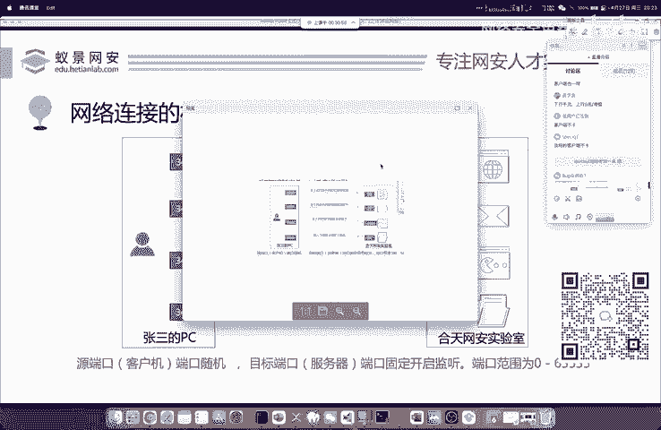

啊还是有点模糊啊，那可能是这个腾讯课堂，它这个压缩了吧，可能是压缩这个画质了吧。啊，到时候我和班主任沟通一下吧，明天我换这个电脑给大家讲啊，这个没关系的，有问题的话，你可以直接在讨论区说出来。

这个没关系哈。然后怎么去查看自己开启的哪些端口呢，有一个命令啊，这里发给大家，大家去啊尝试一下啊，这个不是我能决定的，用什么客户端。

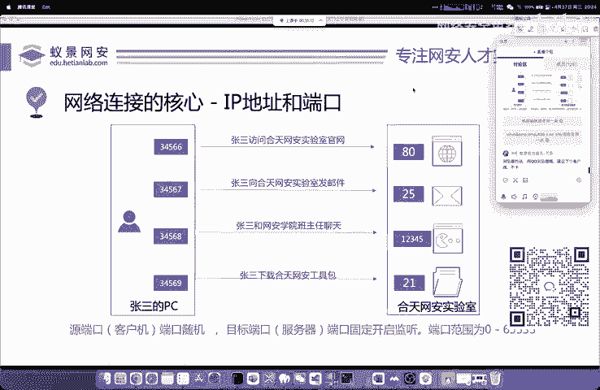

这叫NETSTATTINO啊INO这条命令是windows的。我现在发在讨论区了。如果你看不到的话，你可以直接嗯在讨论区中复制。

打开你的CMD然后输入nett state杠INO就可以看到我们windows操作系统啊，再开启哪些端口，这个nett state啊，这个命令啊，是在渗透测试中经常使用的一个命令。大家面试的时候。

也有很多面试中会问到啊，也有很多面试中会问到，这是个命令啊，大家可以了解一下就行。那其实渗透测试很多同学就会就去问啊，要不要去背，要不要去记这些命令，我觉得是没有必要的，因为太多了，就像你去学英语一样。

你学英语，难道你去背牛津字典吗？你去把牛津字典从第一页到最后一页全部背完吗？是吧？这个不可能是吧？这个不可能，那所以说呢我们啊就是去。查看啊这一个啊就是遇到了你就搜索就行。

就是整理好自己的一个学习流程和笔记啊，然后去遇到的去搜索就行。这个同学他去问这个麦克怎么去看哈，麦克是这个命令哈，NET杠啊IN然后杠PTCP啊，我发给你了，我发给你了，在这个讨论区啊。

在讨论区我发给你了，就是麦克的指玲，那个linux是这个，我都给你发一下吧。linux这个强见的参数啊，它的参数呢因为操作系统的不同，它是不一样的啊，这个没有办法。因为这个操作系统它们都是这个对手啊。

都是属于一个呃就是有竞争力的一个，他肯定要整点不一样的啊，这个没办法，也不是我们能决定的。哦，那我们了解端口之后呢，我们现在来简单看一下。好，这一个bsser以及svo的一个基础架构。

这个地方呢大家也其实很多同学也都听说过呀，其实你每天都在用，就是网站的访问时间。首先呢就是有浏览器有服务器，那你通过浏览器去访问百度，其实就是相当于去访问百度的这个服务器啊，访问百度的服务器。

那这个时候呢我们浏览器是如何向服务器发起交互，以及发起请求的，这是我们要注意的，为什么要去学习它呢？为什么我们要在万千的网络协议中选择网站的协议去学习？

就是因为大家在渗透测试中很大一部分都是对网站做一个漏洞的扫描，漏洞的挖掘和攻击。那你现在如果你都不清楚网站是怎么进行通信的那你就从何下手呢？其实对网站的渗透。都是对HTTP协议的相应更改啊。

这是一个肯定的事情。那下面呢我们就来简单了解一下这个关乎我们生活，大家每一天同学啊都要去用的。

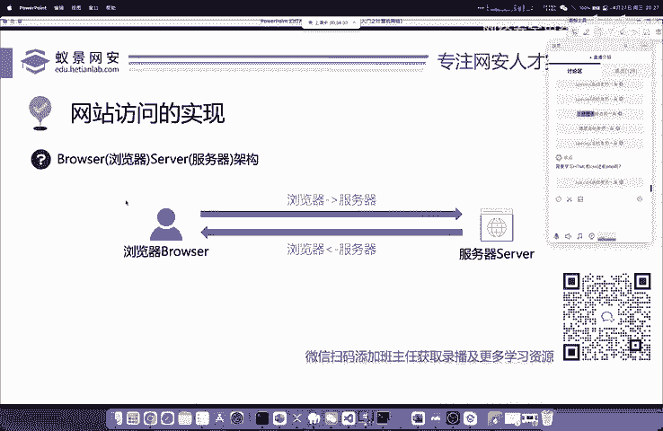