# 2024B站最值得看的黑客教程 ｜ 网络安全／渗透测试／内网渗透／漏洞挖掘／web安全／kali linux／红队靶场／CTF／信息安全 - P30：漏洞挖掘的工具Burpsuite安装 - 网络安全免费学 - BV1uBsTetEow

好，首先我把这个工具打开。O我们来看一下怎么去运行这个工具，怎么去安装这个工具啊。第一步非常简单，对不对？把这个工具呢下载到你的电脑里面啊，接下来我们就看一个课件啊。

漏洞挖掘工具的安装啊O那第一步啊我们在安装这个工具之前，那李哥先给大家讲一下这个工具是干嘛的啊，有人说啊，那这个工具是挖漏洞的那它具体是怎么挖漏洞的好，李哥在这里先简单说一下这个BP的一个原理。好吧。

这个BP是什么工具呢？好，要了解这个工具之前，我们先看一下我们网站是怎么运行的哈，我们每个人电脑上都会有自己的浏览器啊，谷歌也好，火狐也罢，还是IE浏览器啊等等，对吧？

你会在自己浏览器里输入你想要的内容啊，你想看片，你就输入片名，你想看笔记，你就输入笔记名，你想搜一些啊网站，你就输入网站的名字，对不对？我们会把这些信息通过网线发送给服务器，服务器在发。😊。

送给我们okK这个是我们正常的一个东西。比如说你想访问百度，对不对？😊，啊，你在你的浏览器输百度回车。好，那你的你这个你的这个百度这个信息啊，就会顺着你家网线发送给百度公司的服务器。

百思公司接收到你的请求之后，啊，就会返回给你百度里面的内容，对不对？就是这样一个流程，这是正常流程，对吧？就是你的电脑跟百度中间啊，就是只插着一根网线，中间一路畅通无阻，对不对？是这样一个流程。

那BP这个工具在哪里呢？啊，给大家讲讲，它是在这里的。😊。

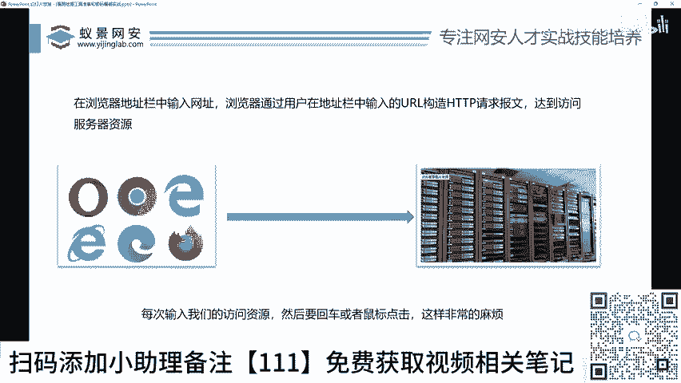

哎，在这里的看好了啊，BP是怎么运行的呢？哎，就是这样你看你的这个比如说你想访问百度，对不对？你百度的请求先发送给这个BP。😊，这个BP再发送给百度的服务器。

百度服务器再把数据返回给BPBP再返回给你的浏览器。哎，这样大家就非常好理解了。BP是不是类似于一个什么中间人。好。的肩。连起来打啊，连起来打一下中间啊对吧？也可以说你们是一个什么代理人啊。

这类似于什么？类似于比如说这就是个这个A是你对不对啊，这个B是个超市啊，那么正常访问是你去超市买东西，超市给你，你再拿东西回来，对不对？这是正常访问。那么这个唉中间有一个C，这个C就是一个中间人啊。

比如说你的女朋友，你的父母，对不对？你把钱给你的女朋友，你女朋友代替你去超市买东西，然后超市把东西给女朋友，你女朋友再给你哎，就这样一个流程嘛，对吧？BP他就是一个中间人啊。

把我们的流量在中间给他拦截下来啊，那么拦截下来这个流量之后，我们就可以对这个流量进行修改。😊，重放扔掉放行，对不对？比如说你女朋友你对不对啊，给了你女朋友10块钱，你去给我买包烟好，然后丢偷。

你女朋友直接把10块钱丢了丢地上了。哎，那你是不是一辈子都抽不到这个烟啊。哎，女朋友是不是把这个钱给丢了，那你访问百度啊，这你用BP把这个包一丢，那么你的浏览器啊，一辈子都访问不了百度哎。

是不是这个道道理啊，对不对？还有一个情况就是啥？哎，你给你女朋友10块钱哎，你说去给我买包烟去，对不对？这个烟多少钱呢，烟是100块钱的什么九五至尊啊，女朋友私自给你添到了90啊。

那女朋友给你10块钱买了一包九五至尊，哎，女朋友在这里是不是把你的钱放大了，对不对？同样对吧？你要访问百度，对不对？哎，你在BB上把百度改了啊，改成了一个小黄片的网站，然后呢咔访问一个网站。

然后啪回来哎明明访问百度，但是为什么访问了小黄片，就是这样一个道理，对吧？这个BP就是一个中间人的工具。所以这个东西对我们挖洞来说就至关的中间。我们的。😊，所有的调试，所有的安装。

所有的抓包都要在这个工具上进行完成。哎，就这样一个东西，对不对啊？

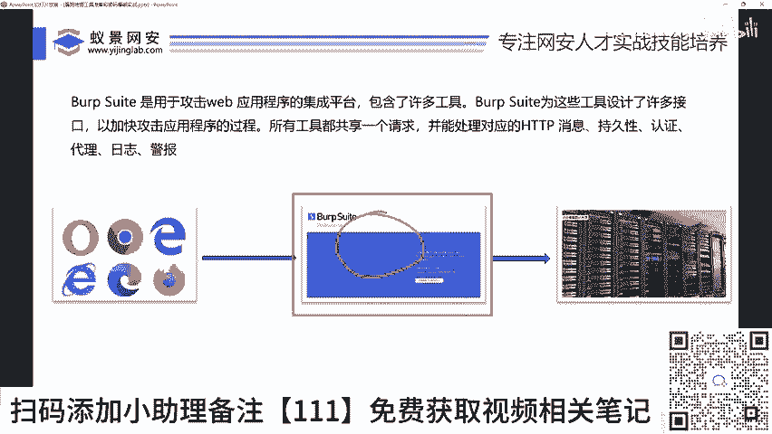

好，那首先啊搜稿是吧？好，首先在接下来哎我们就来看一下这个工具的安装。首先我们把这个工具对不对？啊，先放到我们的电脑里啊，先运行第一个这个star这个文件，对吧？START啊，这样的一个工具。

先把它star一下啊。😊。

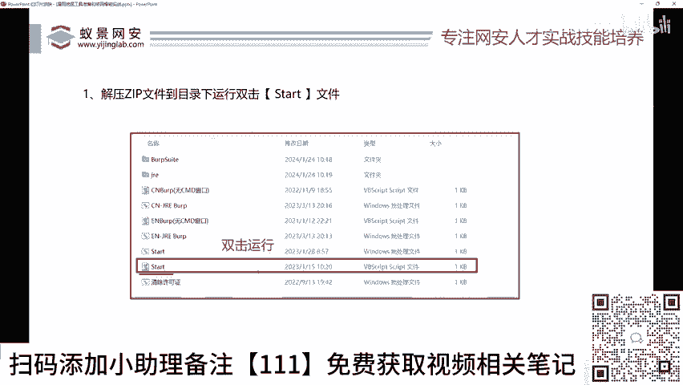

好，star对不对？啊，双击。好，大家不需要安装额外任何东西，对不对？双击之后，我们会弹出这样一个框啊，没有问题吧。好，我们来看第二步啊，第二步啊勾选log选项log选项在哪里啊，就是说这一块哎。

我们把这里跟这里都打上对勾，然后打一个什么打一个，打个run跑的意思，对不对？所以非常第二步非常简单，对吧？把这两个打上勾勾对勾，然后点击这个余润这个按钮啊，来，我们来试一下啊。

你看这里对勾打上这个对勾本来就有啊，我们要打上对不对？然后点击什么run，来，那么这个BP呢现在就会被运行起来，好，这个呢是激活程序，我们现在做的是什么激活，对吧？好。

运行起来之后来接下来我们来看一下非常重要的一个一个步骤，对不对？哎，我们要把刚才的那个加载器里的这样一段话啊，复制到BP的这个里面来哎，我们来看下怎么来哎先看打开了，对不对？好，我们先点击接受。😊。

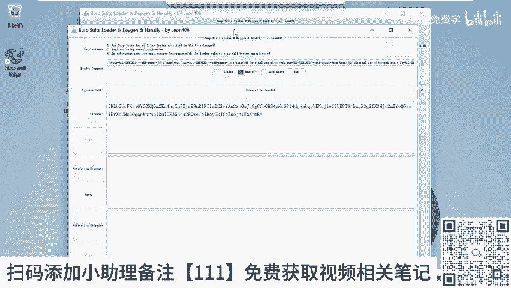

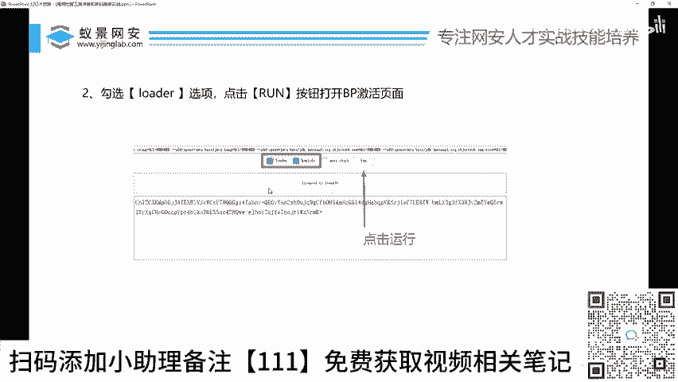

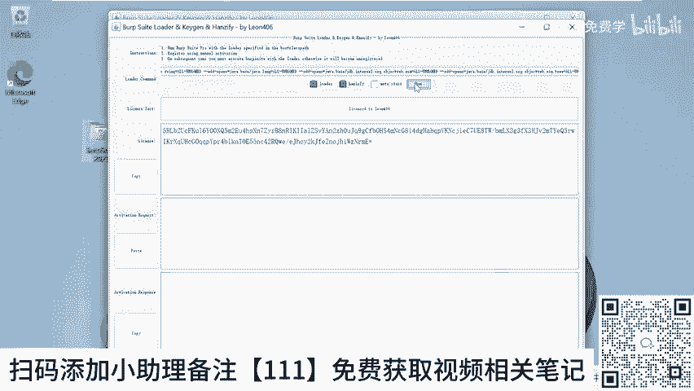

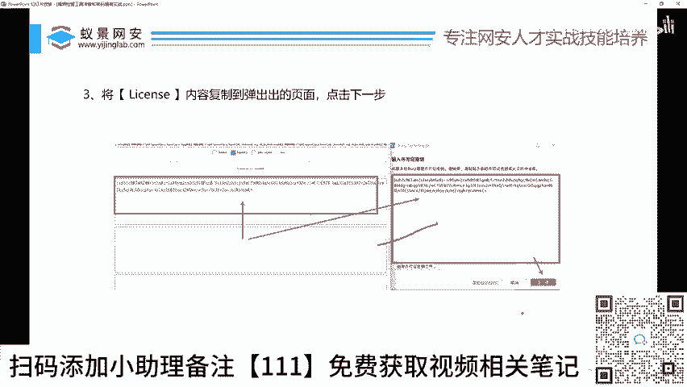

把这里面的这样段话看到没？就是这个刚才我们润润有润的这个工具这一块一段话，这样一段话，对不对？我们把它复制一下。😊，复制到哪里呢？复制到刚才哎打开的这个BP里面来，这个都都会把。哎我们把它复制进来啊。

那我在PPT里面给大家演示，对吧？把这里的内容哎复制到这里面来，对不对？然后点击什么下一步啊，点击下一步OK没有问题，来点击下一步啊。😊。

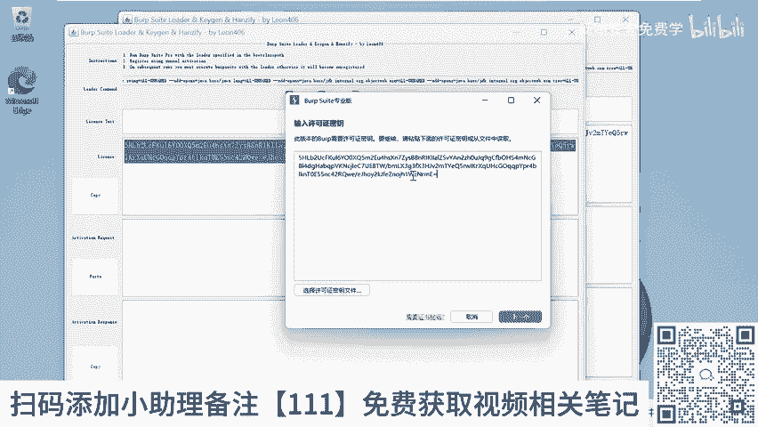

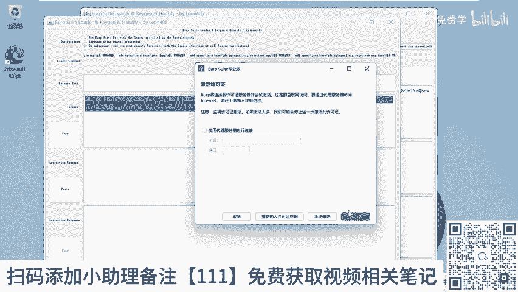

好，点完下一步之后，我们来看一下啊，我们要点什么手动激活。哎，要选择手怎么复制。有人问我电脑怎么复制controrl Ccontrol V啊，CTRL鼠标左下右右下角有个contrl，然后按住按个C啊。

就是复制，然后按个V啊，它就粘贴啊啊，会了吗？啊啊，然后我们选择手动激活啊，将这里面的这个东西啊，再复制到这里面来。OK我们来再看一下怎么复制，你看好，我们选择什么手动激活，对不对？

大家看一下手动激活点一下。😊。

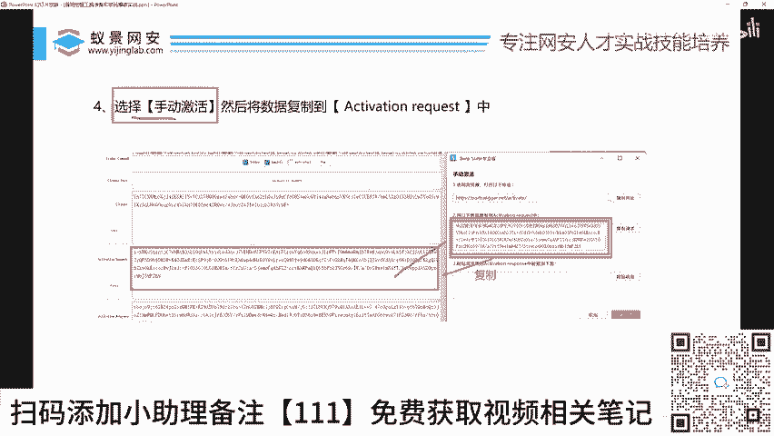

好，然后你看像这里的内容啊，我们把它全部选中啊，conttrol actrl C啊，复制一下，对不对？然后呢复制到哎底下的这里面来。

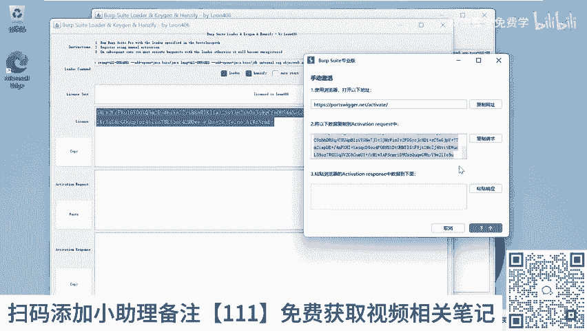

哎，就没有问题了啊，OK没有问题啊。有人说我电脑有没有我说了我们这个BP啊，它是自内置的java环境，你的电脑有没有安装java没有关系啊，所以不影响的啊，安没安装都不影响，好吧？好，这是第二步。

对不对啊？我们将这里面的内容哎复制到我们run这个工具激活器里面来啊。好，我们来看第五步啊，第五步就是啊将再将run里面的这一串内容对不对？复制到我们的BP的激活里面来啊。

复制到这个什么respon数据中来来给大家演示一波，对不对？好好，再将第下面这一行。😊。

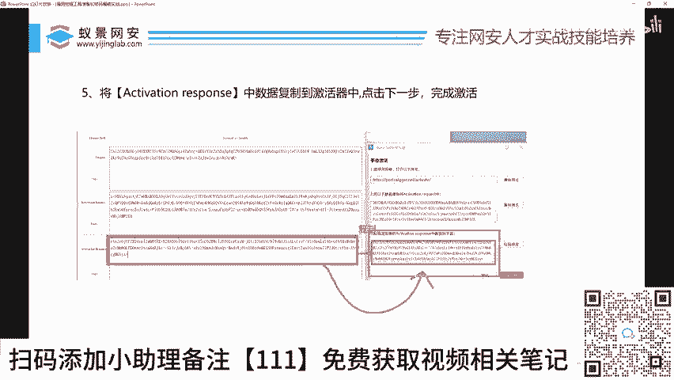

对不对？再复制到这里面来啊，蓝色这一块对吧？复制到这一块来啊，明白吗？哎，啊，然后我们点击下一个完成。好，现在我们的BP就激活了。我们点击下一个启动BP。😊，OKBP就可以用了。

我们每个人在自己的电脑上都可以轻松的激活你的bos。

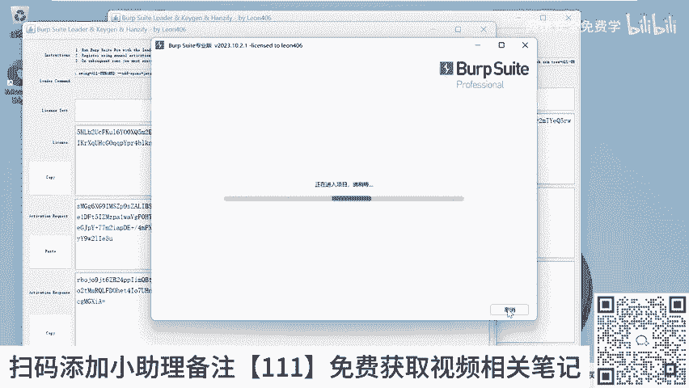

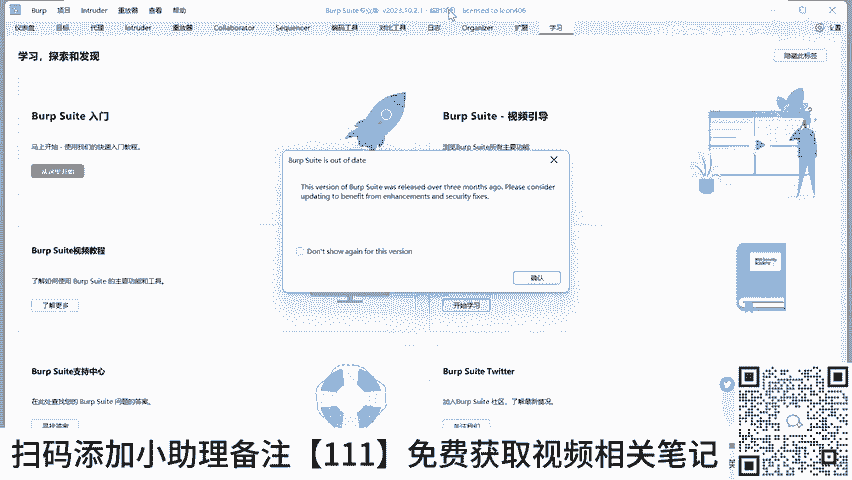

好，激活了。好，激活之后，我们把先关掉。😊。

好，那有人说了，李哥是不是每次用，对不对？我都要点击star去激活，不用这个star只用点击一次，你的这个工具就激活了。我说了这个工具你要买正版的话，得1000块钱，对不对？

但是李哥今天给到大家是激活版啊，直接激活，不需要花大家1000块钱啊，我们又血赚1000块，对不对啊？😊，好，那么等你第二次再想去运行BP的时候，对不对？我们干嘛呢？我们点击这个CN大家知道吧？

叫china的意思，对不对？叫中文版CN就叫中文版BPEN叫英文版BP啊。如果说你英文OK啊，你就点CN如果你中文OK你就点啊英文O空你就点EN对吧？englishCN就点chse对吧？好。

如果说我哎李哥我英语无型，我点一个CN就chinese BP啊，中文版BP无窗口啊，我们双击这个东西OK我们的BP都可以打开了啊，后面你运行BP就双击这两个键就可以了啊，要么运行中文版，要么运行英文版。

好，然后点击下一个下一个启动就可以了。OK这激活大家先不说你。😊。

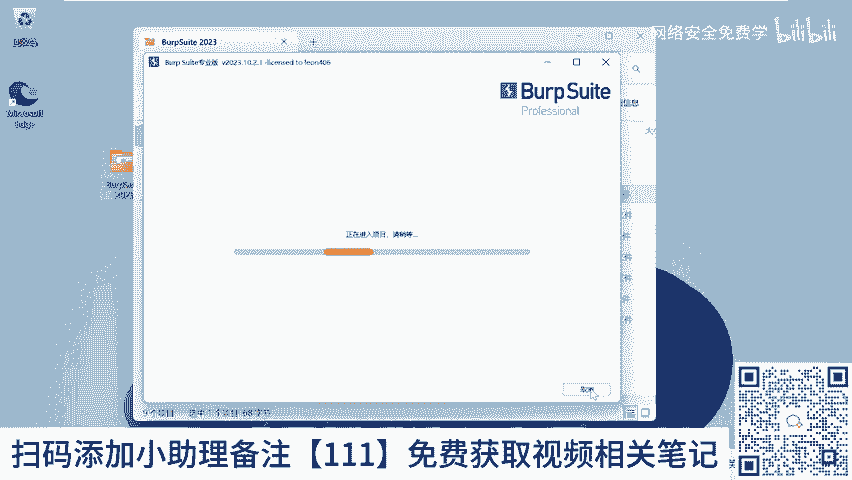

你先看懂没有？看懂了，扣个一好吧？有人说李哥这个BP怎么用啊？我不会哎，不会用没关系嘛，接下来就会教你嘛，你先给我看懂嘛，对吧？我在讲一加一等于2黑板写着，你看懂了吗？看懂了啊，看懂行。

看懂回家去做题去啊，就是这个道理啊，你不要说我没看懂。😡，啊，我没看懂吧不可能没看懂啊，就两个复制粘贴你都没看懂，那你肯定思想跑毛了，对吧？我们在这里就教了啊，再给大家再重复一遍，对不对？好。

先运行这个star啊，然后呢star完了之后呢，会运行这样一个激活器。然后呢激活器里把这两个勾勾选上，我们点击润就会运行我们的BP好，然后在激活器里面，这里有这样一段内容。哎。

我们给它复制到这个BP的这里面来啊，打开了这个窗口里面来啊，然后点击下一步好，然后再把BP的这段值啊，给它复制到激活器的中间这一块，对不对？好，我们的第四第四步第五步啊，再将底下的这张值啊。

再给它复制到BP里面来，然后直接点击下一步，我们就可以运行我们的BP了啊，激活人说啊李哥激活器在哪里，在百度网盘里面已经给大家提供了啊，在我们的课前预习资料里面，对不对？好。

比如说这个删除旧文件直接点击删除就可以了哈。😊。

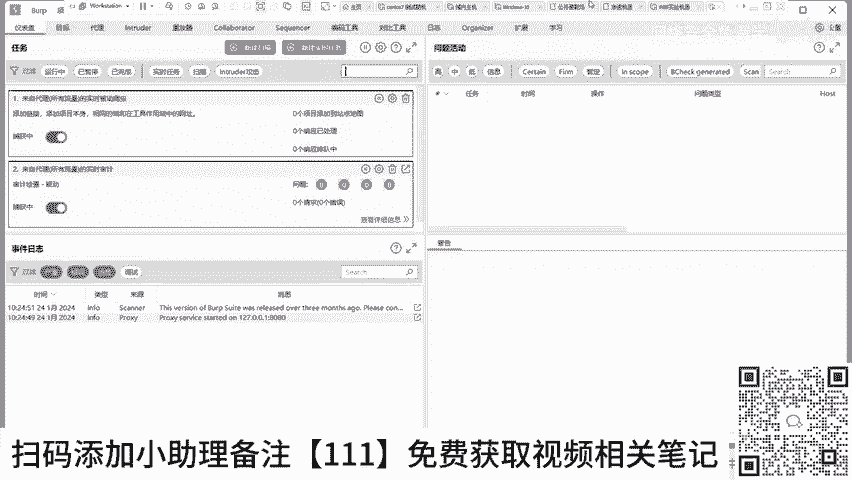

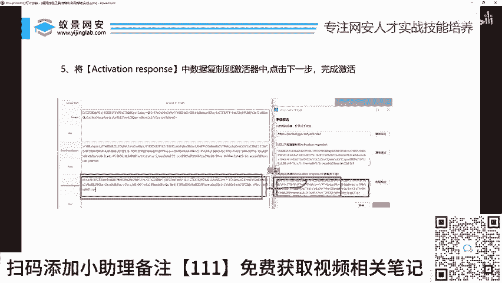

OK那我们来回头回过头来再看一下。好，那么李哥有人说哎李哥，我现在BP已经运行好了，对不对？好，那怎么去用，怎么去搞，对不对啊？然后我怎么去哎呀，我怎么哇呀，我不会读英文啊，这些新建扫描啥意思。

目标什么意思，带什么意思，我一个都看不懂啊，所有的字分开能看懂问题活动我能看懂问题我能看懂啊，就是问题嘛，活动我能看懂，就是跑步嘛，问题活动连起来，我就看不懂了啊，目标我能看懂什么站点地图看不懂。

打开内嵌浏览器看不懂没有关系啊，你不需要看懂啊，我接大家讲哪里，你把讲的东西看懂就行了。其他东西都是没啥屌用的东西啊。O那我们来看一下BP的简单使用手册啊。😊。

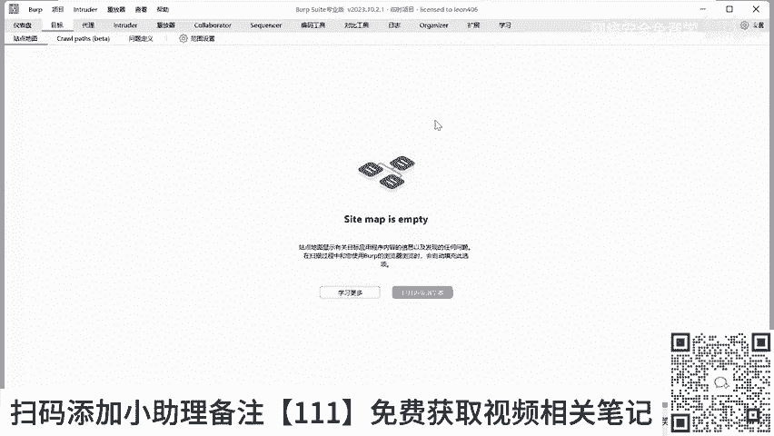