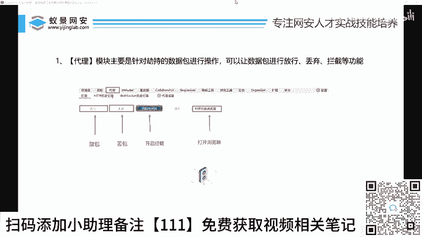
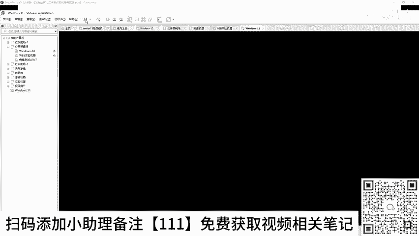
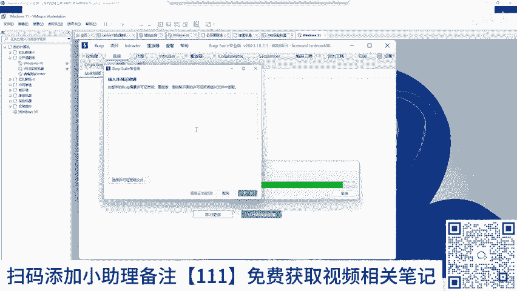
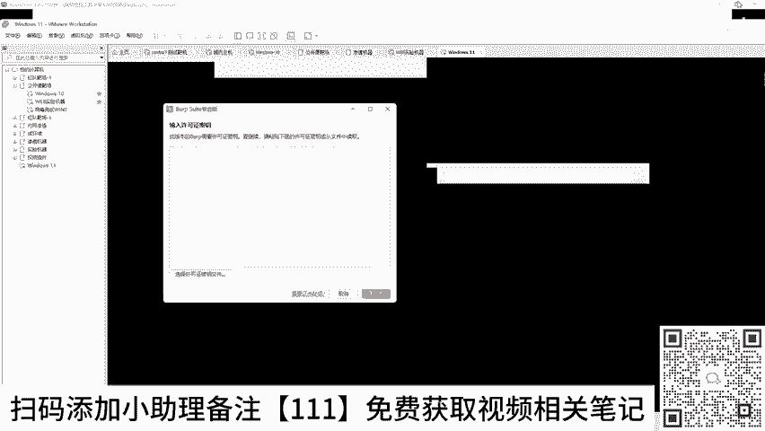
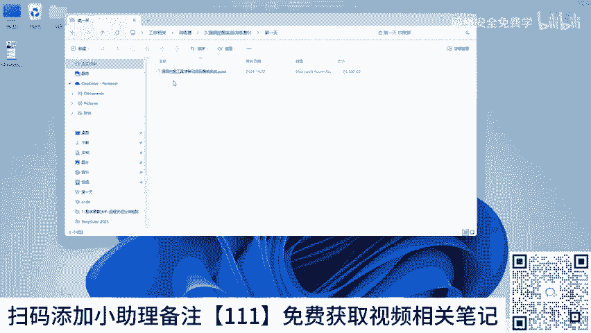
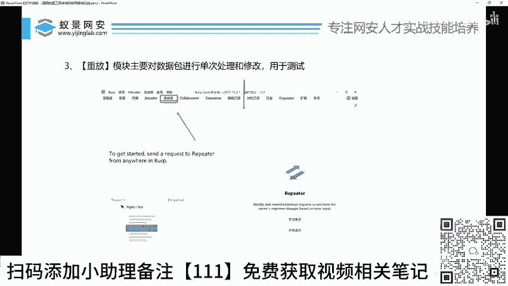

# 2024B站最值得看的黑客教程 ｜ 网络安全／渗透测试／内网渗透／漏洞挖掘／web安全／kali linux／红队靶场／CTF／信息安全 - P31：BP工具的基本使用操作指南 - 网络安全免费学 - BV1uBsTetEow

好，那么对于BP初学者来说，BP要在哪里，或者说BP要怎么去用BP都要用到哪些点，对不对？好，李哥在这里给你说一下啊，有人啊这样啊，如果大家不知道这个激活器在哪，激活器就在那个BP的安装包里。

直接给它解压出来就有了。百度网盘里面啊，把BP工具解压出来啊，就有了啊。如果说你想要m克的版本，你可以联系一下班主任去领取一下，好不好啊？😊，OK我们接下来看一下这个BP小工具的操作指南。

那么BP的模块非常多。今天我们只要学三个好了，多了不用学，因为没啥屌用，只要学这三个就能完胜我们百分之八九十这样的一个工作日常或者挖动日常，只要掌握这三个功能啊，基本上就掌握了BP对不对？哎。

基本上掌握了BPO来，我们来看一下第一个功能就是我们的代理这个模块，代理在哪里呢？哎，来李哥在这里给大家展打开一下，好吧，那么我就把我的讯机这个安装BP这个过程关了，对不对？我直接用我的实体机啊。

给大家去展示这个BP啊，因为我实的实体机运行起来，速度能快一些啊，大家看起来会更加丝滑一些啊，在训机里面还要放大放小。你你这运行起来慢，一会跑的时候也比较慢啊，跑一个数据啊，我用我实体机两秒就跑完了。

我用训拟机里，我要跑个一分钟啊，那这样不就浪费了大家时间吗啊。😊。

好，等这个关完。好，在这关的期间，我们先打开BP，对不对？BP好，这里我的这个已经激活过了啊，我点击这个什么CN啊，OK那么等待BP打开。😊，啊，你看我这个CN，你看这里又需要我干嘛，哎，又需要我激活。

对不对？那我李哥在这里再给大家演示一遍，激活，好吧。😊。

好。把这个讯息就关掉了啊。好，再来一遍训练营。漏洞挖掘第一天哎，不对啊，这个工具好，再来最后一遍好不好？好，点击这个star。

你看。啊，勾选上认一下。好，我们把这个密钥看到了吗？哎，再来演示一遍啊，密钥复制进来，下一步手动激活复制复制进来。复制进来复制进来，下一步完成啊，就这么简单啊。😊，好，这个激活之后，哎。

我们就可以正常去打开我们的BP了，好吧。😊，好，我们来运行一下。好，我们把这个不要的东西删掉，好不好？哎，删除掉。确定。好，OK点击下一步启动。训你子。啊，那这个激活来我们来看一下这个激活里面。

我刚才说了，我们大家不需要掌握那么多，只需要掌握三个功能，对不对？第一个功能就是这个什么代理的这个模块，我们把这个代理这个模块打开，代理这个模块里面，大家看一下，主要要掌握的是什么？哎，就这四步。好。

这四个是什么东西。第一个是这个东西，大家要记住，打开浏览器。就说后面我们要进行挖洞的时候，浏览器一定要从BP里面打开。如果说你不从BP里面打开，你会非常麻烦，你需要配置证书，你需要去配置代理。好吧。

很多人搞这个就搞一天啊，所以又浪费大家时间了。干脆大家直接用内置浏览器。内置浏览器不需要安装任何东西，不需要配置任何东西，直接双击就能用啊，所以我们一会儿挖洞的时候，一定要记住，在这里打开浏览器。好。

那这里面还有三个功能叫放行丢弃，开启拦截，这个是什么意思呢？哎，那给大家在这里演示一下。好，我们先在这里打开浏览器好。😊，好，那这个拦截开关呢我们可以选择啊，比如说勾选上它就变蓝色了，对吧？

这个就是开启拦截了。那么假如说我现在访问百度。😊，你看。😊，比如说你看3W点白度它回车，大家可以看到这个页面一直迟迟没有响应百度。为什么？因为百度的这个数据被我们拦截了。那么李哥刚才在这里也给大家讲了。

对吧？就类似于什么呀？是不是类似于这样，你看我在浏览器里访问了什么？百度，那么BP这里是不是已经给它拦截下来了，为什么拦截下来。因为我们这个拦截的按钮是开着的，对？如果你它关着它就不拦截，它就放行了。

对吧？好，那么拦截下来之后，我们可以对百度的这个数据包进行什么放行或者丢弃，什么叫放行，什么叫丢弃，给大家解释一下啊，看比如说我访问百度了被拦截了，对吧？你要点击放行好，那这个包就跑到百度了。

然后你的浏览器哎就收到了百度的包，如果你这个包到这里你点击放行，那么这个包就被插掉了，好吧，那这个数据包就到不了到不了这里，那么你的浏览器就访问不了百度啊，就这么简单，就是类似于一个闸杆。

你可以让这个数据标放弃过去，有让它不过去啊，你看来我们来。😊，看一下你看现在是不是你看这个浏览器一直在转圈圈，对吧？还等待这个反应。我们点击这个放行。😊，你看哎你看我浏览器这里立马就显示出来了白鹭。

对不对？那就点击什么给它放行了。好，那假如说我们把这个拦截关掉给它关掉。好，那我们就可以正常访问百度。哎，虽然这个数据包过BP，但是它不拦截啊，就是类似于什么？

类似于我们开车的时候那个这个这个这个那个高速度收费站吧，有个干口，对不对？你把它节假日对吧？你把它开开不收费啊，把它关了等于不收费，车随便过随便过啊，它有杆子，但是它不拦截，对不对？

那平时呢这个杆子就给你下来了啊，你挖洞的时候一定要什么点击开启拦截，对吧？这样才能拦到我们的数据包，我们才能去干嘛，才能去挖洞，好吧，这是第一个功能啊，就是这个功能代理这个功能啊，大家什么东西都不用调。

对吧？只要知道放行丢弃跟开启拦截这样个功能啊，再打开浏览器就可以满足你的挖洞需求了啊。😊，好，那接下来我们来看第二步啊，叫in true的模块啊，那么这个in出的模块是我们后面。啊。

有人说让我放点片是吧？好，音出的模块是干嘛的呢？给大家说一下啊，这个模块是后面我们挖动的时候最最最最最常用的一个模块。这个模块是对数据包进行批处理的。好，什么叫批处理啊，那样给大家说一下啊。😊，好。

在这里给大家讲一下什么叫批处理。好，那么比如说哎比如说你看我在这里呢哎是一个登录界面啊，我在登录一个地方的东西，对不对？比如我用的账号叫什么addmin啊啊，我的密码叫什么？123。😊，那大家看一下啊。

那么这个时候呢。😊，啊，我的这个浏览器对不对？是不是把这个账号密码哎发送给BP了，BP把它拦截下来了。好，那么现在呢我也不知道这个密码是1234还是12345，对不对？我就可以怎么不断的去试这个东西。

我把它改成什么？在BP里面把它改改成456改成789改成ABC改改成ABCDEFGABCDEFGHIGQMNOPQ对不对？随便改，对吧？那然后你再点击放行。

那么这个时候对方服务器收到账号密码就变成了你改你改的之后的样子了，对不对？那这样的话，我们就能测试这个账号跟这个密码到底是什么样子的，对不对？到底是123456还是7890，对吧？

这样的话会有一个这样一个。😊，爆破功能，对吧？比如说我们想去爆破一个网上的密码，都可以用到这个BP的功能。O好，那这个是什么音抽到模块啊，它主要用于挖动。那么这个音出的模块在哪里啊？在这一块啊。

一会儿教大家怎么去用，好不好啊？好，最后一个功能还有一个什么要重放功能那么重放功能啊，是什么？也跟刚才的功能一样啊，只不过它一次只能改一个啊，什么意思？比如说我们想去测这个网上的密码，对不对啊？

你要放到重放功能里面，它一次只能测123，要么测123，要么测456，一次只能做一个，要是在音出的模块里面，它能把12346789啊，连续100个1000个1万个，甚至10万个啊，批量的给你全部测完啊。

所以说这两个功能是什么区别？应出的跟repeer什么功能啊，一个是批量测试啊，批量测试用来跑跑数据跑密码的，一个是单个测试，单个测试，只是我们做单个测试的案例，来理解到没有没？理解的小伙伴。😊，扣波一。

只要知道这三个功能就可以了。代理是用来抓包的啊，in出的跟repeer是用来修改包的，用来测试数据包的，知道这三个就可以进行挖动了。懂没懂？懂了，扣个一。OK没有？

OK没有啊？O了，对不对？OK那接下来再给大家最后讲一个东西，对吧对？就是我们非常重要的一个东西啊，就是哎有人说哎李哥，我现在懂了啊，我好像懂了，好像也没懂啊，那么我也知道这个百度这个东西。好。

那你我说哎我把它重发到这个repeat啊。好，那你说我现在拿到这个数据包了，这里面到底是什么意思呢？我啊这都是什么意思呢？啊，这是什么意思呢？啊？我挖洞的时候怎么去看这个东西呢？怎么去改这些东西呢？

对不对啊？这个数据包到底是啥呢？啊，什么是数据包呀，什么叫抓包呀，对不对？哎，有些人可能会产生这样的问题，为什么你会有这样的问题，那是因为你还不懂网站的运行原理。😊。

