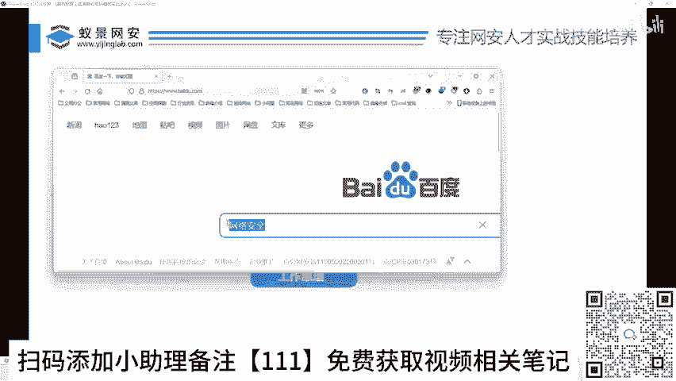
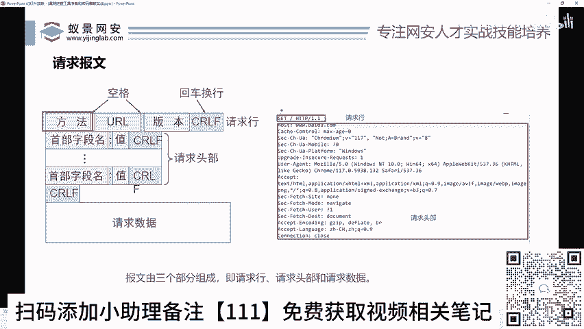
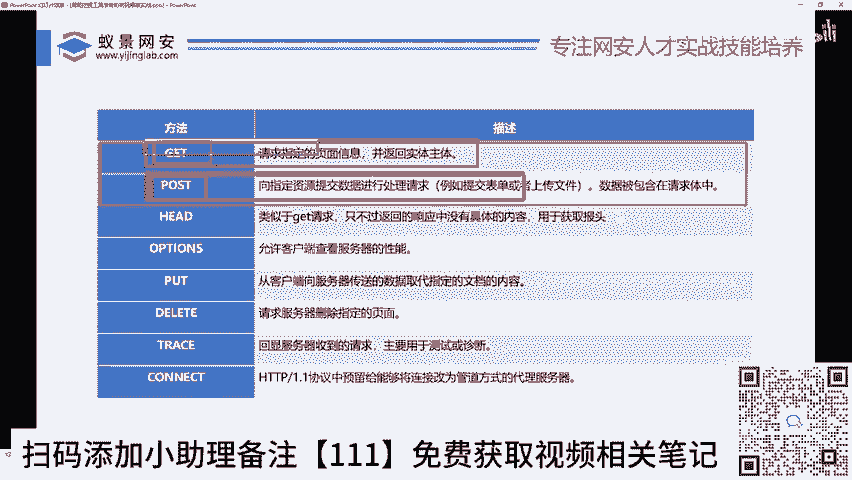
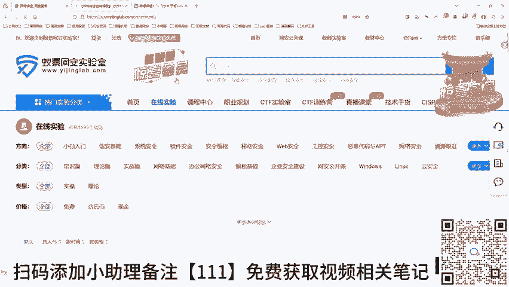
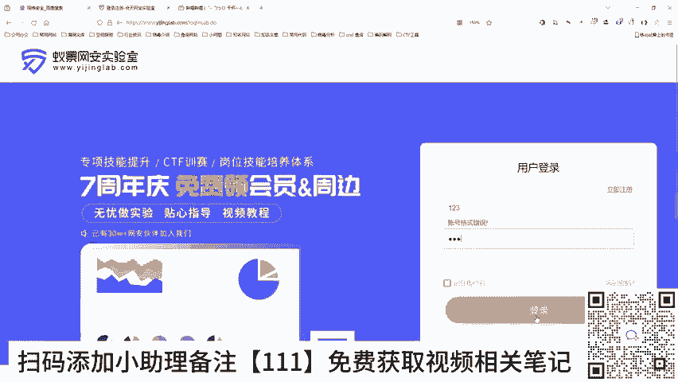
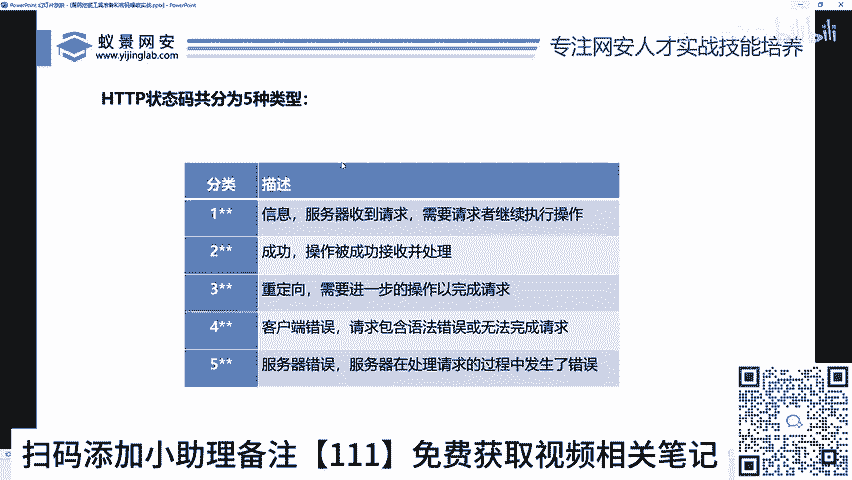

# 2024B站最值得看的黑客教程 ｜ 网络安全／渗透测试／内网渗透／漏洞挖掘／web安全／kali linux／红队靶场／CTF／信息安全 - P32：网站运行原理和HTTP协议的介绍 - 网络安全免费学 - BV1uBsTetEow

跟这个HTTP协议，只要把这个懂了，okK你就可以立马去进行。漏洞挖掘O。好，那我们来先看一下什么叫网站运行原理，或者什么叫做HTTP协议。好，HTTP叫做超文本传输协议啊，也就说李哥啊。

我这我记得我之前这个上学的时候啊，我们老师讲协议啊，这个协议那个协议这个协议是什么啊，所以我我可以负责人告诉你们，很多人大学学了一两年都不知道协议是干嘛的。或者说他理解不了协议。

我告诉你一个非常通俗易懂的案例，你就知道是协议是什么协议就是语言，你可以这样理解。比如说你看。😊，A是中国人。B是中国人，那么你A跟B要进行交流，你们用什么协议来A跟B交流要用什么协议，大家知道吗？

用的是什么协议，有没有人知道你是中国人啊，没错，有人说的中文，对不对？没错，那么中文就是一个协议。😡，是不是中文啊，是不是中文啊，是不是chese话呀啊，总不是小日子的话呀，不是英语话呀，对不对？

不是俄罗斯语吧，对不对？你中国人得应跟中国人交流，那得用中文啊，是不是哎，那A跟B之间，你们俩个要交流，要进行谈论，要用中文哎，就你们的对话语言。好，那这里一个问题了。你的浏览器要跟百度服务器进行说话。

你要说话，对不对？你要告诉他我想干嘛，你要干嘛用什么语言，哎，我们用的是什么HTTP语言啊，你可以理解为HTTP协议哎，那就是这样一个东西啊。

它就是一个什么他们之间对话的这样一个东西O你看被设计用于什么web浏览器跟web服务器之间进行通信的一种什么协议啊，不能说它是一种语言啊，我们要规范点啊，它是一种协议啊。

也就可以理解为你的浏览器跟你的服务器进行通话的一种东西啊，叫HP那么你想想我们要通话，我们要劫持，对不对？就跟你要对吧？你是A，这是B，这是C对吧？😊，让你女朋友给你买包烟，你得说中文吧，女朋友给我啊。

给谁给我买啊，不是喝对？买买什么买一包烟，不是两包烟，对不对？买一包10块钱的点520块钱的玄赫门，是不是这是话呀，你看让你你你去给我买一包20块钱的玄赫门这个话里面是有主语谓语对吧？是有层次的对吧？

因为我们平时交流，我们是能知道的。那你女朋友就能听得懂啊，女朋友可以把那句话改了，对对？啊，改成啊去给我买一包10块钱的烟，去给我买一包100块钱的烟，对吧？女朋友可以针对你的话进行修改啊。

这样道理是一样的啊。😊，好，那么接下来我们就看下这个协议啊，到底长什么样子，对不对啊？那么这个HTTP协议啊，跟我们的中文一样，它也是有这样的一个迭代过成的。就比如说我们在最早的时候用的是什么？

但像那个秦朝时候啊，用的是什么小传是吧然后有甲骨文小篆有宋体，对吧？我们的中文汉字是不是有也是经过这几天年有发展的啊，也可以理解为有版本的，对不对？在很在往民国这样推，我们还用的是繁体字，对吧？

现在用的是简体字，对吧？那HTP协议也是一样的啊，最早期有这个0。9版本啊，它的这个功能比较少啊，然后要诞生到了1。0版本啊，现在呢诞生到了1。1版本啊，那不管是哪个版本。

那么现在默认使用最多的是哪个版本是1。1版本啊，说啊那那么多版本版本有什么好处对不对啊？那这个版本不同有什么好处啊，版本不同，也就代表它的功能更多啊，它这个语法更多文字更多请求的方式。😊，更多。

传递的效率更多，传递的信息的内容大小更多。OK就类似于中文，对吧？我们现在发展到这种简体，对吧？它说话起来更流畅，人听起来更直观啊，你总不能天天给你说话，知乎者也吧啊，将上下而求所啊。

不能给你背出师表吧，那么你都听不懂，是不是啊，那你你用繁体就特别就是那种文言文的话，你就特别考验人的一个什么可能一个学历，对吧？但是你用白话文，我要去拉屎，我要去吃饭，我干饭对吧？对吧？

你看听起来非常舒服，对吧？你看这就是语言发展的一个魅力啊，同时这个ATTP1。1，它就跟着类似的对不对？它发展到了一点1啊，它的这个功能更完善啊，大家之间交流起来更加的方便啊。😊，OK好。

这是它的版本啊，至于具体的版本，我们不过多去讨论，对吧？我们只知道这个版本它是有一个迭代的过程的啊，现在默认版本是多少1。1这样一个版本就O就是K了啊。好，那么知道这个版本之后，来。

我们来看一下ATTP协议。在对不对？在我们的这个实际的通信中到底的工作原理长什么样子的。好，首先呢我们有一个客户端客户端是什么？就是我们的浏览器。好，这里给大家打开一个浏览器啊。😊，好，我们以百度为例。

对不对？你看3W点。啊，百度点comM好，这是我们浏览器，对不对？浏览器就是我们自己的电脑，一般会叫做客户端，对不对？好，那么客户端。哎，我会在这里，比如说我在百度里面什么看个片儿啊，我们不看片。

我们看从我们我们做网络安全，对不对？比如说你想了解网络安全相关的一些内容，对吧？啊，这是你要搜的东西，对不对？我们点击回车好。😊。

好，在你点击回撤的这一瞬间，哎，你的这个网络安全的这个请求，对不对？就会沿着的网器发送给什么？这个服务器，这个服务器是哪家服务器啊？啊？是百度的服务器，对不对？因为你在用的是百度啊。

那么如果你在这里用的是B站。

啊，比如哔哩哔哩啊，你在这里搜。😡，网络安全对不对？那么你的这个内容是从哔哩哔哩搜的，对不对？你在百度搜网络安全，你是从百度搜的对吧？你从谁你想在哪里搜，那谁就是服务器。那你在你的电脑上，对不对啊。

发送网络安全给谁了。比如说你给这个百度了。好，那么百度就会返回给你这个什么客户端或者你的浏览器网络安全相关的文章等相关东西，对不对？好，那么在这个过程中啊，发送网络安全的这段话。

就叫请求我请求你给我看一下网络安全，对不对？服务器接收到你的请求之后，就会给你响应OOGOK没有问题啊，大家都是好朋友随便看，对不对？你看回车的一瞬间就完成了什么？😊，响应跟请求啊。

你看我们收到的网络相相关东西，对不对？你看我们在回车的那一瞬间。😊，对吧网络全过去了，那服务器收到之后呢，就会给我们响应。哎，响应完了之后，你看这里就会哎对不对？有这么多的字，对吧？哎。

就是有这么多字啊，HTDB也跟HTBS都是一样的啊，只不过两个可能协议上有一些加密问题啊，原理上都是一样的。😊，啊，明白吗？哎，明白吗？这就是个请求响应，对不对？

那么这个请求这里面就包含了什么网络安全等你要搜索的相关东西。好，这个叫请求啊，大家知道ATP分为请求跟响应两个数据包，哎，就可以了，这就是他简单的工作原理啊，就跟就比如说这是你啊，这是你女朋友。

你给他说句话，请去楼下给我买一包120个人的玄赫门。😊，对吧。你女朋友肯定回答你啊。好的，没问题啊。是的，好的，亲爱的，现在就去给你买啊。你在家打游戏抽烟，我给你回来再按个去泡个脚，对不对？哎。

你就完成了这样东西，对吧？你的女朋友要可吗？给你反馈。OK我知道了，我现在就去啊，他不能不说话，你说去给我买吧，小哥们，他不说话。😊，哎，他不说话他不说话他不说话怎么办？他说是吧？那不说话。

你也不知道他听没听见，对吧？那就很尴尬了，对吧？所以他必须要有响应啊，必须要有响O好，那接下来我们就来看一下什么啊，看一下这个什么请求跟响应的豹纹。哎，我们知道在这个互联网上对不对？哎。

这些数据我们一定要能看得懂啊。那么这个请求豹纹长什么样子啊，这个豹纹啊，不是黑丝豹纹啊，不是那种豹纹啊，是这个豹纹啊啊，回报的豹，哎，是这个纹啊，你们可不要豹纹我靠豹纹。😊，啊，不是那个豹纹啊。

不是那个豹纹啊，是这个豹纹啊。那这个请求豹纹是干嘛啊？其实就是我们啥，其实我们就是我们客户端给这个服务器说的话啊，说的什么话呢？用这个HTB协议说的话。

我们得把这个话要能看懂才方便我们去干嘛进行抓包好吧。好，那么来我们在里抓个包，先看一下，对不对？首先我们打开什么，打开这个代理，对不对？😊，好，我们点击内置的浏览器。😊，我们还是以百度为例，对不对？

3W点百度点com对吧？我们点击拦截好，回车好，这里是不是拦截到了什么？请求报文，对不对？请求报文是什么？是不是你要访问百度的这样一段话？好，我们看一下这段话长什么样子。😊，哎，就长这样，对吧？啊。

就这样这样，这就是豹文，对不对啊？我们一会儿我们就是通过网线，你的浏览器把这个发送给百度的，对不对？百度收到这个东西之后，就知道了你要访问百度的官网啊，然后你一放行啊。

你的百度的官网立马在你页面上就会显示出来啊。就这样的话啊，就是它的豹纹啊，类似它的语言，对吧？好，我们来要去了解这样的话，分析这样的话，看它到底什么意思啊，我们对照着来看一下啊。😊，好。

首先这段话的第一行叫做请求行OK叫请求行啊，中间这个东西叫什么叫请求头。下面这个东西里面这个东西叫什么？叫请求数据。啊，我们逐步去看这个非常关键。好吧？好，第一个叫什么叫方法。好。

我们在这里能看到方法吗？第一个ge头。啊，什么叫ge方法是啥啊？方法就这样的啊，这是A，这是B啊。😊，你说让你女朋友给你买一包烟OK你得告诉你女朋友，我让她怎么去买烟，你是跑着给我买，还是？😡。

坐着给我买，还是坐飞机给我买，还是坐火车给我买，对不对？得告诉他买用哪种方法去买烟。O那么对吧？那我们这个请求的方法比较多，所以这里告诉的方法是什么？get方法啊，你说get是什么方法呀？啊。

你不管他什么方法，对不对？你你就就知道就get就行了啊，那方法有很多种啊，有get有post，对吧？有put有delete，对吧？我们常用的就是get跟post啊。😊，好，用的方法是get啊。

get大家记住啊，这个功能比较小啊，那get一般什么什么用啊，一般我们访问网页的时候用啊，就是我们点击鼠标点击访问哪个网站，点击哪个视频，用的都是get什么时候用post一般是在提交数据的时候啊。

比如我们输入账号密码修改用户密码对吧？进行文件上传的时候，一般用的是post啊，所这个get跟Po用的比较多啊，好，这是方法，对不对？第二个呢啊，这中间呢是不是大家看一下是不是有个空格啊啊。

我们看到看到这里面是有个空格O这是空格我们不用管啊好，这里有个UL啊URL是啥啊，就是这样，这个是啥，它这个啥叫根叫根目录，那这是什么意思？就是访问百度网盘的根目录啊，就是它的第一个文件夹啊。

因为我们知道百度的服务器里面，对不对？它有很多文件夹啊，我们访问的是它的初始的那个文件夹啊，是不是好好，接下来有个什么HTTP版本。😊，版本我刚刚说的ATDP是不是0。91。1啊等版本。好。

这里我们能看到那版本哈，是不是HTTP斜杠1。1版本啊，1。1。所以这个语言它是用get方法，访问的是哪里？访问的是根目录啊方然后呢。😊，版本是1。1OK那么大家记住，这后面还有一个什么回车换号啊。

在这里要回车一下啊，回车下来好。那么下面的这些东西叫什么东西呢？哎。😊，这个东西叫什么叫请求头。哎，请求头。这个大家一定要记住。后面我们挖洞的时候要去改请求头要去改请求行的啊。好。

那么这个请求头长什么样子，我们在这个百度里面是不是能看到哎，它就这么多啊，它的格式就是哎前面一个东西，然后冒号后面一个东西，对不对？我们可以在在这里面给大家写出来，对吧？一个首部字段名，然后一个冒号。

然后一个值对吧？好，这里面就标明了等相关信息啊，主谓宾就在里面了，对吧？比如说你看地址啊，你要去访问哪里呢？哎，这里写的house地址是什么？3W点百度点com点com对吧？你的身份是什么身份呢？哎。

这里你的身份信息，就是你的浏览器信息啊啊，什么ID啊什么对吧啊？还有什么信息，哎，你的user agent你的浏览器是什么型号，哎，我们可以看到啊，是什么火狐啊，对吧？cme呀，对吧？11。7版本。

对不对啊？比如说cookie是啥cookie呢就类似于一个嗯身份认证信息。😊，啊，你先你这里不懂，你先没关系啊，我们往下看，对吧？我们能先能看得懂的对吧？这里是什么是浏览器的信息，对吧？还有什么语言。

对吧？就是服务器能接受什么语言啊，有什么文本啊文件呀，图片呀，对不对啊？然后还有你的这个windows是windowslin对吧？windows对吧？好，这里面就是的请求头哎，请求头，哎。

理解了请求投啊。😊，O那个豹文啊，其中呢还有一个东西啊，就是数据啊，像我们现在访问百度还没有数据，对吧？一会儿挖动的时候给大家去看看这个数据，对吧？啊，所以后面还这个数据，一会遇到再给大家去讲解，对吧？

所以我们这个豹文其实分为三部分，对吧？请求行请求头部，哎，明白吗？哎，这是请求豹文好，请求豹文看完之后，我们再看一下响应豹文啊，就是说我们现在是不是要发送给百度的，我们先把它放到这个重放器啊。

我们怎么把这个数据包发送给这个repeer跟重放器呢，哎，我们就右键右键对吧？这里有个repeer，点击一下这个重放器就变红了，对吧？我们点过来哎啊，在这里呢就是它重放器哈，我们点击发送。😊，哎。

大家看一下。你看好，这里是不是对百度的请求啊，这个是什么？是百度对我的响应啊，百度对我的响应对百度返回给我的东西，对不对？我这里是请求百度，这里是什么返回百度给我的相关内容。

兄弟们来看一下OK那这个叫什么包，这个叫我说了是不是分为请求报文跟响应报文，那这个叫什么响应数据包啊，我们来看一下这个响应数据包到底长什么样子，哎，什么的响应报文。好，首先第一行叫做状态行。

那么这个响应报文同样对吧？第一个叫版本，你看我们这里标明了是吧？HTT1。1版本状态码是什么？状态码就是代表响应成功了还是没有成功，失败了还是怎么了，对吧？200就是成功了啊。

一会儿告诉大家这个状态码的具体含义，对吧？好，我们在这里给大家再截个图。来，我们来看下这个响应报文。😊，啊，第一行版本号啊，现在通信语言是不是1。1版本？😊，200就是OK就是OGRK可以给你看。

对不对？OK啊，200OK啊，就是成功的意思，对吧？然后后面是什么呢？哎，后面就是服务器返回给一些数据头，这些东西啊基本上在挖洞的时候没有太大用处，对吧？这个没有太大用处啊。

就这些东西都是服务器固定返回给你的，你不需要啊，不需要听啊，那么其中有个最重要的是啥，就是底下这个东西了，对不对？底下这个东西就是百度给你响应的页面啊，页面。😊，啊，叫什么叫享应数据，对不对？来。

我们来看看这个页面。哎，大家来现在先看一下啊，你看这底下这个东西什么东西啊，其实就是我们百度浏览器，大家能有能用眼睛看到那个白色的那个搜索框啊，它其实就长这样啊，其实其实就长这样，不信的话。

我去我给你复制一下啊，这太多了，你看。😊，你看这非常多啊这非常多，哎，就这么多，看到没？😊，啊，这个东西是一张代码，这个是由程序员写的，对不对？就是你访问百度啊，那程序员来就把这张这些内容全部给到你。

那么给到职业给到你，你看不懂，对不对？你需要用浏览器去看。那么浏览器里面长什么样子来，我们你看放行一下。😊，哎，看到没？就你用眼睛能看到这个白色的地方，看到没？白色的地方，哎，就是刚才给你看到这个豹纹。

啊，就是这里面这些豹纹啊，它是代码，对不对？这些代码你用眼睛看不懂，但是这个浏览器能看懂，它看懂之后就解析了给你。😊，成为这样一个白色的框框啊，然后呢你就在里面可以进行操作了。哎，理解没啊。

所以让你直接看你看不懂，但浏览器里它是能看懂的啊。😊，好，那我们接着来看ok。😊，啊，其实呢这个响应里面其实也嗯没有什么东西啊，就是响应头响应头部跟响应数据。好吧，就这三部分啊。

OK那这是一个完整的这样一个数据包，对不对？你看请求哎，大家来它来响应。那么我们在挖后面挖洞的时候，对不对？就要用到这个东西，在这里面发请求，对吧？在这里面去看它的响应在这里请求在这里响应。

然后观察我们的数据包从而实现挖动，哎，理解了，小伙伴啊。😊，OK刚才给大家解释了，对不对？有这么多方法，对吧？有get post这什么意思呢？就是说哎你要告诉你女朋友，对不对？你要用哪种方法去给我买盐。

这里要说明啊，我们一般有只有两种啊，大家记住哪两种。😊。

get跟post就这两种，是我们挖洞时候遇到最多最多95%都用这两种，对不对？那get跟post有什么区别啊，告诉大家，这个一会儿get。它比较简单啊，post比较复杂啊。

比如说呢我们啊想要提交一个啊呃这个word文件啊，去给服务器去认证我的资格啊，你肯定要把文件呢点击上传，对不对？在你点击确定的时候，像这种大文件，像比如说像一些账号密码，像一些比如说我们的身份证号啊。

它都是会用到这个post。啊，它就会用到post或者图片都会用到postge只是在极少数情况下用。那么那么get一般怎么用啊？就是比如说你看这种用ge，比如说你看我们点击这个百度网端去点击这个啊。

这个呢一般都是get，对吧？这个post一般会计时涉及到数据啊，比如说你看我们去比这个和田网安实验室吧啊，比如我们已景的实验室，对不对啊，你看我点这个在线实验啊，这些它一般都是get，但是我点击登录啊。

我在这里输入账号密码的时候，点击登录这个时候就要用post啊，对吧？啊，就这样一个区别啊，一会抓包，大家就能看得到的啊。😊。

好，那么还有这个关于这个响应，就是说我们在提交完这个请求报文之后，我们看那个响应报文的响应的状态码啊，就是刚才这里给大家看的这个。😊，信息状态码啊状态码啊，这不有个200OK嘛，对吧？

就是我怎么证明它是访问成功了，还是访问失败了，对吧？啊，如果是二开头的就是成功了，对不对？三开头的就是什么？就是成也是成功了，但是你一边去啊，一边去，我不给你看这意思啊，四跟5啊，都是代表什么失败了啊。

如果遇到400500啊，4045050几一般都是失败了啊，一般我们挖的过程中啊，只看2啊或者3啊，23都是成功了，对吧？23都是成功了，好，这是简单的理解对不对？简单理解啊，大家就理解到这里就可以了啊。

😊。

