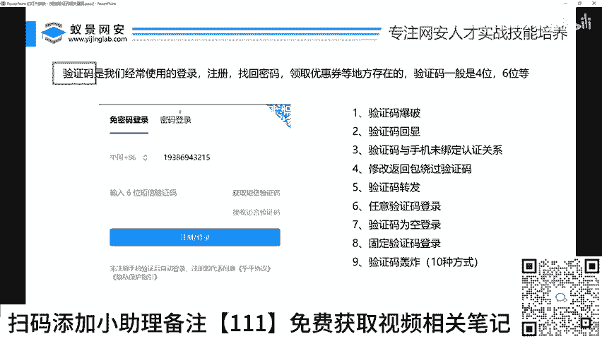
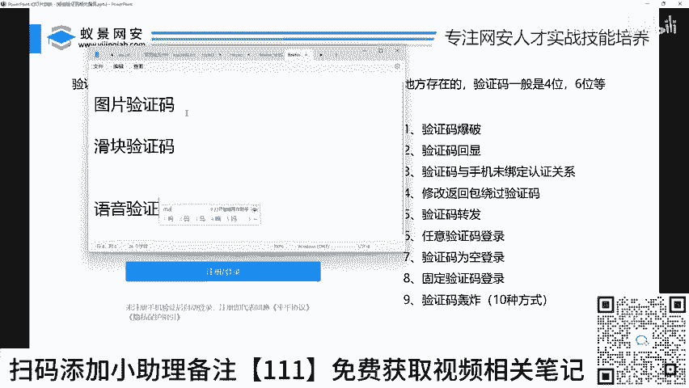
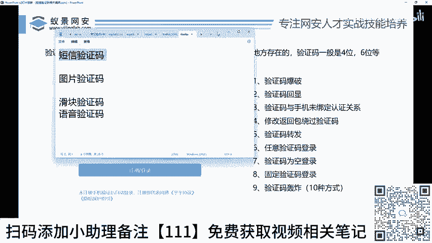
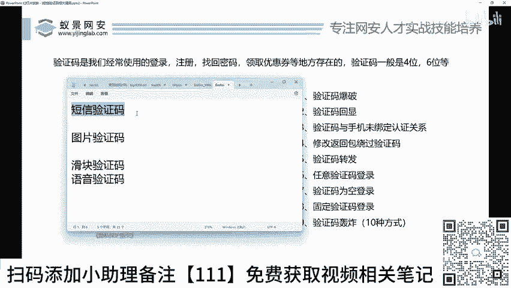
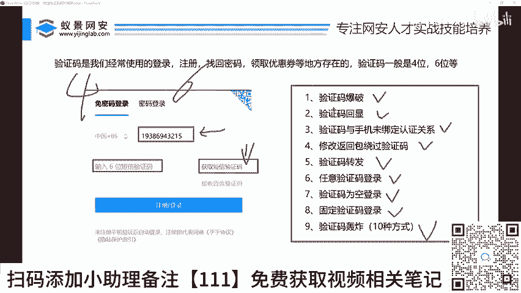

# 2024B站最值得看的黑客教程 ｜ 网络安全／渗透测试／内网渗透／漏洞挖掘／web安全／kali linux／红队靶场／CTF／信息安全 - P34：短信验证码相关逻辑漏洞介绍 - 网络安全免费学 - BV1uBsTetEow

第一个漏洞，短信验证码相关漏洞的介绍，好吧。好，李哥先喝口水啊。好了，首先我们来说一下验证码验证码。😊，验证码大家都知道验证码在我们市面上有几种呢啊，有很多种，对不对？哎。

有手机的短信验证码来给大家解释一下啊。😊。

我们验证码有几种来给大家看一下是不是有这种手机的短信验证码。对吧还有什么呢？还有图片。😡，图片验证码就是那个啊出现一个数字，让你填，对不对？还有什么？还有滑快。😡，对吧还有什么呢？还有语音。

啊，验证码的方式比较多啊，每一种验证码呢它都有自己对应的不同攻击，对吧？那么我们今天讲的主要是哪种是短信验证码。因为短信验证码在我们市面上是最常见的一种验证码，对不对？是不是小伙伴，你们都遇到过吧。

在注册一个东西的时候，需要你的手机号需要接收短信，在你。找回密码的时候，哎，有的时候需要用短信，对吧？在你可能说哎再去做一些比如说啊一些登录的时候，对不对？它也需要这个短信验证码，对吧？

所以短信验证码啊可能占我们百分之七八十这样一个市场。所以我们一定要学会这个什么短信验证码的绕过思路。我们如何哎在不知道短信验证码的情况下，就可以突破它的限制。在不知道手机号的情况下。

就可以突破它的限制啊，从而登录到别人的电脑里面去，或者说登录到别人的系统里面去。好，那么今天就给大家一一做讲解，对吧？这个短信验证码这个界面啊都非常简单，对吧？你看在这里输入短信。

然后我们点击获取验证码啊，然后就会把这个短信发到你的这个手机上，然后输入你的短信，然后就可以进行登录了，对吧？就是这样一个小小的功能快，好吧？今天就给大家去讲讲它到底怎么去绕过好吧？

首先我们来说一下这个短信验证码一般是四位或者6位，对对？那么针对于四位跟6位，它是有不同的攻击方式的。那么今天就会一一给大家做一个讲解。那么。😊。

关于这个短信验证码到底有多少种漏洞，对不对？或者说到底有多少种姿势去绕过他啊，李哥在这里给大家分为了差不多9种。好，我们来看一下都有哪几种。第一种，短信验证码爆破。第二种，短信验证码回显。第三种。

短信验证码与手机未绑定认证关系。第三种返回包返回验证码。第四步，第五个短信验证码转发。第六个，短信验证码任意验证码登录，第七个短信验证码为空啊，第8个短信验证码固定，对吧？第九个短信验证码轰炸。好。

这些它都是属于短信验证码的相关的一些漏洞啊，我们只要能找到其中的一个漏洞。那么你赚个几10块钱还是没有问题的啊。但是你要找对地方，好不好啊？

