# 2024B站最值得看的黑客教程 ｜ 网络安全／渗透测试／内网渗透／漏洞挖掘／web安全／kali linux／红队靶场／CTF／信息安全 - P35：短信验证码爆破漏洞挖掘 - 网络安全免费学 - BV1uBsTetEow

那么接下来我们先看第一个短信验证码爆破啊。好，那小伙伴们短信验证码爆破非常简单，非常简单，非常粗暴，对不对？什么叫爆破？就是我们讲的一个一个去试。好。

那我们来看一下这个短信验证码爆破的一个原理跟它的一些小技巧，好不好啊？那么短信验证码对不对？我们知道短信验证码在发给我们的时候，一般它有一个时间限制，对不对？一般是几分钟呢？

一般是不是5分钟或者10分钟，这个每个人小伙伴应该都收到过短信验证码，对不对？说这个短信验证码的有效期是5分钟到10分钟，对不对？好，那么假如说我现在的验证码给一个手机发了。

现在的验证码是474675好，但是这个手机号我是发给别人的，我不知道这个验证码到底是多少，那么又因为它限于你5分钟或者10分钟之内，对不对？啊，要把它输进去。那这个时候怎么办？😊，啊。

那我们对于黑客来说，我们就可以猜短信验证码，怎么猜从0001到0002，然后往下翻一直到9999，对不对？那么这组合下来多少种呢？个十百千万就1万种可能，对不对？也就是说1万种可能。4个验证码。

如果说限于5分钟之内，那么1万种可能我们要把它全部跑完要多久呢？大家昨天我们用BP去跑的那个密码是吧？我们1000个跑了多久，是不是跑了大约5秒钟那你算算1万个多久啊，5秒钟再乘个1啊，也就是一分钟。

所以说用我们的BP工具一分钟就可以把这一万种可能全部给它干嘛测试完成。O那么又因为它的时间是5分钟，所以我们应该是可以获取到它的一个什么正确的短信验证码啊，这是什么？这是存在漏洞的情况。

为什么会存在这样的漏洞，对不对？就是因为它并没它只对这个时间做了校验，它只是限于你5分钟之内必须输入，但是并没有说你可以输多少次，我输了一万次，我是一个一个试出来的。对不对？所以说我们在做开发的时候。

一定要对他的次数做出限制。比如说他只能输5次。O那我们就不能爆破了，兄弟们，对不对？他只能输5次，那我1万种是5次，他是锁住了，对吧？就是因为他没有对这个次数做出限制啊，从而导致我们可以破，对吧？好。

那么我们来再看这个短信验证码具体的他一个原理。那么李哥在这里啊也给他画了一张图，对不对？正常行为啊，比如说193啊，这个手机号啊，我们要登录，对不对？好。

比如说这个手机号我不知道我是别人说我女朋友的手机号，对不对？好，我听点击登录。好，这个验证码呢会发给我的女朋友，对吧？这个时候对于黑客来说啊，我是不知道我女朋友的手机号这个验证码，对不对？

那么这个时候呢我就可以准备一个这样的表，对不对啊？从001到9999，然后我把这个里面的东西是吧？逐个的填到这里面一个一个去试，对不对？那么只要试出来了，那么我就可以。登录进去。好。

就是这样一个简单的原理。那么接下来我们给大家做一波操作，做一波示范，对不对？有人说哎老师理个密码字典在哪里？okK一会儿我告诉你怎么去搞这个短信验证码，我们不需要密码。好吧。好，那么在那个之前呢。

哎我们先干嘛呢啊？😊，哎，我们给大家做一个演示行不行啊？我们先看一个案例。比人说李哥，你说的这个东西啊，我觉得就不存在，我觉得就没有啊。那我们来给大家看一个案例啊，这是一个正儿八经的。

我们挖洞的时候的一个案例。好，我们来看这个案例，对不对？这个验证码是多少位啊，它是6位的，我们可以看到是吧？它正确验证码是多少？031421啊，我们也是从00002一直到999999啊。

这样一个一个试的时候，最终试出来了，对吧？正确的长度是216，错误的长度都是多少？232，从而通过这种排序，我们就拿到了正确的验证码，然后用编的手机号就登进去了这个系统，对不对？那么关于这个验证码。

我们是不需要字典的。好，那接下来李哥就给你演示一下这个短信验证码，这个操作到底如何去操作好。😊。

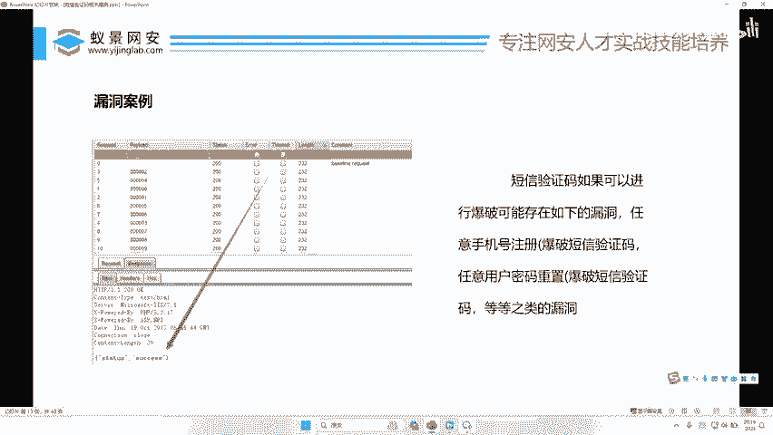

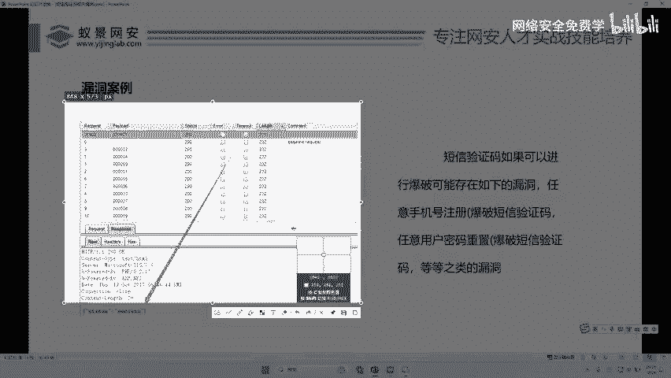

啊，那么关于这个演示呢啊，我们就用我们的PBstar给大家去演示，好吧？啊，一会儿呢再去用公网上看有没有机会给大家做一个演示啊。如果有的话，我们再去演示啊。好，我们主要看那个什么，哎。

我先把这个服务开开啊。😊。

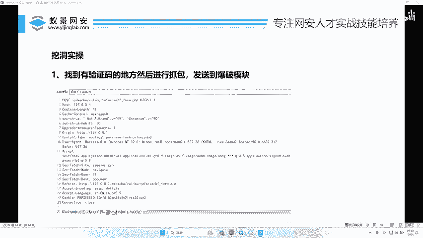

好，首先第一步是不是启动我们的BP哎，我们打开我们的这个BP。啊，我们这这两单讲的这个所有东西啊，都只用一个工具，就是我们的BP工具哈，其他的工具一律不需要啊，一律不需要，明白吗？啊。

其他工具一一律不需要，只要用到Bbb straight这个工具就可以了啊。好，比如说呢我们想挖短信验证码。OK怎么挖ok接大家给大家去教一下，好不好啊？😊。

好，有些人还不会用这个工具，对不对？我在这里再讲一下，好吧。首先呢我们先打开我们想要的网站，对吧？😊，好，比如说这个网站好，我以这个为例，好吧啊，首先我们点到我们的代理，然后点击它内置的这个浏览器啊。

😊，啊，打开这个谷歌内置浏览器哈，输入这个网站。好吧，我们先把拦截关掉啊啊，我来这里摄像啊。啊，我们以就以让我看一下啊，以这个为例吧啊。😊，好，比如说这里是手机号，我们点击1897653421，对不对？

填了手机号OK小伙伴们好，那现在呢这里我们点击一个发送。好，这里现在输入一个验证码啊，我们要怎么去，我们输入手机号啊，然后点点了一下什么，发送短信啊，假如说这里能发短信啊，当然这里现在不能发短信。

对不对？我们假如说点了发短信，那么短信呢已经发给了那个手机啊，假如说发给了这个手机，现在呢我又不知道这个短信是多少啊，那有人说哎，那我现在不知道这个短信验证码到底是4位还是6位，那怎么办呢？啊。

你可以先让这个短信发给自己的手机啊，我们正常拿手机看一下它是6位还是4位就可以了，对不对？这是第一步啊，你先得知道他是几位，那么几位怎么发现，对吧？你先正常的发给自己的手机，然后看一下，对不对？啊。

我们看完之后啊，你就可以把这个手机号换成你妈妈的或者你女朋友的手机号了，然后再点击发送。那这个时候你是不知道他的验证码了，不知道他的这个。😊，这个这个位数的对不对？然后我们怎么去搞呢？哈。

我们随便在这里输个1234啊，在这里输随便输一个，对不对？然后先不要点击登录，我们等于什么，把这个拦截开开啊，点击登录好，那这个时候呢我们就会拦截到这个包哎，就是这个短信验证码登录的这个数据包哎。

在这里呢你就能看到什么哎，这个验证码的这个位数，对不对？啊，比如说1234，那这个时候怎么办呢？哎，大家请注意我的操作怎么去爆破它好吧啊，首先拦截到这个数据包之后，一定要把这个数据包发到哪里呢？

发到我们的批量处理模块。我刚昨天讲了对不对？我们的 in出的模块，那么应出的模块怎么发，在这个空白处右键啊，右键你的鼠标找到发送至intro啊，是不是这里是有一个发送至in出的哎。

就这个按钮给它轻轻的用你的小手哎给它点一下好，点完之后呢，大家可以看到这块这个东西就变红了啊，之前的黑色的对不对？点完之后应出的这个。😊。

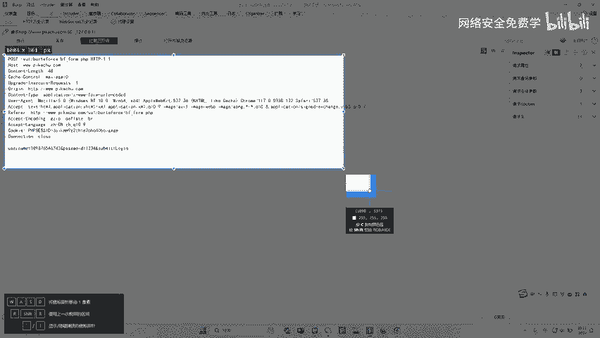

快就变红了。哎，我们把鼠标再放上去，再点一下哈，就会弹到这里面来。好，在这里面怎么选啊？我们第一步啊，先点击什么清除纰漏的啊，先点击清除什么要配漏的啊，就先把它的标记全给它清除掉。😊，好，然后干嘛呢？

然后在这里面选，我把这个字儿给大家放大一些。因为说啊李哥，你的字儿太小了，我都看看成瞎子了，对不对啊？没有关系啊，我们把字儿给大家放大一些啊。😊，啊，这个字体呢在这一块放啊啊，我们现在是16，对吧？

给大家放到28。😊，好，放这么大OK现在没有问题了，对不对？好，我们选中我们想要爆破的地方啊，比如说这里它是密密码，对不对啊，这是密码，对不对？好，我们就把这个东西干嘛呢？哎给它。😊，哇，太大了。啊。

你不要给我开车啊啊好，假如说这个是验证码，对不对？哎，我们把它这个给它用鼠标点入它，然后给它选中，对不对？都会选中嘛。好，选中之后呢，哎我们去点这个添加pay漏的好，跟昨天步骤是一样的，对不对？

点击添加好，点完添加之后，我们可以看到在我们想要爆破的这个地方就会用前面这两个符号给它干嘛串起来啊，串的是什么？串的就是我们刚才手写的这个四位数，对不对？哎，我们把它串起来，串起来有这两个符号串起来。

就代表这个标记已经打好了，一会儿的这个密码远证码替换的时候就会替换这个模块，对不对？哎，替换这个模块。好，我们替换好之后呢？然后点哪里呢？啊，然后点击这个 pay漏的这一块啊，大家往这里看。

这里是有一个 pay漏的这个模块。好，我们去点这个好，然后我们要在这里要选验证码，对不对？有人说哎李哥，我是不是还要准备1个0001到9999这样个字典，哎，我告诉大家不需要好，因为。😊。

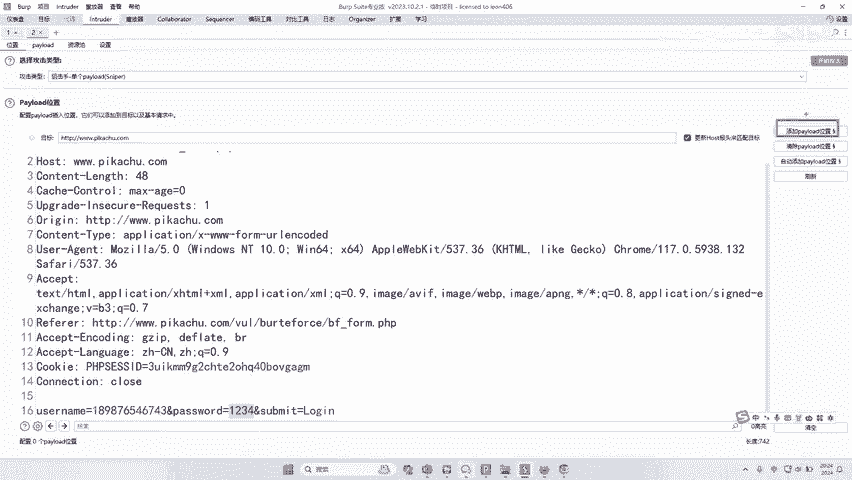

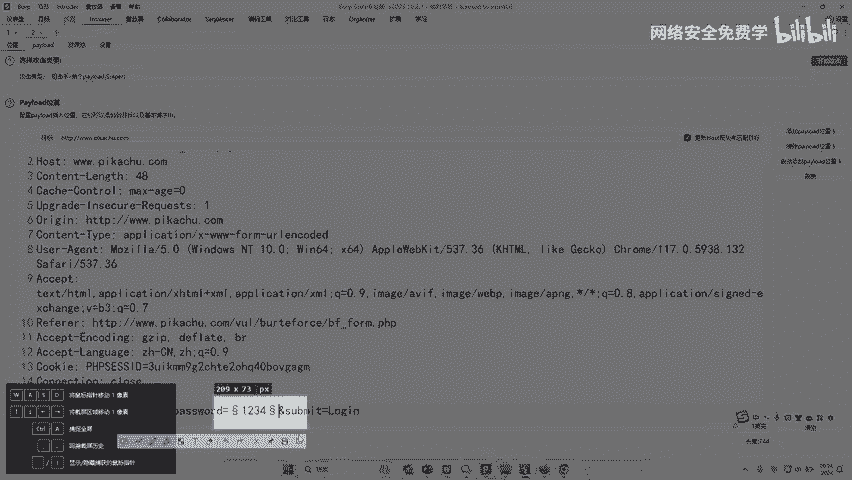

我们这个。加不是加了，我们的这个BP里面就自带这样的功能，好吧好，我们选择这个什么。😊，就是第一步啊点这里。😊，啊，把这里这个列表呢哎换成什么？哎，换成这个数值。听好了。

把这个胚漏的类型换成数值OK然后我们这里写从什么到什么一定要写好，对不对？啊？来，我们来看一下从什么到什么来从0001到哎应该是从0000。到00到什么到9999对不对？是不是？来。

我们先看这个这个大家应该都会吧啊。

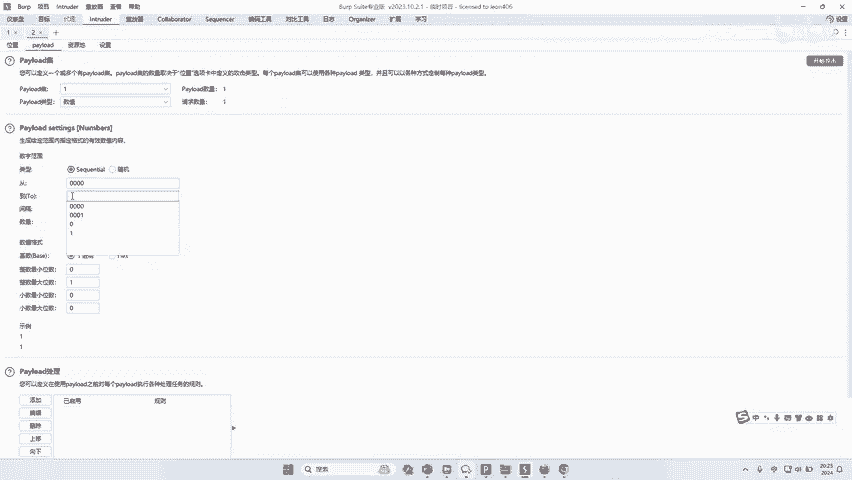

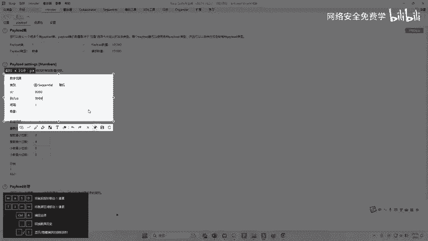

把这里选，你看从0000到9999，间隔是多少，间隔是一啊，那么它就是先从0001到00020003，对不对？这是不是从00到9999，间隔是1啊，如果是你写了间隔是2。

那就是000100030005啊，这样一个规律了，对吧？所以这里一定要写一啊，然后这是从哪里到哪里。好，这个选完之后还不行，对不对？这里还必须调整，最大位数是4位，那对最小位数也必须是4位，对不对？

你看这里就有一个示例了，你看示例就给我们示出来了，对不对？好，如果说你这个最小位数不写，你是写一位，你看到没？那么这个示例它就变成这样了啊，它是12345678910，不是00010002懂不懂？

所以我们最大位跟最小位都必须是四位，那这样这个示例，我们看下来才。

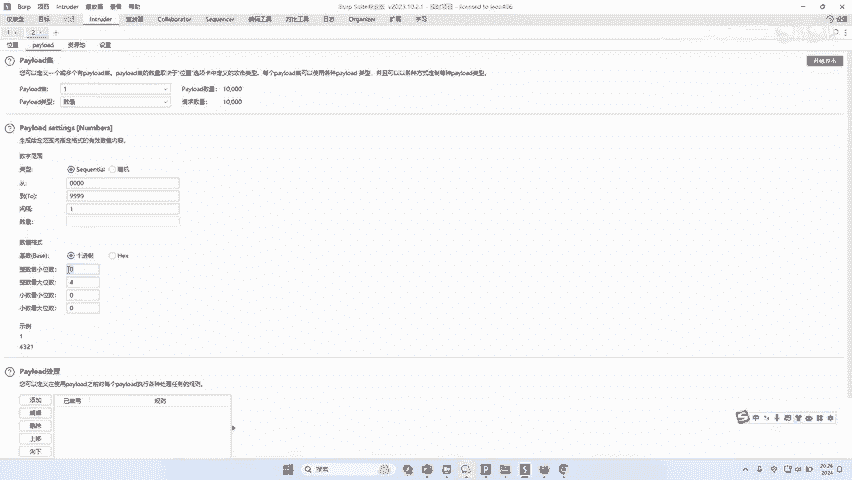

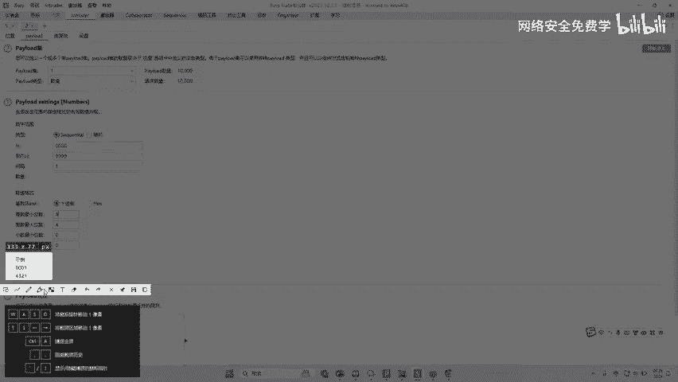

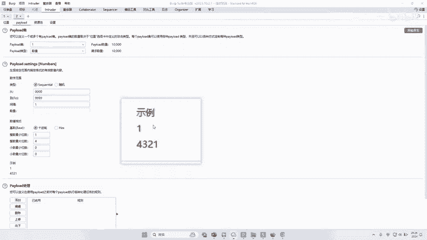

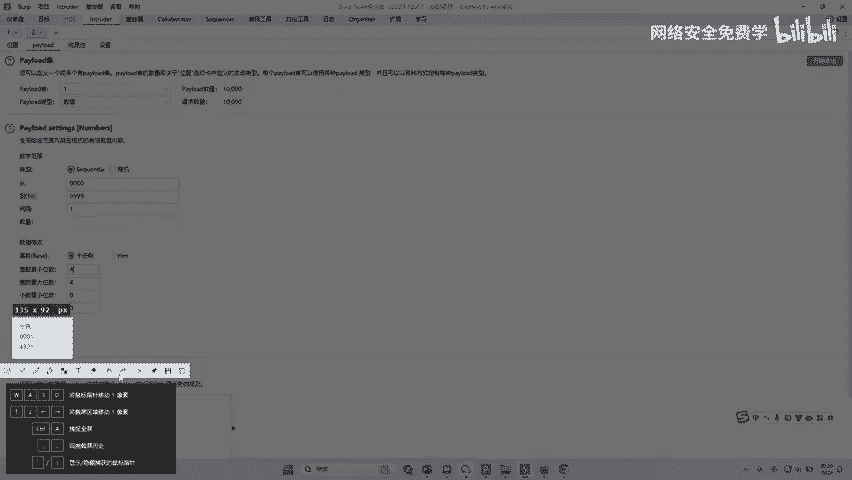

符合我们验证码这样一个规律，对不对？验证码它是4位啊，0，它也是一位，对不对？0001到4多少，对不对？哎，听明白没有？所以这最大位数跟最小位数一定要写好，对吧？那这个时候设置好之后。

我们直接点击开始攻击。我们看一下是不是整整的1万个来，我们来往这里看是不是1万个。😊，哎，那我们来看一下这1万个跑完，大家可以计述一下这用时到底要用多久。假如说这个验证码5分钟。

大家看现在就这么短短的几秒钟时间，我在说话的这一会功夫，现在已经完成多少了，快3000个了，对吧？啊，再一眨眼的功夫，抽根烟的功夫，喝一杯水的功夫。😊，哎，我们已经马上到4000了，对吧？哎。

再去抠个鼻屎拉个脚，哎，那一看哎，在4000了，对不对啊，所以你再啊发两个消息很快，对不对？这个11万他就跑完了，对不对啊，差不多。😊，肯定能在5分钟内给他搞定。对不对啊，差不多就这样一个时间啊。

那有人说李哥这个时间还能不能更快一些，这个时间还能不能松更快点？of course，当然可以再快一些。那么我们可以这个速度快慢啊，一定取决于你的电脑，你的电脑越好，CPU的合数越多，它跑的越快。

如果说你把它放在开里面放到续机里面啊，它就是乌龟赛跑，对它跑的是非常慢的。所以在这里我也是告诉大家，一定要把我们的BP放在我们的电脑里面，对不对啊啊，啊有说这会跑崩啊，跑步崩，你放心啊。

就这么一点量能跑崩啊，那它也。😊，太太累了落了，对不对？好，那么这个时候我们来看一下啊，你看000来，我们看一下第一个包哎，这里能选看我们第一个数据是不是手机号加它的多少验证码。

第二个手机号加它的验证码。第三个手机号加他的验证码。第四个手机号加它验证码，是不是每一个都挨挨着去跑完了，对不对？啊，有人说数字跟密码组合，我就问你一个问题，这个删木木山风。

你见过哪个手机短信验证码是数字跟字母组合吗？手机验证码都是数字啊，没有字母啊，你是不是手机平时用的比较少啊啊，手机验证码只只是数字啊。😊，啊，没有字母这一说的啊okK来，我们来看一下是不是跑完了。😊。

是不是跑完了？好，那我们来看一下啊，这里面的怎么判定成功啊，跟昨天李哥讲的一样，对不对？把这个长度勾选上啊，我们找到这个长度跟其他不一样的地方，就代表成功了，对不对？好，在这里呢哎有一个问题，要给大家。

也是大家在公屏上打出来的问题。好，现在李哥讲的是4位验证码。好，那假如说我的验证码是6位。那么我要从0000。😊，0。0到多少？00到多少？999999好，那这么长我要跑多久？这么长我要跑的久。好。

有人说不知道不知道，那李哥先给你算一下，咱跑一下，我们看能不能在10分钟内给他跑完。好，在后面这个两个0，再多两个0，哎，再多两个9。好，我们来。😊，把这个位数定成6位。

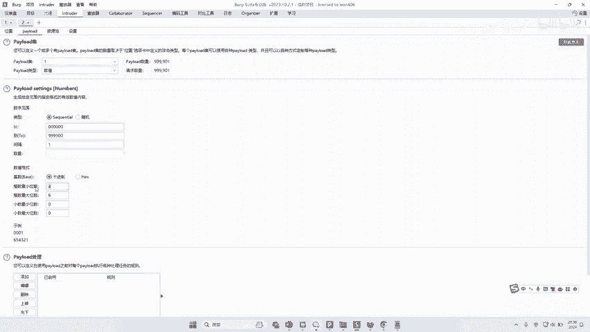

好，来，我们点击开始攻击。好，大家先不说跑，先看一下它的这个长度，个1百千万10万10万个1百千万10万。好家伙，10万呀。

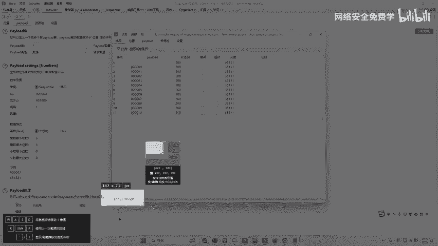

对不对？10万你能跑完吗？能跑完吗？你5分钟之内能跑完吗？😡，很大几率是跑不完的，对不对啊？因为我们刚才看1万可能都跑一个小一分钟，那么10万应该是10分钟啊，对不对？那就跑不完呀。

对那这个时候怎么办呢？😡，对不对？有些验证码一分钟就失效了啊，对不对呀？会不会存在这样的情况呢？那怎么办？兄弟们。来，我给他教教给大家一讲啊。可以分批炮。啊，怎么叫分批跑？你准备10个BP啊。

第1个BP跑000001到多少到到10000。哎哎，理解没？把我们10万分成十等份。然后每1个BP去跑他的那个东西，然后你看这不是一分钟了吗？哎，懂我的步骤，没人说啊，那李哥，那我怎么去分批跑啊。

对不对？OK啊，你可以这样好不好？其实非常简单啊非常简单好，我告诉他怎么去搞。好，你只需要哎把你这个数据包，对不对？哎，直接哎复制到你另一个的这个什么直接复制进来啊，把你这个数据包对不对？

复制到1个BP里，再把数据包再复制到另1个BP里，再复制到另1个BP里，再复制到另1个BP里。然后我们干嘛？然后我们在这里标记就行了，对吧？这里标记000到多少到1000000。😊，啊，好，那这里6位。

好。OK那我们这个跑一下，来看看多少功可能。😊，哎，这个还没标记呢，这个我先标记一下。添加load啊，我们开始攻击。好，那这个算下来就个个1百千万10万啊，这个是10万，对不对啊？刚才那个是100万。

对不对啊？刚才那个是100万，对不对？我们可以用多个虚拟机去跑啊，这样的话跑或者说多个BP去跑也可以跑，对不对？理解我的意思没有啊？刚才那个算错了，对不对啊？刚才刚才那只百万，对不对？百万。

你想你肯定跑不完啊，百万你跑不完，对吧？所以我们可以分批去跑啊，那比人说那李哥，我在实际的挖洞过程中来，我的人说这样跑，刚才是多少100万，对不对？100万，我就算分成那么多，我也跑不完啊，对不对啊。

那这样我也没有那么多电脑啊，那么我怎么才可以骗过他们啊，因为我们知道我们是挖漏洞，对不对？我们挖漏洞是为了什么赚钱那么我们怎么绕过这个限制呢？我就算打开那么多窗口我也跑不完，我也没那么多电脑呀。

那怎么去解决呢？啊，在这里教给大家一个。😊，骚操路跟骚操作啊，那么这种情况有的时候是可以通过认证。有的时候是别人给你钱的。有的时候你就是假如说我接下来讲这种情况，你挖到了他可能会给你钱。

也可能不会给你钱。好吧，这个就碰运气了。好，我给大家教一个骚掏路骚操作啊，听不听啊？就说我们多开这种方式是可以的，但是可能也不太适用。那么我们应该假如他验证码是786452啊，假如说是这。啊。

你要跑的跑到猴年马月去，对不对？好，那么我们怎么跑，对不对？你听好了，我现在教你的什么一种骚姿势啊，你把你的手机号写进来。😊，啊，因为你这个漏洞是给别人提交的，对不对？别人他是不知道你的手机号的，对吧？

你就把你的这个手机号写成你的OK然后你先干嘛呢？😡，让他发给你的手机，你已经看到了你的验证码是786453OK然后你在跑的时候，你可以直接把这个数值写成多少，写成78。600。0到78。7000啊。

就这样意思啊，那我们在设的时候，就在这里啊，把这个配乐资源池这里设成这里啊，这里设成这里。😊，好，选择6位点击开始攻击。那这样的话也就是1000个，明白吗？那这里是包含你的这个地串值的，对不对？好。

那你在交给别人来忽悠别人，在骗别人的时候，对不对？你就找到你的这个东西。哎，你说哎，你看我跑成功了。哎，你看我破成功了，哎，这里OK了，你对不对？啊啊，运气好的话，可能会给你50块钱，明白吗？一。😊。

懂懂我的意思吗？因为我们在挖漏洞是给别人挖的对吧？我们是给别的比如我给一个公司挖漏洞，那公司他是不知道我手机号的，他也不知道我的这个操作的，对不对？我就可以做个假，是不是我把这个手机号写成我的。

我先看到了我的验证码，然后我在这里再设置，设置成我自己想要的区间，然后我再把它什么截图一下，写到报告里，你看我跑成功了。😊，来，理解我的意思没有？理解了给李哥扣波一啊，这是我们平常就是碰一下啊。

有的时候别人可能不认啊，不认也没有关系啊，就算认了，可能只是给你几块钱或者几10块钱，对不对啊，可能也没有多大价值啊，过了啊，那就给你奖励一下啊，运气好就给你的钱，运气不好，没有，我们也无所谓。哎。

理解我的意思没有？理解了扣波一啊，这个是啊有一点弄虚作假的意思啊。😊，哎，有人说这个人别人会不会投诉你啊，不会的啊不会的啊，就是我们挖漏洞给别人公司目的是什么？哎，我们来我们挖洞的目的是什么？啊。

我们的挖洞的目的是什么？😡，我们挖洞的目的是？有人说我老师我挖洞的目的，我是赚钱，那你不行啊，你在别人提报告的时候，你可不能这么说，对不对？你说啊我们的挖洞的目的是什么？

为了更好的帮助企业发现漏洞啊修复漏洞，对不对啊？这个啊万。😡，挽回。挽回回企业的损失。对不对啊，是不是我的目的是这个，那么你用这种方法也是证明了它的漏洞，最起码能证明一个东西，什么东西？

它的这个验证码输入是没有限制的，对不对？😡，对不对啊？我都跑了1000个了，你都没有给我封，对吧？你按道理来说，你跑4次你就给我封了。但我跑100个，我确实是跑出来了，对不对啊？

那企业大概率也会认为这个东西它是一种漏洞，它没有对它做限制，对不对？虽然你正正正八经跑100万次跑不出来，但是我跑1000次可以跑出来，但是也是另一个方面证明了啊，这个企业是存在这样一个行为的对吧？啊。

所以大概率啊，有的时候运气好是可以过的啊，明白了没有。😡，哎，明白明白，这是我们的目的啊啊当然你的目的我知道就是为了赚钱嘛啊，你不用说的那么直接啊，我们是为了帮助你更好的哎。😊。

完善你们企业的这样一个方案。好吧，哎，这是我们第一个漏洞，叫做什么短信验证码爆破。好，那在这里有人说哎，李哥，那我挖到一个短信验证码爆破了，对不对？那我在写漏洞的时候，应该怎么去叫这个漏洞名字呢？

OK那我在这里再给大家说一下啊，我们怎么去描述这个漏洞呢？好，这里给大家讲讲，好吧。😊，啊，那怎么去描述这个漏洞，对不对？不是骗啊，不是骗，只能说是偷机取巧了一下。好吧。哎呀，我没有。

它确实是存在这样一个东西的，对不对？我们只是偷机取巧了，对不对？好，那么这个漏洞应该叫什么，你可不能说哎它存在短信验证码爆破，这不是个漏洞，对吧？你比如说呢你爆破了这个短信之后。

可以登录到别人的系统里面。那么这个漏洞就叫什么任意用户登录啊，如果说你跑出来别人验证码，然后可以去修改别人的密码。哎，那么这个漏洞就叫做任意用户密码修改。😊。

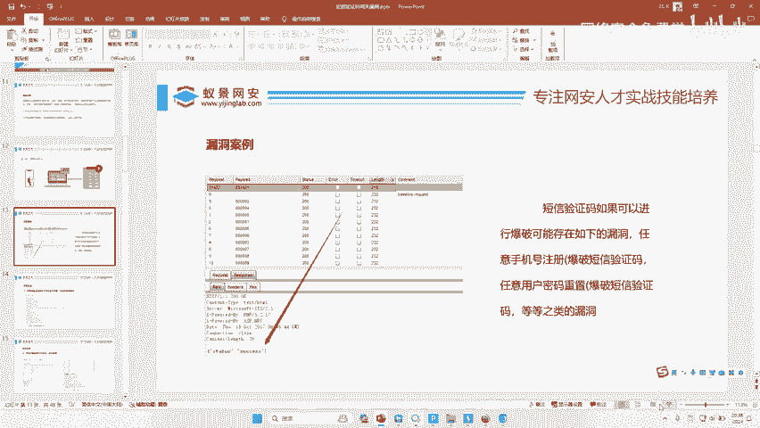

对不对？😡，假如说你跑完之后可以重置别人的密码，那就叫任意用户密码重置。我们漏洞的这个名字是叫什么？叫你对这个跑完之后，对这个企业或者对这个东西产生的这个后果。叫的，而不是针对这个调的，明白。

理解我的意思没有？就是你把这个验证码跑完了，你发现可以登进去别人的系统了。那是不是代表着你可以登录任意别人的系统。那么这个漏洞就叫做任意用户登录漏洞。😡，哎，理解没？

哎哎有人说我怎么知道别人的手机号呀什么的？😡，哎。你你还是那句话，对不对？你不需要知道别人的手机号，你只要能证明我能登进去别人的东西就可以了。我们是只是要这个证明他存在漏洞就可以了，对吧？

你拿你自己的手机号都可以，你登进去了，你说我任意用户登录了，你不会准备两个手机号嘛？一个是你的手机号，一个是你第二个手机号，你破你第二个手机号，他不知道呀，他不知道你是谁，他怎么知道你手机号。

你说我猜的他也不知道啊，对不对？我们的是要把这个报告交给企业的，只要企业能认这个东西就可以了啊。我们不需要知道他企业里面都有多少个手机号，我们不需要这个知道这个东西，对吧？你只要知道啊。

你你知道的手机号行了。你可以准备两个手机号都可以啊哎理解没有啊，理解了，我们接下来去看下一个东西好吧啊，大家觉得这个漏洞有没有用，有用的给李哥一，我们来讲下一个东西啊。😊，是不是一学就会一做就对了。

对不对？兄弟们没有问题吧啊，我力哥从来没有骗你吧，是不是非常简单，非常想学非常简单，对不对啊？每个人都可以试，对吧？我觉得你只要有手都可以把它弄成功，对不对啊，除非你没有手啊，除非你BP都安不上啊啊。

那你真是小学生了啊。😊。

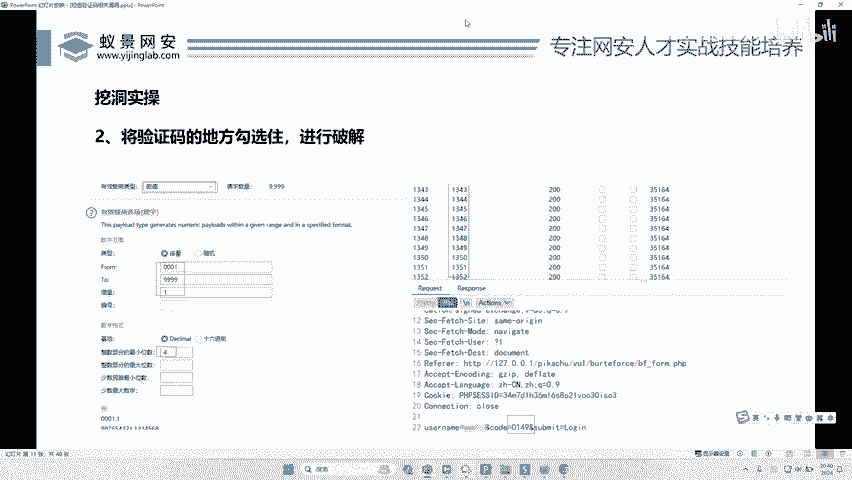