# 2024B站最值得看的黑客教程 ｜ 网络安全／渗透测试／内网渗透／漏洞挖掘／web安全／kali linux／红队靶场／CTF／信息安全 - P36：验证码回显漏洞挖掘 - 网络安全免费学 - BV1uBsTetEow

好，那第二个我们来看第二个对不对？叫做短信验证码回显漏洞，好不好？啊，有人说怎么准备个手啊？假如说你没有第二个手机号，你可以用你爸爸的，用你妈妈的，用哥哥的，用你姐姐的，用老师的用你朋友的佣金，明白吗？

手机号咋可能没有吗？啊。好，我们来看第二个漏洞啊，叫做短信验证码回显漏洞，对不对？好，有人说了，李哥，那我要去哪里挖，怎么挖，怎么赚钱。李哥一会儿告诉你好不好？因为我在课前已经说了。

一会儿教大家如何去提交这个漏洞，如何到哪里去提交这个漏洞，一会儿我会告诉你的，好不好？小伙伴们啊，不要着急，我们先把技术学完好，我们来学第二个漏洞叫做短信验证码回显漏洞。好，什么叫做短信验证码回显漏洞。

来，我们来先看一下正常的一个发送短信验证码的流程，对不对？好，我们正常情况下啊，用我们的浏览器，对不对？打开一个网站输入手机号。😊。

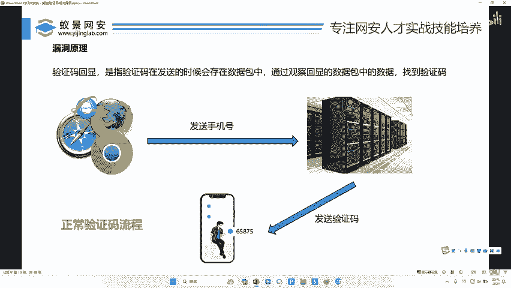

点击发送短信。然后这条信息我昨天讲过的ATTP协议的对不外请求它会跟着网线把这个请求发送给对方机房。那么机房收到了要给这个手机号发送短信的请求之后，紧接着就会把验证码发送给你填写的那个手机。

OK没有问题吧，这个是正常流程，对不对？我们在浏览器上发送手机号，点击发送短信，把这个数据包给了服务器，服务器就会把我们哎填的那个手机号的短信发给我们的这个什么我们的手机上好，这个是正常流程。

那么有些开发人员干嘛了？他就会犯一些错误啊，我们来看一下什么错误来啊，就是说我们在提供的手机号啊，比如说我在这里提供一个手机号。😊，好，比如说我的手机号多少，197。好，这是我的手机号，对吧？

我随便捏了一个手机号。好，来，我通过这个浏览器啊，我把我的手机号填进去了，点击发送手机号给发给服务器，对不对？服务器收到我的手机号之后，哎，他会向我这个手机上，对不对？发送一个极位短信。

那么有些开发人员到这里就犯糊涂了，对不对？他不仅把这个什么手机号发给了你的手机，他还顺便着把这个哎说错了，他不仅把这个验证码，😊，啊，这是验证码，对不对啊？通过网线发到你的手机上，他还干嘛了？

他还把这个验证码顺着网线发给了你的什么浏览器。哎，那这个是不是请求包，哎，这个是什么？我们的返回包，也叫我们的响应包。昨天我讲了请求跟响应，对不对？你看正常流影示，对不对？把他发给他啊。

然后这个东西只发给他就可以了，对不对？错误流程是什么？哎，你把手机号发给他了啊，然后他发给他这个了，对不对？他还顺带着把这个消息，哎，再返回给你的电脑。

那么我们在自己的电脑上就可以查看到这一份什么了验证码信息了。哎，兄弟们理解没？理解这个流程没有？这个呢就叫什么？哎，短信验证码回显回显到哪里呢？直接回显到我们自己的电脑上了，你直接用你的BP啊。

就可以直接去看这个验证码了，对不对？有人说李哥这个机会太小了，哎，李哥，这个就不可能存在。😊，我告诉你存在的太多了啊，那你为什么觉得不存在？那是因为你从来就没有看过这条返回信息。

你用手机从来看的就是你的手机，有几个人会用BP呢？有几个人会抓包看他的返回请求呢，对不对？OK就是因为这个消息，明白吗？啊，不是因为不存在，是因为你没见过好吗？那有人说李哥，我不信能不能帮我看几个案例。

好，那我来看下来。😡，来，大家看一下。2023年12点看到没？2023年12点，我挖了一个漏洞。看到没？714477。这是个什么包？兄弟们往这里看，HTTB2200okK是个什么包，是不是返回包。

是不是响应包？是不是响应包响应包里面干完了啊，携带了一个扣的，这个扣的叫什么？是不是验证码？😡，那么这个验证码不仅发送到了我的手机上啊，对不对？还发到哪里呢？啊，还直接给我发到了哪里我的享用包里面来。

😡，没有问题吧，兄兄弟们啊，没有问题，是不是？😊，好，我们再看下一个案例，好不好？下一个案例我们再来看一下。😊。

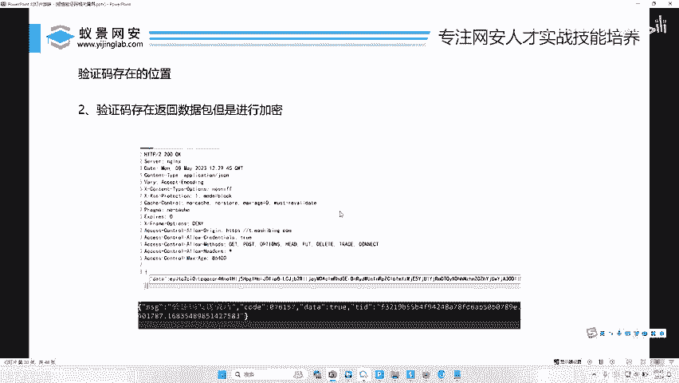

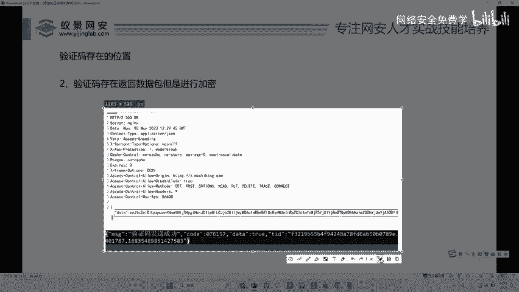

时间对不对？也是2023年。好，我们再往下看。😡，这个数据包返回数据包date里面存在一串这样的值。啊，就它反回的数据携带这样一个值，这样一个值我们解密开里面是不是直接会有一个code。

叫什么076157。是不是他的。验证码。

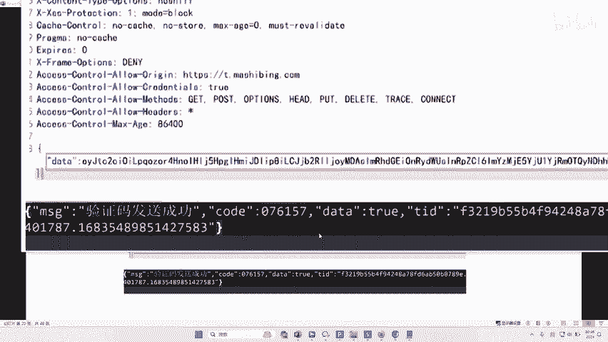

我们再往下看这里是不是200okK返回包。

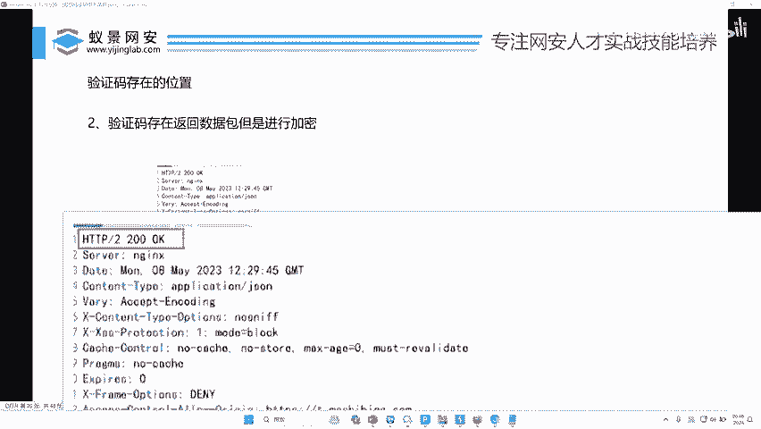

返回报的数据里面是不是存在这样的漏洞？

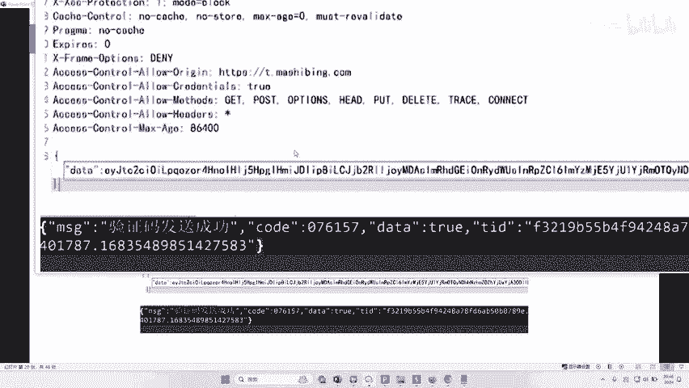

存在吗？存在这样一个数据啊，也就说这个怎么解密，这个不要紧，这个是贝64啊，用工具一键就解密了对吧？我们是不是可以看到这个验证码。😊。

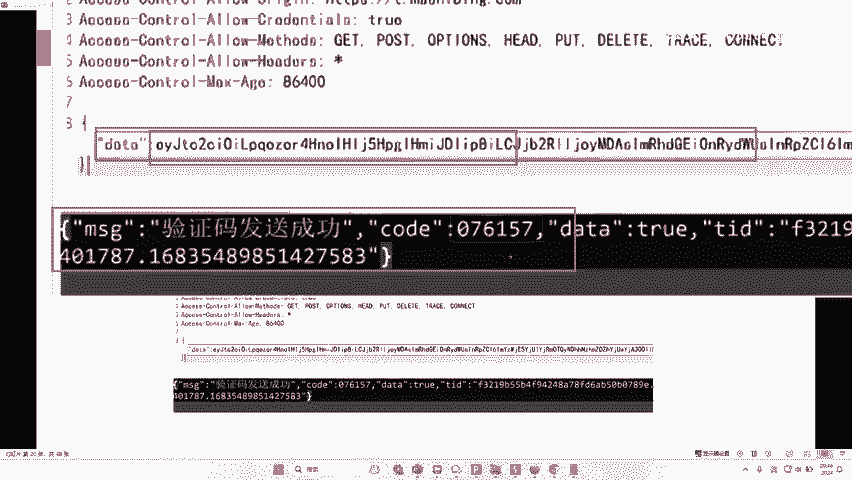

啊，你们说不存在来，我们再看一下，有的时候这个数据还会哪里返回到这里面来。😡，对不对？直接返回到这里。好，那么就说李哥，那这个漏洞应该如何去挖，如何去看好，那接下来李哥就一步一步教给大家好不好？啊。

怎么来看呢？首先呢哎我们干嘛呢？我们打开存在验证码的地方，然后输入手机号，然后点击发送，然后进行抓包。好，那怎么来啊？李哥在现场给你演示一波，好不好？那用什么演示啊，我就用我们公司的网站给你演示一下。

当然啊这个演示它是不算攻击的啊，为什么啊，因为我并没有造成攻击，我只是进行测试，好不好？啊，呀而且我们公司也是有授权的啊，大家可你要自己搞的话，一定要偷偷摸摸搞啊，不能这个公开去搞啊。

比如说我们公司对不对？你看我们公司在注册的时候啊。😊。

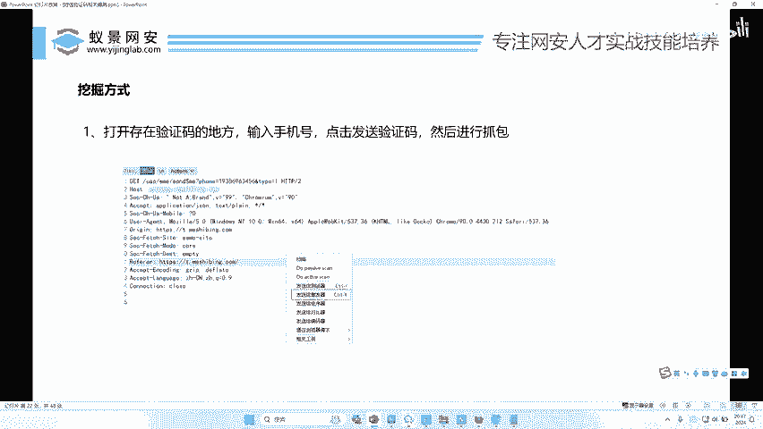

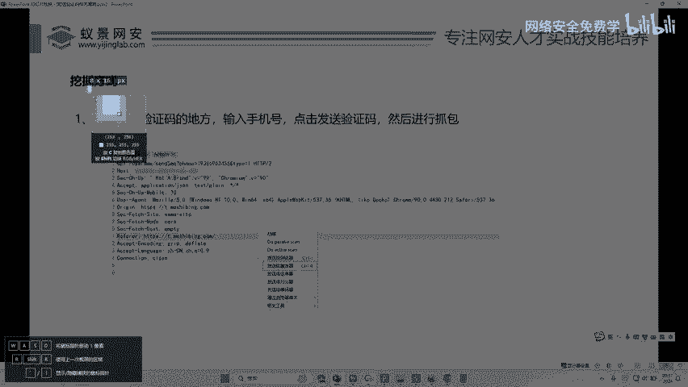

好，这里是不是员要输手机号，对不对啊，要完成验证，好吧？我在这里再强调一遍啊，我现在对我们公司的测试都是合法的，因为我们公司老板是给我授权了，对不对？你们如果要做啊，我们后台是我们公司，你们知道啊。

他可是做什么的，做网络安全的啊，我们有很多设备的啊，给我逮住是你好吧？啊，人家要告你对不对啊，人家要告你小伙子们啊，你可不要说啊，李哥教你的啊，要告你我们老板要告你，我逮住弄弄到监狱去啊。

我可不要把你求情啊，那你说那我怎么去测好不好？那一会下课的时候我会教大家去哪里找那些合规的东西，对不对啊？我们去搞好吧？我们现在不要去搞别人乱用公司啊，啊，我们以我们自己的公司给大家做案例测测试一下。

好吧？比如说呢好不好？哎，我们输个手机号啊。😊，好，这是我的手机号对不对？好，他让我注册。好，那我就随便呢在这里输个密码，对不对？啊，我随便打开一个划快。当然我们公司这一块我也看过了，它是没有漏洞的。

对不对？好，大家看这个验证码是不是要获取呢？哈，我们先不获取，我们干嘛呢？我们用BP啊，我们我错啊，说错了啊，我们先用BP打开这个网站。😊，好。好，再给大家原原本本来演示一遍，对不对？先把这个拦截关掉。

好，打开我们的BP。😊，来。😊，然后找到你要测试的地方啊，比如说你要测试里，对不对？好，输入手机号。😡，OK当然这个手机号可能是真的可能假的啊，无所谓啊，这个都无所谓了啊。我们输入一个密码啊。

随便要注册的一个密码。好，然后完成这个滑块验证。好，这个时候是不是要点击这个什么获取验证码了啊，你点一下，是不是就会向服务器发送一个请求啊，然后发完请求之后，服务器就会给我这个手机号发送一个验证码。

对不对？好，那么我们这个时候一定要记着啊开启这个拦截啊，我们把这个数据包呢，拦截下来，点击。😊。

好，兄弟们往这里看。来这里是不是就拦截到一个。手机号的这个user mail是不是我们这个手机号？对不对？好，这是不是这个包给发到服务器，服务器应该就会给我们这个手机发送一个验证码，对不对？好。

那怎么去看它的响应数据包呢？O我们教大家一种方式啊，非常简单啊，右键好吧。😊，把它发送到这个repeer模块啊，repeat叫什么？是不是单个测试按钮好，我们右键发送到repeer。好。

那这个重放器它就变蓝了哈。😊，然后这个时候我们点击发送好，点完发送之后，这个数据包呢就会发到我们公司的这个服务器上啊，我们公司服务器干嘛呢？就会给这个手机号发送一个短信，对不对？好，那我们要看的啥。

看的是响应包，响应包在这里看，对不对啊？我们不管手机能不能接触到。我们只看这个响应包里面包不包含我们的验证码来就可以了。我们点击。😊，阿总。来。😊，看到没？这里提什么？😡，not accept可以用。

里面是不是发送成功啊，message是可以用，可以用，就是发送成功了。那么发送成功在这里面并没有看到我们的验证码啊。那如果说有漏洞是长什么样子呢？哎，在这里啊如果说有漏洞，哎，这里还编辑不了，对不对？

啊，如果说有漏洞，哎，那么这里就会多一行啊，叫什么？哪一行呢？哎就会有一个什么叫做code啊，冒号啊。啊，什么678865哎，就会有这样一段验证码的数字在里面。

就是李哥刚才在这个什么课堂上给你展示的这个。哎，我们来看一下这个展示的这个。啊，比如说这个对不对？你看我在抓包完成之后，看到没？这里会提示验证码发送成功code71447。啊。

那么这样情况就是验证码已经回传过来了，这个叫什么？验证码回显漏洞。那么你在测试的时候对不对？只需要干嘛呢？哎，去看一下它的这个返回包。哎，这里面存不存在这个验证码就可以了。

如果存在OK恭喜你OK那那你都不用爆破了，对不对啊，直接用这个验证码进行登录就可以了啊，如果不存在啊，那也没有关系，不用灰心，我们紧接着再测下一个漏洞。

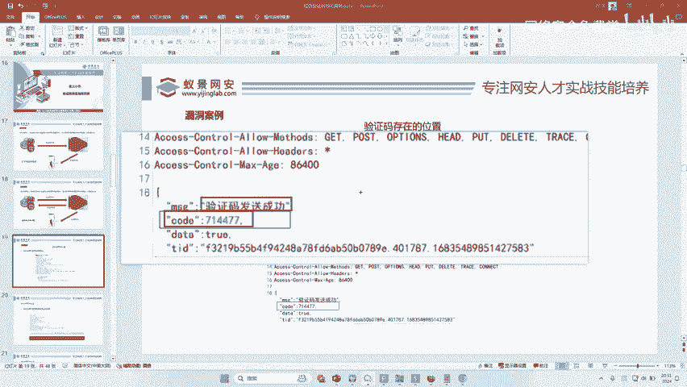

听明白没有啊，那么这个验证码可能会存在哪些地方，首先会存在这里啊，也可能会存在这里，对吧？啊，这里面这些数字都可能存在验证码啊，有的时候可能还加了密，需要你去解密。如果没有加密，那你直接用肉眼看就行了。

哎，理解了吗？小伙伴理解了给李哥扣一波一啊。那么这个对不对？叫什么呢？就叫短信验证码回显。😊，简单不简单？简单不简单，是不是非常简单啊，你敢说你不会。😡，你敢说你不会就往自己的脸上狠狠的抽两下，对不对？

你不可能不会。如果说你不会啊，那就你认没有认真听。😡，啊，你不会啊，你不会，那你就是在骗我的啊，你肯定会了，对吧？为什么你会了啊，我把这个图啊画这个图我就画了5分钟，10分钟啊，给你这样给你展示了。

对不对啊，你看。😡，啊，这是我们的什么，这个是是我们的什么请求数据包，对不对啊？这个是我们的什么响应数据包，对不对？来，我们打开这个来放到这个图里面是啥意思？你看。😊，好，这是请求看到吗？哎。

请求数据包，我是发过去了，发过去之后，这个服务器是不是收到了我要发验证码的信息啊，有那个手机号啊，那紧接着他会把验证码发送给我的手机啊，但是因为开发人员的疏忽，对不对？哎。

他把这个验证码添到这里面来了啊，然后顺着网线对不对？给我发过来了，发到我的电脑上了，然后我直接查看，看到了他的验证码了，对不对？😊，啊啊，就这样的话，那按道理来说，对不对？你这这一步对不对？

你就不应该有啊，因为它是一个错误流程，为什么会存在这样的情况？就是因为开发人员的疏忽，开发人员的失误导致的，明白吗？啊，那正常的情况他应该是不发送的对吧？错误情况他才会发送。啊，明白吗？小伙伴啊。

明白了，明白之后我们来。😊。

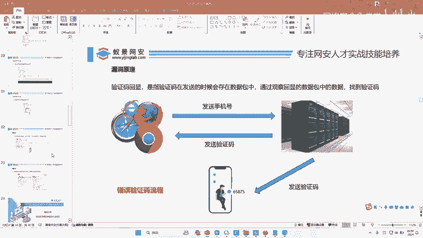