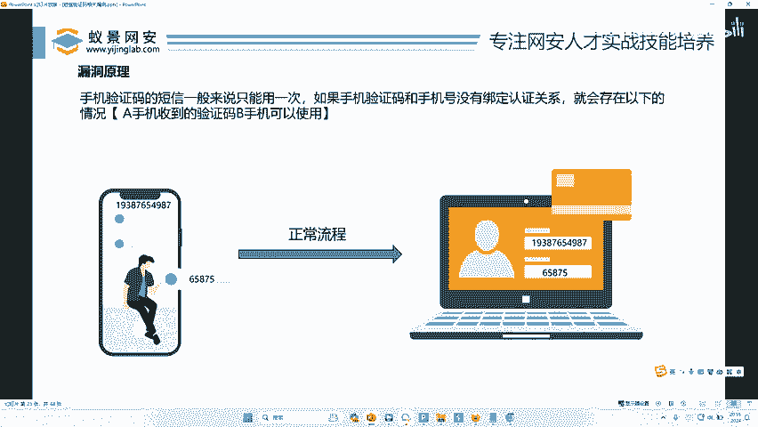
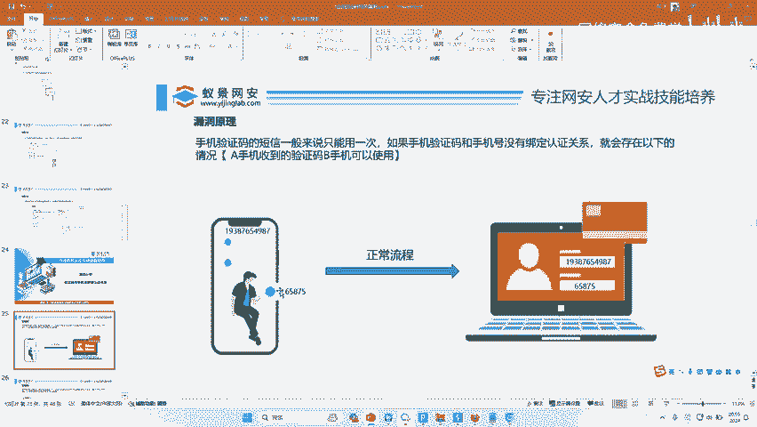
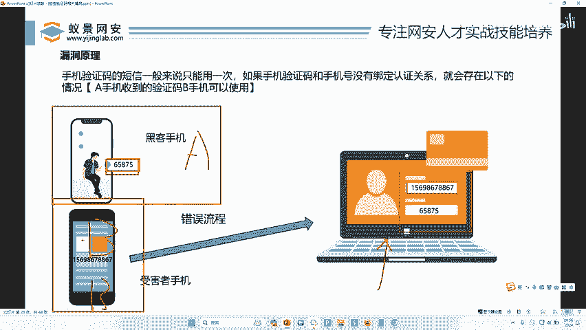
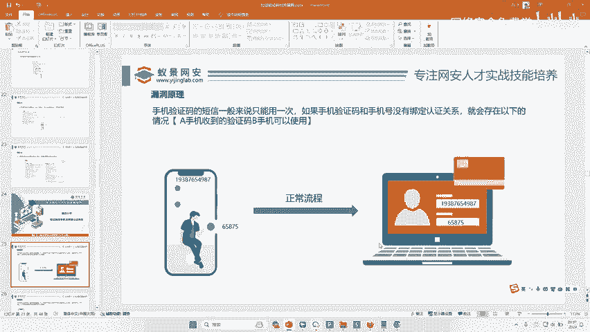
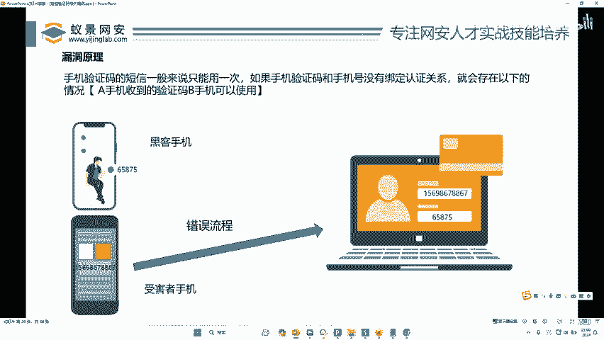
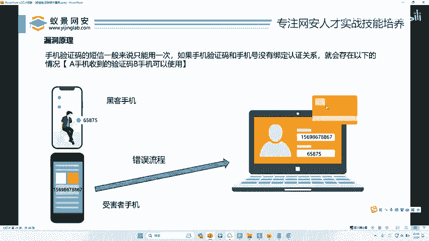
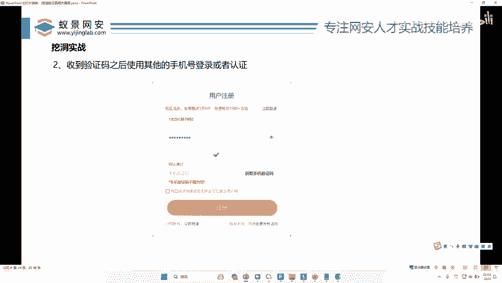

# 2024B站最值得看的黑客教程 ｜ 网络安全／渗透测试／内网渗透／漏洞挖掘／web安全／kali linux／红队靶场／CTF／信息安全 - P37：验证码与手机未绑定认证关系 - 网络安全免费学 - BV1uBsTetEow

看下一个漏洞叫做短信验证码与手机未绑定认证关系。好，那这个漏洞呢也非常常见，对吧？也非常多。好，那接下来我们来看一下什么叫做短信验证码跟手机未绑定认证关系。😊。

啊就说实际攻击中攻击者跟注注册者不在一个网段也可以拦截吗？你这个什么问题啊啊，这我们就是实际攻击啊，我刚才给你演示的就是实际攻击啊，我就是用我们公司的网站，只要你的电脑能上网。

你都可以随便测啊啊对不对啊？OK只要你大家电脑能上网，好吧，我们都可以去互联网上找相关的漏洞，好不好啊？O兄弟们，我们来看下一个漏洞的啊，下一个漏洞呢叫做什么啊，叫做未绑定认证关系，对不对？好。

未绑定认证关系的原理是什么？来，兄弟们，我们来先看一下，你看手机验证网的短信，一般来说只能用一次，对不对？比如我给一个手机发的短信。😊。

对不对啊？发比人说但是注册，哎呀，你只有在注册的时候才能发短信吗？注册登录找回密码，很多时候都要提供手机号去干嘛去发短信的。只要这些提供手机号，要发短信的地方，你都可以测，不仅仅单单是注册，对不对？

那只要有发短信这个功能都可以测，好吗？😡，OK我们来看一下手机验证码一般来说只能用一次，对不对？如果说手机验证码跟手机号没有绑定认证关系，就会存在以下情况。听好了，A手机收到的验证码，B手机可以用啊。

大家把这句话啊在你的心里默念几遍。A手机的验证码在B手机上可以用啊，我再读一遍A手机收到了一个验证码，但是B手机我可以直接去用。懂了吗？啊，没懂，我来再看一下。好，这是A手机。叫什么？

叫19387654987OK他干嘛呢？你看在这里输入他的手机号啊，填入他手机收到的验证码。OK登录到他的电脑了，对不对？这是A机主啊，这是我们正常流程。为什么？正常流程是这个验证码只能这个手机号用。

对不对？啊，只能用一次，而且这个验证码只能这个手机号用啊，只能用一次，是不是okK兄弟们，那我们来看一下错误流程是啥啊，错误流程就是这样。你看这是A手机。😊，对不对？

A手机okK我们A手机收到了一个验证码。😡，是谁呢？啊？A手机是你的黑客的手机，对不对？好，黑客的手机好，黑客的手机收到了一个验证码。好，然后这个是B手机，然后我们拿着B手机的手机号码啊。

用黑客的验证码点击登录，然后我们就直接登到这个人的手机上去了。😊，哎，理解了没有？这个呢就叫做未绑定认证关系。

理解了吗？

理不理解这个流程啊，那我们再说一下这个东西怎么去用。好吧，你看比如说呢这是个网站啊，这个网站可能是注册，可能是登录，反正需要一个提供一个手机号，对不？然后进去。好，那么你作为黑客。😊，是不是？😡，好。

你在这里输入你的手机号。啊，然后这个验证码就嘚嘚嘚嘚，哎，发送到你的手机上了，对吧？然后这个时候怎么办呢？哎，那这个时候呢，哎你把这个手机号一抹一插哎，改成什么，改成这个人的手机号。

然后拿上你刚才收到的验证码，对不对？直接给他登一下，然后点击点击登录啪哎。😊，登进去了。怎么能没有理解呢？我再给大家演示一遍啊，你是不理解是吧？不理解啊，我在这个这里给你验证一演示一遍，好吧。

你看这是我注册的，对不对？啊，这是我比如说这个手机号是我的好，假如说这个手机号是我万里自己的手机号好，我点击我的手机号，我要注册的，对不对？好，我点击获取验证码啊啊，然后我现在获取到一个验证码。

验证码是多少呢？验证码是678643。😊，好，然后这个时候我不点击注册，我只获取了验证码，对不对？然后我不点击注册，然后我把这个手机号一改，改成我妈的。😡，然后我点击注册，然后唉注册成功了。😡。

理解了吗？那么这个验证码是怎么来的了？是不是刚才上一步我的手机收到的，然后我的点击注册的时候，我把这手机号改了，改成其他的了。😡，哦O点就注册，然后我也注册成功了，那是不是代表着我就随便注册了呀。

对不对？我只要给我手机发个验证码，然后我这注册的时候，我随便捏一个手机号，我随便捏啊，我从182捏到147185186，随便捏啊，我全能注册成功，我一天能给他注册100个。😡，对不对？😡，是不是？😡。

这是不是因为这个验证码没有跟之前我们发送手机的那个验证码绑定认证关系啊？对不对？所以可以导致我们任意的一个手机号都可以注册。哎，理解了，小伙伴没有理解了给李哥扣个一，我再讲一遍，对不对？好。

正常功能是输一个手机号，得到一个验证码，点击注册，对不对？好，那我们错误情况就是我们先输入第一个手机号，点击发送验证码，我们再收到验证码，把自己的验证码发到自己的手机上啊，能看到，然后在注册的时候。

把这个手机号一换换成其他人的手机号，然后我们点击注册就可以注册成功了啊，原因就是这个验证码没有跟手机号，对不对啊，有一个认证关系的绑定，哎，导致什么我们可以随便注册，是不是随便注册了啊，那就非常简单。

非常nice，对吧？那么这种地方在哪里呢？我们找回密码登录啊，只要是有手机注册的地方啊，手只要是能发送短信的地方，对不对啊，都可以去试有些人老给我说李哥你。😊。

这种情况就不存在不存在不存在。怎么不存在了呀？我说存在就存在，我说有就有啊，我挖洞挖的多，还是你挖洞挖的多啊。我跟你说，这种漏洞还多比比皆是啊，你飞不听，你就说没有啊，那是因为你没有见过，对不对啊？

我说这个太空里面人能飘起来啊，真的我们都不要重力，我一下蹦一下，我能蹦10米高。你说我不信啊，我在地球只能蹦2米啊，你在太空上就能蹦10米，你都没去过太空啊，你不能说这样的话啊，我现在给大家讲这些东西。

我告诉你，就是那些啊，你在外面看到那些人啊，几几千块给你讲这些东西，就这些他能挖洞也是挖这些。😡，啊，一定是这样的，对不对？你去试啊，一定能试到这样东西的啊，你只要试两天啊，我教他讲的这种情况。

你好歹能试出一个来，对不对？O兄弟们，接下来我们来看看这个漏洞怎么去挖啊，那我在这里就不说了啊，想怎么挖啊，如果不用BP也可以挖我们不用BP怎么去挖这个漏洞啊，李哥给你讲一下，对不对啊。

就是这样不用BP就是这样挖，对不对？把这里呢先写第一个手机号点击发送然后在注册的时候换个手机号点击注册看能不能成功，能成功就代表着没有绑定认证关系，好不？那么这个漏洞就是这样去挖啊。

不需要BP当然你用BP操作也可以，对不对啊？BP操作也可以啊，但是哎有点多词一举了，对吧？好，那么这个漏洞呢跟我们什么漏洞比较像，跟我们在那个我再给大家说一个漏洞好吧？跟我们的一个签约漏洞非常像啊。

你们知道签约漏洞吗？啊，签约漏洞前几不是比较火像那个百度网盘什么都有啊，什么叫签约漏洞啊，大家可以了解。😊。

就是说。比如说啊这个首充充6块啊，或者说那种啊第一个月啊，你要付9块钱，但是你要跟我微信绑定一下，对不对啊？第二个月我就这个首月绑定是9块，对吧？第二个就是十几块啊，就是类似于这种对不对啊，签约啊。

跟你微信签约，每个月连续自动续费那种漏洞，对吧？他跟这个未绑定认证关系也有点很相似啊，他也是用两个微信号，对不对？两个同时签约，然后一绑一截，然后导致这个可以延长时间，这样一个东西，对吧？啊。

他其实也是没有用任何工具的，就用两台手机对吧？就可以无限的去薅你的羊毛啊，啊之前那个QQ阅读对吧？薅会员都是这样薅的对么？拿多个手机啊，同时去搞，对吧？同时去点，然后帮那个会员帮帮帮帮帮就一直涨，对吧？

只是大家不知道这个东西，对吧？你知道了你也能去做啊。

