# 2024B站最值得看的黑客教程 ｜ 网络安全／渗透测试／内网渗透／漏洞挖掘／web安全／kali linux／红队靶场／CTF／信息安全 - P38：验证码转发漏洞 - 网络安全免费学 - BV1uBsTetEow

好，那兄弟们来我们来看最后一个漏洞啊，是什么漏洞，是我们的验证码转发漏洞，好不好？兄弟们来看一下验证码转发漏洞啊叫什么啊，转发漏洞啊，我们再看下这个案例对吧？😊，好。

那么有些开发人员在接收手机号或者采用接收手机号，对不对？或者说在这个嗯处理手机号，我们发过来的手机号的时候，对不对？使用的是一些循环或者数组的方式去接收啊，并没有对我们的手机格式，或者说是手机的次数啊。

进行校验啊，导致我们可以同时把验证码发送到两台手机上。好，什么意思？兄弟们，我再给大家看一下这个签这个什么叫什么转发漏洞到底怎么搞啊，我来，我们来看正常流程，正常流程是这样的。来。

我们还是在这里打出来啊，我们在这里填入一个手机号啊，按道理来说，你只能填一个手机号，对不对啊？当然这个页面，你只能填一个，是不是啊好，你把你的手机号填进来发过去了啊，然后这个服务器收到之后。

就会向你提供的手机发送一个验证码，这个是正常流程没有问题，傻子都会好，那我们来看一下。😊，货物流程是什么啊？错误流程就是这样的啊，我们在提供手机号的时候，对不对？直接给他提供了两个手机号。好。

然后干嘛呢？然后他向这个手机号发送了一个验证码，然后再向这个手机号也发送了一个验证码。然后两个手机号都收到了相同的验证码。兄弟们。见没见过。没见过，他说啊没见过不存在啊。

你说没见过不可能你就不可能有这样漏洞啊，不信我给你试一下啊，你他娘的在这个框里面，你都输不了两个手机号，你只能输一个对不对啊啊，怎么能发两个呢？哎，你接下来啊见都没见过，对不对？哎，那这种漏洞多不多。

哎，也是有的，对对？我们来看看案例，你看像这个小伙伴在挖洞的过程中，对不对？你看底下就写了两个手机号，对不对？写了两个手机号之后呢，你大家看一下，哎，你看他的手机在同一时刻。

两个手机都收到了验证码都是673954673954。😡。

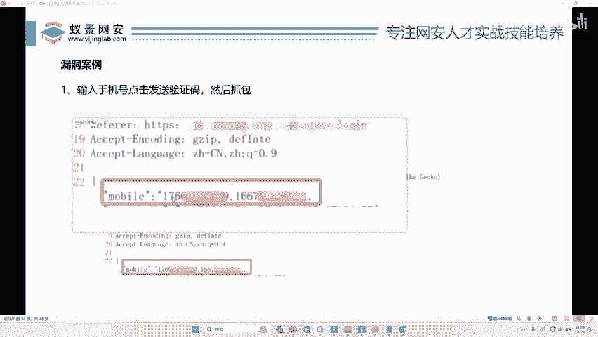

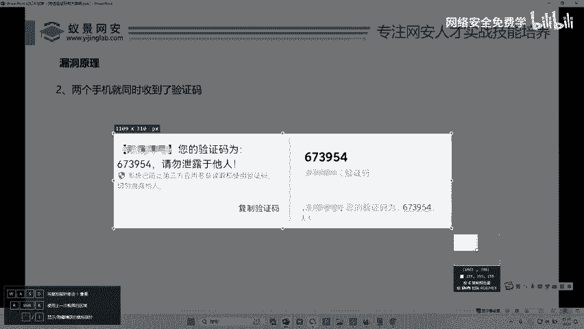

对不对？啊，那有人会说了，okK我那我怎么输入两个手机号呢？我不会呀啊，这里我只能输一个呀，怎么办呢？O那我们的页面不能输入，不代表我们的BP不能输入，对不对？好，我们可以用BP去进行输入。哎。

你们忘了是不是还有BP这个东西了。好，我们往这看。😊，啊。好，这里能看到吧。好，那么这个东西大家看一下，我们哎找到这个数据包，你看这个数据包是不是向这个手机号发送验证码的手机号，对不对？好。

我们右键把它发送给repeter好，然后去更改这个数据包就可以了。好，这里是不是我们的一个手机包。好，那我们怎么去更改这个手机号，我们可以加一个逗号，加你另一个手机号。😊，然后点击发送。对不对啊。

他提示什么啊，mail长度过长，对不对？那证明它没有。😡，是不是好，这是一种形式，对不对？我们可以在后面加个逗号。😡，对不对？把这个手机号写成两位。哎，理解没？也可以不加这个逗号，直接写个空格。

点击发送。啊，有人说哎那你这里就没有发，那是因为我们公司这里不存在漏洞，对不对？我在教你怎么去测啊。你首先第一个可以给大家加个逗号。😡，好，可以这样，那还能怎么做呢？除了这样做，还能怎么做？听好了。

还可以把这个U name复写。😊，我们加个这个符号。这样。啊，提供两个参数。点击发送。啊，也可以干嘛呢？也可以把它这样提供两个进行发送。这种情况都可以。好，我在这里给大家总结了一下能复习的方式有多种。

看到没？你看。这是手机号，我们可以在后面加个逗号，再续写一个手机号，对不对？也可以把这段话复制一下，对不对？写两遍啊，也可以在这段号后面再写一个手机号啊，回车再写一行。😊，理解了没有？这个就是什么？

我们手机验证码转发漏洞，好不好？我们再抓几个现实的包给大家再去筹集一眼，好不好啊？

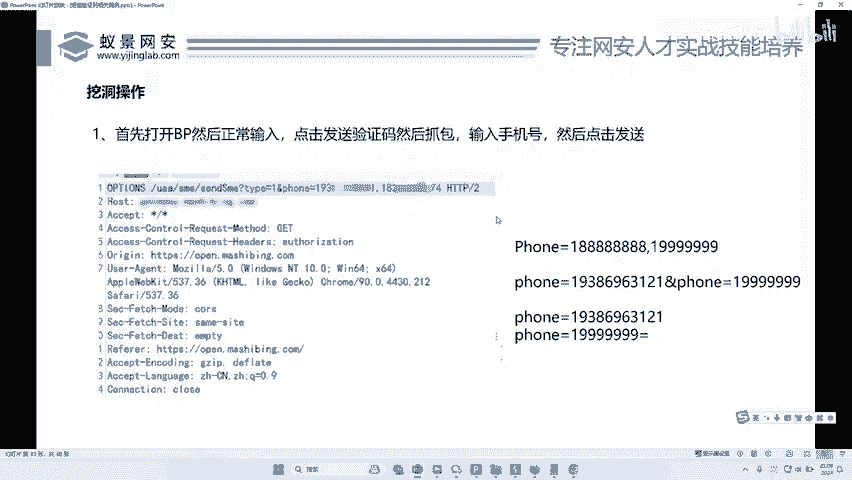

好，我在这里呢今天也给大家准备了5个案例，好不好啊？5个网站。😊。

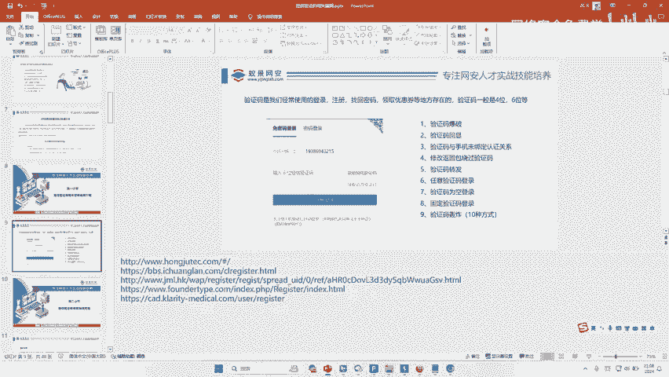

来，我们来看一下啊，一个一个抓包啊。其中有一个网站啊，比如说你看这有一个巨商城啊，它我不知道他哪个公司的，对不对？啊，他是不是啊输入用户名，输入验证码，好不是，是不是啊好，这是个真实网站，对不对？好。

那么我们现在再抓个包，看一下它的这个发送验证码的这个结构。😊。

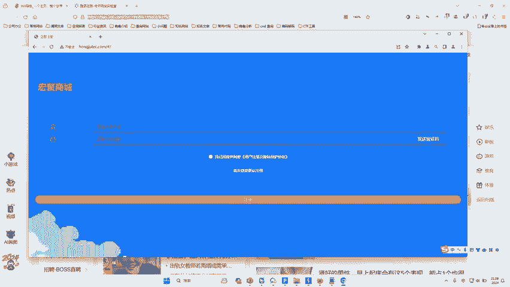

好，我们点击代理啊，然后啊兄弟们在这里输一个，对不对？😊。

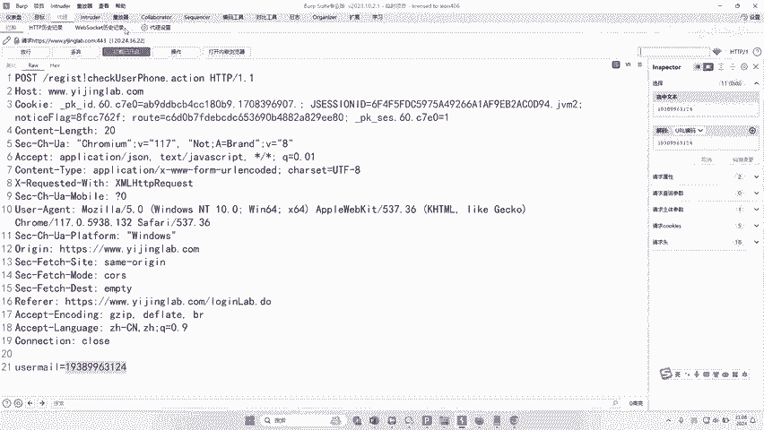

好，然后点击什么？哎，在点击发送验证码的时候，对不对？我们直接干嘛呢？哎去给它抓包。

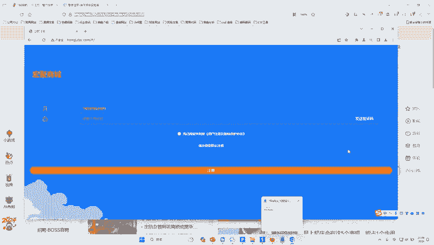

啊，点击说错了，发送验证码，看到没？这里是不是抓到了他的手机号？😊，好，那么我们要转发，那你就在什么？在这里面。对我们把这息先右键发送到repeer里面来。怎么搞？可以先把它复制一遍，对不对？好。

在这里双写一下。对不对？也可以干嘛呢？也可以在这个后面啊续写一个。😊，啊，在这里面续写一个手机号。啊，这里再写一个。😊，对不对？然后不要这行啊，这两种方式都可以去找，对吧？然后你点击发送啊。

看它能不能发送成功啊，像它是不是提示手机号格式不正确，对吧？好，那这样的话发送哎，它提示successful，哎，就发送成功了啊，那么这个手机号就接收到短信了，对不对？😊，哎，兄弟们理解没有啊？

如果说它存在转发，你就把它那个啥也复制一下啊，在这里写一下，我们点击发送啊，你看也发送成功了，对不对？你看说不定这两个手机号，对不对？他都收到了短信的啊，我也不知道对吧？你拿你两个手机号试一下。

你看但是我现在一发送啊，这里好像多写一个对吧？啊，他这个啊你看它好像真可以对吧？啊，刚才是可以的对吧？这个手机号格式不一样，对吧？如果说我们把这个格式啊换成正确的。😊，啊，把这个二改成2，对吧？试一下。

你看successful，对不对？你看操那这个东西可能就存在转发，对不对？他两个手机可能都发了短信。

哎，理解了没有？理解了给李哥扣个一样，这个呢叫做什么验证码转发。那有人说了，哎，那验证码转发了动能干什么呢？对吧？

那我上面这个手机号可以写别人的下面这个手机号可以写我的那我的手机号跟别人的手机号都能收到同样的验证码。然后我在注册的时候，我用别人的手机号注册。然后我输入自己手机上输到验证码，对不对？

然后我是不是就登录成功，注册成功，是不是又达到了一个什么啊，任意用户注册的目的。😊。

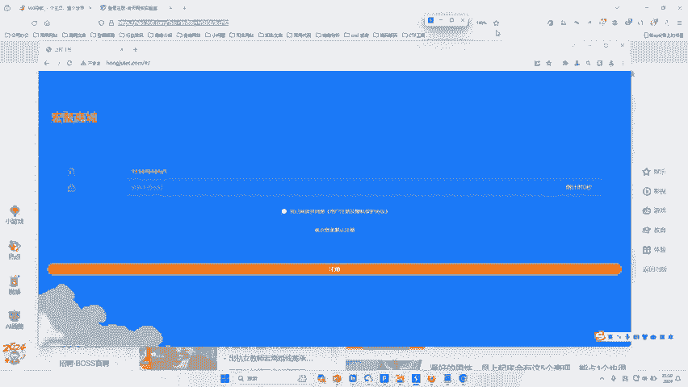

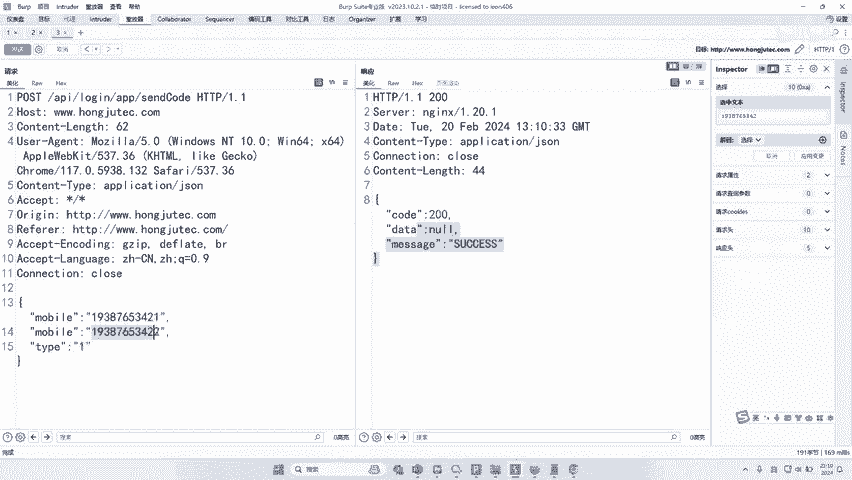

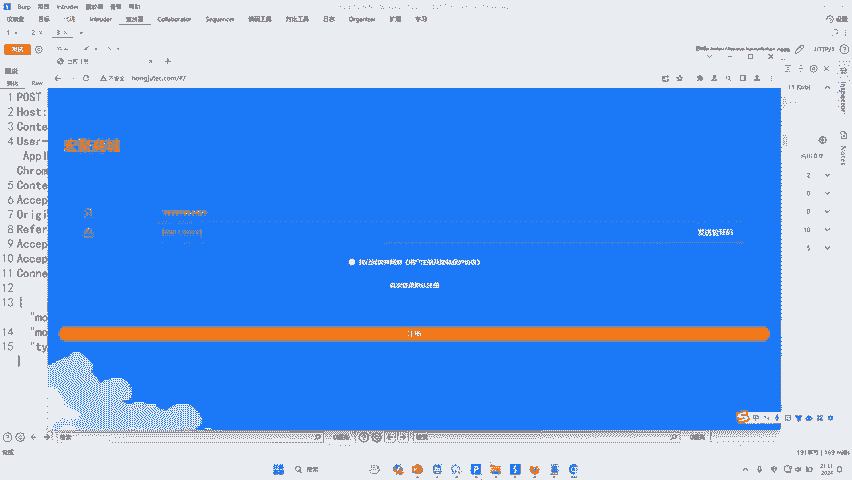

对不对？兄弟们。😡，啊，对不对？兄弟们是不是这么个理，是李的扣一啊，你就说今天听爽了没有？😡，啊，大家觉得不爽，我让大家再爽一波行不行啊？有人说李哥，我今天挺爽的啊，但你是你能不能再给我讲讲短信轰炸啊。

没有问题。好吧，由于这个我给大家这个短信轰炸，好吧，这个课程啊，我给大家已经准备好了，大家看一下啊。😊。

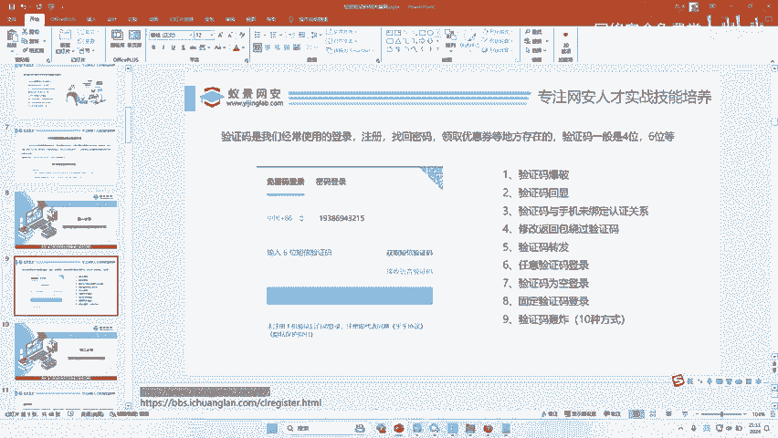

啊，准备的非常详细啊，你在网上都找到这么详细的短信轰炸了啊。好，我们这个短信轰炸的东西，大家看一下啊，你看到没啊，短信轰炸短信轰炸就是一秒可以给别人发十几个短信，对？

这里给大家准备了大量的案例跟大量的绕过方式，修改IP绕过，对不对啊，我们的空格绕过特殊字符绕过加86绕过标记接口绕过Q可以绕过。

刚才给大家看那个网站啊刚才测的那个网站就有一个短信轰炸漏洞是标记接口可以绕过漏洞绕过，对不对？可以一秒钟发100个短信啊，刚才测的那个东西就有对吧？我刚刚说的刚才我测那个网站，它就有短信轰炸啊。

而且一秒钟可以发很多啊，利用的就是标记接口，对不对啊啊，就是一秒钟给大家发发很多短信，对吧？这里已经给大家准备好了啊，那么由于时间关系啊啊有人还说李哥啊，刚才有人在问了，对吧？说李哥。😊。

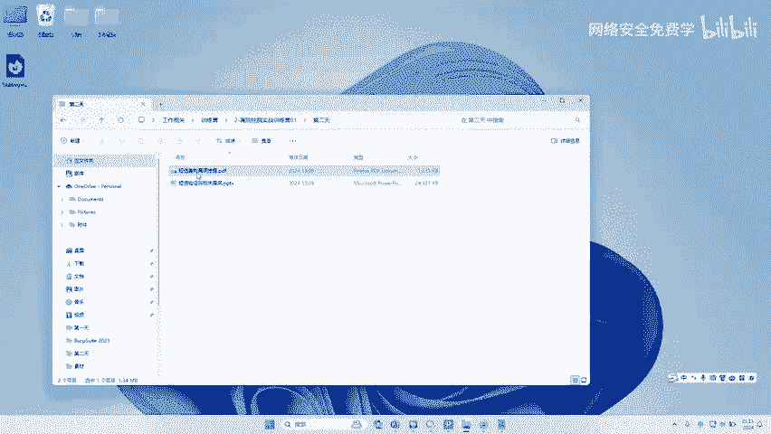

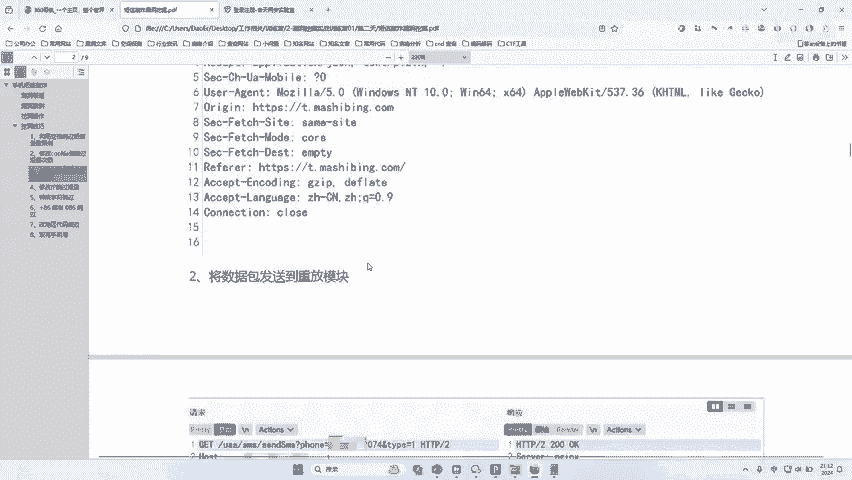

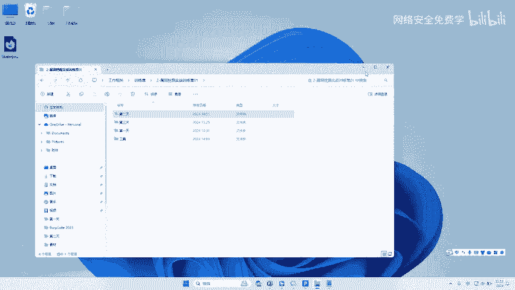

啊，你的这些东西我们找了这些漏洞，对不对？去哪里提交，哪里换奖金，哪里换钱呢，对不对？好，李哥在这里最后再给大家说一下，怎么去挖这些漏洞，去哪里挖这些漏洞，好不好啊。😊，O。来，我们来给大家说一下啊。

首先我们要知道啊，我们挖洞它有两个平台啊，不是两个平台吧啊，一个叫企业啊SRC一个叫公益SRC好，那么什么叫企业SRC啊？企业SRC就是说你专门挖别人企业的啊，什么企业呢？就是那些有SRC平台的企业。

比如说阿里巴巴你挖漏洞交给阿里巴巴是不是你给阿里挖漏洞，然后把漏洞交给阿里巴巴，阿里巴巴再给你钱。那么阿里巴巴只收阿里巴巴的漏洞，不收腾讯的漏洞。那么你挖到腾讯的漏洞，只交给腾讯腾讯给你钱。

就是自家人收自家的漏洞，这个叫什么企业SRC。😊，哎，对就是人家企业会自己收自己的漏洞啊，那就叫企业SRC。那么什么叫公益SRC？就是很多企业它并没有安全意识，很多企业它并没有。

或者说很多企业都不知道自己公司有漏洞，对不对？那么我们就可以把这种漏洞交给公益平台。那么由这些平台去处理啊，那么我们这些平台在哪里啊？如果大家想挖啊，我们先不要挖这个企业，因为难度比较高。大家可以先从。

先从工艺或者EDU。啊，就学校EDU也有啊，就是我们如果挖到学校的交给学校的平台，对不对？那么一般来说去哪个平台比较好呢啊？平台也非常多啊，这里如果是你是初学者啊，建议大家先去漏洞盒子上去尝尝鲜啊。

先去漏洞盒子吧。😊，啊，那我们来看一下啊，怎么去挖啊，那个网站在哪里哈，给大家指指指条明路哈，怎么去赚钱啊，看打开这个漏洞盒子啊。😊，啊，所以这个漏洞盒子这个东西对不对啊，中国领先的白茂社区。哎。

来我们看一下这个漏洞盒子里面就有很多什么啊，很多漏洞，对不对？比如说公益没钱，公益有钱啊，如果公益排名比较前的话，他们这个平台啊会奖励1万块钱左右啊。它有积分的啊。来，比如说呢你想挖企业。

你看我们来看一下在这盒子里面都可以挖哪些企业。比如说联想集团的漏洞。哎，你挖到联想的漏洞了，对不对？哎，你直接交到这里啊，你如果挖到oppo了，你就交到这里。如果挖到丁香园了，你就交到这里。

如果你挖到了字节跳动了，你就交到这里。如果你挖到了华为了，你就交到这里啊，啊，非常多圆通对不对？同盾旗帜爱奇艺对不对？千寻滴答一支付啊，啊，去电轻松vivo对不对？金山云宝马自乐信范威美的对不对？

大家都可以去挖啊。然后比如说你挖到联通漏洞啊，你就点进去啊，在这里面一交就可以了。好，那么如果大家要挖一些公益的啊，我们来看一下这个点击这个项目大厅啊，这里面会有这个公寓，你看我们来看一下。

你看联想的对不对？oppo的play。😊，理想的啊这些都是企业的对吧？然后我们第二页它会有一个什么叫做。😊，公益你看这不是有个公益的渠道。来，我们把这个公益点开。好，点开。来，点开。

那么这个号是我一个新号，我今天刚弄到一个号，它还没有挖漏洞，对不对？好，我们点开之后呢，哎直接在这里是干嘛？点击这个提交漏洞。😊，好，来选择公益。好，那这个标题叫什么啊？比如说刚才我们挖到一个洞。

假如说我们挖到了什么怡景科技，我们就把它叫怡景科技啊，比如我们叫怡景。😊，科技。对不对？存在什么啊这个什么任意用户。存啊存在任意用户。注册漏洞对不对？它的形式是什么？就是某某公司存在什么样类型的漏洞。

好不好？然后这里点击市政事件型啊，一定要点击事件型，对吧？评定，我们就点击普通啊，然后这个厂商名我们可以写什么怡景科技啊。

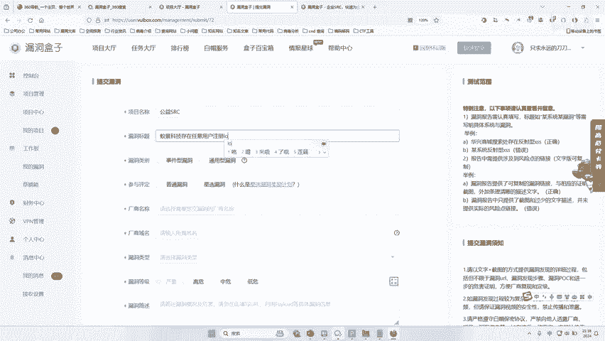

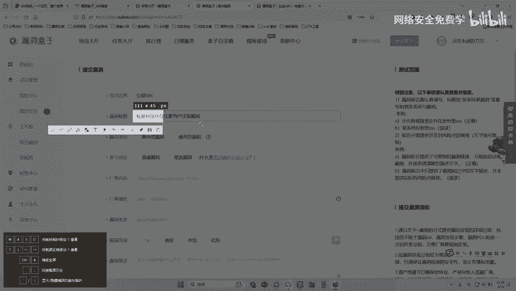

啊，一景科技是不是有呢，对不对？哎，搜点一下哎，域名，哎，我们是不是有怡景点labs，啊，我们找一下我们的官网啊。😊，来，假如说这个网站啊，我这里就给你简单演示一下，对吧？好，域名啊，我们把这个。😊。

匿名写一下。好，漏洞类型，哎，你就写一个什么，哎，写一个web漏洞，对不对？逻辑漏洞啊，然后呢，高威哎描述一下，哎，该公司某某哪个地方存在什么漏洞可以干嘛，可以干嘛，说一下，对不对？然后呢功能点一写。

然后把你的截图一写修复建议写，对不对？然后点击提交漏洞就可以了啊，就这么简单，就这么操作方便，然后漏洞通过之后呢，它会干嘛呢啊，会有一些积分排行，我们来看看这排行榜。😊，他会给你积分，对不对啊？

会给你积分啊。你看啊，像比如像这个小伙伴对不对？他会有6537积分，那么这个积分你看第一名他就会给这个个十百1万元这样一个奖金，对不对啊？积分会给奖金啊，而且他们啊像公益，你看公益啊。

比如我们挖的是公益对不对？你看公益的话，他会给一些入场券也会给一些奖金啊，公益给的高。你像这积分你看到没？个十百千万14万，对吧？14万积分，第一名啊，那么他等季度末结束的时候，可能会给他一些奖金。

对吧？啊，如果我们挖企业SRC啊，这些企业就会直接给你钱哎，明白吗？啊？这些东西都不违法啊，那么大家在挖这些漏洞之之前呢，一定要干嘛呢，一定要去阅读啊，他们这些平台的一些什么漏洞准则啊。

而且我在这提醒你知道，最好要有人带着你去挖，你不要自己瞎去搞啊，对吧？就是你自己瞎搞的话容易啊违规违规，明。😊，就跟你干嘛一样，你自己不懂容易违规，你不知道哪些是可以做的对吧？啊，哪些是不可以做的。

大家可以看到啊，你看3小时前这个人在理想对吧？又拿了200块，这又拿了200块，这个又拿了200块，对不对啊？只要大家对不不对他们的企业造成危害，大概率来说都不会造成一个对你。😊，进行影响明白吗？啊。

给你对你进行影响，明白吗？哎，理解了没？这是我们挖洞。当然挖洞的地方非常多，不是说只有动的盒子啊。如果你是初学者啊，你可以注册一个这个啊，用手机号注册一个，然后去玩一玩，学一学。

看一看能不能用李哥今天教你的方法去给咱挖几个漏洞来，对不对啊，挖起漏洞啊，应该是没问题的。大家只要能找到那个注册页面登录页面就可以了。好不好？小伙伴们听明白没有？听明白给李哥扣一波一哎，李哥扣波一啊。

今天的课。😊，啊，听明白了对吧？好。😊。

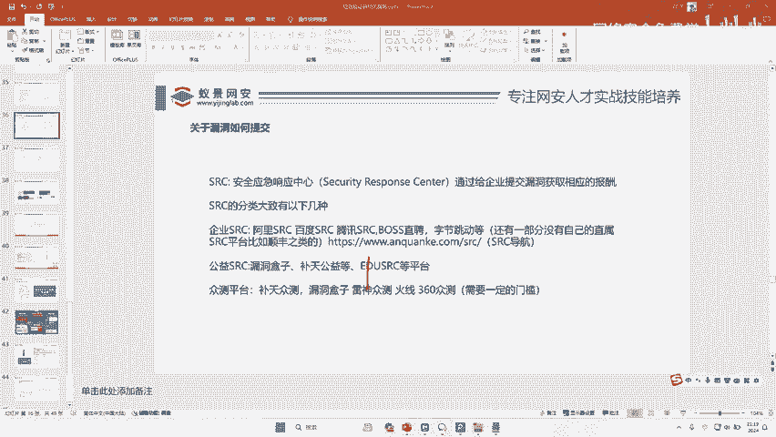