# 2024B站最值得看的黑客教程 ｜ 网络安全／渗透测试／内网渗透／漏洞挖掘／web安全／kali linux／红队靶场／CTF／信息安全 - P39：常见FUZZ姿势和工具及字典 - 网络安全免费学 - BV1uBsTetEow

常见的发姿势、工具以及字典啊。那么说起这个发子啊，可能很多小伙伴是第一次听到这个名词啊，有人说呢你们听的最多的啊，可能是哎怎么这么凯dy怎么这么熏机，对吧？很多小白可能都是这样一个感觉。😊。

啊，或者说哎这有个什么漏洞私克住入漏洞，对吧？啊，文件上传漏洞，对不对？但是可能没有听到过fa子这个东西。好，那么fas全拼什么？哎，全拼就是这样一个东西。好么？FUZZ对不对？OK这个if读。😊。

发的音发的音对不对啊？这个乌不发音啊，后面读字fa子对不对啊？这样一个东西。那么有的时候呢，我们可能会面试的时候啊，别人可能会问你啊，那么在这里给大家说一下啊，这个发子。😊，哎，他可以叫这样啊。

也啊我们也可以叫fa子一样啊，不是fuck啊。😊，唉，他妈的是不是叫fuck骂我了，对吧？哎，没有没有啊，没有那个意思啊。😊，OK那是fa子的意思啊。😊，啊，这两个都是fa子。

那么发子在这个呃英文的翻译成中文，它是叫一个什么意思呢？哎，它是叫绒毛，哎，模糊细毛这样的一个感觉，对不对？好，那么有就说了哦，那绒毛细毛，那这个跟我挖洞到底有什么关系呢？那么到底什么是fa子呢？

ok那么接下来我们用一张图啊，简单通俗易懂的呢给大家去讲解什么叫做fa子。好，我们每个人都使用过手机，每个人都使用过支付宝，对不对？我们每个人都用支付宝给哎自己的女朋友，自己的爸爸妈妈。

自己的长辈转过账，对不对？那么我们在进行一些大额转账的时候，可能会遇到如下情况。哎，就是你说你转账对不对啊，弹出一个框啊，上面提示请确认收款人的身份，对不对？然后请填写收款人的首个姓名。

OK然后这里让你填一个字儿。😊，他叫什么什么什么什么尾。OK那那我们可以看到支付宝啊给了我们一个部分，知道它叫什么尾，但是不知道他的姓。O那么这个时候我们怎么办呢？哎，我们是不是可以猜？他的戏。王磊。

李伟，张伟。赵伟。对不对？是不是去张大伟，对不对？齐同伟是不是去猜。是不是猜他的姓名okK那么这个呢就叫fa子。那么fa子它是一种思路，它是一种思想。那么再总结一下。

我接下来用一个官方的话给大家解释一下发子。那么发子叫什么呢？发叫在知道某些特定条件下，对未知的。部分进行逐个猜测。这个就叫fa子。那么在这个收款转账记录里啊，我们只知道它的什么名叫什么什么尾。

但是不知道它的姓啊，没有关系，我们可以去猜它的姓，猜出来之后，那么点击确定就可以转账成功，对不对？那么是不是我们知道它的什么叫伪了，这已知条件，对吧？不知道东西是它的姓姓氏哎，对不对？

这跟我们的昨天讲的密码爆破，是不是非常的类似呀。哎，我们假如知道它的账号叫什么叫ad me。好，我们用昨天哎讲的那个什么爆破技术，我们去猜它的密码，哎，密码是否是123密码是否是456密码是否是789。

对不对？O那这个爆破的这个东西，它其实也叫fa子，哎，可以把它统称为对不对？它叫fa子。那么我们可以看到fa子这种技术可以用到方方面面，我们平时生活中挖的过程中都。😊，会用到这个东西，对不对？

它就是类似于枚举这样一个概念。好，那么有人说了，OK那我知道了发子啊，就是猜嘛，对吧？我爆破密码呀，我破例破解，我都用到fa子。那么我在挖洞的过程中，我还能在什么时候能用到fa子呢？啊。

比如说大家不要理解为只有在爆破的时候能用到发子。那么我在挖洞的其他地方怎么用到fa子呢？O那么什么时候会用到fa子呢？哎，比如说第一个破解密码的时候会用到发子。

扫描参数的时候会用到fa子测试漏洞的时候会用到发子扫描目录的时候会用到发子，对不对？等等等等，很多地方，我可以这么告诉你啊，那么发子可能这这套思想这套技术，对不对？😊，在我们挖洞的时候。

要占我们百分之八九十啊，我们百分之八九十都是在用到发子。我们知道跟发子的这种东西呢，还有一个叫并发，对吧？并发发子啊，俗称我们挖动机的两大惯用手段，对不对？有了这两个手段，其实挖洞其实就非常简单了。

对吧？有人说挖发子用用的好漏洞少不了，对不对？那么接下来okK兄弟们，我们就来看几个实战案例啊，先我们先不学，我们先看一下ok这个发子到底能干嘛。哎，接人通过发子都挖到了几千块钱。

上万块钱漏洞到底是如何挖的啊，ok我们接下来看几个案例啊。😊，好，那么在讲解这个案例之前，对不对？好，我们来看一下啊。你看这个第一个案例啊，当然接下来讲的这个案例都是来自于互联网上案例啊。

大家都是可以公众公开去搜索的，对不对？那么有一个人啊我们在互联网上有一个人写了他的一个报告，说什么了？说他在挖洞的过程中遇到一个这样的地址啊，就什么一个地址斜杠upload点PHP然后呢。

这个页面是不是是一个空白页面，哎，就是他访问了这个网站，但是这个网站一访问，这里是白白白白干干净净，对不对？比他的脸都白，比他兜都干净，里面啥都没有。哎，那么可能很多小伙伴遇到这样的东西，网站哎呦。

这网站啥都没有，都是白白干干净净。那我怎么还能去挖漏洞呢，对不对？哎，那么他就用到了一个叫做fa子的技术，对不对？O那怎么去发呢？哎针对于这些页面，对不对？他对这个参数进行了f子，对不对？

发现了其中一个参数为度。😊。

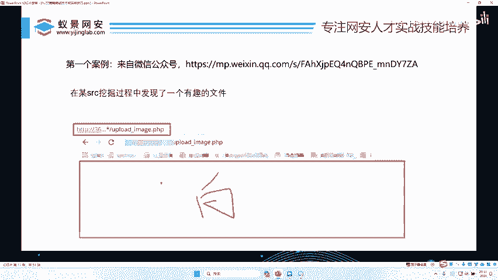

有人说了ok李哥，什么叫参数啊，对不对？好？接下来我们讲一讲这个网站的URL地址。好，那么网站的URL也就是我们的网址啊，一般是由什么类型构成的呢？哎，一般它就是长这样哈，前面这几位是它的主域名啊。

比如说ATDB漫画斜杠3W点百度点com，对不对？好，后面会跟紧跟着是一个什么文件夹的名字，对不对？啊？比如说前面是百度，那么在百度服务器，它百度也是一个电脑，对不对？那么在百度服务器可能会放哎。

比如说这个是百度对不对？那么百度里面哎它的网站的结构长这样。那么比如说你想访问百度里面的date的这个文件夹，哎，你这个百度后面斜杠就加这个什么文件夹名，比如我们加上那个d。😊。

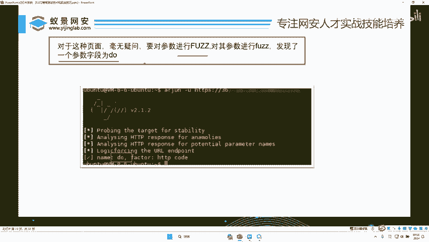

那么date文件夹里面，比如说有一个index点PHP啊，什么upload那PPP哎，我们就把这个文件名写上来。哎，理解没？它的这个格式大体上就如下，对不对？先是它的网址。

然后这个再再就是它这个这个网站的这个服务器的文件文件夹的名字，对不对？如果说没有这个文件夹名字啊，那就是说直接是它的根目录，根目录就是它这些文件，对不对？后面直接可以跟上它的文件名，哎。

大体上是这样一个东西。好，在这里呢给大家举一个例子啊。😊，好，比如说哎一个网站HTPP对不对？😊，HTTP。冒号对不对？3W点。点百度。百度点com好，我们斜杠。啊，百度里面有个什么叫做GS哎GS啊。

有一个什么叫做啊慢点GS。那这是什么意思呢？哎，这就是百度的这个服务器的啊，它的文件夹下面的GS文件夹，下面有一个什么慢点GS文件OK就是这样一个东西啊，那目录就是这样的。

你看就比如说你看哎就是说这在这个GS文件里面，对不对？哎，有一个慢点GS这样的一个文件啊，😊，好，那那么假如说那么后面的还要遇到什个什么？就是参数了，对不对啊？那这个参数是干嘛啊？就是用来传值的。

对不对？因为这些这个地址是不是我们是从浏览器里过去的，就像李哥昨天给大家讲的，哎，我们的手机号呀，我们的验证码是怎么发过去的，就是通过这个值传过去的，对不对？好，那假如说呢这里个mGS哎。

我们写一个什么这个。😊，奉。哎，等于。哎，那这是什么意思呢？哎，这就是说什么向这个慢点GS去发送一段信息，哎，其中它的什么手机号是182736548。哎，那么我们把这样一段话，在网址里面一回车，对不对？

就会顺着网线，对不对？找到百度的这个地址，找到百度里面的GS文件，找到百度的G这个慢点GS文件，然后把我们带的这个手机号就发送给了百度。😊，OK那么这个叫什么？哎，这个呢叫什么叫值参数值。哎。

那这个凤叫什么啊？叫什么叫参数。叫参数，这个叫什么？叫参数值。好，那么我们回到哎刚才的这个。页面里面，你看它是不是发现了一个这样的空白页面啊，然后但是呢这个页面只是它这个什么文件名字。

但是这个文件后面能不能传参，它是不知道的，对不对？所以它进行了fas。哎，那他怎么进行fas呢？哎，他就去猜啊，那就去猜怎么猜在这个问号后面对不对？写个一等于比如说写个A等于一，那么这个参数是A等于一。

然后再猜一下B等于一啊，C等于一啊，AB等于一是吧？ABC等于一啊，就是类似于这样一个哎，跟我们昨天爆破一样，对吧？一个一个去测看它有哪个参数啊。

那么正确参数应应该返回的值或者返回的大小应该就是不一样的啊，就是这样一个猜测的过程，对吧？它跟我们的爆破是非常像的啊。😊，好，那么他就猜了一下，他猜到了吗？哎，猜到了就是猜到了对吧？这里面有一个度好。

O那么它的这个就猜出来之后，结果是什么样子的呢？哎，再给大家解释一下，好吧。😊。

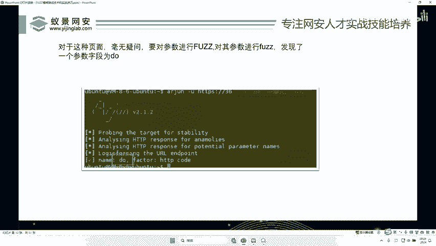

哎，我们以这里为例哈。😊，好，就是这个HTTP。😊，谁告啊3W。啊点非常叉点com，对不对？他先发现了一个什么up load杠IMIMAGE。点PP，然后不知道它的参数是几，对不对？

它通过fas技术知道了后面有一个度，对不对啊，知道了后面有一个度啊，知道后面有个度之后哎。

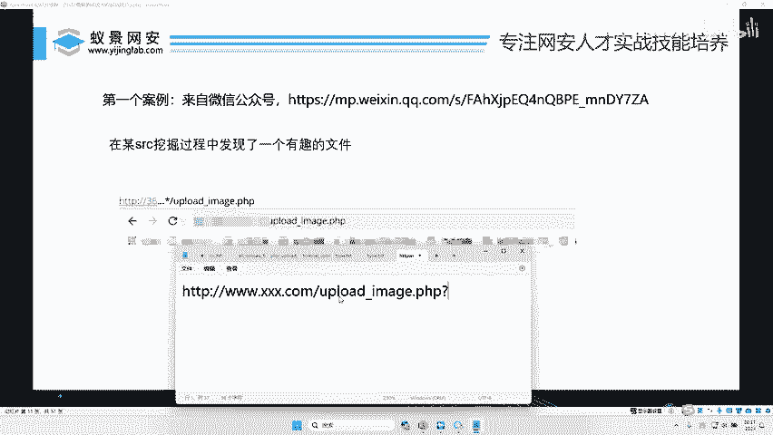

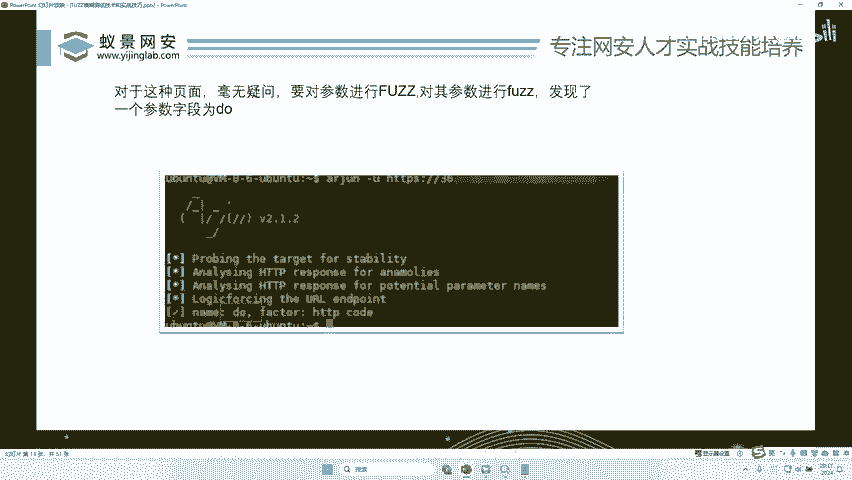

接下来就要对这个度的值进行fas了，对不对？哎，我们只知道这个度了，还不知道这个度后面跟个一是什么情况，跟个二是个什么情况，跟个三是什么情况，跟个四是什么情况，跟一个A是什么情况，跟个这个是什么情况。

他不知道对不对？然后呢，他通过它的字典哎，测了一遍，发现哎后面只要跟一个upload do等于upload，哎，然后干嘛呢？哎，然后你看它就会出现一个这样的页面啊，有人说ok那这样的范围也太大了吧。

没错，如果说你产生了这样的疑问哦。😊，那就证明你懂了，对不对？好，那么我来看一下，你看它最终是不是构造出来一个这样的地址了。你看do等于upload，然后出现了这样的页面，出现这样页面，哎。

熟悉漏洞小伙伴都知道啊，这里有一个选择文件地方，我们可以通过这个选择文件地方，把你的木马传到对方服务器。好嗨，然后呢你看可以控制对方电脑。😊。

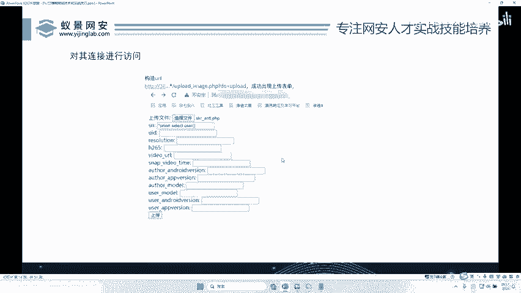

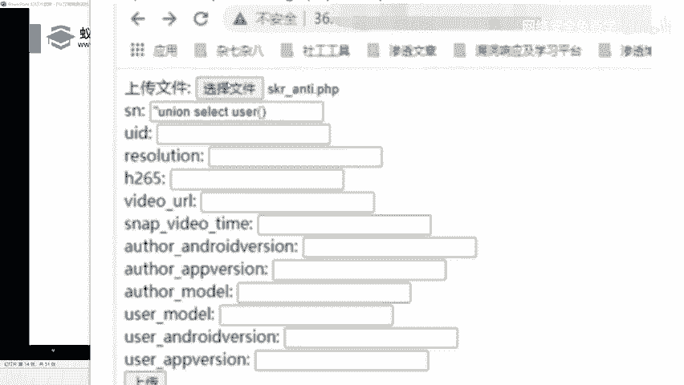

是不是哎，我们通过这个文件上传的地方，把木马传到了服务器。好，那么传到服务器之后呢，还遇到一个问题，那么这个。😊，这个木马。传到了服务器哪里呢？是传到他哪个文件夹下，他也不知道，对不对？

然后他紧接着又对他的木马所在地进行fg，他去猜他的木马在没在这个up load的目录下，在没在up load的 im下，在没在up load的 im下的这个。😊，呃，这个SKR是不是这个哎，理解没有？

哎，是他猜他他的木马是不是叫这个名字啊，他猜这个木马在没们在这个文件夹下啊，然后在我们在这个image下，哎，最终猜出来了对不对？他木马在这个uploadim啊，这个文件夹下啊。

然后成功访问到这个木马啊，然后干嘛呢？哎，然后控制了对方店脑，那么这样一个漏洞啊，那么作者啊当时也交代了，对吧？这个漏洞拿了多少钱啊，8000块钱，好吧，就这样一个漏洞8000块，那他是怎么挖到的。😊。

对不对？哎，就是fa子道的。那有人说啊李哥呀，我又不懂呢，我的小白呀，那这里到底什么意思，怎么就把木马上上传上去了啊，大家先不如果说你是纯小白啊，先不要去关注这个东西啊，这个如果说你学网安啊。

这个是非常简单的。因为这个漏洞是非常简单对吧？我们在这里非常难的是啥？就说你要把这个什么地址给他什么，你凭空捏出来，把这个地址给他什么想象出来，就跟什么一样，哎，就跟我们刚才猜与人名一样，对吧？啊。

那么中国姓氏百家姓那么多，对吧？你要把他的姓给他猜出来，这个是重点，对不对？如果你猜不出来，对吧？你这个账永远转不过去，对不对？那么转账就点一个确定，那么你猜不出来，你永远不可能点确定。

那么就跟这个情况一样，对吧？你猜不出来这个页面猜不出来这些值，你永远不可能啊把这个漏洞给他打进去啊，也不可能拿到这8000块钱啊，这是我们讲的第一个案例啊。😊，🤧好。OK小伙伴们啊，到现在为止啊。

你们可能还听了一点模糊，对不对？但是没有关系，一会儿给大家试验一次，你就懂了，对吧？到现在为止我先问大家一个问题，大家理解没有fa子到底是个什么东西啊，能不能get它的点啊，就是在很只要有功能，有参数。

有文字的地方，我都可以一个一个去测一个一个什么去便利，一个一个去枚举。😊，就是在任何地方都可以枚举，对吧？只要我们昨天讲的那个数据包，对吧？在这数据包的任何地方，我都可以用不同的地方去换或替换。

就跟爆破差不多。哎，它大体上就是这样一个思想，对吧？大家能不能听懂这种思想，先把这个思想听会了，听懂的小伙伴扣波一，我们接下来就给大家讲到底如何去实操。那么至于说刚才这个案例啊，听到似懂非懂。

什么是参数，什么是目录，我好像不太清楚，但是我就知道它是好像也是不是一个一个去测啊，就这样的一种感觉，好，有这种感觉就可以了。😊，哎，对了啊，有人说IP被搬怎么办？哎呀，搬不了的，你放心啊。

那么一点小工具怎么会搬呢啊？😊，好，那么有人说了okK哎，那么李哥呀，对不对啊，我现在也懂了，那么贩子要用到什么呢？那有人说了，哎，那李哥像你刚才给我讲的这个案例啊，他要测这个度后面是一是2。

难道我是从一开始测，然后再测二测3啊，然后再测A测B测C吗？测D吗？测FG吗？那那样的话好家伙，那26个字母加上10位嗯说阿拉伯数字，那得多少种可能呀？我都测到什么？我测到我人入关才了我对吧测不完。

对不对？可能说这不当然肯定不可能是这样一个一个去测的啊，我们专门会有一个什么字典。😊，对不对？那么这个字典是干嘛啊？这个字典就是针对于不同字典，我们会收集出来。比如说这后面这个是值。这值对不对？好。

我们这个字典就存着这些值，那这些值是那些高频高使用度啊，就是使用率大家比较高的那些值。那样的话，我们把它写成一个字典。我们来测的时候，只用去测字典里面的东西就可以了啊，不是说你从一开始测。

从二开始测测ABCABABCABCD这样测，那真测的猴年马爷，对不对？包括这个参数，对不对？我们也是有一个字典的的字典里面存放的，对不对？啊？市面上比如说7万个常用的参数，对不对啊？

那我们只要把这个字典导进去去测就行了，对不对？就跟你测什么测它叫什么尾一样，你刚开始测肯定会测它的普通型测它姓姓王姓李姓赵姓杨，对不对？你肯定不会什么测它姓扁扁大家知道。😊，扁你肯定不会测什么什么尾。

你肯定不可能说它是扁尾啊，对不对啊，这因为这个姓太偏了，对不对？我们大多数人想的是王啊、张啊、李啊、刘啊这些东西，因为它太普通，对吧？中国人使用范围太多了，对吧？我们就用用这些常见的去测啊。

很大几率就能出货啊。好，那么所以呢哎我们在玩的时候，必须要有一个什么这样的发子字典啊，如果说没有发子字典啊，那就白搭，对吧？那我怎么测，对不对？那么接下来我们先看一下今天给大家准备的这个发子字典啊。😊。

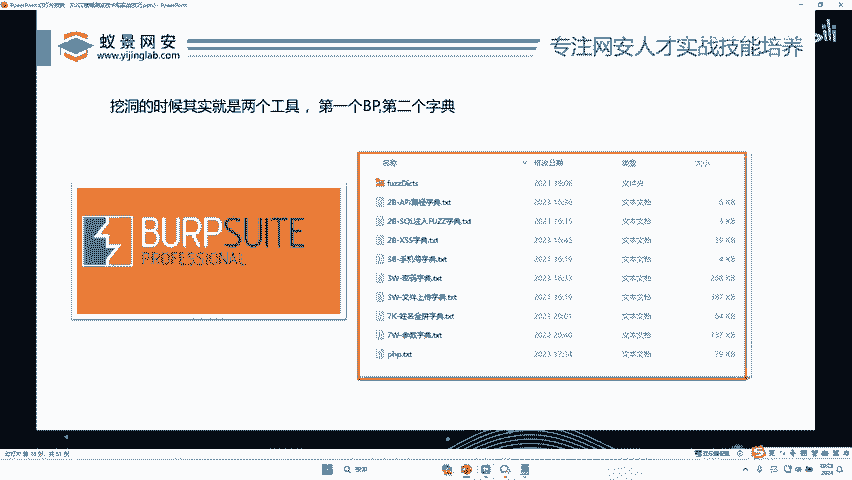

好，我们打开哎，李哥给大家提供的这个什么哎漏漏洞挖掘的这个。啊，工具包哎，工具包里面哎有李哥给大家准备的这些字典。好，那么这些字典呢我给大家进行一些分类，对不对？有密码字典。哎。

如果说我们要测密码进行爆破，ok这里面存了这么多密码啊，好歹哎，有多少个了，哎，成千上万哎几十万肯定是有的，对不对？大家可以去翻啊，那假如说我想测一些参数啊，比如说参数多少呢？哎。

这里给大家准备了很多参数，大家看看。😊。

你看有零参数，11112，对不对？有AAQ，对不对？还有一些什么AD list啊，A开头的对吧？啊，非常多哎，多少个呢？我往下翻往下翻往下翻，哎，差不多这个是多少个1百千万10万，哎，60万个。

对不对啊？60万个参数。😊，这么多唉，这够你错了吧，啊，这些都是一些常用的参数。你看PK circle，对不对啊啊，first by对吧？啊啊，这些东西非常多啊，你就一股脑把它导进去跑一遍就行了。

对不对？哎，跑一遍。啊说如果60万太多了，当然我们这些还有一些简单的，比如说这里还有7万的一个字典。😊，啊，那么这个东西有多少呢？哎，这个东西就比那个东西能少一些了，对不对？哎。

我们来看一下这个个个个1百千万10万，哎，这个怎么也70万？😊，啊，是啊不这两个一样的啊，这个差不多啊，这个是嗯跟也是60万的啊。那这里还有啊，那这个可能就比较少了啊。😊，来看一下。好。

那这个呢只有个个是。啊，我说错了，给大家看错了啊，这个是多少个？我们应该看它的行数啊，不是它的字符数啊。😊，好，这个是个十百千万，这个是2万个。哎，刚才那个给大家说错了，是7万个，对不对？

这个呢是2万个。那这个呢相比于刚才的就比较少少了多少了啊，少了一。😊，不少了对吧？啊，也就2万个那也很快的啊，一会会就跑完了啊，你不用担心啊。😊，好，我把这些啊这个页面全部它关掉啊。

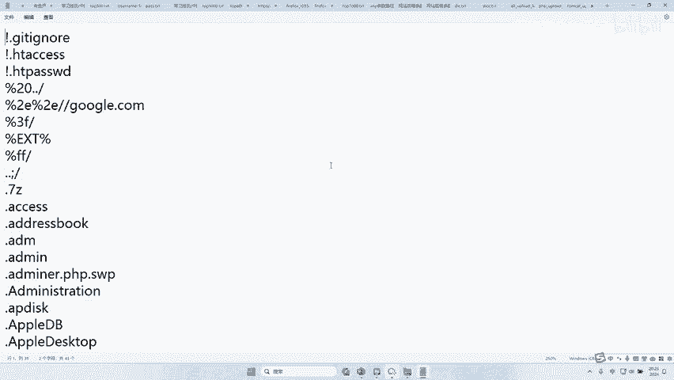

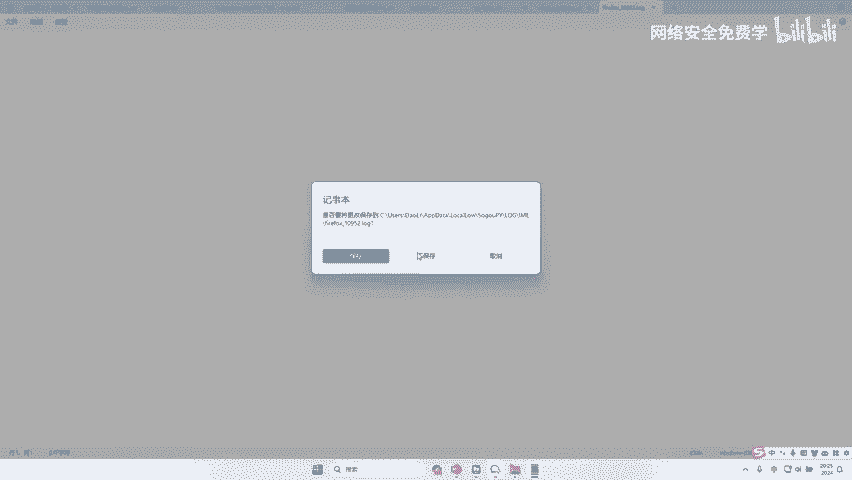

啊，这里的这个字典呢非常多啊，迪哥就不一一给大家去点开了，对吧？😊。

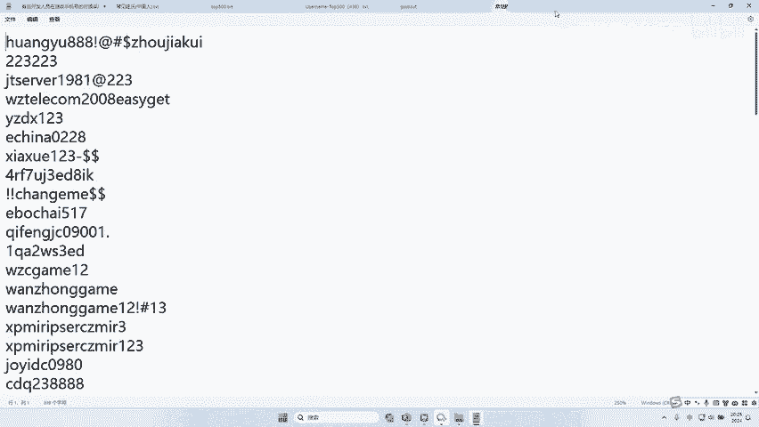

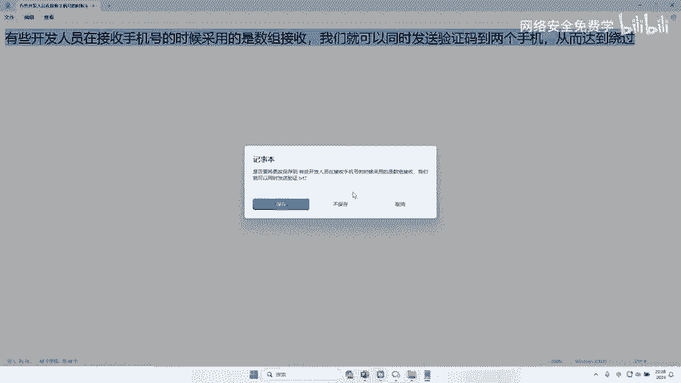

好，这是参数的。那么除了参数，我们还有手机号的对吧？假如设说我们在测这个呃验证码的时候，我们要用一些手机号，对不对？哎，我们直接把这个什么手机号字典对不对？给它家写进去，哎，你不用你一个一个的去想了。

对吧？这么多哎，不需要手肯定不需要手打，我们一键导入的啊，一会跑的时候一键导入对不对啊，一键导进去就可以了啊，用工具去跑啊，这个是手机号的，对不对？那么还有哪些字典呢？我们再往下翻，哎，文件上传的字典。

对不对？哎，我们比如说有这种文件上升的类型字典，哎，文件上传到什么哎这个后缀名的fa子字典，哎，都通通给大家准备好了，还有哪些呢？中间键重定向子域名，哎，还有子域名的字典，对吧？

我们假如说想要fa一些子域名的时候，还是3W百度还是DL点百度啊等等相关东西，在这里你看都是可以看出来的，对不对？好，非常多非常多啊RCE的字典Cco柱的挖洞的时候，Cq柱的字典，对不对？

SSRF的漏漏洞字典对吧？😊，还有什么用户名的字典啊，路径。哎，比如想测它这个网站都有哪些目录，对不对？哎，我们可以打开这些字典，对吧？非常多啊，非常多web logic的啊常用路径啊。

是不是都在里面啊。哎，大家只需要选择自己想用的字典就可以了啊。那就是说哎，那这个字典到底怎么用啊，这么多，我怎么筛选，那么一会儿就实战教大家怎么去用，怎么去进行筛选。😊。

好，那么好，兄弟们话不多讲，我们直接知道我们要准备的工具之后，我们就看我们今天的重点课程啊就是。😊。