# 2024B站最值得看的黑客教程 ｜ 网络安全／渗透测试／内网渗透／漏洞挖掘／web安全／kali linux／红队靶场／CTF／信息安全 - P3：什么是HTTP - 网络安全免费学 - BV1uBsTetEow

叫做HTTP这个同学说呃学习渗透要去学HTMLCSSPHP吗？呃是不用的哈，你可以学PHP但是CSS就算了，CSS是前端做的事情，它相当于是把一个简陋的房子给它装修好，那这个东西是前端做的哈。

我们渗透测试，你管这个网站好不好看，它好看了，它有漏洞，它也是个很拉的网站，那你一个很丑陋的网站，但它安全做防御做的非常好，那它也是没有漏洞的，知道吧？GNS可以学啊。GS可以学。

但是编程语言并不是非常重要的，很多的啊我认识的很多的这个做安全服务的，它可能连一个python都不会敲，可能连C语言printf都很难敲出来。但是它依然可以做安抚。但进入岗位之后来慢慢学就行。

那下面呢我们就来讲这个网站访问的实现。

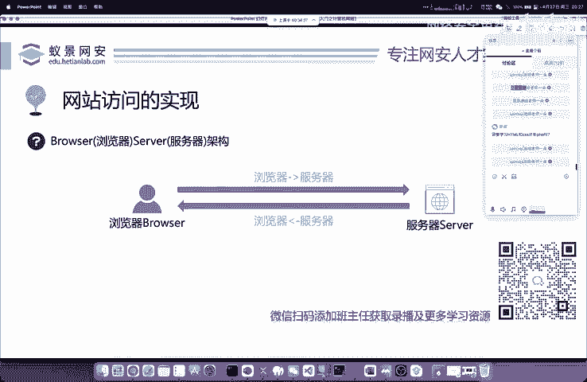

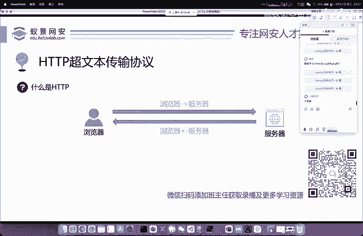

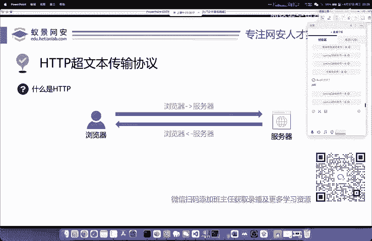

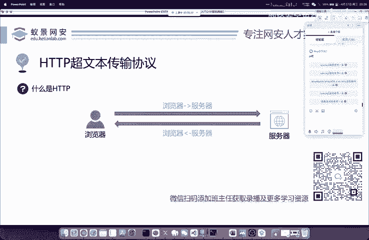

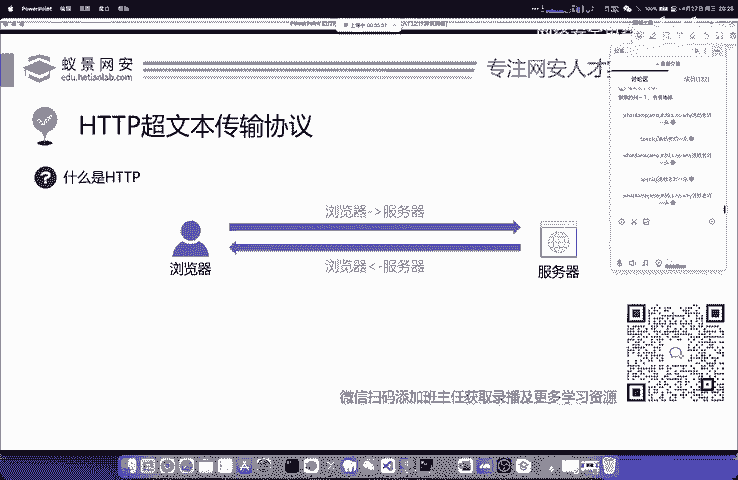

就是这个HTTP超文本承输协议。这个协议呢我们就是呃把它呃这个同学说开发学域办啊，当然有帮助，你会编程语言当然有帮助，这是你100%放心的那计算机它其实根本上还是这个编程语言啊。

还是这个操作系统就是你学习了肯定有帮助。不过你不学呢，也不会太有太大的问题啊。

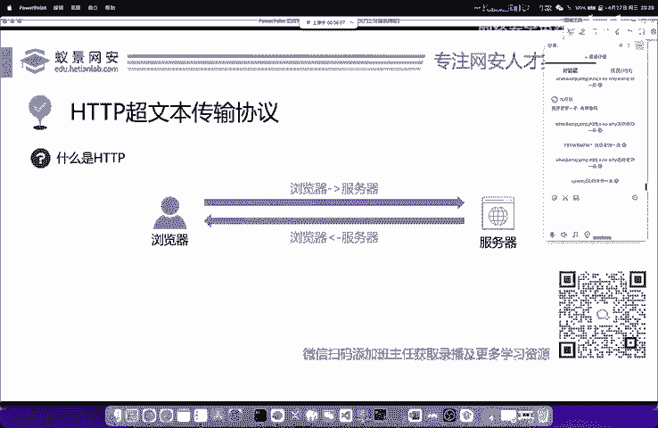

嗯，这个浏览器和服务器是怎么进行交互的。我们首先来了解这个协议。首先为什么有协议协议它是定义了浏览器和客户端的一个传输的标准格式。就像以一个这个中国人跟一个美国人去沟通，我们首先要确定一种语言。

比如说大家应用又用英语就都用英语。这样的话才能更好的沟通和交流。那我们的浏览器和服务器且其实也是这样的，它要规定好。那这个规定好的是HTTP啊，是国际公认的，我们就是去学习就行啊，就学习就行。

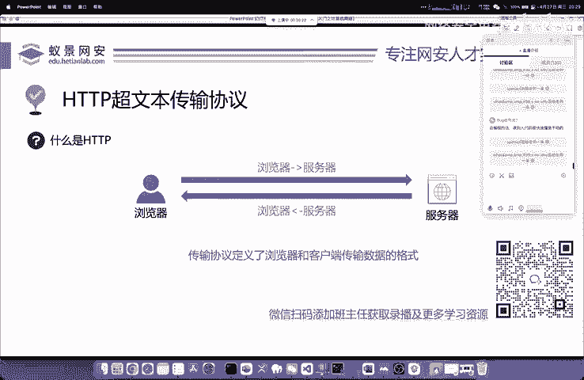

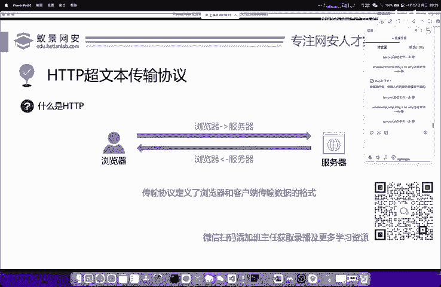

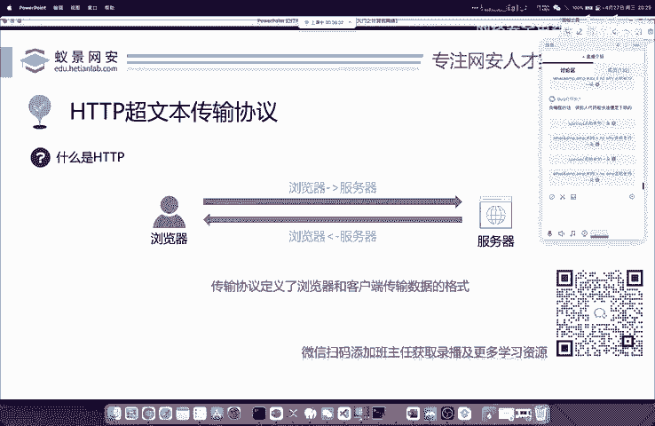

好，OK我们下面来看一下。首先呢我们浏览器去访问服务器。这个东西我们把它叫做请求英文意思叫request rQusT啊UET。然后呢，我们的服务器在处理我们的请求把相应的啊这个返回内容。

比如说你搜索百度百度一下搜索的结果去返回到我们的浏览器，这个东西叫做响应英文叫做response啊，英文叫做response。那下面呢我们来看一下它相应的特点。

首先呢HTTP它就是基于我们刚刚所讲的TCPIP体系结构的那第二点呢就是HTTP它默认的端口是80端口啊，是80端口。既然我说了默认，那就证明它可以改。但是你改不改都无所谓啊。

大家基本上见到的都是80端口。我们就记住它就行。那说到这里呢，有同学。

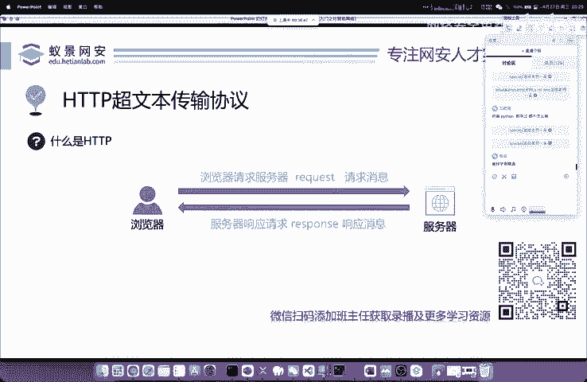

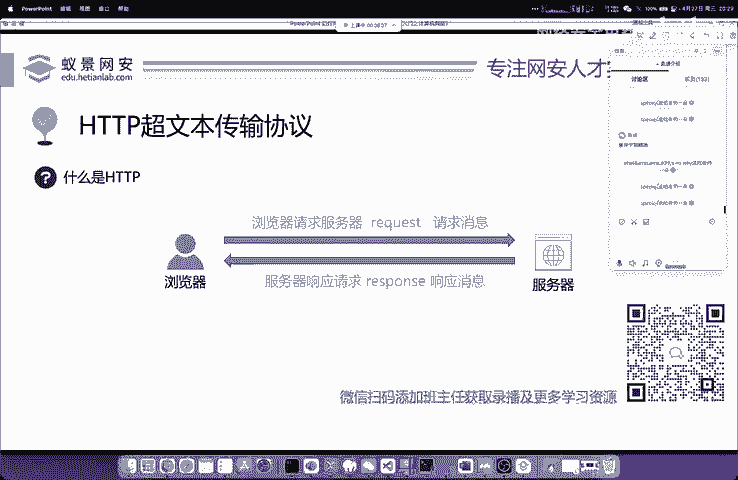

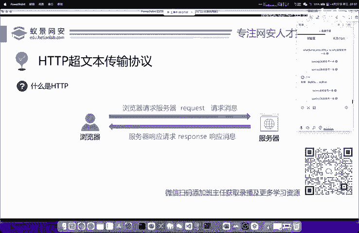

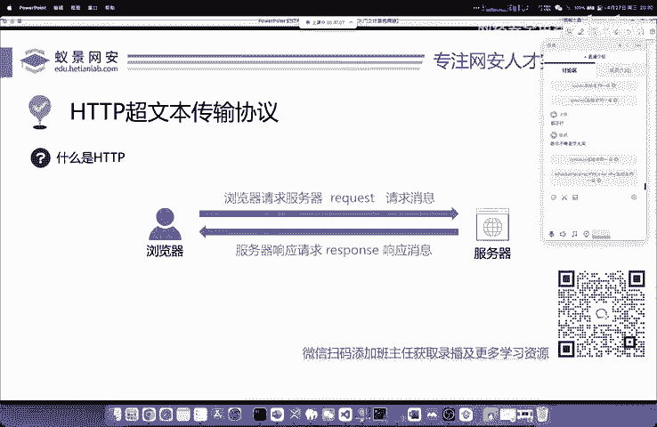

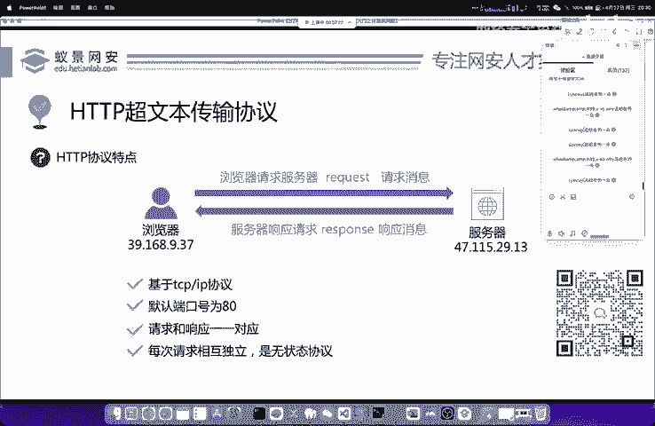

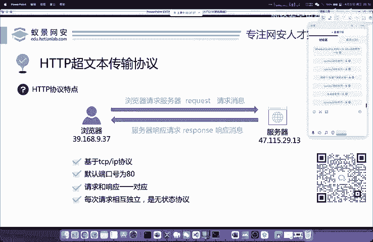

会发现现在在学习网站啊在访问网站，你看到的协议叫做HTTPS什么叫做HTTPS呢？你可以这样理解，它叫做HTTPS你可以理解成两个方向。第一个呢叫做security就是安全的安全的超文本传输协议。

就是大家用的HTTPS第二种呢你可以这样理解叫做HTTP这个S呢把它翻译成SSL就是指呢我们这个HTTPS是使用SSL加密证书的超文本传输协议。这样两个理解方法是完全相同的啊，是完全没有错的。

你想记哪一个都可以两个都解释更好啊。

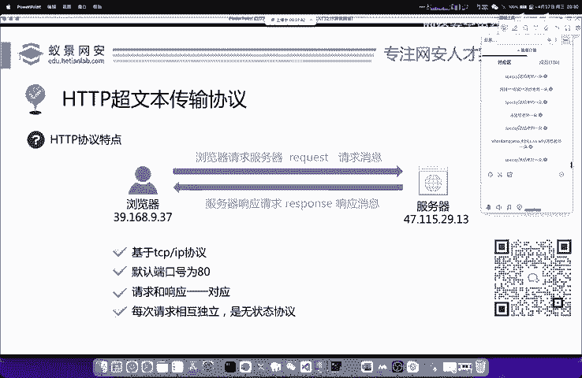

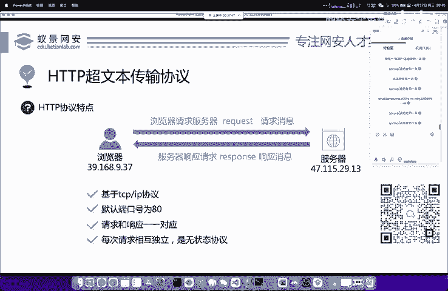

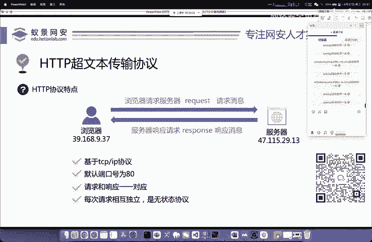

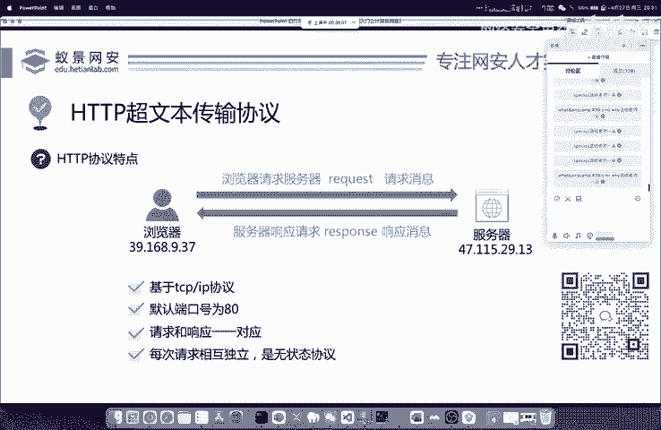

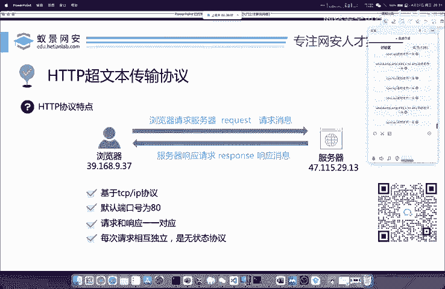

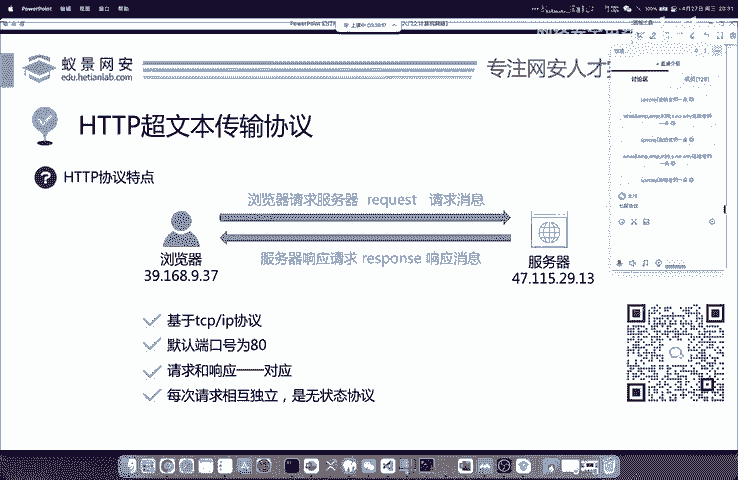

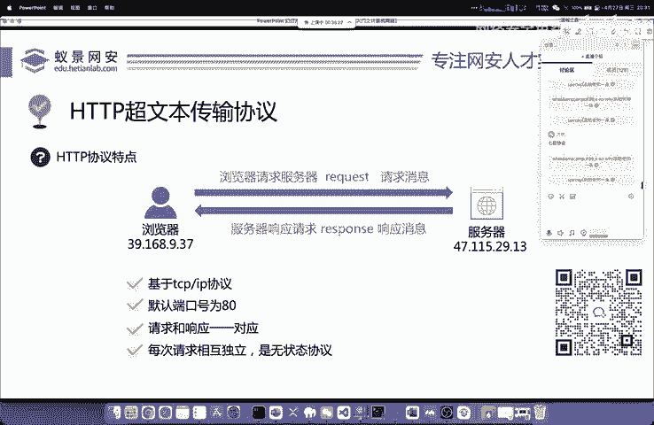

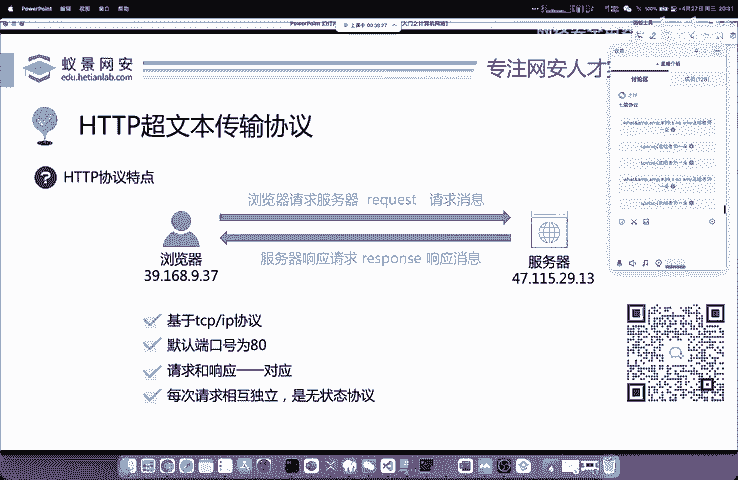