# 2024B站最值得看的黑客教程 ｜ 网络安全／渗透测试／内网渗透／漏洞挖掘／web安全／kali linux／红队靶场／CTF／信息安全 - P40：未知目录、信息泄露、备份文件等漏洞中的FUZZ - 网络安全免费学 - BV1uBsTetEow

那未知目录、信息备份、信息泄露等相关东西的8个技术。好，那么如果大家以后在挖洞的时候遇到如下情况，我们就可以使用我们的f技术。好，什么情况呢？就是说假如说我们在挖漏洞的过程中，哎，你遇到了一个网站。

这个网站是一个空白页面，什么叫空白页面，这个网站上白白的干干净净，啥都没有OK我们要用到fa子，或者说哎我们已经扫了一圈了，用工具扫了一圈了，没有扫出来一些功能啊，因为我们知道平时的网站它有功能的啊。

它可以点击啊干嘛的，注册呀，登录啊，对不对？假如说你用扫描器，哎，扫了也没有扫出来，我们可以用发啊，或者假如说哎我们都测这个网站测一两天了，对不对？我真的不知道怎么办了，对不对？

这个时候就需要用到f技术。那么接下来给大家现实的去看几个网站，哎，我们来看一下到底什么的网站要用到f啊，比如说第一个网站，我们来看一下好。😊，那么假如说给你一个网站来就长这样来。

请你个在这个网站上给我找一个漏洞。来，你找一下。怎么找？啊，你说这他妈的这点都没法点，怎么找啊，你又不像我们和天，对吧？啊，百度、京东对不对？有那么多功能。😡，啊，假如说给你一个正常网站啊，还好。

比如说。😊，哎，我们正常网站。啊，给你一个正常网站，对不对？长什么样子呢？哎，比如长这样，哎，你还知道哎哎点击注册，用一下李哥昨天教的哎哎手机号能不能搞，对不对？那么现在这个网站大家看一下。

就一个啥都没有，你点啊啊，你说看源码，那源码肯定里面啥都没有啊，这源码有啥呀，源码就这么好，你能有啥？😊，啥都没有，那你怎么挖洞？😡，哎，那这个时候我们是不是就要进行fa子了？对不对？

O那一会儿告诉大家怎么去预发子哈，我们再看几个视例网站啊。比如说呢我们遇到了这样的网站啊，这个一样也是这样一个网站啊，对吧？这里没有什么没有这里没有ORG啊。😊，好。好，我们再来看一个。好。

那假如说你又遇到一个这样的网站。😊，你看这到网站UR server is not runninging啊，这道网站哎，怎么办呢？😡，怎么办呢？啊，你点了一下，你是好像也没啥反应啊，网站就是长这样啊。

或者说这样的网站。😡，啊，这样的网站。啊，你去给我找漏洞怎么找呢？是不是哎，我们无从下手啊，没法点呀，对不对？好，关于这种情况，我们都可以用到我们的什么fas技术，那怎么去发子，哎。

我们来看我们今天的第一步，对不对？先去做什么？哎，做我们的目录f好，什么叫做目录发子，哎，大家看一下好，那么刚才呢大家是不是访问的这个网站啊，比如说这个网站我们访问了它是一个空白页面。

或者说这个页面里面并没有更多有用的信息，那么这个时候我们都知道这个网站的结构是不是长这样，在网站上面对不对啊？一个网站上面对不对？它会有存在着很多文件夹啊，那我们就测它这个网站后面有没有date文件夹。

有没有GS文件夹，有没有s文件夹，对不对？去测这个网站都有哪些文件夹。😊，啊，比如说我们以刚才的网站为例。😊，好，比如说这个网站。好，我现在访问，那我后面加一个什么？哎。

我在他后面加一个什么斜杠GS大家看一下。😊。

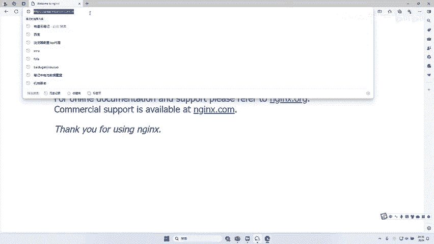

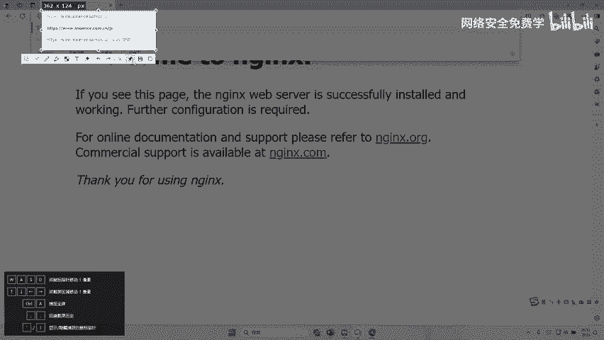

啊，那这个GS什么意思？是不是去看这个网站里面有没有GS这个文件夹。好，我回车一下。😊，好，它提示什么？404note found那就代表没有，是不是？好，那我。😡，哦，这个A麦死，哎。

你看它也是多少404是不是提示没有。那我是不是就可以发子这个东西了，不断去测了，看能不能找出来。好，那接下来我们来找一下好不好啊？好，怎么找呢？哎，我们打开我们的BP，对不对啊？😡，好，找到这个工具。

点开这个工具啊，这个f子的字典啊，李哥已经给大家提供了，对不对啊，已经提供了okK啊，兄弟们啊，没有问题啊。😊，好，我们就拿刚才那个网站简单做一个测试啊，后续的话哎啊。

来后续的话再给大家去用我们的靶手去做测试啊。好，我们找到这个目标，跟昨天的这个呃东西是一模一样的。打开呢我们内嵌浏览器，对不对？啊，找到你要测试的这个网站OK然后把网站地址写到这里。然后呢。

同时呢打开什么打开我们BP的这样一个拦截功能，对不对？好，拦截功能。好，我们只要回车一瞬间回车一下啊，是不是拦截到了，你看我们现在是不是用的是A imagine好，我们右键对不对？把它发送到应出的。

跟昨天是一模一样，对不对？😊。

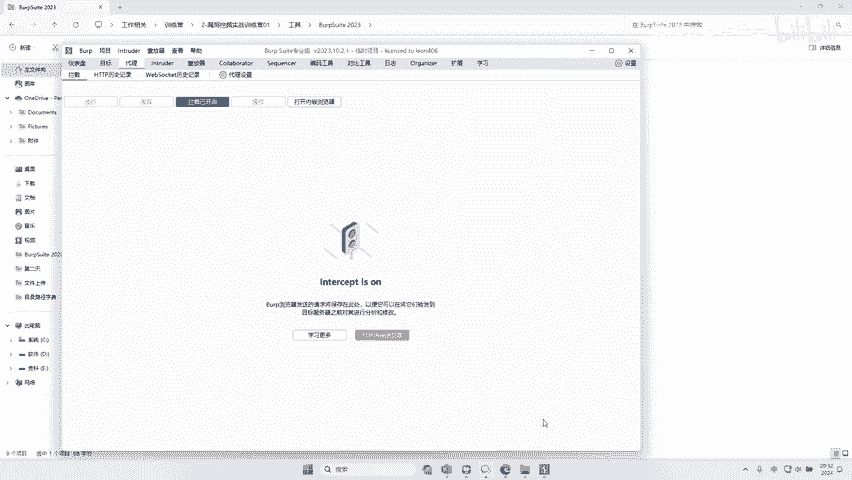

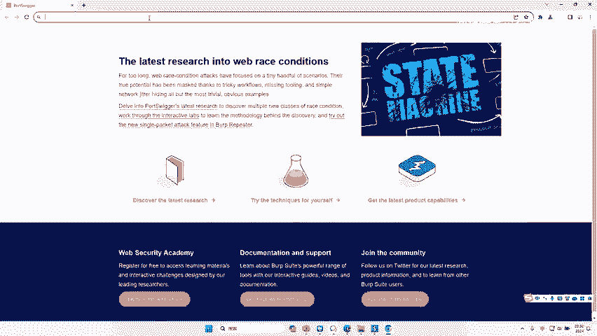

啊，昨天一模一样，我们先把这个清除配漏的，把这个am这个要干嘛呢？勾选上好。然后在这个配漏的选择的时候，我们要选择一什么选择一些目录，对不对啊？我们先选择一些像这个BP里面是自带一些发子的东西的。

比如说这里你看目录剪短长，我们选一些剪短的。你看这里面是有一些目录哎，我们就用它去试一下，看能不能发出来一些东西啊，一共300多个。😊，啊，372个。来，我们找一下，看能不能拿到一些有用的东西。好。

我们可以看到这个状态码啊啊，你看我发子一圈都是404，长度都是600多啊，那就证明这里面都没有找到，对吧？那没有找到，我们就干嘛呢？哎，再来一些长的对吧？啊，我们来再来测试一下啊。

这个时候是不是2000多个了。😊，哎，我们来你看这个时候我们再来测一下，对吧？😊，啊，实时去关注它的长度跟关注它的什么状态嘛。好，你看这个网站它就没有结果，全部是404，对不对？并且长度全部是多少？哎。

696啊，那么不好意思，我们现在怎么办呢？是不是应该加大我们的字典啊，或者说测到了之后呢，你是不是应该哎去点击它啊，这个一定要视情况而定。那么当前我们这种情况是不是一个能没找到，对吧？

因为我们的字典太小了，只有几百个，对吧？它不够，所以我们要加字典。那么因为这是别人的网站，我们不能再过多去测试了，对吧？啊，害怕出现一些问题啊，我们还是用本地的这样一个实验啊，给大家去做一下，好吧。😊。

啊，我们还是用本地的实验啊。😊，啊，我打开我的训机，我训机里面啊已经准备好一个靶场啊，我们用我训机里面这个靶场给大家完成这个演示，好吧。😊。

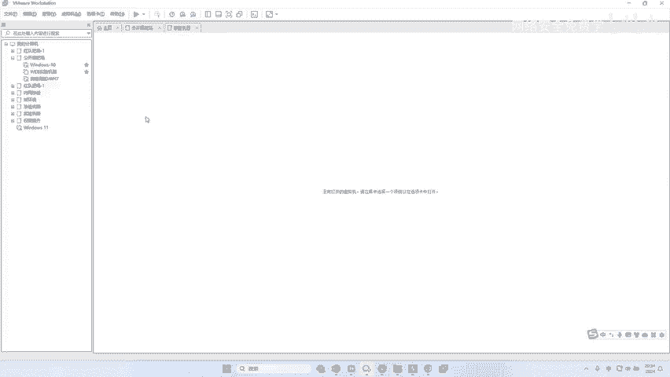

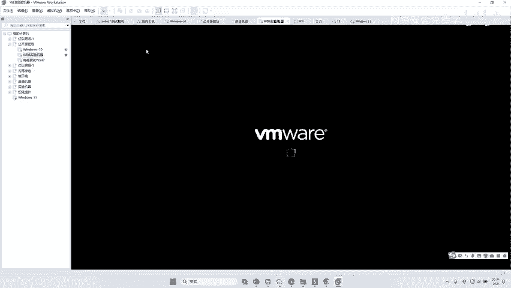

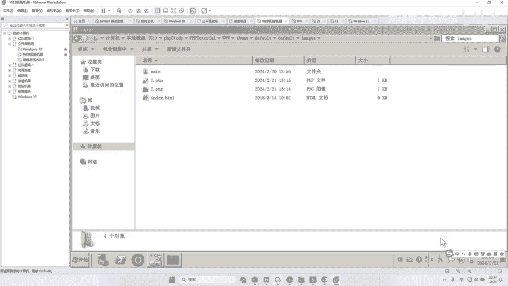

好的，那我们先访问虚拟机里面的这个网站啊，网站是多少呢？192。168。41。239啊回车啊，然后把我们的代理啊先给它关掉。哎，好，比如说这样一个网站好O这个网站我们已经访问到了，对吧？好。

现在呢我要对这个网站进行一些测试。然后我发现这个网站好好就是空白页面，点什么都没有用，对不对？你看都是一些空的啊，也没有一些登录啥的东西，对不对啊，都没有用。那么这个时候呢我们要去测这个网站先测什么。

它有哪些目录，哎，所以我们要针对这个目录进行f好，那我们怎么去测呢？哎，非常简单，对吧？先在这个后面写一个一啊，然后干嘛呢？哎，然后点击拦截，把这个包拦下来回车。你看好，跟刚才的操作是一样的。

发送到应出的模块。😊。

好，然后干嘛呢？把清除我们的payload的，哎，把这个一勾选上这个一是不是代表这个一这个文件夹，我们现在测的是文件夹，对不对？好，把它勾选上，然后选中我们的文件夹。哎，比如说目录的一些目录，哎。

剪的短的长的，我们可以多选一些，对不对啊？当然你也可以从什么李哥刚才对不对啊，给大家提供的这个里面。😊，啊，这里面去选对这里面去选也没有问题啊啊，当然我就不选了，好吧？ok我们测一下。😊。

你看2000多个，这里能不能跑出数据呢？来，我们来看一下，还是把这个什么状态吧，哎，跟这个东西去翻一下。好，兄弟们，我们往这里看，我们是不是测出来这个网站里面有这么几个东西啊，你看到没？是不是啊。

别人都是多少，都是404啊，但这个网站是多少，是不是301啊？😊。

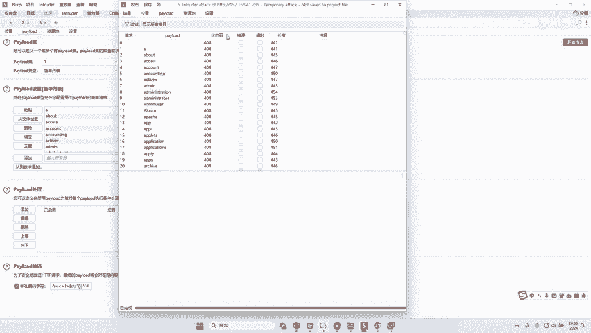

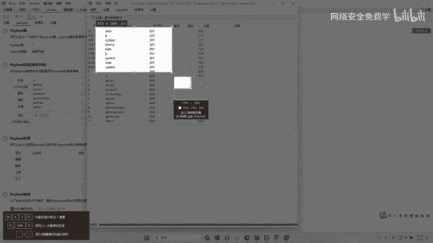

是不是你看。这个是301，这个是3001，这个301。那么在第一天的时候，我讲这个HTTP的时候，对吧？我们讲了这个状态码非常关键，对不对？二开头的是成功的，四开头的是失败的，三开头的也是成功的。

那么既然是三开头的，那么应该就是成功了。那么我们也得出来这个网站由。😊，什么目录呢？对不对？是不是有一个dateGS systemem THEME啊啊，这直接重复的，重复没有关系。对不对啊，来看一下哎。

date，那我们就可以访问一下这个date了，对吧？打开你的这个。😊，好。先把代理关了，对吧？好，我们去访问，比如访问一，它是不是提示not find没发现。好，那我们去访问date。😊。

你看它的页面是一个空白的，对不对啊？它的这个页面是个空白的，虽然是个空白的啊，也证明了这个date这个文件夹存在，只不过这个文件夹下，你还没有访问这个文件夹下面的哪一个文件，对不对？

就是说这个文件夹下还有很多文件啊，可能有什么图片呀，有什么音频呀，文本文件啊，你还没有写出来啊，就类似于啊你找别人小区已经找到了小区了，但是呢具体是哪一家，你还得继续往下找，对不对？

那这个时候我们是不是发现了有这样的一些目录啊，我们是不是又拿到了更多的资产呢？O那么这个呢就叫什么目录法子，对吧？来为什么要进行目录发子，其实刚才的时候也给大家讲这个网站结构，对吧？

我们说了在一个网站里面啊，它会有很多很多的这样一个什么文件夹啊，我们可以去测这个网站里面都有哪些文件夹，好，所以这个问题来了，对不对？那么这个date这个文件夹下，还有没有文件夹。😊。

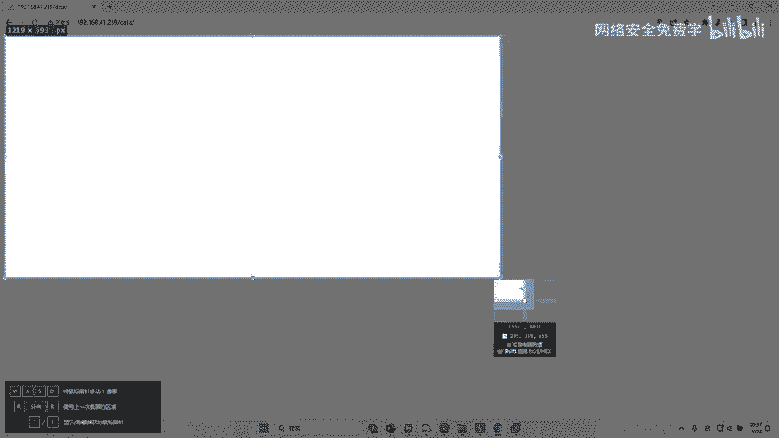

我不知道，那么我还需要对date这个文件夹下的文件夹再进行测试啊，那date下面的文件夹下面的文件夹还有没有文件夹，我也不知道，那么我还要进行测试。对不对？是不是这个叫什么？就是文件夹下面的文件夹。

下面的文件夹，下面的文件夹哎要一层一层去fauzz它的文件夹。好，那么这套思想叫什么？叫逐级fs啊。😊，好，给大打出来啊。逐级。哎，逐级发子就是一级一级的去猜一个文件夹，下面的文件夹一个一个去猜，啊。

运气好就能猜出来，对不对？那你就能找到一些更有用的资产了。O这是我们啊讲的第一个啊，知识点就是什么目录发子OK啊目录发子。那么目录发子发子完之后，哎，假如说我通过刚才这个。😊。

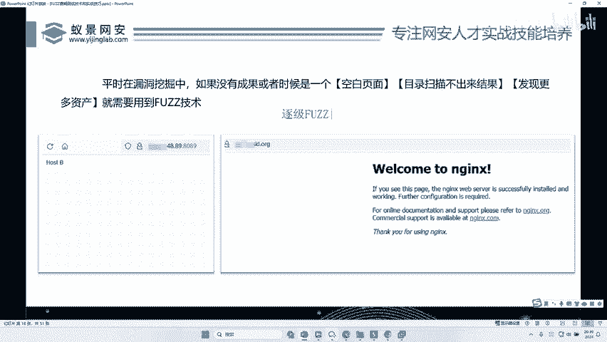

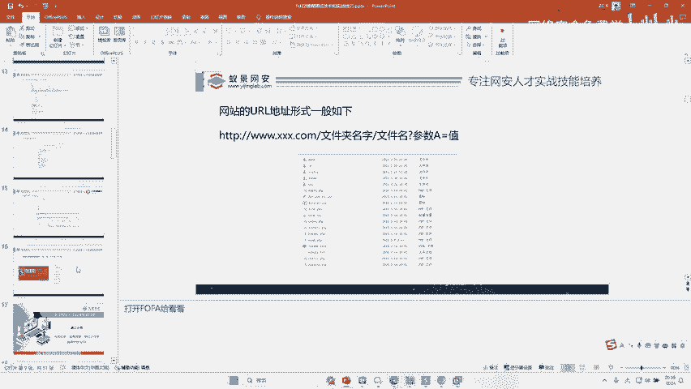

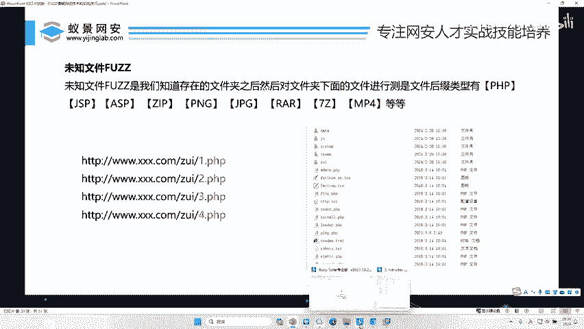

测试对不对？我已经知道了，对吧？在这个网站上对不对？它存在这么多文件夹，但是这个文件夹下面的对不对？有哪些文件，我不知道啊，比如说这个daate文件下有没有什么文件。😊。

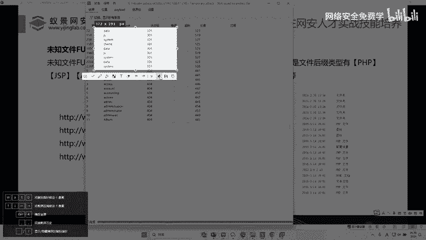

啊，什么什么是文件？啊，文件夹跟文件大家能分清楚吧。哎，我跟大家演示下什么叫文件夹，什么叫文件啊。😊，你看比如说这个b suit，它就是一个文件夹，对不对？那么这个文件夹下面哎，是不是有一些文件。

你看这些都是文件，这个BAT文件，对不对？我们的这个java这个文件，那么在这个文件夹，文件夹下面是不是还有两个文件夹，还有一个bo这个文件夹，这个bo这个文件夹里面是不是有这么多文件，12345。

除了这些文件还有这个log这个文件夹，对不对？哎，所以说对于一个文件夹来说，一个文件夹下面它有两种东西。第一种叫文件夹，第二个叫文件，对不对？那么刚才我们fa子是什么？只是这个文件夹啊。

只是测这个bsuit2023下哎，有哪些文件夹啊，那么这个文件夹下面还有哪些文件我们也需要进行测试，对不对啊，所以测试起来是有点复杂的啊，有点不是复杂啊，就是有点麻烦，对吧？就有点费时间啊。😊。

仅此而已啊，但是难度啊没有什么难度。好，比如说呢刚才哎我们已经知道了，对不对？哎啊，我们还是回到这里。😊，好。啊，回到这个网站，对不对？好，那么这个网站来这个网站下，我们刚才已经知道了有那么多文件夹。

那么在这个网站上到底还有哪些文件，我还是不知道的，对不对？所以接下来我们要对文件进行发啊。那么有人说了，那么文件有那么多种类型，对不对？

用PHP文件UGSP文件ASU文件ZIP文件PNG文件勾PG文件REI文件7Z文件MP4那么多文件类型，那么我应该怎么去发呢？😊，对不对？我应该怎么去发这么多文件呢？OK啊，我们一般来说啊。

对于一个网站来说，我们可能会去fauzz它的一个什么啊这种脚本文件。比如它是java的话，我们会发它的GSP文件。PHP的话会发它的PP文件啊，也可以fa一些数字，一些PNJ对不对啊？我们还是用字典啊。

😊，啊，还是以它为例，对不对？好？刚才我们fas是什么文件夹，那接下来我们fas文件对不对？好，fa子文件怎么？😊，我们先发的这个PHP对不对？因为这个网站它是PAPP的，对不对？嗨，我们这样一改。

就是什么点PHP这个什么我们不知道，对吧？哎，我们给它猜一遍，对不对？好，猜一遍好，后面加个PHP，对不对？刚才没有加PAPP，它就是文件夹，加了后缀名，它就是文件了，对吧？好，那么同理对吧？

来我们把它清空一下。好，我们把我们刚才的一些嗯。😊，这个我们就以刚才刚才的这个字典为例吧啊，我们在字典里面找一个这种参数，好吧。😊，啊，比如说这个7万个啊，这里有7万个，对吧？

我们把这7万个值给它加进加了进来。好，开始进行测试。😊，啊，一共7万多个，那他是什么意思呢？你看他就会测这个网站上有没有16点PHP啊，2点PHP对不对？22点PHP3点PHP对不对？

AAZZ点PHP对不对？ABY点PHP哎，会测ABZ点PHP1个一个去跑。那么大家只要去关注它的状态嘛。😊，对，我们把这个状态码啊导个序。😊，还是个哎来来，我们来看一下是不是找到了一些呀。😊。

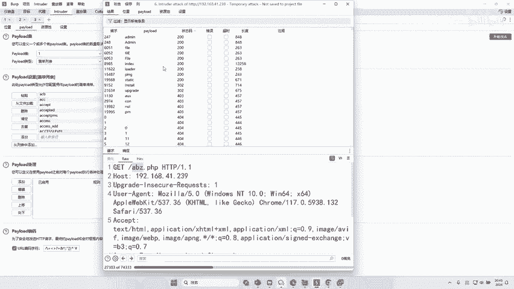

来，兄弟们往这里看看我是不是找到了它有一个文件叫做ad me点PHPfi点PHP indexex点PHPlo点PHP拼点PHPt点PHPupgrade点PPHP是不是全部找到了？😊。

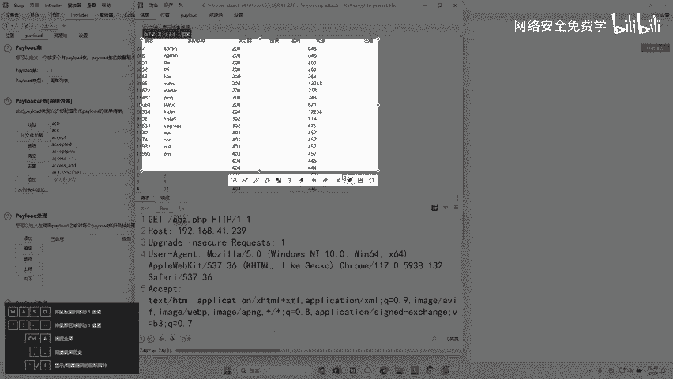

好，那么我们接下来干嘛？我们去访问啊，你想要访问哪个就访问哪个。我们先访问这个odmi。😊，好，是不是叫ad me点PHP回车。来看到没？是不是找到了他的网站后台地址啊？对不对？是不是找到了？哎。

那这个东西呢，如果你不发子，你不扫描，你能找出来吗？是不是啊，你纯靠手，你能把它找出来吗？啊，你很大几度是找不出来的，对不对？好，那么除了这个admin点PPO我们在这个文件里面是不是还找到它要什么？

一要fi点PP好，我们再去访问这个fi点PPP。😡，回车。啊，他提什么？the file doesn't not，对吧？这个文件不存在。O我们再往下翻，它还有什么，还有这个拼点PP对不对？啊。

我们返回这个拼。😊，啊，拼点PP访问哎，它提示eror就是错误。O我们再访问它还有哪些呢？好，还有这个loader对吧？加载LOADER对不对？好，我们访问一下啊。😊，LOADER啊。

回车这个lo一访问套，哎，它是一个空白页面啊，有人说哎李哥，你这样测试的话，会不会被抓啊啊，没有事。如果你是这个什么，你是呃正常测试，一般没事啊，像我们这种跑的数据量是比较小的，对不对？😊，啊，哎。

有人说。

正常网站它三几几，对不对？三几几，你肯定去访问就行了，对不对？你不管只要他跟别人不一样，你都可以把这个你的路径放到这个里面去回车一下，你去看一下，比如说这里哎是302，像这个inst302，对不对？哎。

我也不知道它到底能不能访问。我只是知道它是三开头的。那么我就去访问一下。😡。

对不对？或者说哎这里面都是三体几开头的，对不对？那我们可以干嘛呢？哎，我们去可以去看一下它的返回报大小嘛。😊，对不对？哎，比如这里是302来upgrade啊，那int我们去访问一下。😊，啊，你看。哎。

他提什么the quest什么什么不为什么，对吧？哎，这怎么还有一个这样的东西？😡，这个request is doesn't它不允许。对的，哎，提示这样一个东西。哎，我也不知道它是什么东西，对不对？好。

那这套技术叫什么？啊，我给大家说一下这个思想叫什么叫什么未知文件发。😊，理解了吗？理解没有？所以在fa的时候，我们可以去发什么？哎，发它的文件夹，可以去发它文件夹下有哪些文件。那么刚才测了它的PAP啊。

你可以可以还可以去测它的ZIPRAR等相关东西。理解的小伙伴理解了给李哥扣波1啊，就是这样去操作的啊。😊，刚才给大家演示的那个8000块钱漏洞，它就是这样找得到的啊，你不要觉得它多高深，不要觉得它多难。

我刚才给你讲解这个案例的时候，你自己看吧啊，你就说你长这个东西什么哎呀啊，没有用，我都没见过，不认可，对不对？啊，对吧？我都给你实打实看了这样一个，人家就是找到一个这样页面，对不对啊。

这个页面人家就发子出来一个度啊，度里面人家又发了一个东西，对吧？就是一个一个发子呢，有一模一样的啊，这个漏洞8001万块钱的。😡，对不对？你找你也是这样找，对不对？没有什么区别，对吧？这。😡。

有什么难的？你说这难吗？😡，你说这个难吗？啊，谁说这个难你就抽自己两巴掌，对吧？啊，你这个你觉得这个难啊，那就证明你小学一加一啊，这个理解能力有点问题啊，对不对啊？😡，好，那么这个fa子完之后，哎。

那用这套技术啊，我们一般可以干嘛呢？给大家讲讲啊，就是因为哎我们什么时候用这样的技术，我刚才也讲了，对吧？就针对一些特殊页面，比如这个页面是空白的啊，这个漏洞，我们已经哎什么扫描完了。

然后什么都没有结果，就实在挖不到漏洞了，对不对？我们可以用这样一套发子技术，对不对？去干嘛呢啊，去找找有没有一些未知的目录，未知的文件夹，我们还没有看到过的未知的备份文件，对不对？我告诉大家一个案例啊。

我说一个真实案例啊，之前这个漏洞我赚了3500，我告诉大家是一个什么样的案例，好吧，我给你自己写出来啊。😊，当然这个案例现在已经被修复了，对吧？我在这里只能简单给你讲解一下啊。

就是我在这个呃2020年吧，就是4年前吧啊，挖了一个中国移动的漏洞啊，中国移动啊。😊，当时呢这个中国移动有一个什么智慧平台，我具体平台我忘了，对不对啊，它的网址是这样的啊。😊，啊，嗯然后叫中国移动的。

呃，我看一下啊。还有没有啊，中国移动啊。啊，我们看看当时我挖这个3000块钱这个漏洞啊，叫。😊，啊，这什么叫京东了啊？啊，叫10086对不对啊？1086啊啊，它具体就是这样啊，这里不是10086啊。

这里是前面是一串反正乱七八糟的东西啊，这样然后这里有一个当时也是这样一个这个东西，对吧？啊，联通联通移动，我三大运营商是之前我挖了很多年了，对吧？OK那么这一个套东西，它当时有一个也就是fa子啊。

我发子出来它有一个叫做什么，叫一个叫做MAGE啊，还是d头，具体我忘了啊啊，这个具体文件夹，我忘了啊，然后我就后面就发出来，它有一个一，对不对？你知道写一个一。😊，啊，他会给你个什么嘛？

他会给你一个一个人的手持身份证。是中国移动他们在那些平台要实名认证的时候，需要人就那个年代，当时在4年前我们实名认证的时候，对不对？还不是现在的你们知道吗？你你们你们知道你们有没有人用过。

就是在4年前还是5年前吧，就是我们实名认证的时候，当时还是要手持身份证，对不对？拍照，记得不当淘宝也是那样认证的，现在我们的实名证是不是那个扫个脸对吧？左右转个头张个嘴，但是当时是不是身份证举到胸前啊。

那样去认证一下，对不对？是不是那样一个行为啊，我不知道大家有没有遇到过，可能你们年纪比较小，对不对啊，手持身份证那样一个东西啊，照片啊，那么当时就发现了啊，写个一，对不对？

那么这个移动的这个人的手持身份证哎就出现了。好，那么这里写个2第二让人手持身份证就写了。然后我就发了一遍啊，我发现啊，这里面大约有多少个10万个人的手持身份证，害怕不害怕1万个人身份证写的正反面都有啊。

然后他的名字啊，😊，谁加入哪里多大？咦，我他妈人傻了，对吧？这个漏洞啊，新泄露对吧？就这样挖的啊，找到了一个网站，发子的一个目录，再发的一个文件啊，直接给了3500。😡，简单不？啊，有人说这样太草率了。

哎，不是的啊，这就是因为因为他们的资产比较多，开发人员有的时候也搞混了，明白吗？😊，哎，高位了直接给了350，对不对啊？也就是这样一个漏洞，对不对？好。😊。

