# 2024B站最值得看的黑客教程 ｜ 网络安全／渗透测试／内网渗透／漏洞挖掘／web安全／kali linux／红队靶场／CTF／信息安全 - P41：账号密码，隐藏变量，未知参数中的FUZZ骚姿势 - 网络安全免费学 - BV1uBsTetEow

OK那接下来哎我们再来看一下一些发子的东西，对不对？好，那小伙伴我们说到这个东西了，我们再看一下这个发子还能用到哪些技术啊，就比如说一些账号密码，隐藏变量未知参数，这个是什么意思？好。

我们还是以刚才的案例给大家为例啊。比如说刚才的时候，我们是不是发现了一个这样的页面，叫做什么？叫做。😊。

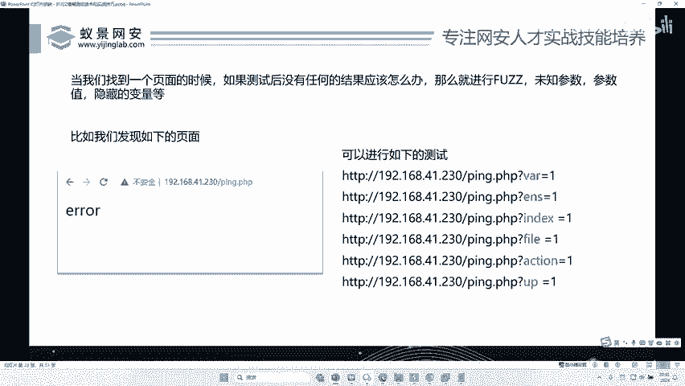

拼。点PHP。哎，是不是发现了一个这样的页面？好，那么发现了一个这样的页面。OK啊，你说李哥刚你在呢？我我是我没有在讲，我是内部走的内部通道啊，我们啊我们走的是内部通道啊啊，我没有在平台交啊啊。

不是说交给什么移动的SRC或者交给谁了啊，我们是内部的通道啊。😊。

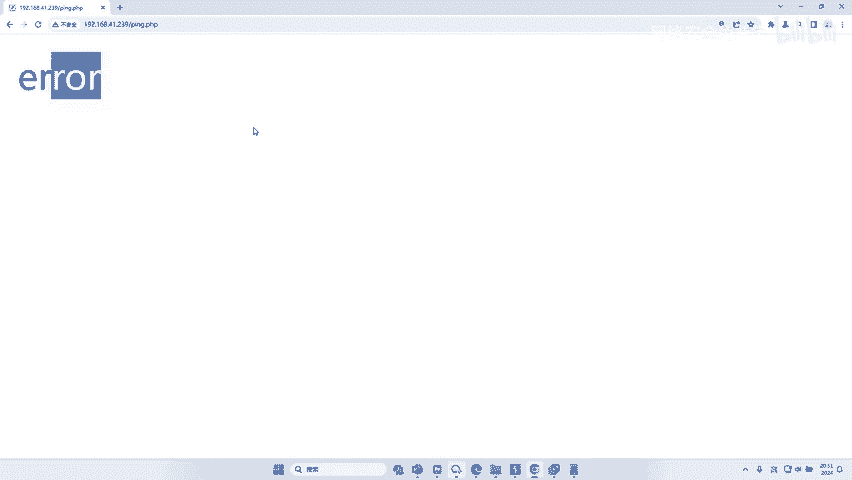

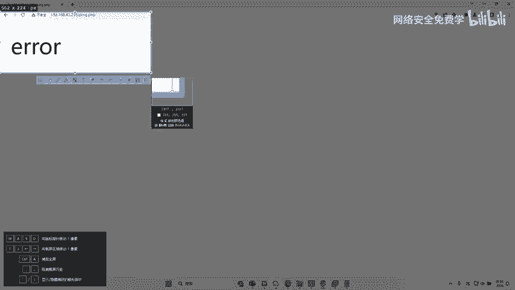

好，我们来看一下啊这个案例啊。好，我就问你这样一个网站，你应该如何去找劳洞呢？😊，来，我们注意观察观察它，对不对？它是不是叫拼点PPP。那么我刚才讲了，那拼音点PP后面有没有什么哎，有没有一些参数？😊。

啊，比如问号等于多少呢？啊，A等于一B等于1，C等于一，它都有没有呢，对吧？我也不知道啊，所以接下来我们可以去fas这个拼的参数。好，来，我们来fa这个拼的参数啊。哎，同样对不对？好，拦截。

我们先随便写一个对不对？A等于一。好。回车。好，那么这放案的时候，我们是不是先放的这个东西？好，我们右键intro。😊，哎，是把它勾选上了？哎，勾选上之后呢，同样哎我们选中它的配load的，对不对？

加载啊我们刚才的这个7段的参数，然后再去攻击一遍。😊，OK接下来我们再去看它的长度，或者看看它状态码。你看这个时候它所有状态码都是200，对不对？那么我们就去看它的长度啊，反正不是看长度，就是看状态码。

哎，我们把每个东西啊都看一遍，看它有什么不一样，对吧？那么我们排了一下序，啊，是发现了哎，当这个参数为度或者零的时候，是不是哎，它是255或者254，那么其他参数都是多少，244，对不对？啊。

那这个度为什么跟别人不一样呢？OK那么我们就干嘛呢？哎，我们就把这个度填进去啊，去看一下度到底有什么不一样的地方，😊。

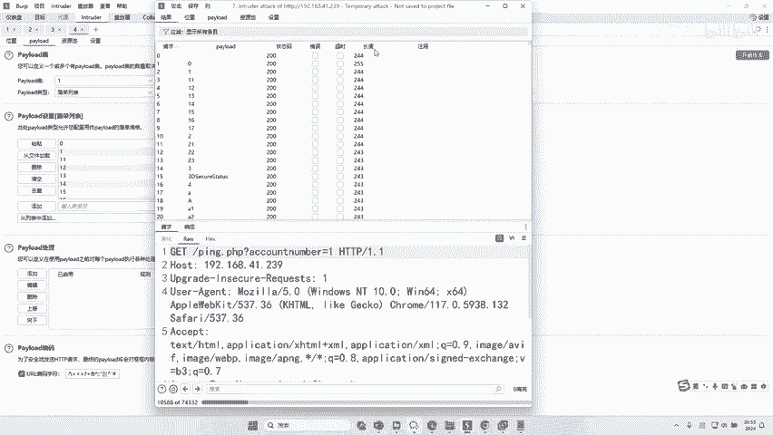

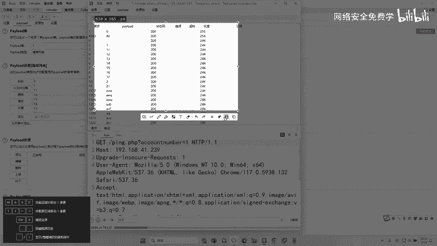

好，我们就把这个A是不是？😊，换成度度等于一。好，然后呢记得呢把你的BP的这个代理啊，先给它关掉。哎，我们发现如果说把这个度换成一，哎，它的提示就变了，它变成什么啊，非成参数错误。啊，参数错误啊。

或者说我们的值错误，对不对？为什么呢？啊？那因为这个就证明什么，证明这个度它是有用的，对不对？可能是度后面的这个值不对，那么我们还需要干嘛？对这个值再进行fa子。OK那么我们紧接着对这个值进行发。😊。

好，我们打开VP找到音出的模块，对不对？好，找到我们的位置。好，然后把干嘛呢？哎，把这个先清除一下。那么这里我们是不是刚找出来它是度，哎，这里这个一哎我是不知道的对吧？我添加配load的。

我再进行发一波。好，还是刚才的字典，对吧？我们开始攻击看一下这个度后面的这个值到底是多少啊，我们还同样对不对？对它进行排序，然后呢去等待它出结果就可以了，对吧？7万个，对吧？看能不能找到结果。😊。

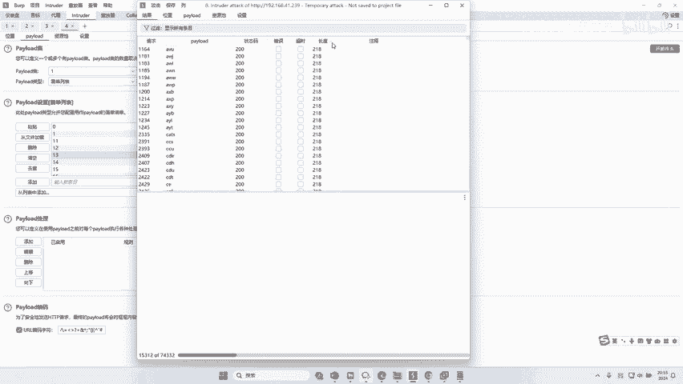

来是不是找到一个结果？😊，来看一下啊，所有的值对吧？都是255，但是如果这里变成了拼，哎，兄弟们看一下它的长度变成了1341。来，我们把这个拼加进去看一下。

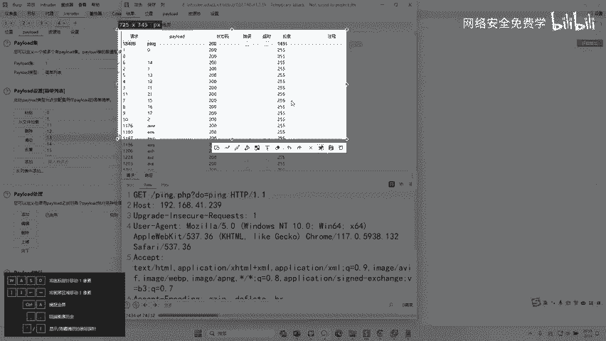

哎，哎，你看这个拼啊，是不是好像不太一样了拼。哦，发现了okK这里竟然可以拼对方的主机。那么我在这里拼个127。0。1啊。可以吗？来，发现了是不是可以返回数据。好，那我加个竖杠啊，再写一个呼耳麦。

看能不能远程执行对方电脑的命令。😊。

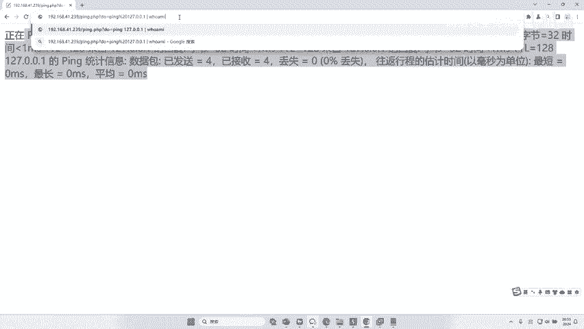

哎，大家看一下来。

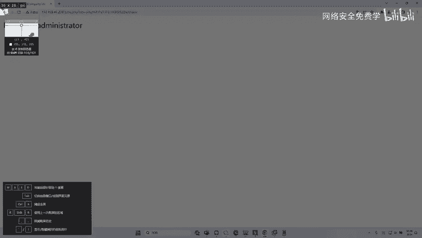

是不是直接ge了E了啊？如果说你在现实中挖洞啊，直接可以执行对方电脑命令啊，这个漏洞好说就几千块啊。那有人说这个漏洞存不存在，现实生活中有没有我可以负责任的告诉你啊。

去年我们就挖了一个一模一样这样的漏洞啊，就是这样的啊，连名字都没变啊，就是拼，后面有一个度，后面有一个拼，然后直接就RCE了啊，它是一个什么设备呢？啊，是一个网关设备啊，就是我们进他的后台。

后台有一个测试功能啊，然后我们发一下啊，确实是有很多人，有一些人找到了跟他一模一样的漏洞啊，就跟他的方法步骤一样的一样的，对不对啊，那有人说这能干嘛啊，我给大家说一下，这是干什么的啊，你可能不太懂。

对不对？这个就叫什么远程控制别人电脑，对吧？你看。😊，拼后面本来是拼一个什么拼一个地址的对吧？但是我们加一个竖杠啊，就也是并行执行，对吧？执行这个who am I这个命令啊，那这个叫做RRCE漏洞。

就远程执行对方电脑的命令。那你把这个呼耳麦可以变成什么命令变成关机，那你执行，那对方电脑就关机了啊，变成什么删除什么文件啊，比如说RM杠RFO那它整个服务器直接就删库了。😊，啊，服务器就删没了啊。

就就就完了，对不对？我们可以这个命令就可以随便换，对吧？这个呢就叫RCE漏洞。RCE叫做什么远程命令执行漏洞啊，远程命令执行，对吧？为什么叫远程，是不是就因为我们在黑客的电脑上通过浏览器去访问这个地址。

从而让对方的这个服务器，对吧？去关机啊，如果来个IP康呢？那当然of course没有问题啊啊，你就说你想来什么，我就给你来个什么来啥都行。😊，IP康飞哥，你自己看对方电脑的IP地址。41。239。来。

我们再去看一下对方电脑上有几个用户。adminator guest两个用户。啊，那么再配合一些其他命令，che了 down可不可以？当然可以。啊，我们去看这个对方电脑这个当前这个文件夹下有哪些文件夹来。

我们执行个DIR来看一下。😊，发现了没有？是不是它的一个文件almin的PA是不是还有这个点这个东西fa点PAPHTTP点INI。😊，对不对？还有这个啊，还有avloads文件夹。

there文件夹Z文件夹GS文件夹d文件夹是不是跟刚才我们发出来的是结果是一样的？😊，可以用它下载木马吗？可以啊可以用它去传，这不用下载木马啊，现在已经控制了，对吧？你在这里可以执行一些上传的操作。

下载的操作都是没有问题的啊，直播就是命令问题了啊，是不是跟叉S跟跟叉SS差的远了啊，这是RCE漏洞，好吧。😊，你如果说能挖到一个企业这脑漏洞啊啊不给你5000块都算低的了，好吗？😊，好。

听懂了小伙伴没有啊，比人说李哥这个漏洞我不知道漏洞不知道没关系，好不好？没关系不重要啊，漏洞不会我们去学这个发子这个技术懂了没？懂了扣一波一好不好？我们今天讲的这个叫什么叫逐级发子，好不好？啊。

不是竹级发子，叫。😡。

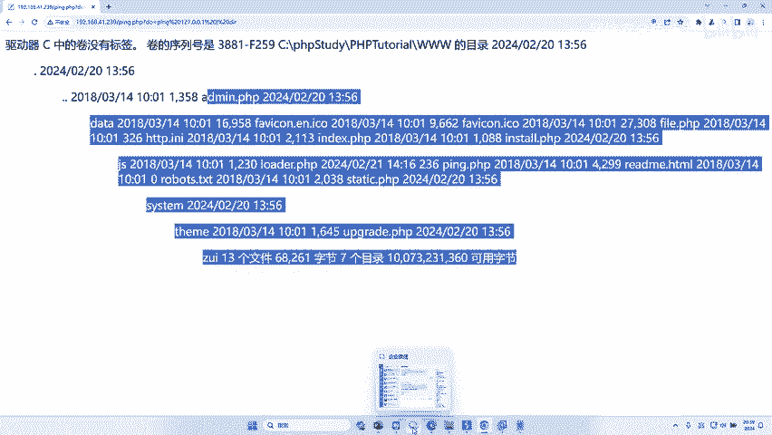

目录发了啊目录发。啊，对吧，我就不解释了。😊。

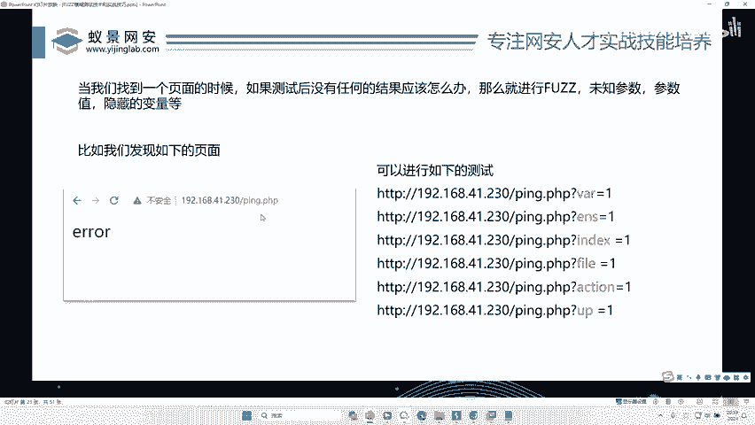