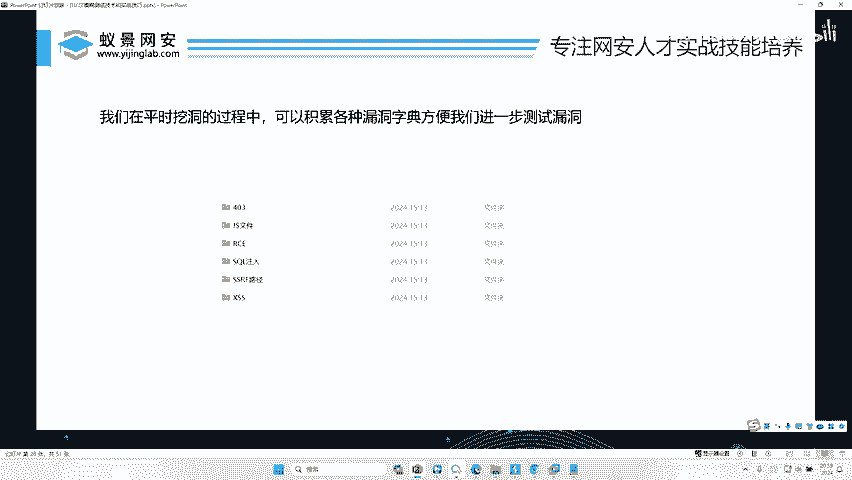
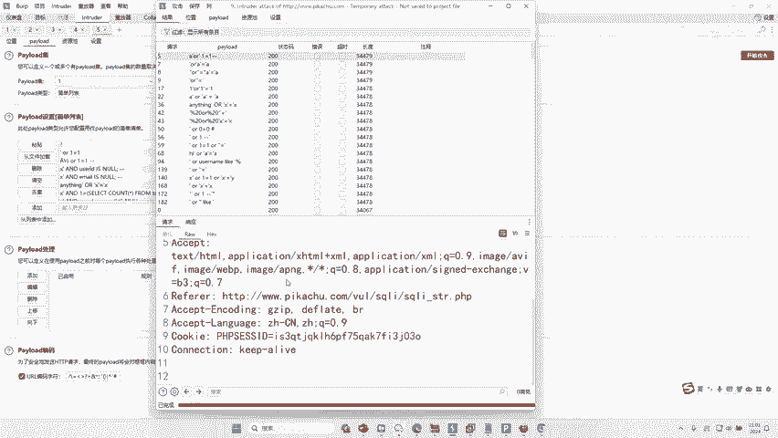
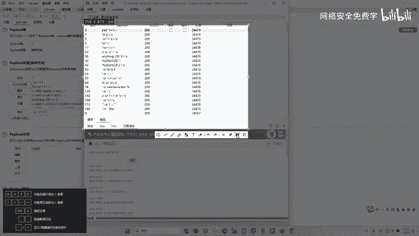
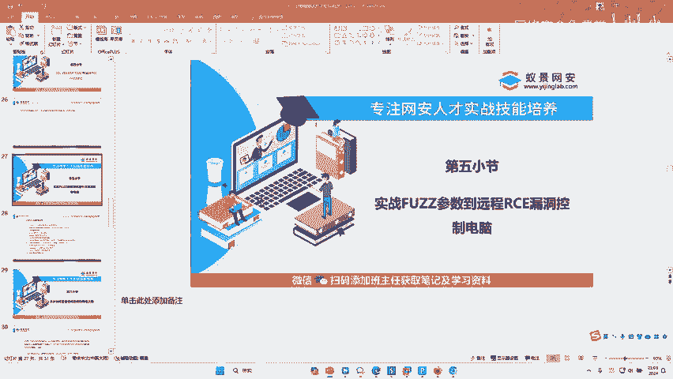

# 2024B站最值得看的黑客教程 ｜ 网络安全／渗透测试／内网渗透／漏洞挖掘／web安全／kali linux／红队靶场／CTF／信息安全 - P42：SQL，XSS,SSRF,CSRF等漏洞中的FUZZ技巧 - 网络安全免费学 - BV1uBsTetEow

怕。懂了是不是？好，懂了之后来，我们来看一个我们第四个内容，对不对？脑子跟上脑子跟上就可以了，好不好？好，我们来再看一下其他内容啊，就是我们fa子还能用到什么时候，除了什么啊？除了刚才这些参数啊。

各种参数，我们还可以怎么用，还可以用在一些CQ注入叉SS等漏洞，对不对？好，在这里也给大家演示一下怎么去啊，fa子叉SSC口注入。😊。

好，我们打开一个网站，对不对？打开这个网站给大家去做一个演示啊。😊，🤧嗯。啊，这节课其实是比较有含金量。我觉得今天这节课要比昨天那节课更有含金量啊，因为这些东西呢其实哎讲真的啊，这我就说这句话。

这不是你这是你不花钱能听得到的东西吗？啊，你看网上有人讲这些东西吗？啊，很少的，你去B站看有人讲嘛啊，不可能有人给你讲的啊啊，给你演示给你干嘛的啊，不可能我就说一下啊，不信你今天就去看去找一下啊。😊。

来，我们来再看一下啊，来，我们再找一下找一下啊。比如说呢对不对？哎，比如说我们在挖这个CQ注入的漏洞的时候，对吧？大家知道哎CQ注入有这么多，哎，那你要教你你在测你自己搞的话，你可能Cq map啊。

或者什么2一等于一，对吧？根据你学的技术在这里测好，那么我们掌握了fgO我们直接去发这个CQ注入就可以了啊，只要你去干嘛去掌握字典就可以了，对吧？你看这是一，对不对？我想知道这个地方有没有漏洞。好。

我右键。😊，intro的ok把这个一勾选上好，然后干嘛呢？添加配load的，我这个配load的只要换成什么，换成我们CQ注入的配load的，对不对？这里全是al一等于一这些东西。😊，对不对？好。

我直接开始攻击。来，我们长读一排序。来，大家看看。能不能找到漏洞？

找到了没？是不是找到漏洞了？😊。

看到没啊，如果这里变成这样。34479啊，所以这些这些几个东西，这几个东西对不对？都可以证明它存在漏洞。好，为什么存在漏洞呢？我们可以看到啊，我们输入这个值的时候，可以拿到它数据库里面的所有内容。😊。

啊，本来这个数据库只能拿一个内容，你输一个一只能拿一个一，对吧？现在我们是不是拿到了所有内容，拿到这个账号跟他的邮箱，这个账号跟他的邮箱，这个账号跟他的邮箱，这个账号跟他的邮箱是吧？

所有的数据全部拿下来了啊，那它存在漏洞啊你还需要去测吗？啊，是不是不需要了，对不对啊，直接跑一遍是不是就可以了。好，那我们再挖一些其他漏洞啊，叉SS漏洞，对不对？同样也可以进行发。😊。

那你就看你的这个什么什么的这个字典里面到底有没有叉SS，比如叉SS对不对？我们来看下叉SS配露的是不是非常多啊，你都可以挨个去里面去试。对吧哦这样李看李哥这里给大家准备这么多啊，每一个趋势对吧？

你只要多用几遍。😊，啊，这些字典啊，相信大家应该就会掌握这套技术了。啊，有人说李哥字典哪里有啊，我告诉大家，字典去百度网盘里面自行去下载就可以了。好不好？小伙伴们，网盘呢在哪里呢？

在我们课前预习里面都有了好。😊，那今天这儿给大家普及的是什么？是我们发子能用到的一些技巧跟技术跟一些点，对不对？那么最后啊再给大家干嘛做一个实验啊。

