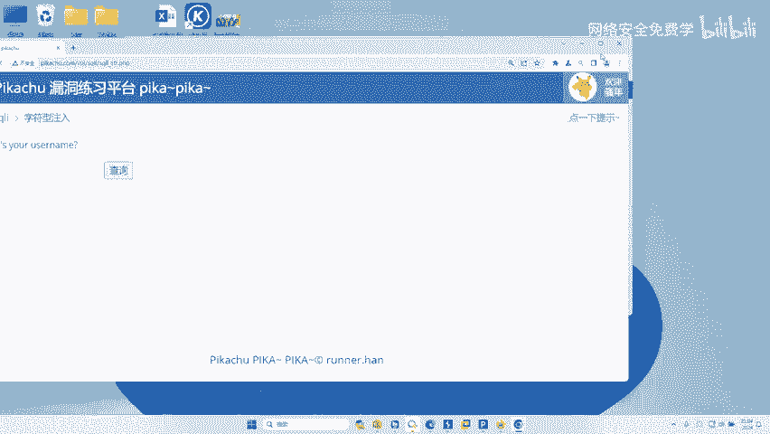
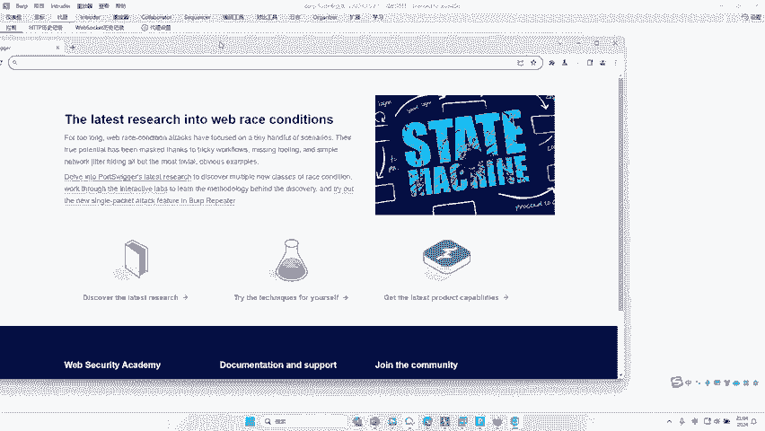
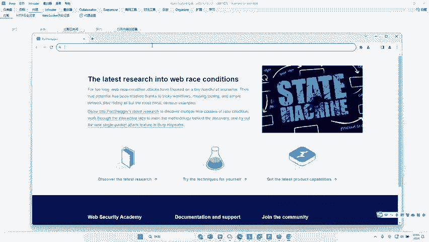
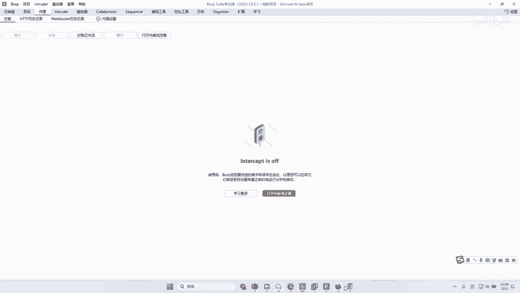
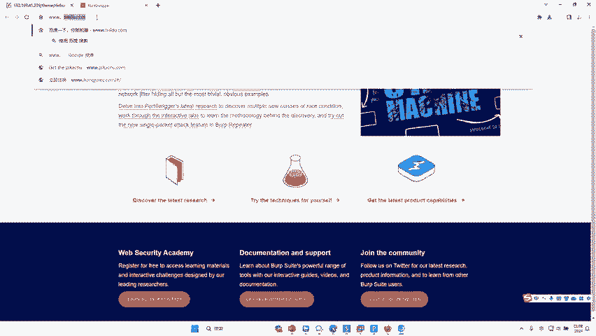
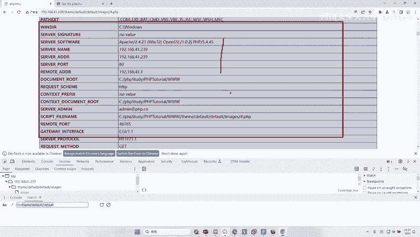
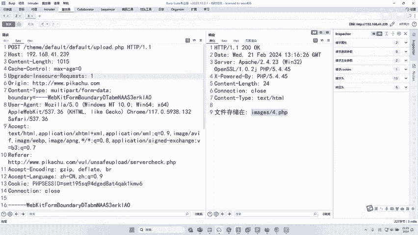

# 2024B站最值得看的黑客教程 ｜ 网络安全／渗透测试／内网渗透／漏洞挖掘／web安全／kali linux／红队靶场／CTF／信息安全 - P43：实战FUZZ参数到远程RCE漏洞控制电脑 - 网络安全免费学 - BV1uBsTetEow

我们远程RCE的实验啊，那么这个实验来自于哪里呢？给大家讲解一下啊，是来自于真实实战中的一个案例。那么因为那个案例呢已经被删了，我把它做成了靶场，在我本地复现了啊，所以大家就看一下。

我们当时通过这个漏洞拿到了130三0的赏金这样一个钱。我们看看这个漏洞，好哎，到底是如何被我们找得到了。接下来李哥就给你还原一下，当时找这个1300这个漏洞的一个实际过程，好不好。😊，好。

兄弟们来看好了这个漏洞是怎么找到到的啊。😊。

好。啊，那个叉SS我就不fag了啊，那也没有什么技术含量。我们来给大家最后再最后的再给大家实战一波，对不对？😊。

接下来演示的这个东西啊，都是真实的案例，好不好啊？好，我们是这样的啊。😊，我们在挖漏洞的时候，对不对？哎，我们当时在挖漏洞的时候，对不对？哎，挖了一个网站，那么这个网站干嘛呢？挖了大约有1一天多了。

一个漏洞都没有挖到啊。然后我就无意中打开了这个F12，对不对？在这里点了一下，我发现了什么？我发现了这个网站里面哎，有这样一个目录啊，叫这个叫这个目录。😊，啊，当然当时挖网站的时候，挖漏洞的时候。

这一块不叫它，对不对？我只是这个网站是叫他，对吧？那是跟他的实际情况一样的对吧？也是在这一块发现了有这样一个目录啊，我就把这个目录。😊，复制了一下。啊，然后去干嘛呢？然后放到了BP里面。

看我现在去访问这个目录了啊，我一回车啊，发现了这个目录是空白的，对不对？好，那么然后我就紧接着对这个目录下的一些文件进行了发了。okKO那我就还原一下当时的这个场景。😊，哎，我对这个一会进行发。好。

然后我添加配斗的，哎，我放了，当时我就实便把这个。😊，文件名写下好吧。好好，我们点击配load好吧，把这个内容给它添加下来。哎，文件名长哎，文件名。短okK我们来设计一下啊。好，然后干嘛呢？哎。

然后就发现了对不对？有一个叫做upload的这样一个文件夹，叫upload点PHP啊。然后呢我就去访问了一下。😊，好，我们去访问一下啊。好好，访问之后访问好之后好，这里提示一个大类似于这样一个操作。

这提什么the request model is不允许，对不对？就是这种请求方式不对。哎，什么意思？就这种请求方式不对。那么昨天我们讲过了请请求方式有什么有get，有post，对不对？好。

那么所以我只需要把它换一个请求方式就可以了，对不对？好，所以现在啊我们来换一个请求方式啊，先把这个数据包抓下来，对不对？好，我们右键发送到repeer里面。好，我们发送一下好。

是不是提示这种请求方式不对好，那怎么办呢？我们右键啊修改请求方式。😊，啊，那么现在是get，对不对？好，我们右键修改啊，把它换成post。好，然后再点击发送。好，它提示什么？提示by。哎。

提出by的就是坏了的意思。哎，这里bed，那么bed怎么办？我们知道post对不对？这个数据是在哪里传送呢？不是在URL里面，对不对？是在下面。😊，啊，那我们传个A等于一好，发送。它还是提示败的。

对不对？那么我再提示B等于2。发送哎，它还是提示budOK那这里呢我就想了一下，我说哎这个文件夹叫什么叫upload，对不对？那么upload是干嘛的，是不是上传文件的时候用到的？

所以我这里不是一个文件。所以如果说我能把它改成一个文件，我去upload一下，这里会不会就不提示bud了呢？啊，对此呢我就产生了这样疑问，对吧？好，那然后呢我就去找了一个上传文件的数据包。😊，啊啊。

那现在呢我们讲的这个就是一个真实案例啊。OK啊，你在其他地方肯定是听不到的OK。😊，好，那么李哥呢给大家把这个搞开啊。

好，先访问3W点。

皮。好，那么我刚才说了，我们需要一个上传文件的对吧？那我就随便找到一个上传文件的地方啊。好，然后我先去什么用这个BP去抓的包啊，找到这个上传文件的东西。哎，你看是不是找到了，对吧？这是我的靶场，对不对？

好，我的靶场里面大家看一下，哎，这个是一个什么东西，是不是一张图片哎，我们说了我们要po上去，对不对？我们刚才在这里啊传的是参数一等于2，那这样的话它还是提示掉，所以我必须把里面内容换成一个什么图片啊。

那图片长什么样子。接下来我们已经拦截到一个正常图片，对不对？好，这是这个什么上传图片的内容O所以一会儿呢我们就要把它给它替换过去，对不对？那么在替换的时候，这里有个问题了，你不能直接替换。

不然不不然不会不然就会识别不了，你看我们假如说把它复制一下，大家记住啊，你看这块这个文件现在是红色的，对不对？好，我们把它复制一下，啊，这也是一个小技巧，对吧？假如说我们把它这样直接替换。😊。

你看这里变不红，你发送它还是提示败的，因为它没有识别出来你是张图片，对不对？哎，所以我们还需要用一些手段啊去把它更正一下，好吧。好，我们现在发送。😊，都没响应了，对不对？好，回撤一下。😊，发送好拜的好。

那怎么去搞呢？哎，先把它右键发送到repeer里面去啊。好。😊，好，同学们怎么看啊？看好了啊。首先第一步啊，把你之前上一步的这个地址拿过来，哎，复制到这里面来啊，把这里全部给它改掉。😊，对不对啊。

里面的都不用改了，对不对啊，就把它地址跟那pos地址一改啊，这里是不是就变红了啊？当然你现在这样直接发啊，可能还不太行啊，为什么我们必须在这里啊点击一个加号啊。😊，好。

然后把刚才这些内容conttrol Acontl C全部复制到这个新的里面来。好，然后再去点击发送。啊，这里会弹出一个地址，对吧？我们把这个勾选上确认。😊，发送。哎，那这样的话就成功了。大家看一下。

你看这里的这个地址是不是改成了我们测试网站的地址了。好，那这里这个图片对不对？也成功给我们改好了，哎，它也变成红色的，对不对啊？你直接发送是不行的啊，没识别出来，对吧？好，那么这个时候大家看一下，哎。

这是它提示变了，对不对？upload。😊，fll by是不是多了一串这样的字儿？啊，那么这个upload的 file是来自于哪里呢？哎，是来自于图片里面的图片上传的这个参数啊。

这个参数现在是不是叫upload file。好，那我现在把它改成一发送，它提示一败的，我改成2。😊，它提示二倍的，对不对？好，那我就对里面这个内容进行一波fas好，我就右键in出的。好，把这里勾选上。

对不对？好，我们。😊，配套的选好啊，从文件加载。好，找到我们刚才的这些参数。好，点击开始攻击。然后等待看那个参数到底是什么东西。啊，那么接下来就会进入到一些啊等待时间。哎，我们等稍微等待一下啊。

我们去观察这个状态码就可以了啊。😊，啊，这跑的有点多啊，现在有点卡啊。😊，电脑开的东西太多了，对不对啊？你看我电脑开多了，对不对？对这个BP都是有影响的对吧？😊，啊，必须影响比较大啊，来。

我看能不能找到啊。啊，200啊都是200，对不对？好，我暂停一下啊，这个这个有点多啊。好，把它关了啊。😊，啊，我把它删除清除掉啊。清空啊，我重新添加一个小的啊，这个太大了啊。

我们添加一些哎在这里找一些简单的吧啊，比如说一些这个。😊，啊，表单字段啊好，这个可以，对吧？好，再添加一些。长哎，来我们来开始攻击一下啊。啊，这个只有6000个，对不对啊，只有6000个。😊，好。

我们把它等它搞完之后，对不对？我们去观察一下它。你看现在我们是不是你看。😊，哎，这里是什么什么bed，对不对啊，你发现都是b bad bad bad bad啊，你这状态嘛都是200。😡。

这个长度你看这个太多了，对不对？那里面到底哪个有败的，哪个没有败的啊，我们也不知道，对吧？😡，我现在就猜一下我们怎么猜啊，我们可以过滤一下啊，看看在这里面跑的里面哪几个是没有bedd的对吧？

所以我们可以在这里做一个过滤啊，比如bedd搜索不匹配应用。😊，哎，是不是找到一个fi name。对不对？我们看一下，如果说我们这里写成了fi name，哎，它提示是什么？

提示是image PNG is什么什么是这样一个层东西，对不对？好，我们回到我们的重放器里啊啊把它改成什么fi name。😊，好，我们点击发送。哎，他提什么这个图片。😡，这个东西不被允许。

这个就不允许的意思，对不对？那这个是什么东西呢？就是图片类型啊，就是这一块这个conent type不允许，对不对？好，所以这块到底是什么呢？我们再对它再进行fa子好，我们右键再发子。😊。

okK然后呢填入配load，那么这个配load呢就要哎我们找一个什么这个参count type的配load的。那这个配load在哪里呢？哎，也是在我们文件上传，这里有一个type，对不对？啊。

把双击进来啊，这里面从了大概有100多种counttain type啊，我们直接点击开始攻击。😊，啊，我们把这个长度替换一下，看能不能找到。啊，等一下这。这怎么反应这么慢呢啊，排序排半天。好，来。

我们来看看这个响应好不好？😊，啊，是不是哎这个东西哎哎你看哎我们一发现对吧？这里竟然有一个编码，对不对啊？为什么大家看一下，你看因为这个BP里边会对这个斜杠进行UL编码啊，我们应该是不要这个编码的。

对吧？这里不能出现这个编码，所以我们这里就出问题了，对吧？我们必须把这一块这个东西给它去掉啊，它这里默认是勾选上编码的对吧？我们把这个编码给它取消掉啊，再来攻击一次。😊，好，我们再对它的长度啊进行排序。

对不对？好，兄弟们，那往这里看，排序完之后，这里有1个206。那么206这个页面我们来看一下它的提示啊，是2点PNG已经存在啊，兄弟们是不是发现饱了呀？哎，我们发子出来了，对不对？

这块这个count type值长这样。好，那么我们来放到重放器里面，把它放进来。哎，发送。😊，2。PG已经存在了，对不对？好，那我就换个文件键的名字，我把它换成3点PG。啊，文件已经存储在这里了。

对不对？好，那我现在把它换成什么，换成1个PHP文件OK然后在里面写上什么，写上我们的木马。😊，OK我们再点击什么？😊，把这个三改成4，点击发送。哎，是不是提示文件存储在这里了？好。

现在只需要打开自己的什么网站，哎，把这个文件提到这里。回撤一下。好，把我们的代理。关掉。来，大家看看是不是拿到了PHB info，那是不是成功控制对方电脑了？听懂了吗？小伙伴。听懂了没有？啊。

如果说没有听懂的扣一波一，我教你一招好不好啊？可能对于很多初学者来说说，李哥，我没有听懂我不太懂什么意思，对吧？我好像是听懂了，好像感觉很牛逼啊啊，我给刷家说一下这个漏洞，对不对？我告诉大家好不好？

当时就给了1万多块钱啊，就是一模一样啊，我把它原源不动的给你返回出来了啊，原封不动的给你还原出来了。😡，对不对？大家听的蒙的原因是什么？我告诉大家啊，不是大家不是说哎你们对发子蒙了。

你们只是对这些哎漏洞蒙了，对不对？😡。

我非常理解大家啊，我在讲这节课的时候我都想好了，对吧？我因为因为我在群里也知道很多人他都是一些零基础的小白啊，什么文件上传这些漏洞头他他都不懂，对不对？他漏洞都不懂啊。

你说这个他都不懂道这里是什么意思所以他觉得有点懵啊，但是呢他大体上知道了，哎，就是fa子发子发子这么一个东西啊，李哥一直在发子发子发子。😊，啊，好像光知道这个，但是这里面这些东西什么意思。

我不懂什么意思不懂，这个没有关系，对不对？这个是因为大家不懂漏洞，哎，只要你懂了漏洞，稍微有一点漏洞基础，你再去看这个东西就非常简单了。😊，明白不啊，其实是非常简单。好。

大家觉得那么今天最后今天这节课我是想传达一个什么东西呢？是想传递给大家的时候啊。😊，在我们BP里面啊，那么今天这节课或许在今天对你没有帮助。那么在未来你学习网络安全道路上，一定会对你产生深远的影响的。

有些人说为什么？因为这是我的亲身经历，你们知道就这样的一套思想，这样一套方法，这样一套操作，你知道我用了多少年才知道的吗？从我入行网络安全，我就听过发。因为当小透明大家听过没有？哎。

你们可能不知道小透明这个人啊，我都不透露了，对吧？小透明啊，在前几年对吧？做黑产的啊，当时他来我们公司。😡，然后我那师傅说，你看人家啊，当时我是还比较菜啊，5分钟就能找一个CQ入入，对吧？

10分钟就能控制一个网站。啊，当时他号称什么？就没有我控制不了的网站啊，人家是那么吹的对吧？当然我当时我比较菜，我不知道真真的啊，然后我就问我的是，我说他是怎么找到一个网站漏洞的，说人家说哎。

那他是发子出来的，然后我就好奇发子是个什么东西啊，就一直困扰着我。😊，直到4年后。我才搞懂了，原来就是今天我讲的这一套东西。明白不？就是我搞懂它的使用，搞懂它的原理，搞懂它的这个概念，我用了4年。

但是大家就用了一年。你就比我少走一年路。我不是说这套技术有多么牛逼，这套技术牛逼吗？不牛逼有啥牛逼的对吧？你一听对不对？就是垃圾的一批谁都会嘛？不就是一个一个测嘛，对不对啊，那难的哪里难就难的，对吧？

别人给你讲解案例啊，为什么这里用，哪里可以用，哪个参数可以用，用哪个字典怎么用，这些是难的。😡，明白吗？那么今天我也给大家看了一些案例啊，我也告诉大家啊，对不对？

这些目录可以主机发子文件的名可以主机发子。在这里面这个可以发子，这个可以发子，这个可以发子，这个可以发子，什么都可以发子。包括我们昨天讲的那个什么短信轰炸，对不对？验证码回传，那些都能发子，对不对？

我们讲的手机号可以怎么改，怎么改。那你就把它整成一个字典嘛。下次遇到手机号，你直接扔进去一跑嘛，就完事了嘛？😊，啊啊，你自己弄了1个CQ注入，你做的多了，你弄一个字典嘛。比如说昨天讲的那个手机号，对吧？

可以加空格，加逗号啊，加双引号怎么的怎么一大堆，那你就把它整理成一个字典吧，下次再遇到手机号扔进去跑一遍完事儿了。😊，是不是哎，这就是都是fa子呀。😡，就难在这里，好吧。

所以这个东西呢大家一定要平时多去积累，好不好？所以今天对大家要求是什么啊？不是要求哎，你跟我必须一样把它复现出来啊，把怎么这么文件存储给他搞上去，不需要你只要有一个印象，O发子原来就是这么回事。

那么在你未来学网安的道路上11%万能帮助到你啊，你可能在未来的某一天就会想到了哦，我学到比如说在未来某一天，你学到一定程度了啊，你发现了哦，原来李哥当年讲法子是这么个意思呀。我豁然开朗了。

那个时候你就开窍了，明白吗？😊，那今天只是给你埋了一个伏笔，对不对啊？只是说大家没有听懂，没有关系，只把这个概念种到自己的脑子里啊，模糊测试就是这么个东西，对吧？这个在我们是个数据包。

用眼睛能观察到的任意一个地方啊，每一个数字啊，每一个地方都是可以用来爆破都是可以用来发子，对不对？只不过方式不同，参数不同，用的字典不同，漏洞不同，类型不同，仅此而已，只要你们会了漏洞。

那么再去发子就是手拿拔卡的事。😊，哎。对不对？明不明白，明白的给我。😡，明不明白哎，能懂我的两口用心吗？啊，能领白能你感你给李波，李哥扣波一好吗？😊，能明白的扣个一。😡，啊啊。

关于上上上面给大家讲这些啊，这些东西都是真实的啊，都是我的自己经验啊。所以呢我才想哎把今天这节课做成训练营，对不对啊？我说把这个发本来今天我没有打算给你们讲发子，我在设计这节课的时候。

我本来是讲那个想讲那个什么支付漏洞啊，就是什么0元购物啊这些东西对吧？那些东西其实没有太大技术含量啊，只是改个参数嘛，你了解一下就行了。但是发子这个东西啊，如果没有人给你讲，对不对？

你很难能get到的啊，一定要去给你讲的，明白吗？啊，给你讲的好了。😊。

