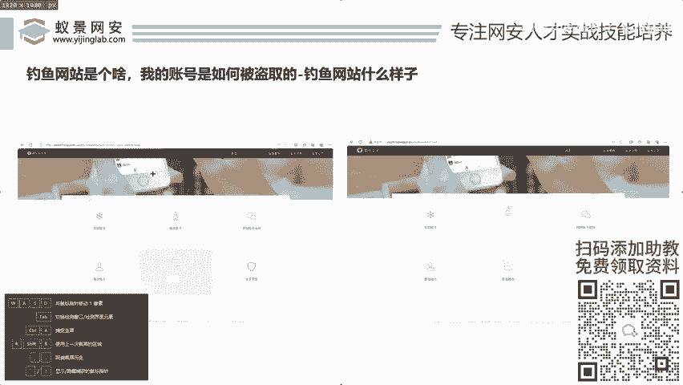
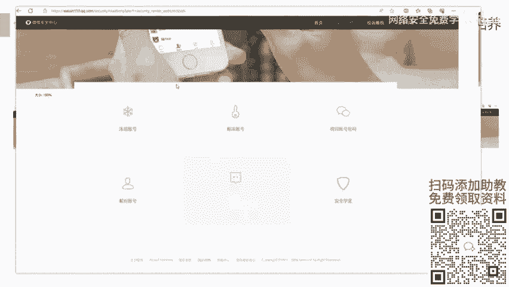
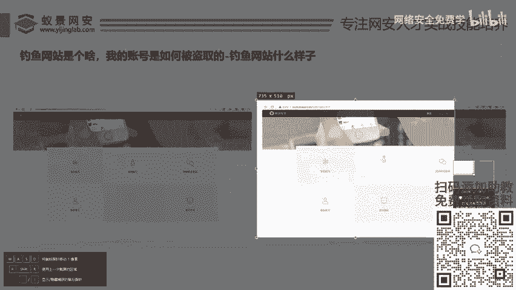
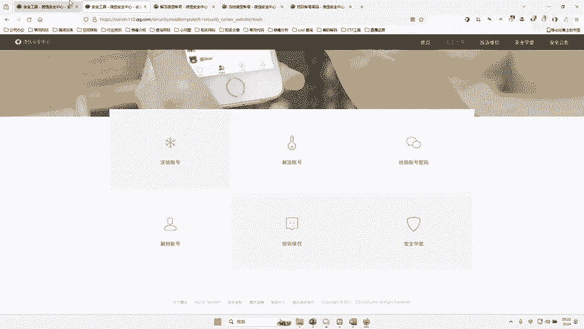
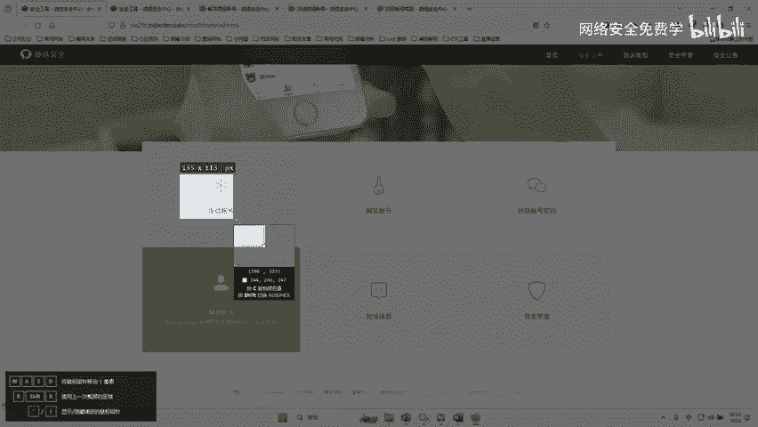
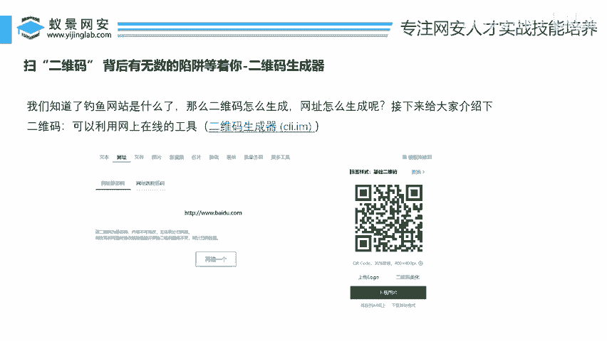

# 2024B站最值得看的黑客教程 ｜ 网络安全／渗透测试／内网渗透／漏洞挖掘／web安全／kali linux／红队靶场／CTF／信息安全 - P45：钓鱼网站是什么样子的？ - 网络安全免费学 - BV1uBsTetEow

好，我们接下来呢再看演人说了，哎，这些钓鱼的东西对不对？哎，扫码呀，这些领账号呀，又是什么发短信这些东西对不对？那他们点进去对不对？哎，到底之后长什么样子，哎，兄弟们，来，接下来有两张图片，好吗？

这两张图片，兄弟们，哎，请同学们兄弟们哎，给我品尝一下，这是第一张图片。哎，是微信的一个什么解封账面，这是第二张图片，也是微信的一个什么哎，解封账面，兄弟们，请你告诉我，哎，这哪个是真的，哪个是假的。

哎，这个是真的还是这个是真的，你们能辨别出来吗？我相信兄弟们，这一二两张图片你肯定都辨别不出来，对不对？没有一点上网基础的，对不对？哎，你肯定都有人说左这边是真。😊。

哎，有人说这边是真，哎，有些人这边是假，哎，对不对？哎，那么能说出这样的话来，兄弟们，哎我相信你哎还是有两把刷子呢，对不对？有人说都是假的，对不对？哎，这个可不是李哥给你瞎整的啊。

这个是微信这上个月我看到没？微信假冒腾讯公司假冒谁啊，就是这个页面，我把这个页面给你找到了，给你爬下来了，对不对？里面对不对啊？就是有一真亦假，是不是啊？有人说左上角有什么安全提示。

右上角没有什么安全值，这些都不是重点啊，好，一会儿告哎，这两张我给他告给大家记个密码啊，这边是真，这边是假，对不对？那这些到底是如何实现的，这些到底是如何盗号的，对不对啊，那么到底他们有什么用处。哎。

我们就带着大家对不对？去看一看这些东西啊，看看这些东西啊，好，那么除此之外，这个东西，哎，我们还有一个这个东西，哎，大家看一下，哎，这个东西哎，哪个是真哪个是假？😊，哎，这个哪一个是真的还是假？哎。

你比如说这个哪个是真，哪个是假，对不对？哎，这个是真，这个是哪个是假啊啊，一真二假，对不对？有人说一是真的二是假的，有人说二是真的，一是假的，有人说都是假的啊，对不对啊啊啊，右边那个我碰到过，对不对啊。

这个呢是QQ空间的什么啊，调网站，对吧？那如果说你没有基础的话，你可能真的分辨不出来，对不对啊？大家如果一真啊什么真啊，都是你的猜测，对不对啊，猜那么接下来哎我们就来给大家整一下，兄弟们行不兄弟们啊。

给你整一下这个东西啊，给你整一下这个东西啊。😊，好，那么整之前呢我们先看看这个东西对不对？啊，看看东西，看什么东西呢？来，我们来看一下这个东西，我们把这个网站啊真是这个网站给你打开，哎，让你去瞅一眼。

行弟？我们话不多说眼见为驰，对不对？来，你看这个网站啊，这个呢是啥？是最近啊是正儿八经的一个网址，对不对？我们来看这个网址啊，这个网址啊。😊，来看看这个网址对不对啊？看起来非常假，对不对？好？

这个网址是干嘛的？哎，就是最近啊上个月对不对？微信爆发的一起什么盗号的一个页面。哎，这个页面里我们可以干嘛呢？哎，账号冻结哎，账号比如说被冻结了，对不对？解冻账号，哎，我们在这里面要输入自己的相关东西。

对不对？哎，找回密码，哎，在这里可以去重置自己的微信密码，哎，这个什么网站，这个呢就是一个钓鱼网站啊，是正儿八经的一个钓鱼网站，对不对？好，那么我们去看一下真的微信的一个页面啊，我们来看下真的微信啊。

好，真的微信长什么样子呢？兄弟们，哎，往这里看啊。😊，来这个是真的微信，来，我们来看下真的微信，对不对？这个是真的微信。你看跟我们假的微信是不是长得几乎一模一样啊。如果说大家没有任何基础。

你看看这两个东西有什么区别吗？没有任何区别，我给你切换啊，甚至你啊，就什么不一样兄弟们啊就这个这个贼不是这个贼，这个有个问题？这个账号的账不一样，看对不？

这个这是假的我看真的啊这个账号的账你看到就一个是什么被子，一个是金字啊，这个人可能没做好做这个钓鱼的时候没做好啊，做成字不一样啊，对吧？你看其实他们就域名不一样，其他地方长的是真的一模一样。

你点哪里都可以用，对不对啊？这是一个儿马的钓鱼网站，对不？你网址都在这里对不？你千万不要去啊，你可千万不要去这个为啥没封就没封啊，李哥发现个早啊李哥用好好久跟踪了一下才把它发现了，对不？

让你自找你能把找到，你能把找到我的天哪，你能把它找到还能获取验证码呢，对不对啊？你能把它找到，你不到。😊。

对不对？哎。我我就找了一天，我才找得到了，好吧，那我这个网站李哥已经爬下来了，对不对？这个网李哥直接给你好吧啊，你给你，你在你的电脑脑上就可以直接运行，要不要？兄弟们要的话，给李哥扣个一，好不好？

要的话，要不要这个啊，要的话直接给你好吧，还有这个要不要哎说啊李哥啊，我要，让我瞅瞅还有这个网站要这两个东西要不要要的话直接给你啊，免费给你，让你去欣赏一下，让你去关门，哎，说要是吧？行啊。

没有问题好吧。那么关于这个东西啊，李哥已经完完全全所有东西已经给你们准备到了我们的课前笔记中，大家去这个笔记里面就可以自行去下载了，好吧？两套源码全部给到大家好吧，我把这个源码打开啊。

给大家去看一下好吧，那么一会儿教大家怎么去部署这个源码行吧？兄弟们来我们先看一下给到大家这个源码啊啊，们来看一下这个。😊，桌面里面我来看一下啊。好，找这个训练营啊，我们这个训练营第一天的这个工具里啊。

你看到没？两套这个源码啊，第一套是QQ空间调源码是这套，对不对？这套专门去打QQ空间呢，对不对？第一套好，还有我们的第二套源码啊。第二套源码是我们的什么QQ微信的身诉源码来，我们点开对不对？哎。

就是这个身份验证的源码。哎，两套源码全部给到你好不好？哎，你可以拿着它去做做实验，拿着它可以去骗一骗，对不对？你的小伙伴啊，当然我们不是骗我们是要提高我们小伙伴的这个安全意识，对不对？好，那有人说了。

这些源码到底怎么去用这些源码到底怎么去骗这些源码到底怎么去部署，好不好？哎，怎么去做成跟他们一模一样的东西，这其中又隐藏着哪些知识，需要我们网络安全人员去学习的呢？好，那么话不多说。

直接来看我们今天的第二个课题，对不对？第二个课题是什么啊，我们来看看对不对？扫。😊，描二维码背后到底隐藏着多少个陷阱，对不对？啊，我们来看今天的第二主题，对吧？扫二维码，这个二维码兄弟们肯定都用到过。

对不对啊？我们扫码干啥都用到过，对吧？好，那我们知道钓鱼网站，对不对？刚才讲那么多，其实就是给大家去讲这个钓鱼网站是什么样子，长的什么样子，对不对？好，那么这个问题来了，那么这个二维码是如何生成的呢？

哎，比如说呢我们是这个QQ微信申诉页面，对不对？我们把我们的钓鱼网站部署好了，怎么让网站变成一个二维码，对如果说我们没有域名，怎么去做这种哎，假如设说这个这个网站啊，对不对？你做成之后。

这个域名它是10086开头的，对不对啊，就哎呀怎么是短域名啊，这些都是怎么去整的，对不对？好，那接下来李哥来告诉你，对不对？😊。

