# 2024B站最值得看的黑客教程 ｜ 网络安全／渗透测试／内网渗透／漏洞挖掘／web安全／kali linux／红队靶场／CTF／信息安全 - P4：HTTP超文本传输协议—请求消息 - 网络安全免费学 - BV1uBsTetEow

好，那我们下面呢就来看一下这个请求到底是如何去发送的。就比如说你去访问百度，或者是你去打开和天晚安实验室，那这个请求在我们的网络环境中，在你的网线中到底是怎么进行传输的呢？就是这个request。

我们现在来看一下，简单的看一下这个请求消息的这个类型哈，就是这个原始的报文，原始的数据。那这个数据呢大家一看啊就一脸懵逼，就可能不太符合自己的一个学习习惯，那没有办法，别人已经规定好了。

我们只能去学习去逐一的分析它。其实呢它并不难，因为都是定死的，不会有任何的创造。我们下面呢来去简单看一下啊，有同学说这是封装啊。是的，这个T这个THDDP啊，它就是TCPIP的一个再次封装啊。

再次的封装。

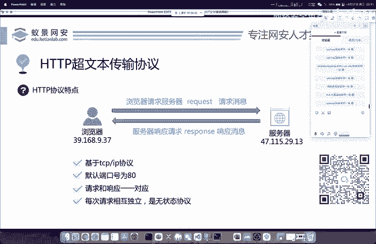

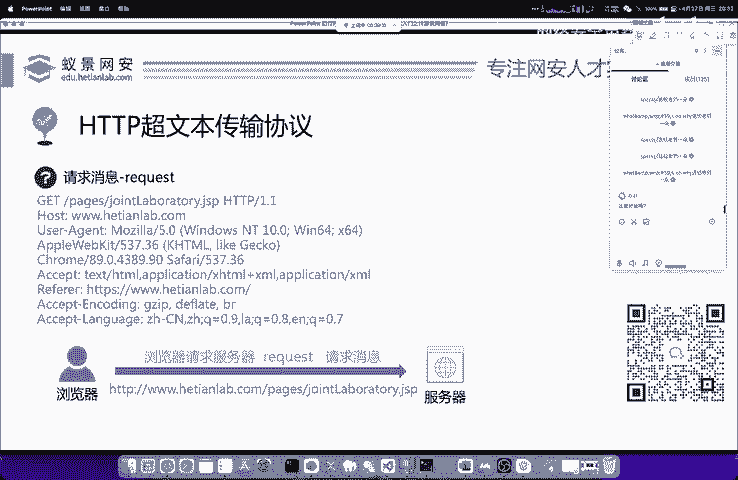

那我们下面呢来分别拆分一下。比如说这个页面啊，就是我们打开和天网安实验室去点击这个网安公开课。比如说网安公开课去访问这个JSP啊，一个java网站，它所发起的我们浏览器所向服务器发起的一个请求信息。

这个请求信息呢，我已经放在了我们的PPT上面，我们现在来分别去看一下啊，怎么了？怎么问号是啥意思？突然没声音了，稍等一下。

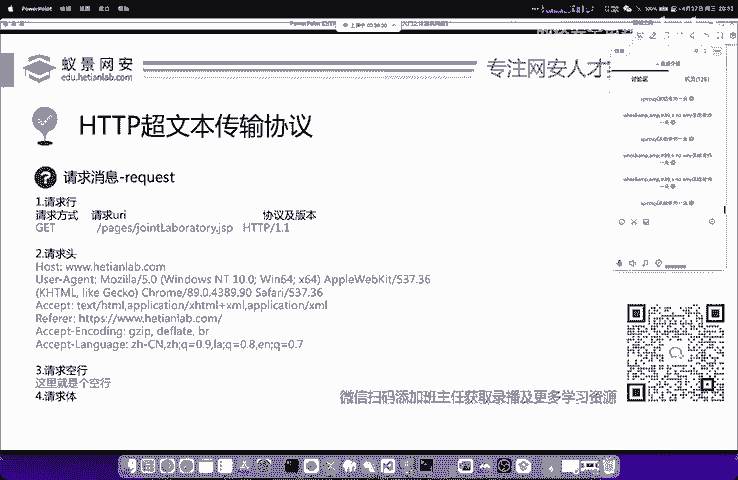

喂喂，有声音吗？有声音吗？没声了啊。稍等一下。喂喂啊，有声音了吧有声音了吧，这个这个没有没有，我是用的这个麦克的内置麦克风啊，现在我是插入了外置的麦克风，音质应该变差了吧。啊。

不过这个可能是腾讯课堂的客户端问题吧，他可能对麦克的这个ar架构兼容性不是太好啊，明天我换个电脑给大家讲啊，换个这个windows的电脑给大家讲啊，今天就先将就一下吧，之前也出过这个问题啊，比较头疼啊。

比较头疼。那现在这个外置的这个麦克风啊，它的音质肯定是没有这个啊麦克的这个收音效果好的这个也没办法了，大家将就一下。那这个request的呢，其实本节课又不难啊，就是你当一个啊就当一个相声去听就行啊。

我尽量讲的稍微有意思一些。那这边呢首先我们来分别分析一下这个request的请求消息吧。那这个消息中呢，第一点啊，就是我们的请求行。首先在学习这些东西的时候，经常会有同学问我啊，就说为什么要这样。

你也不要问我，我不知道呀，这是别人是吧？这是老外已经定义好的，我们就去用就完事了。这些东西都是定词的，比如说第一个就叫做请求行，那请求行里面呢，是包括了像我们常见的请求方式啊，请求的地址以及协议及版本。

我们来分别看一下。首先是这个请求方式啊。请求方式，这里默认是getge，还有其他的请求方式。我们一会儿来看一下。第二个就是请求的URIURR的中文意思呢，叫做统一资源的标识符。

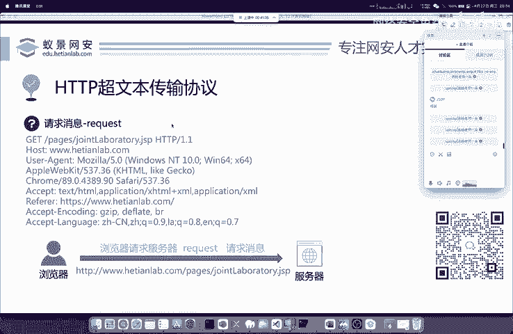

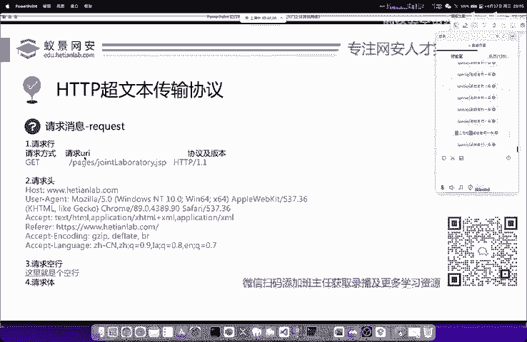

就是指啊你要访问哪一个页面，就像我们一个网站啊，比如说和天晚实验室是吧？它有非常多的页面啊，非常多的页面。那上面的这个网址它会变的。那你具体要访问哪一个，你要告诉服务器是吧？

怎么告诉就是通过我们这个HTTP协议的这个URI这个地方啊去告诉他去告诉他，这是已经定好了，已经定好的。然后下面呢是协议及版本，我们使用的呢是HTTP协议，一般的版本呢是1。11。2，这是非常常见的啊。

一般都是1。1，这是我们的请求行，下面给大家讲一下这个请求方式。那HTTP超文本传输协议啊，常见的请求方式是有8种的。

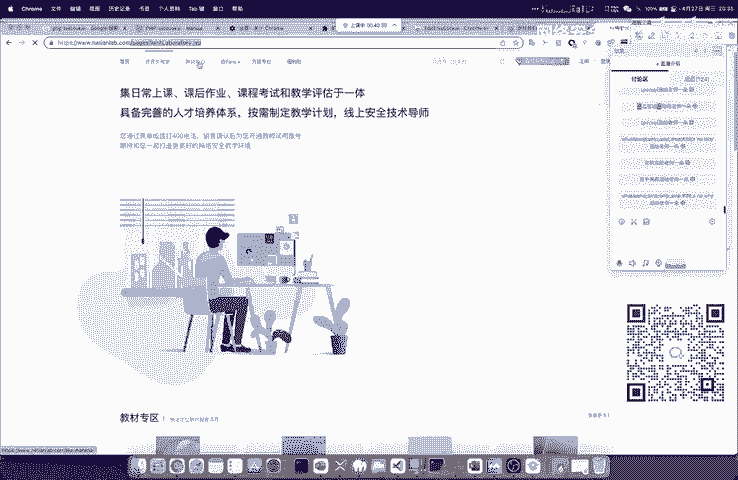

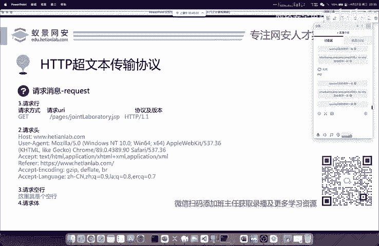

这个但是大家请注意是远不值8种，你不要去相信像CSDN啊或者是博客园很多人写的这些帖子呀。他告诉你啊，像HTTP的请求方式，比如说有人告诉你有6种，有人告诉你有8种，你千万不要信啊，这个你要信的话。

你去看HTTP的官方定义有几十种呢。但是很多情况下我们都用不到，那常用的呢就其实就这样啊，就一个是get，一个是post，那我们来下面就关注post和get这两种请求方式的一个区别。

其实这里呢在面试中也经常问到啊，大家先先还是要记一下这个地方，首先什么是get请求。比如说老师在核天环实验室中去搜索一个实验。比如说搜索啊123搜索之后啊，大家会看到这个123在哪里啊。

在我们的URL地址中，哎，我来给大家看一下吧，这个可能有同学看不清。

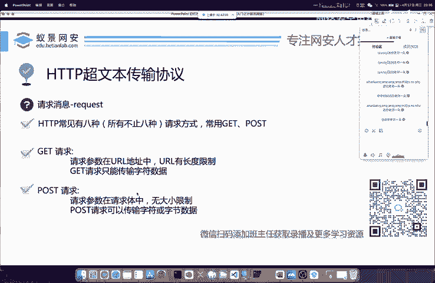

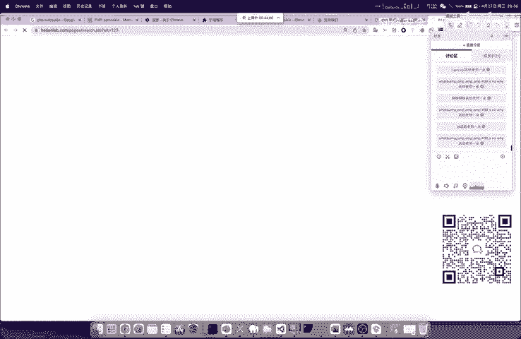

啊，它在我们的URL地址中啊有个叫做啊WK等于123。那这个时候我们其实就可以确定我们当前所访问的这个请求是get请求。那po的请求是啥样的呢？po的请求就像大家去登录用户名和密码的时候。

在登录用户名和密码的时候呢，它并不会显示就是在网址中呢，并不会显示我们传入的数据。一般呢就是pose的请求，这是一个简单的区别。如果你只答了这一点是远远不够的。我们下面呢再来看一下。

首先get请求呢就是我们请求的内容或者是把它叫做请求的参数是存放在URL地址中的哈，是存放在URL地址中的。那我们的网址呢它是有长度限制的。第二点呢就是我们get请求是只能传输字符数据。

而pos的请求啊，它可以传输字符或字节数据。这是啥意思呢？像我们正常使用网站的情况下，会有很多二进制的数据需要进行传输。比如说大家去刷抖音，这些抖音以上传视频。

视频在网络中就是以字节流的形式来进行传输的。那这个操作你想一下，能用get吗？是不可能的，因为get请求是不能够存这个传输二进制留文件的get请求呢只能传输我们常见的字符。

比如说IDCD1234这些东西。如果你想传输一个视频或上传一个头像，那必须要采用我们的po的请求啊，必须要采用我们的po的请求。

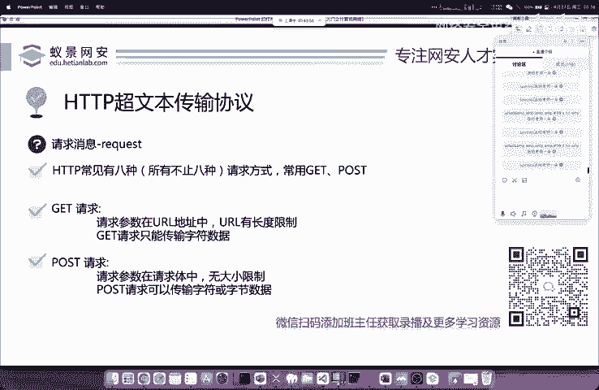

好，OK我们下面呢再来看一下，简单看一下他们的区别，是从他们的请求行中啊，请求行中去看。首先呢我们get请求中，我们的请求参数是在哪呀？是在我们的请求的URI中，在这写着呢。

就是我刚刚放在讨论区的这个哈，这个WK等于111，它写在这个地方。那如果大家看好，我现在把这个请求变成post它会变成啥样的呢？我们来看一下，首先呢它这个请求消息啊，就是这个参数，它会跑到下面去。

最下面这个东西呢，我们把它叫做请求体啊，把它叫做请求体。第二个区别是什么？大家应该看到了。第二个区别呢就是这个get哈，这个get这个字符，它从get变成了我们的post啊，变成我们的post。

还有第三个区别。第三个区别是非常重要的。请大家注意看。

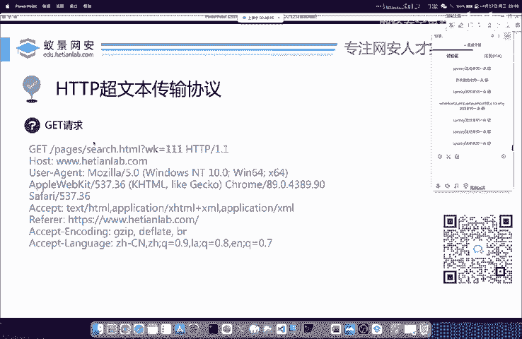

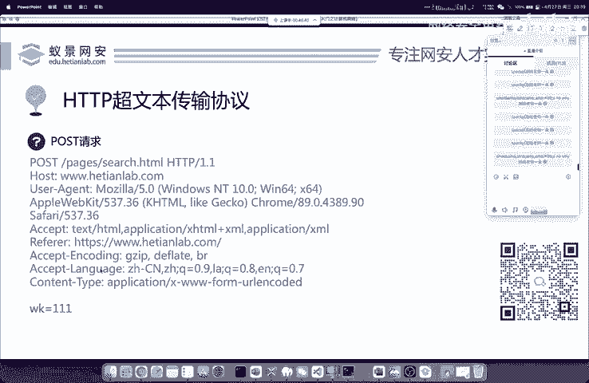

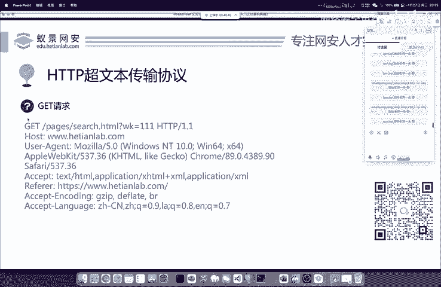

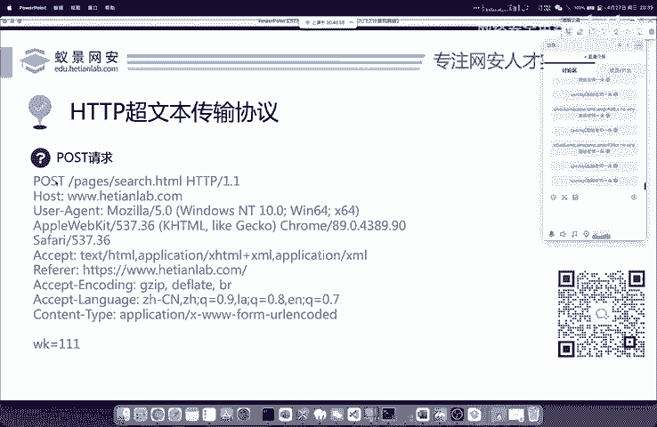

第三个区别呢就是我们的请求行中添加了一个新的东西，叫做content type。conent type呢来看一下。

它默认是plication x3W form uRL encoded的这是它默认的一个值。如果你不加content type这一行。那po请求是没有任何意义的。也就是说整个的请求消息是错误的。

所以说大家一定要注意这个区别。如果你在面试的时候能够能够答出来这个content type，那是一个极大的加分项，请大家要注意啊。如果你记不住的话，没关系，因为后面呢可以进行复习，并且这些东西啊。

网上也都能找到。大家如果感兴趣的话，也可以来我们和腾讯课堂合作的一个特训班来进行学习都是可以的啊，都是可以的。

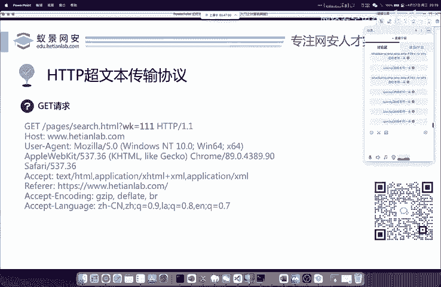

如果需要本节课的录播呢，也可以扫描屏幕右下角的二维码，添加班主任微信去免费领取啊，免费领取O。

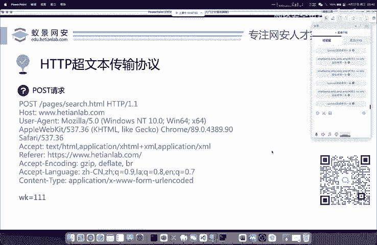