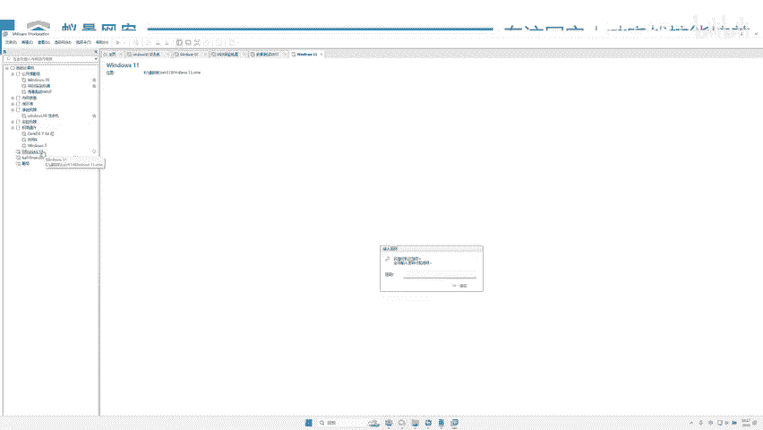
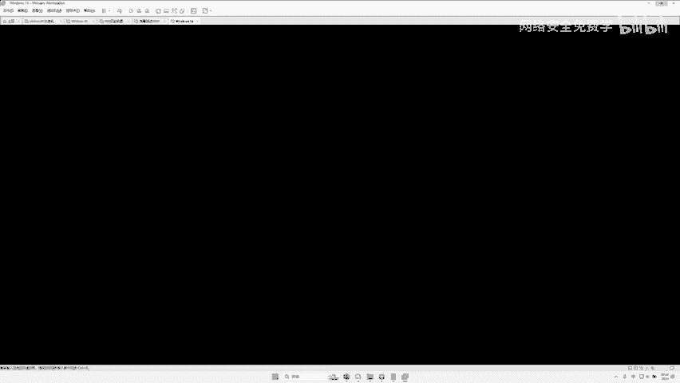
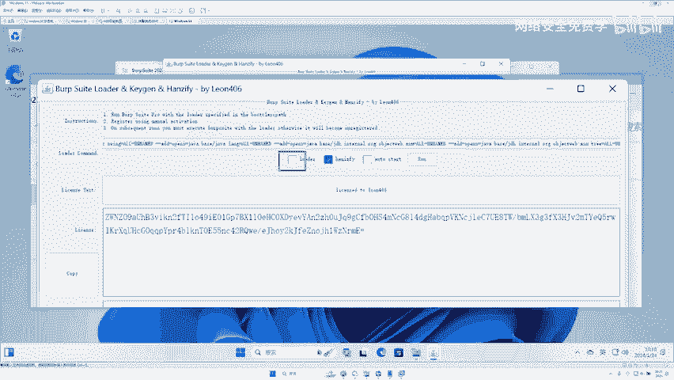
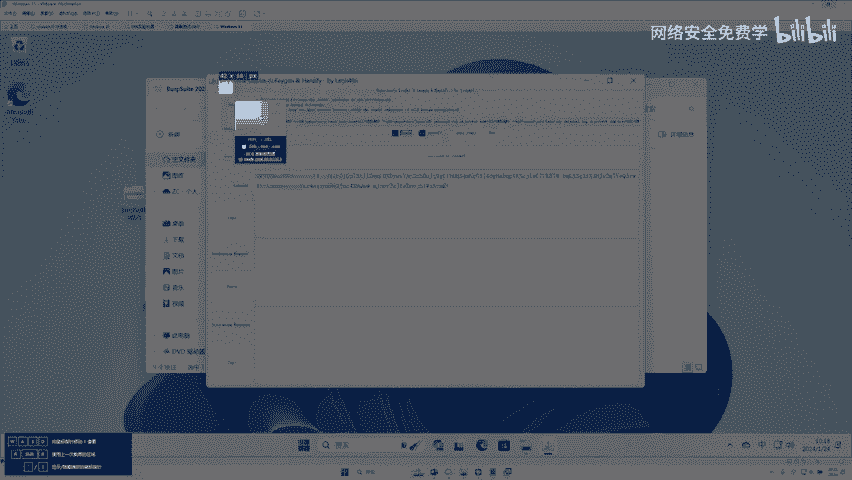
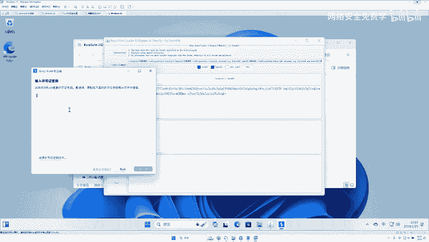
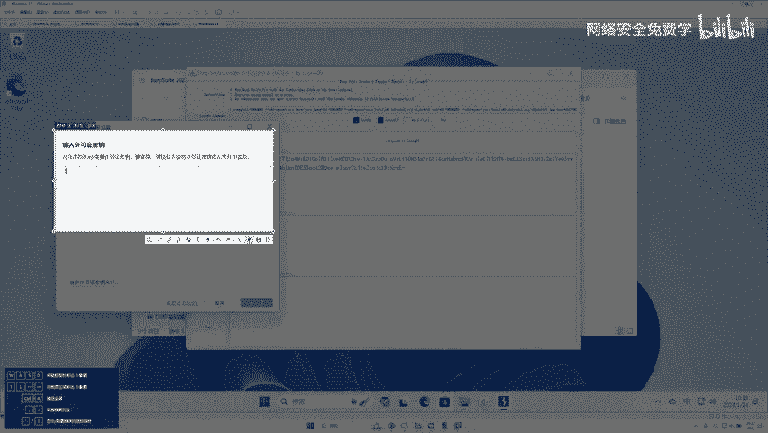

# 2024B站最值得看的黑客教程 ｜ 网络安全／渗透测试／内网渗透／漏洞挖掘／web安全／kali linux／红队靶场／CTF／信息安全 - P55：黑客工具BP安装使用 - 网络安全免费学 - BV1uBsTetEow

嫖丸子不是嫖丸白嫖，对不对？我们要就是说第人。😊，你想去挖洞，对不对？你想找这样的漏洞，需要用到什么工具，其实什么工具都不需要，只需要用到一个工具，就是我们的一个黑客工具，叫b。BP这样的工具。

好吧BP这个工具就可以了，对不吧？怎么抓包，怎么改包，都在这个工具上进行完成。好，那么在这里大家介绍这个工具，对对？我也并且带着大家去一步一步安装一下这个工具，对不对？那么这个BP这个工具啊。

它需要java的支持啊，那么对于很多人来说安装的时候可能不太友好。但是李哥今天给大家准备了一个什么免java安装的，就是你双击就可以直接运行的。所以说你只要有台电脑把我给你的东西放到BP放到你的电脑上。

你双击就可以直接运行起来啊，所以今天的安装是比较的简单。好，那么这个BP这个工具到底是干什么用的，对不对？好，其实非常简单啊，就是这样的，你看比如说这是我们的浏览器，对不对？我们去访问一个网站的时候。

比如这个是网站的后台服务器，对不对？我们的BP就在就等于说哎在这个浏览器跟那个网站网站中间做一个中间人啊，就是我们比如想访问一个网站。我们的数据包先是走到这个BP上然后通过BP进行修改啊，一些操作。

对不对？再发送给这个网站。然后这个网站再返回给BP这个东西再返回给你。😊，浏览器啊，就类似于一个中间人的工具啊，就好比如什么好，比如这个是你，对不对？你啊，你想去这个什么商店商品，对不对？

还想去个商店里面购购物啊，但是你又不想去，哎，你就找了什你的什么哎，找了你的女朋友。哎，那么你的女朋友就是你的什么中间人，你把你的钱先给女朋友，你女朋友去商店买个东西，商店把东西给女朋友。

你女朋友再给到你对不对？啊，那么这个BP就类似于女朋友的东西，对吧？类似一个中间商黄牛的角色，对吧？我们把网站啊发送给服务器的数据先给到BP那么给到BP的时候就可以进行修改了对吧？

你把钱给你给你女朋友女朋友可以选择不给你买，也可以选择把钱扔掉啊，也可以拿着你一块钱的东西给你买个10块钱的东西，对不？都是可以的啊，那这个就看你女朋友的心情了。

那么同样这个BP里面就可以对网站的数据进行修改，从而实现什么一些漏洞的玩好这个就是种BP好，请大家记住这样一个啊名字啊，这个呢名字叫什么如果说你不会读这个英语单没关系啊这看到这个单词。

你不用管他什么意思啊，知道他是什么一个抓包工具啊，叫BPO好，那么这个BP到底怎么去运行啊，接下来我们给大家去演示一波。😊，那么这个。BP的这个工具呢，我已经提供在了百度网盘里面，大家可以自行去下载。

对吧？那么现在呢我们拿一个什么，拿一个真实的win11给大家去做一波测试跟演示，好吧。

好，我们用这个win10给大家做演示啊啊，我用一个全新的OK全新的啊。好，大家可以，现在你先不用按照我的这个操作去做，等我下下课之后，我会把录播给到大家的，对不对？你们可以反复去看啊。

然后反复去测都没有问题啊，希望今天的课程也能给大家这三天的课程啊，你信我，你只要听完你的收获是非常多的啊，这里面包含的一些知识还是蛮多的。好，我们把这个先把这个虚拟打开。

我们用个全新的win11给大家做演示啊。那么这个BP这个工具啊啊李哥已经下载好了，对不对？我们在这里给大家看一下啊。😊，哎，就这个工具啊。啊，就这个工具啊，就这个压缩包buff啊。

这个BP这个工具已经给兄弟们放到了百度网上的链接里面，对不对啊？你们可以自行去下载了，对吧？好，那么现在呢我们就正儿八经的，对不对？在这里呢，哎我们给大家试一下这个BP到底怎么去用啊。好。

我们把这个打开。首先我们先把我们的BP这个工具啊放到我们的电脑里面来啊。

，放到我们电脑来，我再一步一步给大家怎么下载。哎，我们去百度网盘里面下载，对不对？好，如果说你不知道百度网盘在哪里，我直接给你发到群里，好吧，我们直接我直接发到公屏上，好吧啊，稍稍等一下啊。

如果说你真的不知道，好吧。😊，好，来，我把这个工具发到这个。公屏上啊，你自己保存一下，把它保存到你的手机里。好吧。好，这是我们网盘的地址，你去这里面去下载，好吧。啊，我们打开给他家看一下啊。

我已经发到公屏上了，对吧？你把这个啊网盘这个东西打开，对吧？啊。😊，好，打开。好，然后提取文件好吧。OK然后我们往里面看啊，你看这个有个工具，对不对？好，我们把这个工具点一下。啊。

这里是不是有一个什么b suite2023，哎，我们把这个工具哎下载下来就可以了，对吧？下载下来之后呢，你就跟李哥的一模一样了。哎，我们直接把它什么拖到你的电脑里面来，然后双击哎双击之后呢，哎。

因为它是个压缩包，对不对？我们把里面这个文件夹哎拖出来拖啊，一定要拖出来啊，双击，然后拖出来啊，不要去什么双击运行啊啊，它是个压缩包啊，就压缩出来了啊。😊，不是要啊回放链接吗？啊，没有，现在是工具啊。

回放一会等下课了嘛啊，下课了。好，我们把这个东西先给他弄个简释一下，对不对？好。😊，然后带着大家去做一波操作跟激活。好吧，为啥我不能全屏？我不晓得呀。😊，好，来，我们把这个。打开啊。OK打开之后。

这个文件夹就在这里，来，我们看一下怎么去运行啊，双击。😊，来，兄弟们往这里看啊，这里面呢有几个文件啊，我来我们大给大家去一个一个去看一下哈好。首先呢哎在这里给大家讲一下啊，这个是什么激活程序，明白吗？

哎，这个是激活程序啊，如果说你想激活啊，要去运行这个。😊，啊，这个是激活的程序啊，那这个是什么呢？啊，这个是什么英文版。😊，啊，英文版的程序，这个是什么呢？哎，这个是非常好理解的，是吧？中文版。😊。

中文版好，所以说我们运行是怎么运行？第一步先去运行这个激活，先把它激活，对不对？第二步啊运行这个中文版。好，那有人说了，中文版可能有问题，我不喜欢中文，哎，那你就运行这个英文版啊，这个中文版跟英文版。

你二选一就可以了，对吧？好，所以兄弟们，我们先去运行一个什么star激活程序哈。好，我们双击这个激活程序就可以了啊。😊，好，那么它具体的啊双击完成之后，兄弟们啊，来激活程序长这样，对不对？好，长这样。

来，如果说你这里没打勾啊，把这一块先给我打上勾啊，这一块一定要打上勾，对不对？好？我们打上勾好，打上勾之后，哎，这是它的激活程序，对不对？我们直接去运营什么？我们直接去点击这个run。😊。

哎，这个run run就是启动的意思，对不对？好，我们把这个东西启动一下啊，现在是在激活，对不对？好，启动，哎，你看这个程序就启动下来了啊，它不需要你去安装java，对不对？

因为我们java已经内置在我给你提供的bb suite里面了啊。😊，好，我们等它启动啊，它那个启动时间啊。如果说兄弟们啊，你们不知道怎么去启动英文版中文会显示方框吗？英文版中文字会显示方框吗？啊。

那个那个是编码问题啊，那个不会的，英文版它的中文也是显示中文的啊。来，我们点击这个什么接受好，点完接受之后，兄弟们来看这一块是不是有个空白的地方啊，需要你什么提示你什么输入这个什么许可证的密钥，哎。

在这个空白地方，那么这个许可证的密钥在哪里呢？兄弟们啊，许可证的密钥在哪里呢？哎，我们许可证密钥，兄弟们，就在这一块啊，就在这个这一块这串字，我们把它复制一下，复制到这里面来啊，没有问题吧。

就是说什么就是把这块的东西复制到这里面来，哎，这个就是许可证的密钥。然后我们点击什么，点击这个下一个好，点击完下一个之后，兄弟们往这里看啊，我们再去点一个非常简单的东西啊。

点击这个什么点击这个手动激活啊，一定要点这个什么手动激活好吧啊，我们点击手动激活好，点完手动激活之后，来，兄弟们往这看啊，将这里面的数据啊，复制到这里面来。😊。

对不对？这个咱大家都会把哎复制。对，将这里这里的东西复制到这里面去，哎，就可以了。那李哥现在给他复制一下来，先全选的右键啊，你可以ctrol C哎，ctl B哎，复制进来，复制进来之后来再看下一步，哎。

将这里面这个东西啊复制到这里面来。对吧啊，我们这里还是什么？这里还是什么复制。哎，就是非就是这样两步就可以了。好，我们来复制一下，哎，把它复制一下，复制一下，然后点击什么下一个啊下一步，然后点击完成。

好，完成之后，这个BP就被激活了啊，看你看就激活了，对不对？你看现在是不是中文版了。哎，我们点击下一个启动好，现在呢就可以把这个激活这个程序呢给大什么关掉了啊，然后现在等待片刻，这个BP啊。

就进入到BP工具的什么运行界面了，我们就可以在这个界面里面去运行这个BP了。O我们稍等一下啊。😊，来，那个BP就启动了。好，一会我们要找漏洞，就要用到这个工具。好，我告诉你，很多人说李哥，我学网络安全。

对不对？哎，我是不是用这个什么凯里？开里啊，开里大家就知道天天装开里好，你天天装开里，兄弟们啊，你不如什么，你不如学这个BP啊，你要知道BP在我们的实际的什么学习中工作中，使用率在80%，你们感信吗？

啊，你们知道这个BP这个工具就是什么黑客的键盘？啊，BP这个工具就是黑客的键盘啊，没有，所以说它是非常重要的对吧？黑客的键盘，黑客都没有键盘了，怎么去玩啊，程序员都没有键盘了，怎么去敲代码。

那B黑客都没有BP了，那怎么去挖漏洞，所以BP的重要性就可想而知了，是非常的重要对吧？啊，有些小伙伴可能没有听懂，对不对？没有听懂来，李哥直接用PPT给大家说一下，对不对？好，我们第一步对不对？哎。

在这里勾选先打开激活的程序哎，进入到这个页面，我们点击转啊，运行这个BP好，第二步干嘛呢？哎将这里面这个内容哎，复制到这个许可证里面，这里面去啊，然后点击下一步啊，然后再将这里面的内容复制到这里面来。

哎，再点一下好，然后再看嘛，再将这里面的内容复制到这里面来哎，再来一下，然后就可以了，就这么简单啊，可以在本期装吗？可以啊，每个人的电脑上都可以去装啊，如果说你没有听懂没有关系啊，这个应该是非常简单。

稍后我把这个下课之后，我把录播给到大家啊，然后大。😊，去看就行了，对吧？大家直接在你自己的电脑里面装就行了。你知为什么我的我装在虚拟机里，是因为我给大家演示，我的电脑已经有了啊，再装不会提示这样的东西。

大家一定要装到什么，装到自己的电脑里。因为你的电脑性能好，这个BP它的性能就好，它的BB性能好，它就玩的好，它跑一些东西它就快，否则的话就比较慢，懂不懂啊，因为这个东西实打实的实战的东西对吧？好。

那这个工具运行起来之后，兄弟们，那这个工具怎么去用，如何去win7能装吗？win7可能会有点问题啊，win7可能会要需要用到D版本这个BP大家最好在win10和win11上装，对不对？

因为现在的win7的电脑确实已经很少了啊。好，兄弟们那这个BP怎么去用，我们打开了哎打开之后呢，相信兄弟们应该都能看懂，对吧？因为这个呢是一个纯中文版的，对吧？我们启动的是中文版好。

什么仪表盘目标代理啊，在这些工具栏里面啊，兄弟们到底哪个最有用，兄弟往这里看，你只需要会。😊，这一个。就可以了啊，还有这个。今天我们学的内容啊，你只需要会用这个代理，会用这个重放器，我们就能实现啊。

你就你就是会用这个你这个BP啊，百分之50%你就已经会了，对不对啊，后面这些东西啊，后面这些东西啊啊10%80%90%都什么没有用啊，一般我们是很少用这些东西的啊，很少会用到后面这些东西的啊。

包括什么前面这个什么仪表盘目标啊也用的比较少，这个目标可能会用的比较多，这个仪表盘用的比较少，一般用到百分之八九十用的最多的啊，就实这三个啊，代理 in出的重放器啊。

那么这个代理今天我们要去讲重放器我们要去讲这个 in出的啊，我们不要不今天不去讲啊，不去讲，大家可以用好之后呢啊重新器因为比较老的是吧？这个 in出的呢，我们这个什么我们大家可以自行去学习一下好吧。好。

我们先看一下这个代理这个东西到底什么意思啊。好，代理大家知道，我们刚刚说女朋友对吧？这个代理就是说啊点女朋友的选项。好，我们把这个代理点一下啊。😊，好，点完了之后，兄弟们往这里看啊，这里有几个设置。

对不对？第一个叫拦截，这里叫HTB记录啊，web socket的记录代理设置啊，并且底下呢还有几个字儿。那么我接下来我们逐步的去讲一下这个代理这里面都是什么作用哈。首先这个拦截哎代表什么？

就是底下这个东西就是拦截。来，你看。啊，他默认了第一个框框。底下是蓝截，你看ATP记录weboc记录代理设置，对不对？啊，这里的都非常好理解，对吧？好，我们再给大家看一下啊。😊。

首先我们先看这个代理设置设置都不用说了，就是对这个代理进行相关设置嘛，对吧？啊，这个webshop记录几乎不用，对吧？这个HB记录啊，你们今天也用不到啊，也先不用，好吧，我们只用这个拦截。

我们点一下这个拦截，哎，底下就会出现了这12345哎5条这样的东西，对不对？好，那么这里面哪个最重要，哎，就这个比较重要。还就没有了啊就没有了。那这个到底什么意思呢？就是说你看当我们流量。

我们刚刚说了数据包，对吧？走到这个BP之后，来，我们把这里呢。放到这个。课件里面去啊。来我们刚才说这个BPBP打开其实是这样的，你看当我们的这个数据走到这个BP的时候，对不对啊？

我们怎么去操纵这个数据包啊，其实就是这个代理这一块，对不对啊？这个代理这块当我们点击这个什么拦截已关闭拦截已关闭意思就是说这个什么这个BP现在不拦截数据包，你只要一发送这个数据包经过BP他不拦截。

直接就到了这个服务器上，然后服务器直接就回来了啊，这个这个东西不拦截你，对不对？就跟你女朋友，对吧？你去给你女朋友商店，你把钱给你女朋友说啊，你女朋友不管你啊，直接二话没说就给你去买烟了，对不对？

他没有拦截你的东西啊，如果说我们把这个什么拦截开起来啊，拦截开启，那么我们的数据包就干嘛呢？就一发送就会发送到BP上啊，那他BP就不会往这边去发了啊，就拦截下来了拦截下来之后。

我们就可以针对这个数据包进行修改修改之后，我们再点击什么放行，放行就是我修改完了，对不对啊，修改完了，对不对？然后我再过去啊跟。😊，你女朋友商店啊，你给你女朋友1块钱啊，女朋友没有直接去。

先给你叭叭一顿说啊，你这么懒，你看你一天天天的这个1块钱天天抽烟，啪拉叭拉叭拉，先把你骂一小时啊，骂完一小时之后呢，哎再去给你买来包烟啊，你头大了，是不是就类似于这个道理，他在这里做了一个停留啊。

这就是什么？这就是这个拦截的功能啊。😊，开启拦截啊，他就是把包拦下来了啊。如果说不拦截啊，就这个包就直接过去了啊，就这么简单啊，就跟女朋友，对吧？女朋友脾气好，不拦截你钱也给他直接就买了。

拦截你咔先把你骂一顿啊，直接给你一顿首播，对吧？把你拦截下来了啊。好，其实就是这么简单啊，就没有了啊，那么我们就可以对这个数据包进行一些操作修改了，对吧？好，一会呢我们就会用这个BP啊，试一下。

怎么去拦截，怎么去放包，怎么去丢包啊，怎么去打开浏览器好不好啊？OK好，那么在这做这个BP这个功能。😊，看来是真实经历对面。😊。

