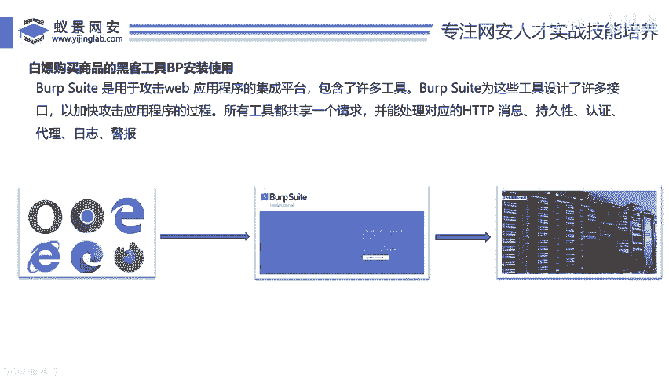
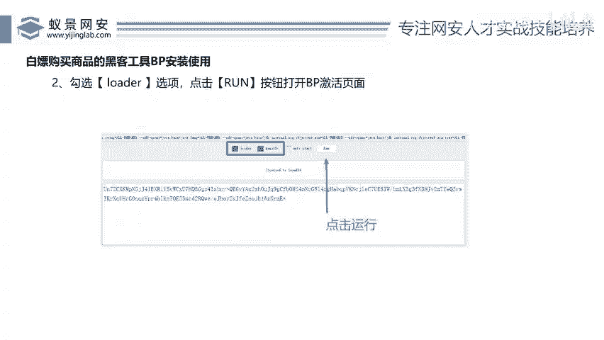

# 2024B站最值得看的黑客教程 ｜ 网络安全／渗透测试／内网渗透／漏洞挖掘／web安全／kali linux／红队靶场／CTF／信息安全 - P56：部署自己的电商网站 - 网络安全免费学 - BV1uBsTetEow

我每次让我呃老婆给我买包烟，老婆都得说我一顿。😊，好，我们看一下啊，就是说我们知道这个BP这个东西之后，大家可能现在还有点懵，还不太会用啊。但是没有关系啊，我们一会儿去实战操作的时候，你就会了，对吧？

😊，我们在操作之前必须要有一个什么？兄弟们啊，必须要有一个系统去操作，对不对？我们必须要有一个什么购物的网站啊，我们现在这个工具有了，对吧？😊。

我们这个BP的这个工具有了啊，有了之后，我们还得有一个网站嘛，对吧？我们刚才说了0元买iphone。那么呢那那个网站这个烧屏的网站在哪里？我们得先把这个网站给它搭建起来。那么兄弟们啊。

那么这个网站怎么去搭，其实非常简单啊，跟着我的操作好，接下来大家不要眨眼睛，好吧？跟着我去操作，我们用三分钟把这个网站搭起来。然后就可以对这个网站进行渗透测试了。好吧？那么本次这个部署啊。

我们采用了两个工具，第一个工具叫P study。第二个工具叫大米的哈，这两个工具大家往这里看啊，我已经全部提供在了我们的百度网盘里，就是我刚才在这个评论屏幕里面啊评论区。😊。

给小伙伴发送的那个啊，你点开之后，刚才不是下了这个B区吗？现在你把这两个东西给我下下来。那这一个工具跟这个工具哎，就是我们的这个网站购物系统。我们现在需要把这个购物系统给大什么搭建起来。好。

那么接下来兄弟们哎，我们把这个购物系统来搭一下啊。😊。

