# 2024B站最值得看的黑客教程 ｜ 网络安全／渗透测试／内网渗透／漏洞挖掘／web安全／kali linux／红队靶场／CTF／信息安全 - P57：支付漏洞 - 网络安全免费学 - BV1uBsTetEow

同样我们还是在这个什么还是在这个什么win10里面给大家做一波演示，好吧。来怎么做呢？来，我们先把什么？先把我们的这个大米的这个东西拖进来。哎，大米。就是刚才下来的东西啊，还有一个东西叫什么？

是不是我们的PHP study啊？哎，这个PP study好，我们复制一下好也把它哪里复制到这个电脑里面来。好，那先装哪个东西呢啊，现在这个PB study跟这个大米都有了。兄弟们先装哪个啊，听好了。

先装的是这个。PA。踢球地来啊，先装A。啊，先装这个工具啊，先装我们的PA study，也就是这个工具啊，一定要先装这个好不好啊，一定要先装这个。好，我们双击把它打开。来。

然后直接把它拖到你的电脑里面去啊，这个都没有读，大家放心啊，这个都没有读，大家不要放心，大家都放心。有点跟不上了，太快了，对不对啊？没有关系啊。好，那我就讲慢一点哈。很能说小伙伴是不是李哥讲的太快了。

对不对？好，那李哥在就慢慢的给大家盘一下，对不对？好，那么我们还是回到哪里，回到课件，刚才我们已经说了BP了，对不对？那么接下来好小伙伴们，我们要搭建我们的系统网站对不对？有的系统网站才能进行测试。

那这两个系统网站去哪里测去哪里下载呢去我们的百度网盘里，对不对？好，百度网盘下载这两个工具好，这两个工具就是我们的系统网站。好，我们先要安装这个什么PHP studyOK啊好，把它先拖到你的电脑里来。

对不对？这个安装软件嘛，李哥觉得这个大家应该都会嘛，就说的比较快啊，来把这个软件直接用我们的鼠标双击哎，双击哎，双击会不会哎，右左键双击哎，然后他会默认装到D盘里啊，我们随便啊，你把它想装的哪个文件。

😊，里就文装在我文件里，这个都会吧啊。来，我们点击再双点一下这个是，哎，用鼠标的左键点一个是就OK了。啊，就OK了然后就等待它装好就行了，就这么简单嘛。其实我们现在说了这么多，先把什么。

先把这个PVstar在电脑装一下，就这么简单啊，怎么装双击嘛？双击下载双击完了没了，而且它不它不吃操作系统，对吧？你的win7win8win1win1都可以装啊，啥系统都能装啊。

什么20122019都可以，好吧。没有一个太大一个东西啊，BP蓝截浏览器会不会。会报不安全。啊，人说啊，你个BP拦截会报不安全，一会儿教大家怎么就不报了，好吧，一会儿还没有教你怎么不报呢，对不对啊。

你别着急嘛，对吧？你现在是不是太着急了啊，回放哪里？回放等我下课之后，对不对？我会发在公屏上啊。好，兄弟们呢，来，我们把这个就装好了，对不对？你看现在就装好了啊，现在点击试。这都这这有什么呢？

这这个么难？哎，你看装好之后，它还会弹出一个这样的框，对不对？好，这是我们第一个哎小工具就装好了啊，就是我们的什么网站系统，对不对啊，我们的那个一个后台系统啊。😊，好，我先把这个浏览器关掉啊。好好。

PVstar中号，兄弟们现在来了，对不对？我们是不是要装这个大米了？好，那这个大米呢是不是也是刚才都下载过来的哈，我们把这个大米在这一块，对不对？那怎么装？兄弟们哎，来，我要讲慢一点啊。

现在要怎么装这个就比如说可以能 word word不行啊，来怎么看啊，第一步点击哪里啊？点击这个。😊，其他菜单选项好不好？哎，点一下它啊，点完了之后，兄弟们。我要截我要截图，我看能截图不好，点完之后。

兄弟们啊。啊，我给大家放大一些啊，省得你们又看不见，想他们我们把这个工具装好之后，先点这里，这个灵头是 red的，好吧啊，先点这里。啊，点完之后他会弹一个这样的东西。好，这个东西我们选择什么？

选择这个网站跟目录。哎，我们用我们的鼠标对这个网站跟目录轻轻的点一下，这个都没有，你怎么点啊，左键点，对不对？把这个网站跟目录给他我点一下。好，那么接下来我们试一下，来点击这个网站跟目录。好，点完之后。

兄弟们来看它会跳到一个这样的一个什么页面里面来。哎，接到一个文件夹，打开一个文件夹，对不对？打开一个文件夹。第一步，我们把这里面所有的东西啊全部给它删掉啊，什么删除。啊。

删除全部删除删除都会把啊怎么删除，全部复制右键哎鼠标到右键，然后干嘛呢？然后找到删除的选项啊，直接删。如果你影响快捷删除就全部选controrl加D哎，把它全部删掉，对？删掉之后呢，哎，问题来了。

删掉之后里面没东西怎么办？哎，我们把我们的大米双击哎，那我们大米里面是不是有很多这样的文件，我们大米的那个文件夹里面。好，我们把这里面所有东西啊复制到来复制到你刚删到那个地方，把所有东西都复制进去。

O那我们的系统就搭建好了，接下来就可以进行漏洞测试了。好，这个都没有问题吧。来，我们现在稍作等待啊，等它复制过去哈，这里面大米的那个文件夹里面这么多东西，对不对？我们把这个每一个东西好不好？哎。

删到这里面来，比说删了会不会影响打开DVW哎如果说你第一次做，你一定要删。如果说你之前有P study，对不对？如果兄弟们啊，我为什么要删因为这样比较简单，对吧？如果说你之前这里面有什么。😊，DVWA。

啊，有这样的系统，那你就可不能删啊啊，你可不能删，那你怎么办呢？兄弟们啊，你说我之前有怎么办？这里面还有我的系统，那你直接把这个大米这个东西啊。😊，干嘛呢啊？直接。啊，在这右键新建一个面夹啊。

把这个大米的东西拖进去就可以了，对不对啊，明白吗？如果说你之前没做过，就把它删了。如果你之前有，你就直接把它拖到一个新的文件夹里面就可以了啊。

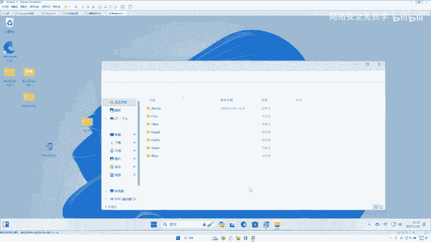

啊，有DVW跟DVWA的部署模式是一样的。好，那么现在为止，哎我们的这个什么网站系统就部署好了，对不对？现在就可以正式去运行它了啊，然后呢，怎么办呢？哎，然后兄弟们直接点击这个启动啊。

就是启动网站的意思好，我们把这个启动呢点一下啊。😊，好，那么这个启动的这个进程，哎，点击允许，对不对？好，我们让它去启动哈，允许myacq跟阿玛奇都给他一个允许的按钮。好，启动之后呢，怎么去访问它？

兄弟们在你的电脑上呢？哎，打开你的这个什么浏览器，查看一下自己的IP地址。来看一下IP地址。来，我们在这里IP康fi看一下啊。哎，当前这台电脑的地址是1921683。102，对不对？好。

兄弟们来我们呃在自己的电脑上啊，打开一个浏览器，访问一下哪里呢？192。168。3。102。好，回车。

啊，看能不能访问。好啊，如果说你成功访问了，对不对？对不对？如果说成功访问了，哎，他就会进入到一个这样的界面，现在我们怎么办呢？兄弟们来看一下这个东西怎么做啊。好，就是装好之后呢。

或者你在这里直接输入127。0。0。1啊，也可以啊，127。0。😊，好，输入你的IP或者127。0。0。1都可以，对吧？然后呢，再用你的浏览器输入就会进入一个这样的页面。这样页面是什么？

就是我们的大米的一个啊数据库的部署，对吧？然后我们接下来怎么操作呢？哎，李哥给他放大一些，好吧啊，先点击这个什么，我已阅读。哎，我们把这一块打上一个勾啊，哎，我已阅读点击继续啊，然后不用管啊。

点击什么继续啊，这一块兄弟们来问题来了啊，要填写数据库名称跟数据库密码好，这一块默认的数据库密码是多少？是root啊，如果说你之前有装过啊，那你就写你的。如果说你没有装过。

你就像李哥一样写root那这个数据库名字写什么，你随便起啊，在这里李哥写个大米。啊，就是root rootot对吧？大米好，我们就点这些都是默认情况下，好吧。来，我们点个继续。好，点完继续来。

我们直接什么访问网站首页啊，这里有访问网站后台，网上的首页，对不对？好，我们点击网站首页。那么这一个购物平台我们就搭建好了，在这个大米的Cmo上就可以进行一些什么哎，大米手机啊的一些购物跟烧品。

一会儿我们要用它去进行漏洞测试，配合我们的BP看如何实现0元买东西。OK那么这样一套系统就被我们搭建好了，是不是非常简单，兄弟们听明白没有？听明白给李哥扣一波一好不好啊，你先要确保听明白了，好吧啊。

操作的话没有，如果哪一步好像没有太懂没有关系啊，我们再看几遍就行了，对不对？😊，啊，都听明白了是吧？啊。回放别着急嘛，我这个课还没讲完，怎么给你回放呢啊。啊买了真能到货吗？买了肯定到不了货嘛？

咋你咋咋想的呀？买了怎么到货了，那么到货那不发财了嘛？对不对？兄弟们啊，那么问题来了，支付漏洞接下来就要给大家讲进是我们的重题了，对吧？我们已经把我们要挖漏洞的工具准备好了，把要挖的目标系统啊。

电商网站也准备好了，现在问题就来了，我们要去准备什么支付漏洞了，对不对？我们要去干嘛了，我们要去玩一下支付漏洞到底是啥？好，兄弟们往这里看啊，来这下到我们今天的重点了，对不对？支付漏洞。😊。

一般的危害都比较大，支付什么意思？就是付款的漏洞，对不对？凡是涉及到听好了啊，这几几句话比较重要，涉及到购买。提现。自动续费、礼品兑换、充值等方面的功能就可能存在支付漏洞啊。哎，这个屏幕怎么黑了哈。好。

比如说0元购买东西。0元购买东西。购多次购买东西，无限优惠券。对不对？还有什么？比如说还有我们的这么并发优惠券，优惠券任意使用优惠券任意金额，还有我们的签约漏洞，合约漏洞。

都是属于什么都是属于啊不好意思啊，李哥把这个碰了一下啊，都是属于我们的支付漏洞啊，现在就交给大家实占的啊，当然啊，那么支这个大家都明白没有支付漏就是跟钱相关的漏洞。那么跟钱相关的漏洞，一般危害的比较大。

对吧？一个公司跟钱相关的漏洞，我的妈那肯定危害的比较大。如果说兄弟们，你们能找到一个跟钱相关的漏洞，那你基本上这个漏洞值个三四千五六千，甚至上万块钱都是有可能的，对不对？好。

那么李哥去年找到一个网易平台的一个支付漏洞啊，给了我3000块，对吧？是网易严选的一个就是说他那个运费大家知道个运费没有运费是8块钱嘛啊，我可以让那个运费每次购买都不要钱啊，就是消运费，可以把运费抵掉。

我没有会员，我都可以不掏这个运费。啊，然后我就买东西了。对吧啊，什么样漏洞能值10万。😊，什么样的漏能11万？这个衡量标准就比较大了啊。你的漏洞如果说能控制1000台电脑，那那值个10万没啥问题啊。好。

那么这个兄弟们大家知道有没有支付漏洞了哈。那么在支付漏洞，因为方向比较多，对不对？来，兄弟，我们来看一下，那我们今天讲的是什么，讲的是购物的时候，支付漏洞对吧？那么在充值的时候也会有支付漏洞，对不对？

续约的自动续费也可能会有。那么我们今天会讲什么，会讲一个购买商品好，那这里呢李哥哎截了一个图，就是我们购买商品的一个链接来，我们把把这个东西看一下，兄弟们应该在网上都购购物吧啊，应该都买过东西吧啊。

没有人说我在网上没买过东西啊，那你真的out了，对不对？啊？这个同学们应该一看大家知道这个应该是个得物，对不对？好，得物它是怎么样购物流程啊。首先第一步。😊。

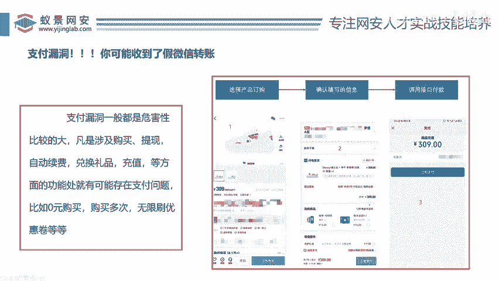

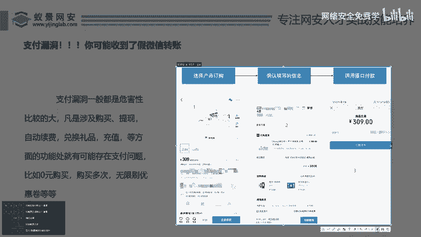

啊，这个流程一定要想好啊，这个这个想不好一会不好挖漏洞啊。首先我们是不是选择你的产品，进入这个产品页面，对不对？哎，兄弟们往这里看，哎，是不是会进到这样一个页面，这样一个页面里面啊。

他它它那会有一些东西，对吧？比如这个鞋子啊，是一个什么啊，这个是什么牌子啊，李宁的对不对？李宁那个鞋啊，30633069块钱啊，309，对不对？然后啊你把这个鞋选好之后啊，什么大小选好之后。

我们是不是要点击这个立即购买啊？😊，啊，兄弟们看在这里你是不是点了一下立即购买啊，那么你点立即购买就会产生一个数据包，对不对？啊，一会儿我们就可以在这个立即购买这块去处理一个数据包。好，这是第一步。

那么立即购买点完之后，你接着会进入到这样一个界面啊，这叫什么叫做确认订单信息界面啊，就是说在这里你要选择你的收货地址对不对啊，这里可能还会选择一些什么优惠券啊，有的还能选择什么附加了一些商品啊。

是不是这样的一些购物车的相关信息啊，这个类似于购物车，对吧？你把你的商品点了立去购买，它会加入到购物车，在购物车里面哎，你会去选择什么啊，你的这个啊，什么小区对不对啊？能不能选择优惠券。

运费的多少的东西，对不对？好，进入到这个页面之后啊，它最后会合计一下你的价格是多少？309块钱，对吧？因为这里你没有选择其他服务。好，那么紧接着我们再点击立即支付。😊。

然后就会跳到一个什么跳到一个这样的一个接口啊，然后会付这个微信这个款。好，兄弟们在这一块有两个动作，在这里点个立即购买。它会产生一个数据包，在这一块点一个支付，它也会产生一个数据包，对不对？

所以说我们在挖掘这样漏洞的时候，在这2块都要分别去抓包。分别抓包。什么叫分别抓包啊，这一块点个立即购买，你要抓个包改什么改你这个页面里面的信息，你看这个309能改吗？个数能改吗？对不对？哎，能不能改。

然后呢，他就会进入到这个购物车。如果说购物车里面你也可以点立即支付的时候，你也可以抓个包，然后去改什么，哎，改它的这个东西改他的地址能不能改，哎，它的运费能不能改它的一些优惠券能不能改，对。

然后再立即支付啊，明白了吗？兄弟们明白给李哥扣一，不明白，我要再讲一遍。因为这个涉及到什么，涉及到这个逻辑漏洞的逻辑啊，明白没有？就说我们购物这个流程他都知道吧，先选东西嘛，选完东西之后呢。

进入一个订单填写嘛，填完之后，你支付嘛啊，那你选东西要点确定嘛，那之后就产生数据了，我们就可以改这个东西啊，那你填完信息之后，你可以对不对？你也可以支付的时候也扯出数据了嘛，你也可以改这个东西。

所以说支付漏洞可以改两个这两个东西都可以去改对不对啊，那我们就要测哪个哪一个东西方有漏洞。😊，啊。对不对？好，那么兄弟们那知道这个流程之后，我们就来看实战去测一下啊。那么在这个测之前。

我们先看一个真实的案例，好吧好？我们先看一个真实的案例，到底能不能来支付。我说这个玩意儿到底靠不靠谱哈，那我们来看一个乌云的案例啊，当然这个案例比较老，是不是？但是也是有一些参考价值的哈。

就说这个人在云19065啊，这个是个真实网站，对不对啊？当然现在已经不存在这样漏洞了，对吧？买这个云服务器的时候，你看他买了多少，你看这里是不是在选购页面，还没有进入到购物车，就类似于什么？

类似于我们在这个选鞋的，对吧？他在这里选什么选这个固定套餐的啊，选一个旗舰版的啊，这里是不是写了啊要给大家放大一些啊。😊，来，你看他选了一个什么，购买件数是一件。对不对啊，价格是多少？2588啊。

然后他也要点击立即购买。好吧，好，这是他原本的价格哈，他点立即购买的时候，他抓了一个包，哎，他把这个树包给抓取了。来抓了之后，首先我们来看一下这里提示number这个一。本身叫一一是什么意思？就是一键。

好，他现在把它改成什么？改成负的3450件。啊，他也不知道这个number什么意思啊，他把这个一改成了负负的3400，对？然后我们来看下产生一个什么效果。当它生成了这个订单信息的时候，兄弟看。

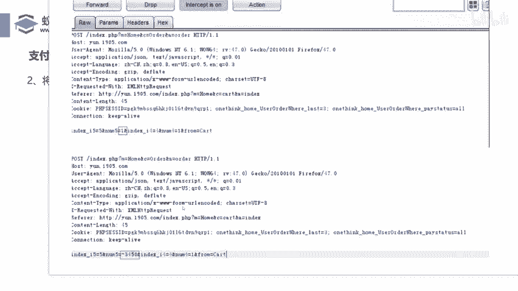

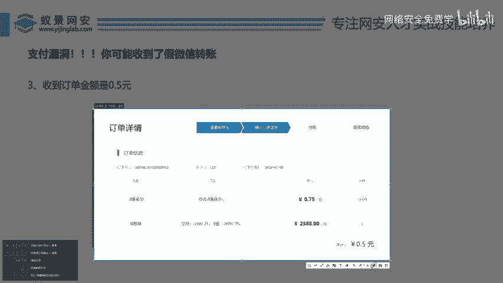

来，就是说之前这个旗舰版的这个流量是2580，然后他把里面数据一改会多一条这样的叠加数据，这个份数是多少？负的3451。那么负的3451乘以0。75，再加上这个2088，最后得出来是0。5。啊。

所以他支付的0。5就能买掉买到这个什么这个产品。这个大家理解没有？啊，就是他在这个选购页面对不对？选购页面啊，选购页面是不是？你看这里这个应该是它的这个这里还没有，对吧？它的价格好，然后他抓点击购买。

然后抓包抓包的时候，在这里把这个数字改成了负的3450块钱，对不对啊，然后这是它生成的什么购物车订单啊，订单我们来看它的负3500啊，是什么意思呢？就是这个份数啊，本来这里应该是一份，对不对？一份啊。

那一份就是0。75元。好，他现在改成了负的3450块。那么兄弟们，我们打开计算机啊，你去算一下这个价，对不对啊？😊。

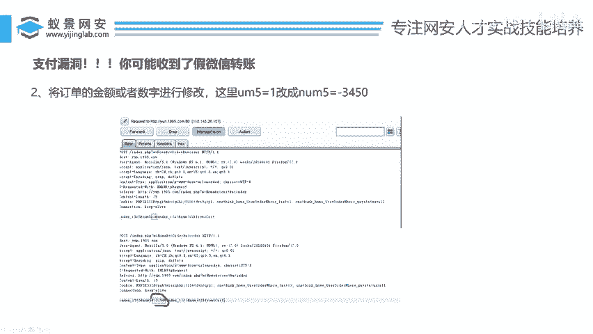

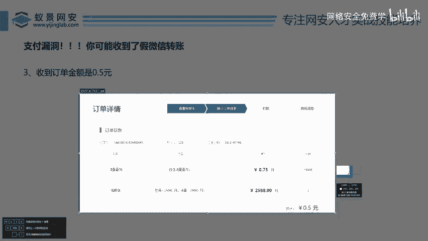

Langi。好，大开计算，你看这是多少啊，0。75，对不对？00。75对不对？乘多少？乘以。啊是删除啊0。75是不是？然后乘。Fd。这计算机怎么还算不了负的，哎，买这个算了我不算了不算了，复杂死。

这好多啊啊，就这么一算，对不对啊，它就是是个负数，对不对？这个负数加上这个正数最后一得是0。5元啊，就这么个意思了啊，就这么个意思。然后他就0。5元可以买这个套餐。你看他最后用过什么？通过支付宝负了0。

5啊，拿下这个产品好，这就是一个什么典型的什么支付漏洞。那你说你是不是可以白嫖了啊，你买一个这个套餐，这个套餐本来200025001个云服务啊啊，你花了五毛钱，好家伙就买了是不是微笑就比较大了啊。

你发现这家漏洞给你几万块钱没啥问题，对不对？好，那么这样了个漏洞到底如何去找怎么去找啊，接下来我们用靶场给大家真实的去实战一下，好不好？因为刚才李哥讲了，关于这种支付漏洞啊，我们设计的方式比较多。

提现礼品兑换充值啊，比较多，他大大小小有十几种啊，那么今天我们只讲了两种对吧？因为时间东系，今天我们讲哪两种呢？我们只讲订单金额。😊，修改漏洞跟复数购买漏洞。那么接下来我们就用我们的什么。

大米Cmo去进行实战，并且配合我们的什么配合我们的BP哎，实现我买一个手机，对不对？然后把它变成1块钱就可以购买了。好，兄弟们来接下来进行实战。那么在实战之前。我们是不是要打开我们的BP啊？好。

那么李哥。😊，好，哎，跟照刚才的方法，对不对？把我们的这个BP先打开啊。😊，啊，BB打开。啊，这个大家实体机可不可以访问虚拟上的靶掌，可以的啊，实体机可以访问虚拟机的靶上的啊，我们把这个BP先给大打开。

打开之后，带着兄弟们去实战一波去瞅一眼，好吧。好，那么刚才磊哥说的这个玩意呢是不是要怎么去用啊？😊，点到这个代理啊，这个字可能会有点那个什么有点小。没关系，我给大家放大啊，我们去点击是什么代理啊。

把这个代理点一下啊，它会进入到这样页面。然后有人刚才说了，对吧？那怎么去打开浏览器呢，怎么去利用浏览器，浏览器报错，对不对？好，兄弟们，如果说你自己内置的浏览器不行，我们就用这个BP自带的浏览器啊。

叫打开内置浏览器。如果你在BP里面用BP自带的这个内置浏览器，你是不需要安装证书相关东西的啊，所以说你就直接用这个就可以了，免去我们装证书，配代理的相关东西，对吧？否则如果说要你还要配代理装证书。

这个就比较麻烦，我相信你们80%的搞不定啊，所以说我们直接用BP自带的这个浏览器。好，我们打开这个什么浏览器好，点一下这个打开这个BP这里面有一个内置浏览器啊。😊，来你看他这个内置浏览器就打开了。

对不对？好，打开之后怎么办呢？在这里哎，在这里直接访问我们的大米的Cmo啊，192点168点多少了？哎，点我们看一下刚才。点3点1的呗啊，我看下是不是啊。还记得我的这个。

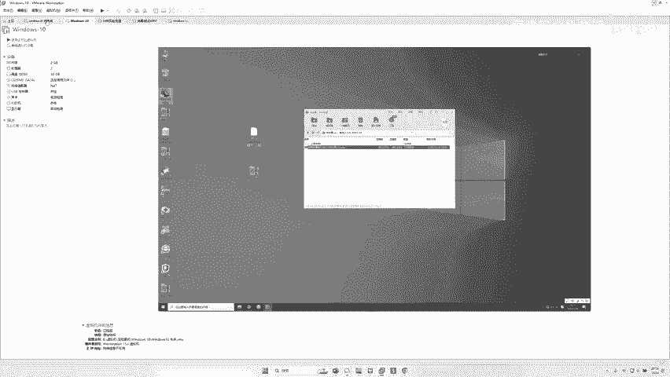

啊，我来看一下李哥来瞅一下这个win11是多少。

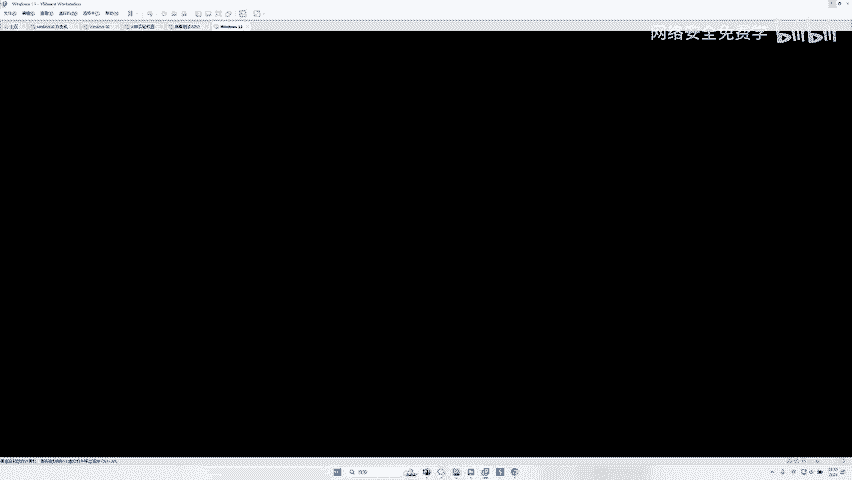

来看一下我们这个当前的这个IP地址啊。好，当然如果说你是自己的，刚刚李哥李哥已经讲过了，对不对？你可以访问127。0。0。1，对吧？3。102，我就直接访问对吧？3。102好。

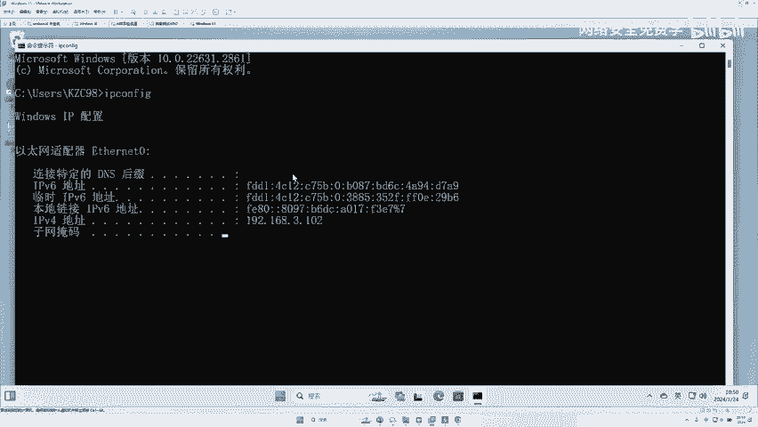

来，我们把这个都准备好，对不对？准备好之后，我们就开始进行测试了。好，你看到这块会进入到我们的大米的一个Cmo。好，进到这里之后呢，兄弟们第一步先干嘛，你要买东西，对不对？我们要在这个大米里面买手机啊。

这里有一个手机是不是有手机啊，我们这里有个大米手机，我们点一下啊它会进入到它的购买界面啊，那么你在购买之前啊是不是能购买了，对不对？啊，在购买之前，兄弟们一定要注册一下好吧啊，注册一下啊。

因为你不注册是没有办法购买的啊，我们先注册一步啊，当然现在的这个系统是虚拟的，我们的靶场，对不对？你可以随便玩啊，啊，这个用户名我们随便写个东西啊，叫百里啊，密码呢啊随便写一下，这个注册一个网站啊。

这个流程就可以了。😊，好，然后呢email就可以随便写啊。😊，好，点击确定注册啊，我们让他注册一波啊。好，注册成功请登录啊，然我们返回上一页，对不对？啊？点击这个什么登录啊。

这个我相信兄弟们应该都会吧啊。好，然后你就拿你注册的这个名字啊，账号。😊，啊，输入这个校验码。70632好，点击登录啊。好，登录进去之后，我们才能够买东西，对不对啊？否则的话，你说你没有登录，你买东西。

他这个网站不让买啊。好，然后我们再点击这个网站首页啊。那接下来我们就给大家进行真正的购物了哈。首先我们是不是选这里有很多产产品，对吧？这里因为是假的对吧？大米测试品，大米手机测试产品。好。

假如说你通过浏览，你发现了一块iphone手机，哎，我们点击一下这个什么大米的手机啊，比如说这个是iphone啊，假如说啊你就把它当成iphone啊，这里兄弟们往来看往下看啊。😊，来，往这里看啊。

来这里是不是这个订单信息啊，你看你现在是不是要点击立即购买或者加入购物车。好，我们可以点击这个立即购买啊。这里你看你在购买的页面里面是能选哪些东西啊，是不是能选？😊，数量。啊，另买两件两个东西。

四个东西。啊，一个东西对不对？好，那么在这个页页面里面还包含了这个东西的价格，对不对？5400块啊，我们买一个，当然我们普通人不能去改这个540对不对？你能把这个价格改了吗？现在直接改改不了，对吧？

但是要记住BP就可以就可以改，对吧？好，这里面还包含了什么？包含它的颜色。型号件数对不对？啊，量数啊，你们知不知道去年有一个漏洞比较火啊，一个漏洞给几千块叫做锁库存，你们能听过吗？锁库存。

啊我跟你说也多了，你们知道就是说这个锁库头当时在去年的京东上是不是有啊，这个京东我们买东西的时候啊，它是不是上面会显示这个东西还有几件啊啊，还有什么啊50件啊，一件。😊，对不对啊，哎还记得不啊。

他们干嘛呢？就是。制造大量的这种购物车，然后不买把这个库存给你锁住，然后这里就提示没有了，但是他又不付款，把这个库存给你锁住了，这也算个漏洞啊，这也算个漏洞。是不是感觉很奇葩，这他妈都算个漏洞啊。

我我我我把手东西加入购物车，我不买对吧？然然后把库存锁住了啊。😊，好了，我们接着来接着来整好吧，接着接着来整啊，这里给大家扯了一个提外哈。好吧，你看现在这里是不是问题来了啊。

我们现在是不是要点击这个立即购买了？哎，点击这个立即购买的时候，对不对？是不是就会传产生一个数据啊，然后就会到一个确认确认订单的页面，对不对？好，那这个时候怎么办？😊，我们把我们的BP打开啊。

我们说BP是女朋友，对不对？好，要把你不是要要点击什么，要点击这个拦截。啊，现在的拦截是关闭状态，我们把这个拦截开启。那么我们点击那个购买啊，那个数据包就会跑到这个BP里面去了，对不对？拦截啊。

一定要把它开开。哎，开开之后，兄弟们往这里看啊，这一块它就什么变蓝了啊，变成蓝色的啊，变颜色了，是不就开开了好，开了之后啊。😊，好，好，然后我点击看好了，我点击这个什么立即购买。好，点完之后。

这个数据常用数据包就会跑到这个BP里面去啊，被拦截下来。来，兄弟们来试一下，点一下数据购买来看一下这个数据包是不是就被拦截下来了。哈。那么有人说了李哥这个字太小，我看不见，是不是好，没有关系啊。

李哥啊稍微的给大家放大一些啊。😊，啊，好，把这个字呢放成啊32号啊，哎，这个应该兄弟们应该能能看见了。好，那么兄弟们接着往上看啊，那么现在拦截的这个数据包就是什么？你看这个网站大家往这里看啊。

这一块现在是不是在转圈圈啊，他一直不会到那个购物车那个页面，确认订单的页面。为什么？因为这个数据包现在已经被他拦截了啊，只要我们点了这个放行啊，他才会通过，对吧？现在我们就都有女朋友把你拦下来了。

你要买呀他在不买啊，他现现在不去啊，看你女朋友怎么去啊，什么时候去，咱一样嘛，这个数据包已经被这个工具拦了啊，他现在发不过去啊，不会生成那个页面那么这个订单里面我们看一下这是那个数据。😊，啊。

这里面就包含什么东西，我们把它复制一下，带兄弟解读一下啊。好，这里面你们来说一下你们都认识什么东西。好，有说这些东西不认识啊。如果说你在网站里面发现了有百分号开头的东西啊，你把它选中一下啊。

用这个URL抵code一下。😊，啊，因为它是UR编码，对不对？来我现在编码回来了。来，我们来看一下这里面包含什么东西。首先。😊，ID70name大米手机C。QTY1P5400。G题Y灰色。兄弟们。

所以说这里面我们哪个能改？QTY你猜是什么意思？你猜猜你猜猜这个什么意思？QTY我也不知道啥意思，这个不是个英语单词啊，它是一个啊也就说QTY是什么数量啊，没错，哎没错，哎，就是猜现在就是猜啊。

QTY应该是什么数量。那如果说我们把它能改吗？如果说改成两件，那么你生成的订单就是2乘以5400，应该就是1万块钱，对不对？好，那兄弟们，那这里怎么改？😊，啊，那这里是什么piece对不对？好。

这里是什么peace是什么价格的意思。好，那价格是多少？5400元。对不对？好，那如果说我把这个5400元改成1亿元。那我生成的订单就是1元喽。对吗？啊，我说那订单是不是有1元呢？来。

我们把它改成1元试试，对不对？你看我先把它改一下，好吧，我们在这里改啊Q piece是5400，对不对？我们把P改成1块钱，然后再去放行来放行。然后你再等你再看这个页面，这个页面等一会儿。

你看就进入到一个什么订单确认的页面了啊。😊，来，我们等一下他啊。啊，他转的比较慢啊。🤧。好，他转了半天，你看到没？这一块又被拦截了，对不对啊？这个登录机没有拦截，我们接着点击什么放行。哎，放行完了之后。

兄弟们来往这里看合计多少。😊，1块钱。哎，一言。一改兄弟们，那就改了。是不是我们改了，把它改上，然后生成了这个什么这个确认订单的这个页面啊，这里就会写到数量是一，单价是一，小计是一啊，然后你提交订单。

这里是装一块。好，那么再提交一块，那么这一步在哪里做了修改？兄弟们，有人说这个后台能发现吗？能发现啊，能发现啊。好，兄弟们，我们一定要理解这个，我们要知道它改是非常简单，我们一定要知道它背后的逻辑。

对不对？这个逻辑刚才已经李哥在这个。😊，课件里面给大家讲过，对不对？我在这里再什么重复一遍啊。好，其实就是什么意思啊？就比如说你要测这个得物，对不对？得物，其实跟它是一个道理，对不对？我们点击立即购买。

它也会产生一个数据包，这个数据包里面就包含了这个这个价格啊，件数，对不对？如果说这个网站比较复杂，还包含一些其他的东西，对不对？我们要对里面的数据进行修改，修改完了之后，它就会生成一个这样的界面啊。

你看像我们刚才这里是5000多，这一块就变成一了，是不是就跟它一样，我们是在哪里点的抓包，是不是在这一步在确认订单的时候，选全品的时候。😊，啊。装的包，然后改了里面的内容啊。那如果说这一块改了不行。

我们还可以在什么支付的时候再去改一遍啊，所以它是能改两次的啊，你看哪一次可以对不对啊？从在没有战歌了啊，因为我觉得这这个没有什么要占的哈。好，那么兄弟们啊，那这个漏洞叫什么漏洞。哎。

就叫我们那什么兄弟们叫好了，叫什么给大家答出来啊，叫什么任意金额。😊，任意。金额修改。对不对？任意金额修改漏洞。那么关于这个漏洞的具体的方法啊，李哥已经给兄弟们写成了一个什么wordPPT了。

这个也可以发给大家，对不对？好，就是他具体的操作流程啊，在这一块已经给你写了啊，先抓包，对不对？好，然后怎么怎么888。好，那么这个任意金额修改漏洞，完了之后我们再看一个漏洞，叫什么漏洞，叫做复数。

购买。哎，什么叫负数购买漏洞？来啊，我们往这里看啊。先给大家讲个案例，对不对？好，你说呢这也是乌云一个案例，对吧？你看在这个他买一个鼠标的时候啊，他买这个什么逻技的一个鼠标跟音箱的时候，对不对？

本身你看把这个数量。

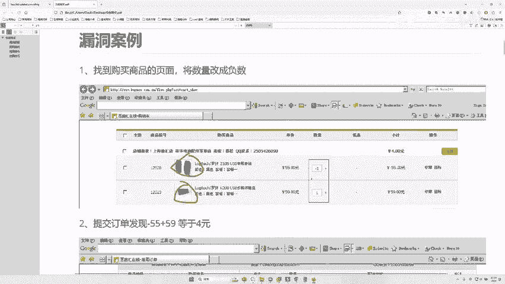

你们往这里看啊。

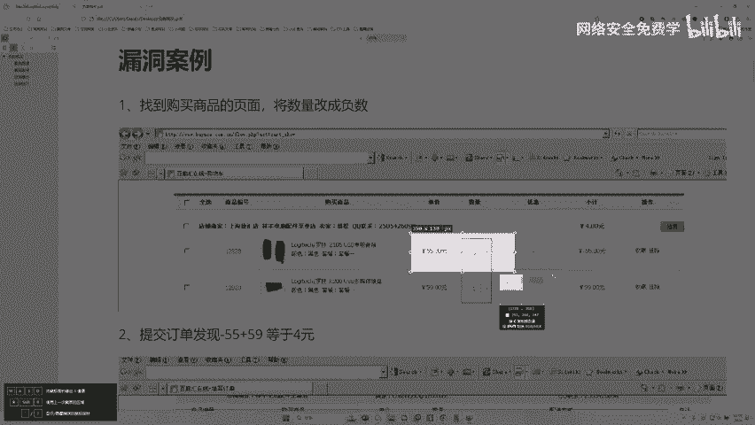

啊，把这个价格对不对？5500元，55555块钱一件就是55。来，我把这个件数改成-1了，它变成了-55，那-55加多少59就是4块钱啊，对不对？-55加59就4块钱，然后就会生成一个什么4元的订单。

然后购买了，对不对？也其实意思就是说我们在购买东西的时候。啊，你看一下他。像这个也是一样的负数购买对吧？负数购买买逻辑的鼠标，或者说你看买那个什么30块钱一个月的一些啊虚拟产品啊。

就是他也把他这个件数啊改成了负数了，那么改成负数变成了-30元啊，你知道之前还遇到一个奇葩的东西不就是说哎这个订单最后变成了-30元，然后往你的卡里还能充30元，往你的余额里面都充了30元，对吧？

之前爆发过一个这样的漏洞，对不对？就说这个当这个订单成负数之后啊，订单最后生成是-10块钱，然后你点击立即购买购买不仅购买完成了，对不对？然后你的卡的余额里面啊，就他的那个余额里面还多了10块钱，哎呀。

反向给你充一充个钱，越买钱越多是吧？真的很搞笑，这个都是真实的事情啊，之前爆发了这样的漏洞啊，好，那么兄弟们那么这个负数购买怎么去购买呢啊，一样的。来，我们兄弟我们来试一下，对不对？😊，好。

我们开启拦截啊。好，我们打开什么？打开这个包啊，重新购买一下啊。好，我们同样在这里先目前是购买一个产产品，对不对？好，我们开启拦截，点击立即购买好，它会抓到包抓到包。兄弟们在这个QTY这一块啊。

我们将它改成什么-1。😊，-一啊，件数是-一或者价格是-一，你随便改，对不对？件数跟价格啊，你可以改一个。比如说件数是-一，那么价格乘件数应该就是-5400，对不对？好，我们点击放行。好。好。

他立应该过一会儿就会生成一个什么订单信息，好吧。也人说现在还有吗？现在也有类似漏洞，只不过挖起来没有这么简单啊，它的数据包的字段比较多，它的认证也比较多啊。那么因为大家是初学者，不能讲特别难嘛啊。

对不对？我们。学认你就是你在哪里学这个漏洞，学像我，比如说你要学这个支后漏洞，你在全中国，不管在谁那里学，你刚开始第一次学，对不对？你都跟我讲的是一样的，对吧？你看这块兄弟们往这里看数量是-1。

单价是5400，-1乘5400多少？小G-5400，那么这里写提交订单是多少？-5400，好家伙成了-5400了，然后我们在这里选择什么，选择你的姓名哎，手机号？哎，选择你的区域，对不对？好。

选择你的产品地址啊，然后就可以去提交这个订单了，对不对？兄弟们。好，我刚才说了，这是第一步，对不对？我们在提交订单的时候，我们同样也可以对它去开启抓包拦截啊，那么这一块同样也能抓到什么。

抓到它的价格的相关信息啊，这里面是一是提交啊，向那个支付支付请求的接口。我们在这里面也是可以进行修改的好，来，我们来把这里面的代码先解出来，看一下啊，所以兄弟们要记住啊，这两两个地方都能改，好吧，好。

我把它复制一下啊，先把它解码一下啊。😊，来，你看这里有什么，有你的大米手机，对不对？灰色负一。-5400对不对？兄弟们，来往这里看，你看是不是也同样有你的建树。啊，有的里面可能还会有金额啊，比如340。

这里面也没有，对不对？你看啊，还有什么你的呃呃这个邮寄的地址，对不对？那我们在这里改行不行啊，改成-2行不行啊，可以啊，那么你实际支付就变成-2了。😊，兄弟们，有人说这这题目不是突破手机验证码。

不是是那个老师写错了，我们是什么？我们是讲的是支付漏洞啊，之前给他的时候，他写错了啊，那打错了，好吧，兄弟们往这里看，所以这个这个能理解没有？这个包是什么包，是不是我们再去点击这个什么？😊，啊。

点击这个提交订单的时候，我们还能抓到一个数据包。提交订单的数据包里面就包这里面就包含了什么，包含了你的价格，也包含你的个数，你还可以再去修改，对不对？这两边有什么区有什么区别啊，没有任何区别。

因为有些对于有些呃网站来说，或者某些那个。开发人员来说对不对？就是你不知道他在哪一块存在漏洞啊，他有可能你在这一步修改成功了，你也有可能在这一步修改成功了，就是两个地方你都要去测一遍。

看哪里可能存在漏洞啊。如果你在这里试一试没成功啊，但是你在地即支付的时候就改了。哎，发现又成功了。🤧对不对？那你是不是又找到漏洞了啊，就类似于。😊，我们找这种挖掘这种漏洞的时候有两个地方嘛啊。

你要就去测一下，对吧？有些网站可能不会用这种pos传输，会用一些jason，用一些API的接口，对不对啊，那那个时候。我们就。就要想其他办法啊，可能从API接口调一些数据过来，然后再做修改。好吧啊。

兄弟们，哎，这个能听懂没有？听懂没有？听懂给李哥扣一波一啊，扣一波6好吧，今天是我们讲到什么，讲的是我们的这个支付漏洞好吗？啊，支付漏洞O吗？好，那我刚刚李哥说了，关于这个支付漏洞，对不对？

我们还有一些，比如说多次购买无限刷优惠券，那么这些刷优惠券到底是什么APIAPI你现在不用管，对不对啊，你先不太懂，先说说多了，对吧？什么多次购买无限刷券并发漏洞，比人说李哥这些我去哪里学啊。

那么李哥可以啊，给大家看看啊，因为我我就问你们，你们需要吗？你们如果需要我可以免费给到你们啊，这些东西当免费，但是你向我保证一件事情不要透漏给别人好吗啊，不要都网上乱传播好吗？😊，好。

我可以把我写的我整理的一些啊文档给到大家，好吧啊，比如说无限刷优惠漏洞啊，它的一个原理。对，比如说啊我们去买什么去充这个什么充这个啊微信的一些VIP的时候啊，可以用这种东西，哎，我挖这个东西。

或者说哎运费修改啊，这个东西就是我去年挖的一个漏洞，对不对？我大家大家看一下，好吧。好，给你们正儿八经看一下哈，这是个什么网站啊，我给你说一下他的网站啊，它是网易严选啊。😊，来给大家看看这王页还在不啊。

网易一样。啊，给以看一个真实的案例啊，网易。好，就这个啊，就这个网易延选这个网站，兄弟们往这里看啊。好，网易言选先吧，网易眼，这是个真真正卖的鬼网站啊，是我去年挖了一个洞啊。😊，啊。

这是这个网这个网站里面啊，这里面是不是能买东西啊？正儿八经的购物网站啊，对不对啊啊网能不买网站能买东西啊，买牛奶啥的。好，我们在我买了一个对被子，对不对？这个被子是多选？兄弟们啊，往里看被子是11。

9块，对不对？11。9块。好，但是呢这一块需要我一个邮费是多少？邮费是8块钱啊，这个兄弟们能看到吗？😊，哦哦哦哦哎这邮费是8块钱，对不对？😊，好，那么这个优惠活动是2，所以说算下来我应该花20多块钱。

对吧？好，但是这块兄弟们，我们把这个抓取数据包修改运费间额，这块叫。FREIGATPRSE这个叫运费金额啊，本来这一块是8，我把它改成了甲，改成了0，也就是说不要运费了。然后我拿到一个订单。

兄弟们往这里看，运费没有了。啊，运费直接没有了。啊，给他截图没见吧，往这里看。Ki。运费变成零了。啊，刚刚上一步是多少？8，我是不是改了个包，那么这11款东西作为核算多少啊，就10块钱，少了8块钱。

OK那么这个漏洞给多少钱啊，几千块钱吧啊。就是一个什么。它一样的啊一样也是一个什么金额修改啊，不过这一块修改的什么修改的是什么运费啊，你修改运费，运个价格价格你头修改优惠券，对不对？一样的，对不对？

比如说还有一些优惠券的东西啊，我看有没有优惠券啊。😊，哦，这里才没写啊。啊，优惠券修改对不对啊，这优惠券上面有的时候能无限领券，知道吧？一张券妈的能领很多，对吧？啊，我可以把这些报告给到大家。

大家概去看看，好吧，我可以整理一下啊，兄生兄弟们需要这些东西吧，需要的话扣波6，好吧，我下播之后给到给到你们，好吧。😊，好吧，这是我们支付漏洞，支付动大家可以去看看这个报告里面写的相关东西，对不对啊。

免费给到你们啊，然后你们去学学好吧。好，那么李哥能帮大家就这些了啊。好。😊，这玩意难道随改变吗？用API的话也没法改了吧。呃，API只是调接口，调数据的话，对吧？只是往回传数据的啊，往回传数据的。

有的时候他用API的话，可以试试啊，就是说这种支付漏洞其实是没有你们想的那么好啊。就是它就是说像一些大平台肯定没有啊。但是我们实际的想要求有些地方啊，我给你说一下，就因为我们公司这些内网中啊。

内网的那种生日系统中就有支付漏洞啊，也就说后台能发现嘛，可以发现啊，在这里给大家说一下，这个如果说你发现了。😊。

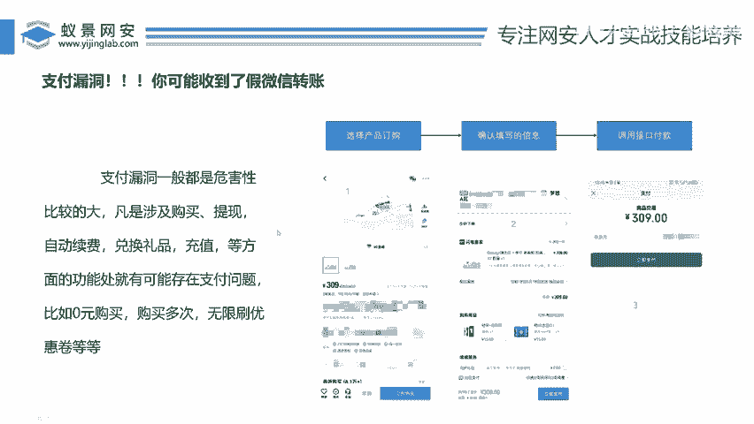

啊，发现了这样的。