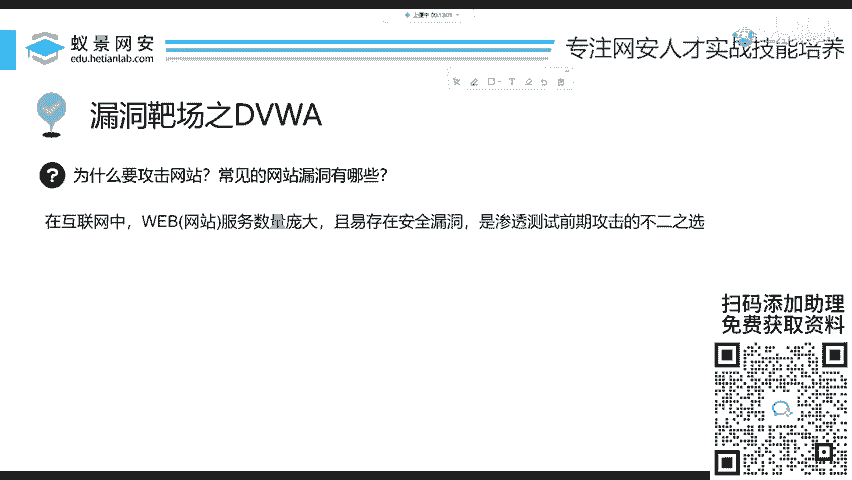
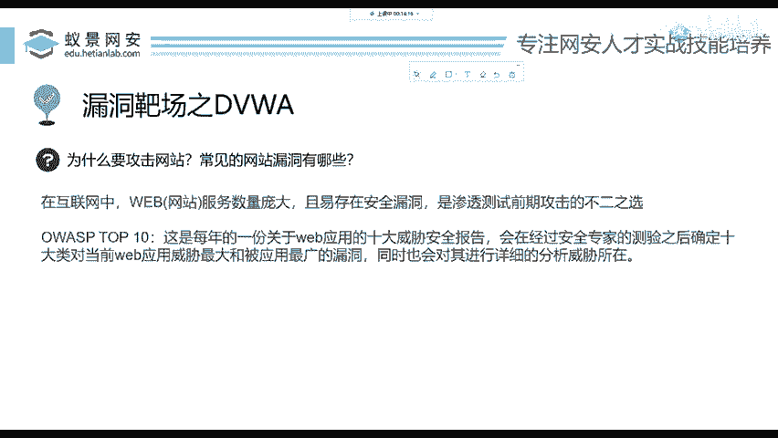
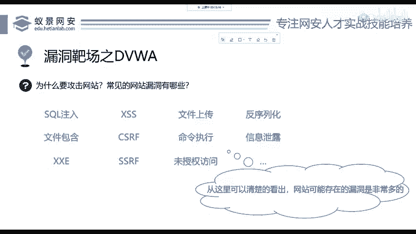
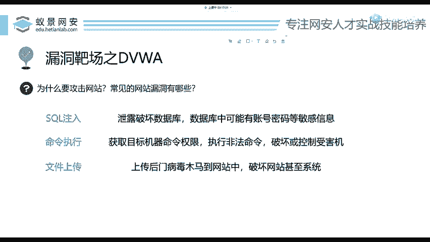
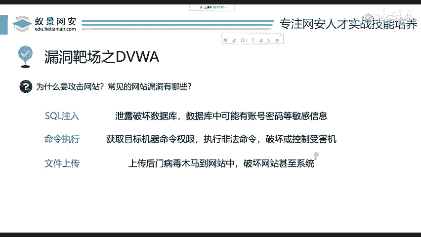

# 2024B站最值得看的黑客教程 ｜ 网络安全／渗透测试／内网渗透／漏洞挖掘／web安全／kali linux／红队靶场／CTF／信息安全 - P59：常见的网站漏洞有哪些？ - 网络安全免费学 - BV1uBsTetEow

那今天呢我主要给大家讲解就是常见的网站漏洞有哪些？在渗透测试的时候，我们为什么要主要攻击网站漏洞，以及从零基础到搭建一个漏洞的靶场，有多么的简单啊，有多少步骤，我来一一给大家演示。

第三点呢是我们学习一个web最典型也是最常见在渗透测试中最为重要的漏洞，叫做命令执行。大家可能听说过一个漏洞叫做RCE啊，CE漏洞呢，就是命令执行。

我们来讲解这种漏洞应该怎么去攻击以及开发人员应该如何去防御这些漏洞啊。我们开始进入到今天的课程。首先给大家讲解为什么要攻击网站。啊，没有看到网址吧，没有看到网址的话，一会儿让班主任发一下，好吧。

就是3W。

和天la点com。首先我们为什么要攻击网站？因为在互联网中，网站的数量非常的庞大，大到捐政企业小到每个小公司个人网站，甚至呢一个小学它都有自己的网站。所以说呢在整个的互联网中。

它的一个资产面是最为广泛的。那它多就代表肯定有漏洞。就像之前有黑客啊经常去攻击windows机器，他为什么不去攻击像苹果电脑呢？我们都知道苹果好像看似很安全。

其实并不是因为苹果的用户相对于windows来说要少一些。而这些黑客呢它肯定去找这些数量庞大的用户去攻击。所以说网站的漏洞就是渗透测试前期攻击的不二之选。那下面呢我们在学习网网站漏洞。

你要知道一个东西叫做OW。

6ISP这样一个组织这个组织呢在每年都会公布一个外b，就是网站漏洞的十大威胁安全报告。当然呢它是每三年进行公开一次，而平常呢它是不公开的那这个漏洞报告中呢，是包含了当年在整个互联网中。

暴露出最多的漏洞，一个排行榜，相当于我给大家看一下2021年这个组织爆出来的这些漏洞，可以看到这是英文的，可能看不懂。没关系，下面呢我就给大家讲在网站中，一个网站可能会存在哪些漏洞。我们简单看一下。

这是我列举出来的。比如说像搜Q注入文件包含文件上传命令执行等等。这些呢如果你是一个完全的外行人，你看起来好像都是新的名词，完全不知道是怎么怎么回事。那你千万不要急一步一个脚印，我们来分别探讨一下。

但是从这些漏洞的类型，我们会清楚的发现，网站可能存在的漏洞是非常多的那其他的东西啊，它不好打。我们不论做什么事情都要剪软式的训列。所以网站啊是我们最好。

好拿捏的东西。我们来看一下，那本周呢是我从中挑选出三个比较容易基础，并且呢对我们渗透测试，做内网非常重要的三个漏洞，分别是scle注入命令执型文件上传这三个漏洞。我先用简单的语言给大家概括一下。首先。

搜Q注入搜Q注入呢是针对于数据库的漏洞，数据库里面保存了什么？大家想一下，在你注册用户，你的账户名、你的密码，包括你在百度搜索的时候，搜索出的结果，它都是存储在数据库中的。那搜Q注入呢。

它就是能够破坏数据库。大家都知道有一个语言叫做删库跑路。删库指的就是把别人的搜Q数据库给删掉了。那我们后面呢会放在明天的课程中来讲这个搜Q注入。第二个漏洞叫命令执行，命令执行就是字面意思。

我们获取到目标用户，就是目标机器，受害者机器的一个执行命令的权限。我都能执行命令了，我还能打不了你吗？你想是吧？我可以给它关机，我可以把它整个的网站都给它删除，这是命令执行流动，我们看它的危害。

你就知道它的影响还是非常大的。第三个叫做文件上传，这个更好理解，就像大家呢在使用网站的时候，经常会遇到一些上传操作操作。比如说上传头像，上传附件等等。这个时候有没有。有想过我不去上传一个头像。

我去上传一个木马病毒，可不可以呢？如果他的后台工作人员就是写这些脚本的开发者，没有进行安全考虑的话，就有可能会造成这种漏洞啊，这是三个漏洞的简单概括，如果在课程中，你有任何听不懂的地方。

可以随时在讨论区提问啊。我是能看到的这是一个直播，并且是有录播啊。我们下课之后录播的地方也在腾讯课堂的同一个链接。

那今。

