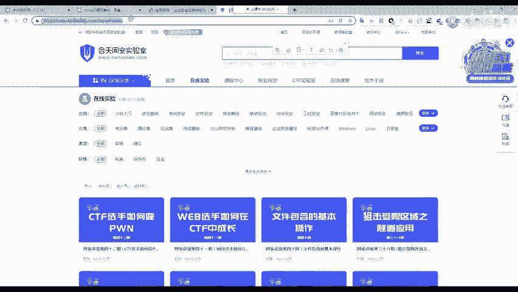
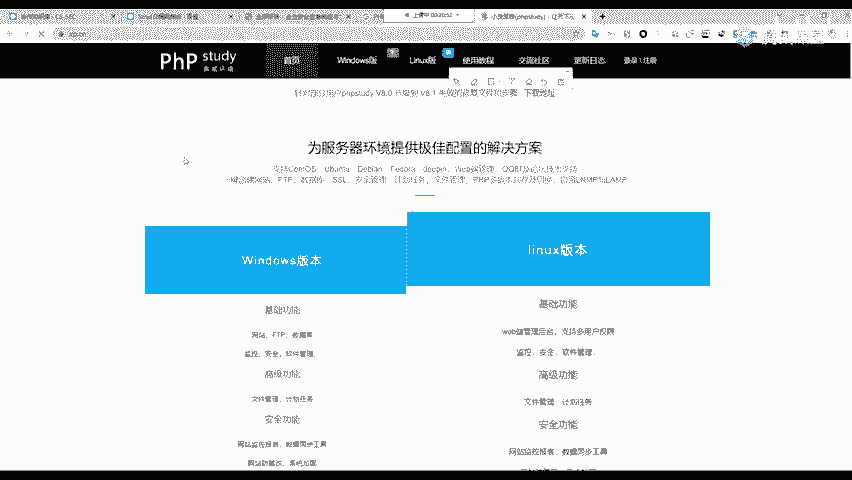
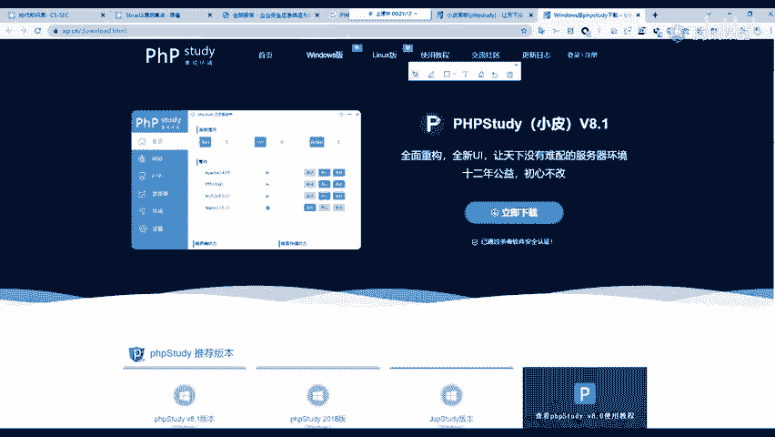
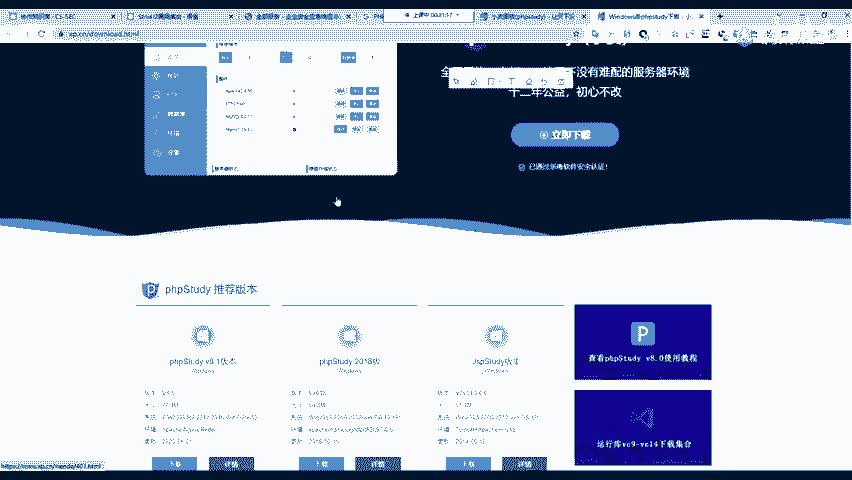
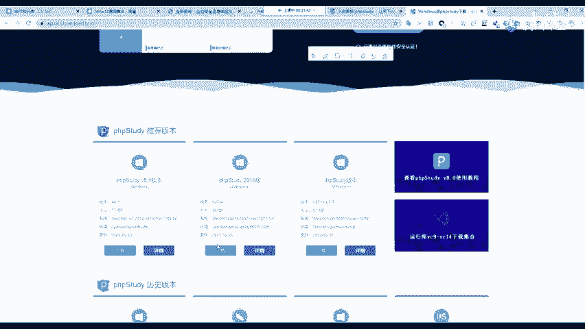
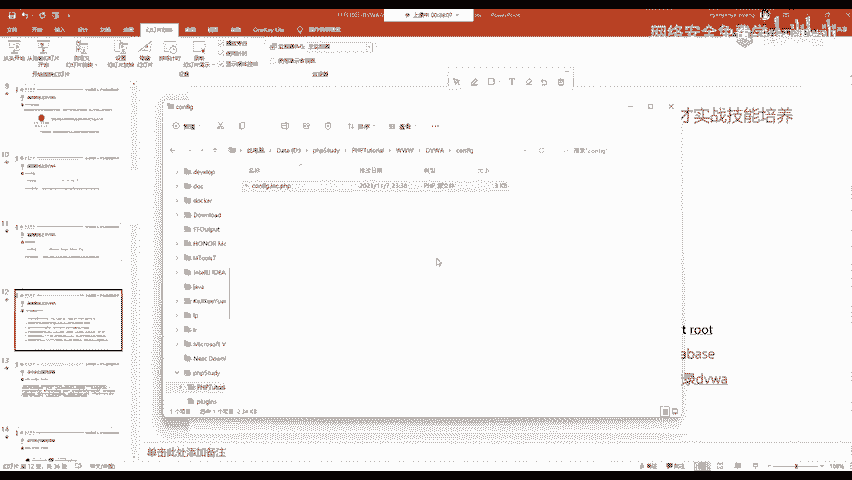
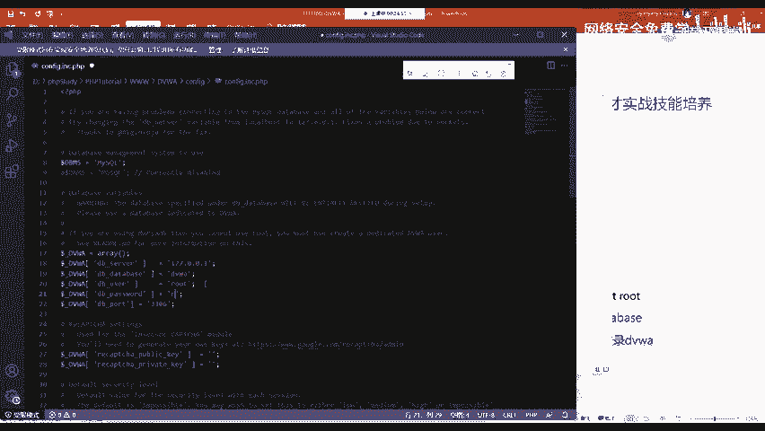
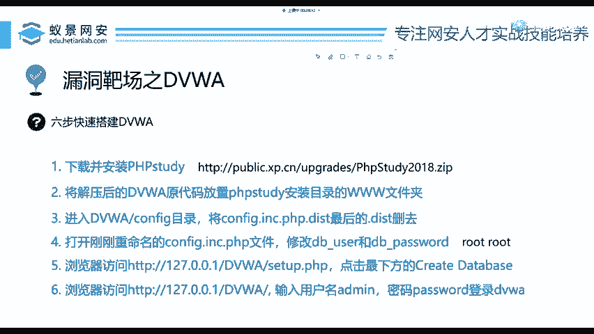

# 2024B站最值得看的黑客教程 ｜ 网络安全／渗透测试／内网渗透／漏洞挖掘／web安全／kali linux／红队靶场／CTF／信息安全 - P60：DVWA靶场搭建 - 网络安全免费学 - BV1uBsTetEow

今天呢我们首先先来讲靶场的搭建。这里我们选用的是一个非常基础，而且基于PHP的一个漏洞靶场叫做DVWADVWA就是刚刚我们讲过的OWSP这个组织编写的一个漏洞靶场。

那这个网站呢是包含了各种网站常见的漏洞，可以学习攻击以及修复方式。那有同学呢可能会问，为什么老师不去攻击真实的网站。这里还是提醒大家一下，那恶意攻击互联网网站以及操作系统是属于犯罪行为。

大家千万不要没有经过授权就去攻击我们国内的各种网站啊，大家千万要注意。那所以说呢一个好的靶场是我们黑客以及网络安全从业者最方便和安全的磨刀石，你千万不要看不起靶场啊？也千万不要看不起DVWA不然的话。

为什么别人学安全用DVWA不用你。的靶场呢是吧？所以说它还是很有用的，我们要耐心的学习它。下面我们来看怎么搭建它。对于一个完全的不会计算机的人，只需要下载两个东西就行。第一个是PHP环境。

我把它简称为WIMP。第二个就是DVWI下载的源代码，就是这些代码脚本，不要你自己去写，它已经给你提提供好了。你可以到百度中搜索DVWI或访问老师PPT中提供的这个链接，就可以去下载它。

那这个WIMP啊，有同学可能不理解大家看好PPT这个WIMP的全称叫做windows阿帕奇、myciqcle和PHP它是什么意思呢？首先windows就是我们使用的操作系统是微软的windows。

阿帕奇它是阿帕奇基金会所出所产出的一个中间件，它的作用呢就是用于搭建网站以及。响应我们的请求和处理我们的请求信息啊，就是这样一个阿帕奇。然后myqclemyqcle就是我们的数据库，应该有声音吧。

大家应该能听到吧。有声音吧。然后PHP呢？顾名思义就是运行PHP脚本的这样一个解析环境。我们把它哎这个WIMP怎么下载呢？我们选用在学习PHP中一个非常好的环境，叫做PHP study啊。

大家如果有学习过PP应该都听说过。那如果你没学过，没关系，我们现在就来讲它。首先呢我们要去下载和安装PHP study这个东西怎么去下载。我们可以比如说我去打开百度，好吧，就打开百度。在百度里面。

我们可以直接搜索PHP study啊，进入到第一个网站，一般就是在这个地方呢，我们进入官网之后，选择windows版本的PHP study客户端。然后在下面这里有几个版本。第一个叫做小皮面板。

这个面板呢可能对于初学者来说不是过于友好，就是它使用起来可能比较复杂。如果你想跟老师保持一致的话，你可以下载后面的这样一个PHP study2018的版本。我们直接点击下载它。

下载之后是一个压缩包解压之后直接双击安装，选择自己想要安装的目录路径磁盘就可以自动安装了。安装的过程跟我们平常安装其他软件是一模一样的。我在这里不会给大家演示。因为我相信啊每一位同学肯定。

都会安装一个软件。而我们下面呢来看在安装好之后应该做什么事情。第一步，你要下载这个源代码，下载之后啊，它也是个压缩包，下载之后的源代码放置在你PHPstar安装目录的3W文件夹下。

你现在不知道我先不讲理论啊，我给大家实际操作，比如说我打开我的PHB study默认的PHPstar是安装在D盘下面的PHPstar目录，我点开它，然后点击第一个PHP开头的。

就是PHBstar的安装目录，里面有一个三个大写的W这个文件夹。我们下载之后啊，把这个DVWI的这个压缩包拖进来拖进来，然后在当前位置解压就可以。解压到当前文件夹。

OK那这个时候呢我们就已经把DVWI这样一个网站给部署好了。在这里呢，你可以对它进行更名。比如说我把这后面的master给它去掉，你可以根据自己的实际情况更改其他的名称是无所谓的。

然后我们回车在更改完成之后，我们下面要做一件事情，就是对DVWI进行设置，怎么设置呢？大家看好操作，一会儿啊再给大家回顾PPT我们进入到DVWI的这样一个目录中，里面有一个confi目录。

confi的意思就叫做设置配置的英文，就是configure我们进入它会发现里面有一个小文件，它是以DIST结尾的。我们现在要做的第一件事情就是给它重命名。把后面的这个DIST啊给它去掉。

然后把它重命名一下。重命名之后啊，就是一个PHP脚本文件。有同学说啊，我不会PHP这个世界上最好的语言啊，这个不会怎么办？没关系啊，我们现在只需要默认的去打开它啊，默认的去打开它。

如果你没有和老师一样的环境的话，你这里可以使用记事本打开，就是电脑上自带的那个文本记事本去打开就行。打开之后，我们往下面看，这里面有两个非常重要的配置，一个叫做Dbuser。

一个叫做DB passwordword给大家翻译一下DB叫做daabb就是数据库user用户就是数据库的用户和数据库的密码。这里我们要改成什么呢？如果你和老师一样。

是下载的PHP study那在PHP study中，它的一个默认用户和密码都是root就是ROOT啊，我们可以把。

这里改一下，改成ROOT，然后它的密码呢也是ROOT啊，我们改好改好之后，我们现在你这个DVW啊就已经完全配置好了。我们下面做的一件事情就是打开你刚刚的PHP study双击就可以运行。

双击PHP study然后点击这里的启动啊启动。

启动之后，我们就可以打开浏览器，任意一个浏览器，访问127。0。0。1。这个意思叫做本地的回还地址，就是你自己我访问我自己，就是这个意思。访问之后，如果出现hello word代表成功。

那怎么打开DVWI呢，在后面跟上一个斜杠，在后面呢跟上你这个3W下DVWI这个目录的名字，我这里是DVWI如果大家呢重命名称。比如说张三，那你这里就写张三，我这里是DVWI。就写上去回车。回车之后啊。

我们下面呢就可以来到啊这样一个网站中，就可以来到这样一个网站中。来到这个网站中之后，我们第一个你所遇到的地方就是会来到这样一个set up这样一个页面中，来到它之后啊，我们要划到整个网站的最后。

有个叫做create reset database。它的意思呢叫做创建数据库，就创建数据库。这里大家也不要去学习数据库。因为创建数据库，你只要一点就行。我们大胆的点下去，啊，这个数据库就已经创建完成。

下面DVWI就可以使用了，这个是有回放的啊，是有回放的。这个是有回放的那怎么去使用它呢？第一步。大家稍等一下，我清除一下这个网站的缓存。在创建完数据库之后，你现在就进入了DVWI的登录页面。

DVWI默认的用户名是addmin，就是管理员的意思。默认的密码是password就是PISSWORD然后我们点击登录就可以进入到DVWI那是有录过的啊，是有录过的。

OK那这个地方我们来回顾一下PPT这个PPT我已经写的非常清楚了。就是首先解压，然后进入到confi目录，把这个点DIST删除重命名。然后去编辑这个PHP文件，修改用户名和密码。

分别为root还有root然后进入到浏览器访问，去创建create database创建这个数据库，创建完成之后就可以去输入用户名admin passwordword登录DVWI我相信只要你会操控电脑。

看到这个之后，每一个人都能完整的把这个网站搭建起来啊。你现在不仅掌握了搭建漏洞靶场，而且还掌握了搭建PHP网站的一个技巧啊。你现在其他的PHP网站，你也可以去搭建了啊，非常的简单。

