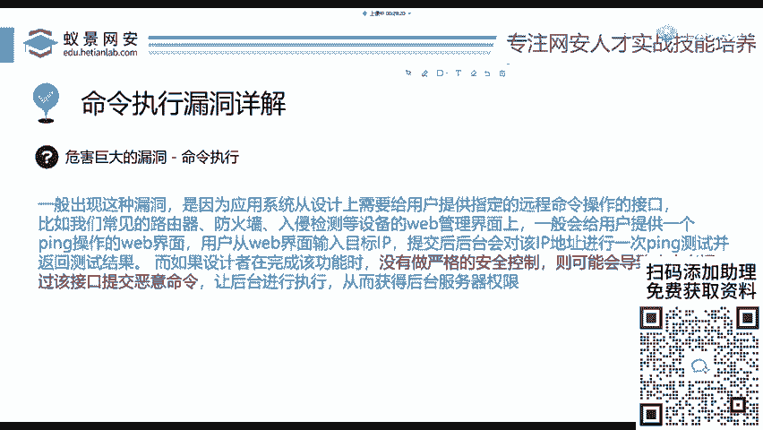
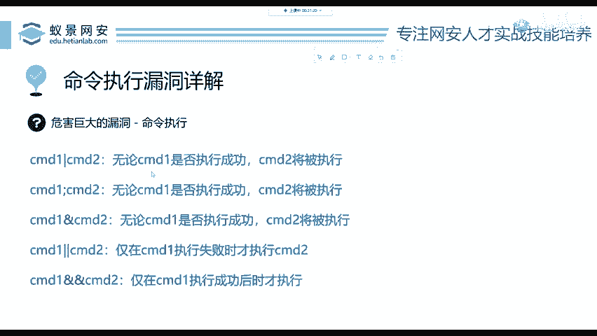
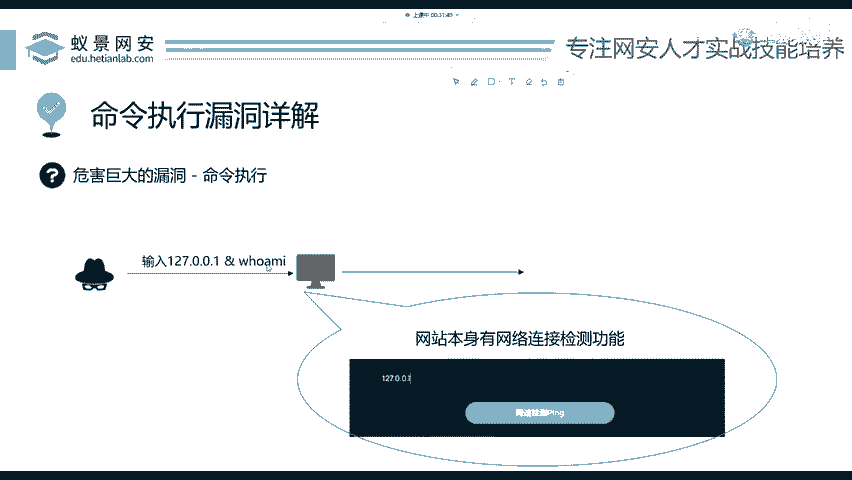
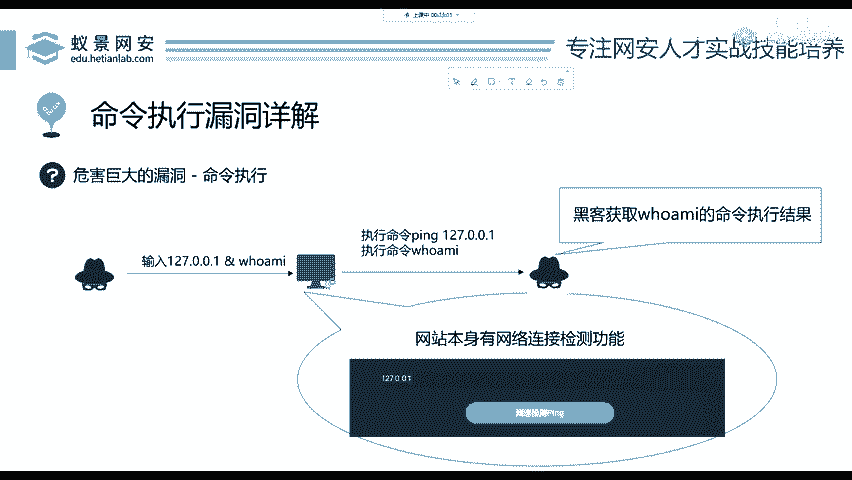

# 2024B站最值得看的黑客教程 ｜ 网络安全／渗透测试／内网渗透／漏洞挖掘／web安全／kali linux／红队靶场／CTF／信息安全 - P61：命令执行漏洞详解 - 网络安全免费学 - BV1uBsTetEow

那我们下面呢搭建好之后就来给大家讲命令执行。首先，命令执行是一个危害巨大的漏洞。为什么说它危害巨大呢？我可以把你的电脑给删了，我可以把你的网站给删了。我可以让你的电脑关机，你说危害大不大，肯定大。

那这个生产的原因是什么呢？任何漏洞的原因，都是因为开发者没有做严格的安全控制，可能会导致攻击者输入一些奇奇怪怪的东西，就输入一些漏洞攻击的一些奇怪的东西，导致这个漏洞的产生，要记住，第一个。

如果这个网站没有任何的交互，就你这个黑客，你打开这个网站，你发现它就是个图片，你任何的输入点都没有那可以说它基本上可以说就是安全的。因为我们肯定要有一个能进去的地方，是吧？那这个漏洞一般存在哪里呢？

我不给大家去读这些概念性的东西，我们往后面来看啊，往后面来看。

比如说一般的网站它会有这样一个功能，这个功能最常见于大家的家用路由器上面。比如说你的华为路由器，你的小米路由器都有这个功能，叫做网络连接检测。大家看PPT上面这张图。

这张图呢就是让你输入1个IP地址或者是一个网址去检测能否去连接它。那这个功能它实际执行了什么呢？我们来看，比如说这个黑客啊，他现在想输入127。0。0。1就我看一下能不能连通自己。

然后这个网站在收到这个指令之后，他非常乖的执行了一条命令叫做 pin127。0。0。1。如果能够聘通，就代表这个网站是能够连通的啊，这就是它原本的功能。有同学说为什么会执行聘127。0。0。1呢？

我这里并没有写聘啊，因为这个pin啊是开发者就是写代码的这些人写这个网站的人啊，他给你写好了他就是这样实现的啊，他给你写的好好的啊，OK那在这个情况下，我怎么才能攻击这个网站呢。

来看一下怎么攻建这个网站。我们首先要了解一个非常重要的东西，叫做命令连接符。命令连接符呢，我这里给出了5个，大家应该共用。首先是一个竖杠，我们叫它管道符。然后下面呢是一个分号，一个and，两个管道符。

两个and，它的意思呢我们可以从PPT中大概的了解到，如果你说看不懂啊，没关系，我们一会儿用下去你就懂了。首先呢就是它可以执行两条命令啊，对吧？我一行中我执行两条，我们下面呢来看一下它是怎么去执行的。

啊。首先。Yeah。现在这个黑客啊，它突发奇奇想，说我不输入1个IP，我输入1个127。0。0。1and符呼MI那这个and代表什么呢？我们翻到上一页的PPT给大家看这个and代表。

不论前面一条命令CMD的意思为comman就是命令，不论前面这条命令是否成功执行都会执行and符号，后面的这条命令。大家应该能听懂吧。也就是完全没技术，我相信也能听懂。

那我们来看一下。这个地方我们网站在收到用户输入的这个127。0。0。1按呼MI之后，他会做什么事情？它会执行两个东西，一个是P127。0。0。1，这是第一条指令，它原本的功能。第二个是执行呼MI。

就执行who am I是一条指令，是windows操作系统的一个命令。哎，我们的黑客啊就会得到who am I的命令执行结果，是不是就可以去攻击它。

那如果你把这个who am I这个命令换成s down。哎，这个网站啊，它这网站别人的机器啊就关掉了，就关机了，你就给它关机了啊，就是这个命令连接服务，这个and，大家如果记不住这个and应该知道吧？

就键盘上的那个7键shift加7啊，就可以输入这个and服务。

