# 2024B站最值得看的黑客教程 ｜ 网络安全／渗透测试／内网渗透／漏洞挖掘／web安全／kali linux／红队靶场／CTF／信息安全 - P62：DVWA之命令执行漏洞 - 网络安全免费学 - BV1uBsTetEow

然我们来看常见的windows指令。这windows的指令啊，其实你可以去微软的官网，你搜一下，或百度搜一下有很多。这里我给大家简单讲几个，首先最常用的。

比如who amI查看当前的用户IP configure查看网卡信息，查看IP地址呀，网关呀，子网掩码呀等等，就是IP configurefi，然后就是sut down杠S杠T0，这个叫做关机。

就是立即关机sht down就是关闭S还是st downT是time时间，零，代表0秒，就是一0秒钟等待0秒钟你就关机，那就是立刻关机的意思。然后下面一个是net user。

这个是在windows中创建一个新用户的一个命令。我们可以把这里的用户名和密码进行替换。比如说net user张三123456艾，你就可以创建一个用户名为张三密码为123456的一个新的用户。

然后下面是查看文件叫typetype的英文意思叫打印打印机的意思啊，type是打印个文件，比如说它的桌面上保存一个啊电子书，你就可以type加上它电子书的名称就可以把它读取到拿下来啊。

这是常见的CMD命令。那下面呢我们就来看在DVWI中，我们怎么去利用。嗯，DVW怎么去利用。现在我打开浏览器。打开浏览器之后啊，大家要点击这个地方叫做command injection命令注入。

意思就是命令。明致性。大家在第一次做的时候，因为DVWA它不仅讲了漏洞的利用，还讲了漏洞的防御。我们首先你第一步要做的事情就是来到这个DVWSqty就是安全安全配置，点击它把这个安全呢调为漏。

就是低安全的就是没有任何防御的，我们先把最简单的给打好，这才能一关一个关卡，一个关卡的去攻击是吧？我们先点漏，然后subit就是提交啊，再点击com injection。

在这里是不是跟老师的截图啊差不多，跟我们在路由器里面看到的这个页面啊是差不多的，就是让你去输入一个地址去拼它，我们输入一个IP地址啊，我们很乖输个IP地址先试一试嘛，是吧？先试一试。

那点击sub meet。在这边呢我们就能够看到pin它的一个结果。那这里可能出现乱码，是因为这个网站它是外国人写的这个网站的默认编码跟我们windows操作系统的编码是不同的，会造成这个乱码。

大家不要在意，你看到它执行了就行了。那下面比如说我想执行命令，who am I怎么执行。127。0。0。1。And who am I。好，点击subit。看看是不是多了一个这个命令就是什么呢？

我们可以打开CMD，我们可以打开CMD打开CMD之后，你输个户MI看就是这套命令。

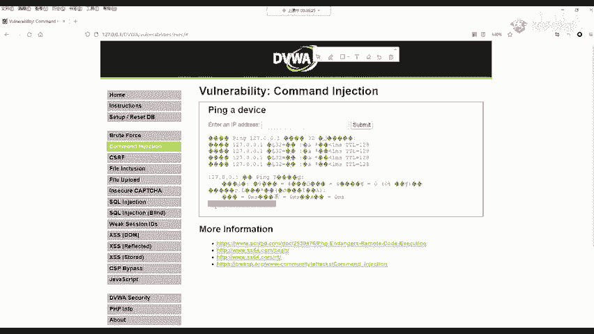

同样你可以把这个命令改成什么呢？你想改成什么改成什么。

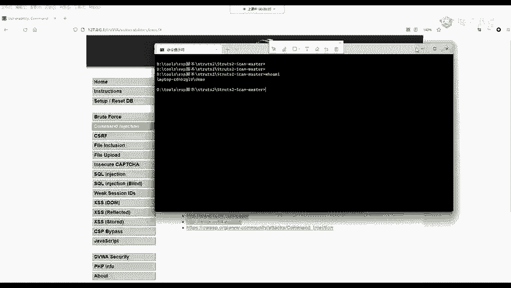

所以说按。你直接改sha down啊，可以它关机也可以。那我这关机呢我这里不会演示，因为如果关掉了，我就没办法给大家上课了，是吧？啊，大家理解一下，就是这样一个原原理，再给大家演示一个。

比如说我想查看目标的1个IP情况。点击提交。要稍等，大家看一下这边是不是出现了结果呀，这个结果是什么呢？就是你在本地的CMD中敲的这个命令。可以看到这个网站啊，它就可能去存在这个缺陷。

我们下面来看这个缺陷是如何存在的。因为知己知彼，才能百战百胜。不论是攻击者想攻击网站还是开发者想防御修补漏洞，你都要知道它到底是怎么造成的。

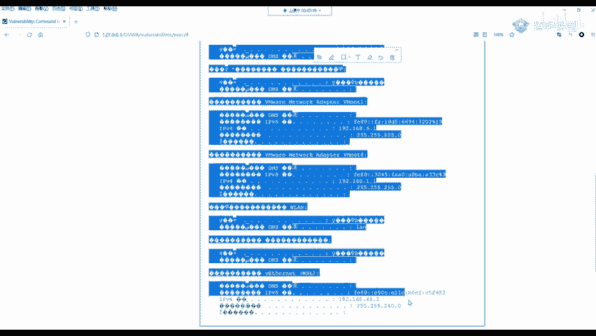

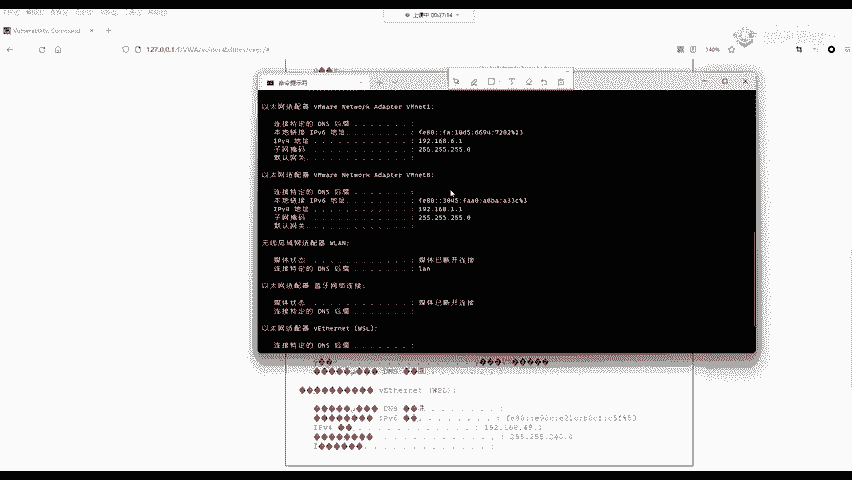

我们点击最下面有个叫做vi source，代表查看源代码，点击它就可以出现这样一个网站的源代码。大家说没学过PHP没关系，我就用最简单的英语方式给大家讲解这样一个代码到底漏洞点在哪里。好。

这个代码呢我已经提前放在了PPT上面，我们下面呢就来看一下。大家应该能听懂吧？听懂了可以给个回应，听不懂呢就可以问出哪个地方听不懂啊，可以给你再讲解一下。啊，我们来看这样一个。来看这样一个代码。

这个代码首先我们任何的语句你都不要去关注。都不要去关注我们只看这个地方IP我们输入的是什么？输入的是IP地址，是么？127。0。0。1是IP地址。

这个地方呢就是把我们输入的这个IEP就是刚刚老师在那个框框里输入的这个IEP复制给一个变量叫做target。而这个target又做了什么操作呢？

我们要看关键点叫做hell EXECshall eXEC是PHP的一个函数。你现在不需要了解PHP怎么写。因为我们做渗透测试，并不是并不是去做开发，你可以不了解它怎么写。

那我们先看这个shall eXEC它的作用是什么，就是去执行一条命令，它执行了什么命令，P聘什么 pin targetarge。target又是什么？target是我们输入的REP。所以说你输入127。

0。0。1，在这个地方它是不是就执行了什么P127。0。0。1，就是pin target是吧？好，就是这样一个漏洞，就在这个地方。然后我们这里呢可以把target换成127。0。0。1。

里面什么加一个and符啊，who am I。他就在执行完 p127。0。0。1之后，他还会在执行第二条命令，就是who am I啊，这是没有任何防御的。大家不要觉得哎这好像很简单啊。

在实际RCE漏洞是非常多的，尤其是很多的组件，大家说你做开发，那些你使用的框架，就像think PhP这些框架，如果你做过开发。

应该知道像你做啊这样一个java开发是不是str to还有spring这些框架是别人非常牛逼的人写的，也有漏洞啊，不要觉得啊没没有漏洞啊，一定不要觉得这样觉，那怎么去防御呢，大家想怎么去防御。

现在就你没有任何基础，我相信大家也能猜个大概怎么防御。我把这些符号不允许你输入不就行了吗？所以说防御命令执行最高效的办法就是过滤刚刚讲的命令连接符。我现在写一个东西，我不允许你有这个，我给你干掉。

你是不是就没有办法命令执行了，是吧？就没有办法执行户MI的，我把你干掉，那怎么干掉呢？我们就来看DVWI它是怎么写的哎，第一个我们来看。就是对于这些操作服把它给干掉，哪些操作服呢？管道符分号and的符。

两个管道符，andend双end的符啊，这几个管道符啊，还有这几个命令连接符啊，给它干掉就行了。好，将这些符号替换成空，或者是判断用户在输输入这些符号之后就立刻终止执行。

就我一看你有一个andand符啊传进来了，我就告诉你，我就在网页上弹一个窗口。我告诉你，你你好像在非法入侵我的网站，然后以阻止你的运行啊，就弹出这样一个信息啊OK那我们就来看DBWI它是怎么去防御的。

首先我们回到网站里。把这样1个DVW security。调到medu就是终极，点击提交，再回到command injection命令执行这个地方，现在还是让你去输入。这个。REP还是功能不变。

功能完全不变。功能完全不变。然后呢你也可以去尝试命令执行。那我们先来看它怎么防御的。大家如果你不懂代码的话，在接下来的讲解中一定要记住老师讲的这句话。

就是将这些符号替换成空或者判断这些用户输入这些符号就终止，就这两个方法，大家记清楚记清楚这句话啊，记清楚这句话，我先来看medium它的代码，这个代码在哪看啊，再在下面的这个view source啊。

就是这个就是这一段，我给它复制过来放在PPT中了啊，放在这里啊，放在这里了。首先还是我们输入的IP复值给了target，这个地方是不变的，这个地方这个地方是不变的，还是复制给了target。

然后他做了一件什么事情呢？哎，他做了几个事情。第一个是andendand的按两个and服务是不是我们命令连接服务的其中一个呀？然后分号也是不是也是其中一个呀？然后它变成了什么，变成了一个空。

看它变成没有了。然后下面呢它使用了一个函数叫做STRreplace。大家如果不会PHP不会代码，你能不能猜出这个函数是干什么的？STR string字符串，replace替换更改字符串更改字符串替换。

那这个是什么意思呢？它就是判断，如果你用户输入的东西中有两个and或者是一个分号，我就把你这个两个and或一个分号啊，我给删掉。我给删掉。那你想一下，它给你删掉了，你还能命令执行吗？

就比如说我们输入一条东西，比如说我们输入个东西就127。0。0。1。然后加上两个and。who am I这本身是能执行who am I的吧？本身是可以的那现在呢这个呃开发人员他做一件事情。

你判断啊一看你输了两个and，我给你删掉大家一看，这现在还能执行who amI吗？肯定不能执行是吧？因为加上聘之后，这条命令它是不存在的啊，它不存在怎么？who amI是一个单独的命令。

这样是肯定不行的。那这个时候就产生了一个防御，但是它既然是终极，我们会发现它防御的地方有一个缺陷，什么缺陷呢？他没有写全，你看我是不是给大家讲了5个，是不是给大家讲了5个是吧？他没写全，你看他就写两。

那其他的还能不能用呢？你可以大胆的尝试完全可以，就是我们第一步中用的这个and服务，它还是可以用的。先给大家演示啊，就是我们可以看到这个medium它是过滤了两个and和一个分号。

那我们输入其他的三个连接符，并不会影响正常的使用。我给大家演示一下就知道了。回到这个DVWI中，我们重新输入刚刚的指令啊，我写一个and，我别写两，你写两个是不行的。你看一下，写两个啊，不行吧。

没出结果吧，我写一个。Okay。是不是出结果了？同样的，我把这个改成另外就是这三个可以用的。另外一个。比如说那分号被过滤了是吧？我改成两个斜杠啊，两个竖杠。来看一下。啊，同样哎，这个两个竖杠也不行啊。

两个竖杠这里也出现了问题。那还有什么呢？我们可以在这边自己去换呀，你可以自己去换。比如说啊一个竖杠啊，一个竖杠它过滤的是什么呀？过滤的是啊，竖杠啊，竖杠我们添一个竖杠试一下。

两个竖杠不行的原因是因为那两个竖杠呢是linux操作系统的。我们这里是windows，它不支持这个东西。那我们可以看到一个竖杠是可以的看一个竖杠是可以的。

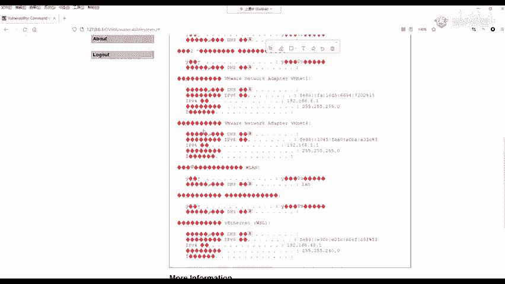

，这里大家可以去测试，那在我们真实攻击，就是做渗透测试的时候，你怎么发现它怎么防御的呢？那就涵盖了我们测试的两种技术。第一种叫做白核测试，什么是白核测试，就是源代码。我有，我能看到你的代码。

你能看到代码，你就看这里过滤是怎么写的，这个叫做白核测试。

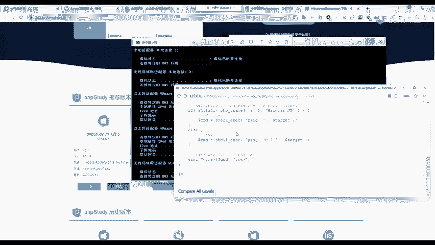

黑盒测试就是看不到源代码。黑盒测试呢占比是非常大的。比如说你去攻击百度，你能看到百度的代码吗？那别人肯定不给你是吧？你看不到，那怎么办呢？黑盒测试就是你一个一个的去试，一共就5个，你还能试多久呢？是吧？

试一试呗。是行就行，不行，那就不行。那这是白盒测试和黑盒测试的这个解决办法，大家应该能听懂吧啊，这是medium那既然它是终极，就说明它过滤的是不是太狠的，不是太狠的那下面呢我们来看hi高级的。😊。

我们来到DVWI中来到这个里面啊，提醒大家啊，在课程的最后有抽奖，大家千万不要离开。我相信我讲的大家应该能听懂，先把这个hi呢给它选中，然后到这样一个命令注入这个地方啊，再次输入杠杠的命令。

比如说我刚刚输入的这个命令，看一下行不行啊，看一下不行，说明什么，说明他肯定把and符也给拦截了。我们实际看一下。看一下它的代码拦截的地方。

那这个拦截的地方呢是如果用户可以看到他只是把这个数组进行了拓宽，是吧？看一下。med我们是拦截了两个东西，那这里呢是拦截了多少，拦截了多少，拦截了我们所有的命令这个输入符以及常见的一些像括号呀等等。

它都拦截了。那如果用户输入内容中含有and分号竖线杠do了符，括号两个竖线，那这些符号呢就会被删掉，就会导致我们没有办法进行命令执行。但是这个地方有同学说，那老师这里不就写死了吗？我们不就不能攻击了吗？

但是啊这里是DVWI他实在没招了啊，他就写不出东西了，他给大家整了一个小花样，大家在打CTF比赛的时候，可能会遇到这样的情景。你会看啊，这在开发中经常遇到有的开发者啊他就无缘无故的就喜欢敲空格。

它没事啊，他就按。空格键大家看一下这个地方他写的，你要仔细看。他这个竖线。它是拦截的什么竖线加上一个空格。哎，它在这里啊，它多敲了一个空格。那说明啊它只能拦截竖线加空格，你单独一个竖线，你别跟空格。

它是拦不了的。我给大家看一下，你就知道啊，这这一点很搞笑啊，就是叫你开发的时候也要认真你写代码，你不能呃总是呃乱敲空格是吧？我给你看一下，比如说我加个竖线啊，后面呢加个呼MI哈，加个户MI。😊。

Yeah。然后我直接看我竖线加空格，因为大家在敲的时候，就包括我自己也经常的会敲空格是吧？一开始我给大家演示的第一个是不是我中间就敲了很多空格，因为敲空格并不会影响，但是你在代码中乱敲空格就不一样了。

你看我现在啊这一个是啊感谢大家的点赞啊，我这里是一个竖线加空格，看这有个空格啊，看到没？我subit就不行，它就不行。但是有你现在啊你把这个空格啊，你给它去掉。😊，哎。

我给它连起来看这个竖线跟I后面你不要加空格。不要加空格，你加不加都不会影响使用。喺时。那，等一下看是不是出结果了，这就是hoM的执行结果。同样的，你可以再整其他的命令。

有同学说这个呼M蚂啊看的不明显是吧？看的不明显，没关系，你可以加另外一个。比如说加其他的像DIR，就是你看一下它的目录中啊，有哪些东西。看一下。

你看一下这个是不是在这个这个目标地盘下面这个文件夹中有这些文件啊，这些就是命令的执行结果。说明啊这个开发也是需要非常细心的啊，这是hi跟medium是一样的。我们可以看到这个hiide这样一个脚本中。

它缺少对数线的检测。那代码中呢是一个数线加空格，它并不会影响一个单独数线的正常使用啊这个哈呢就是在绕弯子啊，它没有任何的效果，就它没有起到任何技术性的突破。

那我们下面呢就来看在开发中应该采用什么样的算法去防御这个命令执行漏洞，这是一个算法规范，叫做impposible不可能的，就是你绝对大不了啊。大家如果你在DVWI的imposible中。

你就是利用这单独的这个漏洞哈，你不要和其他的相结合，有同学说老师我攻击它搜ho住入漏洞，然后拿到它权限了，我也能攻击它，不能这样，就单独对这个imppoible命令执行的这个页面你去攻击。

如果你攻击成功，那你就找到了PHP它的漏洞，那你就厉害了，可以告诉大家是不不可能攻击的啊，这是imppo。不可能来看他怎么防御。首先。我们在这个地方调制imppoible。

点击提交回到我们的comman injectionject中。在这个地方，不论你怎么去执行都不行。我换成什么都不行。为什么不行呢？因为它这里采用的一个方法是一个标准的防御典范。我们来看一下。

可以点击这边的vivo source，你能看到这代码就多很多了。我给大家讲一下这个代码它到底搞了什么事情，来看一下哈。我给你截取下来了。首先上面的这些你看不懂看不懂的东西怎么办？就不要看。

我们就看关键点就行啊。你不要在意说一个代码我全部都得看懂，从头看到尾这不可能的什么开发也没有这样做的。要学会阅读代码。那我们还是看关键点，首先还是这个REP。

我们把REP呢复值给这个doller target这个变量。复制之后，然后他做了几个操作来看第一个叫做export，然后下面呢用了这个函数，在后面啊用了这些大家一看，好像很懵逼。这个懵逼其实没关系。

这只是提供了一个算法思路，它是用PHP去实现的而已。我们下面就给大家具体分析一下。我保证每一个人都能听懂，你不会PHP也没关系。大家看好这个算法。啊，首先我把这个关键的这一点就关键的这四行啊。

就是多出来这四行呀给它单独拿到了这边。我们来看第一步，他做了triip，这样一个函数做什么呢？就是去除用户所输入的反斜杠。有的用户啊，他为了去转译这些特殊字符可能会加上反斜杠，他先给你去掉。

防止影响后面的操作，我先给你把无关紧要的给删掉。你想一下，开发者原本的意图是干什么，他想让你去拼一个地址检测连接，其他的你都不要干，我要你输入的就是个REP地址，其他的你别乱输，你输出反斜杠。

我先给你干掉，我不管你输啥，先给你干掉再说啊，下面呢做了一个非常骚的操作。他使用exportode这export叫做分隔啊分隔，他把我们输入的REP地址，根据。点号分隔成四个部分。

比如说啊比如说你输入的是这个127。0。0。1中间三个点3个点，它给你分成4块。这4块呢分别是4个数字，127，第二个数字0，第三个数字0，第四个数字一，然后下面就是第二步他做的操作。第三步。

他做了一个非常典范的操作，就是看它啊它分别判断这四个数字，是不是数字，判断它是不是数字，懂吗。第一个，他判断127是不是数字，因为你IP地址肯定四个都是数字是吧？你不可能出现其他的，你输个and在那了。

你输一个数杠在那了，那是啥呀？那肯定不是数字呀，是吧，他就直接干掉你了。他首先判断127是不是数字，是的，就是这里判断的，然后判断零是不是数字，是的，判断零是不是数字也是的。

然后再判断这一个一是不是数字，在四个都满足之后，就四个都是数字，证明你输入的就是个IP地址，然后他又做了一个更其他的第最后一步验证，就是他验证啊你输入的是不是四个数字。因为IP地址肯定是4个数字组成的。

它判断你输有没有输4个。因为我们刚刚比如说跟上呼MI，你输了多少，你不是输了5个东西是吧？你输了5个东西，他判断一下是不是。必须要满足这些条件之后，他才会放弃你，不然你乱搞事情。

就你输一个不是数字的东西，你就说不输呼I，好吧，不输呼I骂我就输个ABCD都不行。别说符号了，我就输个A都不行啊，他就直接给你干掉。然后在验证完之后，这四个数字是不是被我们分开了。

让他做了后面一件事情就是在把这四个数字啊用点用三个点啊给拼起来，再拼成原本的IP地址，现在再去拼它，我请问这种方法有可能绕过吗？你有什么解决办法能攻击他吗？可以告诉大家。防御正入其名，不可能被攻击。

这是安全开发人员的典范。不论是PHPGSP导net等等，所有的后端语言都可以利用其中的函数实现相应的算法啊，就是我判断先把你的IP啊4个数字给取开分别判断是不是四个数字。如果都是的。

我再给你用点啊合起来。这个你误解吧，我问一下来应该能听懂吧。有没有同学听不懂，你可以大胆的告诉我啊，听不懂也可以单独找我啊。没关系，我相信大家肯定能听懂。

这个就是impposible啊imposible这个漏洞利用。OK那大家呢啊这学到这里，你对个DVWI的这样一个命令执行漏洞，还有同学不会用吗？现在DVWI你还不会安装吗？还不会去攻击这些RCE漏洞吗？

我相信每一个同学肯定都会。如果你不会，你课后单独的跟班主任说啊，班主任说啊，我单独跟你讲，应该都会吧。啊，行，那这就是命令注入4个以及开发人员怎么防御。如果你现在还在做开发，整天划水的话。

你赶紧的用这个算法给它防御起来吧啊，这里呢在华为小米路由器中，它的后台也都是这样写的。他们是没有漏洞的。因为华为的工程师是非常注重安全开发的OK那这就是命令执行漏洞。那这个命令执行漏洞给大家回顾一下。

那本节课是讲解了从DVW的安装以及到命令执行的漏洞攻击和命令执行漏洞的防御。我们用最简单的方式来领带领大家了解的这个危害巨大的命令执行漏洞，以及它相应的利用方法。那有同学到这里啊告诉我。

那老师这里好像没有什么结果呀，是吧？我就这一个命令能有啥呢？我想拿他的CMD怎么办？我现在给大家演示一下，你怎么拿到它的CMD大家看看我的操作。首先我先把杀毒软件关掉。

因为我这里啊是给大家演示这个内容我现在不会讲啊，我现在不会讲。我们调到漏级别。啊看我操作。然后加上一句话啊，我现在打开一个公积机，打开一个公积机。这个公积机啊就是一个黑客他所用的机器。

大家看到黑客啊花里胡哨的，我现在执行一个命令。

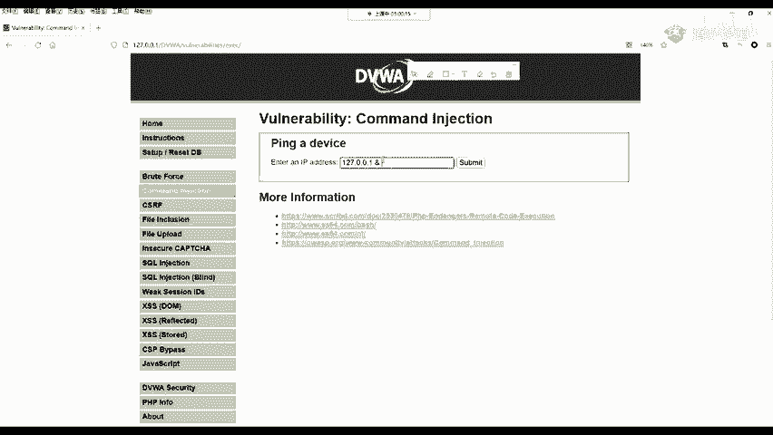

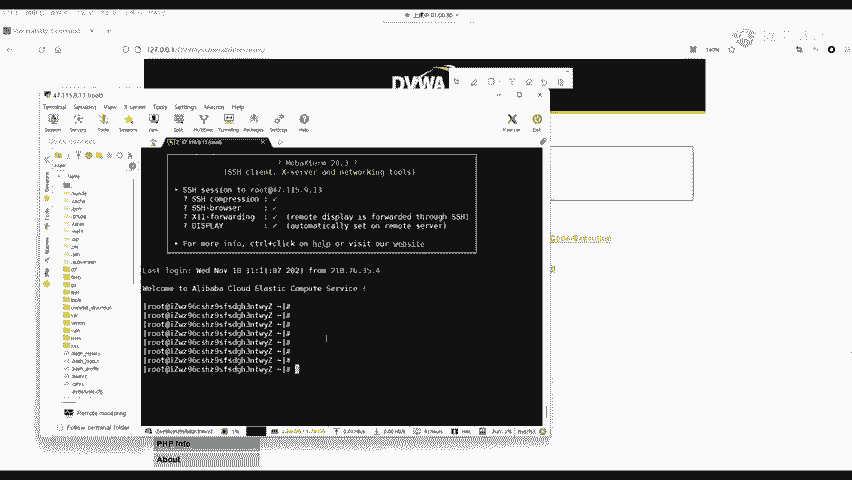

然后在这边我也执行一个命令。Okay。大家看就这一个输入框，它的这个呃危害会有多大嗯。大家看一下。当然这个地方是一个简单的一个命令啊，我现在也不会去讲这个它并不是命令执行的内容。来看好这个输入框。

我输入这一串东西，我点击提交看我这边黑客的机器来看好。

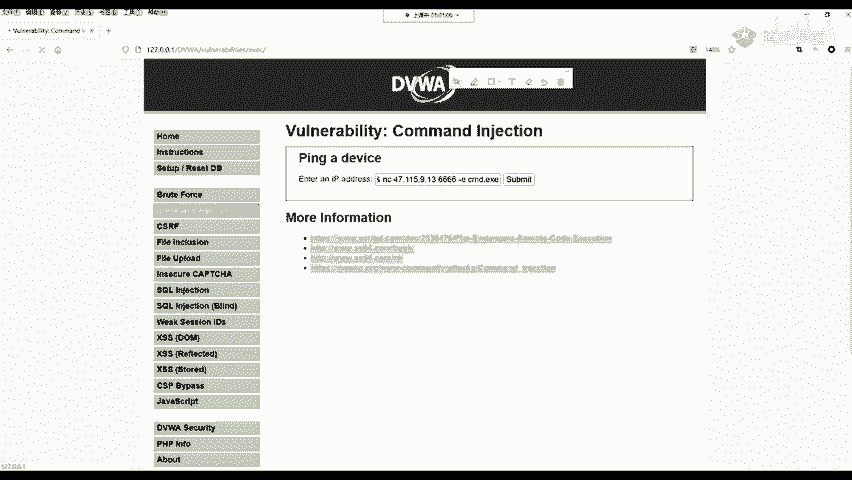

你看我拿到的是啥呀？😊，看到没？我直接把他的CMD给拿到了，就这样的话，你就相当于在本地打开的这个CMD别人黑客啊把你的这个CMD给拿到了。有同学说反弹端口啊，非常对啊。

在这里你就可以跟真正的CMD一样去敲击这些命令。比如说我想看它C盘中有哪些内容。我想把它C盘中的东西给它删了，都可以，随便你啊，想执行什么执行什么。😊，想执行什么审审审么？以及查看它的系统版本。

看一下它蓝牙有没有开呀，它是什么操作系统啊，它又用的是win11还是win10啊，都能看到啊，这些东西可以看到一个小小的输入框，它就可以造成如此大的危害。

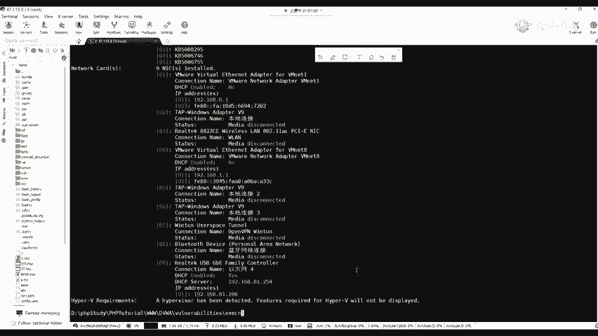

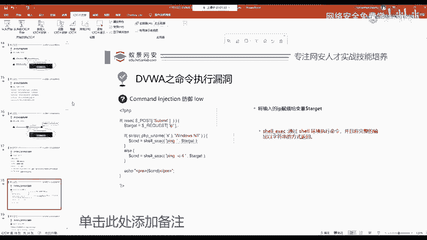