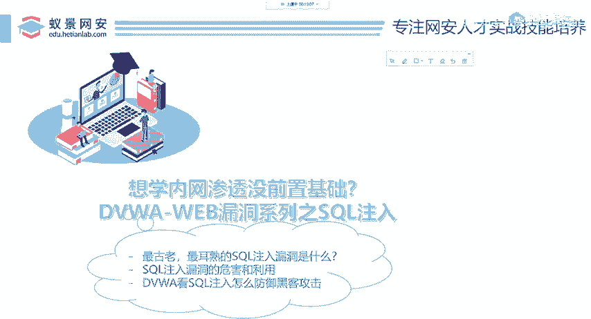
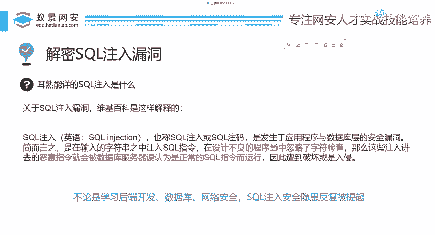
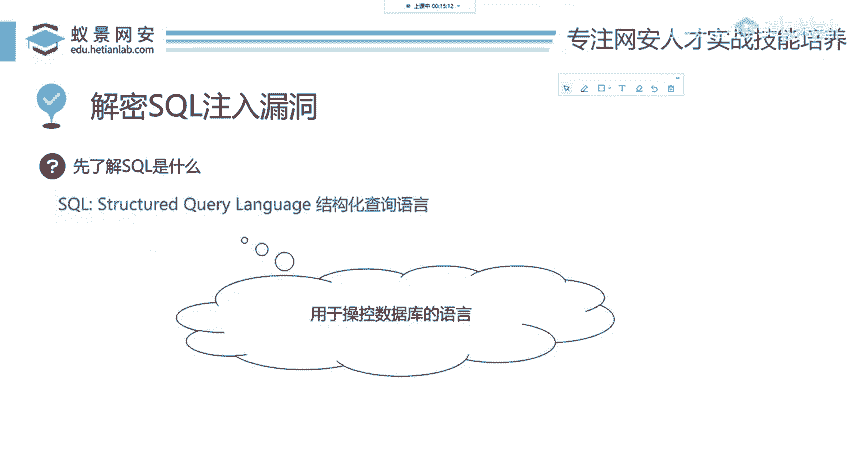

# 2024B站最值得看的黑客教程 ｜ 网络安全／渗透测试／内网渗透／漏洞挖掘／web安全／kali linux／红队靶场／CTF／信息安全 - P63：解密SQL注入漏洞 - 网络安全免费学 - BV1uBsTetEow

下面呢来讲这个scle注入。我们本节课呢就是分为三点，大家千万不要担心，就和昨天的课程一样，你会发现你完全不懂安全，你也能掌握命令执行漏洞。那今天呢我们首先带领大家了解这个soccle注入啊。

到底是有什么东西。第二点呢，我们来看这个漏洞，应该怎么去打它，怎么去攻击，怎么去拿到目标的这个数据库。第三点呢就是给大家讲解你在开发的过程中，怎么去修复这些漏洞，以及避免这些漏洞的产生。

O那我们下面呢来分别解决这三个学习目标。首先先给大家讲ciqcle到底是什么东西。那关于cicle注入漏洞呢。

一个权威的伪基百科是这样解释的那scle注入英语叫做cicle injection意思呢就是在开发者中设计程序的时候，忽略了字符。

检查。那么呢这些黑客就可以输入恶意指令。那这些恶意指令呢会被数据库服务器误认为是正常的cicle指令而运行。于是呢我们的系统或者是网站就会遭遇破坏或者是入侵。讲到这里啊，这是一个概念性的知识。

那有同学呢可能不了解这个SQL搜cle到底是什么东西。我下面呢做一个简单的介绍。那不论是在学习后端开发数据库管理，网络安全，这个搜cle注入啊都是反复被提起，不论是各种书籍或者是各种培训机构的视频。

大家在学习开发像PHP开发加va开发，都会听到老师讲过搜cle注入啊到底是个什么东西，我们先快速看一下，先了解SQL它是什么，我先给大家讲。

SQL是一门语言，它的作用是用于操控数据库，就像就像人与人之间的交流，是不是要通过汉语或英语相同的语言去交流？那一个开发人员想编写一个网站，他就要用到后端的脚本语言。

比如说像PHD像java像python等等。那这里呢如果一个开发者想去操控soco数据库，他就要用到这样一个SQL语言SQL的全称叫做结构化查询语言。在很多的数据库中都使用了这样一个语言进行操控啊。

我们今天呢并不去讲soco数据库是怎么用的。我们要讲的是怎么攻击soco助漏洞啊，大家一定要清楚。

