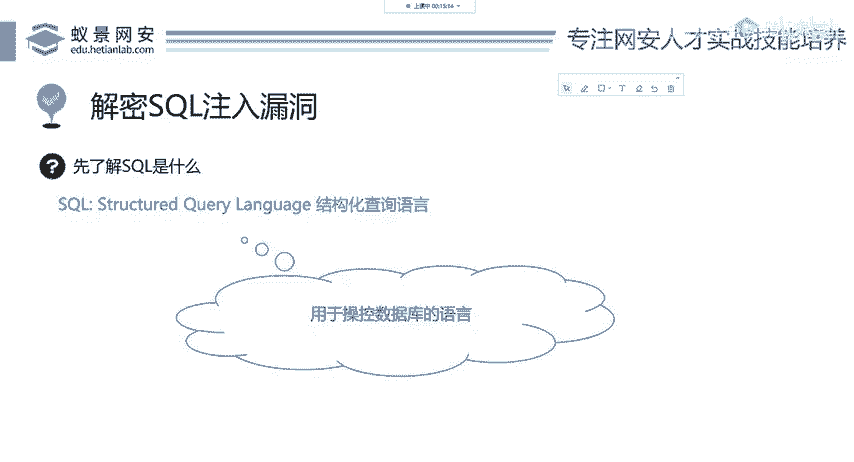
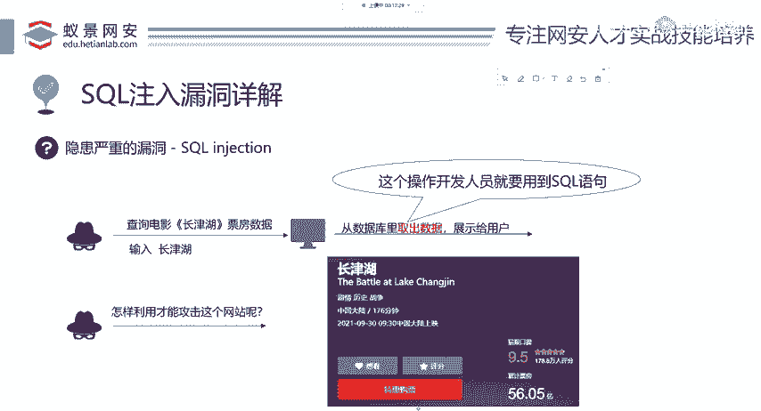
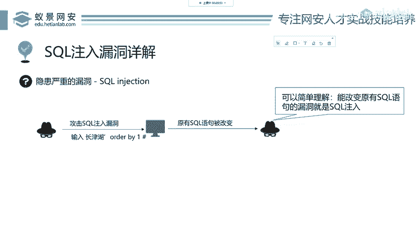

# 2024B站最值得看的黑客教程 ｜ 网络安全／渗透测试／内网渗透／漏洞挖掘／web安全／kali linux／红队靶场／CTF／信息安全 - P64：SQL注入漏洞详解 - 网络安全免费学 - BV1uBsTetEow

好，我们下面先给大家讲ciQ注入漏洞为什么会产生啊，大家请注意听。如果你有任何听不懂的地方，可以随时在我们的腾讯课堂讨论区提问。我这边能够清楚的看到，并且给予大家解答。首先我们来看一个正常的操作。

正常操作，现在有一个非常火的电影叫长津湖。很多同学啊应该都看过了。那我们可以通过一些网站，比如说美团电影、猫眼电影去查询长津湖这个电影的实时票房数据。那这个数据是存放在哪里的呢？我们想数据库数据库。

数据库它之所以叫数据库，它是干什么呢？不就是存放数据的吗？是吧？这个很显然，不然它会什么叫数据库。那所以说呢这些票房的这些数据，包括它的评分等等，都是存放在网站后台的数据库中。

我们查询长津湖的票房数据就是在网页中输入长津湖三个字我们输入长津湖，然后这个服务器网站结束之后，它就会非常乖乖的从数据库里取出数据，并且展示给用户。那为什么这网站会这样做呢？其实这些是开发人员所写的。

也就是说从数。数据库取出数据，这个操作开发人员就需要用到soco语句啊，就需要用到这个搜cle语句。那现在我们要想作为一个黑客，你应该如何去攻击这个网站呢？我们从上一节课的命令执行。

我们就会发现一个黑客，你就是不按照常理来，上一节课我们讲命令执行，让你输入一个IP地址，一般的用户正常的网络浏览者，他会直接乖乖的输入一个IP地址。但是作为一个渗透测试人员作为一个黑客。

你就要想我能不能输入一些其他的东西啊，这里就是关键所在。我们来看这是最正常的一个流程，现在是没有漏洞的。那我们来想一下，依照这个语句。这个后台开发人员是怎么写的这个搜狗语句呢？我们应该猜想一下。

我们来看先想象一下这个开发人员是怎。

样从数据库中查询语句的那这里呢就用到了soco数据库语句的一个基础。如果你没有的话，完全没关系。我告诉你就是简单的英语。我们先来看。首先select选择查询take number就是什么啊票房数据是吧？

就是票的个数，从哪里从哪里查找呢？从这一个啊电影的数据里面去查找这个票票数，查找哪一个电影呢？呃，movie name等于长津湖哎，这个长津湖这三个字就是我们用户所输入的数据。来看一下。

take number是票房数据，movie data是电影信息数据库。然后movie name呢是电影名称，长津湖就是我们正常用户所输入想要查询的电影。那这里总结出来，我们把这几个英语简单的翻译一下。

那就是从电影信息数据库中查询电影名称为长津湖的票房数据。这个地方大家有听不懂的吗？你听不懂，你可以在讨论区提出你的问题啊，可以跟老师交互，这边是直播啊，我能看到的给大家看一下啊，我能看到的。啊。

如果没问题的话，我们会继续往下讲哈，继续往下讲，这是第一个正常的操作。我们现在想长津湖，我不这样输入，我输个其他的，输个什么呢？大家先看啊，为什么输入这个我后面会讲啊，先来看。首先第一个，作为一个黑客。

你要怎么做？我要改变这个数据，我输入一个长津湖，然后一个单引号，加上out byE井号，我输入这个东西。为什么我要输入它？一会儿会告诉大家，因为输入它之后，我们本身的这个查询语句是不是发生了变化。

也就是说我我们改变了原本这个开发人员想让我们输入的是一个呃电影名称，但是我现在不按套路出牌，我在后面呢又加了几个英语。那这个时候搜cle语句会发生什么变化呢？啊。

这个时候我们用户输入的数据为长津湖单引号out by一井号。那这个时候原本开发人员已经写好的socle查询语句就发生了变化。它不仅查询了长津湖的票房，而且还执行了一个out by一这个语句。

这个语句是谁执行的，是谁执行的，是你执行的啊，就是你让这个后台执行的而开发人员他并不想去执行这个东西。他已操控了开发人员江南日。那我们来看scle注入，它其实是什么呢？这很好理解。

我们输入一个特殊的啊一个一段英语啊，一段socle语句，导致原有的socle语句被改变。这里指的原有的socle语句是指开发人员已经写好的socle语句被改变了啊。

那这个构成过程就叫做socle注入漏洞，就可以简单理解能改变原有socle语句的漏洞，就是cicle注入。

こ。